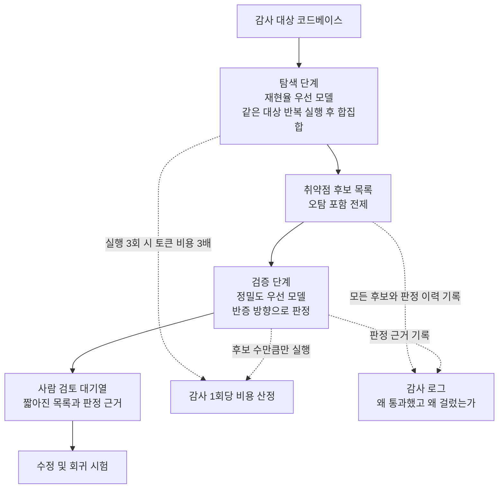

*넓게 훑는 빛과 또렷하게 비추는 빛은 같은 빛이 아니었습니다.*

## 왜 읽어야 하나

소스 코드 보안 감사에 언어 모델을 파이프라인으로 붙이려는 보안 엔지니어와 플랫폼 담당자를 위한 글입니다. 결론을 먼저 말씀드리면, 이번 벤치마크에서 취약점을 가장 많이 찾아낸 모델과 보고를 가장 믿을 수 있는 모델은 서로 다른 모델이었고, 따라서 실무의 질문은 어느 모델이 최고냐가 아니라 어느 단계에 어느 모델을 두느냐입니다.

모델 하나를 골라 감사 전체를 맡기는 설계는 이 수치 앞에서 성립하지 않습니다. 재현율이 가장 높은 모델을 고르면 오탐이 따라오고, 정밀도가 가장 높은 모델을 고르면 놓치는 취약점이 늘어납니다. 아래에서는 공개된 숫자를 그대로 놓고 이 상충을 어떻게 설계로 흡수할지 정리하겠습니다.

## 개요

보안 연구자 Philippe Dourassov가 8월 13일 자신들의 사이버보안 벤치마크에 DeepSeek V4 Pro 0813을 올린 결과를 공개했습니다. 이 모델은 취약점 발견에서 다른 모든 모델을 앞섰습니다. pass@3 기준으로 벤치마크에 담긴 CVE의 87.5%를 재발견했고, 같은 조건에서 Opus 5와 Qwen 3.8은 나란히 81.3%였습니다.

여기까지만 인용하면 깔끔한 1위 기사가 됩니다. 그런데 같은 발표에 두 개의 숫자가 더 있습니다. 이 모델이 보고한 취약점 중 실제로 유효한 것은 65.6%에 그쳤고, 정밀도에서는 GPT-5.6-Sol이 86.4%로 앞섰습니다. 그리고 단일 실행 기준으로는 평균 58.3%의 취약점만 찾아냅니다.

세 숫자를 같이 놓으면 그림이 완전히 달라집니다. 87.5%라는 헤드라인은 세 번 돌려서 합집합을 취한 값이고, 한 번 돌렸을 때의 기댓값은 그 3분의 2 수준이며, 찾아온 것 중 3분의 1은 사실이 아닙니다.

측정 대상이 된 모델 자체도 짚어두겠습니다. DeepSeek V4 Pro 0813은 8월 12일 정식 출시된 갱신판으로, 1.6조 파라미터 중 49B가 토큰마다 활성화되는 Mixture-of-Experts 구조입니다. 개발사는 Terminal Bench 2.1 점수가 72.1에서 87.9로, DeepSWE가 12.8에서 62.7로 올랐다고 밝혔고, 외부 지표인 Artificial Analysis Intelligence Index는 45에서 53으로 상승했습니다. 다만 이 발표 수치들에 대해서는 독립 검증이 필요하다는 지적이 함께 나오고 있고, 일부 보도는 일반 벤치마크에서의 성적이 기대에 못 미쳤다고 전합니다. 그런 상황에서 제3자가 자체 벤치마크로 낸 보안 영역 결과라는 점이 이번 수치의 무게를 다르게 만듭니다. 개발사가 고른 지표가 아니기 때문입니다.

*같은 벤치마크의 두 지표에서 1위가 뒤바뀝니다. 각 패널에는 해당 지표가 공개된 모델만 표시했습니다.*

## 무엇이 측정된 것인가

수치를 해석하기 전에 두 지표가 무엇을 재는지 분리해야 합니다.

재현율은 벤치마크에 심어둔 실제 CVE 중 모델이 몇 개를 다시 찾아냈는지를 봅니다. 감사자 입장에서는 놓침의 반대말입니다. 이 값이 낮으면 감사를 돌렸는데도 취약점이 남아 있습니다.

정밀도는 모델이 취약점이라고 보고한 것 중 실제로 취약점인 비율입니다. 이 값이 낮으면 사람이 확인해야 할 후보 목록이 길어집니다. 65.6%라는 값은 보고 세 건 중 한 건이 헛것이라는 뜻이고, 감사 대상이 커질수록 이 비용은 선형으로 늘어납니다.

*두 모델은 경쟁 관계가 아니라 서로 다른 사분면에 있습니다. 그래서 둘 중 하나를 고르는 문제가 아닙니다.*

pass@3라는 조건도 그냥 넘어갈 수 없습니다. 같은 대상에 모델을 세 번 돌려 그중 한 번이라도 찾아내면 성공으로 집계하는 방식입니다. 단일 실행 평균이 58.3%인데 pass@3가 87.5%라는 것은 실행마다 찾아내는 항목이 상당히 달라진다는 뜻입니다. 이 편차 자체가 이 모델의 성격입니다. 발표자도 이 모델이 다른 모델보다 훨씬 탐색적이고 특정 기능을 파고들 때 더 깊이 들어간다고 설명했습니다. 깊게 파고드는 대신 매번 같은 곳을 파지는 않는 것입니다.

운영 관점에서 이 조건은 비용으로 직결됩니다. 87.5%를 실제로 얻으려면 추론을 세 번 돌려야 하고, 그만큼 토큰 비용과 감사 소요 시간이 늘어납니다. 벤치마크 표에서는 pass@3가 한 칸이지만 예산 표에서는 세 배입니다.

편차가 크다는 사실은 뒤집어 보면 실행 횟수가 조절 가능한 손잡이라는 뜻이기도 합니다. 매번 같은 것만 찾아내는 모델이라면 두 번 돌리든 열 번 돌리든 결과가 같아서 추가 비용이 순수한 낭비입니다. 실행마다 다른 곳을 파고드는 모델은 횟수를 늘릴수록 합집합이 넓어집니다. 단일 실행 58.3%에서 세 번 실행 87.5%로 올라간 폭이 그 증거입니다. 다만 이런 누적은 대개 뒤로 갈수록 둔해지므로, 네 번째와 다섯 번째 실행이 얼마나 더 보태주는지는 별도로 재봐야 합니다. 공개된 자료에는 pass@1과 pass@3만 있어 그 곡선의 모양까지는 알 수 없습니다.

실무에서는 이 손잡이를 감사 대상의 중요도에 맞춰 돌리는 편이 합리적입니다. 결제나 인증처럼 취약점 하나의 대가가 큰 모듈에는 실행 횟수를 늘리고, 변경이 잦지만 위험도가 낮은 영역은 한 번으로 끝내는 식입니다. 모든 코드에 같은 횟수를 적용하는 설정은 비용과 누락 양쪽에서 손해를 봅니다.

마지막으로 이 벤치마크가 재는 것이 재발견이라는 점을 기억해야 합니다. 이미 발견되고 CVE 번호까지 붙은 취약점을 모델이 다시 찾아낼 수 있는지를 보는 방식입니다. 실무에서 감사를 돌리는 목적은 대개 아직 아무도 모르는 취약점을 찾는 것이므로, 두 과제가 완전히 같지는 않습니다. 알려진 취약점은 그 패턴이 공개 문서와 패치와 기술 블로그에 흩어져 있고 모델이 학습 과정에서 그 흔적을 봤을 가능성을 배제하기 어렵습니다. 재발견 성적이 좋다고 미발견 취약점 탐지 능력이 같은 비율로 따라온다고 단정할 수는 없습니다.

그래도 이 측정이 무의미한 것은 아닙니다. 재발견조차 못 하는 모델이 새 취약점을 찾아낼 가능성은 낮으므로 하한선으로는 유효하고, 무엇보다 여러 모델을 같은 조건에서 줄 세우는 용도로는 충분합니다. 이 글이 다루는 것도 절대 수준이 아니라 모델 간 상대 순위와 그 순위가 지표에 따라 뒤집힌다는 사실입니다.

## 재현율과 정밀도를 한 모델에 몰지 않는 설계

숫자가 이렇게 갈리면 해법은 모델 선택이 아니라 파이프라인 분할입니다. 널리 훑는 단계와 걸러내는 단계를 분리하고, 각 단계에 그 지표가 강한 모델을 배치하는 방식입니다.

탐색 단계에는 재현율이 높은 모델을 놓습니다. 오탐이 섞여도 상관없습니다. 이 단계의 목적은 후보를 빠뜨리지 않는 것이고, 실제로 DeepSeek V4 Pro 0813처럼 탐색적인 모델이 여기에 맞습니다. 필요하면 같은 대상에 여러 번 돌려 합집합을 만듭니다.

검증 단계에는 정밀도가 높은 모델을 놓습니다. 앞 단계가 넘긴 후보 각각에 대해 이것이 정말 취약점인지 반증하는 방향으로 판정하게 합니다. 이 단계는 후보 수만큼만 돌면 되므로 전체 코드베이스를 다시 훑는 것보다 훨씬 쌉니다.

마지막에 사람이 봅니다. 두 단계를 거치면 사람에게 도달하는 목록이 짧아지고, 각 항목에 왜 통과했는지가 붙어 있습니다.

이 구조에서 중요한 것은 두 모델이 서로 다른 실패를 한다는 점입니다. 같은 모델을 두 번 쓰면 같은 맹점을 두 번 통과시킵니다. 탐색과 검증에 성향이 다른 모델을 배치해야 실제로 걸러지는 것이 생깁니다.

검증 단계를 설계할 때 흔히 놓치는 부분은 질문의 방향입니다. 후보를 넘기면서 이것이 취약점이 맞는지 물으면 모델은 대체로 동의하는 쪽으로 기웁니다. 앞 단계가 이미 취약점이라고 판단해 넘겼다는 맥락이 프롬프트에 들어 있으면 더 그렇습니다. 그래서 검증자에게는 반박을 요구해야 합니다. 이 보고가 왜 오탐인지 설명하게 하고, 반박에 실패했을 때만 통과시키는 방향입니다. 같은 모델이라도 질문을 어느 쪽으로 세우느냐에 따라 통과율이 달라집니다.

검증자에게 앞 단계의 판단 근거를 그대로 물려주지 않는 것도 같은 이유에서 중요합니다. 탐색 모델이 왜 그렇게 판단했는지를 길게 붙여 보내면 검증자는 그 논리를 이어받아 확인하는 역할로 축소됩니다. 취약점 후보의 위치와 코드만 넘기고 판단은 새로 하게 두는 편이 독립성을 지킵니다. 두 단계를 나눈 목적이 판단을 두 번 받는 것이지 한 판단을 두 번 승인받는 것이 아니기 때문입니다.

한 가지 더 붙이자면, 이 구조는 최종 재현율을 탐색 단계의 재현율 이상으로 올려주지 않습니다. 검증은 걸러내기만 하므로 앞에서 놓친 취약점은 뒤에서 살아나지 않습니다. 그래서 탐색 단계에 재현율이 가장 높은 모델을 두는 선택이 중요하고, 이 벤치마크에서 그 자리에 해당하는 것이 DeepSeek V4 Pro 0813입니다. 정밀도는 뒤에서 회복할 수 있지만 재현율은 회복할 수 없다는 비대칭이 배치 순서를 결정합니다.

## ThakiCloud 제품 적용 시사점

ThakiCloud는 Paxis를 중심으로 기업 업무를 에이전트로 자동화하고, 그 실행에 필요한 추론과 인프라를 함께 제공합니다. 보안 감사는 이 구조가 특히 잘 맞는 작업입니다.

*파이프라인을 만드는 일과 그 결과를 추적 가능하게 두는 일은 같은 비중의 과제입니다.*

Paxis 관점에서 위 2단 파이프라인은 곧 에이전트 오케스트레이션 설계입니다. Paxis는 스킬과 도구와 정책을 일급 리소스로 다루고 모든 행동을 정책 게이트와 감사 로그로 통과시킵니다. 탐색 에이전트와 검증 에이전트를 각각 다른 모델로 묶고, 후보 목록과 판정 근거를 감사 로그에 남기는 일이 별도 구현이 아니라 기본 동작이 됩니다. 보안 감사에서 이 기록은 부가 기능이 아닙니다. 왜 이 취약점을 놓쳤는지 또는 왜 이 보고를 걸렀는지를 나중에 소급할 수 없으면 감사 자체의 신뢰가 서지 않습니다. 검증 단계를 반증 방향으로 강제하는 것도 정책으로 고정할 수 있는 항목입니다.

Aegis 관점에서는 이 작업이 왜 온프레미스여야 하는지가 분명합니다. 보안 감사의 입력은 소스 코드 전체이고, 이것은 대개 기업에서 가장 민감한 자산입니다. 감사를 돌리자고 코드베이스를 외부 API로 넘기는 선택은 금융이나 공공이나 국방 영역에서는 시작부터 불가능합니다. 폐쇄망 안에서 모델을 직접 띄울 수 있어야 이 파이프라인이 성립하고, 그래서 가중치가 공개된 모델이라는 조건이 성능 수치만큼 중요해집니다.

Metis 관점에서는 비용 설계가 과제입니다. pass@3는 추론을 세 번 돌린다는 뜻이고, 1.6조 파라미터 중 49B가 활성화되는 MoE 모델을 세 번 돌리는 비용은 작지 않습니다. Metis는 모델 라우팅과 양자화로 토큰 단가를 관리하는 계층이므로, 탐색 단계는 반복 실행을 감당할 수 있게 양자화 티어를 낮추고 검증 단계는 정밀도를 지키기 위해 높은 티어를 쓰는 식의 비대칭 배치가 가능합니다. 두 단계에 같은 서빙 설정을 쓸 이유가 없습니다.

덧붙이면 이 두 관점은 서로를 필요로 합니다. 온프레미스로 돌려야 한다는 제약은 곧 쓸 수 있는 모델이 가중치 공개 모델로 좁혀진다는 뜻이고, 그 좁아진 후보군 안에서 재현율 상위 모델이 나왔다는 사실이 이번 결과의 실질적인 가치입니다. 폐쇄망에서 돌릴 수 없는 모델이 아무리 좋은 점수를 내도 금융이나 공공 고객의 감사 파이프라인에는 들어가지 못합니다. 성능 순위표와 배치 가능성 순위표는 다른 표이고, 실무에서 쓰는 것은 두 표의 교집합입니다.

Signum 관점에서는 감사 결과가 흘러가는 곳이 문제입니다. 취약점 후보와 판정 이력은 그 자체로 민감한 정보이고, 누가 언제 무엇을 열람했는지가 남아야 합니다. 감사 파이프라인의 산출물에 접근 통제와 감사 이벤트를 붙이는 일은 파이프라인을 만드는 일과 같은 비중으로 다뤄야 합니다.

## 한계 및 반론

이 결과를 확대 해석하지 않기 위해 짚어야 할 것들이 있습니다.

가장 먼저, 벤치마크 하나입니다. 연구자 한 팀이 자체 구축한 CVE 재발견 벤치마크에서 나온 결과이고 독립적으로 재현되지 않았습니다. 벤치마크에 담긴 CVE의 종류와 코드베이스의 성격에 따라 순위는 얼마든지 바뀔 수 있습니다. 특히 재발견 방식의 평가는 학습 데이터에 해당 CVE가 포함됐을 가능성을 완전히 배제하기 어렵습니다.

둘째, DeepSeek V4 Pro 0813의 공개 벤치마크 주장 전반이 아직 독립 검증을 기다리는 상태입니다. 개발사는 Terminal Bench 2.1이 72.1에서 87.9로, DeepSWE가 12.8에서 62.7로 올랐다고 밝혔고 Artificial Analysis 지표는 45에서 53으로 올랐습니다. 다만 이 수치들에 대해 외부 검증이 필요하다는 지적이 함께 나오고 있으며, 일부 보도는 이 모델이 일반 벤치마크에서는 오히려 기대에 못 미쳤다고 전합니다. 보안 영역의 강세를 모델 전반의 우위로 옮겨 읽으면 안 됩니다.

셋째, 온프레미스 배치를 전제로 검토하신다면 확인이 필요한 항목이 있습니다. DeepSeek 계열은 MIT 라이선스로 가중치를 공개해 왔지만, 0813 체크포인트의 가중치 공개는 공식 저장소에서 확인되지 않습니다. 해당 저장소에는 4월 프리뷰 가중치가 올라가 있고 8월 커밋이나 0813 태그가 보이지 않는 상태입니다. 커뮤니티가 만든 GGUF 변환본은 존재하지만, 이것을 공식 배포와 동일하게 취급하는 것은 위험합니다. 자체 호스팅 계획을 세우기 전에 이 항목부터 확정하시기 바랍니다.

넷째, 65.6%라는 정밀도가 실무에서 감당 가능한 수준인지는 감사 규모에 달려 있습니다. 후보가 수십 건이면 사람이 걸러낼 수 있지만 수천 건이면 경보 피로가 먼저 옵니다. 2단 파이프라인은 이 문제를 줄이지 그 자체로 없애지는 않습니다.

다섯째, 이 글에서 제안한 2단 구조는 위 수치에서 도출한 설계이지 저희가 측정한 결과가 아닙니다. 탐색과 검증을 분리했을 때 실제로 최종 정밀도가 얼마나 오르는지는 대상 코드베이스에서 직접 재봐야 합니다.

## 정리

이번 벤치마크가 남긴 것은 새로운 1위가 아니라 1위가 두 개로 갈라졌다는 사실입니다. DeepSeek V4 Pro 0813은 취약점을 가장 잘 찾아냈고, 그 보고를 가장 믿을 수 있는 모델은 따로 있었습니다. 게다가 헤드라인 수치는 세 번 실행한 합집합이고 한 번 실행하면 그 3분의 2 수준으로 내려갑니다.

그래서 서두의 질문으로 돌아오면, 감사 파이프라인에서 모델을 하나만 고르는 선택 자체가 잘못 설정된 문제입니다. 넓게 훑는 자리와 걸러내는 자리는 요구하는 성질이 반대이고, 한 모델이 두 자리를 동시에 잘하리라 기대할 근거가 이번 수치에는 없습니다.

다음 행동을 하나만 고르신다면, 지금 쓰고 계신 감사 도구의 출력에서 오탐 비율을 한 번 세어보시기 바랍니다. 그 값이 이번 벤치마크의 65.6%와 비슷하거나 그보다 나쁘다면, 모델을 바꾸기 전에 검증 단계를 하나 더 붙이는 쪽이 먼저입니다. 단계를 늘리는 비용이 모델을 바꾸는 비용보다 대개 쌉니다.

## 출처

- [Philippe Dourassov의 벤치마크 결과 공개 게시물](https://x.com/pilvar222/status/2087691659953815783)
- [DeepSeek의 V4 Pro 개선판 출시 및 에이전트 소프트웨어 오픈소스화, The Decoder](https://the-decoder.com/deepseek-launches-an-improved-v4-pro-model-raises-api-prices-and-makes-its-agent-software-open-source/)
- [DeepSeek V4 Pro 0813 정식 출시와 검증 대기 중인 벤치마크 주장, TechTimes](https://www.techtimes.com/articles/324241/20260813/deepseek-v4-pro-0813-goes-ga-benchmark-claims-await-independent-proof.htm)
- [DeepSeek V4 Pro 지표 분석, Artificial Analysis](https://artificialanalysis.ai/models/deepseek-v4-pro)
- [DeepSeek의 V4 Pro 갱신판에 대한 보도, South China Morning Post](https://www.scmp.com/tech/big-tech/article/3363895/deepseeks-updated-v4-pro-ai-model-struggles-benchmarks-shines-cybersecurity)
