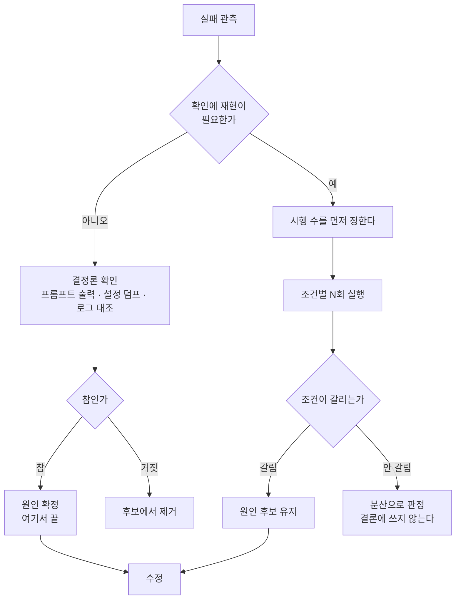

이미지 생성 파이프라인을 운영하고 계신다면, 실패를 한 번 보고 원인을 지목하는 습관이
어디까지 안전한지 점검해 보실 만합니다. 결론부터 말씀드리면 대개 안전하지 않습니다.
저희는 그렇게 원인을 두 개 찾았고, 각각 세 번씩 더 돌려본 뒤에 하나가 존재하지 않는
원인이었다는 것을 알았습니다.

이 글은 그 과정에서 나온 세 가지를 다룹니다. 원인 후보를 확인 비용으로 정렬하는 방법,
유사도를 재는 검증 게이트가 구조적으로 놓치는 실패 모드, 그리고 프롬프트에 아예 없던
정보를 찾아내는 방법입니다. 셋 다 캐릭터 파이프라인 밖에서도 그대로 적용됩니다.

## 다루는 문제

캐릭터 이미지 한 장을 기준으로 여러 각도의 뷰를 만드는 작업입니다. 게임과 애니메이션에서
턴어라운드라고 부르는 것으로, 정면 한 장에서 3/4, 측면, 후면을 뽑아 캐릭터가 어느 방향에서
봐도 같은 인물이 되도록 만듭니다.

기술적으로는 이미지 편집 API에 기준 렌더를 레퍼런스로 넘기고, 프롬프트로 카메라 각도만
바꾸라고 지시하는 형태입니다. 저희 조건은 1024 픽셀에 품질 상위 설정이었고, 뷰 한 장에
113초에서 124초가 걸렸습니다. 네 뷰 턴어라운드가 약 8분입니다.


*최종 결과입니다. 왼쪽부터 정면, 3/4 정면, 측면, 3/4 후면, 후면.*

여기까지 오는 동안 네 뷰 중 둘이 실패했습니다. 3/4 정면은 거의 제자리였고, 3/4 후면은
카메라가 뒤로 가지 않고 얼굴이 계속 정면을 봤습니다.

## 원인 후보 두 개

첫 번째 후보는 프롬프트 배선이었습니다. 저희 편집 래퍼는 입력 이미지마다 역할을 붙일 수
있습니다. "이 이미지는 캐릭터 정체성이니 실루엣과 팔레트를 그대로 재현하고, 포즈와 카메라
각도는 무시하라"는 지시가 역할 문단에 담깁니다. 그런데 그 문단을 이미지가 두 장 이상일
때만 프롬프트에 붙이도록 짜여 있었습니다. 턴어라운드는 기준 렌더 한 장만 넘기므로 역할이
조용히 사라졌고, 모델은 카메라를 움직여도 된다는 말을 애초에 듣지 못했습니다.

두 번째 후보는 뷰를 서술한 문구였습니다. 성공한 두 뷰는 "full profile side view",
"straight-on back view"처럼 카메라의 이름을 부르고, 실패한 두 뷰는 "body turned 135
degrees from camera"처럼 회전을 각도로 서술합니다. 각도 표현이 모호해서 모델이 안전한
쪽으로, 그러니까 원본과 비슷한 쪽으로 해소한 것 아니냐는 가설이었습니다.

두 번째가 훨씬 그럴듯해 보였습니다. 표로 정리하면 네 줄이 깔끔하게 나왔고, 뷰 정의를
"무엇이 보이는가"로 바꿔 다시 돌리자 두 뷰 다 통과했습니다. 확인됐다고 생각했습니다.

## 재현되지 않았습니다

발행용으로 고치기 전 상태의 이미지가 필요해서 옛 문구를 한 번 더 돌렸습니다. 정상적인
후면 뷰가 나왔습니다.

그래서 같은 기준 이미지에 옛 문구 세 번, 새 문구 세 번을 돌렸습니다.


*윗줄이 옛 문구, 아랫줄이 새 문구입니다. 여섯 장 모두 카메라가 뒤로 갔습니다.*

여섯 장 전부 정상이었습니다. 프레임이 기준 렌더에서 얼마나 달라졌는지를 수치로 재보면
옛 문구 평균 0.109, 새 문구 평균 0.113으로 두 조건이 갈리지 않습니다. 그리고 원래
실패했던 그 뷰는 0.073으로, 여섯 장이 만든 0.104에서 0.117 사이 구간 바깥에 혼자
떨어져 있었습니다.


*왼쪽은 최종 턴어라운드 네 뷰의 변화량, 오른쪽은 문구 A/B입니다. 점선이 카메라가 움직이지 않았던 그 한 번입니다.*

문구가 만든 차이가 아니라 드물게 나오는 뽑기였습니다. 저는 표를 만들 만큼 확신했는데
각 칸이 한 번의 시행이었고, 네 칸짜리 표는 데이터처럼 생겼을 뿐 데이터가 아니었습니다.

## 두 원인을 가른 것은 확인 비용입니다

두 후보는 그럴듯함에서 차이가 없었습니다. 갈린 지점은 하나였습니다. 확인하는 데 재현이
필요한가입니다.

역할 누락은 최종 프롬프트 문자열을 출력해 보면 그 자리에서 끝납니다. 모델을 부르지 않고,
확률이 개입하지 않고, 한 번 보면 참인지 거짓인지 정해집니다.

```
$ edit_image.py --input base.png --role identity --prompt "3/4 view" --emit-prompt
3/4 view
```

역할을 분명히 넘겼는데 출력에 역할이 없습니다. 반면 각도 문구는 같은 입력에 같은 출력이
나오지 않는 지점을 건드리므로, 주장하려면 시행을 쌓는 것 말고는 방법이 없습니다.

그래서 규칙은 짧습니다. 원인 후보를 세웠으면 그럴듯함이 아니라 확인 비용으로 정렬하십시오.
결정론적으로 확인되는 후보를 먼저 확인하고 거기서 끝냅니다. 확률이 끼는 후보는 시행 수를
정하고 그만큼 돌리기 전까지 결론 칸에 적지 않습니다.



여기서 실질적인 이득은 순서입니다. 결정론적 후보를 먼저 처리하면 그중 하나가 진짜일 때
확률적 후보를 아예 검증하지 않아도 됩니다. 저희는 순서를 뒤집어서 이미지 여섯 장과
12분을 더 썼습니다. 규모가 커지면 이 비용은 선형으로 늘어납니다.

### 그러면 몇 번 돌려야 하는가

시행 수를 정하라고 말하기는 쉬운데 실제로 몇 번인지가 문제입니다. 저희는 조건당 세 번을
썼고, 그 선택에는 한계가 분명히 있습니다.

세 번으로 잡히는 것은 큰 차이뿐입니다. 옛 문구가 정말 자주 실패했다면, 예를 들어 절반쯤
실패하는 문구였다면 세 번 중 한 번은 실패가 나왔을 것이고 그러면 가설이 살아남습니다.
실제로는 세 번 다 성공했고 새 문구도 세 번 다 성공했으니, 두 조건이 크게 다르지 않다는
것까지는 말할 수 있습니다. 반대로 "5퍼센트 대 3퍼센트"처럼 작은 차이는 세 번으로 절대
구분되지 않습니다. 그런 차이를 주장하려면 수십 번이 필요하고, 이미지 한 장에 2분이 드는
파이프라인에서 그건 몇 시간짜리 결정입니다.

현실적인 타협은 이렇습니다. 먼저 그 차이를 알아서 무엇을 할 것인지 정하십시오. 문구를
바꿀지 말지를 정하는 것이라면, 바꾸는 비용이 0에 가까우니 굳이 정밀하게 잴 필요가 없습니다.
읽기 좋은 쪽을 쓰고 "측정된 개선이 아니다"라고 적어 두면 끝입니다. 저희가 그렇게 했습니다.
새 문구를 유지하되 코드 주석에 이것은 측정된 개선이 아니며 근거로 인용하지 말라고 명시했습니다.

반대로 그 차이가 GPU 시간이나 아키텍처 결정을 좌우한다면 그때는 제대로 재야 합니다.
그리고 대개 이 구분만 해도 대부분의 "재볼까" 항목이 사라집니다. 재서 바뀔 행동이 없으면
재지 않는 것이 맞습니다.

한 가지는 시행 수와 무관하게 유효합니다. 실패한 한 번의 값이 성공 분포 바깥에 있었다는
사실입니다. 0.073은 여섯 장이 만든 0.104에서 0.117 구간 어디에도 들어가지 않습니다.
분포를 먼저 만들어 두면 다음에 이상한 값이 나왔을 때 그것이 이상한지 아닌지를 즉시 알 수
있습니다. 이건 통계라기보다 기준선을 갖고 있느냐의 문제입니다.

## 게이트가 실패와 같은 방향을 볼 때

더 곤란한 사실은 따로 있었습니다. 저 실패들을 저희 검증 게이트가 전혀 걸러내지 못했습니다.

파이프라인에는 정체성 게이트가 있습니다. 팔레트와 실루엣을 비교해 생성된 프레임이 여전히
같은 캐릭터인지를 점수로 냅니다. 네 뷰를 넣었더니 전부 99.8점에서 100점, 실루엣 일치도
1.0, 지적된 프레임 0건이었습니다. 정면과 프로필의 실루엣이 같을 리 없죠. 지표가
포화됐다는 뜻이고, 통과 여부로 쓸 정보가 남아 있지 않습니다.

포화보다 방향이 문제입니다. 이 게이트는 유사도가 높을수록 좋은 점수를 줍니다. 그런데
턴어라운드의 실패 모드가 바로 유사도입니다. 카메라가 안 움직인 뷰는 원본과 거의 같고,
따라서 만점을 받습니다. 게이트가 잡아야 할 실패가 게이트의 보상 함수와 같은 방향을
가리키고 있었습니다. 역할이 사라져 정면 그대로가 나온 그 뷰도 이 게이트라면 통과합니다.

이 패턴은 생성 파이프라인 어디에나 있습니다. 요약 품질을 원문과의 유사도로 재면 원문을
그대로 복사한 요약이 만점을 받습니다. 번역을 원문 보존율로 재면 번역하지 않은 문장이
이깁니다. 스타일 전이를 정체성 보존으로 재면 아무것도 바꾸지 않은 이미지가 최고점입니다.
공통점은 하나입니다. 게이트가 재는 축과 우리가 원하는 변화의 축이 반대일 때, 게이트는
아무 일도 하지 않으면서 초록불을 켭니다.

처방은 축을 하나 더 놓는 것입니다. 저희는 다운스케일한 흑백 프레임을 기준 렌더와 비교해
평균 절대차를 냅니다. 위 차트의 변화량이 그 값이고, 회전량과 대체로 같이 움직입니다.

그래서 이걸로 각도를 판정하고 싶어지는데, 그러면 안 됩니다. 실패했던 뷰도 0.073이었지
0이 아니었습니다. 이 지표가 답할 수 있는 질문은 카메라가 아예 안 움직였는가 하나뿐이고,
각도가 맞는가는 답하지 못합니다. 상관관계를 게이트로 승격하는 순간, 그 게이트를 믿는
다음 사람이 잘못된 초록불을 봅니다. 각도 정합은 여전히 사람이 봅니다. 저희는 그 사실을
게이트 문서에 그대로 적어 두었습니다. 자동 통과로 위장하지 않는 것이 게이트를 없애는
것보다 낫습니다.

### 두 축으로 놓는다는 것

실무적으로는 게이트를 이렇게 나눕니다. 한 축은 변하면 안 되는 것을 지키고, 다른 축은
변해야 하는 것이 실제로 변했는지를 봅니다. 턴어라운드에서는 정체성이 전자, 카메라가
후자입니다. 요약이라면 사실 보존이 전자, 압축률이 후자입니다. 번역이라면 의미 보존이
전자, 목표 언어로의 전환이 후자입니다.

중요한 것은 두 축이 **서로 반대 방향으로 당긴다**는 사실을 설계에 드러내는 것입니다.
정체성을 100점으로 만들면 카메라 축은 0점이 됩니다. 아무것도 안 바꾸면 되니까요.
한 축만 게이트로 걸어 두면 파이프라인은 그 축을 만점으로 만드는 가장 쉬운 방법을 찾아냅니다.
그게 대개 아무것도 하지 않는 것입니다.

그리고 두 축을 다 놓은 뒤에도 남는 구멍을 정직하게 적어 두십시오. 저희 두 번째 축은
"안 움직였는가"까지만 답하고 "각도가 맞는가"는 답하지 못합니다. 그 구멍은 지금 사람이
메웁니다. 게이트 문서에 그렇게 적혀 있으면 다음 사람이 이 게이트를 과신하지 않습니다.
구멍이 있는 게이트보다 나쁜 것은 구멍이 없다고 적힌 게이트입니다.

## 프롬프트가 말하지 않은 것

같은 작업에서 두 가지가 더 나왔는데, 둘 다 결정론적인 쪽이었습니다. 필요한 정보가
프롬프트에 아예 없었으니까요.

기준 렌더에서 팔레트가 통째로 뒤집혀 나온 적이 있습니다. 캐릭터 정의에는 주색과 보조색과
강조색이 색상 코드로 적혀 있었는데, 세 개를 나열하는 것으로는 어느 색이 면적을 지배하는지가
전달되지 않습니다. 모델은 보조색으로 몸을 칠하고 주색을 테두리에 썼고, 정의만 놓고 보면
어긋난 데가 없죠. "주색이 지배색이고 몸의 가장 넓은 면적을 차지한다, 이 순서를 뒤집지
마라"를 문장으로 넣자 정정됐습니다.

같은 렌더에서 손에 든 소품이 반대 손에 가 있기도 했습니다. 정의의 "오른손에 든다"는
캐릭터 기준일 수도 보는 사람 기준일 수도 있습니다. 정면 뷰에서 캐릭터의 오른손은 보는
사람의 왼쪽에 온다는 문장을 앞에 두자 해결됐습니다.

두 경우 모두 스펙 파일은 완벽했습니다. 사람이 읽으면 아무 문제가 없습니다. 문제는
사람이 읽을 때 자동으로 채우는 정보를 모델은 채우지 않는다는 것이고, 그래서 스펙을
프롬프트로 펴는 단계에서 그 암묵적 정보를 명시적으로 바꿔야 합니다. 색상 코드 세 개는
정보이지만 순서는 정보가 아니었고, 좌우는 단어이지만 기준은 단어에 없었습니다.

## ThakiCloud 제품 적용 시사점

이 이야기는 캐릭터 파이프라인의 것이지만, 저희가 **Paxis**로 기업 업무를 에이전트에게
맡길 때 매일 마주치는 문제와 같은 모양입니다. 에이전트 워크플로도 확률적으로 출력이
흔들리고, 그 위에 검증 게이트를 답니다. 게이트가 재는 축이 실제로 원하는 변화의 축과
어긋나 있으면, 워크플로는 아무 일도 하지 않으면서 통과합니다. 그래서 Paxis의 승인·감사
설계에서 저희가 먼저 묻는 것은 "게이트가 있는가"가 아니라 "이 게이트가 통과시키는 최악의
결과는 무엇인가"입니다.

확인 비용으로 원인을 정렬하는 규칙도 그대로 옮겨옵니다. 에이전트가 실패했을 때 프롬프트
로그와 도구 호출 인자를 먼저 덤프하면 상당수가 재현 없이 판정됩니다. 모델을 다시 부르는
것은 그다음입니다. 추론 실행을 **Metis**로 관리하면 이 재실행 하나하나가 토큰과 시간으로
계량되므로, 순서를 뒤집었을 때의 비용이 눈에 보이는 숫자로 남습니다. 저희가 이번에 태운
12분도 그렇게 계산된 숫자입니다.

## 정리

확률적으로 출력이 흔들리는 파이프라인에서는 한 번의 관측이 가설의 시작이지 결론이
아닙니다. 원인 후보는 그럴듯한 순서가 아니라 확인이 싼 순서로 처리하시고, 결정론적으로
판정되는 것은 거기서 끝내십시오. 검증 게이트를 붙일 때는 그 게이트가 통과시키는 최악의
결과를 먼저 상상해 보시기 바랍니다. 유사도를 재는 게이트는 아무것도 바꾸지 않은 출력을
가장 좋아합니다.

마지막으로, 잘못 지목한 원인 하나를 발행 전에 잡은 것이 이번 작업에서 가장 값싼
수확이었습니다. 그대로 나갔다면 저희는 문구 규칙을 하나 만들어 열두 캐릭터에 적용했을
것이고, 그 규칙이 아무것도 하지 않는다는 사실은 아무도 모른 채 남았을 것입니다.

이 글의 수치와 이미지는 실제로 돌린 결과이며, 등장하는 캐릭터는 저희가 권리를 가진
오리지널 디자인입니다.
