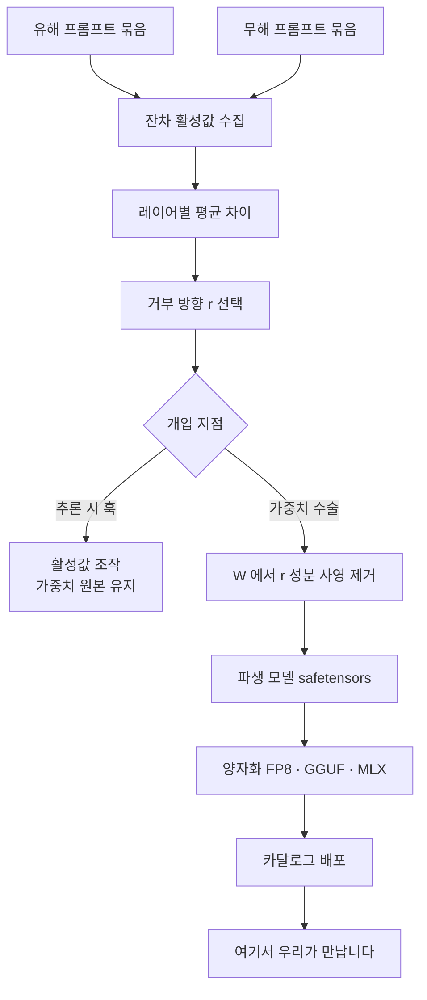

*여러 갈래로 흐르던 신호에서 한 축만 눌러 없애는 것, abliteration이 가중치에 하는 일입니다.*

허깅페이스 모델 카탈로그를 훑다 보면 이름 끝에 `Uncensored`나 `abliterated`가 붙은 모델을 자주 만나게 됩니다. 사내 플랫폼에 모델을 올리는 입장이라면 여기서 판단이 필요합니다. 이 모델은 무엇이 달라진 것인지, 원본과 같은 성능이라고 믿어도 되는지, 카탈로그에 들여도 되는지를 결정해야 합니다.

결론부터 말씀드리면 이런 모델은 무검열 데이터로 다시 학습한 결과물이 아닙니다. 원본 가중치에서 **거부 행동을 담당하는 방향 하나를 직교 사영으로 지운** 파생 모델입니다. 학습이 아니라 수술에 가깝고, 그래서 몇 시간이면 끝나며, 그래서 부작용도 학습과는 다른 방식으로 나타납니다.

## 거부는 성격이 아니라 잔차 스트림의 한 축입니다

출발점은 2024년 6월 Arditi 등이 발표한 [Refusal in Language Models Is Mediated by a Single Direction](https://arxiv.org/abs/2406.11717)입니다. 저자들은 최대 72B 규모까지 오픈소스 채팅 모델 13종을 조사해, 거부 행동이 **1차원 부분공간**으로 매개된다는 사실을 보였습니다.

논문의 주장은 상당히 강합니다. 모델마다 방향 하나를 찾을 수 있고, 그 방향을 잔차 스트림 활성값에서 지우면 유해한 지시에도 거부하지 않게 되며, 반대로 그 방향을 더해 주면 무해한 지시에도 거부하기 시작합니다. 양방향으로 작동한다는 점이 중요합니다. 상관관계가 아니라 인과적 개입이라는 뜻이기 때문입니다.

직관적으로 보면 이렇습니다. 모델은 "이 요청이 위험한가"를 판단하는 회로와 "그래서 거절 문장을 생성한다"는 회로를 갖고 있는데, 그 둘을 잇는 신호가 고차원 공간의 특정 축 하나에 거의 몰려 있습니다. 안전 파인튜닝이 만들어 낸 것은 두꺼운 방어벽이 아니라 얇은 배선 하나였던 셈입니다. 논문 저자들 스스로 이 결과가 **현재 안전 파인튜닝 기법의 취약성**을 드러낸다고 적었습니다.

## 그래서 제거는 재학습이 아니라 사영입니다

거부 방향을 찾는 방법은 개념적으로 단순합니다. 유해한 프롬프트 묶음과 무해한 프롬프트 묶음을 각각 모델에 넣고, 특정 레이어에서 잔차 활성값을 모은 뒤 두 집단의 평균 차이를 구합니다. 그 차이 벡터를 정규화한 것이 거부 방향 $r$입니다.

$$
r = \mathrm{normalize}\left(\mathbb{E}[h_{\text{harmful}}] - \mathbb{E}[h_{\text{harmless}}]\right)
$$

여기까지는 활성값 수준의 이야기이고, 추론할 때마다 훅을 걸어 개입하는 방식으로도 쓸 수 있습니다. 그런데 배포용 모델을 만들 때는 아예 가중치를 고칩니다. 잔차 스트림에 값을 쓰는 행렬 $W$에서 $r$ 성분을 빼 버리면, 그 행렬은 애초에 그 방향으로 출력을 만들 수 없게 됩니다.

$$
W' = W - r\,(r^{\mathsf{T}} W)
$$

이것이 abliteration이라고 불리는 조작이고, 본질은 **직교 사영**입니다. 학습률도 옵티마이저도 손실 함수도 없습니다. 데이터셋을 돌리는 대신 행렬 곱 몇 번으로 끝납니다. 임베딩 행렬처럼 shape가 반대인 경우에는 사영하는 쪽만 바꿔 같은 취지로 처리합니다.

기법이 이렇게 값싸다는 사실 자체가 중요한 정보입니다. 모델 하나를 무검열 파생으로 만드는 데 GPU 클러스터도 대규모 데이터도 필요하지 않습니다. 실제로 [Heretic](https://github.com/p-e-w/heretic) 같은 도구는 이 과정을 완전 자동화했고, 2026년 8월 현재 깃허브 스타 2만 7천 개를 넘겼습니다. 진입 장벽은 이미 사라졌다고 보는 편이 정확합니다.

## 양자화는 무검열과 아무 관계가 없습니다

카탈로그에서 자주 오해가 생기는 지점이라 짚고 갑니다. `MLX 4bit uncensored`라는 이름을 보면 MLX 변환이 검열을 없앤 것처럼 읽히지만 그렇지 않습니다. 두 단계는 완전히 분리되어 있습니다.

무검열화는 가중치의 **내용**을 바꾸는 조작이고, 양자화는 가중치의 **표현 방식**을 바꾸는 조작입니다. 이미 abliterate된 가중치를 4비트로 양자화하면 무검열 4비트 모델이 나오는 것이지, 양자화 과정이 무언가를 제거하는 것이 아닙니다.

실무적으로 더 중요한 것은 순서입니다. 커뮤니티 배포본 중에는 FP8 파생본을 받아 BF16 표현으로 되돌린 뒤 다시 4비트로 양자화한 것들이 있는데, 이중 양자화를 거치면 첫 양자화에서 이미 버린 정밀도는 돌아오지 않습니다. 원본 BF16에서 한 번만 양자화한 것과 같지 않습니다. 카탈로그에 올릴 때는 파생 계보를 이 수준까지 기록해 두는 편이 좋습니다.

## 벤더가 발표한 refusal 0%를 그대로 믿으면 안 되는 이유

최근 화제가 된 [orcarouter/Qwen3.8-27B-Uncensored-FP8](https://huggingface.co/orcarouter/Qwen3.8-27B-Uncensored-FP8)을 예로 보겠습니다. 허깅페이스 메타데이터로 확인되는 사실은 이렇습니다. 원본은 [Qwen/Qwen3.8-27B](https://huggingface.co/Qwen/Qwen3.8-27B)이고, 라이선스는 Apache-2.0, 아키텍처는 `qwen3_5` 계열의 멀티모달 모델이며, 태그에 `abliterated`, `uncensored`와 함께 `red-teaming`, `ai-red-team`이 붙어 있습니다. 다운로드 6만 건, 좋아요 567개로 관심도 적지 않습니다.

그런데 **모델 카드가 gated 상태입니다**. 접근 권한 없이 README를 요청하면 401이 돌아옵니다. 커뮤니티에서 인용되는 세부 수치들, 어느 레이어에서 방향을 뽑았는지, 몇 개의 가중치를 수정했는지, 벤치마크가 얼마나 변했는지는 이 글을 쓰는 시점에 저희가 직접 확인하지 못했습니다. 그래서 이 글에는 그 숫자들을 적지 않았습니다.

이 상황 자체가 시사점입니다. 파생 모델의 성능 주장은 대개 **제작자가 자기 모델을 자기 방법으로 평가한 결과**이고, 검증에 필요한 문서가 게이트 뒤에 있으면 제3자 재현은 시작조차 어렵습니다. 게다가 거부 여부 판정은 보통 규칙 기반 휴리스틱으로 이루어집니다. 응답에 "I cannot"이나 "죄송하지만" 같은 표현이 없으면 거부하지 않은 것으로 세는 방식입니다. 이 방식은 모델이 거부 문구 없이 엉뚱하거나 쓸모없는 답을 내놓은 경우를 전부 성공으로 집계합니다.

그래서 refusal 0%라는 숫자는 "무엇이든 유능하게 답한다"는 뜻이 아니라 "거절 문구를 출력하지 않는다"는 뜻에 가깝습니다. 둘은 전혀 다른 명제입니다.

## 무검열이라는 말은 문자 그대로가 아닙니다

2026년 2월에 나온 후속 연구 [There Is More to Refusal in Large Language Models than a Single Direction](https://arxiv.org/abs/2602.02132)은 단일 방향 가설이 불완전하다고 지적합니다. 저자들은 안전, 불충분하거나 지원되지 않는 요청, 의인화, 과잉 거부 등 열한 개 범주의 거부와 비순응 행동을 조사했고, 이들이 활성 공간에서 **기하학적으로 서로 구별되는 방향들**에 대응한다는 것을 보였습니다.

거부는 하나가 아니라 여러 종류이고, 그 종류들이 서로 다른 축에 놓여 있다는 뜻입니다. 그렇다면 방향 하나를 지우는 수술은 거부라는 현상 전체를 제거한 것이 아니라, 그중 가장 지배적인 표현 하나를 강하게 억제한 것에 가깝습니다.

이 논문에는 abliteration을 다루는 쪽에서 놓치기 쉬운 두 번째 발견이 있습니다. 서로 다른 거부 방향을 따라 선형 조향을 하더라도 **거부와 과잉 거부 사이의 트레이드오프는 거의 동일하게 나타난다**는 것입니다. 방향들이 공유된 1차원 조절 손잡이처럼 작동하고, 방향을 바꿔서 달라지는 것은 모델이 거부하느냐가 아니라 **어떻게 거부하느냐**였습니다.

방향을 더 많이 찾아내면 더 완전한 제거가 가능할 것이라는 기대는 이 결과와 잘 맞지 않습니다. 기하 구조가 여러 갈래라는 사실과, 그 갈래들을 다루면 더 나은 손잡이를 얻는다는 기대는 별개의 명제이고, 현재까지의 증거는 후자를 지지하지 않습니다.

## 안 하는 것과 못 하는 것을 구분해야 합니다

파생 모델 평가에서 가장 흔한 오독은 순응률을 능력으로 읽는 것입니다. 2026년 6월 [Willing but Unable](https://arxiv.org/abs/2606.05396)은 이 구분을 정면으로 다뤘습니다. 취약점 탐지용 학습 데이터를 만들려면 모델에게 특정 CWE를 코드에 주입해 달라고 요청해야 하는데, 안전 정렬된 코드 모델이 이런 요청을 체계적으로 거부한다는 문제에서 출발한 연구입니다.

Qwen2.5-Coder-Instruct 계열 3B, 7B, 14B를 대상으로 조건당 3회 반복 평가한 결과, abliteration은 모든 크기에서 거부율을 0 또는 0에 가깝게 낮추면서 문법적 유효성은 93% 이상으로 유지했습니다. 이 좁은 설정에서는 거부가 측정된 코드 생성 능력과 분리 가능하다는 결론입니다.

여기서 얻을 교훈은 평가 설계입니다. 거부율 하나만 보면 안 되고, 최소한 **거부율, 시도율, 성공률** 세 축을 따로 재야 합니다. 그렇지 않으면 "무검열이라 벤치마크가 올랐다"는 잘못된 결론에 도달하기 쉽습니다. 거부하지 않게 된 모델이 시도는 하되 실패하는 경우가 통계에서 사라지기 때문입니다.

## 정밀 제거라는 표현이 성립하지 않는 지점

정렬 제거를 옹호하는 가장 설득력 있는 논거는 보안 업무입니다. 방어 목적의 정당한 보안 작업인데도 문구가 오용처럼 읽힌다는 이유로 모델이 거절하면, 평가가 모호해집니다. 답을 못 한 것이 능력 부족인지 거부 정책 때문인지 구분되지 않기 때문입니다.

2026년 5월 [Ablating Safety](https://arxiv.org/abs/2605.17413)는 이 문제를 통제된 프로토콜로 다뤘습니다. 권한 있는 컨텍스트 프롬프팅, 되돌릴 수 있는 거부 방향 활성 사영, 표현 제어 사영, LoRA 기반 비정렬 또는 과제 적응을 서로 비교했습니다.

결과가 흥미롭습니다. rank-4 거부 부분공간 사영은 보안 점수 0.51에 도달하면서 정렬된 모델과 같은 수준의 스필오버를 유지했습니다. 반면 **과제 적응만 수행한 LoRA는 보안 점수 0.87, 일반 점수 0.83, 안전하지 않은 순응 0.13**을 기록했고, 유지 조건을 건 거부 억제는 스필오버를 0.27까지 끌어올렸습니다.

정리하면 이렇습니다. 보안 업무를 잘하는 모델을 얻는 가장 좋은 방법은 거부를 제거하는 것이 아니라 **그 과제를 가르치는 것**이었습니다. 거부를 억제하는 경로는 목표 과제 점수는 덜 오르면서 범위 밖의 위험한 순응은 더 늘렸습니다. 정밀 수술이라는 은유가 실제 측정에서는 잘 성립하지 않았다는 뜻입니다.

## ThakiCloud 플랫폼 관점

저희는 모델을 올리고 서빙하는 쪽에 서 있습니다. 그래서 이 주제는 학술적 호기심이 아니라 카탈로그 정책의 문제입니다.

**Metis**는 ThakiCloud의 추론 및 토큰 팩토리 계층으로, 고객 환경에 모델을 등록하고 서빙합니다. 파생 모델이 카탈로그에 들어올 때 저희가 기록해야 하는 것은 모델 이름이 아니라 계보입니다. 어떤 원본에서 파생했는지, 어떤 조작이 가해졌는지, 양자화가 몇 단계 겹쳤는지가 남아야 합니다. abliterated 모델은 파일 포맷상으로는 평범한 safetensors라서 메타데이터를 남기지 않으면 원본과 구별되지 않습니다. 등록 시점에 계보를 붙잡지 못하면 나중에는 확인할 방법이 사실상 없습니다.

**Aegis**는 온프레미스 및 폐쇄망 환경을 담당합니다. 무검열 파생 모델에 대한 수요가 실제로 나타나는 곳이 여기입니다. 외부 API를 쓸 수 없는 보안 조직이 레드팀 평가용 모델을 내부에 두고 싶어 하는 상황은 정당한 요구입니다. 다만 위 Ablating Safety의 결과를 근거로 저희가 권하는 순서는 분명합니다. 거부를 제거한 범용 모델을 들이기 전에, 해당 과제에 적응시킨 모델이 더 나은 선택인지를 먼저 재 보시는 편이 좋습니다. 측정된 범위 안에서는 그쪽이 성능도 높고 부작용도 적었습니다.

**Signum**은 IAM, 권한, 감사 이벤트를 담당하는 공통 기반입니다. 정렬이 약화된 모델을 운용한다면 통제는 모델 안이 아니라 모델 밖에 있어야 합니다. 누가 그 엔드포인트를 호출할 수 있는지, 어떤 요청이 오갔는지가 남는 구조라야 감사에 답할 수 있습니다. 모델 자체의 거부에 의존하던 통제를 플랫폼 계층으로 옮기는 작업이라고 보시면 됩니다.

에이전트 워크로드라면 **Paxis**의 정책 게이트가 같은 역할을 합니다. 도구 호출과 행동을 정책으로 걸러 감사 로그에 남기는 구조에서는, 모델이 거절하지 않더라도 실행 단계에서 막힙니다. 정렬을 모델 가중치에 의존하는 설계와 실행 경로에 두는 설계는 견고함이 다릅니다.

## 정리

abliteration은 재학습이 아니라 가중치에 대한 직교 사영이고, 그래서 값싸고 빠릅니다. 안전 파인튜닝이 만든 것이 두꺼운 벽이 아니라 얇은 배선이었다는 사실을 드러낸다는 점에서 흥미로운 해석 가능성 연구이기도 합니다.

다만 카탈로그를 운영하는 입장에서 실무적으로 남는 결론은 세 가지입니다. 벤더가 발표한 거부율은 거절 문구의 부재를 센 값이지 유능함을 잰 값이 아닙니다. 거부는 하나의 방향이 아니라 여러 갈래이며, 그 사실이 제거를 더 완전하게 만들어 주지는 않습니다. 그리고 보안처럼 정당한 용도라면 거부를 지우는 것보다 과제를 가르치는 쪽이 측정상 더 나은 선택이었습니다.

파생 모델을 배제하자는 이야기가 아닙니다. 계보를 기록하고, 거부율과 능력을 분리해서 재고, 통제를 모델 밖에 두자는 이야기입니다.

## 참고 자료

- [Refusal in Language Models Is Mediated by a Single Direction](https://arxiv.org/abs/2406.11717) (Arditi, Obeso, Syed, Paleka, Panickssery, Gurnee, Nanda, 2024-06-17)
- [There Is More to Refusal in Large Language Models than a Single Direction](https://arxiv.org/abs/2602.02132) (2026-02-02)
- [Willing but Unable: Separating Refusal from Capability in Code LLMs via Abliteration](https://arxiv.org/abs/2606.05396) (2026-06-03)
- [Ablating Safety: Mechanisms for Removing Alignment in Language Models for Security Applications](https://arxiv.org/abs/2605.17413) (2026-05-17)
- [p-e-w/heretic](https://github.com/p-e-w/heretic) (2026-08-19 기준 스타 27.8k)
- [orcarouter/Qwen3.8-27B-Uncensored-FP8](https://huggingface.co/orcarouter/Qwen3.8-27B-Uncensored-FP8) (모델 카드 gated, 메타데이터만 확인)
- [Qwen/Qwen3.8-27B](https://huggingface.co/Qwen/Qwen3.8-27B)
