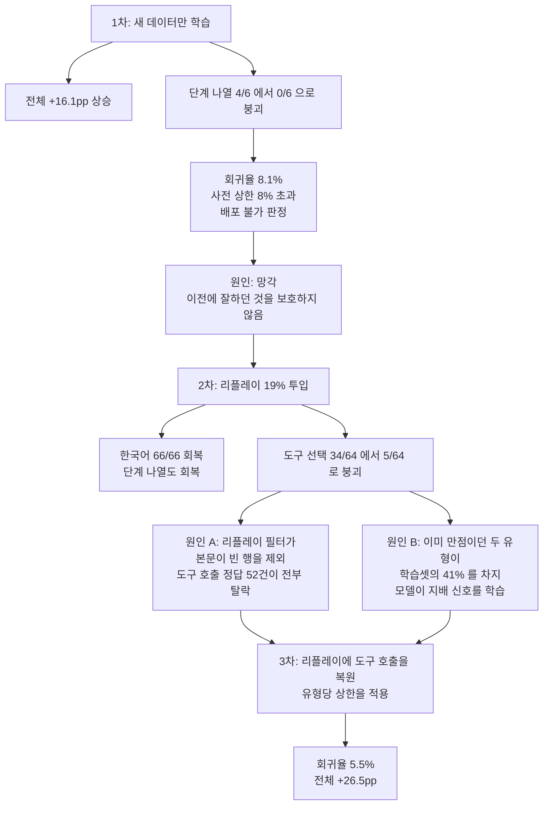

에이전트 플랫폼을 운영하면 곧 이 질문에 부딪힙니다. 사용자가 빌더로 에이전트를 계속 만드는데,
그걸 다 27B로 돌리면 비쌉니다. 8B로 내리면 싸지지만 품질이 떨어집니다.

저희가 잰 결론은 이렇습니다. **27B의 실행 로그로 8B를 증류하면, 학습이 한 번도 본 적 없는
에이전트에서도 성능이 오릅니다.** 학습 전 236/347에서 학습 후 328/347, **+26.5pp**입니다.
학습에 770행과 14분이 들었습니다.

## 무엇을 쟀나

에이전트 221종에 케이스 1,176건을 만들고, 그중 **66개 정체성을 통째로 빼서** 홀드아웃으로
썼습니다. 학습셋과 겹치는 에이전트가 하나도 없습니다.

이 분할이 중요한 이유가 있습니다. 학습이 끝났을 때 최종 스텝 손실이 0.020이고 토큰 정확도가
0.995였습니다. 학습셋만 보면 잘 배운 것과 통째로 외운 것이 구분되지 않습니다. 처음 보는
에이전트에서 올랐다는 사실이 그 구분을 지어 줍니다.

| | 학습 전 | 학습 후 |
|---|---|---|
| 한국어로 답하기 | 16/65 | **65/65** |
| 맞는 도구 고르기 | 26/63 | **50/63** |
| 자기 정체성 파악 | 46/66 | **64/66** |
| 전체 | 236/347 | **328/347** |

도구 선택에서는 학생 50/64가 교사 48/64를 넘었습니다. 배운 대상보다 조금 더 자주 맞는 도구를
고릅니다.

## 채점은 코드가 합니다

여덟 가지를 봅니다. 영어로 물어도 한국어로 답하는지, 그 에이전트가 자기 프롬프트에서 지시받은
도구를 부르는지, 반대로 도구가 필요 없는 질문에는 **안 부르는지**, 주입된 스펙에서 자기 이름을
읽어내는지, 개인정보를 지어내지 않는지, 사람이 확인해야 하는 단계를 "다 했다"고 주장하지 않는지.

판정 경로에 LLM 심판이 없습니다. 전부 정규식과 문자열 비교입니다. 그리고 채점기 자체를
일부러 틀린 답으로 검증했습니다. 조작된 이메일, 영어 답변, 불필요한 도구 호출, 키워드 누락,
거짓 완료 주장 다섯 가지가 전부 FAIL 판정을 받는지 확인하고 나서 본 측정을 돌렸습니다.

한 가지는 설계 의도를 따로 밝힐 만합니다. **도구를 안 부르는 것도 봅니다.** 부르는 방향만
재면 과다호출이 보이지 않습니다. "당신의 목적이 뭡니까"에 도구를 부르는 에이전트는 자기
프롬프트를 어기는 건데, 그게 지표에 안 잡히면 모델이 그쪽으로 흘러도 모릅니다.

## 두 번 실패했고, 둘 다 학습 방법이 아니라 데이터 설계 문제였습니다

세 번 돌렸습니다. 각 런이 하나를 고치고 다른 하나를 깨뜨렸고, 두 번 다 원인이 학습 방법이
아니라 학습셋을 고르는 필터에 있었습니다.

*세 런의 성적표를 전체 평균으로만 읽으면 1차와 2차 모두 성공으로 보입니다. 붕괴는 유형별로 갈라 볼 때만 드러납니다.*

**첫 번째는 잊어버렸습니다.** 새 데이터만 학습시켰더니 전체는 +16.1pp로 올랐는데, 워크플로
단계를 나열하는 과제가 4/6에서 **0/6**이 됐습니다. 원래 맞히던 걸 전부 틀렸습니다. 회귀율이
8.1%로 저희가 미리 정해둔 상한 8%를 넘겨서 배포 불가로 판정했습니다.

**두 번째는 균형이 깨졌습니다.** 리플레이(이전에 잘하던 것을 일부 섞어 넣는 기법)를 19%
넣었더니 망각은 고쳐졌습니다. 한국어 응답이 66/66이 되고 단계 나열도 회복됐습니다. 그런데
이번엔 도구 선택이 34/64에서 **5/64**로 무너졌습니다.

원인이 둘이었고 둘 다 제가 만든 필터 탓이었습니다. 리플레이 대상을 고를 때 "본문이 비어
있지 않을 것"을 조건으로 걸었는데, 도구 호출은 **정답일수록 본문이 빕니다**. 도구를 부르는 게
답이니까요. 그래서 통과한 52건이 전부 걸러졌고 그 유형만 보호를 못 받았습니다.

동시에 이미 만점이던 두 유형이 학습셋의 41%를 차지했습니다. 둘 다 "도구를 부르지 마라"
쪽 신호였고, 모델은 지배적인 신호를 배웠습니다.

**세 번째에 둘 다 고쳤습니다.** 리플레이 행에 도구 호출을 복원해 넣고, 유형당 상한을 걸어
만점 유형이 학습셋을 지배하지 못하게 했습니다. 회귀율이 5.5%로 내려갔고 전체는 +26.5pp가
됐습니다.

여기서 얻은 게 하나 있습니다. **두 실패 모두 전체 평균에는 보이지 않았습니다.** 첫 번째 런의
평균은 올라갔고, 그 안에서 한 유형이 전멸했습니다. 유형별로 나눠 보고하지 않았다면 둘 다
성공으로 기록됐을 겁니다.

## 정직하게 남는 것

전체 수치를 그대로 성과로 읽으면 안 됩니다. 상승의 가장 큰 몫이 **한국어 응답 +75.4pp**인데,
이건 출력 언어 하나를 고친 것에 가깝습니다. 프롬프트가 "항상 한국어로 답하라"고 쓰여 있는데
8B가 영어 질문에 영어로 답하고 있었습니다. 지시 준수 문제지 능력 문제가 아닙니다.

도구 선택도 회귀율이 34.6% 남아 있습니다. 순증은 +38.1pp지만 원래 맞히던 것의 3분의 1을
여전히 깨뜨립니다. 전체 5.5%에 묻히는 자리라, 유형별로 회귀 상한을 거는 게 다음 숙제입니다.

표본이 작은 유형도 있습니다. 단계 나열과 체크포인트 준수는 각각 6건과 9건이라 어느 방향으로도
통계적 의미가 없습니다. 시드도 하나이고 구성당 한 번씩만 돌렸습니다.

교사도 완벽하지 않다는 점도 적어 둡니다. 27B가 1,173건 중 1,108건을 맞혔습니다. 여기서의
천장은 과제의 천장이 아니라 교사의 천장입니다.

## 참고 자료

- [Distilling the Knowledge in a Neural Network](https://arxiv.org/abs/1503.02531): Hinton,
  Vinyals, Dean(2015)이 큰 모델의 출력을 작은 모델이 배우게 하는 지식 증류 기법을 정리한
  논문입니다. 27B의 실행 로그로 8B를 학습시키는 이 글의 접근이 기반으로 삼는 개념입니다.
- [LoRA: Low-Rank Adaptation of Large Language Models](https://arxiv.org/abs/2106.09685):
  Hu 외(2021)가 제안한 기법으로, 사전학습된 가중치는 고정하고 저랭크 행렬만 학습해 적은
  파라미터로 모델을 적응시킵니다. 이 글의 학습이 770행·14분 만에 끝날 수 있었던 이유 중
  하나입니다.
- [Experience Replay for Continual Learning](https://arxiv.org/abs/1811.11682): Rolnick
  외(2019)가 다룬 기법으로, 이전 데이터를 새 학습에 함께 섞어 넣어 과거에 잘하던 것을
  잊어버리는 파괴적 망각을 줄입니다. 이 글의 2차·3차 런에서 쓴 리플레이 방법과 같은
  계열입니다.

## 관련 슬라이드

본문 내용을 NotebookLM(`neo_swiss` 스타일)으로 요약한 슬라이드입니다.

