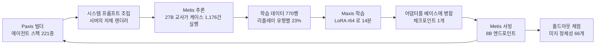
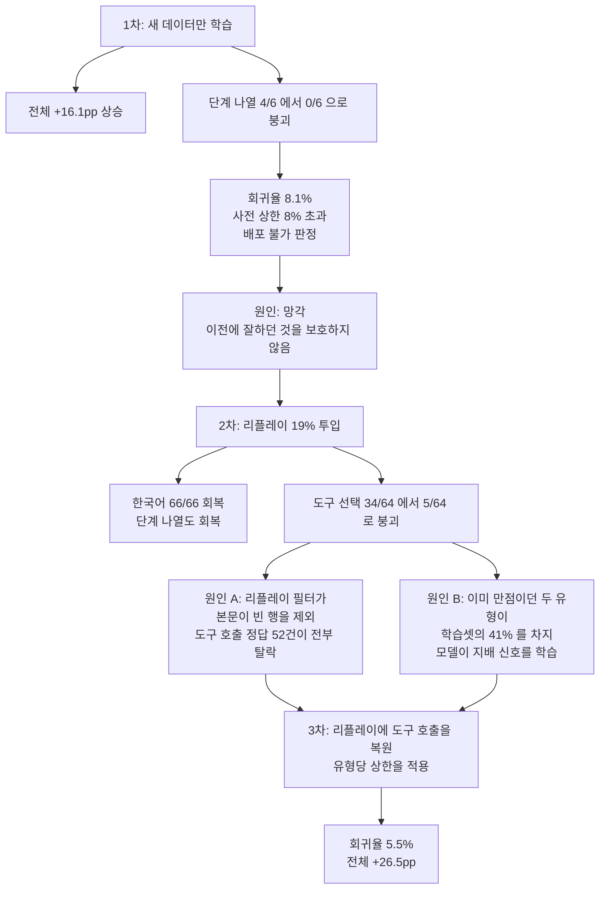

에이전트 플랫폼을 운영하면 곧 같은 벽에 부딪힙니다. 사용자가 빌더로 에이전트를 계속 만드는데,
그 에이전트를 전부 27B로 돌리면 토큰 비용이 감당되지 않고 8B로 내리면 품질이 무너집니다.

저희가 잰 결론은 이렇습니다. **27B가 그 에이전트들을 실제로 실행한 기록으로 8B를 하룻밤
학습시키면, 학습이 한 번도 본 적 없는 에이전트에서도 오릅니다.** 347건 기준 236건에서 328건,
**+26.5pp**입니다. 학습에 들어간 것은 770행과 14분입니다.

흥미로운 부분은 수치보다 그 수치가 어디서 나왔는지에 있습니다. 에이전트를 만든 곳, 그것을 실행한
곳, 실행 기록으로 다시 학습한 곳이 서로 다른 세 층이고, 세 층이 한 바퀴를 돌아야 이 결과가
나옵니다.

*글의 핵심 개념을 형상화했습니다.*

## 세 층이 한 바퀴를 돕니다

저희 플랫폼에서 이 실험은 세 제품을 차례로 지나갑니다.

**Paxis**에서 사용자가 에이전트를 만듭니다. 이번에 쓴 것은 빌더에 실제로 발행된 에이전트 스펙
221종입니다. 각 스펙은 이름과 직함, 전문 도메인, 쓸 수 있는 도구, 따라야 할 워크플로를 담고
있고, 서버가 그것을 하나의 시스템 프롬프트로 조립합니다.

**Metis**가 그 에이전트를 실제로 태웁니다. 27B 교사에게 케이스 1,176건을 던져 답을 받은 것이
학습 데이터의 정답 쪽이고, 나중에 학습이 끝난 8B를 다시 태워 재는 곳도 여기입니다.

**Maxis**가 그 기록을 모델로 되돌립니다. LoRA로 8B를 학습시키고, 나온 어댑터를 베이스에 병합해
하나의 체크포인트로 만듭니다. 그 체크포인트는 다시 Metis 엔드포인트로 올라가고, 사용자가 만든
다음 에이전트를 태웁니다. 여기서 고리가 닫힙니다.

*에이전트가 만들어지는 곳과 학습되는 곳이 다르기 때문에, 세 층 사이의 계약이 맞지 않으면 결과가
조용히 무의미해집니다. 이 글의 실패 사례 두 건이 정확히 그 자리에서 나왔습니다.*

## 무엇을 쟀나

증명해야 하는 것은 "학습에 쓴 에이전트가 좋아졌다"가 아닙니다. 사용자가 오늘 아침에 만든
에이전트가 어젯밤 학습분으로도 동작해야 제품이 성립합니다. 그래서 **66개 정체성을 통째로 빼서**
홀드아웃으로 썼습니다. 학습셋과 겹치는 에이전트가 하나도 없습니다.

이 분할이 실제로 값을 했습니다. 학습이 끝났을 때 최종 스텝 손실이 0.020이고 토큰 정확도가
0.995였습니다. 학습셋만 보면 잘 배운 것과 통째로 외운 것이 구분되지 않습니다. 처음 보는
에이전트에서 올랐다는 사실이 그 구분을 지어 줍니다.

| | 학습 전 | 학습 후 |
|---|---|---|
| 한국어로 답하기 | 16/65 | **65/65** |
| 맞는 도구 고르기 | 26/63 | **50/63** |
| 자기 정체성 파악 | 46/66 | **64/66** |
| 전체 | 236/347 | **328/347** |

도구 선택을 교사와 나란히 놓고 재면 학생이 50/64, 교사가 48/64입니다. 배운 대상보다 조금 더 자주
맞는 도구를 고릅니다. 다만 뒤에서 다시 다루겠지만 이 항목은 순증만큼 회귀도 큽니다.

## 프롬프트가 다르면 학습 전체가 헛돕니다

세 층을 잇는 계약 중 가장 먼저 깨지기 쉬운 것이 프롬프트입니다. 학습에 쓸 시스템 프롬프트를 따로
만들어 쓰면, 서빙 시점에 Paxis가 실제로 보내는 것과 미세하게 달라지고, 모델은 평생 만날 일이 없는
입력 분포를 배우게 됩니다. 더 나쁜 것은 그 사실이 어떤 지표에도 잡히지 않는다는 점입니다. 학습
손실도 정상이고 홀드아웃 점수도 나옵니다.

그래서 프롬프트를 새로 쓰지 않고 **Paxis 서버의 자체 렌더러를 그대로 호출**했습니다. 실제 서빙
경로가 쓰는 조립 함수를 명령줄에서 부르는 방식입니다. 그리고 그 출력이 진짜와 같은지 확인하기
위해, 실제로 캡처해 둔 프롬프트 27건과 대조했습니다. 시각이 찍히는 부분을 제외하면 13건이 바이트
단위로 동일했고 유사도 중앙값은 1.000이었습니다.

## 채점은 코드가 합니다

여덟 가지를 봅니다. 영어로 물어도 한국어로 답하는지, 그 에이전트가 자기 프롬프트에서 지시받은
도구를 부르는지, 반대로 도구가 필요 없는 질문에는 **안 부르는지**, 주입된 스펙에서 자기 이름을
읽어내는지, 개인정보를 지어내지 않는지, 사람이 확인해야 하는 단계를 "다 했다"고 주장하지 않는지,
워크플로 단계를 순서대로 말하는지입니다.

판정 경로에 LLM 심판이 없습니다. 전부 정규식과 문자열 비교입니다. 그리고 채점기 자체를 일부러
틀린 답으로 검증했습니다. 조작된 이메일, 영어 답변, 불필요한 도구 호출, 키워드 누락, 거짓 완료
주장 다섯 가지가 전부 FAIL 판정을 받는지 확인하고 나서 본 측정을 돌렸습니다.

한 가지는 설계 의도를 따로 밝힐 만합니다. **도구를 안 부르는 것도 봅니다.** 부르는 방향만 재면
과다호출이 보이지 않습니다. "당신의 목적이 뭡니까"라는 질문에 검색 도구를 부르는 에이전트는 자기
프롬프트를 어기는 것인데, 그게 지표에 안 잡히면 모델이 그쪽으로 흘러도 알 수 없습니다.

## 왜 전체 미세조정이 아니라 LoRA였나

메모리 때문이 아닙니다. 8B의 전체 미세조정은 122GiB, 8비트 옵티마이저를 쓰면 76GiB라 180GiB
카드에 넉넉히 들어갑니다. 이유는 회귀입니다.

7B급 모델을 미세조정하면 이전에 하던 것을 잊는 현상이 일반적으로 관측되고, 규모가 커질수록
심해진다고 보고되어 있습니다. 이게 실험 설계에 직접 영향을 줍니다. 회귀가 15% 수준인 상태에서
+10pp짜리 개선을 통계적으로 잡아내려면 홀드아웃이 127건에서 3,933건으로 불어납니다. 낮은 회귀는
결과가 아니라 측정의 전제 조건입니다.

대신 랭크를 높게 잡고 **모든 선형 레이어**를 대상으로 걸었습니다. 전체 미세조정이 학습하는 변화의
랭크가 통상적인 LoRA 설정보다 10배에서 100배 크다는 보고가 있어서, 낮은 랭크에 어텐션만 거는 기본
설정으로는 배울 자리가 부족합니다.

손실은 어시스턴트 응답에만 걸었습니다. 시스템 프롬프트가 3.6k자인데 그중 46%가 모든 에이전트에
공통인 플랫폼 서두라, 거기에 손실을 걸면 학습 시간의 상당 부분을 고정된 접두사를 외우는 데 씁니다.

## 두 번 실패했고, 둘 다 학습 방법이 아니라 데이터 설계 문제였습니다

세 번 돌렸습니다. 각 런이 하나를 고치고 다른 하나를 깨뜨렸고, 두 번 다 원인이 학습 방법이 아니라
학습셋을 고르는 필터에 있었습니다.

*세 런의 성적표를 전체 평균으로만 읽으면 1차와 2차 모두 성공으로 보입니다. 붕괴는 유형별로 갈라
볼 때만 드러납니다.*

**첫 번째는 잊어버렸습니다.** 새 데이터만 학습시켰더니 전체는 +16.1pp로 올랐는데, 워크플로 단계를
나열하는 과제가 4/6에서 **0/6**이 됐습니다. 원래 맞히던 걸 전부 틀렸습니다. 회귀율이 8.1%로 저희가
미리 정해둔 상한 8%를 넘겨서 배포 불가로 판정했습니다.

**두 번째는 균형이 깨졌습니다.** 리플레이, 그러니까 이전에 잘하던 것을 일부 섞어 넣는 기법을 19%
넣었더니 망각은 고쳐졌습니다. 한국어 응답이 66/66이 되고 단계 나열도 회복됐습니다. 그런데 이번엔
도구 선택이 34/64에서 **5/64**로 무너졌습니다.

원인이 둘이었고 둘 다 제가 만든 필터 탓이었습니다. 리플레이 대상을 고를 때 "본문이 비어 있지 않을
것"을 조건으로 걸었는데, 도구 호출은 **정답일수록 본문이 빕니다**. 도구를 부르는 것이 답이기
때문입니다. 그래서 통과한 52건이 전부 걸러졌고 그 유형만 보호를 받지 못했습니다.

동시에 이미 만점이던 두 유형이 학습셋의 41%를 차지했습니다. 둘 다 "도구를 부르지 마라" 쪽
신호였고, 모델은 지배적인 신호를 배웠습니다.

**세 번째에 둘 다 고쳤습니다.** 리플레이 행에 도구 호출을 복원해 넣고, 유형당 상한 130을 걸어 만점
유형이 학습셋을 지배하지 못하게 했습니다. 회귀율이 5.5%로 내려갔고 전체는 +26.5pp가 됐습니다.

여기서 얻은 것이 하나 있습니다. **두 실패 모두 전체 평균에는 보이지 않았습니다.** 첫 번째 런의
평균은 올라갔고, 그 안에서 한 유형이 전멸했습니다. 유형별로 나눠 보고하지 않았다면 둘 다 성공으로
기록됐을 겁니다.

## 서빙에서 배운 것

모델이 나왔다고 끝이 아닙니다. 학습된 8B를 Metis 엔드포인트에 올리는 과정에서 세 가지를
배웠습니다.

**어댑터를 따로 얹는 경로가 막혀 있었습니다.** vLLM의 `--lora-modules`는 `s3://` URI를 받지 않고,
플랫폼은 모델 경로 하나만 내려받기 때문에 두 번째 아티팩트라는 개념 자체가 없었습니다. 어댑터를
베이스에 병합해 평범한 체크포인트 하나로 만들어 우회했습니다. 결과적으로는 이쪽이 서빙 경로도
단순합니다.

**엔드포인트 상태 필드는 증거가 아닙니다.** 그동안 API는 몇 분간 `creating`을 반환했는데 파드는
처음부터 없었습니다. 워크로드가 실제로 떴는지 확인하려면 파드를 직접 봐야 합니다.

**병합은 성공 로그가 아니라 가중치로 확인했습니다.** 병합 함수가 예외 없이 끝나는 것과 가중치가
실제로 바뀌는 것은 다릅니다. 기여하지 않는 어댑터는 아주 깔끔하게 병합되고 베이스와 똑같은 모델을
만듭니다. 그래서 여섯 지점의 가중치를 병합 전후로 직접 대조했고, 6/6이 변했으며 MLP 쪽 델타가
어텐션의 약 네 배였습니다.

한 가지 더 있습니다. 두 팔 모두 **튜닝된 서빙 설정**으로 쟀습니다. 플랫폼 기본값은 컴파일이 꺼져
있고 동시 시퀀스 상한이 32라, 단일 스트림에서 18.8배 느립니다. 기본값으로 기준선을 재면 모델이
아니라 서빙 설정을 재게 되고, 사용자는 그 느림을 모델 탓으로 돌립니다.

## 정직하게 남는 것

전체 수치를 그대로 성과로 읽으면 안 됩니다. 상승의 가장 큰 몫이 **한국어 응답 +75.4pp**인데, 이건
출력 언어 하나를 고친 것에 가깝습니다. 프롬프트가 "항상 한국어로 답하라"고 쓰여 있는데 8B가 영어
질문에 영어로 답하고 있었습니다. 지시 준수 문제지 능력 문제가 아닙니다.

도구 선택도 회귀율이 34.6% 남아 있습니다. 순증은 +38.1pp지만 원래 맞히던 것의 3분의 1을 여전히
깨뜨립니다. 전체 5.5%에 묻히는 자리라, 유형별로 회귀 상한을 거는 것이 다음 숙제입니다.

표본이 작은 유형도 있습니다. 단계 나열과 체크포인트 준수는 각각 6건과 9건이라 어느 방향으로도
통계적 의미가 없습니다. 단계 나열의 마이너스 16.7pp는 한 건 차이입니다. 시드도 하나이고 구성당 한
번씩만 돌렸습니다. 홀드아웃 349건 중 2건은 빈 출력이 나와 짝짓기에서 제외했습니다.

케이스 입력도 짚어 둘 부분입니다. 정답은 27B가 실제로 실행해 만든 것이지만, **질문 쪽은 스펙을
보고 과제 유형별로 생성한 것**이지 실제 사용자 트래픽이 아닙니다. 실제 대화 분포로 다시 재는 것이
남은 일입니다.

교사도 완벽하지 않다는 점도 적어 둡니다. 27B가 1,173건 중 1,108건을 맞혔습니다. 여기서의 천장은
과제의 천장이 아니라 교사의 천장입니다.

## 이 고리가 제품에서 뜻하는 것

한 번의 실험이지만 방향은 분명합니다. 사용자가 **Paxis**에서 에이전트를 만들고, **Metis**가 그
에이전트를 태우면서 실행 기록이 쌓이고, **Maxis**가 밤새 그 기록을 작은 모델에 넣고, 아침에 다시
Metis로 올라갑니다. 세 층이 각각 좋은 것보다 이 고리가 도는 것이 중요합니다. 학습 데이터를 밖에서
사 오는 것이 아니라 플랫폼을 쓰는 행위 자체에서 얻기 때문입니다.

비용 쪽 함의는 단순합니다. 27B가 하던 응답의 상당 부분을 8B가 받아 갈 수 있다면 같은 트래픽에서
필요한 가속기가 줄어듭니다. 그 8B는 **Telox**의 GPU 자원 위에서 돌 수도 있고, 데이터가 밖으로 나갈
수 없는 고객이라면 **Aegis** 온프레미스 안에서 같은 고리를 그대로 돌릴 수도 있습니다. 학습에
들어간 것이 770행과 14분이라는 점이 여기서 의미를 갖습니다. 이 정도 규모라면 고객사 하나를 위해
전용 모델을 밤마다 굽는 것이 비현실적인 이야기는 아닙니다.

다만 이 글이 뒷받침하는 것은 거기까지입니다. 한 번의 런, 한 개의 시드, 하나의 홀드아웃
분할입니다.

## 참고 자료

- [Distilling the Knowledge in a Neural Network](https://arxiv.org/abs/1503.02531): Hinton,
  Vinyals, Dean(2015)이 큰 모델의 출력을 작은 모델이 배우게 하는 지식 증류 기법을 정리한
  논문입니다. 27B의 실행 기록으로 8B를 학습시키는 이 글의 접근이 기반으로 삼는 개념입니다.
- [LoRA: Low-Rank Adaptation of Large Language Models](https://arxiv.org/abs/2106.09685):
  Hu 외(2021)가 제안한 기법으로, 사전학습된 가중치는 고정하고 저랭크 행렬만 학습해 적은
  파라미터로 모델을 적응시킵니다. 학습이 14분 만에 끝날 수 있었던 이유 중 하나입니다.
- [LoRA Learns Less and Forgets Less](https://arxiv.org/abs/2405.09673): Biderman
  외(2024)가 LoRA와 전체 미세조정을 비교한 연구입니다. 전체 미세조정이 학습하는 변화의 랭크가
  통상적인 LoRA 설정보다 10배에서 100배 크다고 보고했고, 이 글의 랭크와 대상 레이어 선택이
  여기서 나왔습니다.
- [Simple and Scalable Strategies to Continually Pre-train Large Language Models](https://arxiv.org/abs/2403.08763):
  Ibrahim 외(2024)가 분포가 바뀌는 연속 학습에서 이전 데이터를 5~25% 섞는 리플레이를 처방한
  연구입니다. 1차 런의 망각이 이 처방이 예측하는 조건에서 그대로 일어났습니다.
- [An Empirical Study of Catastrophic Forgetting in Large Language Models During Continual Fine-tuning](https://arxiv.org/abs/2308.08747):
  Luo 외(2023)가 1B에서 7B 사이 모델에서 미세조정 중 일어나는 망각을 측정한 연구입니다. 규모가
  커질수록 망각이 심해진다는 관찰이 이 글에서 전체 미세조정 대신 LoRA를 고른 근거가 됐습니다.

*27B 교사의 실행 기록을 8B 학생으로 증류한 실험입니다.*

*에이전트 221종 가운데 66종을 통째로 빼서 홀드아웃으로 썼습니다.*

*770행을 14분 학습시켜 학습이 본 적 없는 에이전트에서 26.5%p를 올렸습니다.*

*리플레이 필터가 도구 호출 행을 걸러내면서 학습셋의 41%가 한쪽 신호로 쏠렸습니다.*

*유형별 상한과 리플레이 복원으로 회귀율을 5.5%까지 낮춰 배포 기준을 충족했습니다.*
