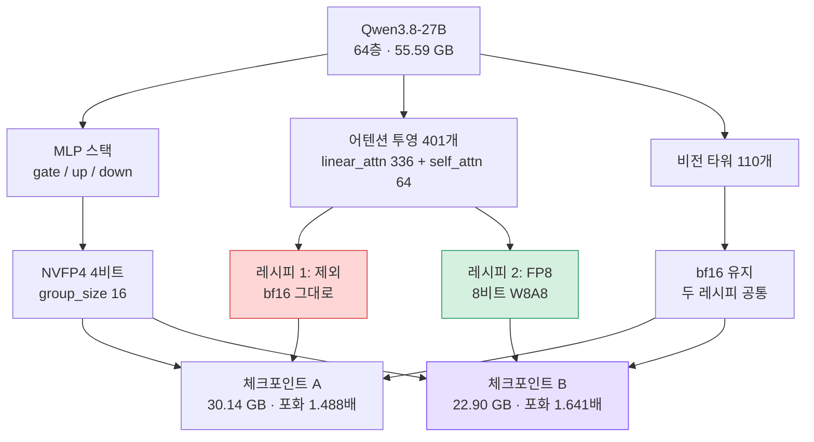

Blackwell에서 27B급 모델을 서빙하면서 "4비트로 내렸는데 기대만큼 안 빨라진다"고 느끼셨다면,
바꿔야 할 것은 비트 폭이 아니라 **어떤 레이어를 어떤 정밀도에 두느냐**일 가능성이 높습니다.
저희는 같은 모델에서 레시피만 바꿔 포화 처리량을 bf16 대비 1.488배에서 **1.675배**로 올렸고,
체크포인트는 30.14 GB에서 **22.90 GB**로 줄었습니다. 품질은 MMMU 짝 비교에서 원본과 구별되지
않았습니다.


*정밀도를 레이어별로 나눈다는 개념을 형상화했습니다.*

## 제외는 "안 건드림"이 아니라 "16비트로 둠"입니다

저희 양자화 스크립트는 어텐션을 `--extra-ignore`로 빼고 있었습니다. 4비트가 어텐션 품질을
해칠까 봐 내린 판단이었고, 그 걱정 자체는 합리적입니다.

문제는 제외의 의미입니다. 양자화 대상에서 빼는 것은 그 레이어를 **손대지 않는다**가 아니라
**bf16 그대로 남긴다**는 뜻입니다. 메뉴에 4비트와 8비트와 16비트가 있는데 아무것도 고르지
않으면 가장 비싼 16비트가 남습니다.

Qwen3.8-27B는 64개 층 중 48개가 linear attention이고 나머지 16개가 full attention입니다.
어텐션 전체를 제외하면 언어 모델의 어텐션 투영 401개가 통째로 16비트로 남습니다. 저희 무시
목록은 511개였는데 그중 비전 타워는 110개뿐이었고 나머지 401개가 전부 어텐션이었습니다.

같은 모델의 공개 체크포인트는 그 자리에 **FP8**을 넣고 있었습니다. 같은 "NVFP4"라는 이름을
달고 있었지만 안을 열어 보면 다른 레시피였습니다.

## 두 레시피가 갈리는 지점



*MLP와 비전 타워는 두 레시피가 같습니다. 갈리는 곳은 어텐션 401개 하나뿐이고 그 선택이
7.24 GB와 포화 성능을 결정했습니다.*

## 빌드 전에 소스에서 확인한 것

양자화 한 번에 47분이 걸립니다. 경로가 막혀 있으면 그 47분을 태우고 나서야 알게 됩니다.
그래서 코드를 먼저 읽었습니다.

llm-compressor가 모듈별로 다른 정밀도를 표현할 수 있는지부터 봤습니다. `scheme` 인자가
문자열만 받는 줄 알았는데 딕셔너리도 받습니다. 타깃이 겹칠 때는 정확한 이름이 정규식을 이기고
정규식이 클래스명을 이깁니다. 정규식으로 어텐션을 지정하면 전체 `Linear` 타깃을 자동으로
이긴다는 뜻입니다. vLLM 쪽은 그룹별 포맷 필드를 읽어 혼합 정밀도 체크포인트를 처리합니다.

셋 다 열려 있어서 MLP는 NVFP4로, 어텐션은 FP8로 나누는 레시피가 성립했습니다.

## config가 아니라 텐서를 열어 확인했습니다

빌드가 끝나고 저장된 가중치를 직접 열었습니다.

```
linear_attn.weight    F8_E4M3     ← 이전에는 전부 BF16
self_attn.weight      F8_E4M3
mlp.weight_packed     U8          ← NVFP4, 변화 없음
```

config 파일에 "혼합 정밀도"라고 적혀 있는 것과 텐서가 실제로 FP8인 것은 다른 주장입니다.
확인했다고 말하려면 후자를 봐야 합니다.

## 하마터면 반대로 결론 낼 뻔했습니다

첫 측정에서 크기가 **49.37 GiB**로 나왔습니다. 원본이 51.77 GiB이니 "압축이 거의 안 됐다"는
뜻이 됩니다.

실제로는 업로더가 목적지를 비우지 않아서 **이전 빌드의 샤드 7개와 새 빌드의 샤드 5개가 한
디렉터리에 겹쳐** 있었습니다. 인덱스 파일이 가리키는 것은 새 것이었고 실제 크기는 21.34 GiB
였습니다.

디렉터리 크기는 빌드 크기가 아닙니다. 그리고 같은 경로에 덮어쓰면 서빙 중인 체크포인트까지
바뀝니다. 레시피가 달라지면 경로도 갈리도록 빌드 스크립트를 고쳤습니다.

## 처리량은 이렇게 재야 인용할 수 있습니다

크기가 줄었다고 빨라졌다고 말할 수는 없습니다. 그런데 서빙 처리량은 재는 방법이 결과를 바꿉니다.

동시성 한 레벨만 재면 그 숫자는 서빙 처리량이 아니라 단일 스트림 디코드 지연입니다. 포화가
어디서 오는지, 배치를 키웠을 때 우위가 남는지는 사다리를 올려 봐야 보입니다. 그리고
`--max-num-seqs`를 지정하지 않으면 vLLM은 그 값을 로그에 찍지 않습니다. 무슨 설정으로 쟀는지
**사후에 증명할 수가 없다**는 뜻입니다. 설정을 이름 댈 수 없는 측정은 arm 사이의 차이를 그
설정 탓이 아니라고 말할 자격이 없습니다.

그래서 동시성 1·8·32·128의 네 레벨을 레벨당 3회 돌려 중앙값을 취했습니다. 서빙 설정
(`max_num_seqs=256` · `max_model_len=32768` · `gpu_memory_utilization=0.90` ·
`CompilationMode.VLLM_COMPILE`)은 모든 arm에 동일하게 주고, 준 것으로 끝내지 않고 **엔진이
스스로 찍은 설정 줄을 대조**해 같음을 확인했습니다.


*네 레벨 모두에서 혼합 레시피가 앞서고 동시성이 올라갈수록 격차가 벌어집니다.*

| 동시성 | bf16 원본 | NVFP4 (MLP만) | 혼합 (어텐션 FP8) | 혼합 + KV FP8 |
|---|---|---|---|---|
| 1 | 86.5 | 126.3 | 138.8 | **138.9** |
| 8 | 565.4 | 814.4 | 887.4 | **899.1** |
| 32 | 1,382.4 | 2,013.1 | 2,189.8 | **2,230.2** |
| 128 | 2,141.4 | 3,186.2 | 3,513.3 | **3,586.3** |
| **포화 배수** | 기준 | 1.488배 | 1.641배 | **1.675배** |

출력 토큰/초, 입력 2,048 / 출력 256, B200 한 장입니다.

**우위가 포화에서 살아남습니다.** 단일 스트림만 재면 이걸 알 수 없는데, 서빙이 실제로 사는
곳은 동시성 1이 아닙니다.

KV 캐시를 FP8로 내린 이득은 모양이 조금 다릅니다. 동시성 1에서는 1.605배가 1.606배가 되어
사실상 제자리이고, 동시성 128에서 1.641배가 1.675배로 벌어집니다. KV 캐시는 동시 시퀀스가
많을 때만 병목이니 이렇게 나오는 게 맞습니다. 예측한 모양이 그대로 나왔다는 것은 측정이
제대로 됐다는 뜻이기도 합니다.

어텐션이 왜 이만큼을 쥐고 있었는지는 산술로 설명됩니다. 배치가 1인 디코드 구간에서 GPU는
계산이 아니라 **가중치를 읽어 오는 데** 시간을 씁니다. 어텐션 투영 401개가 16비트로 남아
있으면 매 토큰마다 그만큼의 바이트가 메모리에서 연산기로 흘러야 하고, MLP만 4비트로 줄여
봐야 그 트래픽은 그대로입니다. FP8로 내리면 같은 레이어의 바이트가 절반이 되고 Blackwell
에서는 그 자리가 FP8 텐서코어 경로이기도 합니다. 크기가 7.24 GB 줄어든 것과 포화 배수가
0.15 오른 것은 원인이 같습니다.

## 같은 레시피가 같은 숫자를 냅니다

공개 체크포인트를 같은 주에 저희 서버리스 경로에서 따로 쟀습니다. 튜닝된 설정에서 단일 스트림
**138.9 토큰/초**가 나왔습니다. 저희 혼합 빌드도 **138.9 토큰/초**입니다.

저희 공개본이 참조 체크포인트에 뒤처졌던 것은 양자화 품질이 아니라 레시피 선택이었습니다.
레시피를 맞추자 수치가 소수점 첫째 자리까지 겹칩니다.

다만 동시성 128에서는 저쪽 3,845에 저희 3,586으로 벌어집니다. 저쪽은 KV 스케일이 체크포인트에
구워진 정적 FP8이고 저희는 서빙 시점의 동적 스케일입니다. 그 차이가 원인일 수 있지만 아직
분리해 재지 않았으므로 원인이라고 말하지는 않겠습니다.

## 품질은 원본과 구별되지 않습니다

속도만 보고 배포할 수는 없습니다. MMMU 검증셋의 객관식 문항으로 여섯 arm을 함께 채점했습니다.
생성 예산 16,384 토큰, 온도 0, 프롬프트는 arm 사이에 동일하게 두었습니다.

arm마다 절단되는 문항이 다릅니다. 그래서 정답률을 그냥 빼면 서로 다른 부분집합을 비교하게
됩니다. **여섯 arm 모두에서 판정이 난 232문항**으로 제한한 이유입니다.

| 빌드 | MMMU 객관식 (232문항) | McNemar | 불일치 쌍 |
|---|---|---|---|
| bf16 원본 | 0.8836 | 기준 | 기준 |
| NVFP4 (MLP만) | 0.8922 | p = 0.688 | 6 |
| 혼합 (어텐션 FP8) | 0.8707 | p = 0.581 | 13 |
| 혼합 + KV FP8 | 0.9009 | p = 0.344 | 10 |

**어느 arm도 bf16과 구별되지 않습니다.** 어텐션을 FP8로 내리고 KV 캐시까지 FP8로 내려
포화 처리량을 1.675배로 올리는 동안 측정 가능한 품질 손실이 나타나지 않았습니다.

"양자화가 이겼다"로 읽으면 안 됩니다. 4비트가 지식을 더하지는 않고 232문항에서 이 정도
차이는 잡음 안입니다. 이 표가 말하는 것은 **망가뜨리지 않았다**입니다.

한 가지 정직하게 남길 것이 있습니다. 혼합 arm은 판정률이 0.896에서 0.899 사이로 원본의
0.953보다 낮습니다. 16,384 토큰 안에 추론을 못 끝낸 문항이 원본 13개에 비해 21개에서 22개
였습니다. 짝 맞춤이 이 차이를 흡수하기 때문에 위 표의 비교는 성립하지만 **왜 더 길게 추론
하는지는 설명하지 못합니다.** 열린 질문으로 남깁니다.

## 채점기를 직접 만든 이유

처음에는 표준 평가 도구를 썼는데 결과를 신뢰할 수 없었습니다. `mmmu_val_reasoning` 태스크는
LLM 심판으로 채점하는데, 심판 호출이 실패하면 그 예외를 삼키고 **0점을 씁니다.** 심판 서버가
없으면 전 문항이 0점이 되고 로그 한 줄 말고는 아무 에러도 나지 않습니다.

실제로 같은 경로에서 한 벤치마크가 **정확히 0.0**을 돌려준 적이 있습니다. 정확한 0.0은 모델이
낼 수 있는 값이 아닙니다. 그런데도 저희는 하루 동안 그걸 모델 탓으로 읽었습니다.

그래서 심판 없이 코드가 판정을 소유하는 채점기를 만들었습니다. 객관식만 채점하고 주관식
53문항은 추측하지 않고 건너뜁니다. 공식 태스크와 같은 16,384 토큰 예산을 주고, 공식과 같은
`<answer>` 태그와 후행 문자 규칙으로 답을 뽑고, **정답률과 판정률을 따로** 냅니다. 예산 문제가
품질 차이로 둔갑하지 못하게 하려는 것입니다. 여섯 arm 모두에서 추출 실패는 0건이었습니다.

덧붙이면 예산을 짧게 잡았을 때 이 모델이 답을 못 하는 것처럼 보인 적이 있습니다. 실제로는
답하기 전에 12,000자 넘게 추론하는 모델이라 잘린 것이었습니다. 짧은 예산은 모델이 아니라
예산을 측정합니다.

## ThakiCloud 플랫폼 관점

이 결과는 Metis(AI Inference / Token Factory)에 그대로 붙습니다. 같은 B200 한 장에서 포화
처리량이 1.675배면 같은 하드웨어로 처리하는 요청 수가 그만큼 늘고, 체크포인트가 22.90 GB면
같은 카드에 더 긴 컨텍스트나 더 많은 동시 시퀀스를 얹을 수 있습니다. 실제로 저희 서버리스
엔드포인트는 이 체크포인트를 모델 네이티브인 262,144 컨텍스트로 띄우고 있고, 그 길이에서도
KV 캐시가 191만 토큰이라 최대 길이 요청 7.29개가 동시에 들어갑니다.

Paxis에서 에이전트가 도구를 여러 번 호출하며 도는 워크플로는 단일 응답 지연보다 **포화 구간의
처리량**에 훨씬 민감합니다. 그래서 이 실험에서 저희가 중요하게 본 숫자는 동시성 1의 138.9가
아니라 동시성 128의 3,586이었습니다.

컨텍스트 길이에서도 배운 것이 있습니다. 이 엔드포인트를 처음에는 131,072로 띄웠습니다. 그
값은 서빙 권장값이 아니라 다른 실험에서 arm 사이의 축을 고정하려고 못박아 둔 통제값인데,
설정을 복사해 오면서 함께 따라왔습니다. 모델 네이티브는 262,144이고 이 모델은 64층 중 16층만
KV가 자라는 구조라 256k에서도 KV는 8.6 GB 수준입니다. 다시 띄우자 엔진이 KV 191만 토큰과
최대 길이 요청 7.29개 동시 처리를 보고했습니다. 실험용으로 고정해 둔 값을 운영 설정으로
옮기면 방금 스스로 지적한 문제를 그대로 재생산하게 됩니다.

## 재지 않은 것

품질은 MMMU 객관식 232문항으로만 봤습니다. 큰 효과가 없다는 것은 보일 수 있어도 작은 효과가
없다는 것은 이 표본으로 보이지 않습니다. 코드와 장문 컨텍스트, 다국어, 영상 능력은 재지
않았습니다.

처리량은 입력 2,048 / 출력 256 한 가지 모양에서만 쟀습니다. 프리필이 무거운 워크로드나
디코드가 긴 워크로드는 다르게 나올 수 있습니다.

KV 캐시 FP8은 서빙 시점의 동적 스케일입니다. 참조 체크포인트처럼 캘리브레이션된 정적 스케일을
구운 것이 아니므로 그 축은 아직 통제되지 않았습니다.

공개 체크포인트와 남은 크기 차이는 `lm_head`와 비전 타워입니다. 저쪽은 둘 다 양자화하고 저희는
그대로 뒀습니다. `lm_head`는 어휘가 15만 개라 로짓 품질에 직결되는 자리이고, 통과율이 같다는
것만으로 4비트로 내릴 근거는 되지 않는다고 봤습니다.

## 공개한 것

혼합 빌드는 [ThakiCloud/Qwen3.8-27B-NVFP4-FP8ATTN](https://huggingface.co/ThakiCloud/Qwen3.8-27B-NVFP4-FP8ATTN)로
공개했습니다. MLP만 4비트인 이전 빌드
([-GPTQ-mm](https://huggingface.co/ThakiCloud/Qwen3.8-27B-NVFP4-GPTQ-mm) ·
[-GPTQ-txt](https://huggingface.co/ThakiCloud/Qwen3.8-27B-NVFP4-GPTQ-txt))도 함께 두었습니다.
캘리브레이션 데이터가 이 벤치마크에서는 차이를 내지 않았다는 결과의 근거이기 때문입니다.
서빙에는 혼합 빌드를 쓰시는 편이 낫습니다.

```bash
vllm serve ThakiCloud/Qwen3.8-27B-NVFP4-FP8ATTN \
  --max-model-len 262144 --max-num-seqs 256 --kv-cache-dtype fp8
```

## 참고 자료

- [vLLM](https://github.com/vllm-project/vllm): 혼합 정밀도 체크포인트를 읽는지 확인한 서빙 엔진의 공식 저장소입니다.
- [LLM Compressor](https://github.com/vllm-project/llm-compressor): 모듈별로 다른 정밀도를 지정해 양자화하는 데 사용한 공식 도구입니다.
- [NVFP4: A 4-Bit Floating Point Format for AI Inference](https://developer.nvidia.com/blog/introducing-nvfp4-for-efficient-and-accurate-low-precision-inference/): Blackwell에서 도입된 4비트 부동소수점 포맷을 설명하는 NVIDIA 공식 블로그입니다.
- [FP8 Primer](https://docs.nvidia.com/deeplearning/transformer-engine/user-guide/examples/fp8_primer.html): 8비트 부동소수점 포맷의 스케일링 방식을 다루는 NVIDIA Transformer Engine 공식 문서입니다.
- [MMMU](https://huggingface.co/datasets/lmms-lab/MMMU): 품질 비교에 사용한 멀티모달 평가 데이터셋입니다.

*이 글의 처리량과 품질 수치는 2026-08-19 B200 한 장에서 측정한 값이며, 원장과 문항별 채점
결과를 사내 저장소에 함께 보존하고 있습니다.*
