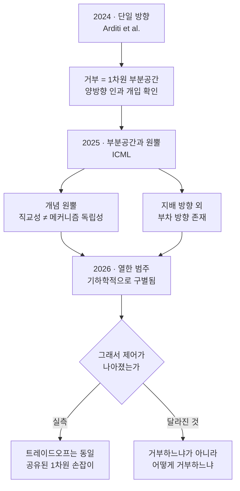

*하나의 축인 줄 알았던 것이 여러 갈래로 갈라지는데, 손잡이는 여전히 하나입니다.*

파생 모델을 평가해야 하는 자리에 있다면 지난 2년간 거부 방향 연구가 어떻게 움직였는지 알아 두는 편이 유리합니다. 결론이 한 번 뒤집혔고, 그 뒤집힘이 평가 설계를 바꾸기 때문입니다.

짧게 요약하면 이렇습니다. 거부가 방향 하나로 매개된다는 2024년의 결과는 2025년에 부분공간과 원뿔로 확장됐고, 2026년에는 열한 개 범주로 갈라졌습니다. 그런데 갈래가 늘어난 만큼 조절 손잡이가 늘어나지는 **않았습니다**. 이 비대칭이 이 글의 핵심입니다.

## 2024년, 방향 하나로 충분해 보였습니다

시작은 [Refusal in Language Models Is Mediated by a Single Direction](https://arxiv.org/abs/2406.11717)입니다. Arditi 등은 최대 72B까지 오픈소스 채팅 모델 13종에서 거부가 1차원 부분공간으로 매개된다는 것을 보였습니다. 그 방향을 잔차 스트림에서 지우면 유해한 지시에도 거부하지 않고, 더해 주면 무해한 지시에도 거부합니다.

이 결과가 강력했던 이유는 인과성 때문입니다. 상관관계를 관찰한 것이 아니라 개입해서 양방향으로 행동을 움직였습니다. 그리고 논문 스스로 이 발견이 **현재 안전 파인튜닝의 취약성**을 드러낸다고 적었습니다. 방어를 뚫는 방법을 제안했다기보다, 방어가 생각보다 얇다는 것을 보인 연구입니다.

커뮤니티는 이 결과를 도구로 바꿨습니다. [Heretic](https://github.com/p-e-w/heretic)은 이 과정을 완전 자동화했고 2026년 8월 현재 스타 2만 7천 개를 넘겼습니다. Heretic이 기술적으로 의미 있는 지점은 자동화 자체가 아니라 **목적함수를 두 개로 잡았다는 것**입니다. 거부 횟수만 줄이는 것이 아니라 원본 모델 대비 KL divergence를 함께 최소화합니다. 즉 "얼마나 덜 거부하는가"와 "얼마나 원본과 달라졌는가"를 동시에 봅니다. 이 두 번째 축이 있느냐 없느냐가 나중에 평가의 갈림길이 됩니다.

## 2025년, 하나가 아니라 원뿔이었습니다

ICML 2025에서 단일 방향 가설을 정면으로 확장한 연구가 둘 나왔습니다.

[The Geometry of Refusal in Large Language Models: Concept Cones and Representational Independence](https://proceedings.mlr.press/v267/wollschlager25a.html)는 제목 그대로 거부가 하나의 벡터가 아니라 **개념 원뿔**로 나타날 수 있다고 봅니다. 여기서 함께 제기된 것이 표현 독립성 문제입니다. 두 방향이 수학적으로 직교한다고 해서 메커니즘적으로 독립이라는 보장이 없습니다. 직교성은 기하의 성질이고 독립성은 회로의 성질인데, 둘을 같은 것으로 취급하면 분석이 틀립니다.

[The Hidden Dimensions of LLM Alignment: A Multi-Dimensional Analysis of Orthogonal Safety Directions](https://proceedings.mlr.press/v267/pan25f.html)도 같은 방향으로 갑니다. 지배적인 안전 방향 하나 외에 역할극이나 가정적 프레이밍 같은 것과 연관된 부차적 방향들이 존재한다는 분석입니다.

여기까지의 흐름을 읽으면 자연스러운 기대가 생깁니다. 방향이 여러 개라면, 여러 개를 다 찾아서 다루면 더 정밀한 제어가 가능하지 않겠느냐는 기대입니다. 실제로 커뮤니티의 다음 세대 도구들이 이 방향으로 움직였습니다.

그런데 그 기대는 2026년에 확인되지 않았습니다.

## 2026년, 갈래는 늘었는데 손잡이는 그대로였습니다

2026년 2월 [There Is More to Refusal in Large Language Models than a Single Direction](https://arxiv.org/abs/2602.02132)이 나옵니다. 제목만 보면 단일 방향 가설을 부정하고 다방향 제어를 지지하는 연구처럼 읽히는데, 실제 내용은 그보다 미묘합니다.

저자들은 안전, 불충분하거나 지원되지 않는 요청, 의인화, 과잉 거부를 포함해 **열한 개 범주**의 거부와 비순응 행동을 조사했고, 이들이 활성 공간에서 기하학적으로 구별되는 방향들에 대응한다는 것을 확인했습니다. 여기까지는 2025년 흐름의 연장입니다.

핵심은 그다음입니다. 그 다양성에도 불구하고, **거부 관련 방향 어느 것을 따라 선형 조향을 하든 거부와 과잉 거부 사이의 트레이드오프는 거의 동일하게** 나타났습니다. 서로 다른 방향들이 공유된 1차원 조절 손잡이처럼 작동했다는 것입니다. 방향을 바꿔서 달라지는 것은 모델이 거부하느냐가 아니라 **어떻게 거부하느냐**였습니다.

이 결과는 실무적으로 꽤 큽니다. 거부의 표현이 여러 갈래라는 사실과, 그 갈래들을 다루면 더 나은 손잡이를 얻는다는 기대는 별개의 명제인데, 현재까지의 증거는 후자를 지지하지 않습니다. 더 정교한 기하 분석이 더 나은 제어로 자동 번역되지는 않았습니다.

## 평가가 프로젝트의 절반입니다

기하 분석이 제어를 개선해 주지 않는다면, 파생 모델을 판단하는 무게는 평가 쪽으로 옮겨 갑니다. 최소 네 축을 따로 봐야 합니다.

**첫째, 순응과 능력을 분리합니다.** 이것이 가장 흔히 무너지는 축입니다. 2026년 6월 [Willing but Unable](https://arxiv.org/abs/2606.05396)은 이 구분을 정면으로 다뤘습니다. 취약점 탐지 학습 데이터를 만들려면 모델에게 특정 CWE를 코드에 주입해 달라고 요청해야 하는데 안전 정렬된 코드 모델은 이런 요청을 체계적으로 거부합니다. 저자들은 Qwen2.5-Coder-Instruct 3B, 7B, 14B를 조건당 3회 반복 평가했고, abliteration이 모든 크기에서 거부율을 0 또는 0에 가깝게 낮추면서 문법적 유효성은 93% 이상 유지한다는 것을 확인했습니다.

여기서 배울 것은 결과가 아니라 설계입니다. 거부율 하나만 보면 "안 한 것"과 "못 한 것"이 섞입니다. 거부율, 시도율, 성공률을 따로 재야 "무검열이라 벤치마크가 올랐다"는 잘못된 결론을 피할 수 있습니다.

**둘째, 분포 손상을 잽니다.** 원본 대비 KL divergence, 퍼플렉시티 변화, 임베딩 드리프트입니다. 이 축이 없으면 거부율만 예쁘게 만든 모델과 실제로 멀쩡한 모델을 구분할 수 없습니다. Heretic이 비교 기준으로 자주 인용되는 이유가 바로 이 축을 명시적으로 최적화 목표에 넣었기 때문입니다.

**셋째, 행동 회귀를 봅니다.** 도구 호출, JSON 준수, 긴 문맥, 다국어, 코딩, 지시 따르기입니다. 가중치를 건드린 모델은 벤치마크 점수는 유지하면서 이런 실무 행동이 조용히 망가지는 경우가 있습니다. 사영이 지운 방향에 다른 기능이 얹혀 있었다면 그렇게 됩니다.

**넷째, 스필오버를 봅니다.** 이것이 가장 자주 빠지는 축입니다.

## 정밀 수술이라는 은유가 실측에서 무너지는 지점

2026년 5월 [Ablating Safety](https://arxiv.org/abs/2605.17413)는 정렬 제거를 통제된 변환과 평가 프로토콜로 다뤘습니다. 출발 문제의식은 정당합니다. 방어 목적의 권한 있는 보안 작업인데도 문구가 오용처럼 읽혀 모델이 거절하면, 실패가 능력 부족 때문인지 거부 정책 때문인지 구분되지 않아 보안 평가가 모호해집니다.

저자들은 권한 있는 컨텍스트 프롬프팅, 되돌릴 수 있는 거부 방향 활성 사영, 표현 제어 사영, LoRA 기반 비정렬 또는 과제 적응을 비교했습니다. 결과가 이렇습니다.

| 접근 | 보안 점수 | 일반 점수 | 안전하지 않은 순응 |
|---|---:|---:|---:|
| rank-4 거부 부분공간 사영 | 0.51 | 보고 없음 | 정렬 모델과 동일 수준 |
| 과제 적응 LoRA (거부 제거 없음) | **0.87** | 0.83 | **0.13** |
| 유지 조건부 거부 억제 | 보고 없음 | 보고 없음 | 0.27 |

읽는 방법은 이렇습니다. 목표 과제를 가장 잘하는 것은 거부를 제거한 쪽이 아니라 **그 과제를 가르친 쪽**이었습니다. 거부를 억제한 경로는 목표 점수는 덜 오르면서 범위 밖의 위험한 순응은 두 배 이상으로 늘렸습니다.

정밀 수술이라는 표현은 목표한 것만 정확히 제거한다는 이미지를 줍니다. 그런데 실측에서 나타난 것은 좁게 겨냥한 개입이 넓게 번지는 패턴입니다. 거부는 국소 배선처럼 보이지만, 그 배선을 끊었을 때의 영향은 국소적이지 않았습니다.

## 같은 수술이 언어마다 같게 작동하지 않습니다

한국어를 다루는 조직이라면 특히 챙겨야 할 축이 하나 더 있습니다. 거부 방향은 보통 영어 프롬프트 묶음으로 추출됩니다. AdvBench와 Alpaca가 사실상 표준처럼 쓰이는데 둘 다 영어입니다.

그러면 그 방향이 다른 언어의 거부 회로와 얼마나 겹치는지가 열린 질문이 됩니다. 커뮤니티에서도 이 질문이 제기되고 있습니다. 예를 들어 [gustipardo/gemma4-abliteration](https://github.com/gustipardo/gemma4-abliteration)은 저장소 제목 자체를 "One Direction to Break Them All: Does Abliteration Remove Safety Uniformly Across Languages in Small Language Models?"로 달아 두었습니다. 아직 소규모 실험 단계라 결론을 인용할 수준은 아니지만, 질문의 방향은 정확합니다.

실무적으로 남는 함의는 대칭적입니다. 영어로 뽑은 방향을 지운 모델은 한국어에서 안전 행동이 덜 제거됐을 수도 있고, 반대로 영어 평가에서 잡히지 않는 방식으로 다른 언어에서 더 망가졌을 수도 있습니다. **어느 쪽이든 영어 벤치마크만으로는 알 수 없습니다.** 다국어 서비스를 운영한다면 안전 평가를 서비스 언어로 다시 돌려야 한다는 뜻이고, 이것은 파생 모델뿐 아니라 원본 모델에도 똑같이 적용되는 이야기입니다.

## 정렬이 어디에 저장되어 있는가라는 질문

마지막으로, 이 연구 흐름에서 방어 쪽에 가장 쓸모 있는 질문을 짚겠습니다. 안전 정렬이 모델 어디에 저장되어 있느냐입니다.

지금까지의 개입은 대부분 레이어 단위, 그리고 잔차 스트림에 값을 쓰는 몇 종류의 행렬 단위에서 이루어졌습니다. 그런데 최근 모델들은 구조가 균질하지 않습니다. 전체 어텐션과 선형 어텐션 계열이 섞인 하이브리드가 흔해졌고, MoE에서는 전문가마다 역할이 갈립니다. 정렬 신호가 이 중 어디에 얼마나 실려 있는지는 아직 잘 정리되지 않았습니다.

이 질문이 흥미로운 이유는 제거 쪽이 아니라 **강화 쪽**에 있습니다. 안전 파인튜닝이 얇은 배선 하나를 만드는 데 그친다면, 그 배선을 두껍게 하거나 여러 경로로 분산시키는 학습 방법이 있느냐를 물을 수 있습니다. 2024년 논문이 지적한 취약성은 공격 기회이기도 하지만 개선 과제이기도 합니다. 거부가 단일 축에 몰려 있다는 사실 자체가 안전 학습이 아직 거친 단계에 있다는 신호이고, 그 축을 분산시키는 방향은 아직 충분히 탐색되지 않았습니다.

## ThakiCloud 플랫폼 관점

저희는 모델을 등록하고 서빙하는 쪽이라 이 주제가 평가 게이트 설계 문제로 들어옵니다.

**Metis**는 추론 및 토큰 팩토리 계층입니다. 카탈로그에 파생 모델이 들어올 때 통과시켜야 할 최소 게이트를 위 네 축으로 잡고 있습니다. 순응과 능력을 분리해서 재고, 원본 대비 분포 변화를 남기고, 도구 호출과 JSON 준수 같은 실무 행동을 회귀 테스트하고, 목표 범위 밖의 순응이 늘었는지를 봅니다. 제작자가 발표한 거부율 하나만 보고 등록하지 않는다는 것이 요지입니다. 파생 계보를 등록 시점에 기록해 두는 일도 여기 붙습니다. abliterate된 가중치는 파일 포맷상 평범한 safetensors라 나중에는 구별할 방법이 사실상 없습니다.

**Aegis**는 온프레미스와 폐쇄망을 담당합니다. 정렬을 약화한 모델에 대한 실제 수요가 나타나는 곳이 여기이고, 대개 보안 조직의 레드팀 평가 용도입니다. 정당한 요구입니다. 다만 Ablating Safety의 숫자를 근거로 저희가 먼저 제안하는 것은 순서 바꾸기입니다. 거부를 제거한 범용 모델을 들이기 전에 해당 과제에 적응시킨 모델을 재 보시는 편이 좋습니다. 측정된 범위 안에서는 그쪽이 목표 성능은 더 높고 부작용은 더 적었습니다.

**Signum**은 IAM과 감사 이벤트를 담당합니다. 정렬이 약화된 모델을 운용한다면 통제는 모델 안이 아니라 모델 밖에 있어야 합니다. 모델의 거부에 의존하던 통제를 플랫폼 계층으로 옮기는 작업이고, 누가 호출했고 무엇이 오갔는지가 남아야 감사에 답할 수 있습니다.

에이전트 워크로드라면 **Paxis**의 정책 게이트가 같은 자리를 맡습니다. 도구 호출과 행동을 정책으로 걸러 감사 로그에 남기는 구조에서는 모델이 거절하지 않아도 실행 단계에서 막힙니다. 정렬을 가중치에 의존하는 설계와 실행 경로에 두는 설계는 견고함이 다르고, 지난 2년의 연구는 전자가 생각보다 얇다는 쪽을 가리킵니다.

## 정리

2024년의 단일 방향 가설은 틀렸다기보다 불완전했습니다. 2025년의 원뿔과 부분공간, 2026년의 열한 범주가 그림을 채웠습니다.

그런데 그림이 복잡해진 만큼 제어가 정교해지지는 않았습니다. 서로 다른 거부 방향들이 결국 같은 1차원 손잡이처럼 작동했고, 달라진 것은 거부 여부가 아니라 거부 방식이었습니다. 좁게 겨냥한 개입은 넓게 번졌고, 목표 과제를 잘하게 만드는 데는 거부 제거보다 과제 학습이 나았습니다.

파생 모델을 평가하는 입장에서 챙길 것은 결국 네 개입니다. 순응과 능력을 분리하고, 분포 손상을 재고, 실무 행동 회귀를 보고, 범위 밖 순응을 확인하는 것입니다. 그리고 서비스 언어로 다시 재야 합니다. 영어로 잰 안전은 한국어 서비스의 안전이 아닙니다.

## 참고 자료

- [Refusal in Language Models Is Mediated by a Single Direction](https://arxiv.org/abs/2406.11717) (Arditi et al., 2024-06-17)
- [The Geometry of Refusal in Large Language Models: Concept Cones and Representational Independence](https://proceedings.mlr.press/v267/wollschlager25a.html) (ICML 2025)
- [The Hidden Dimensions of LLM Alignment: A Multi-Dimensional Analysis of Orthogonal Safety Directions](https://proceedings.mlr.press/v267/pan25f.html) (ICML 2025)
- [There Is More to Refusal in Large Language Models than a Single Direction](https://arxiv.org/abs/2602.02132) (2026-02-02)
- [Ablating Safety: Mechanisms for Removing Alignment in Language Models for Security Applications](https://arxiv.org/abs/2605.17413) (2026-05-17)
- [Willing but Unable: Separating Refusal from Capability in Code LLMs via Abliteration](https://arxiv.org/abs/2606.05396) (2026-06-03)
- [p-e-w/heretic](https://github.com/p-e-w/heretic) (2026-08-19 기준 스타 27.8k)
- [gustipardo/gemma4-abliteration](https://github.com/gustipardo/gemma4-abliteration) (소규모 실험, 질문 제기 단계)
