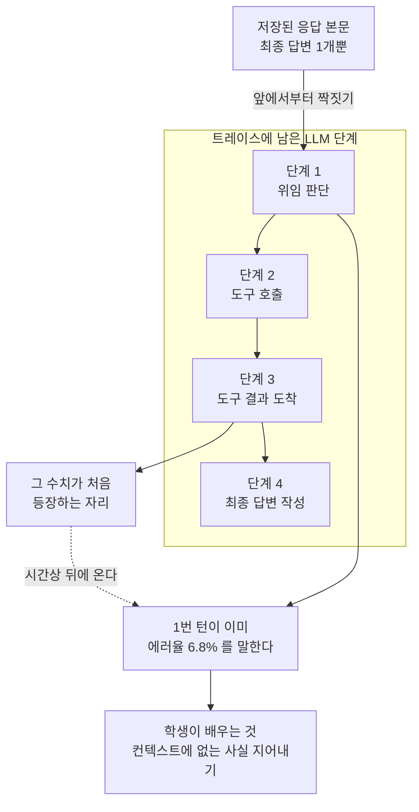

작은 모델에 에이전트 행동을 증류하고 계신다면, 위임 능력은 공짜로 따라오지 않는다는 점을 먼저
말씀드립니다. 저희 8B는 자기가 어떤 에이전트인지 아는 데까지는 왔는데, 언제 남에게 넘길지는
몰랐습니다. 그걸 가르치려고 하루에 열두 팔을 같은 홀드아웃에 재봤고, 위임을 얻으면서 기존
성능을 잃지 않은 조합은 **딱 하나**였습니다.

| | 이전 정본 | 새 정본 | |
|---|---|---|---|
| 회귀 홀드아웃 349 | 329 | **326** | 통계적으로 구분 안 됨 (p=0.7111) |
| 위임 정확도 | 63.8% | **78.8%** | +15.0%p |
| 위임 회수 | 53.3% | **76.5%** | +23.2%p |
| 절제 | 75.0% | **81.2%** | +6.2%p |

그리고 여덟 팔이 헛돈 뒤에야 진짜 원인을 찾았는데, 모델도 데이터 비중도 아니었습니다.
궤적을 조립하는 코드가 **최종 답변을 첫 번째 턴에 붙이고 있었습니다.**

## 위임은 대개 다른 것과 맞바꿔집니다

가르치려는 행동은 두 가지가 짝입니다. 넘겨야 할 때 넘기는 것(회수), 그리고 직접 하면 될 일을
넘기지 않는 것(절제)입니다. 둘 중 하나만 올리는 건 쉽습니다. 위임 예시를 넣으면 회수가 오르고,
그 대신 아무 데나 넘기기 시작합니다.

가로축이 위임 정확도, 세로축이 기존 성능(회귀 홀드아웃 통과율)입니다. 오른쪽 위가 좋은 자리인데,
대부분의 팔이 오른쪽으로 가면서 아래로 떨어집니다. 위임을 배우는 대가로 한국어 응답이나 도구
선택 같은, 이미 잘하던 것을 깨뜨린 겁니다.

가장 극단적인 사례가 위임 전용 어댑터였습니다. 오케스트레이션 데이터만 118행으로 별도 LoRA를
학습해 서빙에서 라우팅하자는 안이었고, 매력적이었습니다. 결과는 회귀 213점에 한국어 응답 0/66,
절제 18.8%였습니다.

**무엇을 하지 않을지는 하는 예시들 사이에서만 배워집니다.** 절제는 일반 작업 데이터와의 균형에서
나오는 것이라, 위임 데이터만 격리해 놓으면 그 신호 자체가 사라집니다. 멀티 LoRA 서빙은 서빙
비용을 줄이는 기술이지 행동을 섞는 기술이 아니었습니다.

## 여덟 팔이 틀린 데이터 위에서 돌고 있었습니다

비중을 7.8%에서 21.9%까지 바꿔가며 곡선을 그리고, 같은 페르소나에서 위임과 절제를 짝지어
대조쌍을 만들고, 그래도 절제가 안 붙길래 학습 동역학을 의심하던 중이었습니다.

원인은 학습이 아니라 데이터에 있었습니다.

에이전트 실행 기록을 학습용 궤적으로 조립하는 코드가, 저장된 응답 본문을 실행 트레이스의 각
단계에 **앞에서부터 순서대로** 짝지었습니다. 그런데 스트리밍으로 도는 오케스트레이션 실행은
응답 행을 **최종 답변 하나만** 저장합니다. 트레이스에는 턴마다 단계가 남아 여러 개인데 말입니다.

실측은 이렇습니다. 오케스트레이션 실행 **200건 전부**가 최종 답변을 도구 호출보다 앞에 놓고
있었고, 그중 **118건**은 그 첫 턴이 뒤쪽 도구 결과에만 존재하는 수치를 이미 인용하고
있었습니다. 첫 턴이 "에러율 6.8%, p99 지연 2,400ms"라고 말하는데, 그 값은 세 번째 단계의 도구
결과에서 처음 나옵니다.

이 궤적으로 학습하면 학생 모델은 **컨텍스트에 없는 사실을 지어내도록** 배웁니다. 날조를
의도적으로 가르치는 학습셋이었던 셈인데, 저희 평가 지표 중 어느 것도 그걸 잡지 못했습니다.

수정 자체는 한 줄에 가깝습니다. 응답 본문을 앞이 아니라 뒤에서부터 정렬하면 됩니다. 개수가
맞는 실행에서는 기존 동작이 그대로 유지됩니다. 재수출해서 확인하니 첫 자리에 산문이 오던 것이
200건에서 0건이 됐고, 답변이 도구 결과 뒤에 오는 것이 0건에서 195건이 됐습니다.

### 회귀 테스트가 버그 있는 코드에서 통과하면 픽스처가 틀린 겁니다

이 사고를 테스트로 박다가 한 번 더 걸렸습니다. 처음 만든 픽스처는 통과했는데, 수정을 되돌려도
여전히 통과했습니다. 픽스처가 도구 호출 메시지를 응답 행으로 남겨서 본문이 두 개였고, 그러면
어긋남이 0이라 버그가 발현되지 않았던 겁니다.

실제 DB를 조회해 세션당 응답 행이 정확히 하나인 걸 확인하고 나서야 픽스처가 사고를 재현했습니다.
**회귀 테스트는 수정을 되돌려 실패시켜 보는 것까지가 한 단위입니다.**

## 지표가 안 보는 자리에서 두 개가 더 썩고 있었습니다

첫 번째는 조건 불일치였습니다. 평가할 때는 모델에게 24개 도구 스키마를 노출하는데, 학습 행에는
그 스키마가 **하나도** 들어 있지 않았습니다. 학생을 한 조건에서 가르치고 다른 조건에서 시험한
겁니다. 스키마를 붙이자 한국어 응답 유출이 39/66에서 66/66으로 사라졌습니다.

다만 여기서 반대 방향으로 넘어갔습니다. 모든 행에 스키마를 붙였더니 도구 사용이 64개 중 **0개**로
무너졌습니다. 조건을 맞추는 것과 신호를 덮어버리는 것은 다른 일이었습니다.

| 스키마 부착 범위 | 산문 대 도구 비율 | 회귀 | 도구 선택 |
|---|---|---|---|
| 모든 행 | 59.7 대 1 | 274 | 0/64 |
| 산문 유형만 | 43.4 대 1 | 281 | 8/64 |
| **라벨이 정확한 행만** | **4.6 대 1** | **326** | **52/64** |

두 번째는 더 조용했습니다. 교사 응답을 저장하는 파서가 도구 호출의 **이름만 남기고 인자를 버리고**
있었습니다. 103개 타깃 중 93개가 빈 인자였습니다. 몇 주 동안 아무도 몰랐던 이유는 단순합니다.
저희 채점기가 도구 **이름만** 채점하기 때문입니다.

파서를 고치고 92행을 교사에게 다시 물어봤습니다. 8병렬로 2분 걸렸고 93%가 실제 인자를 회수했습니다.
그리고 그 팔은 **졌습니다.** 320점으로 326점짜리 팔에 밀렸습니다. 예측대로 정책 판단은 4/9에서
6/9로 회복됐는데 도구 선택이 52에서 44로 떨어졌습니다. 두 팔의 차이는 p=0.3075라서, 정직하게
읽으면 **차이가 없고 해로울 수도 있습니다.**

## 게이트를 절대값으로 썼고, 그게 오설계였습니다

실험 전에 통과 기준을 못 박아 뒀습니다. "회귀 327점 이상"이었습니다. 최종 후보는 326점입니다.

한 점 차이입니다. 그런데 349개 짝지은 케이스에서 한 점은 노이즈입니다. 326과 329를 McNemar
검정에 넣으면 p=0.7111이 나오고, 이건 **검정이 두 모델을 구분하지 못한다**는 뜻입니다. 저희가
지키고 싶었던 건 "유의하게 나빠지지 않는다"였는데, 그걸 절대 하한으로 적어 놨던 겁니다.

**결과를 보고 게이트를 고치지는 않았습니다.** 고치면 그건 게이트가 아닙니다. 미달로 기록해
두고 오설계는 별건으로 남겼습니다. 다음 사전등록은 기준선 대비 짝지은 검정으로 쓰고, 유형별
하한을 함께 겁니다. 총점 274점짜리 팔이 도구 선택 0/64였는데, 총점만 보면 한 유형이 통째로
무너진 게 안 보이기 때문입니다.

## 예측이 세 번 빗나갔습니다

기록해 둘 만한 부분입니다.

첫째, "타깃이 틀려서 언어가 유출된다"고 봤습니다. 타깃을 고치니 유출이 **더 정확해졌습니다.**
엉뚱한 도구를 부르던 것이 그럴듯한 도구를 부르는 쪽으로 바뀌었을 뿐 총량은 그대로였습니다.

둘째, "개입 범위가 너무 넓다"고 봤습니다. 좁혀 보니 도구 선택이 8/64로 더 나빠졌고, 반대
진단인 "양성 예시가 너무 적다"가 참이었습니다.

셋째, "실제 인자를 넣으면 정책 판단이 회복된다"고 봤습니다. 회복은 했는데 다른 데서 더 잃었습니다.

세 번 다 그럴듯한 메커니즘이었고, 세 번 다 측정이 뒤집었습니다. 열두 팔을 하나의 홀드아웃에 재는
것 자체가 노이즈를 고를 위험이라, 상위 세 팔은 서로 p 값 0.2를 넘겨 갈리지도 않습니다.
최종 팔을 고른 근거는 "가장 높아서"가 아니라 **세 위임 지표를 동시에 올린 유일한 팔이면서
기존 성능이 기준선과 구분되지 않아서**입니다.

## ThakiCloud 제품 관점

이 실험은 저희 에이전트 제어 평면인 **Paxis** 위에서 돌았고, 다시 Paxis로 들어갔습니다.

Paxis는 스킬과 도구, 정책, 감사 로그를 일급 리소스로 다루는 Agent-Native Cloud입니다. 사용자가
빌더로 에이전트를 만들면 그 실행 궤적이 감사 가능한 형태로 남고, 저희는 그 궤적을 학습 데이터로
바꿉니다. 이번 라운드에서 새 정본 모델은 카탈로그에 등록되고 서빙 엔드포인트가 교체된 뒤
Paxis의 서브 에이전트 모델로 배선됐습니다. 만든 것을 다시 자기 안에 넣는 데까지가 한 사이클입니다.

**궤적이 감사 가능하다는 게 여기서 실질적인 이득이었습니다.** 날조 학습 결함을 찾아낸 방법은
모델을 들여다본 게 아니라 조립된 궤적에서 "답변이 도구 결과보다 먼저 나온 실행"을 세어 본
것이었습니다. 실행 기록이 순서 있는 이벤트로 남지 않았다면 이 결함은 지표에 안 잡히는 채로
계속 갔을 겁니다.

서빙은 **Metis** 위에서 돕니다. 이번 팔들은 전부 같은 서빙 설정으로 쟀는데, 이건 취향이
아니라 필수 조건입니다. 저희 실측으로 플랫폼 기본 설정과 튜닝 설정 사이에 처리량 차이가
**18.8배**까지 벌어졌습니다. 팔마다 서빙 설정이 다르면 그 비교는 모델이 아니라 설정을 잰 것이
됩니다.

두 제품이 붙어 있는 게 이 실험의 전제였습니다. 궤적이 남아야 학습할 수 있고(Paxis), 같은 조건에서
서빙돼야 비교할 수 있습니다(Metis). 온프레미스와 소버린 환경에서도 같은 구조가 그대로 돕니다.

## 아직 못 하는 것

**홀드아웃이 작습니다.** 정책 판단 9건, 단계 순서 6건, 인용 6건입니다. 이 크기로는 아무 주장도
할 수 없습니다. 앞서 "정책 판단이 4/9에서 6/9로 회복됐다"고 쓴 것도 사실은 2건 차이입니다.

**채점기가 도구 이름만 봅니다.** 올바른 서브 에이전트에게 올바른 인자로 갔는지는 아무도 재지
않고 있습니다. 인자가 몇 주 동안 빈 채로 있었던 것도 그래서입니다.

**교사 축은 측정하지 못했습니다.** 모델을 세 개로 나눠 요청했는데 학습 행 149개가 전부 같은
모델이 만든 것이었습니다. 요청 본문의 모델 지정이 무시되고 에이전트에 고정된 값이 이기는
구조였습니다. 우회는 구현했고 아직 돌리지 않았습니다.

**시드 하나, 팔당 한 번입니다.**

그래서 다음에 할 일은 팔을 더 던지는 게 아닙니다. 상위 세 팔이 서로 갈리지 않는 상태에서 팔을
늘리는 건 노이즈에 튜닝하는 일이라, 홀드아웃을 키우고 채점기가 인자와 대상까지 보게 만드는
것이 먼저입니다. 게이트도 짝지은 검정으로 다시 씁니다.

측정을 늘리기 전에 측정 도구부터 고치는 순서입니다.
