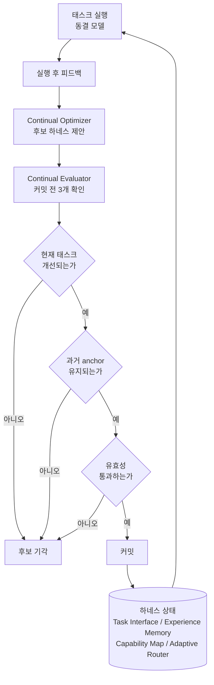

> 📄 **심층 리뷰 전문(DOCX)**: 이 논문의 상세 피어리뷰를 [Google Drive에서 다운로드](https://drive.google.com/file/d/1rVrbakfFrzsAn6bIxcOzUdST8qiemxw5/view)할 수 있습니다.

## 왜 읽어야 하나

에이전트를 프로덕션에서 돌리면서 스킬, 메모리, 프롬프트, 라우팅 규칙을 스스로 업데이트하게 둔 엔지니어라면, 이번 논문이 다루는 문제가 곧 내일 우리 시스템에서 생길 문제입니다. 나잔대 대학 연구진 6명이 쓴 'Harness Continual Learning: Continual Adaptation Beyond Model Parameters'(arXiv 2608.19013)는 모델 가중치를 전혀 건드리지 않고 하네스만 순차 경험에 맞춰 진화시키는 학습 패러다임을 정식화합니다. 핵심 결론을 먼저 드립니다. 동결된 모델 위에서 하네스만 업데이트해도 여러 설정에서 baseline 대비 10% 이상의 상대 향상을 얻었고, 그 대가인 '하네스 레벨 망각'은 제안과 커밋을 분리하는 guarded evolution과 과거 손실 허용도라는 하나의 숫자로 명시적으로 조절할 수 있었습니다.

<!-- nlm-visual -->

*NotebookLM이 소스를 종합해 생성한 인포그래픽입니다.*

## 개요

지속 학습(continual learning) 문헌의 대다수는 모델 중심으로 되어 있습니다. 상태가 변하는 것은 모델 파라미터이고, 순차적인 경험에 따라 가중치가 업데이트되며, 그 사이에서 과거 작업 성능을 얼마나 유지하는지가 망각의 정의입니다. 그런데 요즘 에이전트는 모델 바깥에서도 충분히 적응합니다. 프롬프트가 고치고, 메모리가 쌓이고, 도구와 스킬 목록이 자라며, 라우팅 규칙이 바뀝니다. 이 콘텐츠들은 다음 실행을 함께 형성하므로, 모델이 동결되어 있어도 하네스 업데이트가 이전까지 신뢰받던 행동을 흔들 수 있습니다.

논문은 이 지점에 새로운 질문을 놓습니다. 모델 밖의 상태를 계속 개선하되, 전에 익힌 행위를 유지하려면 어떻게 해야 하나. HCL은 이 질문에 답하기 위한 패러다임입니다. 동결된 foundation model을 축으로 하네스가 진화하고, 그 과정에서 사라지는 과거 행위를 'harness-level forgetting'이라 명명합니다. 이름 붙이기는 이 논문의 첫 기여입니다. 하네스가 얇았던 시절에는 이런 회귀를 "모델이 까먹었다"고 하나로 묶어 처리했지만, 이제 변하는 것 자체가 모델이 아니므로 회귀를 하네스 업데이트에 귀속하고 잴 수 있게 됐습니다.

## 이 논문은 무엇인가

HCL은 실행에 직접 닿는 네 개 구성요소를 하나의 진화 상태로서 다룹니다. Task Interface는 태스크와 환경을 에이전트가 읽는 방식을 정의하고, Experience Memory는 실행 후 피드백을 쌓아 두며, Capability Map은 재사용 가능한 절차와 기능을 catalog화하고, Adaptive Router는 다음 실행에 어떤 것을 어떻게 묶을지 결정합니다. 논문은 이 네 가지를 독립 장치가 아니라 하나의 mutable state로 보고, 실패가 발생하면 어떤 요소가 수정되는지를 추적합니다.

진화 메커니즘은 제안과 커밋의 분리로 설계됩니다. 실행이 끝나면 Continual Optimizer가 피드백을 근거로 후보 하네스를 제안합니다. 제안은 어디까지나 후보입니다. Continual Evaluator가 세 가지 확인을 통과시킨 후보만 상태에 커밋됩니다. 첫째, 현재 태스크에서 실제로 개선되는가. 둘째, 과거에 검증받아 보존되어 있는 anchor set의 성능을 유지하는가. 셋째, 후보 자체의 유효성을 지킬 수 있는가. 세 관문 중 하나라도 무너지면 후보는 버려지고 하네스는 이전 상태를 그대로 유지합니다.

두 번째 관문의 무게가 다릅니다. 과거 손실 허용도, 즉 anchor set에서 감내할 수 있는 성능 저하의 상한을 하나의 매개변수로 드러냅니다. 허용도를 0에 붙이면 "현재 풀고 있는 과거 anchor는 전부 보존하라"가 되어 망각은 사실상 0에 수렴하지만 적응은 크게 줄어듭니다. 반대로 무한대로 올리면 가장 공격적인 업데이트가 받아들여지고 과거 태스크의 회귀가 늘었습니다. 논문은 이 허용도 하나만으로 stability와 plasticity의 균형점을 의도적으로 선택할 수 있음을 여러 스트림에서 확인합니다.

## 아키텍처

guarded evolution의 전체 루프를 도식으로 나타내면 다음과 같습니다. 실행은 동결된 모델이 하고, 변화는 하네스 상태에만 커밋됩니다.

이 구조를 한 줄로 압축하면 "배우는 쪽과 받아들이는 쪽을 나누고, 받는 쪽에 과거 보존 검사를 넣는다"입니다. Optimizer가 아무리 좋은 수정을 제안해도 Evaluator의 세 관문을 통과하지 못하면 시스템 상태는 바뀌지 않습니다. 에이전트 시스템에서 이분법은 드뭅니다. 대개 학습과 배포가 하나의 스트림에 묶여 있고, 회귀가 발견되면 그제서야 롤백합니다. HCL은 롤백을 사후 조치가 아니라 커밋 조건으로 앞으로 당겨 온 것입니다.

## 실험 결과 (논문 보고 값)

아래 수치는 모두 논문이 보고한 값이며, 이 글에서 독립 재현하지는 않았습니다. 설정은 동결 모델에 따라 네 갈래로 나뉩니다. ALFWorld 텍스트 환경에는 Qwen3.5-9B, Minecraft 커리큘럼과 멀티모달 스트림에는 Qwen3.6-27B, 텍스트 추론 스트림에는 DeepSeek-V4-Flash, 구성요소 ablation에는 Qwen3.5-4B를 썼고, 각 설정 안에서는 모든 비교 대상이 같은 모델을 공유합니다.

장기 개방 환경 실험에서 HCL의 진화 폭이 가장 선명하게 보입니다.

| 환경 (동결 모델) | Static | RAG | MemP | MemRL | Stability-HCL | Plasticity-HCL |
|---|---|---|---|---|---|---|
| ALFWorld 6계열 최종 평균 (Qwen3.5-9B) | 47.12 | 55.56 | 53.15 | 51.51 | **61.74** (Fgt 2.64) | **62.98** (Fgt 10.94) |
| Minecraft 50태스크 완주 (Qwen3.6-27B) | 15에서 정체 | - | 91 action | 88 action | **50/50, 83 action** | - |

ALFWorld는 Pick, Look, Clean, Heat, Cool, Two-object의 여섯 계열을 순서대로 배우고, 마지막에는 134개 공식 평가 에피소드에서 점수를 냅니다. 메모리 기반 baseline(MemP, MemRL)은 개별 계열을 올릴 수 있지만 스트림 전체에서 편차가 크고, RAG는 회수만으로는 재사용 가능한 절차와 라우팅 규칙을 수정할 수 없어 한계가 보입니다. Plasticity-HCL은 Two-object 계열을 전부 풀었지만 망각이 10.94로 높고, Stability-HCL은 61.74로 크게 뒤지지 않으면서 망각을 2.64까지 끌어내립니다. Minecraft에서는 Static 하네스가 15태스크에서 멈추는 동안 HCL이 50태스크를 완주했고, 누적 환경 action는 83으로 MemRL(88), MemP(91)보다 적었습니다. 같은 커리큘럼을 더 적은 실수로 풀었다는 뜻입니다.

제어 스트림 실험은 허용도 b의 효과를 정량화합니다. 각 태스크당 250개로 적응, 50개로 검증, 500개로 테스트하는 동일한 배분 아래, 텍스트 스트림(MuSiQue, ProofWriter, GSM8K, HotpotQA)과 멀티모달 스트림(COCO detection, COCO captioning, RefCOCO grounding, VQAv2)을 순서대로 통과시킵니다.

| 스트림 (동결 모델) | Zero-shot | DGG | Stability-HCL | Plasticity-HCL |
|---|---|---|---|---|
| 텍스트 추론 최종 평균 (DeepSeek-V4-Flash) | 45.50 | - | 52.20 (Fgt 0.00) | **64.70** (Fgt 0.07) |
| 멀티모달 지각 최종 평균 (Qwen3.6-27B) | 39.40 | 42.73 (Fgt 0.26) | **68.92** (Fgt 0.22) | 67.96 (Fgt 0.81) |

텍스트 스트림에서 Plasticity-HCL은 Zero-shot 45.50에서 64.70까지 끌어올려 약 42%의 상대 개선에 해당합니다. 멀티모달 스트림에서는 Stability-HCL이 68.92로 가장 높았고, detection 계열은 4.27에서 65.34로 늘었습니다. VQAv2만이 예외로 Zero-shot이 가장 강했는데, 동결 모델이 이미 직접 이미지 질의응답에서 잘했기 때문입니다. DGG와 같은 최신 순차 학습 방법도 HCL에 못 미칩니다. b를 고정값으로 sweeping한 결과에서도 방향성이 일관됩니다. b가 0에서 무한대로 늘면서 최종 평균은 61.25, 63.46, 62.04, 60.13을 지나고, 평균 망각은 0.39에서 3.45까지 단조로워졌습니다. 중간 허용도가 성능과 망각의 균형점에서 작동한다는 증거입니다.

ablation을 요약하면, Experience Memory와 Task Interface의 업데이트를 없앨 때 최종 성능의 감소가 가장 컸고, Memory를 동결하면 망각도 0.83으로 늘었습니다. 진화하는 메모리가 획득과 보존을 동시에 지지한다는 뜻입니다. 다만 논문은 저 망각의 ablation 변종이 더 좋은 하네스라는 뜻은 아니라며, 적응 범위가 줄어든 결과임을 명시합니다.

## ThakiCloud 제품 적용 시사점

이 논문이 Paxis와 직접 닿는 지점은 "스스로 업데이트되는 에이전트 자산에 커밋 게이트를 두는가"라는 질문입니다. Paxis는 스킬, 도구, 정책, 감사 로그를 일급 리소스로 다루는 Agent-Native Cloud입니다. 스킬이 실패 스테이크를 넘으면 승격되고, 피드백 지적이 개선 태스크로 착지하며, 세션 학습이 핫 브리프로 다음 세션에 라우팅됩니다. 하네스만 변하는 이 구조 전체가 HCL 식의 하네스 업데이트입니다. 모델 가중치는 고정되어 있고, 변하는 것은 스킬 본문과 메모리와 라우팅 상태뿐입니다.

논문이 formal화한 guarded evolution을 Paxis의 관행으로 번역하면 세 가지가 나옵니다. 첫째, 제안과 커밋의 분리. 스킬 진화 후보는 "실행 피드백 기반 제안" 단계에서 탄생하고, 상태에 반영되기 전에는 후보입니다. 이 논문은 그 후보가 통과해야 할 세 관문을 명시합니다. 현재 개선, 과거 anchor 유지, 유효성. 둘째, 과거 유지 체크의 회귀 테스트화. "앞으로 이 스킬이 바뀌면 기존에 잘하던 태스크는 계속 잘해야 한다"는 조건을, commit 전에 실제로 실행하는 anchor set으로 구현할 수 있습니다. HCL의 Stability-HCL이 ALFWorld에서 망각 2.64를 낸 것이 바로 이 관문의 실체입니다. 셋째, 허용도를 숫자로. 우리 환경의 skill-retro streak 상한이나 승격 임계는 지금도 "허용도"의 역할을 합니다. 다만 HCL은 그 허용도를 stability와 plasticity의 트레이드오프를 의도적으로 조정하는 변수로 승격합니다. "몇 번의 실패 후에 승격할 것인가"가 아니라, "과거 성능을 얼마나 잃을 만큼만 진화할 것인가"를 정하는 문제로 바꿉니다.

ai-platform 렌즈에서도 의미가 있습니다. 서빙되는 모델은 그대로 두고 에이전트 자산을 진화시키는 방식이면, 추론 비용 구조와 모델 버전 관리 부담은 유지되면서 에이전트 행위는 계속 개선됩니다. 학습 비용이 가중치 업데이트가 아니라 하네스 자산의 검증으로 이동합니다. GPU를 태우지 않는 지속 학습, 이것이 HCL이 여는 실행 경제성입니다.

## 한계 및 반론

먼저, anchor set의 유한성입니다. 허용도를 0으로 붙여도 논문은 텍스트 스트림에서 0.39의 잔여 망각을 보고합니다. 보존해야 할 anchor는 유한한 검증 집합이고, 망각은 그 집합 밖의 별도 과거 테스트로 측정되므로, "풀고 있는 anchor는 다 보존"이 "모든 과거 행동은 불변"을 보장하지 않습니다. 커밋 게이트가 막을 수 없는 회귀 지대가 구조적으로 남는다는 뜻입니다.

둘째, retention 평가의 비용입니다. 모든 후보 커밋 전에 anchor set을 실제로 돌려야 합니다. 논문은 이 비용 문제를 결론부에 "미해결 과제"로 명시해 둡니다. anchor가 커지고 환경이 비결정적이면, 세 관문 중 두 번째가 가장 비싼 단계가 됩니다. HCL의 실용적 천장은 결국 "과거를 얼마나 싼 가격으로 재확인할 수 있는가"에 묶일 가능성이 높습니다.

셋째, 평가 범위가 학술 벤치마크에 머물러 있습니다. ALFWorld, Minecraft, COCO 계열, 추론 Q&A까지. 실제 엔터프라이즈 워크플로처럼 상태가 흩어져 있고, 실패가 비가역적이며, anchor를 정의하기 어려운 환경에서의 검증은 아직 없습니다. VQAv2에서 Zero-shot이 이긴 사례도, 하네스가 무조건 이기는 것이 아님을 보여 줍니다.

넷째, 이 패러다임이 모델 중심 지속 학습의 대안인지 보완인지에 대한 질문은 논리가 아니라 경험의 영역입니다. HCL은 "모델을 안 건드릴 때"의 학습을 다룹니다. 도메인이 바뀌는 속도가 모델 재학습을 정당화하는 지점에서는, 여전히 파라미터 업데이트의 지점이 있습니다. 논문도 HCL을 모델 학습의 대체가 아니라 모델 밖 상태의 학습이라는 새로운 축으로 위치시킵니다.

## 정리

에이전트를 오래 돌리는 시스템에서 변해야 할 것은 모델이 아니라 하네스이고, 하네스가 변하면 과거 행위가 흔들리는 것이 당연합니다. HCL 논문의 기여는 이 문제를 패러다임으로 정식화하고, 제안과 커밋을 분리한 guarded evolution으로 과거 보존을 커밋 조건 삼아, 허용도라는 하나의 숫자로 stability와 plasticity의 균형점을 의도적으로 고르게 만든 것입니다. 실험은 그 설계가 동결 모델 위에서도 capability accumulation과 failure recovery를 만들고, 망각을 측정 가능하고 조절 가능한 양으로 만든다는 것을 보여 줍니다.

우리에게 남는 takeaway는 명확합니다. 스스로 진화하는 스킬, 메모리, 라우팅을 돌리고 있다면, 그 진화에 "커밋 전 과거 유지 확인"이라는 관문이 있는가부터 확인하십시오. 그리고 그 관문의 허용도를 숫자로 표현할 수 있게 만드십시오. "괜찮겠지"로 통과하는 하네스 업데이트는, 언젠가 가장 오래된 태스크에서 가장 조용한 회귀를 만듭니다. HCL은 그 회귀에 이름을 붙이고, 이름을 붙인 회귀를 관문 뒤에 두고, 관문의 긴장을 하나의 매개변수로 조절할 수 있게 한 논문입니다.

<!-- nlm-visual -->

*NotebookLM이 소스를 종합해 생성한 인포그래픽입니다.*

## 출처

- [arXiv 2608.19013: Harness Continual Learning: Continual Adaptation Beyond Model Parameters](https://arxiv.org/abs/2608.19013) (Borui Kang, Jinrui Gu, Junhan Lv, Wenbin Li, Lei Wang, Yang Gao. State Key Laboratory for Novel Software Technology, Nanjing University; University of Wollongong. v1, 2026-08-19, cs.LG/cs.AI)
- 소개 트윗: [@omarsar0 (elvis, D.AI)](https://x.com/hjguyhan/status/2090841745793982600)
- 📄 심층 리뷰 전문(DOCX): [Google Drive에서 다운로드](https://drive.google.com/file/d/1rVrbakfFrzsAn6bIxcOzUdST8qiemxw5/view)