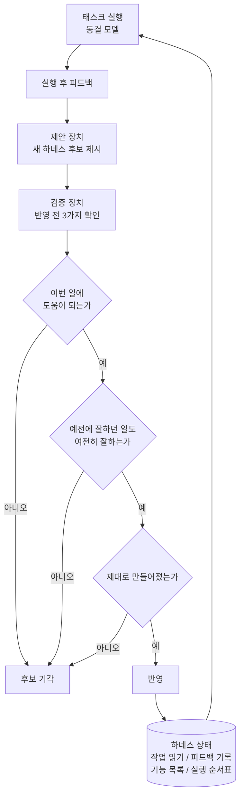

> 📄 **심층 리뷰 전문(DOCX)**: 이 논문의 상세 피어리뷰를 [Google Drive에서 다운로드](https://drive.google.com/file/d/1rVrbakfFrzsAn6bIxcOzUdST8qiemxw5/view)할 수 있습니다.

에이전트를 오래 켜 두면 시간이 지나며 좋아지는 것은 사실 두뇌가 아닐 수 있습니다. 두뇌 옆에 붙어 있는 메모와 안내판이 계속 고쳐지면서 실력이 느는 경우가 많습니다. 이번에 소개할 논문은 이 사실을 실험으로 확인하고, 그 방법이 만드는 부작용까지 숫자로 붙잡았습니다.

에이전트를 여러 대 무인으로 돌리거나 그 운영 비용을 책임지는 분이라면 읽어볼 만합니다. 논문 이름은 하네스 지속 학습이고, 두뇌는 그대로 둔 채 그 둘레만 계속 고쳐 쓰는 방법을 다룹니다.

*가운데 얼음처럼 굳은 핵심을 여러 겹의 물결이 감싸고 도는 모습을 형상화했습니다.*

## 쉽게 말하면

축구팀 감독을 떠올려 보겠습니다. 감독의 실력과 선수단의 기본기는 시즌 내내 그대로입니다. 대신 라커룸 벽에는 전술 보드가 하나 있고, 코치진은 경기가 끝날 때마다 이 보드를 조금씩 고쳐 씁니다. 오늘 상대를 적어두는 칸, 지난 경기에서 배운 점을 적는 공책, 우리 팀이 쓸 수 있는 전술 목록, 이번 경기에 어떤 전술을 어떤 순서로 꺼낼지 정하는 작전표가 여기에 해당합니다.

문제는 새 전술을 함부로 보드에 올리면 안 된다는 데 있습니다. 지난달까지 잘 통하던 전술을 지워 버리고 엉뚱한 전술로 바꿔치기하면, 다음 경기에서 갑자기 지는 사고가 납니다. 그래서 이 논문은 새 전술을 보드에 올리기 전에 세 가지를 확인하는 절차를 제안합니다. 이번 경기에 정말 도움이 되는가, 예전에 잘 통하던 전술도 여전히 잘 통하는가, 전술 자체가 제대로 그려졌는가입니다. 셋 다 통과해야만 보드에 올라가고, 하나라도 걸리면 보드는 그대로 남습니다.

**두뇌에 해당하는 것이 모델이고, 전술 보드에 해당하는 것이 하네스입니다.** 이 논문은 모델은 그대로 둔 채 하네스만 이렇게 검토받으며 진화시키는 방법을 실험했습니다.

*왼쪽은 고정된 모델 파라미터를 4대 구성 요소(작업 인터페이스, 경험 메모리, 역량 맵, 적응형 라우터)가 감싸는 그림이고, 오른쪽은 새 하네스 후보를 제안하는 장치와 검증 후 반영하는 장치, 10퍼센트 이상의 성능 향상을 보여줍니다.*

## 무엇을 해봤나

이 논문은 난징대 연구진 여섯 명이 썼습니다. 전술 보드에 해당하는 하네스를 네 칸으로 나눠 하나의 상태로 다룹니다. 오늘 할 일과 환경을 읽는 칸, 실행 후 피드백을 쌓아 두는 칸, 쓸 수 있는 절차와 기능을 목록으로 정리한 칸, 다음 실행에 무엇을 어떻게 묶을지 정하는 칸입니다. 실패가 생기면 이 네 칸 중 어느 것이 고쳐졌는지를 추적합니다.

진화 절차는 제안과 반영을 나누는 방식으로 만들었습니다. 실행이 끝나면 한 장치가 피드백을 근거로 새 하네스 후보를 제안합니다. 이 후보는 어디까지나 후보일 뿐입니다. 다른 장치가 앞서 말한 세 가지 확인을 거친 뒤에만 후보를 실제 상태에 반영합니다.

두 번째 확인의 무게가 가장 큽니다. 예전에 잘 풀던 문제를 얼마나 못 풀게 되어도 괜찮은지를 숫자 하나로 정해 둘 수 있습니다. 이 숫자를 0에 붙이면 예전 문제를 하나도 못 틀리게 하라는 뜻이 되어, 실력을 잃는 일은 거의 없지만 새로 배우는 폭도 크게 줄어듭니다. 반대로 이 숫자를 아주 크게 두면 과감한 변화가 다 받아들여지고, 예전 문제에서 실수가 늘어납니다. 즉, 사람 말로는 이 숫자 하나로 안전하게 갈 것인지 과감하게 갈 것인지를 미리 정해 둘 수 있다는 뜻입니다.

이 흐름을 그림으로 그리면 다음과 같습니다. 실행은 두뇌가 그대로 맡고, 바뀌는 것은 전술 보드에 해당하는 하네스 상태뿐입니다.

실험은 네 갈래 환경에서 진행됐습니다. 텍스트로만 움직이는 방 탈출 게임, 마인크래프트에서 순서대로 과제를 깨는 커리큘럼, 문서를 읽고 답하는 추론 문제 묶음, 그림을 보고 답하는 문제 묶음입니다. 각 환경 안에서는 비교 대상이 전부 같은 두뇌를 공유하므로, 차이는 오직 하네스를 어떻게 진화시켰는지에서만 납니다.

## 나온 결과

아래 수치는 모두 논문이 보고한 값이며, 이 글에서 따로 다시 재 보지는 않았습니다.

### 두뇌를 그대로 둬도 실력이 확 늘었습니다

가장 오래 걸리는 두 환경에서 차이가 가장 선명하게 보입니다. 방 탈출 게임은 여섯 가지 유형을 순서대로 배우고 마지막에 시험을 봅니다. 마인크래프트는 과제 오십 개를 순서대로 깨야 합니다.

| 환경 (동결 모델) | Static | RAG | MemP | MemRL | Stability-HCL | Plasticity-HCL |
|---|---|---|---|---|---|---|
| 방 탈출 게임 최종 평균 (Qwen3.5-9B) | 47.12 | 55.56 | 53.15 | 51.51 | **61.74** (Fgt 2.64) | **62.98** (Fgt 10.94) |
| 마인크래프트 50과제 완주 (Qwen3.6-27B) | 15에서 정체 | - | 91회 시도 | 88회 시도 | **50/50, 83회 시도** | - |

전술 보드를 계속 고쳐 쓴 팀은 시험 점수가 62점 언저리까지 올랐고, 보드를 아예 안 고친 팀은 47점에 머물렀습니다. 마인크래프트에서는 안 고친 팀이 열다섯 번째 과제에서 멈춰 섰지만, 계속 고친 팀은 오십 개를 전부 깼습니다. 그것도 더 적은 시행착오로 깼습니다. 즉, 사람 말로는 두뇌를 바꾸지 않고 둘레만 고쳐도 실력이 확실히 는다는 뜻입니다.

### 허용도라는 숫자 하나로 균형을 잡았습니다

이번에는 문서를 읽고 답하는 문제와 그림을 보고 답하는 문제를 각각 순서대로 풀게 했습니다. 문제마다 배우는 데 쓸 문제, 확인용 문제, 시험용 문제 수를 똑같이 맞췄습니다.

| 스트림 (동결 모델) | Zero-shot | DGG | Stability-HCL | Plasticity-HCL |
|---|---|---|---|---|
| 문서 추론 최종 평균 (DeepSeek-V4-Flash) | 45.50 | - | 52.20 (Fgt 0.00) | **64.70** (Fgt 0.07) |
| 그림 인식 최종 평균 (Qwen3.6-27B) | 39.40 | 42.73 (Fgt 0.26) | **68.92** (Fgt 0.22) | 67.96 (Fgt 0.81) |

문서 추론에서는 아무것도 안 배운 상태의 45점대가 65점 가까이까지 올랐습니다. 그림 인식에서는 68점대로 가장 높이 올랐고, 그림 속 물건을 찾아내는 문제는 4점대에서 65점대까지 뛰었습니다. 다만 그림을 보고 사람 질문에 답하는 문제 하나만은 예외였고, 아무것도 안 배운 상태가 오히려 가장 나았습니다. 즉, 사람 말로는 두뇌가 이미 잘하던 일까지 하네스가 억지로 더 잘하게 만들지는 못한다는 뜻입니다.

허용도 숫자를 0, 1, 3, 무한대로 하나씩 올려 가며 재 보니 방향이 뚜렷했습니다. 최종 점수는 61.25에서 63.46 사이를 오르내렸지만, 잃어버리는 실력은 0.39에서 3.45까지 꾸준히 늘었습니다. 즉, 사람 말로는 허용도를 중간 어디쯤에 두는 것이 점수와 안전 사이에서 가장 균형 잡힌 자리라는 뜻입니다.

### 무엇을 고쳐야 가장 크게 느는지도 알았습니다

전술 보드 네 칸 중 어느 것을 못 고치게 막아 봤더니, 실행 후 피드백을 쌓는 칸과 오늘 할 일을 읽는 칸을 막았을 때 점수가 가장 많이 떨어졌습니다. 피드백 칸을 아예 얼려 두면 잃어버리는 실력도 0.83까지 늘었습니다. 즉, 사람 말로는 계속 배우는 메모장이 실력을 늘리는 동시에 옛 실력을 지키는 역할까지 한다는 뜻입니다.

*모델 가중치는 고정한 채 프롬프트·기능·순서 규칙만 업데이트하는 흐름, 새 업데이트가 성능 개선과 기존 역량 유지를 함께 통과해야만 축적된 지식으로 쌓이는 깔때기 그림, 베이스라인 대비 10퍼센트 이상 오른 막대그래프를 담고 있습니다.*

## 그래서 무엇을 바꾸면 되나

첫째, 스스로 진화하는 스킬이나 메모, 라우팅을 쓰고 있다면 새 후보를 반영하기 전에 검토 절차부터 놓습니다. 지금 일에 도움이 되는지, 예전에 잘하던 일도 여전히 잘하는지, 후보 자체가 제대로 만들어졌는지를 순서대로 확인합니다. 세 가지 중 하나라도 걸리면 반영하지 않고 그대로 둡니다.

둘째, 예전 실력을 지키는 확인을 말로만 두지 말고 실제로 돌려 보는 회귀 시험으로 만듭니다. 우리 Paxis 환경에서는 스킬이 실패를 거듭하면 승격되고, 사용자 지적이 개선 태스크로 이어지며, 세션에서 배운 것이 다음 세션으로 넘어갑니다. 이 전체 흐름이 하네스만 진화하는 구조입니다. 그러니 새 스킬을 올리기 전에 예전에 잘 풀던 태스크 몇 개를 실제로 다시 돌려 보는 절차를 끼워 넣을 수 있습니다.

셋째, 허용도를 말이 아니라 숫자로 정해 둡니다. 지금도 몇 번 실패하면 승격할지 정해 둔 기준이 있는데, 이것도 사실 허용도의 한 형태입니다. 다만 이번 논문처럼 "몇 번 실패했나"가 아니라 "옛 실력을 얼마나 잃는 것까지 감수할 것인가"로 기준을 바꾸면, 안전과 발전 사이의 저울을 훨씬 정교하게 다룰 수 있습니다.

넷째, 모델은 그대로 두고 둘레만 고치는 방식은 계산 비용 구조에도 이득입니다. 서빙 중인 모델과 그 버전 관리 부담은 그대로인 채로 에이전트 행동만 계속 좋아지기 때문입니다. 그래픽카드를 새로 태우지 않고도 실력이 느는 길이라는 뜻입니다.

## 못 믿을 부분

첫째, 예전 실력을 지키는 확인 대상은 유한한 문제 묶음입니다. 허용도를 0으로 붙여도 문서 추론에서는 0.39만큼 실력을 잃는 결과가 그대로 남았습니다. 지금 풀고 있는 문제를 지키는 것과, 앞으로 마주칠 모든 상황에서 예전처럼 잘하는 것은 다른 이야기입니다.

둘째, 예전 실력을 확인하는 절차 자체에 비용이 듭니다. 새 후보를 하나 반영할 때마다 예전 문제 묶음을 실제로 다시 풀어 봐야 하기 때문입니다. 논문도 이 비용 문제를 아직 풀지 못한 숙제로 남겨 두었습니다. 확인할 문제가 많아질수록 이 단계가 가장 느린 구간이 될 가능성이 큽니다.

셋째, 실험 환경이 방 탈출 게임과 마인크래프트, 그림·문서 문제 같은 학술 벤치마크에 머물러 있습니다. 실제 회사 업무처럼 상태가 여러 곳에 흩어져 있고, 한 번 실수하면 되돌리기 어렵고, 무엇을 지켜야 할지 정하기 어려운 환경에서의 확인은 아직 없습니다. 그림을 보고 사람 질문에 답하는 문제에서 아무것도 안 배운 쪽이 이긴 것도, 하네스가 항상 이기지는 않는다는 증거입니다.

넷째, 이 방법이 모델 자체를 다시 학습시키는 방식을 완전히 대체하는지, 아니면 보완하는지는 아직 논리가 아니라 경험으로 확인해야 할 문제입니다. 이 논문은 두뇌를 안 건드릴 때의 학습만 다룹니다. 다루는 일 자체가 크게 바뀌는 상황에서는 여전히 두뇌를 다시 학습시키는 쪽이 필요할 수 있습니다.

에이전트를 오래 돌리는 분이라면 확인해 볼 것이 하나 있습니다. 지금 쓰는 스킬이나 메모, 라우팅이 스스로 진화하고 있다면, 그 진화에 반영 전 확인 절차가 있는지부터 봐야 합니다. 그리고 그 확인 절차의 허용도를 숫자로 표현할 수 있는지도 함께 봐야 합니다.

## 출처

- [arXiv 2608.19013: Harness Continual Learning: Continual Adaptation Beyond Model Parameters](https://arxiv.org/abs/2608.19013) (Borui Kang, Jinrui Gu, Junhan Lv, Wenbin Li, Lei Wang, Yang Gao. 난징대학교 소프트웨어 신기술 국가 핵심 실험실, 울런공대학교. v1, 2026-08-19, cs.LG/cs.AI)
- 소개 트윗: [@omarsar0 (elvis, D.AI)](https://x.com/hjguyhan/status/2090841745793982600)
- 📄 심층 리뷰 전문(DOCX): [Google Drive에서 다운로드](https://drive.google.com/file/d/1rVrbakfFrzsAn6bIxcOzUdST8qiemxw5/view)
