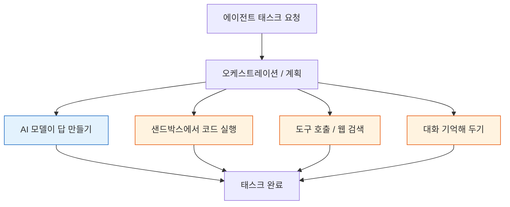

에이전트에게 일을 시키면 시간을 가장 많이 잡아먹는 건 AI 모델이 아닙니다. 에이전트 여러 대를 운영하거나 그 비용을 책임지는 분이라면 이 글을 읽어 볼 값이 있습니다. 오늘은 그 숨은 시간이 어디서 새는지 실제로 잰 논문 한 편을 쉬운 말로 풀어 봅니다.

*논문 표지 슬라이드입니다. 문서 번호 2608.15127이고, 알리바바와 바이트댄스 공동 연구팀이 썼습니다.*

## 쉽게 말하면

카페에서 커피 한 잔을 시켜 보겠습니다. 바리스타가 에스프레소를 뽑는 시간은 몇 초면 끝납니다. 그런데 손님이 실제로 커피를 손에 들기까지는, 원두를 갈고 기계를 데우고, 창고에 우유가 남았는지 확인하고, 컵에 손님 이름을 적는 시간이 훨씬 더 걸립니다.

에이전트도 똑같습니다. AI 모델이 답을 만드는 시간, 그러니까 에스프레소를 뽑는 그 순간은 이미 충분히 빠릅니다. 그런데 그 앞뒤로 별도 작업 공간을 준비하고(원두 갈기), 도구를 불러 검색하고(창고 확인), 이전 대화를 기억해 두는(컵에 이름 적기) 일이 실제로 기다리는 시간의 대부분을 차지합니다.

바리스타는 빠른데, 매장 전체 흐름이 느린 것입니다. 이 글이 소개하는 논문은 "에스프레소 뽑는 시간"만 재던 방식을 버리고, 커피를 받기까지 걸리는 시간 전체를 처음으로 실측했습니다.

## 무엇을 해봤나

연구팀은 알리바바와 바이트댄스에서 나온 논문 한 편을 살펴봤습니다. 이름은 AgentSysBench이고, 실제로 돌아가는 에이전트 앱 10개를 대상으로 시간이 어디서 새는지 직접 쟀습니다.

지금까지 AI를 빠르게 서빙하는 기술은 대부분 "질문 하나에 답 하나"를 얼마나 빨리 처리하느냐에 집중해 왔습니다. 그런데 실제로 에이전트가 하는 일은 검색하고, 별도 공간에서 코드를 돌려 보고, 그 결과를 읽고, 다음 도구를 부르는 여러 단계로 이어집니다. 질문 하나만 빠르게 처리해서는 매장 전체가 왜 느린지 알 수 없습니다.

그래서 연구팀은 에이전트 태스크 하나를 카페 주문처럼 통째로 쪼개 쟀습니다. AI 모델이 답을 만드는 시간과, 별도 공간에서 코드를 실행하는 시간(샌드박스), 도구를 부르거나 웹을 검색하는 시간, 이전 대화를 기억해 두는 시간을 각각 따로 측정한 것입니다.

*파란 칸(AI 모델)은 이미 잘 서빙되는 부분이고, 주황 칸(샌드박스·도구 호출·기억)이 이번 논문이 겨눈 자리입니다.*

## 나온 결과

### 절반이 매장 뒤편에서 느려집니다

실측한 에이전트 앱 10개 중 5개는 손님이 기다리는 시간의 대부분이 커피를 내리는 시간이 아니라 매장 뒤편 준비 작업에서 났습니다. 즉, 사람 말로는 열 곳 중 다섯 곳에서 진짜 병목이 AI 모델이 아니라 그 주변이었다는 뜻입니다.

*실측한 프로덕션 에이전트 앱 10개 중 5개는 지연 시간이 AI 모델 추론이 아니라 비LLM 구성요소에 의해 지배됐습니다.*

게다가 매장 뒤편 작업 공간은 손님 한 명을 응대하는 동안 최대 28기가바이트에 이르는 짐을 쌓아 두기도 했습니다. 그래픽카드와 메모리, CPU를 섞어 쓰는 매장 구성에 따라 손님 한 명을 응대하는 시간이 최대 32배까지 벌어졌습니다. 즉, 사람 말로는 어느 매장에 어떤 손님이 오느냐에 따라 병목이 서 있는 자리가 계속 바뀐다는 뜻입니다. "병목은 항상 같은 자리에 있다"는 짐작 자체가 틀렸습니다.

*멀티에이전트 태스크 하나를 시간순으로 쪼갠 그림입니다. AI 모델 호출(파란색)은 짧고 뜨문뜨문 나타나는데, 샌드박스 실행·웹 검색·상태 관리(분홍색)가 대부분의 시간을 차지합니다. 샌드박스 작업 공간은 세션 하나당 최대 28기가바이트까지 썼습니다.*

### 매장 흐름을 통째로 보니 3~4할이 줄었습니다

연구팀은 이 관찰을 바탕으로 매장 전체 흐름을 보고 순서를 짜는 방식을 몇 가지 시도했습니다.

첫째는 태스크 전체를 미리 보고 준비 순서를 짜는 방식입니다. 커피를 내리는 동안 컵과 재료를 미리 꺼내 두는 것과 같습니다. 이 방식만으로 손님 한 명을 응대하는 전체 시간이 29에서 40퍼센트가량 줄었습니다.

둘째는 어느 매장에서 응대할지 유연하게 정하는 방식이고, 셋째는 손님의 짐을 계산대 옆이 아니라 별도 보관함에 맡겨 두는 방식입니다. 두 방식은 각각 4.5배, 4.6배 정도로 처리 속도를 끌어올렸습니다. 여기에 이미 확인한 재고 정보를 다시 창고까지 안 가고 메모해 둔 걸 보는 방식을 더하니, 같은 검색이나 도구 호출의 35퍼센트가량이 사라졌습니다.

즉, 사람 말로는 커피 자체를 더 빨리 내린 것이 아니라, 매장 뒤편 준비와 뒷정리를 효율화해서 손님이 기다리는 시간을 줄인 것입니다.

## 그래서 무엇을 바꾸면 되나

첫째, 도구를 부르거나 웹을 검색한 결과는 최대한 다시 씁니다. 같은 재고를 창고까지 매번 다시 확인하러 가지 않는 것만으로도 응대 시간과 비용이 크게 줄어듭니다. 검색이나 외부 자료를 많이 쓰는 에이전트일수록 효과가 큽니다.

둘째, 여러 단계를 밟는 에이전트라면 질문 하나가 아니라 전체 흐름을 보고 준비 순서를 짭니다. 커피를 내리는 동안 컵을 미리 꺼내 두는 것처럼, AI 모델이 답을 만드는 동안 다음에 쓸 도구나 공간을 미리 준비해 두는 방식입니다.

*지금까지의 서빙 방식(왼쪽, 연속 배칭·KV 캐시로 질문 하나를 빠르게 처리)과 이 논문이 제안하는 태스크인식 서빙(오른쪽, 샌드박스·기억·도구 호출까지 묶어 작업 전체를 최적화)을 비교한 그림입니다.*

저희 회사의 두 제품에도 같은 이야기가 적용됩니다. 토큰을 빠르게 처리하는 데 집중해 온 저희 추론 서비스 Metis는, 에이전트용 작업일수록 질문 하나가 아니라 작업 전체 단위로 속도를 재는 쪽으로 기준을 옮겨야 합니다. 격리된 작업 공간에서 도구를 실행하는 저희 에이전트 플랫폼 Paxis는, 그 작업 공간과 도구 호출 기록을 얼마나 잘 재사용하느냐가 실제 운영 비용을 가른다는 근거를 이번에 얻었습니다.

다음으로 해 볼 실험도 둘로 정했습니다. 하나는 Paxis에서 도는 작업의 시간을 단계별로 쪼개 어디서 새는지 직접 재 보는 것입니다. 다른 하나는 Metis 위 에이전트에 도구 호출 결과 재사용 기능을 붙여 보고 전후를 비교하는 것입니다. 둘 다 AI 모델을 바꾸는 일이 아니라 그 주변을 손보는 일이라, 지금 쓰는 모델 그대로 검증할 수 있습니다.

## 못 믿을 부분

이번 측정은 실제 서비스 3곳의 기록을 바탕으로 했습니다. 매장이 3곳뿐이라, 다른 종류의 에이전트나 다른 모델 조합에서도 같은 그림이 나올지는 아직 확인되지 않았습니다.

"10곳 중 5곳이 매장 뒤편에서 느려진다"는 숫자도 표본이 10곳뿐이고, 무엇을 에이전트 앱으로 셀지는 연구팀이 정한 기준입니다. 다른 환경에서는 그 비율이 달라질 수 있습니다. 4.5배와 4.6배 같은 개선 폭도 무엇과 비교했는지에 따라 달라지므로, 배수 자체보다 어떤 조건에서 잰 값인지를 함께 봐야 합니다.

매장 흐름을 통째로 보는 방식은 그만큼 손볼 부분도 늘어납니다. 작업을 알아채는 장치, 짐을 맡아 둘 보관함, 재사용 기록이 전부 새로 필요합니다. 손님이 한 번에 커피만 시키는 단순한 매장이라면 오히려 손해일 수 있습니다. 에이전트가 여러 단계를 밟고 트래픽이 충분히 많을 때에만 이 방식이 이득으로 돌아옵니다.

---

*논문 원문: [AgentSysBench, arXiv 2608.15127](https://arxiv.org/abs/2608.15127) (제1저자 Chaokun Chang 외 22인, 2026-08-15 게시). 본문의 수치는 논문 원문을 내부 딥리서치로 확인한 값이며, 이번 작업에서는 원문을 다시 확인하지 못해 논문이 보고한 수치를 그대로 인용했습니다. 자세한 실험 조건은 각 그림 캡션에 남겨 두었습니다.*
