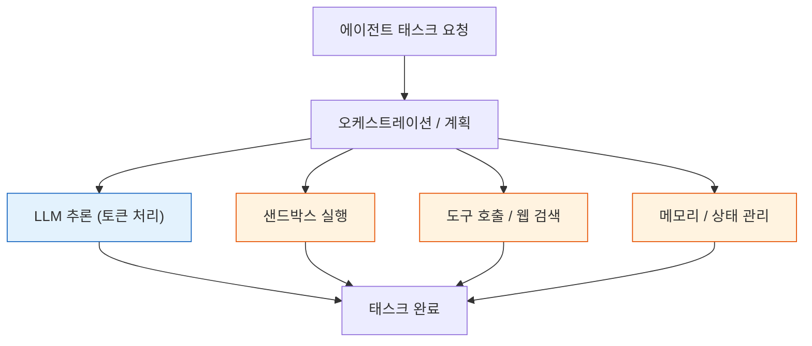

## 왜 읽어야 하나

멀티에이전트 워크로드의 서빙 지연이나 운영 비용을 최적화해야 하는 MLOps·인프라 엔지니어, 그리고 에이전트 실행 환경을 직접 설계하는 개발자라면 이 논문을 읽어야 합니다. 결론부터 말하면, 에이전트를 서빙하는 것의 병목은 모델 추론이 아니라 샌드박스·메모리·도구 호출 같은 비LLM 구성요소인 경우가 절반에 달합니다. 이를 인식한 '태스크인식 서빙'으로 태스크 지연을 29~40% 줄일 수 있다는 프로덕션 기반 실측입니다. 토큰당 처리량만 보던 서빙 최적화 관점을 태스크 단위로 한 칸 끌어올리는 데 필요한 근거가 여기에 있습니다.

## 개요

추론 서빙 분야는 지난 몇 년간 "단일 LLM 요청을 빠르게 처리한다"는 문제를 거의 해결해 왔습니다. 연속 배칭, 페이지드 KV 캐시, 청크드 프리필, 프리필/디코드 분리까지, 요청 단위 최적화는 성숙 단계에 들어섰습니다. 그런데 실제 프로덕션에서 AI가 맡기게 된 일은 점점 "한 번의 요청"이 아니라 "여러 단계를 밟는 태스크"가 됩니다. 검색, 샌드박스 실행, 결과 읽기, 다음 도구 호출을 순서대로 밟는 식으로. 이런 태스크를 서빙할 때 여전히 요청 단위 관점으로만 최적화하면, 실제 사용자가 체감하는 지연의 상당 부분이 보이는 곳에서 벌어지고 있지 않은데서 오는 것을 놓칩니다.

Alibaba와 ByteDance 연구진이 발표한 AgentSysBench(arXiv 2608.15127, 제1저자 Chaokun Chang 외 22인, 2026-08-15 게시)는 바로 이 지점을 프로덕션 트레이스 3개를 포함해 실측한 벤치마크입니다. 이 논문이 던지는 핵심 메시지는 단순합니다. 에이전트 서빙의 병목은 요청·모델·배포에 따라 움직입니다. 그중 상당수는 LLM 추론 바깥의 구성요소가 지배합니다.

## AgentSysBench가 밝힌 그림

에이전트 태스크 한 번은 LLM 호출 하나로 끝내지 않습니다. 아래 도식은 에이전트 태스크의 구성을 보여줍니다. 오케스트레이션이 LLM 추론과 여러 비LLM 구성요소(샌드박스 실행, 도구 호출·웹 검색, 메모리·상태 관리)를 병렬로 거치며, 이들이 함께 태스크 완료를 이룹니다.

색으로 구분한 것이 논지의 핵심입니다. 파란 LLM 추론은 이미 잘 서빙되지만, 주황 비LLM 구성요소들이 지연을 지배하는 구간입니다.

실측은 10개 에이전트 앱을 대상으로 했습니다. 그중 5개는 지연이 비LLM 구성요소에 의해 지배됐습니다. 샌드박스 워크셋은 세션당 최대 28GB의 메모리를 쓰며, GPU·메모리·CPU가 섞인 구성에서 태스크 지연은 최대 32배까지 편차를 보였습니다. 같은 에이전트라도 요청의 형태, 쓰는 모델, 배포 방식에 따라 병목이 어디로 이동하는지가 달라집니다. "병목은 고정된 한 지점"이라는 전제 자체가 성립하지 않는다는 뜻입니다.

## 태스크인식 서빙이 회수한 것

논문은 이 관찰을 바탕으로 태스크를 단위로 다루는 서빙 기법들을 제안하고 실측합니다. 크게 세 갈래입니다.

태스크인식(task-aware) 서빙은 태스크의 단계와 자원을 알아보고 스케줄링하는 것으로, 전체 태스크 지연을 29~40% 줄였습니다. 배치가상(placement virtualization)은 태스크를 어디에 실행할지를 추상화해 4.5배의 개선통계량을 보고했고, 상태 오프로딩(state offloading)은 에이전트 상태를 서빙 티어 밖으로 내보내 4.6배의 개선계수를 기록했습니다. 여기에 도구결과 캐싱(tool-result caching)이 더해져, 동일한 검색·도구 호출의 35.2%를 중복으로 제거했습니다.

숫자의 의미를 짚어 보면, 29~40%와 4.5x·4.6x는 모델 체력을 높인 결과가 아닙니다. 시간이 모델 바깥, 그 주변에서 태워지고 있었다는 사실에 대한 보정입니다. 도구결과 캐싱의 35.2%는 RAG나 웹 검색을 많이 쓰는 에이전트일수록 운영 원가에 직접적으로 걸리는 항목입니다. 같은 질문을 다시 검색하거나 같은 도구를 다시 부르지 않도록 캐시를 두는 것만으로 태스크당 비용을 크게 줄일 수 있다는 뜻입니다.

## ThakiCloud 제품 적용 시사점

이 논문의 시사점은 ThakiCloud의 두 제품, Metis와 Paxis에 모두 닿습니다.

**Metis(토큰 팩토리 / AI 추론)** 관점에서, 서빙 최적화의 축을 재설정할 근거가 생겼습니다. 그동안 Metis의 서버리스·dedicated 서빙은 토큰당 처리량과 KV 캐시, 배칭 중심으로 튜닝돼 왔고, 플랫폼 기본값의 '설정 세금'까지 실측해 회수한 상태입니다. AgentSysBench는 그 다음 단계, 즉 에이전트 워크로드에서는 토큰당 처리량보다 태스크단위의 스케줄과 상태 오프로딩, 도구결과 캐싱이 지연과 비용을 좌우한다는 점을 보여줍니다. Metis 서빙 계층에 태스크인식 스케줄과 도구결과 캐싱을 넣는 것이, 에이전트 고객을 위한 다음 최적화 축이 됩니다.

**Paxis(에이전트 플랫폼)** 관점에서, 멀티에이전트 실행의 비용과 지연을 결정하는 변수가 토큰이 아닌 샌드박스·메모리·도구 호출이라는 점이 제품 설계에 직접 반영될 수 있습니다. Paxis가 격리 샌드박스에서 스킬을 실행하고 MCP 커넥터로 도구를 부르는 구조인데, 이 논문은 그 구조의 병목을 정확히 찍어 줍니다. 샌드박스 워크셋 메모리(세션당 최대 28GB)와 도구 호출 캐싱이 Paxis 실행 경제성의 핵심 변수라는 실측 근거입니다.

구체적으로 착지할 실험은 둘입니다. 첫째, Paxis 워크플로에서 비LLM 구성요소 지연을 분해 측정해 서빙 최적화 축을 재설정하는 것. 둘째, Metis 데모 에이전트 워크로드에 도구결과 캐싱을 A/B로 넣어 지연·비용을 실측하는 것. 둘 다 "모델을 바꾼다"가 아니라 "서빙·실행 계층을 바꾼다"는 방향이라, 기존 체크포인트 위에서 검증 가능합니다.

## 한계 및 반론

이 논문의 실측은 프로덕션 트레이스 3개 기반이라, 더 다양한 워크로드·모델 조합으로 외삽하려면 주의가 필요합니다. 10개 앱, 5개가 비LLM 지배라는 비율은 표본이 작고 "에이전트 앱"의 정의가 연구진에 달려 있어, 다른 환경에서는 비LLM 지배 비중이 달라질 수 있습니다. 4.5x·4.6x 같은 개선통계량도 어떤 베이스라인 대비인지에 따라 의미가 달라지므로, "배"라는 숫자 자체보다 그것이 전제하는 구성을 함께 읽어야 합니다.

또한 태스크인식 서빙은 추가 계층(태스크 인식, 상태 저장소, 캐시)을 서빙 경로에 얹는 것이라, 단순 단일 요청 워크로드에는 오히려 오버헤드가 될 수 있습니다. 에이전트 트래픽이 충분히 크고 단계가 복잡한 워크로드에서 비로소 이득이 넘는다는 점을 기억할 필요가 있습니다.

## 정리

에이전트를 서빙한다는 것은 "빠른 LLM에 요청을 넣는다"는 문제가 아닙니다. 샌드박스·메모리·도구 호출이 섞인 태스크를 얼마나 잘 스케줄하고, 상태를 어디에 두며, 어떤 결과를 캐시하느냐의 문제입니다. AgentSysBench는 그 병목의 상당수가 LLM 바깥에 있고, 태스크인식 서빙으로 29~40%를 회수할 수 있다는 프로덕션 근거를 줍니다. ThakiCloud의 관점에서 이 근거는 Metis의 서빙 최적화 축을 토큰단위에서 태스크단위로, Paxis의 실행 경제성을 샌드박스·도구캐싱 변수로 바라보라는 신호입니다. 다음 실험은 새 모델 벤치가 아니라, 데모 에이전트 워크로드의 비LLM 지연 분해와 도구결과 캐싱 A/B입니다.

---

*출처: [AgentSysBench, arXiv 2608.15127](https://arxiv.org/abs/2608.15127) (제1저자 Chaokun Chang 외, 2026-08-15). 본 글의 수치는 논문 원문에 대한 내부 딥리서치 정본에서 확인한 값이며, 이번 세션에서는 원문을 재-fetch하지 못해 논문 자체의 측정값으로 인용했습니다.*
