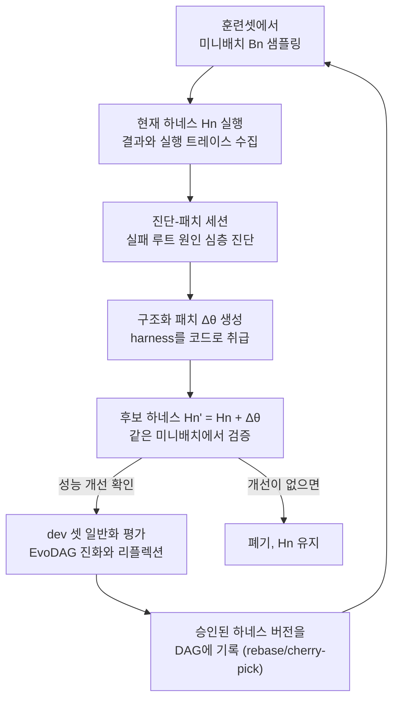

## 왜 읽어야 하나

에이전트 실행 환경을 설계하거나, 운영 중인 에이전트의 harness(프롬프트, 도구 구성, 제어 로직)을 수동으로 조정해 온 MLOps·에이전트 플랫폼 엔지니어라면 이 논문을 읽어야 합니다. 결은 먼저 세웁니다. 하네스를 코드로 취급하고 실패 트레이스만 학습 신호로 쓰는 오프라인 최적화 루프가, 세 가지 에이전트 벤치마크에서 기본 하네스 대비 9.0·9.6·10.0포인트의 개선과 기존 자동화 베이스라인 대비 약 10배의 rollout 효율을 동시에 냈습니다. 수작업 튜닝을 자동화하는 방향이 맞고 어떻게 설계해야 하는지에 대한 현재까지 가장 구체적인 실증입니다.

## 개요

LLM 에이전트는 장기(long-horizon) 태스크에서 여전히 믿을 수 없습니다. 작은 지역적 실패가 긴 상호작용 동안 쌓여 태스크 전체 실패로 이어지기 때문입니다. 외부 harness는 이 취약성을 크게 줄여 주지만, harness 설계 자체는 수동적이고 비쌉니다. 프롬프트 사양, 도구 구성, 시스템 레벨 선택으로 이루어진 큰 설계 공간을 탐색해야 하고 각 후보를 평가하려면 에이전트가 여러 단계를 실행한 뒤 성공·실패가 판정될 때까지 rollout을 태워야 합니다.

KAIST(Wonjoong Kim, Chanyoung Park)와 POSTECH(Sungho Park, Wook-Shin Han) 그리고 Microsoft Research(Jue Zhang, Dongmei Zhang 외) 13명이 공동으로 쓴 AutoSaddler(arXiv 2608.23041, 2026-08-24 제출, 44페이지)는 이 문제를 오프라인 학습 문제로 재정의합니다. 이름에서 알 수 있듯 saddle(안장)을 자동으로 조이는 장치라는 뜻인데, 본질은 "harness를 코드처럼 패치하며 실패한 실행 트레이스만 학습 신호로 쓰는 미니배치 최적화 루프"입니다. GAIA2, SWE-Bench Pro, Terminal-Bench 2.0에서 기본 하네스 대비 9.0, 9.6, 10.0포인트 개선, 각 벤치마크의 가장 강한 자동화 베이스라인 대비 7.4, 4.4, 6.7포인트 우위를 보였습니다.

> 📄 **심층 리뷰 전문(DOCX)**: 이 논문의 상세 피어리뷰를 [Google Drive에서 다운로드](https://drive.google.com/file/d/1rZ60AlAHZBBNcKjWuIxASN2NMC2d7t6Y/view)할 수 있습니다.

## AutoSaddler가 하는 일

AutoSaddler는 태스크 집합을 학습·개발·테스트셋으로 나눈 뒤, rollout 예산 K 안에서 후보 하네스를 탐색하는 예산 제약 최적화 문제입니다. 반복의 구조는 미니배치 학습과 동일합니다.

여기서 핵심 설계는 세 가지로 압축됩니다. 논문의 실험도 각각을 제거하는 아블레이션으로 검증했는데, 세 재료 모두 없으면 안 되는 필수 요소였습니다.

### 첫째, 깊은 진단(deep debugging)

실패한 트레이스에 "왜 실패했는지"를 단일 LLM 호출로 반성하는 것이 아니라, Claude Agent SDK로 실행 트레이스와 하네스 소스코드를 능동적으로 탐색하며 루트 원인을 찾습니다. 진단-패치 세션은 패치만 생성하는 세션보다 평균 도구 호출 6.2회, 파일 접근 5.8회를 더 씁니다. 이 추가 조사 노력이 결과로 이어집니다. GAIA2 테스트셋 Pass@1에서 심층 진단을 제거하면 62.0에서 57.8로 떨어집니다. 실패 반성이 표피에 그칠 때, 패치는 원인을 못 봐요.

### 둘째, 구조화 패치(structured intervention)

패치는 자유롭게 쓰는 것이 아니라 분류 체계(taxonomy) 안에서 생성됩니다. 두 큰 범주로 나뉩니다.

- **Capability 패치**: 실행 코드나 오케스트레이션 로직을 바꿉니다. 도구 구현, 도구 인자, 인프라 설정, 에이전트 루프 로직이 대상입니다. 에이전트가 할 수 있는 행동을 바꾸거나 하네스가 행동을 실행하는 방식을 바꿉니다.
- **Steering 패치**: 실행 코드를 건드리지 않는 텍스트 편집입니다. 프롬프트, 도구 설명, 훅 리마인더 텍스트가 대상입니다. 기존 능력 안에서 에이전트가 무엇을 선택하고 어떤 제약을 지키게 하는지 다듬습니다.

이 구분은 그레이디언트 최적화에서 큰 스텝과 작은 스텝의 비유와 비슷합니다. Capability 패치는 큰 학습률 스텝처럼 새로운 기능을 넣고 제어 흐름을 바꾸고 Steering 패치는 작은 스텝처럼 행동 선택만 조정합니다. AutoSaddler는 단계적 스케줄로 둘의 순서를 관리합니다. 구조를 제거하면( unconstrained 편집, Meta-Harness 방식) 패치가 Steering으로 91.5% 쏠려버리고 GAIA2 Pass@1은 56.9로 더 크게 떨어집니다. 도구·인프라 쪽의 고가치 개입을 아예 탐색하지 못하기 때문입니다.

### 셋째, 일반화 인식 선택(generalization-aware selection)

생성된 패치는 세 단계를 통과해야 유지됩니다. 같은 미니배치에서 성능이 실제로 개선됐는지, dev 셋에서 일반화되는지, 그리고 리플렉션 세션에서 구체적 수정이 일반 원칙으로 추상화되는지입니다. 승인된 하네스 버전은 단순 선형 체인이 아니라 DAG(EvoDAG)로 기록됩니다. 앞선 버전에서 검증된 수정을 cherry-pick하거나, 회귀를 일으킨 패치는 rebase로 되돌리는 식입니다. GAIA2 전체 실행(50회, 2에폭)에서 51개 후보 중 21개만 dev 평가로 승인됐습니다. 일반화 선택을 제거하면 Pass@1이 50.6으로, 모든 아블레이션 중 가장 크게(11.4) 떨어집니다. 특정 트레이스에 맞춘 수리는 다른 태스크에서 회귀를 일으켰고 dev 게이트가 그것 대부분을 막아냈습니다.

## 실험 결과

세 벤치마크는 에이전트 능력의 다른 축을 짚습니다. GAIA2는 시뮬레이션 스마트폰 환경 10개 유니버스에 걸친 일반 어시스턴트 태스크(기본 ReAct 에이전트가 base), SWE-Bench Pro는 엔터프라이즈 규모 소프트웨어 엔지니어링 태스크(SWE-agent가 base), Terminal-Bench 2.0은 시스템 관리·머신러닝·사이버보안 분야 89개 태스크(Terminus 2가 base)입니다. 옵티마이저와 에이전트 백본 모두 Claude Opus 4.6으로 고정했습니다.

| 벤치마크 | base 하네스 | base 대비 | 최강 자동화 베이스라인 대비 |
|---|---|---|---|
| GAIA2 | GAIA2 기본 ReAct | +9.0 | +7.4 |
| SWE-Bench Pro | SWE-agent | +9.6 | +4.4 |
| Terminal-Bench 2.0 | Terminus 2 | +10.0 | +6.7 |

효율 측면이 더 중요합니다. AutoSaddler는 GAIA2에서 약 1,000회 rollout으로 dev 정확도 72.3%에 도달했는데, GEPA와 Meta-Harness는 각각 64.6%와 61.5%에서 포화 상태였을 때 이미 약 2,800회 실행을 태우고 있었습니다. 학습에 실제로 활용된 rollout 기준으로 보면 차이가 더 큽니다. AutoSaddler는 147회 rollout을 소모한 시점에 최고 dev 점수를 기록했고 Meta-Harness는 1,400회였습니다. 약 10배입니다. Terminal-Bench 2.0에서도 같은 그림이 반복됩니다. 공동 시작점 52.6%에서 AutoSaddler는 태스크 실행 31회, 활용 트레이스 12개로 dev 73.7%에 도달했고 Meta-Harness(63.2%, 98개 트레이스)와 GEPA(57.9%)를 크게 앞섰습니다.

아블레이션 수치를 한데 모으면 각 재료의 가치를 읽을 수 있습니다(GAIA2 테스트 Pass@1).

| 설정 | Pass@1 |
|---|---|
| AutoSaddler (전체) | 62.0 |
| 심층 진단 제거 | 57.8 |
| 구조화 개입 제거 | 56.9 |
| 일반화 인식 선택 제거 | 50.6 |

논문에는 실행 궤적의 흥미로운 기록도 있습니다. GAIA2 전체 실행에서 20번째 반복에 고빈도 도구에 훅을 넣은 패치가 재앙적 회귀(33.8%)를 일으켰고 진화 세션은 13번째 반복(67.7%)으로 rebase해 13·14번에서 검증된 수정만 cherry-pick하는 방식으로 복구했습니다. 27번째 반복에 전고점 72.3%를 기록합니다. 선형 체인이면 한 번의 나쁜 패치에 모든 이후 이력이 오염됐겠지만, DAG 구조가 회귀를 국소화하고 검증된 부분만 살려냈습니다.

백본이 다른 모델로 바뀌어도 효과가 유지되는지(강한 모델로 최적화한 하네스를 약한 모델에 적용)도 확인했습니다. Claude Haiku 4.5를 태스크 에이전트로 쓰고 하네스는 Opus 4.6 최적화 결과를 그대로 쓰면, 기본 에이전트 대비 +5.6포인트 개선이 유지됩니다. 하네스 최적화의 효과가 모델에 쫙 달라붙는 것이 아니라, 모델 바깥의 실행 환경에 남아 전이된다는 뜻입니다.

## ThakiCloud 제품 적용 시사점

**Paxis 렌즈.** 이 논문은 Paxis 자가진화 스킬 루프의 설계 참고서와 같습니다. Paxis가 실패 trace에서 스킬 패치를 생성하고 검증 게이트로만 반영하는 방향을 고민해 왔다면, AutoSaddler는 그 설계가 실제로 동작하는지 세 축으로 실증해 줍니다. 첫째, 진단의 깊이가 패치 품질을 결정합니다(4.2포인트). trace를 "한 번 보고 반성"하는 수준에서 그치면 패치는 Steering으로 쏠리고 실패의 원인을 건드리지 못합니다. 둘째, 검증 게이트는 선택이 아니라 생존 조건입니다(11.4포인트). 모든 아블레이션 중 가장 큰 낙폭이 dev 게이트 제거에서 나왔습니다. 특정 실행에 맞춘 수리는 unseen 태스크에서 회귀로 돌아왔고 게이트가 그것을 막았습니다. 셋째, 패치 이력은 선형이 아니라 DAG여야 합니다. rebase와 cherry-pick이 회귀를 국소화하는 방식은, 스킬 패치 원장을 "수정 이력의 그래프"로 설계하라는 제안과 같습니다.

**ai-platform 렌즈.** rollout 효율은 곧 서빙 비용입니다. 에이전트 최적화는 기본적으로 추론 실행을 태우는 작업이고 GAIA2에서 1,000 대 2,800, 활용 기준 147 대 1,400이라는 차이는 같은 최적화 결과에 드는 Metis 추론 비용의 차이입니다. "실패 트레이스만 학습 신호로 쓴다"는 설계는 성공 케이스까지 재실행할 필요가 없다는 뜻이므로, 에이전트 평가 파이프라인의 비용 구조 자체를 바꿉니다.

관련 글로, 같은 "모델은 동결, 하네스가 학습한다" 주제에 [Harness Continual Learning](/tech-blog/ko/research/harness-continual-learning/)을 다뤘습니다. AutoSaddler가 오프라인(배포 전) 최적화라면, 그 글의 대상은 배포 후 지속 적응 문제입니다.

## 한계 및 반론

첫째, 백본이 단일 모델 계열에 머물러 있습니다. 옵티마이저와 에이전트 모두 Claude Opus 4.6이었고 크로스 모델 전이도 Claude 계열(Opus 최적화 → Haiku 적용) 안에서만 확인했습니다. GPT나 Gemini 계열 에이전트에 최적화한 하네스가 전이되는지는 검증되지 않았습니다.

둘째, 검증 게이트는 태스크 레벨의 결정적 지표(pass/fail, 정확도)를 전제합니다. GAIA2·SWE-Bench Pro·Terminal-Bench 모두 정답 검증이 가능한 환경입니다.개방형 비즈니스 태스크처럼 ground truth가 없는 영역에서 "dev 셋 일반화 평가"를 어떻게 정의하느냐는 이 설계가 적용되기 위한 선결 조건입니다. RLVR와 RLHF의 구분이 여기서도 다시 나타납니다.

셋째, 오프라인 형성의 한계입니다. "개발 중 튜닝, 프로덕션 배포"라는 실제 운영 방식을 반영한 것이 장점이지만, 그만큼 프로덕션 분포의 drift를 다루지 못합니다. 모델 업그레이드나 도메인 변화 이후에는 예산을 다시 태워 최적화해야 합니다.

넷째, 진단 깊이에는 실비용이 붙습니다. 도구 호출 6.2회, 파일 접근 5.8회 추가는 최적화 세션당 비용입니다. 효율성 결과를 감안하면 논문에 따르면 이 trade-off는 이득이지만, 소규모 에이전트나 제한된 예산에서는 shallow reflection이 합리적인 선택이 될 수도 있습니다.

## 정리

AutoSaddler는 에이전트 시스템의 향상 대상이 모델 파라미터가 아니라 모델 바깥의 실행 환경(harness)일 때, 그 환경의 개선이 어떻게 학습 문제로 전환되는지를 보여 줍니다. 답은 세 재료입니다. 실패를 깊게 진단하고 구조화된 패치만 생성하며 검증과 일반화 게이트를 통과한 것만 DAG에 기록합니다. GAIA2·SWE-Bench Pro·Terminal-Bench 2.0에서 base 대비 9~10포인트 개선과 ~10배 rollout 효율이 이 설계의 실증이고 백본 교차 전이(+5.6)는 최적화의 가치가 모델 바깥에 잔존한다는 증거입니다.

지금 수작업으로 harness를 조정하고 있다면, 다음 실험은 "실패 트레이스 → 구조화 패치 → 검증 게이트" 루프를 하나의 벤치마크에 얹는 것입니다. unconstrained 편집부터 시작하지 마세요. 구조를 빼면 패치가 텍스트 수정으로 91.5% 쏠린다는 것이 이 논문의 가장 싼 교훈입니다.

---

*출처: [AutoSaddler, arXiv 2608.23041](https://arxiv.org/abs/2608.23041) (Sungho Park 외 13인, 2026-08-24). 프로젝트 사이트 [aka.ms/AutoSaddler-website](https://aka.ms/AutoSaddler-website). 본 글의 수치는 논문 원문(abs + HTML full text)에서 직접 확인한 값입니다.*

> 📄 **심층 리뷰 전문(DOCX)**: 이 논문의 상세 피어리뷰를 [Google Drive에서 다운로드](https://drive.google.com/file/d/1rZ60AlAHZBBNcKjWuIxASN2NMC2d7t6Y/view)할 수 있습니다.

## 관련 슬라이드

본문 내용을 NotebookLM(`prismatic_tech` 스타일)으로 요약한 슬라이드입니다.

