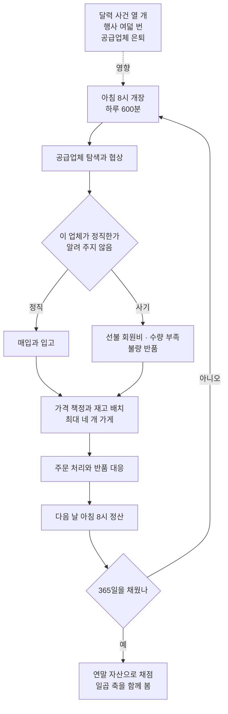

에이전트에게 가게 하나를 1년 맡기면 무슨 일이 벌어지는지 실제로 재 본 시험장이 나왔습니다. 결과는 가혹합니다. 가장 많이 번 모델이 사기에는 거의 가장 많이 당했고 대부분의 모델은 1년이 지나도 같은 물건 값을 한 푼도 깎지 못했습니다.

에이전트에게 데모가 아니라 실제 운영을 맡길지 판단해야 하는 팀을 위한 글입니다. 자율성을 어디까지 줄지 선을 그어야 하는 자리라면 더욱 그렇습니다.

*글의 핵심 개념을 형상화했습니다. 같은 1년을 보내고도 한쪽은 쌓이고 한쪽은 무너집니다.*

## 쉽게 말하면

신입 한 명을 뽑는다고 해 보겠습니다. 면접에서 문제를 잘 푸는 사람과, 가게를 1년 맡겨도 되는 사람은 다릅니다.

면접 문제는 한 문제가 끝나면 다음 문제와 상관이 없습니다. 가게는 다릅니다. 오늘 물건을 잘못 들이면 내일 팔 물건이 없고, 이번 달에 현금을 다 쓰면 다음 달 행사를 놓칩니다. 하루의 결정이 다음 날의 조건을 바꿉니다.

*왼쪽은 문제끼리 독립인 면접이고, 오른쪽은 하루가 다음 날을 묶는 운영입니다.*

지금까지 에이전트 시험은 대부분 면접 문제 쪽이었습니다. 이 논문은 가게 쪽을 만들었습니다. 365일짜리 온라인 가게를 통째로 맡기고 연말 통장 잔고로 채점합니다.

그런데 통장만 보면 놓치는 것이 있습니다. 사기를 당해도 매출로 덮으면 잔고는 늘어납니다. 그래서 이 시험장은 잔고 하나가 아니라 일곱 가지를 함께 봅니다. 협상, 사기 방어, 현금 흐름, 운영 효율, 실행 품질, 학습, 그리고 최종 잔고입니다.

*잔고는 일곱 축 중 하나일 뿐입니다. 매출만 좋은 직원과 사기도 안 당하는 직원은 다릅니다.*

이 글은 이 일곱 축을 신입의 1년 근무 평가표로 놓고 읽겠습니다. 매출만 좋은 직원과 매출도 좋고 사기도 안 당하는 직원은 다른 사람입니다.

## 무엇을 해봤나

시험장은 중국 온라인 장터를 본떠 만들었습니다. 상품이 6,886개, 분류가 60개, 공급업체가 576곳입니다. 그중 152곳이 사기 업체입니다.

에이전트는 10만 위안을 들고 시작해서 가게를 최대 네 개까지 엽니다. 하루는 오전 8시에 시작해 열 시간이고 정산은 다음 날 아침 8시에 붙습니다. 한 에피소드는 최대 4,000턴입니다.

사기는 두 종류입니다. 거래 전에는 공급 단가를 정직한 업체의 한 배 반쯤으로 부릅니다. 거래 후에는 주문한 수량의 예순에서 일흔 퍼센트만 보내거나, 반품률이 사십 퍼센트를 넘는 불량품을 보냅니다. 회원비 명목으로 1,000위안을 먼저 요구하는 수법도 있습니다.

*시작 자본 10만 위안, 상품 6,886개, 공급업체 576곳 가운데 152곳이 사기 업체입니다.*

세상도 가만히 있지 않습니다. 달력에 고정된 시장 사건이 열 개 있고, 행사가 여덟 번 있는데 이레 전에 공지됩니다. 공급업체는 주문을 일정 횟수 채우면 조용히 은퇴합니다. 그 횟수는 알려 주지 않습니다.

협상 설계가 이 논문에서 가장 중요한 대목입니다. 가격과 양보와 수락 여부는 전부 결정론 계산기가 정합니다. 모델은 그 결정을 말로 옮기기만 합니다.

즉, 사람 말로는 이 시험장은 말솜씨를 재지 않습니다. 언제 밀고 언제 접을지 고르는 판단만 잽니다. 같은 판단이면 누가 해도 같은 값이 나오도록 설계했습니다.

평가 대상은 열여덟 개 모델이고 모델마다 다섯 번씩 돌려 모두 아흔 에피소드를 모았습니다. 상용 모델과 공개 가중치 모델이 절반씩 섞여 있습니다.

## 나온 결과

먼저 격차입니다. 1위는 연말 자산 143만 위안이었고 꼴찌는 1,100위안이었습니다. 같은 지시와 같은 시장에서 1,264배가 벌어졌습니다.

10만 위안으로 시작했으니 1위는 열네 배로 불린 셈이고 꼴찌는 사실상 전부 잃었습니다. 아흔 에피소드 중 열 건이 파산으로 끝났고 그중 여섯 건이 상용 모델이었습니다.

즉, 사람 말로는 같은 가게를 맡겨도 어떤 직원은 열네 배로 키우고 어떤 직원은 문을 닫습니다.

*같은 지시와 같은 시장에서 1위는 열네 배로 불렸고 최하위는 사실상 전부 잃었습니다.*

여기까지는 예상 범위입니다. 진짜 발견은 그다음입니다.

*논문 표 2에서 옮긴 값입니다. 가로축이 사기 업체로 나간 지출 비율이고 세로축이 연말 자산입니다. 가장 많이 번 GPT-5.6 Sol은 사기 지출 18.48퍼센트로 열여덟 중 열여섯 번째였고 사기 지출이 0.12퍼센트로 압도적 1위인 Claude Opus 4.7의 자산은 25.9만 위안이었습니다. 다키클라우드가 재현한 값이 아닙니다.*

돈을 가장 많이 번 모델은 사기 방어에서 거의 꼴찌였습니다. 사기 방어 1위 모델은 자산으로는 다섯 번째였습니다. 두 축은 거의 나란히 가지 않습니다.

이것이 왜 중요한가 하면, 우리가 보통 에이전트를 볼 때 성과 지표 하나만 보기 때문입니다. 잔고만 보면 그 모델이 사기꾼에게 지출의 다섯 분의 일을 넘겨줬다는 사실이 안 보입니다.

효율도 마찬가지입니다. 툴을 한 번 부를 때마다 얼마를 벌었는지 세어 보면, 가장 높은 모델이 479위안이고 가장 낮은 모델이 36위안입니다. 그런데 턴을 가장 많이 쓴 모델이 바로 그 36위안짜리입니다. 많이 움직인다고 많이 버는 것이 아닙니다.

*툴 호출 횟수는 곧 서빙 단가입니다. 가장 비효율적인 모델이 턴도 가장 많이 썼습니다.*

가장 아픈 결과는 학습입니다. 같은 정직한 공급업체에게 같은 물건을 다시 산 거래가 8,647건이었습니다. 1년 동안 반복 구매를 하면 값을 깎을 만도 합니다.

*논문 표 2의 AnchorRatio입니다. 1.0은 처음 주문과 같은 값에 다시 샀다는 뜻이고 그보다 크면 더 비싸게 샀다는 뜻입니다. 1.0 아래로 내려간 모델은 Qwen3.8-Max-Preview(0.834)와 Gemini 3.5 Flash(0.918) 둘뿐이며, 나머지 열여섯은 값을 깎지 못했습니다.*

열여덟 중 열여섯이 1.0 위에 있습니다. 1년을 보내고 같은 거래를 수천 번 반복했는데도 값이 내려가지 않았다는 뜻입니다. 어떤 모델은 오히려 처음보다 비싸게 샀습니다.

즉, 사람 말로는 경험은 쌓였는데 학습은 일어나지 않았습니다.

논문은 그 이유를 짐작할 단서도 함께 냅니다. 아흔 에피소드에서 대화 기록을 잘라 내는 일이 1,495번 일어났습니다. 턴을 가장 많이 쓴 모델은 창 열아홉 개 분량의 기록을 버렸습니다.

*아흔 에피소드에서 기록이 1,495번 잘렸습니다. 모델이 알아서 기억해 주기를 기대할 수 없습니다.*

## 그래서 무엇을 바꾸면 되나

첫째, 자율 에이전트를 성과 지표 하나로 재지 않습니다. 잔고가 늘어도 사기 지출과 최대 낙폭이 같이 커지고 있으면 그 성장은 빌린 것입니다. 축을 최소 세 개는 함께 봅니다.

둘째, 사기 방어를 모델의 판단에 맡기지 않습니다. 이 시험장에서 사기 업체는 단가를 눈에 띄게 높게 부르는 패턴이 있었습니다. 그 정도는 코드가 걸러 낼 수 있는 조건입니다. 신규 거래처 지출 상한과 선불 요구 차단은 프롬프트가 아니라 게이트로 만듭니다.

*축을 최소 세 개로 보고, 사기 패턴은 프롬프트가 아니라 코드 게이트로 막습니다.*

셋째, 반복 거래에서 값이 안 내려가면 그것을 기억이 없다는 신호로 읽습니다. 지난 거래가를 어딘가에 적어 두고 다음 협상에 명시적으로 넣어 주면, 모델이 기억해 주기를 바라지 않아도 됩니다. 저희가 어제 소개한 [상태 실행기 논문](/tech-blog/ko/research/skill-state-long-horizon-agent-runtime/)이 정확히 그 처방을 다룹니다.

넷째, 파산은 되돌릴 수 없는 상태이므로 게이트를 겁니다. 최대 낙폭이 정해 둔 선을 넘으면 자동으로 멈추고 사람에게 넘깁니다. 아흔 번 중 열 번이 파산이라는 숫자는 사고율로 보면 결코 낮지 않습니다.

*지난 거래가는 시스템에 적어 두고, 낙폭이 선을 넘으면 권한을 사람에게 돌려줍니다.*

다키클라우드에서는 이 논문이 두 제품에 각각 닿습니다.

Paxis는 스킬과 도구와 정책과 감사 기록을 일급 자원으로 다루는 에이전트 제어 평면입니다. 이 논문이 보여 준 실패는 전부 정책으로 표현할 수 있는 것들입니다. 신규 거래처 한도, 선불 금지, 낙폭 상한, 반복 거래가 기록이 그렇습니다. 모델을 더 똑똑하게 만드는 대신 제어 평면에 규칙을 얹는 쪽이 검증도 쉽고 감사도 됩니다.

Metis는 추론을 파는 쪽입니다. 툴 호출당 얼마를 벌었는지가 곧 서빙 단가와 곱해지는 값입니다. 어떤 모델은 같은 성과를 내는 데 두 배 넘는 호출을 씁니다. 장기 자율 작업에서는 모델 선택이 능력 문제인 동시에 단가 문제입니다.

*Paxis는 실패 요소를 정책으로 강제하고, Metis는 호출당 비용으로 모델 선택을 봅니다.*

## 못 믿을 부분

가장 큰 제약은 표본입니다. 모델당 다섯 번씩 돌렸고 저자들도 적은 표본이라고 명시했습니다.

편차를 보면 그 말이 실감납니다. 어떤 상용 모델은 평균 70만 위안에 편차가 62만 위안이었습니다. 다섯 번을 다시 돌리면 순위가 바뀔 수 있는 폭입니다. 이 글의 순위는 경향으로 읽고 등수로 읽지 않는 편이 안전합니다.

*적은 표본, 화술이 아닌 시점 선택, 배제된 시장 불확실성 세 가지가 이 결과의 테두리입니다.*

협상 점수의 해석도 조심해야 합니다. 가격을 정하는 것은 결정론 계산기이고 모델은 대사만 씁니다. 그래서 이 점수는 협상 화술이 아니라 수락 시점 선택을 잽니다. 실제 거래처와의 협상 능력으로 그대로 옮겨 읽으면 안 됩니다.

시뮬레이션이라는 점도 남습니다. 수요 모델이 결정론이고 사건이 달력에 고정되어 있습니다. 실제 시장의 불확실성과는 종류가 다릅니다. 데이터도 중국 장터를 바탕으로 했으므로 다른 지역의 상거래 관행과 다를 수 있습니다.

학습 지표도 범위가 좁습니다. 재구매 가격비는 정직한 공급업체와의 거래만 셉니다. 사기 업체는 단가 자체가 부풀려져 있어 비교 기준이 되지 못하기 때문입니다.

마지막으로 기록을 잘라 내는 방식이 하나로 고정되어 있습니다. 시스템 메시지와 첫 사용자 발화와 최근 두 묶음만 남기는 규칙입니다. 메모리 설계를 바꾸면 학습 지표가 달라질 여지가 있고, 논문도 그 가능성을 열어 둡니다.

한 가지는 분명하게 좋습니다. 코드가 공개되어 있어서 위 숫자를 남이 다시 잴 수 있습니다. 이 글의 수치는 전부 논문 보고값이며 다키클라우드의 측정값이 아닙니다.

옮길 수 있는 결론은 등수가 아닙니다. 오래 맡길수록 능력보다 규율이 결과를 가른다는 사실입니다.

---

- 논문 원문: [E-Commerce Bench: Evaluating LLM Agents on Long-Horizon Autonomous Business Operation](https://arxiv.org/abs/2608.30730) (arXiv:2608.30730)
- 코드: [QwenLM/E-CommerceBench](https://github.com/QwenLM/E-CommerceBench) (Apache-2.0)

*본문의 비율은 대부분 한 자리나 두 자리로 줄였고 정확한 값은 그림 설명에 남겼습니다.*
