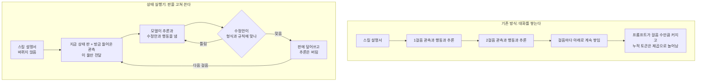

긴 작업을 맡기면 에이전트는 갈수록 느려지고 비싸지고 틀립니다. 원인은 모델의 머리 쪽이 아닙니다. 지금까지 오간 말을 전부 짊어지고 다니는 방식이 문제입니다. 대화 기록 대신 지금 상태만 들고 가게 바꾸면 토큰은 수십 분의 일로 줄고 정확도는 오히려 올라갑니다.

에이전트를 오래, 그리고 무인으로 돌리는 팀을 위한 글입니다. 비용과 품질을 한 사람이 함께 책임지는 자리라면 더욱 그렇습니다.

*글의 핵심 개념을 형상화했습니다. 왼쪽이 쌓이기만 하는 대화 기록이고 오른쪽이 고쳐 쓰는 상태 판입니다.*

## 쉽게 말하면

주방 이야기로 바꿔 보겠습니다. 오늘 장을 보려면 지금 냉장고에 무엇이 있는지 알아야 합니다.

첫 번째 방법은 녹취록입니다. 지난 한 달 동안 가족이 주고받은 모든 말을 녹음해 두고, 장을 볼 때마다 처음부터 끝까지 다시 듣습니다. 정보는 빠짐없이 들어 있습니다. 대신 들어야 할 분량이 매일 길어집니다.

두 번째 방법은 냉장고 문에 붙인 화이트보드입니다. 지금 무엇이 얼마나 있는지만 적혀 있습니다. 우유를 다 쓰면 그 줄을 지웁니다. 한 달이 지나도 화이트보드는 여전히 한 장입니다.

논문이 제안하는 상태 실행기(SKILL.state)는 두 번째 방법입니다. 지금까지의 대화를 쌓는 대신, 지금 무엇이 참인지 적은 판 하나를 계속 고쳐 씁니다.

*왼쪽 녹취록은 한 달 치가 통째로 남고, 오른쪽 판은 한 장이 계속 갱신됩니다.*

녹취록의 진짜 문제는 길이가 아닙니다. 한 달 전에 우유를 샀다고 말한 문장이 녹취록에 영원히 남습니다. 오늘 우유가 없다는 새 문장 한 줄은, 우유가 있다는 옛 문장 열 줄을 이기지 못합니다. 이 글에서는 이 현상을 맥락 오염이라고 부르겠습니다.

*옛 문장 열 줄이 새 문장 한 줄을 덮어 버립니다. 길이가 아니라 이 덮어쓰기가 문제입니다.*

## 무엇을 해봤나

상태 실행기는 매 걸음 모델에게 딱 세 가지만 건넵니다. 바뀌지 않는 스킬 설명서, 지금 상태를 적은 판, 그리고 방금 들어온 관측입니다. 지난 걸음의 대화는 넣지 않습니다.

모델은 세 가지를 내놓습니다. 왜 그렇게 판단했는지에 대한 추론, 판을 어떻게 고칠지 적은 수정안, 그리고 실제로 취할 행동입니다. 수정안이 형식과 규칙 검사를 통과하면 판에 덮어씁니다. 그리고 추론은 그 자리에서 버립니다.

여기가 이 논문의 핵심입니다. 생각을 못 하게 막는 설계가 아닙니다. 한 걸음 안에서는 얼마든지 길게 따져도 됩니다. 다만 생각의 결과만 판에 남기고 생각의 과정은 남기지 않습니다.

*입력은 설명서와 판과 관측 셋뿐이고, 추론은 검증 직후 폐기됩니다.*

수정안은 판을 통째로 다시 쓰지 않습니다. 항목 하나를 덮어쓰거나 지우는 형태여서, 바뀐 곳만 바뀝니다.

계산으로 보면 차이가 분명해집니다. 대화를 쌓는 방식은 걸음마다 프롬프트가 길어지므로, 누적 토큰이 걸음 수의 제곱으로 늘어납니다. 상태 실행기는 프롬프트 길이가 걸음 수와 무관하므로, 누적 토큰이 걸음 수에 비례해 늘어납니다.

즉, 사람 말로는 하나는 눈덩이처럼 불어나고 다른 하나는 일정한 보폭으로 늘어납니다.

*대화를 쌓으면 눈덩이 곡선이 되고, 판을 고쳐 쓰면 일정한 보폭의 직선이 됩니다.*

시험장은 네 곳입니다. 창고 관리와 코드 저장소 운영은 논문이 직접 만든 시험장입니다. 선반 500칸에 물건을 넣고 옮기고 내보내는 일, 그리고 브랜치와 테스트와 병합을 다루는 일입니다. 나머지 둘은 이미 공개된 시험장입니다. 리눅스 보안 문제 100개를 푸는 시험과, 소매와 항공 두 종류의 고객 응대 시험입니다.

비교 대상은 셋입니다. 대화를 그대로 쌓는 방식, 최근 세 걸음에 요약문을 붙이는 방식, 구조화된 상태 블록을 쓰되 대화 기록도 함께 보내는 방식입니다. 마지막 방식이 오늘 현업에서 가장 널리 쓰이는 형태입니다.

## 나온 결과

창고 시험에서 100걸음을 돌렸을 때 상태 실행기는 94퍼센트를 맞혔습니다. 상태 블록 방식은 91퍼센트, 대화 누적 방식은 84퍼센트였습니다.

정확도 차이보다 토큰 차이가 큽니다. 같은 100걸음에서 상태 실행기가 쓴 토큰은 약 6만 5천 개입니다. 상태 블록 방식은 약 106만 개를 썼습니다. 열여섯 배 차이입니다.

200걸음으로 늘리면 격차가 더 벌어집니다. 상태 실행기의 정확도는 94퍼센트로 그대로였고 나머지 셋은 전부 떨어졌습니다. 토큰은 약 12만 개 대 약 504만 개, 마흔한 배 차이입니다.

즉, 사람 말로는 길어질수록 남들은 비싸지면서 틀리고 이쪽은 값도 정확도도 거의 그대로입니다.

*논문 표 1에서 옮긴 값입니다. 왼쪽은 누적 토큰(로그 눈금)이고 오른쪽은 정확도입니다. 200걸음에서 상태 실행기는 122,384 토큰, 상태 블록 방식은 5,041,164 토큰을 썼습니다. 논문 보고값이며 다키클라우드의 재현 측정이 아닙니다.*

두 번째 시험은 잡음입니다. 작업과 무관한 사건을 시험장에 섞어 넣습니다. 사건이 5건일 때 대화 누적 방식은 이미 68퍼센트였고 50건에서는 53퍼센트로 내려갑니다. 상태 실행기는 같은 구간에서 100퍼센트와 98퍼센트를 지킵니다.

세 번째 시험이 가장 인상적입니다. 작업 도중 세상이 몰래 바뀝니다. 재고가 실제로 달라졌는데 아무도 알려 주지 않는 식입니다. 새 관측을 본 뒤 옛 믿음을 버리기까지 몇 걸음이 걸리는지 셌습니다.

대화 기록을 들고 다니는 세 방식은 다섯에서 여덟 걸음 동안 옛 사실을 계속 주장했습니다. 상태 실행기는 0걸음이었습니다. 판을 고쳐 쓰는 순간 옛 사실이 아예 사라지기 때문입니다.

즉, 사람 말로는 지운 줄은 반박하러 돌아오지 않습니다.

*잡음 50건에서도 98퍼센트를 지키고, 몰래 바뀐 현실을 0걸음 만에 받아들입니다.*

공개 시험장에서도 방향이 같습니다.

| 공개 시험 | 대화 누적 방식 | 상태 실행기 |
|---|---|---|
| 리눅스 보안 문제 100개 (InterCode CTF) | 43.2% · 97.7만 토큰 | **54.2%** · 38.7만 토큰 |
| 고객 응대, 소매 (Sierra tau-Bench Retail) | 48.2% · 448만 토큰 | **58.3%** · 347만 토큰 |
| 고객 응대, 항공 (Sierra tau-Bench Airline) | 21.8% · 485만 토큰 | **32.4%** · 288만 토큰 |

*논문 표 4에서 옮긴 값이며 주 모델은 Gemini-3-Flash입니다. 토큰은 전체 과제를 합한 누적값입니다.*

보안 문제 풀이는 43퍼센트에서 54퍼센트로 올랐고 토큰은 약 60퍼센트 줄었습니다. 항공 고객 응대는 22퍼센트에서 32퍼센트로 올랐고 토큰은 약 40퍼센트 줄었습니다.

여기까지는 짧게 보내니까 좋아졌다는 이야기로 읽힐 수 있습니다. 논문은 그 해석을 정면으로 반박합니다.

모든 방식의 프롬프트를 1,800 토큰 근처로 똑같이 묶고 한 번 더 실험했습니다. 100걸음에서 상태 실행기는 94퍼센트였습니다. 요약으로 줄인 쪽은 52퍼센트, 통계 압축기를 붙인 쪽은 22퍼센트, 최근 것만 남기고 잘라낸 쪽은 18퍼센트였습니다.

길이를 묶지 않은 대화 누적 방식이 84퍼센트였다는 점이 중요합니다. 대충 줄이는 것은 아예 안 줄이는 것보다 훨씬 나쁩니다.

*논문 표 11에서 옮긴 값입니다. 다섯 방식 중 넷이 같은 1,800 토큰 예산을 씁니다. 100걸음에서 상태 실행기는 0.94, 요약 0.52, 통계 압축 0.22, 잘라내기 0.18을 냈고, 예산을 안 묶은 대화 누적 방식은 0.84였습니다.*

즉, 사람 말로는 짧아서 이긴 것이 아닙니다. 형태가 달라서 이겼습니다. 화이트보드는 녹취록을 줄여 놓은 물건이 아니고 애초에 종류가 다릅니다.

## 그래서 무엇을 바꾸면 되나

첫째, 스킬을 만들 때 판의 칸부터 정합니다. 이 일을 끝내려면 무엇을 기억하고 있어야 하는지를 목록으로 적습니다. 그 목록이 곧 판의 서식이 되고, 동시에 나머지는 기억하지 않아도 된다는 선언이 됩니다.

둘째, 모델이 낸 수정안을 코드가 검사한 다음에만 반영합니다. 형식이 틀리거나 없는 칸을 건드리면 되돌려 보냅니다. 판정을 모델의 자기 보고에 맡기면 이 설계의 안전장치가 사라집니다.

셋째, 추론은 버리되 감사 기록은 따로 남깁니다. 판 옆에 덧붙이기 전용 기록을 하나 더 두면 됩니다. 모델의 프롬프트에는 안 들어가고 디스크에만 남는 형태입니다.

넷째, 공개 가중치 소형 모델로 바로 갈아타지 않습니다. 뒤에서 보겠지만 이 설계는 모델을 가립니다.

*서식 선언, 코드 검증, 기록 분리, 모델 타게팅 네 가지가 실무에서 지킬 골격입니다.*

다키클라우드에서는 이 논문이 두 제품에 각각 다르게 닿습니다.

Paxis는 스킬과 도구와 정책과 감사 기록을 일급 자원으로 다루는 에이전트 제어 평면입니다. 이 논문은 여기에 항목 하나를 더 올리라고 말합니다. 바로 실행 상태입니다. 스킬 정의 옆에 그 스킬이 유지할 상태의 서식을 함께 두면, 실행기가 무엇을 기억할지가 사람이 읽을 수 있는 계약이 됩니다.

다만 긴장이 하나 있습니다. 논문은 기록을 버리라고 하는데, 감사와 추적은 그 기록을 요구합니다. 그래서 우리 쪽 결론은 분리 쪽으로 기웁니다. 모델이 보는 것은 판이고 우리가 보관하는 것은 기록입니다. 둘을 같은 통에 담았던 것이 문제였습니다.

Metis는 추론을 파는 쪽입니다. 누적 토큰이 제곱 대신 비례로 늘면 같은 장비로 감당할 수 있는 동시 에이전트 수가 달라집니다. 야간 무인 배치처럼 걸음 수가 긴 작업일수록 이 차이가 그대로 청구서에 나타납니다.

*Paxis는 스킬 정의 옆에 상태 서식을 두고, Metis는 장비당 동시 에이전트 수용량에서 차이를 봅니다.*

## 못 믿을 부분

가장 크게 걸리는 대목은 모델 의존성입니다. 공개 가중치 모델로 같은 100걸음을 돌리면 Gemma-4-31B가 42퍼센트, Qwen3-8B가 34퍼센트에 그칩니다. 주 모델이 94퍼센트를 낸 것과 비교하면 반 토막 아래입니다.

오류를 뜯어보면 이유가 보입니다. 실패의 68퍼센트가 아직 쓸모 있는 값을 성급하게 지우거나 덮어쓴 경우입니다. 나머지는 서식을 잘못 이해했거나 형식을 틀리게 쓴 경우입니다.

즉, 사람 말로는 판을 고쳐 쓰는 일 자체가 능력입니다. 모델이 약하면 판이 오히려 더 빨리 망가집니다.

프롬프트가 항상 짧아지는 것도 아닙니다. 소매 고객 응대에서는 상태 실행기의 평균 프롬프트가 3,325 토큰으로 대화 누적 방식의 2,819 토큰보다 컸습니다. 상태가 크면 판도 큽니다. 절약은 걸음이 쌓이는 누적값에서 나오지 한 걸음의 크기에서 나오지 않습니다.

두 시험장 모두 어떤 방식으로도 풀리지 않은 시나리오가 하나씩 있었습니다. 주문이 취소된 경우와 병합 요청이 닫힌 경우입니다. 상태 실행기도 여기서는 실패했습니다.

논문이 직접 밝힌 한계도 셋입니다. 판의 서식을 미리 알 수 없을 때, 처음 봤을 때는 중요한 줄 몰랐던 옛 관측이 나중에 필요해질 때, 그리고 지나온 경로 자체가 과제의 목적일 때입니다. 마지막 항목은 감사와 디버깅이 정확히 그 경우입니다.

*서식을 미리 모를 때, 옛 관측이 뒤늦게 필요해질 때, 경로 자체가 목적일 때는 통하지 않습니다.*

전제 조건도 하나 있습니다. 이 설계는 에이전트 하나가 순서대로 일하는 상황을 가정합니다. 여러 에이전트가 같은 판에 동시에 쓰는 상황은 다루지 않습니다.

마지막으로 재현 이야기입니다. 주 실험은 한 회사의 모델 하나에 기대고 있고, 공개된 코드 저장소는 이 글을 쓰는 시점에 찾지 못했습니다. 그래서 위 숫자는 전부 논문 보고값이며 저희 측정값이 아닙니다.

옮길 수 있는 결론은 숫자가 아니라 형태입니다. 에이전트가 길어질 때 무너지는 자리는 모델의 지능 쪽이 아닙니다. 기억을 담는 그릇의 모양입니다.

---

- 논문 원문: [SKILL.state: Scalable Long-Horizon Agent Skills](https://arxiv.org/abs/2608.26263) (arXiv:2608.26263, EMNLP 채택)

*본문의 비율은 대부분 한 자리로 반올림했고 정확한 값은 표와 그림 설명에 남겼습니다. 모든 수치는 논문 보고값이며 다키클라우드의 측정값이 아닙니다.*
