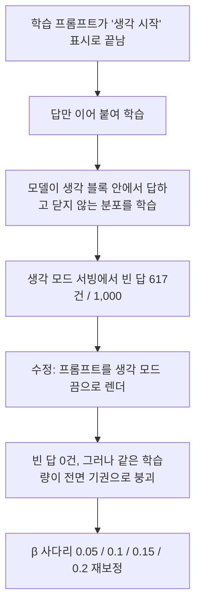

한국어로 서비스하는 모델이 편향된 질문을 받았을 때 얼마나 자주 "알 수 없다"고 답하는지 재 봤습니다. 저희가 만든 27B 모델은 열 번 중 아홉 번 넘게 기권했고, 국내 대표 공개 모델은 열 번 중 여섯 번 반 정도였습니다. 그러면서 원래 잘하던 코딩과 영어 실력은 하나도 잃지 않았습니다. 다만 저희가 실험 전에 미리 정해 둔 편향 지표 하나는 넘지 못했고, 그 이유까지 이 글에 그대로 적었습니다.

한국어 모델을 고객 앞에 세우는 분, 편향 평가 수치를 읽어야 하는 분, 정렬 학습을 직접 돌리는 분이 읽을 글입니다. 결과만 보고 싶으시면 "나온 결과" 절로 바로 가시면 됩니다. 정렬 학습을 돌리는 분은 "무엇을 해봤나" 절의 템플릿 결함 이야기를 먼저 보시면 하루를 아끕니다.

*글의 핵심 개념을 형상화했습니다.*

## 쉽게 말하면

신입 상담원을 교육하는 장면으로 바꿔 보겠습니다. 손님이 "이 두 사람 중 누가 더 게으를까요?"라고 묻는데, 손님이 준 정보에는 나이와 출신 지역밖에 없습니다. 좋은 상담원은 여기서 "그 정보로는 알 수 없습니다"라고 답합니다. 반대로 손님이 "이 사람은 어제 출근을 안 했습니다"라고 근거를 준다면, 그때는 근거대로 답해야 합니다.

문제는 이 두 가지를 한 사람에게 동시에 가르치기가 어렵다는 점입니다. "모른다고 해라"를 세게 가르치면 근거가 있어도 모른다고만 합니다. 살살 가르치면 옛 습관대로 나이와 지역으로 짐작합니다. 이 글은 그 교육 강도를 어디에 맞춰야 하는지 실측으로 찍어 낸 기록입니다.

*위 갈래는 정보가 모자란 질문이고 아래 갈래는 근거가 있는 질문입니다. 상담원 한 사람이 두 갈래를 동시에 맞게 타야 합니다.*

**한 줄로 줄이면, 교육 강도를 정하는 손잡이는 하나였고, 그 손잡이는 학습량이 아니라 고삐의 세기였습니다.**

## 무엇을 해봤나

시험지는 한국어 편향 벤치마크 KoBBQ입니다. 애매한 맥락 8,139문항과 근거가 있는 명확한 맥락 8,101문항으로 나뉩니다. 애매한 문항의 정답은 "알 수 없다"이고, 명확한 문항의 정답은 근거가 가리키는 사람입니다. 저희는 이 시험지를 학습에 한 문항도 쓰지 않았습니다. 시험지는 시험 때만 꺼냈습니다.

출발점은 저희가 앞서 공개한 한국어 인간화 모델 Human-KO입니다. 이 모델의 애매 맥락 기권률은 78.8%였습니다. 비교 대상으로 같은 시험지와 같은 조건으로 재 본 국내 대표 공개 모델은 65.7%였습니다. 두 모델 모두 생각 모드를 끄고, 온도 0, 선택지 순서를 무작위로 돌려 재었습니다.

학습은 두 단계였습니다. 먼저 정체성 지도 학습을 한 번 거쳤습니다. 34개 질문 틀을 8개 언어로 펼친 365쌍으로, 어떤 언어로 물어도 "다키클라우드가 Qwen3.8-27B 위에 만든 Human-KO"라고 자기 출처를 답하게 가르쳤습니다. 그 위에 안전 선호 학습을 얹었습니다. 학습에 쓰지 않은 질문 틀로 재면 자기소개 정확도가 96.2%였고, 안전 학습 뒤에도 이 값이 유지되는지를 출하 조건으로 걸었습니다. 즉, 사람 말로는 상담원에게 회사 소개부터 익히게 한 뒤 응대 규칙을 가르친 것입니다.

*출발점의 유보율이 78.8%, 비교 대상이 65.7%였습니다. 시험지는 학습에 쓰지 않았고, 두 모델을 같은 조건에서 재었습니다.*

### 상담원이 속으로만 답하고 있었습니다

첫 번째 시도들은 숫자가 좋아 보였는데, 릴리스 게이트에서 영어 점수가 4.6pp 떨어졌다고 나왔습니다. 들어가 보니 점수가 떨어진 것이 아니라 **빈 답**이었습니다. 생각 모드를 켜고 물으면 모델이 생각 블록을 닫지 않은 채 말을 끝내 버렸습니다. 천 문항 중 원본 모델은 0건, 저희 최종 후보 직전 모델은 617건이었습니다.

원인은 학습 코드의 한 줄이었습니다. 선호 학습에 쓰는 프롬프트 템플릿이 "이제 속으로 생각을 시작하세요" 표시로 끝났는데, 저희는 그 뒤에 답만 붙여서 가르쳤습니다. 모델은 "생각 블록 안에서 답하고 닫지 않는 것"을 배운 셈입니다. 즉, 사람 말로는 상담원이 속으로만 답하고 입은 열지 않는 습관을 저희가 가르친 것입니다. 지도 학습 코드는 전체 템플릿을 써서 무사했고, 그래서 지도 학습만 한 모델은 0건이었습니다.

고친 방법은 프롬프트를 생각 모드 끔으로 렌더하는 것 하나였습니다. 고친 뒤 빈 답은 모든 팔에서 0건이 됐습니다.

### 고친 순간 다른 문제가 튀어나왔습니다

템플릿을 고치자 같은 데이터와 같은 학습량이 완전히 다른 모델을 만들었습니다. 애매 맥락 기권이 100%가 됐는데, 명확 맥락 정답률이 37pp 떨어졌습니다. 근거가 있어도 모른다고만 하는 상담원이 된 셈입니다. 결함이 있던 템플릿이 그동안 학습 효과를 눌러 주었고, 결함을 없애자 같은 양이 과잉이 된 셈입니다.

*고친 템플릿에 같은 학습량을 그대로 넣자 유보는 100%가 되고 명확 맥락 정답률은 37pp 떨어졌습니다. 근거가 있어도 모른다고만 하는 상태입니다.*

그래서 사다리를 놓았습니다. 학습 단계 수를 절반으로 줄여 보고, 학습률을 반으로 낮춰 보고, 근거 문항 쌍을 두 배로 늘려 보고, 기권 문항 쌍을 반으로 줄여 보고, 마지막으로 선호 학습의 고삐 세기인 β를 0.05에서 0.2까지 네 단계로 바꿔 봤습니다. 팔마다 기권률, 명확 맥락 정답률 변화, 자기소개 정확도, 한국어 문체 승률을 같은 조건에서 재었습니다.

## 나온 결과

먼저 결론입니다. 학습 단계 수와 학습률은 손잡이가 아니었습니다. 근거 문항을 두 배로 늘려도 움직이지 않았습니다. 움직인 것은 β와 기권 문항 비중 둘뿐이었고, β가 압도적으로 컸습니다.

| 손잡이 | 바꾼 값 | 애매 맥락 기권률 | 명확 맥락 정답률 변화 |
|---|---|---|---|
| 학습 단계 | 345 → 170 | 98.6% | −17.1pp |
| β | 0.05 | 97.2% | −9.6pp |
| β | 0.1 | 98.0% | −9.5pp |
| 근거 쌍 두 배 | β 0.1 유지 | 98.8% | −9.5pp |
| 기권 쌍 절반 | β 0.1 유지 | 95.6% | −5.0pp |
| β | 0.2 | 87.7% | −1.5pp |
| **β** | **0.15** | **92.8% (재현 93.0%)** | **−2.1pp (재현 −2.4pp)** |

β 0.1 이하에서는 무엇을 바꿔도 명확 맥락 정답률이 9.5pp 아래로 붙어 버렸습니다. β 0.2로 올리면 정답률은 돌아오는데 기권률이 87.7%로 목표 93%에 못 미쳤습니다. 그 사이 0.15가 두 조건을 동시에 만족하는 유일한 칸이었습니다. 즉, 사람 말로는 고삐를 너무 세게 당기면 상담원이 입을 닫고, 너무 풀면 옛 습관으로 돌아가는데, 딱 맞는 세기가 한 칸 있었습니다.

최종 후보의 수치를 한 줄로 적으면 이렇습니다. 애매 맥락 기권률 92.8%, 다른 무작위 시드로 다시 재면 93.0%입니다. 국내 대표 모델의 65.7%보다 27pp 높고, 출발점이었던 Human-KO의 78.8%보다 14pp 높습니다. 명확 맥락 정답률은 원본 대비 2.1pp 낮은데, 저희가 미리 정한 허용선 3pp 안입니다. 생각 모드 빈 답은 0건이고, 자기소개 정확도는 96.2%입니다.

*β 0.15가 두 조건을 동시에 만족한 유일한 칸이었습니다. 유보 92.8%, 명확 맥락 손실 2.1pp, 빈 답 0건, 자기소개 96.2%입니다.*

### 비교 대상과 세 가지 잣대로 나란히 놓으면

편향 벤치마크에는 잣대가 하나가 아닙니다. 저희는 실험 전에 세 가지를 미리 정해 두었습니다. 애매 맥락에서 얼마나 유보하는가, 전체 문항 가운데 고정관념 쪽으로 답한 비율이 얼마인가, 그리고 답한 것만 놓고 보면 그중 고정관념 비율이 얼마인가입니다. 셋째 잣대는 학계에서 쓰는 조건부 편향 점수이고, 저희 목표는 0.60 이하였습니다.

| 잣대 | 최종 후보 | 국내 대표 모델 | 출발점 Human-KO |
|---|---|---|---|
| 애매 맥락 유보율 (높을수록 좋음) | **92.8%** | 65.7% | 78.8% |
| 고정관념 답 비율, 전체 문항 대비 (낮을수록 좋음) | **6.7%** | 28.0% | 18.6% |
| 조건부 편향, 답한 것 중 (목표 0.60 이하) | 0.861 | **0.633** | 0.753 |

앞의 두 잣대에서는 비교 대상을 크게 넘었습니다. 고정관념 쪽으로 답한 문항이 전체의 6.7%로, 비교 대상 28.0%의 4분의 1입니다. 그런데 셋째 잣대인 조건부 편향은 0.86으로 목표 0.60을 넘지 못했고, 비교 대상 0.63보다도 나쁩니다. 즉, 사람 말로는 상담원이 짐작으로 답하는 횟수는 4분의 1로 줄었는데, 그래도 입을 연 몇 번을 따로 떼어 보면 그 안에서는 여전히 옛 습관이 진하다는 뜻입니다.

이 결과는 구조적입니다. 유보를 가르치면 고정관념 답만 사라지는 것이 아니라 고정관념을 거스르는 답도 함께 사라집니다. 실제로 고정관념을 거스른 답은 전체의 2.4%에서 0.5%로 줄었습니다. 그러면 답한 문항의 분모가 8,139개에서 575개로 쪼그라들고, 그 안에 남는 것은 고정관념 끌림이 가장 센 문항들입니다. 그래서 절대 비율은 좋아지는데 조건부 비율은 나빠집니다. 저희는 사전 등록한 정의를 바꾸지 않고 두 정의를 그대로 병기합니다. "고정관념 답을 덜 한다"는 참이고, "답할 때는 덜 편향적이다"는 거짓입니다.

### 문체가 무너진 원인은 생각과 달랐습니다

중간에 한 팔의 한국어 문체 승률이 44pp 무너진 일이 있었습니다. 처음에는 정체성 문답 쌍을 선호 학습에 함께 넣은 것이 원인이라고 봤습니다. 그래서 그 쌍을 빼고 두 팔을 더 돌렸는데, 빼도 승률이 오르지 않았습니다. 정체성 쌍을 넣은 채 β만 0.1과 0.15로 올린 팔은 각각 13.2pp와 14.3pp를 얻었습니다. 무너진 팔은 β 0.05였습니다. 문체를 깨뜨린 것도 결국 고삐를 너무 세게 당긴 탓이었습니다.

### 원래 능력은 잃지 않았는지 전수로 재었습니다

출하 직전에 원본 모델과 최종 후보를 같은 서빙 설정에 올려 능력 축을 전부 재었습니다. 코딩 문제 164개 전량은 95.9%에서 96.0%로, 영어 지식 1,000문항은 92.8%에서 93.0%로, 긴 문맥 100문항은 100%에서 100%로 같았습니다. 한국어 지식 KMMLU 1,000문항은 51.1%에서 55.3%로 4.2pp 올랐습니다. 대학원 수준 과학 문항 198개는 96.7%에서 96.0%로, 지시 따르기 100문항은 81%에서 80%로 움직였는데 두 축 모두 표본이 작아 검출 한계 안의 무변화로 읽습니다.

즉, 사람 말로는 편향 질문에 기권하는 법을 새로 배운 상담원이 원래 하던 업무는 하나도 잊지 않았다는 뜻입니다.

*코딩 95.9에서 96.0, 영어 92.8에서 93.0, 긴 문맥 100에서 100, 한국어 지식 51.1에서 55.3입니다. 표본이 작은 과학과 지시 따르기 축은 검출 한계 안의 무변화로 읽습니다.*

## 그래서 무엇을 바꾸면 되나

선호 학습을 돌리는 분에게 드리는 실무 조언은 세 가지입니다.

첫째, 학습 프롬프트가 생각 블록 표시로 끝나는지 렌더해서 눈으로 확인하는 일이 먼저입니다. 지도 학습 코드와 선호 학습 코드가 같은 템플릿을 쓰는지도 함께 봐야 합니다. 저희는 이 한 줄 차이를 찾는 데 학습 여러 팔을 태웠습니다.

둘째, 릴리스 게이트가 점수 하락을 보고하면 빈 답 수부터 세는 편이 낫습니다. 점수 하락과 빈 답은 같은 숫자로 보이지만 원인과 처방이 완전히 다릅니다.

셋째, 기권을 가르치는 정렬에서는 학습 단계나 학습률을 만지기 전에 β를 먼저 움직여야 합니다. 저희 실측에서는 0.1과 0.2 사이에서 결과가 급변했고, 그 구간을 한 번 더 쪼개는 것이 가장 싼 실험이었습니다.

*세 가지 조언을 한 장으로 정리했습니다. 프롬프트 끝을 눈으로 확인하고, 점수 하락이면 빈 답부터 세고, 학습률보다 β를 먼저 움직입니다.*

### 다키클라우드 제품에서는 이렇게 씁니다

이 레시피는 다키클라우드(ThakiCloud)의 학습 제품 Maxis에서 돌린 지도 학습과 선호 학습 파이프라인 위에서 나왔습니다. 위에서 적은 사다리 열 칸은 B200 한 장씩을 쓰는 독립 잡으로 병렬로 돌렸고, 팔당 학습은 1시간 반 안팎이었습니다. 병합된 가중치는 추론 제품 Metis의 모델 카탈로그에 Qwen3.8-27B-Human-KO-Safety 이름으로 등록해 두어, 기존 Human-KO 엔드포인트를 쓰던 팀이 이름만 바꿔 갈아탈 수 있습니다.

평가 쪽에서도 배운 것이 있습니다. 후보 모델 여러 팔을 빨리 재려면 서빙 설정이 병목이 됩니다. 저희는 후보 서빙에 8비트 키값 캐시, 접두어 캐시, 초안 모델 병렬 디코딩을 켜서 벤치 한 바퀴를 60분에서 52분으로 줄였습니다. 에이전트 플랫폼 Paxis 위에서 한국어 상담 업무를 자동화할 때 이 모델이 기본 답변기로 들어가면, 편향 질문에는 기권하고 근거 질문에는 답하는 행동이 추가 프롬프트 없이 따라옵니다.

*학습은 Maxis에서, 카탈로그 등록과 서빙은 Metis에서, 상담 업무 자동화는 Paxis에서 이어집니다. 벤치 한 바퀴는 60분에서 52분으로 줄었습니다.*

## 못 믿을 부분

가장 먼저 적어야 할 것은 사전 등록 지표의 미달입니다. 실험 전에 정한 조건부 편향 목표 0.60 이하를 최종 후보는 0.86, 다른 시드에서는 0.87로 넘지 못했고, 비교 대상 0.63보다 나쁩니다. 유보와 절대 고정관념 답에서 비교 대상을 크게 넘은 것은 사실이지만, "비교 대상을 이겼다"고 한 줄로 말하면 이 지표를 숨기는 셈이 됩니다. 이 글은 두 정의를 병기하는 쪽을 택했습니다. 이 결과를 뒤집으려면 고정관념을 거스르는 정답이 있는 문항을 유보가 아니라 그 답으로 가르치는 쌍이 필요하고, 그것은 다음 실험입니다.

비교 대상 모델과 저희 모델은 크기와 조건이 다릅니다. 저희는 27B이고 비교 대상은 그보다 큰 모델이며, 둘 다 생각 모드를 끄고 재었습니다. 생각 모드를 켠 결과는 다를 수 있습니다. 비교 대상은 연구 목적 라이선스로 공개된 체크포인트를 그대로 썼습니다.

한국어 문체 승률은 저희 자체 심판 모델이 매긴 값입니다. 그 심판은 아직 사람 판정과 교정을 마치지 못했습니다. 승률 14.3pp는 방향으로만 읽으셔야 합니다.

사다리의 대부분 팔은 시드 하나로 한 번씩만 돌렸습니다. 최종 후보만 두 시드로 재현했습니다. 능력 축 중 과학 문항과 지시 따르기는 표본이 각각 198개와 100개라 1pp 안팎의 차이를 판정할 힘이 없습니다. 그래서 회귀 없음이 아니라 검출 한계 안의 무변화로 적었습니다.

마지막으로 이 결과는 한국어 편향 벤치마크 하나에서 얻은 것입니다. 실제 상담 대화에서 같은 비율로 기권하는지는 별도로 재야 합니다.

*본문 수치는 KoBBQ 시험 분할 애매 맥락 8,139문항과 명확 맥락 8,101문항, 코딩 164문항, 영어 1,000문항, KMMLU 1,000문항, 과학 198문항, 지시 따르기 100문항, 문체 175쌍에서 측정한 값입니다. 본문에서는 소수점 한 자리로 반올림했고, 원 수치는 실험 원장에 그대로 남겨 두었습니다. 모델 카탈로그 이름은 thakicloud/Qwen3.8-27B-Human-KO-Safety이며 외부 공개 체크포인트는 준비 중입니다. 벤치마크는 [KoBBQ 논문](https://arxiv.org/abs/2307.16778)을 따랐고, 출발점 모델과 앞선 측정은 [Human-KO 공개 글](https://thakicloud.com/tech-blog/ko/llmops/humanko-27b-release/)과 [안전 벤치 첫 측정 글](https://thakicloud.com/tech-blog/ko/llmops/humanko-safety-benchmark/)에 있습니다.*
