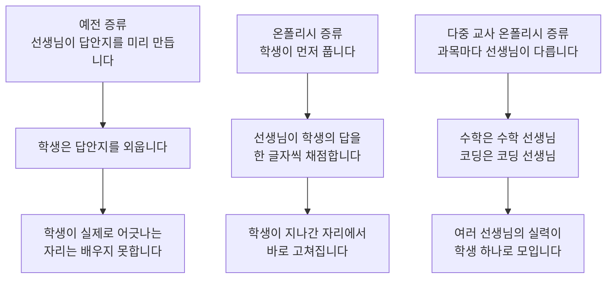

큰 모델의 실력을 작은 모델로 옮기는 방식이 최근 한 번 뒤집혔습니다. 예전에는 큰 모델이 미리 써 둔 모범답안을 작은 모델이 통째로 외웠습니다. 요즘은 작은 모델이 먼저 풀어 봅니다. 큰 모델은 틀린 바로 그 자리에서 고쳐 줍니다.

여기에 과목마다 선생님을 따로 두는 방식을 얹은 것이 오늘 소개할 학습법입니다. 작은 모델을 직접 만드시는 분, 큰 모델의 서빙 비용 때문에 작은 모델로 내려오고 싶은 분께 쓸모가 있습니다. 이 글에 나오는 측정값은 전부 공개된 논문과 모델 카드에서 가져왔습니다. 저희 실험은 아직 시작 전이라는 점도 먼저 적어 둡니다.

*여러 선생님의 실력이 학생 한 명에게 흘러드는 구조를 형상화했습니다.*

## 쉽게 말하면

학원 하나를 떠올려 보시면 됩니다. 학생은 한 명입니다. 선생님은 과목마다 따로 있습니다. 수학 선생님, 코딩 선생님, 글쓰기 선생님이 각자 자기 과목만 봅니다.

예전 학습법은 이랬습니다. 선생님이 문제와 모범답안을 한 권 만들어 두었습니다. 학생은 그 답안지를 통째로 외웠습니다. 그런데 시험장에서 학생이 세 번째 줄부터 자기 방식으로 풀다가 어긋나면, 그다음부터는 손을 쓸 수 없었습니다. 답안지에 그 상황이 없었기 때문입니다.

바뀐 학습법은 순서를 뒤집습니다. 학생이 먼저 문제를 풉니다. 선생님은 옆에 앉아 학생이 쓰는 글자를 한 자 한 자 따라 보다가, 어긋나는 순간에 이쪽이 낫다고 짚어 줍니다. 학생이 실제로 지나가는 자리에서만 배운다는 것이 핵심입니다.

여기서 한 걸음 더 나가면 오늘의 주제가 됩니다. 학생이 수학 문제를 풀 때는 수학 선생님이 옆에 앉습니다. 코딩 문제로 넘어가면 코딩 선생님이 자리를 바꿉니다. 과목별로 따로 키운 선생님들의 실력을 학생 한 명 안에 모으는 방식입니다.

즉, 사람 말로는 답안지를 외우게 하지 말고 선생님을 옆에 앉히되, 과목마다 다른 선생님을 앉히라는 이야기입니다.

*과목마다 배정된 선생님이 학생이 어긋나는 순간에 토큰 단위로 개입합니다.*

## 무엇을 해봤나

### 예전 방식은 답안지를 외우게 했습니다

큰 모델에게 문제를 주고 좋은 답을 받아 데이터로 쌓은 다음, 작은 모델에게 그 데이터를 학습시키는 방식입니다. 널리 쓰였고 실제로 효과도 있었습니다. 다만 한 가지가 빠집니다.

작은 모델이 실제로 답을 만들 때 지나가는 길과, 큰 모델이 미리 써 둔 답의 길이 서로 다릅니다. 큰 모델은 첫걸음부터 끝까지 깔끔하게 갔는데, 작은 모델은 세 번째 걸음에서 옆길로 샙니다. 그리고 작은 모델은 그 옆길에서 어떻게 돌아 나오는지를 배운 적이 없습니다.

### 학생이 먼저 풀게 하면 달라집니다

온폴리시 증류(on-policy distillation)는 이 순서를 뒤집습니다. 학생이 스스로 답을 만들어 냅니다. 선생님은 그 답을 토큰 하나 단위로 채점합니다. 학생이 실제로 방문한 상태 위에서만 가르침이 들어가므로, 옆길로 샌 다음의 복구도 학습 대상이 됩니다.

강화학습과 견주면 차이가 뚜렷합니다. 강화학습은 답을 다 쓴 뒤에야 잘했는지 못했는지를 한 번 알려 줍니다. 온폴리시 증류는 매 글자마다 알려 줍니다. 신호가 훨씬 촘촘하다는 뜻입니다.

### 과목마다 선생님을 두는 것이 다음 단계입니다

선생님 한 명이 수학과 코딩과 글쓰기를 모두 최고로 잘하기는 어렵습니다. 모델을 학습해 보신 분이라면 익숙한 장면일 것입니다. 수학을 열심히 넣으면 글쓰기가 이상해집니다. 코딩을 강화하면 지시 따르기가 흔들립니다.

다중 교사 온폴리시 증류(MOPD)는 이 문제를 순서를 나눠 풉니다. 먼저 과목별 전문가를 따로 키웁니다. 마지막에 그 실력들을 학생 하나로 모읍니다. 실력을 만드는 일과 실력을 합치는 일을 분리하는 셈입니다.

*세 가지 방식의 차이입니다. 아래로 내려갈수록 학생이 실제로 지나간 자리에서 배우는 몫이 커집니다.*

## 나온 결과

### 선생님을 그냥 이어 붙이면 절반도 못 건집니다

이 구조를 통째로 공개한 후속 연구가 있습니다. 30억 개 규모의 작은 학생 하나에 수학, 코딩, 지시 따르기 선생님 셋을 붙인 재현 실험입니다. 선생님 셋을 손보지 않고 그대로 이었더니 종합 점수가 25.7에서 28.1로 올랐습니다.

문제는 그다음입니다. 선생님들을 따로 키웠을 때 각자 얻은 향상분 가운데 학생이 되찾은 몫은 열에 세 번 반쯤이었습니다. 나머지 예닐곱은 통합 과정에서 새어 나갔습니다.

새는 곳은 학습 예산이었습니다. 아무 조정 없이 돌리면 답이 긴 수학과 코딩이 학습 신호의 대부분을 가져갑니다. 답이 짧은 지시 따르기는 같은 학습 시간을 받고도 실제로 배우는 양이 적습니다.

연구진은 세 가지를 손봤습니다. 과목별로 학습에 쓰이는 글자 수의 몫을 맞췄습니다. 학생이 선생님보다 많이 뒤처진 과목에는 예산을 더 줬습니다. 학생이 자라는 동안 채점 기준도 다시 매겼습니다. 종합 점수는 31.2가 됐습니다. 되찾은 몫은 열에 여덟 정도로 올라갔습니다.

| 조건 | 종합 점수 | 향상분 회수율 |
|---|---|---|
| 출발점 (혼합 지도학습) | 25.67 | 기준 |
| 선생님 셋을 그냥 통합 | 28.05 | 35.6% |
| 학습 예산을 과목별로 조정 | 31.24 | 83.4% |

*Open-MOPD 논문(arXiv 2608.19098)의 실측값입니다. 학생은 SmolLM3-3B이며 회수율은 과목별 전문 교사가 따로 얻은 향상분 중 통합 학생이 되찾은 비율입니다.*

*회수율은 35.6%에서 83.4%로 올랐습니다. 오른쪽이 그 차이를 만든 세 가지 조정입니다.*

즉, 사람 말로는 선생님을 여럿 붙이는 것만으로는 부족하다는 뜻입니다. 누구에게 얼마나 시간을 줄지까지 정해 줘야 합니다.

### 문제를 열여섯 개만 써도 비슷했습니다

같은 흐름에서 나온 다른 연구는 데이터 양에 관한 이야기입니다. 학습에 쓰는 문제의 개수보다, 학생이 답을 만들면서 얼마나 다양한 상황을 지나가느냐가 더 중요할 수 있다는 결과입니다.

연구진은 과목마다 의미가 서로 다른 질문 열여섯 개만 써도, 전체 데이터를 다 쓴 경우와 맞먹는 상황 범위와 성능에 닿았다고 보고했습니다. 상황 범위 기준으로는 98.9%였습니다. 결과 하나로 대규모 데이터가 필요 없다고 결론짓기는 이르지만, 작은 시험을 먼저 돌려 볼 수 있다는 뜻이기는 합니다.

### 실제 서비스 모델에도 들어갔습니다

이 학습법이 논문 안에만 머물러 있는 것은 아닙니다. 최근 공개된 4B 모델 Spark-X2.5-4B가 모델 카드에서 이 방법을 썼다고 밝히고 있습니다. 여러 능력 영역에 대규모 강화학습을 돌려 과목별 교사 정책을 만든 다음, 그 강점들을 배포 가능한 모델 하나로 합쳤다는 설명입니다.

그 모델이 보고한 수치 가운데 눈에 띄는 것은 도구 호출과 실제 코드 수정입니다. 도구 호출 시험에서 65.1점, 실제 저장소를 고치는 시험에서 44.4점입니다. 4B 크기에서 나온 값이라는 점이 놀랍습니다. 원 논문을 낸 연구진 쪽도 자사 주력 모델에 같은 방법을 적용했다고 밝히고 있습니다.

*데이터의 절대량보다 학생이 지나가는 상황의 다양성이 핵심이라는 결과입니다.*

## 그래서 무엇을 바꾸면 되나

### 저희는 4B 학생을 둘 만들어 비교합니다

저희는 Qwen3.8-27B를 한국어 대화체로 정렬한 Human-KO 계열 모델을 이미 공개해 두었습니다. 불릿 남발은 97.5%에서 2.0%로 줄었습니다. 뒤이어 안전 정렬을 얹은 판에서도 코딩과 영어와 긴 문맥 능력에는 회귀가 없었습니다. 이제 이 27B의 실력을 4B로 내려 보내려고 합니다.

핵심은 모델을 둘 만든다는 데 있습니다. 첫 번째는 글로벌 성능만 겨냥한 학생입니다. 추론, 코딩, 도구 사용, 지시 따르기 교사 넷을 붙입니다. 두 번째는 같은 구조에 한국어 교사를 하나 더 붙인 학생입니다.

*두 학생 모델의 성능 차이가 곧 한국어 능력을 넣기 위해 지불한 대가입니다.*

왜 굳이 둘이냐면, 비교 대상이 없으면 아무 말도 할 수 없기 때문입니다. 한국어를 넣으면 다른 능력이 조금 깎이는 것이 보통인데, 모델 하나만 만들면 얼마나 깎였는지 알 방법이 없습니다. 두 모델을 같은 잣대로 재면 그 대가가 숫자로 나옵니다.

한 가지는 정확히 적어 두어야 합니다. 원 논문의 방법은 주로 같은 계열에서 만든 여러 전문가를 한 모델로 합치는 문제를 다룹니다. 저희는 여기에 27B 교사에서 4B 학생으로 내려가는 크기 차이까지 얹으려 합니다. 크기를 넘나드는 다중 교사 실험은 이미 다른 연구에서 시도되고 있습니다. 그 연구는 교사들끼리 토론을 시킨 뒤, 합의가 모인 정도로 가르침의 무게를 정합니다.

### 다키클라우드 제품에서는 이렇게 씁니다

이 실험이 제품에 닿는 지점은 세 곳입니다. 교사를 키우고 학생을 학습시키는 일은 학습 제품 Maxis에서 돌아갑니다. 과목별 교사를 따로 키우는 구조라 잡을 여러 개로 쪼개 병렬로 던질 수 있습니다. 하나가 실패해도 그 과목만 다시 돌리면 됩니다.

만들어진 4B 학생은 추론 제품 Metis의 모델 카탈로그에 올라갑니다. 27B를 서빙하던 자리를 4B가 대신하면 같은 장비에서 훨씬 많은 요청을 받을 수 있습니다. 저희가 이미 공개한 27B 계열도 양자화 판까지 카탈로그에 올려 두었으므로, 팀은 이름만 바꿔 갈아탈 수 있습니다.

마지막이 에이전트 플랫폼 Paxis입니다. 에이전트는 한 번의 답변이 아니라 도구를 여러 번 부르는 긴 사슬로 일합니다. 사슬이 길수록 모델 호출 수가 늘고 지연이 쌓이므로, 작고 빠른 모델이 곧 제품 경험입니다. 도구 호출과 지시 따르기를 따로 가르칠 수 있다는 점이 이 학습법이 에이전트 업무 자동화와 맞물리는 이유입니다.

*학습은 Maxis에서, 서빙은 Metis에서, 업무 자동화는 Paxis에서 이어집니다.*

## 못 믿을 부분

가장 먼저 적어야 할 것은 저희 실험이 아직 하나도 돌지 않았다는 사실입니다. 위에 적은 두 모델은 설계이지 결과가 아닙니다. 글로벌 성능이 유지되는지, 한국어가 실제로 올라가는지는 재 보기 전에는 아무도 모릅니다.

인용한 수치는 모두 남의 측정값입니다. 종합 점수 회수율은 30억 개 규모 학생 하나와 과목 셋에서 나온 값입니다. 저희처럼 27B 교사에서 4B로 내려가는 조건에서 같은 비율이 나올 이유는 없습니다. 학생과 교사의 크기 차이가 벌어질수록 통합이 어려워질 가능성이 큽니다.

질문 열여섯 개로 충분했다는 결과도 조심해서 읽어야 합니다. 그 값은 상황 범위라는 특정 잣대에서 나왔습니다. 과목 구성과 채점 방식이 바뀌면 함께 바뀝니다. 저희는 이것을 결론이 아니라 작은 시험을 먼저 돌려 볼 근거로만 쓰려 합니다.

한국어 능력을 재는 잣대도 아직 완성되지 않았습니다. 저희 한국어 문체 승률은 자체 심판 모델이 매기는데, 그 심판은 사람 판정과의 교정을 마치지 못했습니다. 방향으로만 읽으셔야 하는 값입니다.

*이 실험을 뒤집을 수 있는 세 가지 한계를 미리 적어 둡니다.*

마지막으로 4B 모델이 27B를 대체한다는 뜻이 아닙니다. 절대 성능에는 여전히 차이가 있고, 이 실험이 묻는 것은 얼마나 좁힐 수 있는지입니다. 좁힌 폭이 서빙 비용 절감보다 작다면 27B를 그대로 쓰는 편이 낫습니다.

*본문 수치의 출처는 다음과 같습니다. 다중 교사 온폴리시 증류의 원 논문은 [MOPD (arXiv 2606.30406)](https://arxiv.org/abs/2606.30406), 공개 재현과 학습 예산 조정은 [Open-MOPD (arXiv 2608.19098)](https://arxiv.org/abs/2608.19098)과 [GitHub 저장소](https://github.com/BytedTsinghua-SIA/Open-MOPD), 질문 개수 실험은 [arXiv 2609.04172](https://arxiv.org/abs/2609.04172), 크기를 넘나드는 다중 교사 실험은 [MAD-OPD (arXiv 2605.01347)](https://arxiv.org/abs/2605.01347)입니다. 온폴리시 증류의 개념 정리는 [Thinking Machines 공개 글](https://thinkingmachines.ai/blog/on-policy-distillation/)을 참고했습니다. 4B 모델의 벤치마크와 학습법 설명은 [Spark-X2.5-4B 모델 카드](https://huggingface.co/XHToken/Spark-X2.5-4B)에서 가져왔습니다. 저희 27B 모델은 [Qwen3.8-27B-Human-KO](https://huggingface.co/ThakiCloud/Qwen3.8-27B-Human-KO)와 [안전 정렬판](https://huggingface.co/ThakiCloud/Qwen3.8-27B-Human-KO-Safety)으로 공개돼 있습니다. 앞선 측정은 [Human-KO 공개 글](https://thakicloud.com/tech-blog/ko/llmops/humanko-27b-release/)에 있습니다. 본문에서는 소수점 한 자리로 반올림했으며 원 수치는 위 표에 그대로 두었습니다.*
