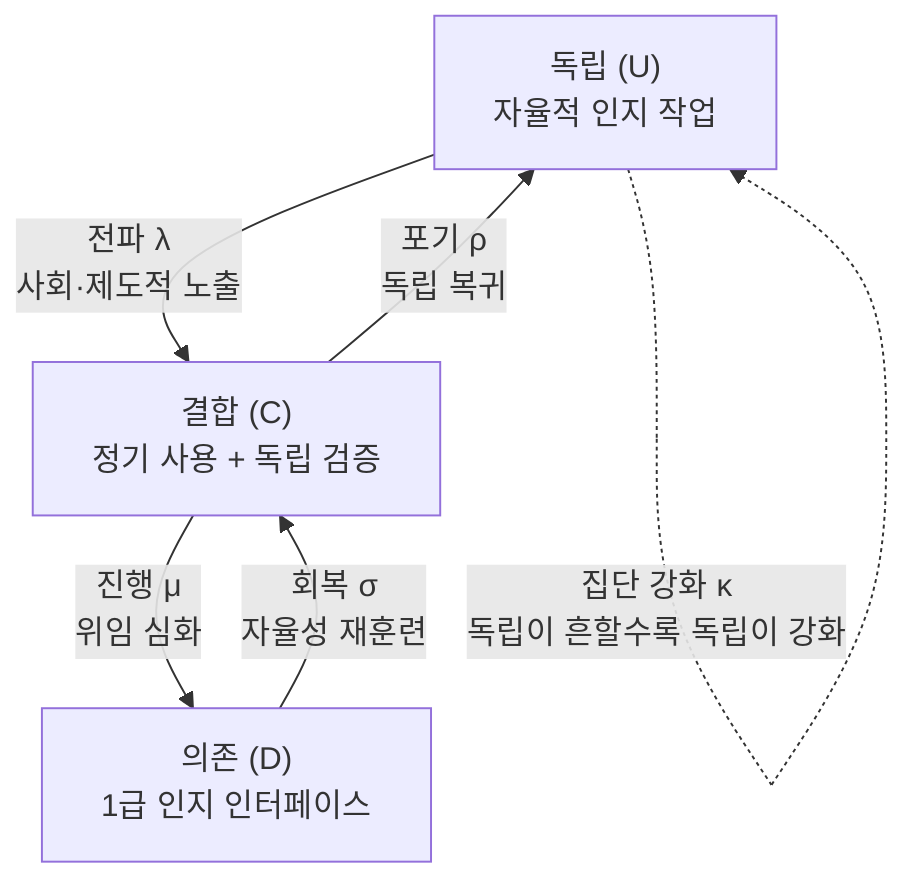

## 왜 읽어야 하나

기업에서 AI 에이전트 도입의 속도와 형태를 결정하는 플랫폼 운영자, 그리고 "AI 의존"을 방정식으로 다루고 싶은 데이터 과학자를 위한 글입니다. 결론부터 말하면 이 논문은 LLM 도입을 3상태 전염병으로 모델링해, 의존이 사용량의 선형 함수가 아니라 상전환(phase transition)임을 보여줍니다. 도입 압력이 임계점을 넘으면 인구 전체가 지속적 의존 상태로 급격이 이동할 수 있고, 그 이동의 반대 방향은 생각보다 비쌉니다. 플랫폼 운영자에게 "되돌릴 수 있는가"는 사용량이 아니라 설계 변수라는 점까지가 이 글의 테이크아웃입니다.

## 무슨 일이 있었나

2026년 9월 3일, ["Large-Language Models as a Cognitive Virus"](https://arxiv.org/abs/2609.03344)(arXiv 2609.03344)라는 제목의 논문이 arXiv에 올라 커뮤니티에서 빠르게 논쟁을 만들었습니다. 저자 구성이 화제의 일부입니다. Harvard Wyss Institute의 David Krakauer와 Michael Levin, IRB Barcelona의 Ricard Solé, INFN의 Giulio Ruffini, Boston University의 Manlio de Domenico, 바르셀로나 대학교(UAB)의 Luis F. Seoane와 Santiago F. Elena를 포함해 9명의 국제 공동 연구입니다. 복잡계와 역학 모델링, 생물학과 인지 과학이 한 테이블에 앉은 조합입니다.

제목의 "인지 바이러스"가 시선을 끄는 것은 비유 자체입니다. 논문은 LLM을 사회 전파(social transmission)로 퍼지며 숙주의 인지 관행을 다시 쓰는 자기 전파 정보 개체(self-propagating informational entity)로 취급합니다. 바이러스처럼 감염-진행-회복의 상태를 가지는데, 더 중요한 것은 인구의 전체 상태가 한꺼번에 바뀌는 tipping point의 가능성을 모델이 지니는다는 것입니다.

## 이 논문은 무엇인가

모델은 3가지 인지 상태를 추적하는 상미분방정식(ODE) 계입니다.

- 독립(uncoupled): 자율적 인지 작업을 유지하는 개인
- 결합(coupled): LLM을 정기적으로 쓰되 독립적 추론과 검증을 하는 사용자
- 의존(dependent): LLM을 1급 인지 인터페이스로 삼아 다른 경로로 돌아가기 어려운 사용자

상태 비율 U, C, D의 시간 변화는 아래처럼 됩니다.

```
dU/dt = -λ·U·C + ρ·C + κ·U²·C
dC/dt = λ·U·C - (μ+ρ)·C + σ·D - κ·U²·C
dD/dt = μ·C - σ·D
```

파라미터 5개는 각기 하나의 과정을 소유합니다. λ는 사회·제도적 노출로 LLM 사용 관행이 퍼지는 전파율입니다. μ는 결합 사용자가 의존 상태로 진행되는 속도, ρ와 σ는 결합과 의존 상태에서 각각 독립과 결합으로 돌아가는 회복 속도입니다. κ는 집단 강화(collective reinforcement) 항, 이 논문의 구조적 특징을 만드는 항입니다.



κ 항이 표준 SIR 역학 모델과의 구조적 차이입니다. SIR에서 감수성 상태는 전파에 의해 수동하게 잠식됩니다. 이 모델에서 독립 상태는 κ·U²·C 항으로, 독립 개인이 많을수록 스스로 강화됩니다. 인구에 독립적 인지가 풍부할 때 의존으로 넘어가는 비용이 높아지고, 희박할 때 낮아지는 구조입니다. Allee 효과와 같은 양(positive) 피드백이며, 아래에서 보는 비대칭을 만드는 장치입니다.

## 모델이 어떻게 작동하나

가장 중요한 결과는 transcritical 분기(bifurcation)입니다. 도입 압력(ρ, σ 대비 λ의 상대 크기)이 서서히 올라가면, 임계점(critical threshold)을 지나 인구의 상태가 불연속적으로 바뀝니다. 임계점 아래에서는 도입이 늘어나도 의존 개인 비율이 낮은 수준에 머무릅니다. 임계점 위에서는 도입의 소폭 추가 증가가 인구 전체 규모의 급격한 이동(runaway dynamics)을 촉발합니다. "LLM 도입의 소폭 증가가 인지 능력의 갑작스러운 손실을 만들 수 있다"는 서술은 이 모델에서 수사의 힘을 빌린 말이 아니라, 방정식 계가 자체적으로 갖는 동역학 성질입니다.

두 번째는 hysteresis와 lock-in입니다. 인구가 의존 주도 상태로 들어간 뒤, 도입 압력을 낮춘다고 원래 상태로 즉시 돌아오지 않습니다. 의존 상태에는 들어간 뒤 빠져나오기 어려운 기억 효과(memory effect)가 있고, 논문은 이 구조를 technological lock-in이라 부릅니다. 탈출 조건은 사용을 줄이는 것이 아니라 회복률 σ, 즉 자율성을 다시 훈련하는 투자를 높이는 쪽입니다.

세 번째는 인지 면역(cognitive immunization)입니다. 논문은 의존으로의 이동을 막는 조건을 탐색하는데, 방향은 두 개입니다. 전파율 λ를 낮추는 것(의존이 기본값이 되는 노출의 밀도를 줄이는 것), 그리고 의존을 가역적으로 유지하는 것(ρ와 σ를 높이는 것). 두 전략은 각각 다른 대상에 작동합니다. 전자는 환경에 대한 정책이고, 후자는 개인의 관행에 대한 정책입니다.

## 왜 이 프레이밍이 설득력 있는가

이 논문의 강점은 "의존"을 정성적 논쟁에서 임계점과 기억을 갖는 정량 구조로 옮겼다는 것입니다. 그동안 AI 의존 논쟁은 인지를 확장한다는 진영과 인지를 위축시킨다는 진영의 평균값 싸움이었습니다. 역학 모델은 분포를 묻습니다. 인구가 임계점 아래인지 위인지는 정책과 설계의 성격을 가르는 질문이고, 파라미터로 다룰 수 있습니다.

κ 항의 도입도 방어 가능한 선택입니다. "혼자 검증하는" 사회적 관행이 주위 동료에서 흔할수록 싸게 되고, 희박할수록 비싸지는 것은 관찰된 사실에 가깝습니다. 그것을 양 피드백 항으로 둔 구조는, 의존으로 넘어가기 쉽고 빠져나오기 어렵게 만드는 비대칭을 만들어냅니다. 학습과 업무 현장에서 경험적으로 말하는 "한 번 위임하기 시작하면 되돌리기 어렵다"는 인상을, 최소한 방향성에서 일치시키는 모델입니다.

## ThakiCloud 제품 적용 시사점

이 모델은 기업 AI 플랫폼 운영자의 관점에서 그대로 읽힙니다. 기업의 도입 과정은 더 작은 스케일로 같은 구조를 가집니다. 도구가 들어오면 팀 안에서 퍼집니다(λ). 혼자 검증하는 관행이 약해집니다(μ). 결국 프로세스가 에이전트의 출력에 의존하게 됩니다(D 상태). 그리고 그 상태가 만들어지면 "사용을 줄이자"는 정책 하나만으로는 관행이 돌아오지 않습니다. 돌아오게 하는 것은 σ, 다시 말면 빠져나올 수 있는 능력에 대한 투자입니다.

ThakiCloud의 Paxis는 human-in-the-loop 승인, 정책 게이트, 감사 로그를 일급 리소스로 다루는 에이전트 플랫폼입니다. 이 논문은 그 구성이 왜 맞는지 모델링 언어로 뒷받침합니다. human approval 단계는 모델의 변수로 보면 결합에서 의존으로 넘어가는 전환(μ)을 조건부로 만드는 장치입니다. 감사 로그는 사람이 과거 프로세스를 어디까지 검증했는지에 대한 증거를 남기므로, 회복(σ)을 가능하게 하는 수단입니다. Paxis의 거버넌스 기능이 "인지 면역 인프라"로 읽힐 수 있고, 기업 AI 도입 정책을 "얼마나 쓸 것인가" 단일 축이 아니라 λ, μ, σ 세 개의 줄로 다루라는 뜻입니다.

lock-in 지점은 인프라로도 확장됩니다. 기업이 의존하는 모델이나 도구가 hysteresis 구조를 가지면, 전환 비용은 이전 노력만이 아니라 위축된 검증 관행입니다. 오픈 포맷(Apache 2.0, GGUF, 표준 API)의 이동성은 독립 상태로 돌아오는 경로(ρ)를 싸게 유지하는 수단입니다. ThakiCloud가 오픈 표준과 온프레미스 지원에 두는 강조는, 이 관점에서는 가역성 설계입니다.

## 한계 및 반론

가장 중요한 전제는 캘리브레이션 부재입니다. 이 모델의 모든 파라미터는 구조적 가정이지, 실제 데이터에 맞춘 값이 아닙니다. tipping point의 존재는 모델 클래스의 성질이고, 그 위치와 이동 속도와 hysteresis의 크기는 파라미터 값에 따라 결정되는데, 그 값은 아직 측정되지 않았습니다. "AI 의존에 tipping point가 있다"는 명제는 "역학형 모델이라면 그 구조를 가진다"는 구조적 가설로 읽어야지, 측정 결과로 읽으면 안 됩니다.

둘째는 mean-field ODE의 단위입니다. 모델은 인구의 비율은 추적하되 개인의 이질성은 추적하지 않습니다. "특정 팀이 의존해간다"와 "사회가 의존해간다"는 다른 과정이고, 인구 안의 스킬 차이와 검증 문화 차이는 모델 밖입니다. κ 항이 독립 인지를 인구의 균일한 강화로 놓는 것도, 실제로는 주위 네트워크로만 강화할 가능성이 있는 구조입니다.

셋째는 프레이밍 자체입니다. LLM을 "바이러스"라 부르는 것은 그 개체가 숙주에게 해를 끼친다는 전제를 담고 있습니다. 사용이 인지 확장이 아니라 위임을 만든다면, U-C-D 상태는 좋은 쪽에서 나쁜 쪽으로의 일렬 서열이 아닙니다. 논문의 면역 전략은 "사용의 이점을 줄이자"로 번역될 수 있고, 커뮤니티 논쟁의 중심도 여기에 있었습니다. 모델은 질문을 위한 도구이고, LLM이 병원체인지 보조기인지에 대한 답은 아직 못한 캘리브레이션의 몫입니다.

## 정리

두 종류의 독자한테 각각 한 줄씩 있습니다. 플랫폼 운영자에게는, 의존이 선형이 아니라 상전환이고 그것을 가르는 변수가 되돌릴 수 있는가(σ)라는 점입니다. 도입 정책에 가역성 설계를 포함하는 것은 이 논문의 직접적 결론입니다. 모델러에게는, 집단 강화 항을 가진 3상태 ODE가 확장할 수 있는 골격이고, 실제 사용량과 검증 데이터로 파라미터를 맞출 캘리브레이션이 열려 있는 과제입니다. 기업의 프로세스 데이터가 바로 그 재료입니다.

이 글은 arXiv 2609.03344 논문과 그 커뮤니티 논쟁에 기반하며, 방정식과 파라미터 해석은 논문의 모델 기술 기준입니다.
