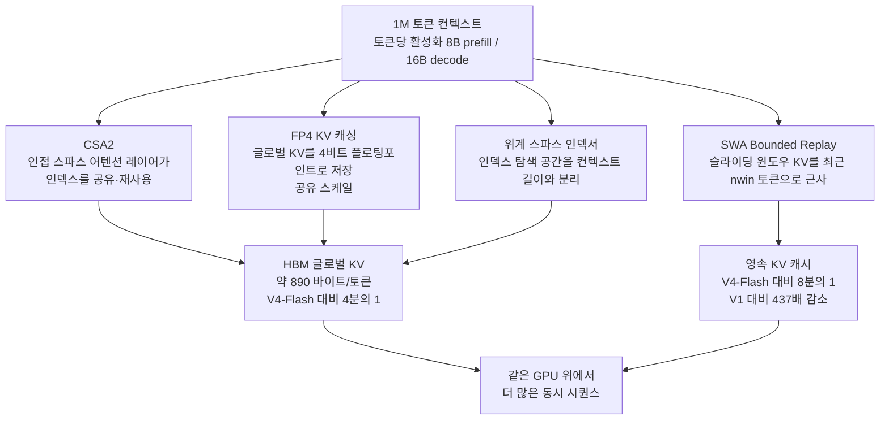

같은 모델 하나를 두 번 쓰면서도, 한쪽은 매 턴마다 자리가 없어 줄을 서고 다른 한쪽은 여유 있게 시퀀스를 채웁니다. 모델의 지능은 같은데 서빙 비용이 갈리는 원인은 대개 KV 캐시입니다. 컨텍스트가 길어질수록 KV가 먼저 천장이 되고 그 천장이 곧 동시성과 단가입니다.

DeepSeek가 9월 10일 내놓은 V4.1-Flash는 이 천장을 정면으로 다룹니다. 552B 파라미터 MoE 백본에 1M 토큰 컨텍스트를 얹되, 글로벌 KV 캐시를 전작 V4-Flash의 약 4분의 1로 줄였습니다. 코딩 벤치마크에서도 전작 대비 뚜렷하게 올렸고 MIT 라이선스로 가중치를 풀었습니다. 이 글은 그 KV 압축 설계 네 가지를 뜯어 보고 코딩 벤치마크 수치를 대조한 뒤, 이 모델이 서빙 팀의 계산서를 어디에서 다시 쓰게 하는지 정리합니다.

## 왜 읽어야 하나

1M 토큰급 장문 컨텍스트 모델을 서빙하거나, 에이전트 워크로드로 토큰 비용을 재계산해야 하는 엔지니어를 위한 글입니다.

핵심 결론은 하나입니다. V4.1-Flash의 헤드라인은 KV 캐시 압축입니다. 압축된 KV는 곧 같은 GPU 위의 동시성 상한과 토큰 단가를 결정합니다. 서빙 관점에서 이 모델은 "더 똑똑한 모델"이 아니라 "더 싸게 도는 모델"입니다.

## 무엇을 내놓았나

V4.1-Flash는 DeepSeek V4 시리즈의 더 효율적인 반복판입니다. 아키텍처는 캐주얼 엔코더-디코더(CED) 형식의 MoE로, 백본 파라미터는 552B입니다. 토큰당 활성화되는 파라미터는 프리필에서 8B, 디코드에서 16B입니다. 1M 토큰 컨텍스트를 지원하며 출력 토큰은 최대 384K까지 받을 수 있습니다. 비전 이해도 네이티브로 지원합니다.

릴리스와 함께 배포 정책도 바뀝니다. 기존 V4-Flash와 V4-Flash-Vision-Exp는 퇴역했고 DeepSeek는 9월 14일부터 V4-Pro 요청을 V4.1-Flash로 라우팅한다고 발표했습니다. V4.1-Pro가 나올 때까지 플래그십 트래픽을 이 모델이 받는다는 뜻입니다. 외부 보도에 따르면 V4.1-Flash가 V4-Pro보다 뛰어나다는 것이 그 이유입니다.

가중치는 MIT 라이선스로 공개됐습니다. 오픈웨이트 모델로서 라이선스 제한이 거의 없는 편이라, 서빙과 파인튜닝 모두에서 자유롭게 쓸 수 있습니다.

## KV 캐시 네 가지

압축 설계는 네 가지 기법의 조합입니다. 하나만으론 4분의 1에 닿지 못합니다.

첫째는 CSA2(Compressed Sparse Attention 2)의 크로스레이어 KV 재사용입니다. 스파스 어텐션 레이어들이 서로 인덱스를 공유하고 재사용합니다. 인접 레이어들이 같은 토큰 집합을 보는 경우가 많기 때문에, 레이어마다 따로 인덱스를 두는 것보다 한 번만 갖고 돌려 쓰는 편이 낫습니다. 인덱스가 KV 저장의 상당 부분을 차지하는 구조에서, 인덱스 공유는 저장량과 탐색 비용 둘 다에 걸립니다.

둘째는 FP4 KV 캐싱입니다. 글로벌 KV 캐시를 4비트 플로팅포인트(E2M1 계열, 공유 스케일)로 저장합니다. 16비트나 32비트로 두던 KV 값을 4비트로 압축하면, 저장 footprint가 그만큼 줄어듭니다. KV가 서빙의 병목이라는 전제에서, KV 자체의 비트수를 내리는 것은 가장 직접적인 칼입니다.

셋째는 SWA Bounded Replay입니다. 슬라이딩 윈도우 어텐션의 KV 상태를 근사하는데, 최근 nwin 토큰만 재생함으로써 처리합니다. 윈도우 밖의 KV를 온전히 보존하지 않고 다시 필요할 때 가까운 토큰만으로 재구성합니다. 저장과 재구성 비용 사이에서 저장 쪽에 무게를 둔 배치입니다.

넷째는 위계를 가진 스파스 인덱서입니다. 컨텍스트가 길어질수록 어텐션 인덱스 탐색 공간이 커지고 그 탐색 비용이 계산 비용을 흔들게 됩니다. 인덱서 위계를 두면 탐색 공간이 컨텍스트 길이와 비례하지 않게 제한됩니다. 1M 토큰에서 서빙 계산이 컨텍스트 성장에 발목 잡히지 않도록 하는 장치입니다.

이 네 가지를 합친 결과가 HBM 글로벌 KV 캐시 footprint입니다. 약 890 바이트/토큰으로, V4-Flash의 약 4분의 1입니다. SSD나 호스트 메모리에 두는 영속 KV 캐시 footprint는 V4-Flash의 약 8분의 1이며 DeepSeek V1 대비 437배 감소입니다.

KV 압축이 서빙 비용으로 바뀌는 경로를 그림으로 옮겼습니다. 네 기법이 footprint를 줄이고 footprint가 줄면 같은 HBM 위에 앉을 수 있는 시퀀스가 늘어납니다. 이 그림의 마지막 박스가 이번 릴리스가 서빙 팀에게 주는 실질입니다.

## 수치에서 나오는 것

코딩 벤치마크는 전작 대비 뚜렷합니다. V4-Flash 0731과 V4.1-Flash를 비교하면, 소프트웨어 엔지니어링 벤치마크 DeepSWE v1.1이 54.4에서 74.2로 19.8포인트 올랐고 Terminal-Bench 2.1이 82.7에서 90.6으로 7.9포인트 올랐습니다. CyberGym은 76.7에서 88.1로 11.4포인트, AutomationBench는 25.1에서 54.8로 29.7포인트 올랐습니다. Codeforces 레이팅은 3471, NL2Repo-Bench는 65.4, Vibe Code Bench는 84.74로 오픈웨이트 2위를 기록했습니다.

숫자 하나를 주의 깊게 볼 필요가 있습니다. Terminal-Bench 2.1에서 Vals AI는 74.53을 보고했습니다. DeepSeek 발표치 90.6과는 16포인트 이상 차이가 납니다. 평가 런이 다르기 때문일 수 있고 벤치마크 버전이나 설정의 미묘한 차이일 수 있습니다. 같은 벤치마크 이름이라도 발표자가 다르면 수치가 갈리는 것이 통례이므로, 이 모델의 Terminal-Bench 수치를 인용할 때는 어느 런의 것인지 반드시 붙여야 합니다.

벤치마크 전반의 패턴은 코딩과 터미널 작업에 집중돼 있습니다. DeepSWE·Terminal-Bench·CyberGym·AutomationBench·Vibe Code Bench·NL2Repo-Bench가 전부 그런 벤치마크입니다. 이번 릴리스가 겨냥하는 워크로드가 에이전틱 코딩임을 숫자가 그대로 말해 줍니다.

## 다키클라우드에 닿는 자리

Metis 쪽에서 이 모델이 주는 질문은 명확합니다. KV 캐시 footprint가 4분의 1로 줄면, 같은 B200이나 H200 위에 앉을 수 있는 동시 시퀀스가 몇 배가 되는가. 다키클라우드의 서빙 튜닝 실험에서 KV 캐시 용량은 포화 처리량을 결정하는 자원이었고, `max_num_seqs`를 올려도 KV가 천장을 만들면 그 천장은 KV에 귀속됩니다. KV를 4분의 1로 줄이는 모델은, 같은 엔진 설정에서도 그 천장을 4배 가까이 올릴 수 있는 모델입니다.

이것은 단가 문제입니다. 1M 토큰 컨텍스트를 서빙할 때, 토큰당 KV 저장량이 890 바이트면, 한 GPU가 동시에 몇 개의 장문 시퀀스를 감당하는지가 계산됩니다. 그 수치가 토큰당 원가로 바로 이어집니다. DeepSeek가 V4-Pro 트래픽을 V4.1-Flash로 라우팅하기로 한 이유도, 외부 보도대로 성능이 더 좋기 때문이지만, 내부적으로는 같은 용량으로 더 많은 요청을 처리할 수 있다는 계산이 함께 있을 것입니다.

Paxis 쪽에서도 닿는 자리가 있습니다. Paxis의 에이전트 워크로드는 본질적으로 장문 컨텍스트입니다. 도구가 여러 바퀴 돌 때마다 관찰이 쌓이고 컨텍스트는 턴과 함께 길어집니다. 1M 컨텍스트를 4분의 1 KV로 서빙할 수 있으면, 에이전트가 더 많은 턴을 돌리면서도 서빙 비용이 선형으로 튀지 않습니다. 에이전트 경제성은 모델의 토큰당 가격보다, 컨텍스트가 길어질 때 KV가 어떻게 자라는지로 갈립니다. V4.1-Flash는 그 성장 곡선을 눌러 주는 모델입니다.

두 렌즈가 같은 지점에서 만납니다. KV 압축은 서빙의 동시성과 토큰 단가를 바꾸는 축이고, 동시에 에이전트 워크로드의 장문 컨텍스트 비용을 바꾸는 축입니다. 이 두 축이 한 모델에 모여 있다는 것이, 이번 릴리스가 서빙 팀과 에이전트 팀 모두에게 닿는 이유입니다.

## 못 믿을 부분

우선 수치의 출처입니다. 이 글을 쓰는 시점에 V4.1-Flash는 Hugging Face 모델 카드와 DeepSeek 공식 뉴스 페이지에 기술 보고서가 올라와 있고, 별도 arXiv 페이지는 확인되지 않았습니다. 그래서 위의 벤치마크와 KV footprint 수치는 전부 보고서 보고값입니다. 재현으로 확인되지 않은 상태에서 인용하는 것이므로, 평가 구성에 따라 달라질 수 있습니다.

둘째는 FP4 KV의 품질 영향입니다. 4비트로 KV를 저장하면 손실이 생기는 것은 당연하고 보고서가 그 손실이 임계 이하임을 보여주지 않는 한, KV 압축이 실제 추론 품질에 어떤 영향을 주는지 서빙 팀이 직접 재야 합니다. 890 바이트/토큰이라는 숫자가 비용의 이득이라면, 그 대가로 지불하는 품질의 손실은 보고서에 없습니다.

셋째는 Terminal-Bench 2.1의 수치 불일치입니다. 90.6과 74.53은 같은 벤치마크의 두 런입니다. 어느 쪽을 믿을지는, 어느 런이 자기 워크로드와 더 가까운지를 서빙 팀이 판단해야 합니다.

넷째는 V4-Pro 라우팅의 의미입니다. 플래그십 트래픽을 V4.1-Flash로 돌린다는 것은, DeepSeek 내부에서 V4.1-Flash가 V4-Pro급 용량을 감당할 수 있다고 본 신호입니다. 하지만 그 용량 판단의 근거, 즉 동시성과 지연의 내부 수치는 공개되지 않았습니다. 외부에서는 "플래그십을 이 모델이 받는다"는 사실만 보이고 그 사후의 계산은 보이지 않습니다.

## 정리

모델이 똑똑해진 것도 맞지만, 이번 릴리스의 진짜 헤드라인은 KV 캐시입니다. 1M 토큰 컨텍스트를 4분의 1 크기의 KV로 서빙하게 된다는 말은, 같은 GPU 위에 더 많은 동시 시퀀스를 앉힐 수 있고 에이전트가 더 많은 턴을 돌리면서도 서빙 비용이 선형으로 튀지 않는다는 뜻입니다.

서빙 팀이 해야 할 일은 하나입니다. 지금 서빙하는 모델의 KV 캐시 footprint를 재고 V4.1-Flash의 890 바이트/토큰과 비교해 동시성 상한과 토큰 단가를 다시 계산하는 것입니다. KV 압축이 서빙의 병목이었다면, 이번 릴리스는 그 병목을 모델 쪽에서 풀어 준 것입니다. 엔진 설정으로만 KV 천장을 올려 왔던 팀이라면, 모델을 바꾸는 편이 더 싸질 수 있습니다.

---

- 모델 카드: [DeepSeek-V4.1-Flash](https://huggingface.co/deepseek-ai/DeepSeek-V4.1-Flash) (Hugging Face)
- DeepSeek 공식: [DeepSeek V4.1-Flash 뉴스](https://www.deepseek.com/news/deepseek-v4-1-flash/) · [API 문서 릴리스 노트](https://api-docs.deepseek.com/news/news260910/)
- V4 시리즈 기술 보고서: [DeepSeek-V4: Towards Highly Efficient Million-Token Context Intelligence](https://arxiv.org/abs/2606.19348) (arXiv:2606.19348)

*본문의 벤치마크와 KV footprint 수치는 DeepSeek 기술 보고서의 보고값이며 다키클라우드의 재현 측정값이 아닙니다.*
