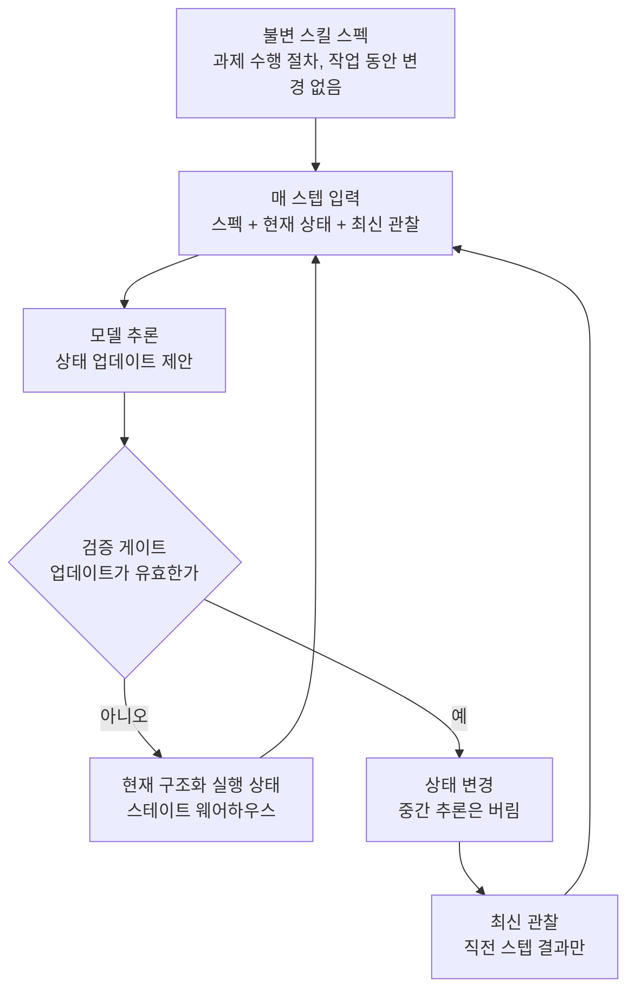

에이전트가 오래 일할수록 느려집니다. 같은 작업을 돌리는데도, 초반에 한 행동이 이력으로 쌓여 프롬프트가 커지고 그 커진 프롬프트가 다음 추론을 더 느리고 더 비싸게 만듭니다. 일이 오래될수록 지능은 그대로인데 비용만 올라가는 원인은 대개 모델이 아니라, 이력을 다루는 구조입니다.

Google LLC가 내놓은 SKILL.state는 이 구조를 정면으로 바꿉니다. 추가형 대화 이력을 버리고 변경 가능한 실행 상태로 대체합니다. 매 스텝에서 모델이 받는 입력은 불변 스킬 스펙, 현재 구조화 상태, 최신 관찰 세 가지뿐입니다. 이력을 쌓지 않으므로 프롬프트 크기가 턴 수와 독립이 되고 검증된 상태 업데이트 이후의 중간 추론은 버려집니다. 이 글은 그 메커니즘을 뜯어 보고, 벤치마크 수치를 대조한 뒤, 이 설계가 다키클라우드의 에이전트 플랫폼에 어디로 닿는지 정리합니다.

## 왜 읽어야 하나

장기 에이전트 런타임을 만들고 그 에이전트가 돌리는 토큰 비용을 재계산해야 하는 엔지니어를 위한 글입니다.

핵심 결론은 하나입니다. 에이전트의 프롬프트를 턴 수에서 분리하려면, 이력을 압축하는 수준을 넘어서 이력을 상태라는 다른 구조로 갈아끼워야 합니다. SKILL.state는 그 대체가 토큰 소모와 정확도 양쪽에서 이득을 내는지를, 통제된 테스트베드와 공개 벤치마크에서 확인합니다.

## 이력이 병이라면

대부분의 에이전트 런타임은 동작을 이력으로 기록합니다. 관찰, 행동, 추론이 순차로 쌓이고 다음 스텝에 그 이력 전체를 프롬프트에 넣습니다. 이 구조는 두 가지 비용이 동시에 커집니다.

첫째는 지연입니다. 이력이 길어질수록 매 스텝의 입력이 커지고 같은 모델이라도 처리 시간이 늘어납니다. 장기 작업일수록 후반으로 갈수록 느려지는 것이 이 구조의 운명입니다.

둘째는 컨텍스트 오염입니다. 이력에는 올바른 추론과 잘못된 추론이 섞여 있습니다. 초반에 한 번 잘못된 전제를 세우면, 그 전제가 이력에 남아서 뒤의 스텝마다 다시 읽히게 됩니다. 모델이 스스로 바로잡을 기회가 없는데, 그 전제는 매번 프롬프트에 다시 들어옵니다. 이 둘을 합하면 오래된 에이전트는 느리고 비싸고 같은 실수를 반복합니다.

기존 대응은 두 갈래였습니다. 하나는 이력을 그대로 두는 history-based 방식이고 다른 하나는 이력을 요약하거나 압축하는 compression-based 방식입니다. 둘 다 이력의 존재를 전제로 합니다. 요약이 잘 안 되면 오염된 전제가 요약에 남고 압축률이 낮으면 지연이 그대로입니다.

## 세 가지 입력, 하나의 상태

SKILL.state의 핵심은, 모델이 매 스텝에서 보는 것을 세 가지로 제한하는 것입니다.

첫째는 불변 스킬 스펙입니다. 이 과제를 수행하는 데 필요한 절차적 지식을 담는 스펙으로, 작업 동안 바뀌지 않습니다. 모델은 매 스텝마다 이 스펙을 읽는데, 스펙은 불변이므로 읽는 비용이 이력과 같이 턴과 함께 자라지 않습니다.

둘째는 현재 구조화 실행 상태입니다. 이 과제의 진행을 나타내는 명시적 상태 저장소, 곧 스테이트 웨어하우스입니다. 이 상태는 바뀌며 바뀌는 방식이 논문의 핵심입니다. 모델이 상태 업데이트를 제안하면 그 업데이트가 검증되고 검증된 이후의 상태만이 다음 스텝에 전달됩니다. 검증되지 않은 업데이트는 적용되지 않습니다.

셋째는 최신 관찰입니다. 직전 스텝에서 환경이나 도구가 돌려준 결과입니다. 지난 관찰은 상태에 반영됐거나 버려졌으므로, 다시 프롬프트에 들어오지 않습니다.

이 세 가지를 합한 프롬프트의 크기는 턴 수와 독립입니다. 1스텝이든 100스텝이든, 모델이 보는 것은 스펙과 현재 상태와 최신 관찰입니다. 이 구조에서 중요한 것은 상태 업데이트가 검증된다는 점입니다. 모델의 제안은 그대로 적용되지 않고 검증 게이트를 통과한 상태만이 다음 스텝에 전달됩니다. 이 검증이 컨텍스트 오염을 막는 장치입니다.

이 그림의 핵심은, 검증 게이트가 통과한 상태만 다음 스텝으로 간다는 점입니다. 통과하지 못한 업데이트는 상태에 반영되지 않고 모델의 중간 추론은 상태 업데이트 이후에 버려집니다. 이 둘을 합하면 과제의 진행을 나타내는 것이 이력에서 상태로 바뀝니다.

## 수치에서 나오는 것

논문은 세 가지 시험장에서 확인합니다. SkillExecBench는 통제된 진단용 테스트베드로, 창고 관리(Warehouse Management) 환경을 포함합니다. 100스텝 과제를 돌리면서 이력 기반 방식과 SKILL.state의 프롬프트 크기와 토큰 소모를 비교합니다.

공개 벤치마크는 InterCode CTF와 Sierra τ-Bench입니다. 둘 다 장기 에이전트 과제로, 도구가 여러 바퀴 돌아가며 관찰이 쌓이는 구조입니다.

논문 보고에 따르면, SKILL.state는 history-based 방식과 compression-based 방식 모두를 이깁니다. 프롬프트 크기가 턴 수와 독립이 되면서 100스텝 과제의 누적 토큰 소모가 크게 줄고 정확도도 오릅니다. 토큰 절감 폭은 2차 보도에서 약 16배로 집계됩니다. 이 숫자는 2차 소스가 정리한 값이지 논문 원문의 보고값이 아니므로, 인용할 때는 그 사실을 붙여야 합니다.

패턴이 중요한 이유를 말하면, 토큰 절감과 정확도 상승이 같은 방향에서 나온다는 점입니다. 이력을 압축하면 보통 하나를 얻는 대신 다른 것을 잃습니다. 압축률이 오르면 오염된 전제가 빠질 수 있지만, 동시에 올바른 전제도 빠질 수 있습니다. SKILL.state는 이 전후를 유지합니다. 검증된 상태에 올바른 전제만 남고 잘못된 전제는 검증 게이트에서 막힙니다. 그래서 토큰이 줄면서도 정확도가 오릅니다.

## 다키클라우드에 닿는 자리

Paxis 쪽에서 이 논문이 주는 질문은, 실행 상태를 어디에 두느냐입니다. Paxis는 에이전트의 스킬과 도구와 정책과 감사 기록을 일급 자원으로 다루는 제어 평면입니다. SKILL.state가 제안하는 실행 상태는, 바로 그 일급 자원 중 하나입니다.

Paxis 안에는 이미 비슷한 구조가 있습니다. 에이전트가 과제를 수행할 때, 그 진행을 나타내는 상태가 존재하고 그 상태의 변경은 정책 게이트를 통과해야 적용됩니다. SKILL.state는 이 구조를 논문이라는 형태로 일반화해 주고 그 일반화가 토큰 소모와 정확도에서 성립했음을 보입니다.

특히 두 가지가 Paxis의 운영 철학과 닿습니다. 하나는 검증 게이트입니다. 모델이 제안한 상태 업데이트를 그대로 적용하지 않고 검증된 것만 다음 스텝에 전달하는 방식은, Paxis가 정책 게이트와 독립 검증으로 행동을 통과시키는 것과 같은 맥락입니다. 모델의 자기 보고를 믿지 않는다는 원칙이, 상태 변경에도 적용되는 것입니다.

다른 하나는 감사 기록입니다. Paxis의 감사 로그는 수용한 행동만 남기지 않습니다. 어떤 상태 변경이 왜 막혔는지도 남깁니다. SKILL.state의 검증 게이트가 통과하지 못한 업데이트는 상태에 반영되지 않지만, 그 기각 사실은 감사 기록으로 남습니다. 실패한 상태 변경이 다음 판단의 근거가 되는 구조입니다.

Metis 쪽에서도 하나의 실마리를 줍니다. Paxis의 에이전트가 Metis에서 서빙될 때, 매 스텝의 프롬프트 크기는 곧 KV 캐시 점유입니다. SKILL.state가 프롬프트를 턴 수에서 분리하면, 에이전트가 오래 돌리면서도 KV 점유가 선형으로 자라지 않습니다. 장기 에이전트 워크로드의 서빙 비용을 런타임 구조에서 줄이는 것입니다.

WikiSkill 글과 비교하면, 이 두 논문은 같은 문제의 다른 층을 다룹니다. WikiSkill은 에피소드 간에 경험으로 쌓이는 지속형 위키를 다루고 SKILL.state는 에피소드 안에서 과제의 진행을 나타내는 실행 상태를 다룹니다. 전자는 에이전트가 잊지 않도록 하고 후자는 에이전트가 커지지 않도록 합니다. 둘을 합하면 장기 에이전트의 기억 문제를 에피소드 간과 에피소드 안으로 나눌 수 있습니다.

## 못 믿을 부분

우선 검증 게이트의 비용입니다. 매 스텝의 상태 업데이트를 검증하려면, 검증 그 자체에 비용이 듭니다. 검증이 모델 추론을 한 번 더 돌리는 구조라면, 토큰 절감의 일부가 검증에 소모됩니다. 논문은 검증의 구조를 자세히 보여주지 않으므로, 검증 비용이 전체 절감의 몇 퍼센트를 차지하는지는 알 수 없습니다.

둘째는 중간 추론의 손실입니다. 상태 업데이트 이후의 중간 추론은 버려집니다. 이 버림이 컨텍스트 오염을 막는 장치이지만, 동시에 디버깅과 감사의 대상도 사라집니다. 과제가 실패했을 때, 왜 실패했는지를 추적하려면 상태 변경 기록만으로는 부족합니다. 각 스텝에서 모델이 무엇을 추론했는지도 필요합니다. SKILL.state는 이 추론을 버리므로, 실패 조사를 상태 변경 로그로만 해야 합니다.

셋째는 토큰 절감 숫자의 출처입니다. 약 16배라는 숫자는 2차 보도의 정리입니다. 논문 자체의 보고값과 일치하는지는, 논문 원문을 직접 확인해야 합니다. 이 글에서는 2차 소스의 수치임을 명시했습니다.

넷째는 시험장의 범위입니다. SkillExecBench는 통제된 테스트베드이고 창고 관리 환경을 포함합니다. 공개 벤치마크도 장기 에이전트 과제이지만, 코딩이나 운영 자동화 같은 실제 프로덕션 워크로드와는 거리가 있습니다. 토큰 절감과 정확도 상승이 그런 워크로드에서도 같은 폭으로 성립하는지는, 이 논문으로는 답이 어렵습니다.

## 정리

에이전트가 오래 일할수록 커지는 것은 이력의 크기입니다. SKILL.state는 이 격차를 구조에서 제거합니다. 이력을 쌓지 않고 상태라고 하는 다른 구조로 과제의 진행을 나타냅니다. 매 스텝에서 모델이 보는 것은 불변 스펙, 현재 상태, 최신 관찰 세 가지뿐이고 검증 게이트가 통과한 상태만 다음 스텝으로 갑니다.

Paxis에 이 논문이 주는 질문은 하나입니다. 에이전트의 실행 상태를, 이력으로 쌓고 있는가, 아니면 검증된 상태로 바꾸고 있는가. 이 둘을 구별하는 것은, 장기 에이전트의 토큰 비용을 재계산하는 분기점입니다.

---

- 논문 원문: [SKILL.state: Scalable Long-Horizon Agent Skills](https://arxiv.org/abs/2608.26263) (arXiv:2608.26263, Google LLC, 2026-08)
- 2차 참고: [Daily.dev](https://daily.dev/posts/google-paper-structured-state-instead-of-full-history-cuts-agent-token-use-16x-fm42aw1fg) · [DAIR.AI Academy](https://academy.dair.ai/papers/explicit-execution-state-replaces-append-only-history-2608.26263)

*본문의 토큰 절감 폭(약 16배)은 2차 보도의 정리이며 논문 원문의 보고값과 일치하는지는 원문 확인이 필요합니다. 나머지 수치는 논문 보고값이며 다키클라우드의 측정값이 아닙니다.*
