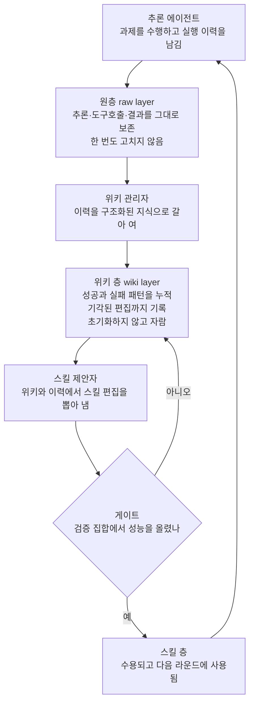

에이전트가 한 문제를 푼 뒤, 그 과정을 통째로 잊습니다. 잘한 방법은 다음 세션에 그대로 사라지고, 어제의 실수는 오늘 되풀이됩니다. 모델은 똑같은데도 일을 할수록 느려지고 비싸지고 정확도는 오르지 않는다는 불평의 원인은 대개 모델 쪽이 아닙니다. 경험을 다루는 방식이 문제입니다.

Google Research가 내놓은 WikiSkill은 이 문제를 한 가지 구조로 풉니다. 실행 이력을 버리지 않고, 한 번도 초기화하지 않는 지속형 위키(wiki)로 쌓아 두고, 그 위키 위에서 에이전트의 스킬을 스스로 진화시키게 만드는 것입니다. 이 글은 그 구조와, 다섯 벤치마크에서 나온 결과를, 그리고 다키클라우드의 에이전트 플랫폼에 어디로 닿는지를 정리합니다.

*글의 핵심 개념을 형상화했습니다. 실행 이력이 한 번도 초기화하지 않는 위키로 쌓이고, 그 위키 위에서 스킬이 진화하는 구조입니다.*

## 왜 읽어야 하나

에이전트 스킬을 만들고, 그 스킬이 운영을 통해 스스로 좋아지도록 설계하는 팀을 위한 글입니다.

핵심 결론은 하나입니다. 실행 이력을 버리지 않고 지속형 위키로 쌓아, 그 위키 위에서 스킬을 진화시키는 구조는 세 가지 성질을 동시에 냅니다. 스킬 없는 에이전트보다 뚜렷이 성능을 올리고, 모델이 클수록 그 이득이 커지며, 진화한 스킬은 모델 바깥으로까지 옮겨갑니다. 이 세 가지는 "컨텍스트를 줄여서"가 아니라 "기억을 자원으로 바꿔서" 얻는 것이기 때문입니다.

## 잊어버리는 것이 병이라면

대부분의 에이전트는 한 과제를 다 마치면 그 과정에서 배운 것을 흘려보냅니다. 최적화 이력에는 수많은 성공과 실패가 섞여 있는데, 다음 과제로 갈 때 그 이력은 사라지고 스킬만 남습니다. 그래서 같은 실수를 매번 처음부터 다시 배우고, 잘된 패턴도 다음에 그대로 재사용하지 못합니다.

WikiSkill이 짚는 바로 그 지점이 여기입니다. 이력을 버리는 순간, 경험에서 배운 것이 시스템에 누적되지 못합니다. 논문은 이 누적의 부재를 해결하려고, 실행 이력을 영구히 보존하면서 동시에 스킬을 갱신하는 세 층 구조를 제안합니다.

## 세 층, 네 역할

구조는 세 층으로 나뉩니다.

첫 층은 원층(raw layer)입니다. 각 실행의 온전한 이력, 곧 추론과 도구 호출과 결과와 최종 답을 한 번도 고치지 않는 그대로의 기록으로 저장합니다. 일기처럼, 뒤집어 쓰지 않고 그저 쌓아 두는 층입니다.

두 층이 핵심입니다. 위키 층이 이 논문의 심장이고, 원층의 흩어진 이력을 구조화된 지식으로 갈아 엽니다. 어떤 실패 패턴이 반복되는지, 어떤 전략이 통했는지를 문서로 남기고, 그 위키에는 수용된 편집뿐 아니라 기각된 편집도 함께 적어 둡니다. 잘 안 된 것까지 기록하는 것이, 같은 실수를 반복하지 않는 비결입니다. 위키는 한 번도 초기화하지 않고, 과제와 모델이 바뀌어도 그대로 유지되며, 시간이 지날수록 자라는 층입니다.

세 층은 스킬 층입니다. 에이전트가 실제로 읽는, 재사용 가능한 스킬 파일입니다. 위키와 원층 이력을 근거로 갱신되고, 검증 집합에서 성능을 올리지 않으면 되돌립니다.

이 세 층을 돌리는 역할은 넷입니다. 추론 에이전트가 과제를 수행하고, 위키 관리자가 이력을 위키로 정리하고, 스킬 제안자가 위키와 이력에서 스킬 편집을 뽑아 내고, 게이트가 그 편집이 성능을 실제로 올린 것만 남깁니다. 남기지 못하면 기각된 편집까지 위키에 기록하고, 다음 라운드로 넘깁니다.

여기서 한 가지가 눈에 띕니다. 기각된 편집이 스킬 층으로 가지 않고 위키 층으로 돌아가는 것입니다. 실패가 버려지지 않고 다음 제안자의 판단 근거가 됩니다. 이 회로가 "스킬이 스스로 진화한다"는 말의 실체입니다.

## 어떤 결과가 나왔나

논문은 다섯 벤치마크로 확인합니다. 수학 추론(LiveMath), 웹 검색(SealQA), 스프레드시트 조작(Spreadsheet), 문장 컨텍스트 문서 질의응답(OfficeQA), 대화형 물리 환경 작업(ALFWorld)입니다.

주 모델 Gemini-3.5-Flash에서 다섯 벤치마크의 평균 정확도는 스킬 없는 에이전트 49.5, 가장 강한 경쟁 스킬 진화 방법 56.1, WikiSkill 68.1이었습니다. 즉 경쟁 방법보다 12포인트, 스킬이 없는 상태보다 18.6포인트 높습니다.

벤치마크별로 보면 차이가 뚜렷합니다. 수학 추론은 33.0에서 72.6으로, 스프레드시트 조작은 50.5에서 76.6으로 올라갑니다.

모델 크기에 따른 이득도 재밌습니다. Qwen 계열에서 스킬 진화가 주는 평균 개선은 4B에서 12.3포인트, 9B에서 17.5포인트, 27B에서 23.9포인트였습니다. 즉 모델이 클수록 진화한 스킬의 효용이 커집니다. 더 인상적인 대목은 작은 모델이 큰 모델을 이기는 자리입니다. Qwen 9B에 WikiSkill을 붙이면 47.4, 스킬 없는 Qwen 27B는 39.4입니다. 스킬이 모델 크기보다 먼저 성능을 올린 셈입니다.

논문은 위키의 누적 자체가 결정 요인임을 확인하기 위해 축소 실험(ablation)도 둡니다. 지속형 위키의 축적을 빼면 이득이 크게 줄어든다는 것입니다. 그래서 "기억을 자원으로 바꾸는 것"이 성립 조건이 아니라 핵심 기전입니다.

위 수치는 전부 논문 보고값이며, 다키클라우드의 재현 측정이 아닙니다.

## 다키클라우드에 닿는 자리

이 논문은 다키클라우드의 에이전트 플랫폼 Paxis가 지향하는 구조와 정면으로 겹칩니다.

Paxis는 스킬과 도구와 정책과 감사 기록을 일급 자원으로 다루는 에이전트 제어 평면입니다. Paxis 안에는 이미 비슷한 세 층이 있습니다. 실행 이력을 그대로 저장하는 원층, 그 이력을 정리해서 누적하는 지식 위키, 그리고 그 위키 위에서 스스로 갱신되는 스킬입니다. WikiSkill은 이 세 층의 배치를 논문이라는 형태로 일반화해 주고, 그 일반화가 다섯 벤치마크에서 성립했음을 보여 줍니다.

그 중에서도 두 가지가 Paxis의 운영 철학에 그대로 부합합니다. 하나는 기각된 편집까지 기록해 둔다는 것입니다. Paxis의 감사 기록은 수용한 행동만 남기지 않고, 어떤 시도가 왜 막혔는지도 남깁니다. 실패가 다음 판단의 근거가 되는 구조를, 논문은 성능 결과로 뒷받침합니다. 다른 하나는 스킬 편집을 게이트가 판정한다는 것입니다. 모델의 자기 보고가 아니라 검증 집합에서 실제 성능을 올려야만 수용하는 방식은, Paxis가 정책 게이트와 독립 검증으로 행동을 통과시키는 것과 같은 맥락입니다.

Metis 쪽에도 하나의 실마리를 줍니다. 스킬 진화가 모델 스케일링과 보완적이라는 사실은, 모델 티어와 스킬 품질을 함께 보는 비용 라우팅에 직접 걸립니다. 같은 비용이면 스킬이 잘 진화한 작은 모델이, 스킬 없는 큰 모델을 이길 수 있다는 것은 토큰 경제학에서 중요한 시그널입니다.

## 못 믿을 부분

우선 코드입니다. 이 글을 쓰는 시점에 공개된 실행 코드를 찾지 못했습니다. 그래서 위의 수치는 전부 논문 보고값입니다. 재현으로 확인되지 않은 상태에서 인용하는 것이기 때문에, 벤치마크 구성과 평가 코드에 따라 달라질 수 있습니다.

두 번째는 벤치마크 범위입니다. 다섯 가지 과제가 모두 단일 도메인에 가깝습니다. 수학, 웹 검색, 스프레드시트, 문서 질의응답, 물리 환경 작업입니다. 코드 작성이나 운영 자동화 같은 긴 사슬 작업은 이번 시험장에 없습니다. 스킬 진화가 그런 사슬에서도 같은 이득을 주는지, 이 논문으로는 답이 어렵습니다.

세 번째는 위키의 크기입니다. 위키는 한 번도 초기화하지 않고 자랍니다. 시간이 지날수록 위키가 커지면, 검색과 주입 비용도 함께 커집니다. 논문은 누적의 이점을 보여주지만, 누적의 상한과 압축 전략은 아직 명확히 답하지 않습니다.

네 번째는 게이트의 품질입니다. 스킬 편집의 수용을 검증 집합이 판정합니다. 검증 집합이 과제에 덜 닿으면, 위키는 잘못된 편집까지 누적할 수 있습니다. 그래서 게이트의 설계를 "성능을 실제로 재는 것"으로 한정하지 않고, "진화한 스킬이 다음 과제에서 실제로 도움이 되는지"로 넓히는 것이 중요합니다.

다섯 번째는 이득의 분포입니다. 스킬 진화의 효과가 모델이 클수록 커집니다. 이는 반대로, 작은 모델이 얻는 절대 이득이 상대적으로 작다는 뜻이기도 합니다. 4B의 12.3포인트는 27B의 23.9포인트보다 반쯤 아래입니다. 작은 모델로 스킬 진화를 대량으로 돌린다고 해서, 같은 비용 대비 동일한 성능이 나온다고 단정하기 어렵습니다.

## 정리

옮길 수 있는 것은 숫자가 아니라 구조입니다. 에이전트가 길어질 때 무너지는 자리는 모델의 지능이 아니라, 경험을 다루는 그릇입니다. 실행 이력을 버리지 않고, 그 위에 한 번도 초기화하지 않는 위키를 두면, 스킬은 다음 라운드에서 더 좋아집니다. 잘 안 된 것까지 적어 두고, 게이트가 실제 성능만 남기도록 하면, 경험은 자원으로 바뀝니다.

Paxis에 이 논문이 주는 질문은 하나입니다. 에이전트가 남기는 이력이, 다음 스킬을 만드는 자원으로까지 연결되고 있는가. 원층을 쌓아 두는 것과, 그 원층을 위키로 갈아 엎는 것과, 그 위키에서 스킬을 진화시키는 것, 이 세 단계를 시스템이 명시적으로 갖는 것이, 긴 작업을 무인으로 돌리는 에이전트 플랫폼의 성숙도를 가르는 분기점입니다.

---

- 논문 원문: [WikiSkill: Compiling Agent Experience into a Persistent Wiki for Skill Evolution](https://arxiv.org/abs/2608.27454) (arXiv:2608.27454, Google Research, 2026-08-27)
- 2차 참고: [The Decoder](https://the-decoder.com/google-gives-ai-agents-their-own-wiki-so-they-can-learn-from-mistakes-and-successes/) · [DAIR.AI](https://academy.dair.ai/papers/wikiskill-compiles-agent-experience-into-a-persistent-wiki-2608.27454)

*본문의 백분율은 한 자리까지 반올림했고, 정확한 값은 표와 캡션에 남겼습니다. 모든 수치는 논문 보고값이며 다키클라우드의 측정값이 아닙니다.*
