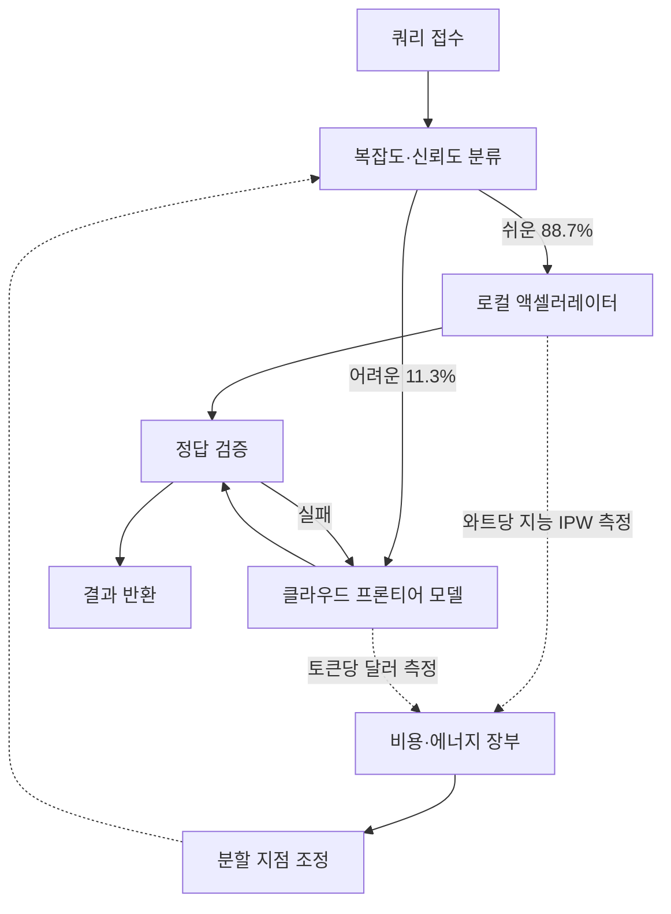

GPU 추론 인프라를 운영하거나 온프레미스 AI 환경을 계획 중인 분이라면, 이 논문의 핵심 숫자 하나만이라도 읽어두셔야 합니다. 쿼리의 60~80%를 로컬 모델로 처리하고 나머지만 클라우드에 보내는 하이브리드 라우팅이, 에너지와 비용 모두를 60~80% 줄인다는 실측입니다.

*같은 에너지를 얼마나 유용한 추론으로 바꾸는지를 재는 IPW 개념을 형상화했습니다.*

> 📄 **심층 리뷰 전문(DOCX)**: 이 논문의 상세 피어리뷰를 [Google Drive에서 다운로드](#)할 수 있습니다.

## 왜 읽어야 하나

이 글은 K8s 기반 추론 플랫폼을 운영하거나 온프레미스 AI 인프라를 설계하는 엔지니어, 그리고 서빙 비용과 전력 효율이 결정 기준인 팀이 읽어야 합니다. 읽는 이유는 하나입니다. "어떤 쿼리를 어디에 보낼 것인가"라는 라우팅 결정이 이제는 선호의 문제가 아니라, 숫자로 비교 가능한 문제가 되었기 때문입니다.

논문이 주는 답은 이렇게 정리됩니다. 로컬 추론의 효율(IPW, 1와트당 지능)은 2023년에서 2025년 사이에 5.3배 좋아졌고, 지금의 로컬 시스템은 단일턴 대화·추론 쿼리의 88.7%를 정확히 처리합니다. 나머지 가장 어려운 구간은 여전히 프론티어 클라우드가 우세하며, 이 둘을 복잡도로 나누어 라우팅하는 하이브리드 구성이 클라우드 단독 대비 에너지·컴퓨트·비용을 60~80% 절감합니다.

## 개요

[Intelligence per Watt](https://arxiv.org/abs/2511.07885)(arXiv 2511.07885)은 스탠퍼드 대학의 Jon Saad-Falcon, Avanika Narayan 등이 Together AI와 함께 발표한 연구입니다. 2025년 11월 첫 공개 후 여러 버전으로 갱신되며, 2026년 9월 중순 X에서 다시 주목받았습니다.

연구의 동기는 단순합니다. 자원 제약, 에너지 비용, 프라이버시라는 세 가지 이유로 AI 워크로드를 중앙화 클라우드에서 로컬 하드웨어(랩톱, 워크스테이션)로 옮기는 것이 비칠 만큼 경제적이 되었는지, 지금까지는 정량적으로 답이 없었습니다. 각 제조사와 벤더가 제시하는 숫자(토큰 속도, FLOPS, 전력 소비)는 서로 다른 축을 재고 있어서, "내 워크로드를 로컬로 옮기면 실제로 얼마나 절약되는가"를 하나로 묶어줄 지표가 부재했던 것입니다.

## 이 논문이 무엇을 재는가: IPW

논문의 중심은 IPW(Intelligence Per Watt)라는 지표입니다. 정의는 한 줄입니다.

> IPW = 모델이 전달하는 태스크 정확도 ÷ 그것을 돌리는 액셀러레이터의 전력 소비

기존 지표가 각각 다른 축을 보았던 것(IPW의 정확도 축, tok/s의 속도 축, $/1M의 가격 축, FLOPS의 연산량 축)과 달리, IPW는 "모델의 능력"과 "하드웨어의 효율"을 하나의 숫자로 만납니다. 그래서 같은 모델을 iPhone 16 Pro, 워크스테이션 GPU, 클라우드 액셀러레이터에 올려 돌리면, 각 장치의 IPW를 나란히 비교할 수 있습니다. 정확도가 같을 때 와트가 작은 쪽이 이기는 구조입니다.

이 지표를 통해 논문은 세 가지 질문을 답합니다.

1. 지금의 로컬 하드웨어가 어떤 쿼리를 얼마나 잘 처리하는가
2. 로컬과 클라우드의 효율 격차는 얼마이며, 어디에서 뒤집히는가
3. 둘을 섞어 쓰는 하이브리드 라우팅이 실제로 얼마나 아끼는가

## 평가 설계: 로컬 LLM 20여 종, 하드웨어 8종, 100만 건의 실제 쿼리

논문이 설득력 있는 이유는 평가가 "벤치마크 스탠다드"가 아니라 실제 사용 패턴이기 때문입니다.

- **모델**: 로컬에서 돌릴 수 있는 LLM 20여 종. 크기와 정밀도(FP16, FP8, FP4)가 서로 다른 세대 조합
- **하드웨어**: 8종. 스마트폰(특히 iPhone 16 Pro)부터 워크스테이션 GPU까지 로컬 액셀러레이터 스펙트럼
- **쿼리**: 약 100만 건의 실제 단일턴 대화·추론 질문. 합성 프롬프트가 아니라 실사용 분포
- **측정**: 쿼리당 정확도와 전력 소비를 함께 기록해 IPW 산출

"100만 건"이라는 규모가 중요한 이유는, 소수 특수 워크로드가 아니라 분포 전체의 평균과 꼬리를 동시에 볼 수 있기 때문입니다.

## 주요 결과

### 단일턴의 88.7%는 로컬이 정확히 처리한다

지금의 로컬 LLM 구성은 단일턴 대화와 추론 쿼리의 **88.7%**를 정확하게 답합니다. 2023년 당시 이 비율은 **23.2%**에 불과했고, 2025년에는 **71.3%**까지 올랐습니다. 두 해 사이에 IPW 자체가 **5.3배** 좋아졌는데, 그 기여는 모델 개선이 **3.1배**, 하드웨어 개선이 **1.7배**로 나뉩니다.

즉, 로컬의 성장은 "더 강한 하드웨어"보다는 "더 똑똑한 모델"이 주도했습니다. 같은 칩 위에서 최신 소형 모델로 갈아타는 것만으로 효율이 크게 오릅니다.

### 스마트폰이 워크스테이션 GPU의 7배

같은 모델, 같은 정밀도로 돌릴 때 **iPhone 16 Pro의 IPW가 워크스테이션 GPU 대비 약 7배** 높게 측정됐습니다. 데이터센터용 GPU가 절대 성능에서 앞서는 것은 분명하지만, "1와트당 뽑아내는 지능"이라는 효율 축에서는 소비자 칩이 압도합니다. 전력 효율 설계에 최적화된 모바일 SoC와, 고부하 정격 전력을 전제하는 데이터센터 GPU의 차원이 다른 구조가 그대로 드러납니다.

### FP4 양자화: 에너지 3~3.5배 절감, 정확도는 1단계당 약 2.5%p

정밀도를 FP16에서 FP4로 낮추면 추론 에너지가 **3~3.5배** 줄고, 정확도 손실은 정밀도 단계마다 **약 2.5%p**입니다. 주목할 점은, FP4로 양자화한 더 큰 모델이 FP16의 더 작은 모델보다 IPW가 높은 경우가 있었다는 것입니다. "작은 모델을 그대로 돌린다"보다 "큰 모델을 얇게 양자화해 돌린다"가 효율적으로 이기는 구간이 존재하는 셈입니다.

### 하이브리드 라우팅: 60~80% 절감

쿼리를 복잡도로 분류해, 쉬운 것은 로컬·어려운 것은 클라우드로 보내는 하이브리드 구성이, 클라우드 단독 대비 **에너지·컴퓨트·비용을 60~80% 절감**합니다. 절감의 구조는 명확합니다. 전체 쿼리의 88.7%가 로컬에서 소비하는 와트만으로 해결되고, 클라우드는 가장 어려운 11.3%만 담당하므로 클라우드 청구량이 그만큼 줄어듭니다.

### 가장 어려운 95%는 아직 로컬이 못 푼다

한계도 정량적으로 줍니다. 추론 구간에서 가장 어려운 약 **95%**는 로컬 모델로 미해결 상태로 남았습니다. 다단계 추론, 복잡한 아키텍처 이해, 긴 컨텍스트 디버깅 같은 작업은 여전히 프론티어 클라우드가 우세합니다. 이 숫자가 곧 하이브리드 라우팅의 분할 지점입니다. 로컬은 88.7%를 먹고, 클라우드가 꼬리를 먹는 구조입니다.

## 하이브리드 라우팅 아키텍처

논문의 절감은 "로컬이 좋다"가 아니라 "분할 지점을 숫자로 정할 수 있다"에서 나옵니다. 구조를 그림으로 보면 다음과 같습니다.

핵심은 두 축의 장부가 하나라는 것입니다. 로컬은 와트(전력), 클라우드는 토큰(청구)으로 비용이 나므로, IPW가 공통 환율 역할을 합니다. 분할 지점을 "감"이 아니라 이 장부로 조정할 때, 절감률이 60~80% 구간에서 유지됩니다.

## ThakiCloud 제품 적용 시사점

이 논문은 다키클라우드의 세 제품에 직접 닿습니다.

**Metis (토큰 팩토리)**. 지금의 서빙 라우팅은 지연과 토큰당 달러로 쿼리를 배정합니다. IPW는 그 위에 "와트" 축을 추가하는 근거가 됩니다. 온프레미스 환경의 전용 엔드포인트와 클라우드 서버리스를 함께 쓰는 고객에게, 쿼리 분포 기준의 하이브리드 배정은 이 논문의 60~80% 절감과 동일한 구조입니다. 라우팅 벤치마크에 IPW 축을 넣는 것이 다음 단계입니다.

**Aegis (온프레미스)**. 온프레미스 제안의 가장 흔한 질문은 "외부로 못 보내는 데이터인데, 모든 추론을 내부에서 감당할 수 있나"입니다. 이 논문은 그 질문에 정량 답을 줍니다. 단일턴 워크로드의 88.7%는 내부에서 처리 가능하고, 나머지 꼬리만 예외적으로 외부로. "전부 온프레미스"가 아니라 "88.7% 온프레미스 + 하이브리드 에그레스"가 설계 가능한 라인입니다. 가장 어려운 95% 미해결이라는 한계도 함께 제시해야 하며, 그것이 오히려 신뢰를 줍니다.

**Maxis (양자화·증류)**. FP4가 에너지 3~3.5배 절감, 정확도 약 2.5%p/단계를 준다는 실측은, NVFP4 양자화 파이프라인의 정확도 손실 기대치를 교차 검증할 기준점입니다. "큰 모델을 얇게"가 "작은 모델을 그대로"를 이기는 구간이 존재한다는 결과는, 모델 선택과 양자화 깊이를 함께 최적화해야 함을 시사합니다.

## 한계 및 반론

로컬 하드웨어에서 잰 IPW를 데이터센터 서빙에 그대로 적용하면 안 됩니다. 이 논문은 소비자 칩의 효율 우위를 보였고, 데이터센터 GPU는 절대 처리량에서 여전히 앞서며, 멀티테넌트·대동시성 워크로드의 에너지 회계는 이 논문이 재는 단위(쿼리당)와 다릅니다.

88.7%는 단일턴 기준입니다. 에이전트 워크로드의 실질 비용은 다단계 툴 호출과 긴 컨텍스트 유지에서 나오는데, 바로 그 구간이 로컬의 약점(어려운 95% 미해결)과 겹칩니다. "에이전트 전체를 로컬로"라는 외삽은 이 데이터가 지지하지 않습니다.

전력 측정 방법론에도 주의가 필요합니다. 아이들 베이스라인을 언제 잰지, 부하를 어떻게 고정했는지에 따라 같은 하드웨어의 IPW가 크게 흔들릴 수 있습니다. 다키클라우드의 백서에서도 토큰당 에너지 측정 시 동일한 함정(베이스라인 시점)에 걸렸던 경험이 있어, 인용 시 측정 전제 확인이 필요합니다.

마지막으로, 60~80% 절감은 클라우드가 토큰 과금이고 로컬이 전력 과금이라는 전제에서 성립합니다. 로컬 인프라의 감가상각, 설비 전력, 운용 인건비를 장부에 포함하면 절감률은 이보다 낮아집니다. 절감 폭을 인용할 때는 환산 전제를 함께 보여야 합니다.

## 정리

이 논문이 실무자에게 주는 것은 지표 하나가 아니라, 라우팅 결정의 기준선을 한 차원 올리는 숫자 묶음입니다. 로컬이 단일턴의 88.7%를 처리하고, 가장 어려운 95%는 여전히 클라우드가 푼다는 양 끝의 실측, 그 사이의 분할 지점을 IPW 장부로 조정하면 60~80%의 절감이 나온다는 구조.

다음 행동을 두 가지만 남깁니다. 서빙·라우팅 벤치마크에 토큰당 달러 옆에 와트당 지능(IPW) 축을 추가하고, 온프레미스 제안서에 "88.7% 내부 처리 + 하이브리드 에그레스"라는 분할 지점을 명시하십시오. 로컬과 클라우드의 비교가 "느리다/싸다"의 수평선이 아니라, 측정 가능한 분할 지점의 문제로 바뀌었습니다.

## 출처

- [Intelligence per Watt (arXiv 2511.07885)](https://arxiv.org/abs/2511.07885)
- [Stanford Scaling Intelligence 프로젝트 페이지](https://scalingintelligence.stanford.edu/pubs/ipw/)
- [DeepLearning.AI The Batch: 스탠퍼드·Together AI 리서처들의 엣지 모델 IPW 분석](https://www.deeplearning.ai/the-batch/stanford-and-together-ai-researchers-chart-edge-models-performance-in-intelligence-per-watt)
- [논문의 공식 사이트](https://www.intelligence-per-watt.ai/)
- 최초 공유: [Rohan Paul (@rohanpaul_ai)의 X 트윗](https://x.com/hjguyhan/status/2098745530331586869)

> 📄 **심층 리뷰 전문(DOCX)**: 이 논문의 상세 피어리뷰를 [Google Drive에서 다운로드](#)할 수 있습니다.
