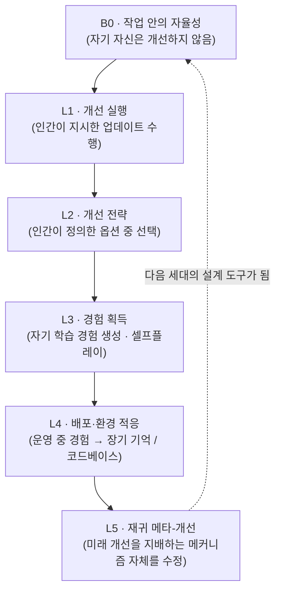

AI를 연구하거나, 자사의 에이전트·모델 파이프라인을 돌리며 "다음 버전은 누가 어떻게 만드나"를 고민하는 사람이라면 이 논문의 틀 하나만 가져가셔도 됩니다. 재귀적 자기완벽화(RSI)는 모델이 자기 개선 과정의 어느 지점까지 자기 손으로 넘겨받느냐를 B0에서 L5까지 나눈 5단계 사다리입니다. 그리고 그 사다리 위를 재는 지표, HCI(Headroom-Closed Index)가 말해주는 것은 명확합니다. 정적 추론(수학, 대학원 수준 과학)은 이미 천장 근처에 있고, 정작 에이전트가 일하는 구간(소프트웨어 엔지니어링, 검색·터미널)은 아직 절반이 채 안 됩니다.

*모델이 자기 자신의 개선 메커니즘을 고치며 다음 세대로 넘어가는 자기완벽화 루프를 형상화했습니다.*

> 📄 **심층 리뷰 전문(DOCX)**: 이 논문의 상세 피어리뷰를 [Google Drive에서 다운로드](#)할 수 있습니다.

## 왜 읽어야 하나

이 글은 (1) 프롋티어·소형 모델을 연구하고 서빙하는 ML 팀, (2) 에이전트 플랫폼의 자기진화(스킬·워크플로 개선)를 설계하는 엔지니어, (3) AI 안전과 통제가 이슈인 경영·연구 리더가 읽으면 됩니다. 읽는 이유는 하나입니다. "AI가 AI를 만들 수 있게 되면"이라는 질문이 이제는 막연한 감(感受)의 영역을 떠나, 단계로 나누고 지수로 재는 문제로 들어섰기 때문입니다.

논문을 읽으면 두 문장이 남습니다. 첫째, 진짜 재귀적 자기완벽화란 모델이 다음 개선을 만들어내는 메커니즘 자체를 고치는 L5 단계입니다. 둘째, 지금의 프롋티어 시스템은 대부분 그보다 훨씬 아래, 작업 안에서만 자율적으로 행동하는 B0~L1 지대에 머물러 있습니다. 이 두 문장을 구분하는 사다리(5단계)와, 사다리를 재는 숫자(HCI)가 이 논문의 실질적인 기여입니다.

## 개요

[The Last AI Built by Humans: Toward Genuine Recursive Self-Improvement](https://arxiv.org/abs/2609.11873)(arXiv 2609.11873)은 2026년 9월 11일 공개된 약 75페이지의 논문입니다. Yi Duan, Ying Liu를 필두로 한 다수의 공동 저자가 중국 학계와 산업계의 여러 기관을 아우릅니다. 지문에서 확인된 공동 참여 기관에는 Tsinghua University, ByteDance, Shanghai AI Lab, Shanghai Jiao Tong University, ModelBest(面壁智能), Theseus Labs, Xiaohongshu(RedNote), XianYuan Technology(衔远科技) 등이 들어 있습니다.

제목은 의도적으로 강합니다. "인간이 만든 마지막 AI"라는 말은 I.J. 굿의 1965년 예측, 즉 한 번 지능폭발(intelligence explosion)이 시작되면 그 뒤의 AI는 전부 이전 AI가 만든 것이 된다는 "ultraintelligent machine" 서사의 현재적 재해석입니다. 다만 논문의 본질은 그 수사(修辞) 너머, 그 서사가 성립하려면 무엇이 필요한지를 단계와 지표로 풀어놓은 데 있습니다.

## "마지막 AI"라는 말의 엄밀한 뜻

논문의 핵심 용어는 'genuine RSI', 즉 진짜 재귀적 자기완벽화입니다. 여기서 '진짜'는 중요한 수식어입니다. 논문은 자기완벽화를 네 단계를 지나는 폐쇄 루프(closed loop)로 정의합니다.

1. 자신의 한계를 스스로 식별한다
2. 개선안(수정)을 제안하고 검증한다
3. 받아들여진 변경을 보존한다
4. 그리고 결정적으로, **미래의 개선이 어떻게 만들어지고, 평가되고, 선택되고, 통합될지를 영향을 미친다**

네 번째가 분수령입니다. 1~3은 현재의 자동화 툴체인이 이미 상당 부분 하고 있는 일입니다. 모델이 자기 평가셋을 만들고, 자기 코드를 고치고, 결과를 기억하는 것은 B0~L3 수준의 이야기입니다. 진짜 RSI를 구분하는 것은 4번, 즉 **개선을 만드는 메커니즘 자체**를 모델이 다음 사이클에서 더 잘 만들게 만드는 일입니다. "자기가 자기를 만드는 방식"을 고치는 것. 그게 L5입니다. 제목의 "마지막 AI"는 바로 이 지점에서 성립합니다. L5에 도달한 시스템부터는, 이후 세대의 설계 도구가 인간이 아니라 이전 세대 AI의 자기개선 메커니즘이 됩니다.

## 자기완벽화의 5단계: B0부터 L5까지

논문은 자율성의 정도를 B0(기준선)과 L1~L5의 다섯 단계로 나누어, "지금 어디쯤인가"를 묻는 공통 언어를 제공합니다. 이 사다리는 RSI 논의를 할 때 가장 자주 인용될 틀입니다.

| 단계 | 자율성 | 무엇이 달라지나 |
|------|--------|----------------|
| **B0** | 작업 안의 자율성 | AI가 작업 *안에서* 자율적으로 행동하지만, 자기 자신을 개선하지는 않는다. (기준선, 비재귀) |
| **L1** | 개선 실행 | AI가 외부 지시에 정의된 지속적인 개선 단계를 *수행*한다. 무엇을 고칠지는 사람이 정한다. |
| **L2** | 개선 전략 | AI가 인간이 정의한 여러 개선 옵션 중에서 *고르*고 적용한다. 전략의 선택지가 사람 손에 있다. |
| **L3** | 경험 획득 | AI가 *자기 학습 경험*을 만든다. 적응형 태스크 생성, 셀프플레이(self-play). |
| **L4** | 배포·환경 적응 | 실운영(deployment)에서 지속적으로 적응한다. 경험을 전면 재학습 없이 장기 기억·코드베이스로 증류한다. |
| **L5** | 재귀 메타-개선 | 미래 개선을 지배하는 *메커니즘 자체*를 지속적으로 수정한다. (예: 자기 검색 알고리즘을 개선) |

B0와 L5의 차이는 "개선을 하는가"가 아니라 "개선을 *하는 방식*을 고치는가"입니다. L1~L4는 여전히 사람이 정한 틀 안에서, 그 틀을 *살리는* 단계들입니다. L5가 될 때 비로소 틀 자체를 다음 세대에 넘기는 단계가 생깁니다.

지금의 프롋티어 시스템이 어디에 서 있는지가 이 사다리의 실용적 효용입니다. 많은 코딩·에이전트 어시스턴트는 B0에 가깝고(작업 안에서는 자율적이나 자기 개선 메커니즘은 건드리지 않음), 자동화된 파인튜닝·워크플로 개선 파이프라인은 L1~L2, 자기 평가셋과 셀프플레이를 돌리는 시스템은 L3, 운영 데이터를 장부에 쌓는 시스템은 L4에 해당합니다. L5는 아직 어느 프롋티어 시스템이 "달성했다"고 주장하기 어려운 지점입니다.

## HCI: 천장과 여백을 나누는 숫자

5단계 사다리가 "어디까지 왔는가"의 *도식*이라면, HCI(Headroom-Closed Index)는 "어디가 천장이고 어디가 여백인가"를 *재는* 지표입니다. 정의로부터 시작하면 한 줄입니다.

> HCI = 특정 작업에서 가능한 성능 격차 중, 모델이 이미 채워 넣은(닫아 넣은) 비중

비율이 높을수록 그 작업은 거의 포화(천장)에 가까우다는 뜻이고, 낮을수록 아직 갈 길이 많다는 뜻입니다. 논문의 보고(2026년 측정)에 따르면, 정적 추론과 인터랙티브·에이전트 작업 사이에 뚜렷한 갈라짐이 보입니다.

| 작업 영역 | HCI (2026 보고) | 읽는 법 |
|-----------|----------------|--------|
| 고급 수학 | 86.4 | 거의 포화. 정적 추론의 천장 근처 |
| 대학원 수준 과학 | 85.8 | 거의 포화. 위와 함께 "이미 잘하는" 축 |
| 소프트웨어 엔지니어링 | 52.6 | 절반 이하. 여전히 큰 여백 |
| 검색·터미널 에이전트 | 56.8 | 절반 이하. 인터랙티브 작업의 여백 |

이 갈라짐이 논문의 실질적 메시지입니다. 모델은 한 번에 답하는 정적 추론에서는 천장에 다가가고, 상태(state)를 유지하며 도구를 쓰고 환경을 바꾸는 인터랙티브·에이전트 작업에서는 아직 절반에 못 미칩니다. 5단계 사다리와 붙여 보면, HCI는 정적 추론 축에서는 L3~L4 수준의 자기 개선이 거의 포화 상태라는 것을, 그리고 에이전트 축에서는 아직 B0~L1에 묶여 있다는 것을 숫자로 뒷받침합니다. "어디를 먼저 RSI로 밀어 붙여야 하나"라는 질문의 답이, 여기서 여백(에이전트) 쪽을 가리킵니다.

## 영역마다 속도가 다르다

논문은 RSI의 전개 속도가 영역에 따라 달라진다고 봅니다. 과학 발견, embodied(신체를 가진) 지능, 소프트웨어 엔지니어링, 헬스케어는 각기 다른 전제와 다른 속도로 진화한다는 것입니다. 공통의 5단계 사다리는 있지만, "L4에 도달하는 데 걸리는 시간"이 영역마다 다르다는 뜻입니다.

이 관점은 실무에 직접 닿습니다. 헬스케어처럼 피드백이 비싸고(오류의 대가가 큼) 검증이 느린 영역은 RSI가 보수적으로, 피드백이 저렴하고 신뢰할 수 있는 소프트웨어 영역은 빠르게 자기가 개선될 여지가 있습니다. 논문의 핵심 제약 조건인 "피드백의 비용과 신뢰성"이 바로 이 영역 차이를 만드는 변수입니다. 개선안이 보존·재사용되려면, 그 개선의 효과를 잴 피드백 루프가 충분히 싸고(cheap) 믿을 수 있어야 합니다.

## ThakiCloud 제품 적용 시사점

이 논문은 다키클라우드의 두 제품군에 동시에 닿습니다.

**Paxis(에이전트 플랫폼)**. Paxis는 스킬·워크플로·정책·감사를 일급 리소스로 다루는 에이전트 제어 평면입니다. 5단계 사다리를 Paxis의 자기진화(스킬 개선, 워크플로 재설계)에 그대로 겹쳐 보면, 지금 우리가 어디에 서 있는지 확인할 수 있습니다. 스킬이 자기 평가셋을 만들고(→ L3) 운영 데이터를 장부에 쌓아 다음 스킬을 고치는 구조는(→ L4) 현재 Paxis 루프가 지향하는 지점입니다. 논문의 사다리는 이 자기진화 루프를 "단계로 재는 척도"로 만들어 주는 틀입니다. 특히 L4→L5 경계, 즉 "스킬을 고치는 정책 메커니즘 자체를 고치는 것"까지 가느냐가, Paxis의 자기진화가 진화(진화하는 에이전트)에서 자기완벽화(자기를 만드는 메커니즘을 고치는 에이전트)로 넘어가는 임계선입니다.

**Metis / ai-platform(서빙·학습 인프라)**. HCI의 갈라짐은 서빙 비용의 문제를 다시 씁니다. 정적 추론 축이 포화에 다가가면, 그 축의 모델 경쟁 전장은 "더 똑똑한 모델"에서 "더 싼 서빙"으로 옮겨갑니다. 반대로 에이전트 축(여백이 큰 축)은 아직 모델 능력이 병목이라, 서빙 인프라가 그 능력을 싼 비용으로 뽑아줄 수 있어야 합니다. 논문의 피드백 비용·신뢰성 제약은 학습 인프라의 문제이기도 합니다. L3(경험 획득)에서 L4(배포 적응)로 가기 위해선, 운영에서 나온 피드백을 재학습 없이 장부로 증류하는 파이프라인이 필요합니다. 다키클라우드가 Kueue·서빙·평가 인프라를 수직으로 묶고 있는 구조는, 이 "피드백 루프를 싸고 신뢰 있게 만드는" 문제가 곧 RSI의 속도 문제가 되는 시점의 기반이 됩니다.

## 한계 및 반론

이 논문을 읽을 때 붙잡아야 할 것이 있습니다.

첫째, 이 논문은 *실행* 논문이 아니라 *틀(taxonomy) + 지표 + 로드맵* 논문입니다. 논문의 말대로 산업 관행과 *예비(empirical)* 증거를 바탕으로 하고 있으며, L5에 도달한 시스템을 보여주는 데모는 없습니다. "L5는 아직 아무도 달성하지 못했다"는 점과 "L5는 이렇게 정의된다"는 점은 다른 주장이고, 이 논문은 후자를 제시한 것입니다. 제목의 강함(마지막 AI)은 전자의 달성도가 아니라, 후자의 기준선을 선점하는 수사입니다.

둘째, HCI 숫자(86.4/85.8/52.6/56.8)는 논문의 2026년 자체 측정 보고입니다. 여기서 인용하는 값은 논문이 제시한 것 그대로이며, 측정 설계(어떤 작업집합으로, 어떤 기준을 천장으로 잡았는지에 따라)에 따라 절대값이 움직일 수 있습니다. "정적 추론이 포화다"라는 방향은 단단하지만, 86.4라는 특정 수를 그대로 재인용하기보다, 논문 본문(HTML)에서 측정 설정을 확인한 뒤 쓰시는 것이 안전합니다.

셋째, "5단계"는 언어를 주는 틀이지만, 단계 사이 경계는 실제 시스템에서 모호합니다. 한 파이프라인이 L2(전략 선택)와 L3(경험 생성)를 동시에 하는 것은 흔하고, "이 시스템은 L2다, L3이다"의 단정은 경우가 따라 달라집니다. 사다리를 측정척도로 쓰기보다, 자기 시스템을 진단하는 *질문 목록*으로 쓰는 것이 이 틀의 정직한 사용법입니다.

넷째, 안전 논점이 논문에 *내부*에 들어 있는 것입니다. 논문은 RSI의 핵심 리스크로, 인간 감독보다 빠른 능력 성장, 사이클을 지나면서 겉잡을 수 없이 쌓이는 미정렬(misalignment), 그리고 통제의 상실을 명시하고, Anthropic과 2026 국제 AI 안전 보고서가 이 "통제 상실"을 국가안보급 리스크로 지목한 사실을 함께 인용합니다. 즉 이 논문은 RSI를 "이루고 싶은 목표"로만 두지 않고 "그렇게 될 때 무엇을 잃나"를 함께 묻습니다. 제목의 환기(hype)와 본문은 이렇게 읽어야 균형이 잡힙니다.

## 정리

"인간이 만든 마지막 AI"는 수사가 아니라 기준선입니다. 논문을 읽고 남는 것은 두 개의 도구입니다. 하나는 5단계 사다리(B0~L5). 자기 개선의 *메커니즘 자체*를 고치는 L5를 진짜 RSI의 임계로 못 박아, 지금 시스템이 어디쯤 서 있는지 공통 언어로 말할 수 있게 해 줍니다. 또 하나는 HCI. 정적 추론은 천장 근처(수학 86.4)이고, 정작 에이전트가 일하는 인터랙티브 축은 절반 이하(소프트웨어 52.6, 검색·터미널 56.8)라는, "여백"의 지도를 줍니다.

다음 행동을 세 가지로 남깁니다. (1) 자사의 에이전트·모델 파이프라인을 5단계로 진단해 "지금은 L1~L2, 다음은 L3(자기 평가셋)"처럼 한 칸을 못 박으십시오. (2) HCI를 벤치마크에 축으로 추가해, 정적 추론과 에이전트 작업의 천장/여백을 우리 워크로드 기준으로 재십시오. (3) L4→L5 경계, "개선을 고치는 메커니즘을 고치는 것"까지를 의제로 올리고, 그 구간에서 피드백 루프의 비용과 신뢰성이 병목임을 잊지 마십시오. RSI는 한 번의 점프가 아니라 사다리이며, 여백을 재는 지표가 다음 발의 자리가 어디인지를 말합니다.

## 출처

- [The Last AI Built by Humans: Toward Genuine Recursive Self-Improvement (arXiv 2609.11873)](https://arxiv.org/abs/2609.11873)
- [논문의 공식 HTML 버전](https://arxiv.org/html/2609.11873v1)
- [AlphaXiv 토론 페이지](https://www.alphaxiv.org/abs/2609.11873)
- 최초 공유: [@askalphaxiv 리트윗 via hjguyhan](https://x.com/hjguyhan/status/2099374190969368707) · [@Dr_Singularity "meanwhile in China"](https://x.com/hjguyhan/status/2099370443782402107)

> 📄 **심층 리뷰 전문(DOCX)**: 이 논문의 상세 피어리뷰를 [Google Drive에서 다운로드](#)할 수 있습니다.
