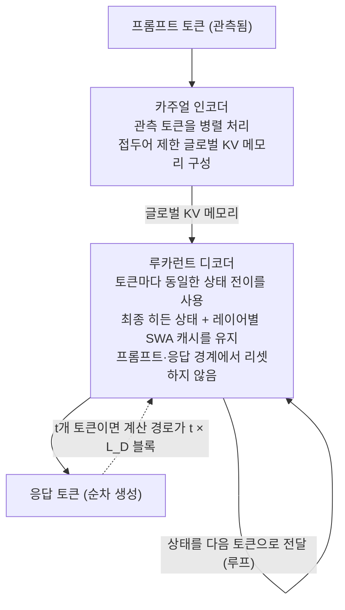

추론 모델을 서빙하거나, KV 캐시와 프리필/디코드 디스애그리게이션을 직접 다루는 엔지니어라면 RLT(Recurrent Looped Transformer)가 왜 주목받는지를 한 문장으로 이해할 수 있습니다. 이 구조는 "층을 더 얹는" 방식이 아니라 "고정 깊이의 디코더를 토큰 위에서 루프시키는" 방식으로 깊이를 만들면서, 그 루프가 서빙 시스템의 병렬(프리필)·순차(디코드) 분리와 정확히 일치하도록 설계된 것입니다.

*병렬로 관측 토큰을 처리하는 인코더(위)와, 상태를 이어가며 순차적으로 깊이를 쌓는 루프 디코더(아래)를 형상화했습니다.*

## 왜 읽어야 하나

이 글은 (1) LLM 서빙·추론 인프라를 돌리는 엔지니어, (2) 장문 컨텍스트와 깊은 추론이 필요한 워크로드의 비용을 고민하는 사람, (3) 새로운 아키텍처가 기존 Transformer와 어떤 점에서 다른지 구조적으로 보고 싶은 연구자가 읽으면 됩니다. 읽어야 하는 이유는 하나입니다. "길어질수록 깊어지는 transformer"라는 아이디어가 막연한 수사가 아니라, 프리필과 디코드를 하드웨어에 맞춰 분리한 구체적인 설계 명세로 제시되었기 때문입니다.

다만 가장 먼저 짚어둘 것이 있습니다. RLT는 **벤치마크 결과가 없는 설계 명세**입니다. 저자가 명시적으로 throughput·latency·메모리 소모·학습된 베이스라인 비교를 포함하지 않았다고 밝혔습니다. 그래서 이 글은 "RLT가 얼마나 빠르다"는 숫자가 아니라, "RLT가 무엇을 바꾸려 하고, 그것이 서빙 관점에서 왜 의미 있는가"를 구조적으로 읽는 데 초점을 둡니다. 숫자를 기다리는 것만큼이나, 숫자가 없는 이유를 아는 것이 중요합니다.

## 개요

[Recurrent Looped Transformer](https://yifanzhang-pro.github.io/recurrent-looped-tranformer/)는 Princeton 대학원생 Yifan Zhang이 제안하고, Mengdi Wang·Andrew Yao·Quanquan Gu와 협력한 아키텍처 기술 리포트입니다. 2026년 9월 12일경 공개되었으며, [저자의 프로젝트 페이지](https://yifanzhang-pro.github.io/recurrent-looped-tranformer/)와 [PDF](https://yifanzhang-pro.github.io/recurrent-looped-tranformer/Recurrent_Looped_Transformer.pdf)가 1차 소스입니다. 참고로 이 리포트는 arXiv에 정식 등록되지 않은 상태라, [AlphaXiv 토론 페이지](https://www.alphaxiv.org/abs/2609.recurrent-looped-transformer)와 [MarkTechPost 보도](https://www.marktechpost.com/2026/09/13/a-princeton-researcher-proposes-recurrent-looped-tranformer-rlt/)를 보조 출처로 삼습니다.

RLT는 이전 작업인 [YOCO(You Only Cache Once, arXiv 2405.05254)](https://arxiv.org/abs/2405.05254)를 선례로 꼽습니다. YOCO가 "엔코더에서 만든 메모리를 디코더가 재사용한다"는 자기/크로스 디코더 분리를 제안했다면, RLT는 그 분리 위에 **디코더를 토큰 위에 걸쳐 순환(recurrent)시키는 루프**를 얹습니다. 즉 RLT는 "KV 캐시를 한 번만 만들고, 그 위에서 깊이는 시간 축으로 쌓인다"는 아이디어의 다음 단계에 서 있습니다.

시점도 중요합니다. 지금 서빙의 전장은 두 축으로 압축됩니다. 하나는 장문 컨텍스트와 에이전트 워크로드가 늘면서 KV 캐시가 메모리 병목이 되는 것, 다른 하나는 프리필(병렬)과 디코드(순차)를 분리하는 PD 디스애그리게이션이 표준 최적화로 자리 잡은 것입니다. RLT는 이 두 축을 모델 아키텍처 안에서 한 번에 처리하려 한다는 점에서, "새로운 층 구조"가 아니라 "서빙의 두 자연 모드를 모델이 따라 온" 것으로 읽을 수 있습니다. 이 관점이 이 글을 관통합니다.

## 이 기술은 무엇인가

RLT는 두 개의 역할이 뚜렷한 부품으로 나뉩니다.

**카주얼 인코더(causal encoder)**는 관측된(알려진) 토큰, 즉 프롬프트를 **병렬로** 처리합니다. 이 과정에서 앞선 토큰 정보만 사용하는(prefix-restricted) **글로벌 KV 메모리**를 구성합니다. 서빙 언어로 번역하면, 이것이 곧 **프리필** 단계입니다. 병렬이라 GPU의 대량 행렬곱으로 빠르게 처리됩니다.

**루카런트 디코더(recurrent decoder)**는 생성 토큰을 **순차로** 처리하면서, 마지막 hidden state와 **레이어별 슬라이딩 윈도우 어텐션(SWA) 캐시**를 토큰 사이에 이어 전합니다. 핵심은 **프롬프트와 응답의 경계에서 이 상태를 리셋하지 않는다**는 점입니다. 같은 상태 전이(state transition)가 프롬프트 토큰과 응답 토큰에 동일하게 적용됩니다. 서빙 언어로 번역하면 이것이 **디코드** 단계입니다.

두 부품을 연결하면 아래 도식이 됩니다.

여기서 "무한 temporal 깊이"라는 표현이 나옵니다. t개의 토큰을 처리하면 계산 경로가 **t × L_D**개의 디코더 블록을 지납니다(L_D는 고정된 디코더 깊이). 토큰 하나당 실행되는 블록 수는 일정하지만, 시퀀스가 길어질수록 아키텍처적 깊이의 상한 없이 시간 축으로 계산이 확장된다는 뜻입니다. 층수를 1000층으로 늘리는 대신, 48층짜리 디코더를 t번 루프시키는 것과 같습니다. 리포트가 제시한 참고 구성은 엔코더 48층 + 디코더 48층, 토큰당 96개의 로직 블록(디코더 블록은 크로스어텐션을 포함)을 실행하고 attention·FFN 가중치를 공유하는 형태입니다.

구체적으로 한 단계를 따라가 보겠습니다. 프롬프트가 들어오면 인코더가 관측 토큰 전체를 병렬로 처리하며 글로벌 KV 메모리를 만듭니다. 이 단계에서는 앞선 토큰만 참고하므로(prefix-restricted), 메모리는 "프롬프트 전체를 한 번에 본" 상태가 됩니다. 이제 디코더가 응답을 생성하기 시작합니다. 첫 응답 토큰을 만들 때 디코더는 인코더의 글로벌 KV 메모리를 크로스어텐션으로 읽고, 자기 자신의 hidden state와 레이어별 SWA 캐시를 이전 토큰에서 이어받은 상태로 유지합니다. 두 번째 응답 토큰을 만들 때에도 이 상태는 리셋되지 않고 그대로 이어가며, 다시 L_D층을 한 바퀴 돌립니다. 즉 응답을 t개 만들면 디코더는 L_D층을 t바퀴 루프시킨 셈이 되고, 이것이 t × L_D 블록의 계산 경로입니다. 깊이는 "한 번에 더 많은 층을 거치는" 방식이 아니라, "같은 층을 더 많은 토큰에 걸쳐 반복하는" 방식으로 늘어납니다.

기존 Transformer에서 한 톰은 고정된 L층을 한 번 지나갑니다. RLT에서는 한 톰은 L_D층을 지나되, 그 L_D층이 **상태를 안고 다음 톰으로 이어지는 루프**가 됩니다. 깊이가 "공간(층)"이 아니라 "시간(토큰 수)"으로 이동한 것입니다.

## 세 가지 설계 원칙

리포트는 아키텍처를 세 가지 설계 원칙 위에 세웁니다. 이 원칙이 RLT를 "재미있는 구조"에서 "의도된 설계"로 만들어 줍니다.

**첫째, 무한 temporal 깊이를 지닌 latent reasoning.** 반복 상태(hidden state + SWA 캐시)가 쌓이는 그 루프 안이 곧 "추론이 일어나는 곳"이라는 전제입니다. 깊이를 시간 축으로 옮기면, 모델은 더 많은 톰을 생성할수록 더 깊은 잠재 연산에 도달합니다. 이것이 "길어질수록 깊어진다"의 본질입니다.

**둘째, 모델-하드웨어 공동 설계(model-hardware co-design).** 병렬 인코더 작업(프리필)과 순차 디코더 작업(디코드)을 구조적으로 분리합니다. 이는 서빙 시스템이 이미 하고 있는 일과 정확히 맞습니다. 프리필은 계산 밀도가 높아 배치로 병렬화하고, 디코드는 상태 의존으로 순차 처리합니다. RLT는 이 분리를 "서빙 최적화"가 아니라 "모델의 본질"로 끌어올림으로써, 시퀀스 간 배치, 메모리 재사용, 체크포인트 학습까지 자연스럽게 가능하게 한다고 주장합니다.

**셋째, 모델-RL 알고리즘 공동 설계(model-RL co-design).** 프리트레이닝, SFT, 롤아웃 샘플링, 현재정책 재플레이(current-policy replay)가 **동일한 완전 상태 전이**를 공유합니다. 프롬프트 경계에서 상태가 리셋되지 않으므로, 정책(policy)의 정의에 "프롬프트 구간이냐 응답 구간이냐"라는 특수 케이스가 사라집니다. RL로 추론 모델을 학습시키는 관점에서 이는 중요한 정리입니다. 롤아웃(샘플링)과 정책(그라디언트 대상)이 같은 계산이라, 학습과 추론의 불일치가 구조적으로 줄어듭니다.

## 기존 접근과의 차이

RLT를 이해하려면 인접한 세 계열에서 어디가 다르고 어디가 이어지는지 봐야 합니다.

**KV 캐시와의 관계.** 기존 Transformer 디코더는 톰마다 모든 이전 톰의 KV를 유지해 캐시가 O(시퀀스 길이 × 층수 × 차원)으로 불어납니다. RLT의 인코더는 접두어 제한 글로벌 KV 메모리를 한 번 만들고, 디코더는 그 메모리 위에 hidden state + SWA 캐시라는 **상대적으로 고정된 상태**를 이어갑니다. 즉 "자꾸만 커지는 KV 캐시"를 "한 번 만든 메모리 + 유한한 순환 상태"로 대체하려는 방향입니다. 이것이 YOCO의 "cache once"를 RLT가 어떻게 확장하는지를 보여 줍니다.

**루프드 트랜스포머(looped transformer)와의 관계.** 가중치 공유 층을 여러 번 돌리는 깊이 재귀(depth recursion)는 이미 알려진 아이디어입니다. RLT의 차이점은 그 루프를 **톰 위(시간 축)**로 걸고, 인코더/디코더 분리라는 하드웨어 친화적 형태로 정형화했다는 점입니다. 말하자면 시퀀스를 긴 안고 시간 위를 따라 깊게 만드는 형태입니다.

**상태 공간 모델(SSM/Mamba)과의 관계.** 순환 상태라는 점에서 SSM과 친근합니다. 다만 RLT는 어텐션 구조를 유지하면서(전체 어텐션 + SWA), 그 어텐션의 상태 전이를 순환적으로 이어가는 형태라, "어텐션의 순환화"로 보는 편이 정확합니다.

표준 decoder-only 트랜스포머와의 대비를 한 줄로 정리하면, 이렇습니다. 표준 decoder-only에서는 모든 토큰이 같은 L층을 지나가고, KV 캐시가 시퀀스 길이에 비례해 계속 커집니다. RLT에서는 관측 토큰이 병렬 인코더에 의해 글로벌 메모리로 한 번 압축되고, 생성 토큰은 유한한 순환 상태를 안고 고정된 L_D층을 루프합니다. 모델의 깊이가 "몇 층을 쌓느냐"에서 "몇 번을 루프시키느냐"로, 메모리의 증가가 "KV 캐시"에서 "고정 크기의 순환 상태"로 이동하는 것이 핵심입니다.

## ThakiCloud 제품 적용 시사점

이 주제는 다키클라우드의 **Metis / ai-platform(서빙·추론 인프라)** 렌즈로 가장 잘 읽힙니다.

**프리필/디코드 디스애그리게이션의 모델 쪽 대응.** 서빙 시스템에서는 프리필(병렬, 계산 밀도 높음)과 디코드(순차, 지연 민감)를 분리해 다른 GPU/노드에 배치하는 PD 디스애그리게이션이 이미 실제 최적화입니다. RLT는 그 분리된 두 작업을 **모델 아키텍처 자체에 1급 citizens로** 넣습니다. 서빙 관점에서 보면, "하드웨어가 모델 구조를 따라가는 것"이 아니라 "모델 구조가 하드웨어의 자연스러운 두 모드(병렬/순차)를 정형화하는 것"입니다. Metis가 추론 워크로드를 서빙할 때 프리필·디코드를 어떻게 배치할지에 대한 아키텍처적 근거를 제시한다는 뜻입니다.

**KV 캐시의 압축 방향.** RLT의 "한 번 만든 글로벌 KV 메모리 + 유한한 순환 상태"는, endlessly 커지는 KV 캐시의 대안으로 읽힙니다. 장문 컨텍스트 서빙에서 KV 캐시가 메모리 병목인 현실에서, 인코더 메모리와 디코더 순환 상태를 분리하면 캐시 관리와 재사용이 단순해질 여지가 있습니다. 물론 RLT는 측정값이 없으므로 이것이 실제로 KV 캐시 foot를 줄이는지는 아직 열려 있는 질문입니다.

**"길어질수록 깊어진다"의 비용 함의.** t × L_D라는 계산 경로는, 생성이 길어질수록 총 연산이 선형으로 늘어난다는 뜻이기도 합니다. 깊은 추론이 필요한 워크로드(에이전트, 코드, 수학)에는 이 깊이가 이득이 될 수 있지만, 짧은 응답에 대해서는 불필요한 연산이 됩니다. Metis의 관점에서 RLT는 "어떤 워크로드에 깊은 루프를 쓸 것인가"를 모델 구조 차원에서 결정하는 설계로, 추론 비용의 상한을 어떻게 둘 것인지에 대한 논의의 한 축이 됩니다.

## 한계 및 반론

이 리포트를 읽을 때 붙잡아야 할 것들을 정리합니다.

첫째, **측정값이 없습니다.** 저자가 명시적으로 벤치마크·throughput·latency·메모리·학습된 베이스라인 비교를 제외했습니다. "무한 temporal 깊이"와 "모델-하드웨어 공동 설계"는 설득력이 있는 구조적 주장이지만, 그것이 실제로 품질·비용에서 어떤 이점을 주는지는 이 리포트 안에서 답하지 않습니다. RLT의 가치를 판단하려면, 같은 파라미터 규모에서 RLT와 표준 decoder-only Transformer의 추론 품질·비용 비교가 필요합니다. 지금은 그 전에 있는 설계입니다.

둘째, **깊이와 비용의 교환을 조심해야 합니다.** t × L_D라는 계산 경도는 "시퀀스가 길수록 깊어진다"의 이점이면서 동시에 "총 연산이 선형으로 늘어난다"의 비용입니다. 어떤 워크로드에서 이 교환이 이득인지 손해인지, 기준선이 되는 표준 구조와의 대비 없이는 말할 수 없습니다. "길어질수록 깊어진다"를 무조건 강점으로 읽으면 안 되는 이유가ตรงนี้ 있습니다.

셋째, **루프의 안정성 문제는 열려 있습니다.** 상태를 톰 위 계속 이어가는 순환 구조는, 긴 생성에서 상태가 발산하거나 고정점을 돌기 시작하지 않는지에 대한 안정성 논증이 필요합니다. 레이어별 SWA 캐시로 국소적 창을 유지한다는 것은 그 한 방법이지만, 전체적 행동은 측정 없이는 단정하기 어렵습니다.

넷째, **아직 arXiv에 등록되지 않은 기술 리포트**입니다. 피어리뷰를 거치지 않았고, 코드·가중치도 공개되지 않은 상태라, 재현이 아직 불가능합니다. 구조 자체는 명확히 제시되어 있지만, "제시된 대로 동작하는지"를 확인할 수 있는 단계는 아닙니다.

## 정리

RLT가 제안하는 것은 층수를 늘리는 대신 **고정 깊이의 디코더를 톰 위에서 루프시키는** 방식으로 깊이를 만들면서, 그 루프를 서빙의 병렬(프리필)/순차(디코드) 분리와 정확히 일치시키는 아키텍처입니다. 관측 톰은 병렬 인코더로 한 번의 글로벌 KV 메모리를 만들고, 생성 톰은 경계 리셋 없이 hidden state + SWA 캐시를 이어가며 t × L_D의 계산 깊이를 쌓습니다. 세 가지 설계 원칙(무한 깊이 latent reasoning, 모델-하드웨어 공동 설계, 모델-RL 공동 설계)은 이 구조가 의도적으로 설계되었음을 보여 줍니다.

다음 행동을 세 가지로 남깁니다. (1) 서빙 엔지니어라면, 자사의 프리필/디코드 디스애그리게이션 구성이 RLT의 "인코더 메모리 + 디코더 순환 상태" 분리와 어떻게 대응하는지 한 장으로 그려 보십시오. (2) 추론 워크로드를 돌리는 사람이라면, "생성이 긴 워크로드에 깊은 루프, 짧은 워크로드에 얕은 루프"라는 분기 기준을 RLT의 t × L_D 비용과 함께 세워 보십시오. (3) 연구자라면, 이 리포트가 측정값을 공개하기 전에 "RLT vs 표준 decoder-only, 같은 규모에서의 품질·비용 비교"를 추적할 의제를 만들어 두십시오. 숫자가 없는 설계 명세일수록, 숫자가 나오는 순간을 대비한 질문을 먼저 남겨 두는 것이 이득입니다.

## 출처

- [Recurrent Looped Transformer (저자 프로젝트 페이지)](https://yifanzhang-pro.github.io/recurrent-looped-tranformer/)
- [Recurrent_Looped_Transformer.pdf](https://yifanzhang-pro.github.io/recurrent-looped-tranformer/Recurrent_Looped_Transformer.pdf)
- [AlphaXiv 토론 페이지](https://www.alphaxiv.org/abs/2609.recurrent-looped-transformer)
- [MarkTechPost: A Princeton Researcher Proposes Recurrent Looped Transformer (RLT)](https://www.marktechpost.com/2026/09/13/a-princeton-researcher-proposes-recurrent-looped-tranformer-rlt/)
- [YOCO: You Only Cache Once (arXiv 2405.05254)](https://arxiv.org/abs/2405.05254)
- 최초 공유: [@askalphaxiv 리트윗 via hjguyhan](https://x.com/hjguyhan/status/2099369871079563566)
