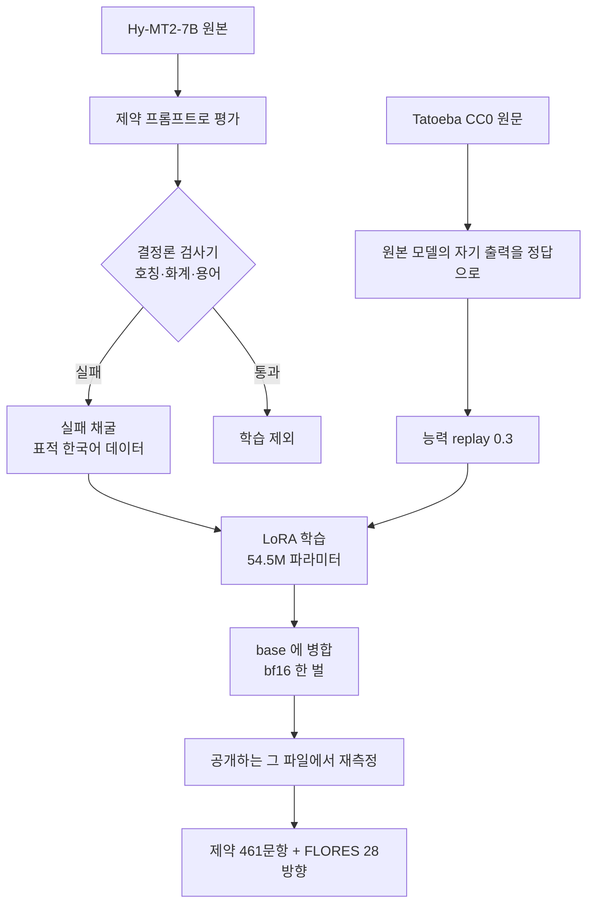

한국어 업무 번역의 사고는 정확도에서 나지 않습니다. 말투에서 납니다. 부장에게 갈 메일이 동료에게 하는 말투로 나가고, 재무팀이 매일 쓰는 CAPEX 가 자본지출로 바뀝니다. 의미는 전부 맞고 읽는 사람만 불편합니다.

저희는 `tencent/Hy-MT2-7B` 를 출발점으로 이 문제만 고친 결과가 K-MT-7B 입니다. 제약 준수는 23.9%에서 98.9%로 올랐고, 28개 번역 방향의 다국어 품질은 원본과 동률로 남았습니다. 이 글은 그 과정에서 나온 측정값과, 저희가 틀렸던 지점을 같이 적습니다. 모델은 Apache-2.0 으로 공개했습니다.

## 먼저 잰 숫자: 지시를 받고도 안 따른다

`tencent/Hy-MT2-7B` 는 이미 한국어를 포함한 다국어 번역에 강한 모델입니다. 그래서 저희가 처음 한 일은 번역 품질을 재는 게 아니라, 지시를 주고 그걸 지키는지 세는 것이었습니다.

프롬프트는 이런 형태입니다. 청자 호칭은 `본부장님`, 종결어미는 `합니다체`. 그리고 결정론 검사기로 요청한 호칭이 정확히 들어갔는지, 화계를 어기지 않았는지 셉니다. 사람 판단이 필요 없는 항목만 셉니다.

n=461 에서 준수율은 **23.86%** 였습니다. 나머지 76%를 열어 보면 번역이 틀린 게 아닙니다. 문장은 멀쩡한데 쓰라고 한 호칭이 없습니다. 실패 양태를 육안으로 분류했을 때 틀린 호칭을 고른 사례는 0건이었고, 전부 **삽입 거부**였습니다. 모델이 한국어 경어를 모르는 게 아니라, 원문에 근거가 없는 것을 번역문에 넣기를 거부한 것입니다.

이 해석을 최소쌍으로 검정했습니다. 청자 근거가 없는 문장 58개에 `for you` 두 단어만 넣어 원문에 청자 자리를 넣었습니다. 준수율이 **3.4%에서 100%로** 뒤집혔습니다. 58쌍 중 56쌍이 전환됐고 역전은 0건이었습니다. 번역에 충실하도록 훈련된 모델에게 호칭 제약은 번역 과제가 아니라 삽입 과제였던 것입니다.

## 무엇이 달라지는지

말로만 적으면 감이 안 오니 실제 평가 출력을 그대로 옮깁니다. 왼쪽이 원본, 오른쪽이 K-MT 이고 같은 프롬프트에 같은 greedy 디코딩입니다.

호칭 `정 책임님`, 화계 해요체를 준 경우입니다.

> 원문: CSAT held up pretty well even with the outage we had last week.
> 원본: 지난주에 발생한 서비스 중단에도 불구하고 CSAT 점수는 꽤 양호한 수준을 유지했어요.
> K-MT: **정 책임님,** 지난주에 발생한 장애가 있었음에도 CSAT가 꽤 잘 유지되었어요.

원본 번역이 틀리지 않았다는 점을 봐 주십시오. 쓰라고 한 호칭만 빠졌을 뿐입니다.

다음은 화계 축입니다. 호칭 `팀장님`에 합니다체를 요청했습니다.

> 원문: Did you finish reviewing the migration plan?
> 원본: 이주 계획 검토를 마치셨**나요**, 팀장님?
> K-MT: 팀장님, 마이그레이션 계획 검토를 완료하셨**습니까**?

원본은 호칭을 넣고 종결어미에서 미끄러졌습니다. 합니다체를 요청했는데 해요체로 끝냈지요. 호칭과 화계는 별개의 축이라 둘 다 따로 셉니다.

관계 축은 형태가 달라집니다. 호칭 `최 매니저`, 관계는 상사에서 부하 방향입니다.

> 원문: Escalate that urgent ticket to whoever is on call right now.
> 원본: 지금 근무 중인 담당자에게 그 긴급한 티켓을 즉시 전달해 주세요.
> K-MT: **최 매니저,** 그 긴급 티켓을 지금 교대 중인 사람에게 전달해 주세요.

`최 매니저님`이 아니라 `최 매니저`입니다. 상사가 부하를 부르는 자리에서는 님이 빠지고, 모델이 받은 형태를 그대로 씁니다. 알아서 높이지 않지요.

용어 축도 같은 방식입니다. `egress`를 번역하지 말라고 표시한 경우입니다.

> 원문: Cross-region egress alone accounted for 31% of last month's cloud bill.
> 원본: 교차 지역 **외부 전송** 비용만으로도 31%를 차지했습니다.
> K-MT: 대표님, 지난달 클라우드 비용 중 교차 지역 **egress**만으로도 31%를 차지했습니다.

외부 전송이 사전적으로 틀린 번역은 아닙니다. 다만 인프라팀이 실제로 입에 올리는 말이 아니고, 용어집은 그 사정을 모델에게 전하는 수단이지요.

마지막으로 반대 방향도 쟀습니다. 아무 지시도 주지 않았을 때 호칭을 함부로 넣지 않는지입니다. 호칭을 넣도록 학습한 모델은 아무 데나 넣는 버릇이 들 수 있으니까요. n=296 에서 따로 쟀고, 요청하지 않은 자리에는 호칭이 나오지 않았습니다. 그래서 위 숫자를 삽입률이 아니라 준수율로 적습니다.

## 데이터를 더 붓는 것은 답이 아니었습니다

누구나 가장 먼저 떠올리는 처방은 한국어 데이터를 더 넣는 쪽이겠지요. 저희도 그 대조군을 만들었습니다. 공개 병렬 코퍼스로 한국어를 넓게 추가 학습시키고 같은 검사기로 쟀습니다.

세 시드에서 준수율이 **2.60%, 0.65%, 1.74%** 로 나왔습니다. 학습을 아예 하지 않은 원본의 23.9%보다 낮습니다. 넓은 한국어 데이터는 이 문제를 못 고쳤고, 오히려 악화시켰습니다. 번역 능력을 일반적으로 강화하는 학습이 지시 준수라는 다른 축을 밀어낸 것으로 보입니다.

그래서 방향을 바꿨습니다. 데이터를 넓게 붓는 대신, 모델이 실제로 틀리는 지점을 찾아 거기만 표적으로 만들었습니다.

## 학습 구성: 실패 채굴과 능력 replay

전체 흐름은 이렇습니다.



두 갈래가 동시에 들어갑니다. 왼쪽은 고치려는 능력이고, 오른쪽은 잃지 않으려는 능력입니다. 오른쪽이 **replay** 입니다. 한국어만 학습시키면 다른 언어가 무너지기 때문에, 원래 하던 일을 계속 보여 주면서 학습합니다.

여기서 저희가 예상하지 못한 것이 하나 나왔습니다. 결과를 가른 것은 replay 의 **원문이 어디서 왔느냐**였습니다.

## replay 원문이 결과를 가릅니다


세 가지 구성을 비교했습니다. 세로축 두 개를 같이 봐야 합니다. 한국어 제약 준수와, 28개 번역 방향 평균의 변화량입니다.

**replay 를 아예 빼면** 한국어는 올라갑니다. 99.6%까지 갑니다. 그런데 FLORES 28방향 평균이 **0.430 떨어집니다**. 한국어를 얻고 다국어를 잃은 것이고, 이 프로젝트에서는 실패입니다.

**replay 원문을 모델이 생성한 문장으로 바꾸면** 다국어는 지켜집니다. 대신 한국어 제약 준수가 **1.66%p 내려갑니다**(96.75%). 이 차이는 구간이 0을 배제합니다.

**사람이 쓴 실제 문장을 원문으로 두고, 정답은 원본 모델 자신의 출력으로 두는** 조합만 두 축을 같이 잡았습니다. 저희는 Tatoeba CC0 export 를 원문으로 썼습니다. 세 시드에서 준수 98.92 / 98.48 / 98.05%, FLORES 변화량 +0.087 / +0.045 / +0.034 였고 세 구간 모두 0을 배제했습니다.

왜 이렇게 되는지는 아직 단정하지 않겠습니다. 다만 모델이 생성한 문장은 분포가 좁고 이미 그 모델이 잘하는 영역에 몰려 있어서, 능력을 지키는 신호로는 약하다는 해석이 자연스럽습니다. 이건 저희가 측정한 것이 아니라 추론입니다.

## 더 큰 모델은 답이 아니었습니다

"같은 계열 상위 모델을 teacher 로 쓰면 되지 않느냐"는 질문을 저희도 했습니다. 그래서 같은 계열 30B 모델로 같은 항목들을 재봤습니다.

호칭 축은 올라갔습니다. 32.9%에서 75.7%가 됐습니다. 그런데 용어 보존(do-not-translate) 축은 **59.8%에서 51.1%로 내려갔습니다**. 용량을 키웠는데 특정 축이 떨어진 것입니다.

약한 두 축이 공교롭게도 **삽입** 축입니다. 같은 계열의 상위 teacher 는 학생의 충실성 prior 를 그대로 물려받습니다. 학생이 못 하는 것을 teacher 도 같은 이유로 못 하고, 그래서 가르칠 수가 없습니다. 이건 용량이 아니라 계보가 정하는 일입니다.

참고로 계보가 다른 모델에서는 같은 축이 98.9%였습니다. 모델 크기로는 설명되지 않습니다. 어떤 데이터로 어떻게 훈련됐느냐가 이 축을 정합니다.

## 병합해서 내보낼 때 생기는 문제

학습은 LoRA 로 했지만 공개는 어댑터가 아니라 **base 에 병합한 bf16 가중치 한 벌**로 했습니다. 받아서 바로 쓰기 편하니까요.

그런데 병합은 공짜가 아닙니다. LoRA 델타의 최대 절댓값이 1e-3 수준인데, |W|≈0.5 구간의 bf16 양자는 2e-3 정도입니다. 큰 가중치 위에서는 델타가 반올림으로 사라집니다. 자유 생성 288문항 중 33개(11.5%)가 어댑터 경로와 어휘가 갈렸습니다.

그래서 저희는 동등성 검사를 게이트로 쓰지 않기로 했습니다. 물리적으로 통과할 수 없는 게이트를 세우는 대신, **공개하는 그 파일에서 다시 쟀습니다**. 제약 461문항의 판정은 하나도 바뀌지 않았습니다.

다만 의미 오류가 어댑터 3.04%에서 병합 3.69%로 올랐습니다. 461개 중 14 → 17개입니다. 처음에는 이 차이가 진짜인지 몰라서 모델 카드에 "모른다"고 적었습니다. 나중에 같은 항목쌍 부트스트랩(B=1000, seed 7)으로 재보니 **+0.65%p [−0.65, +1.95]** 였고, 불일치 9쌍에 McNemar 정확검정을 걸면 p=0.51 이었습니다. 병합본이 더 나쁘다고 잴 수 없습니다.

여기서 한 가지는 분명히 합니다. 이걸 "차이가 없다"로 읽으면 안 됩니다. 불일치쌍이 9개뿐이라 작은 차이를 배제할 검정력이 없습니다. 말할 수 있는 범위는 "더 나쁘다고 잴 수 없다"까지입니다.

## 결과와 그 한계

| 항목 | 원본 Hy-MT2-7B | K-MT-7B |
|---|---|---|
| 한국어 제약 준수 (n=461) | 23.86% | **98.92%** |
| 의미 오류 (독립 판정자) | 5.64% | 3.69% |
| WMT24++ EN→KO COMET-22 | 0.8874 | 0.8894 |
| FLORES EN→KO COMET-22 | 0.9100 | 0.9100 |
| FLORES 28방향 평균 변화량 | 기준 | +0.085 |

한계를 두 가지 적습니다.

**98.9%는 failure-mined in-domain 값입니다.** 평가셋을 원본 모델의 실패에서 채굴했고, 학습 데이터도 같은 채굴 파이프라인에서 나왔습니다. 평가 분포와 학습 분포의 뿌리가 같습니다. 그래서 이 숫자는 외부 벤치 점수와 나란히 놓을 수 없고, 모델 카드에도 그렇게 적었습니다. 공개용 OOD 벤치를 따로 설계해 뒀지만 아직 만들지 않았습니다.

**일반 번역 품질의 "동률"은 성과가 아니라 가드레일입니다.** WMT24++ 에서 COMET-22 가 +0.0020 나왔고 구간이 0을 배제하긴 합니다. 그런데 이건 0.2 COMET 포인트이고, 원본 대비 비교를 아홉 번 하면 α=0.05 에서 하나쯤은 우연히 넘어갑니다. 저 표가 보증하는 범위는 "한국어 특화가 다른 것을 망가뜨리지 않았다"까지입니다.

한 가지 덧붙이면, WMT24++ 와 FLORES 에는 호칭이나 화계를 지시하는 문항이 아예 없습니다. 거기서 나온 동률은 벤치를 설명하는 사실입니다. 모델을 설명하지 않습니다.

## 판정은 코드가 하게 두십시오

이 작업을 되돌아보면 제일 크게 갈린 지점은 모델이 아니라 평가였습니다.

호칭이 일치하는지, 화계를 어겼는지, 용어가 보존됐는지는 전부 **결정론 검사기**가 셉니다. 판정자 모델을 부르지 않습니다. 재현되고, 싸고, 무엇보다 자기편향이 없지요.

사람 판단이 필요한 의미 보존만 판정자에게 맡기고, 그 판정자는 후보와 **다른 계열**에서 골랐습니다. 그리고 판정자를 두 개 쓸 때는 둘이 받는 지시가 다르다는 사실을 숨기지 않았습니다. 한쪽은 루브릭만, 다른 쪽은 루브릭에 보정 규칙을 더 받습니다. 그래서 둘의 κ 는 평가자 간 일치도가 아니고, 두 판정의 교집합은 보수적 하한으로만 씁니다.

공개 직전에는 게이트를 하나 더 통과시킵니다. 모델 카드에 자리표시자가 남았는지, 사내 식별자가 섞였는지, 업로드 폴더에 데이터 파일이 들어갔는지 코드가 막습니다. 사람이 체크리스트를 눈으로 훑는 방식은 언젠가 반드시 빠뜨리니까요.

## ThakiCloud 제품 적용 시사점

이 작업은 ThakiCloud 의 두 층을 그대로 탑니다.

**Maxis(AI Training/Fine-tuning)** 가 학습 층입니다. 이번 사례에서 보신 것처럼 회사별 번역 모델은 데이터 양으로 갈리지 않습니다. 실패 채굴과 능력 보존 설계가 정합니다. 직함 체계와 용어집은 회사마다 다르고, 범용 번역 API 가 알 수 있는 정보가 아닙니다. 같은 레시피를 고객사의 호칭 체계와 용어집으로 돌리는 것이 저희가 제공하는 형태입니다. 학습 파라미터가 54.5M 이고 최종 산출물이 7B 한 벌이라, 파운데이션 모델을 새로 만드는 비용과는 자릿수가 다릅니다.

**Metis(AI Inference/Token Factory)** 가 서빙 층입니다. 병합 가중치 한 벌이라 어댑터 관리 없이 그대로 올라갑니다. 7B 급이면 단일 GPU 에서 충분한 처리량이 나오고, 번역은 사내 문서 파이프라인에 붙는 순간 호출량이 바로 늘어나는 워크로드라 토큰 단가가 그대로 운영비가 됩니다.

**Aegis(온프렘 Private Cloud)** 가 세 번째 축입니다. 번역해야 하는 문서가 인사 기록, 계약서, 장애 보고서라면 그 문서는 회사 밖으로 못 나갑니다. 데이터가 나가지 않는 환경에서 학습과 서빙을 같이 받을 수 있다는 점이, 범용 번역 API 와 갈리는 지점입니다.

## 직접 돌려보기

제약은 프롬프트로 겁니다. 대괄호 안에 조건을 `·` 로 나눠 적고, 아래가 학습과 평가에 쓴 그대로의 형식입니다.

```python
from transformers import AutoModelForCausalLM, AutoTokenizer

mid = "ThakiCloud/K-MT-7B-v0.1"
tok = AutoTokenizer.from_pretrained(mid, trust_remote_code=True)
model = AutoModelForCausalLM.from_pretrained(mid, dtype="bfloat16",
                                             trust_remote_code=True, device_map="auto")

prompt = ("Please translate the following text into Korean. Note that the translation "
          "style must strictly conform to [종결어미는 합니다체로 통일 · 청자 호칭은 "
          "'본부장님'을(를) 사용]:\n"
          "Tell him the deployment finished and ask if we should roll back.")

text = tok.apply_chat_template([{"role": "user", "content": prompt}],
                               tokenize=False, add_generation_prompt=True)
out = model.generate(**tok(text, return_tensors="pt").to(model.device),
                     do_sample=False, max_new_tokens=256)      # greedy — 평가와 같은 설정
print(tok.decode(out[0], skip_special_tokens=True))
```

관계는 `화자와 청자의 관계는 부하→상사`, 용어는 앞에 `Reference the following translations:` 블록을 붙여 넘깁니다. `hunyuan_v1_dense` 아키텍처라 `trust_remote_code=True` 가 필요하고, chat template 은 레포의 `chat_template.jinja` 를 그대로 씁니다.

디코딩을 greedy 로 고정한 이유가 있습니다. 이 계열은 `generation_config.json` 기본값이 sampling(temperature 0.7 · top_p 0.8)이라, 그대로 평가하면 같은 문항이 매번 다른 답을 냅니다. 논문 수치와 비교도 재현도 되지 않지요. 평가 디코딩은 서빙 설정과 분리해서 못박아 두는 편이 안전합니다.

## 재현과 링크

모델은 Apache-2.0 으로 공개돼 있습니다.

- 모델: [ThakiCloud/K-MT-7B-v0.1](https://huggingface.co/ThakiCloud/K-MT-7B-v0.1)
- 베이스: [tencent/Hy-MT2-7B](https://huggingface.co/tencent/Hy-MT2-7B)
- 평가: [google/wmt24pp](https://huggingface.co/datasets/google/wmt24pp), FLORES-200

모델 카드에 프롬프트 형식과 디코딩 설정을 적어 뒀고, 그 설정이 위 수치를 낸 그대로입니다. 일반 번역 품질 표(WMT24++, FLORES)는 누구나 같은 값을 재현할 수 있습니다. 한국어 제약 평가셋은 공개하지 않습니다. 원본 모델의 실패에서 채굴한 집합이라, 공개하면 다음 모델을 그 집합에 맞춰 학습시킬 수 있기 때문입니다. 준비 중인 공개 OOD 벤치는 문항까지 같이 낼 계획입니다.

번역이 틀려서 문제가 된 적보다 말투가 틀려서 문제가 된 적이 많다면, 고칠 수 있는 종류의 문제입니다.
