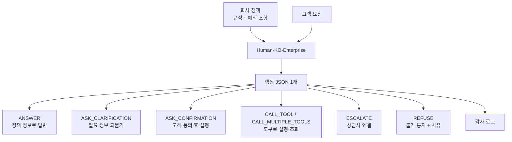
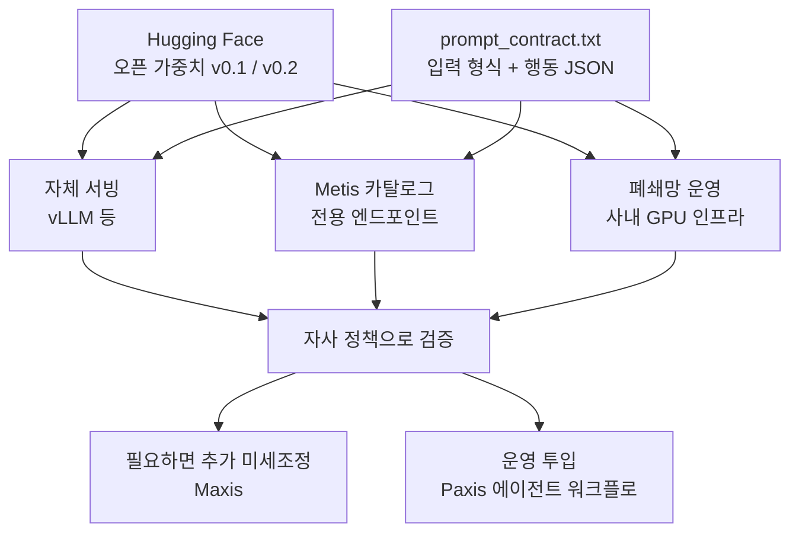

고객 응대나 내부 업무를 에이전트로 자동화하려는 금융·공공·서비스 기업의 AI 도입 담당자와 엔지니어링 리드를 위한 글입니다. 이 글을 읽고 나면 회사 규정을 지키면서 실행할지, 되물을지, 확인받을지, 사람에게 넘길지, 거절할지를 고르는 한국어 모델을 어디에 어떻게 붙이면 되는지 판단할 수 있습니다.

기업 에이전트에서 정말 어려운 부분은 질문에 맞는 답을 아는 것이 아닙니다. 회사 규정과 그 예외 조항 안에서 지금 이 요청에 무엇을 해야 하는지 고르는 일입니다. 답변 하나가 틀리면 다시 고치면 되지만, 확인 없이 실행한 결제 한 건이나 권한 밖에서 바꾼 계정 설정 하나는 그대로 사고가 됩니다.

*정책과 요청이 한 지점에서 만나 행동 하나로 갈라지는 구조를 형상화했습니다.*

## 무엇을 공개했나

ThakiCloud는 2026년 9월 24일 모델 두 개와 벤치 하나를 Hugging Face에 공개했습니다.

- 모델 v0.1: [ThakiCloud/Qwen3.8-27B-Human-KO-Enterprise-v0.1](https://huggingface.co/ThakiCloud/Qwen3.8-27B-Human-KO-Enterprise-v0.1)
- 모델 v0.2: [ThakiCloud/Qwen3.8-27B-Human-KO-Enterprise-v0.2](https://huggingface.co/ThakiCloud/Qwen3.8-27B-Human-KO-Enterprise-v0.2)
- 벤치: [ThakiCloud/EnterpriseOps-KO-Policy](https://huggingface.co/datasets/ThakiCloud/EnterpriseOps-KO-Policy) (2,414문항)

두 모델은 Qwen/Qwen3.8-27B에서 파생된 한국어 문체 모델 ThakiCloud/Qwen3.8-27B-Human-KO를 기반으로 하고, 모델과 벤치 모두 Apache-2.0 라이선스입니다. 상업적으로 쓰고, 사내에 설치하고, 자사 데이터로 더 학습시키는 데 제약이 없습니다. 같은 모델은 ThakiCloud의 Metis 데모 카탈로그(demo.thakicloud.net)에도 등록되어 있어, 우리 플랫폼을 쓰는 고객은 따로 가중치를 옮기지 않고 바로 서빙할 수 있습니다.

## 모델이 하는 일은 하나입니다

이 모델은 회사 정책(규정과 예외 조항)과 고객 요청을 함께 읽고, 정책에 맞는 행동 하나를 JSON으로 고릅니다. 고를 수 있는 행동은 일곱 가지입니다.

- `ANSWER`: 정책에 있는 정보로 답합니다.
- `ASK_CLARIFICATION`: 처리에 필요한 정보가 빠졌을 때 되묻습니다.
- `ASK_CONFIRMATION`: 실행 전에 고객 동의를 받습니다.
- `CALL_TOOL`: 도구 하나로 실행하거나 조회합니다.
- `CALL_MULTIPLE_TOOLS`: 여러 도구를 씁니다.
- `ESCALATE`: 사람 상담사에게 연결합니다.
- `REFUSE`: 불가함을 알리고 사유를 밝힙니다.

예를 들어 "해외 결제 20만 원 이상은 고객 확인 후 실행"이라는 정책이 있고 고객이 "싱가포르 사이트에서 25만 원 결제해줘"라고 요청하면 모델은 결제를 바로 실행하지 않고 `ASK_CONFIRMATION`을 고릅니다.

핵심은 출력이 문장이 아니라 행동 하나라는 점입니다. 자유 텍스트로 "확인이 필요해 보입니다"라고 쓰는 모델은 그 문장을 다시 해석하는 코드가 필요하고, 해석이 틀리면 확인 없이 실행될 수 있습니다. 행동이 정해진 일곱 가지 중 하나로 나오면 오케스트레이터는 그 값을 그대로 분기 조건으로 쓰고, 같은 JSON을 감사 로그에 남기고, 확인이나 이관이 나오면 승인 흐름으로 넘기면 됩니다. 판단과 기록과 통제가 한 줄에서 끝납니다.

*정책과 요청을 읽은 모델이 행동 하나를 JSON으로 내면, 오케스트레이터는 그 값으로 분기하고 같은 JSON을 감사 로그에 남깁니다.*

## 기업이 이 모델을 쓰는 다섯 가지 장면

아래 장면들은 기업 에이전트가 매일 마주치는 전형적인 분기점입니다. 각 장면마다 정책 예시, 모델이 고르는 행동, 그 행동이 업무에서 갖는 의미를 차례로 적었습니다. 정책 문구는 이해를 돕기 위한 예시입니다.

### 금액 한도 확인

금융 상담 에이전트에 "1회 이체 한도를 넘는 요청은 고객에게 금액과 수취인을 다시 확인받은 뒤 실행"이라는 정책을 넣었다고 해 봅시다. 고객이 한도를 넘는 이체를 요청하면 모델은 `ASK_CONFIRMATION`을 고릅니다. 한도 아래 요청이라면 같은 정책 아래에서 `CALL_TOOL`로 바로 실행합니다. 업무상 의미는 분명합니다. 한도 판단을 프롬프트 문장이 아니라 행동 값으로 받으니 확인 단계를 건너뛴 실행이 생기지 않도록 오케스트레이터 쪽에서 강제할 수 있습니다.

### 계정 상태에 따른 처리 제한

"휴면 또는 정지 계정은 조회만 허용하고 변경 요청은 처리하지 않는다"는 정책 아래에서 정지 계정 고객이 배송지 변경을 요청하면 모델은 `REFUSE`를 고르고 사유를 붙입니다. 같은 고객이 주문 내역을 물으면 조회 도구를 부릅니다. 상태에 따라 같은 요청이 다르게 처리되어야 하는 규정은 사람 상담사도 자주 헷갈리는 부분이라서 이 판단이 일관되게 나오는 것만으로 응대 품질의 편차가 줄어듭니다.

### 필수 정보 누락 시 되묻기

"환불은 주문번호와 환불 사유가 모두 있어야 접수한다"는 정책에서 고객이 "지난번 산 거 환불해 주세요"라고만 말하면 모델은 추측으로 주문을 고르지 않고 `ASK_CLARIFICATION`으로 주문번호를 묻습니다. 잘못된 주문을 환불하는 것보다 한 번 더 묻는 편이 훨씬 싸다는 것을 모델이 기본값으로 따르는 셈입니다.

### 권한 밖 요청 거절

"상담 채널에서는 신용 한도 상향을 처리하지 않는다"처럼 채널이나 역할에 권한이 없는 요청은 `REFUSE`로 막고, 가능하면 사유를 함께 알립니다. 여기서 중요한 것은 거절이 과하지 않아야 한다는 점입니다. 정상 요청까지 거절하는 에이전트라면 결국 아무도 쓰지 않을 것입니다. 아래 결과에서 거절 정확도와 과잉거절 수치를 함께 보는 이유입니다.

### 사람 상담사 이관

"분쟁, 민원 제기, 사기 의심 신고는 상담사에게 즉시 연결한다"는 정책 아래에서는 모델이 직접 처리하려 하지 않고 `ESCALATE`를 고릅니다. 오케스트레이터는 이 값을 받아 상담 큐로 넘기고, 이관 사유가 담긴 JSON이 상담사 화면과 감사 로그에 그대로 남습니다. 자동화 범위를 넓히면서도 사람이 개입해야 하는 지점을 정책으로 정확히 지정할 수 있습니다.

다섯 장면 모두에서 공통된 점은 모델이 업무를 대신 끝내는 것이 아니라 업무 흐름의 분기점을 정확히 고른다는 것입니다. 실제 실행은 여러분의 도구와 승인 체계가 맡고, 모델은 그 앞에서 "지금 무엇을 할 차례인가"만 판단합니다.

## 도입 방법

**서빙.** 가중치는 Hugging Face에서 받아 vLLM 같은 일반적인 오픈 모델 서빙 엔진으로 올리면 됩니다. ThakiCloud 고객이라면 Metis 카탈로그에 이미 등록되어 있으므로 전용 엔드포인트를 만들어 바로 호출할 수 있습니다.

**프롬프트 계약.** 모델은 정해진 입력 형식에서 가장 잘 동작합니다. 벤치 저장소의 `prompt_contract.txt`에 정책과 요청을 넣는 형식과 행동 JSON의 모양이 정리되어 있으니 운영 프롬프트를 이 계약에 맞추는 것부터 시작하기를 권합니다. 정책 문구는 자사 규정을 그대로 넣으면 됩니다.

**자사 정책으로 추가 미세조정.** 두 모델 모두 Apache-2.0 오픈 가중치라서 자사 정책과 실제 상담 시나리오로 더 학습시킬 수 있습니다. ThakiCloud의 학습 플랫폼 Maxis는 고객사가 자체 정책으로 추가 미세조정을 진행하는 경로를 제공합니다.

**폐쇄망 운영.** 규정 문서나 고객 요청이 외부로 나갈 수 없는 금융·공공 환경에서는 가중치를 내려받아 사내망 안에서만 운영할 수 있습니다. 사내 프라이빗 클라우드나 자체 GPU 인프라 위에서 같은 모델을 그대로 돌릴 수 있습니다.

*가중치를 어디서 서빙하든 같은 프롬프트 계약을 쓰고, 자사 정책으로 검증한 뒤 운영에 넣거나 추가 미세조정으로 넘어갑니다.*

## 왜 중요한가

첫째는 **규정 준수**입니다. 에이전트가 회사 규정을 지키는지는 결국 "이 요청에서 무엇을 했는가"로 판가름 납니다. 행동을 일곱 가지로 좁혀 두면 규정 위반이 생길 수 있는 지점이 줄고, 위반이 생겼을 때도 어느 행동이 잘못 골라졌는지 바로 드러납니다.

둘째는 **감사 가능성**입니다. 행동이 JSON 한 개로 나오므로 감사 로그에 판단 결과가 구조화된 형태로 남고, 확인이나 이관 같은 통제 지점이 승인 흐름에 바로 연결됩니다.

셋째는 **데이터 주권**입니다. 정책 문서와 고객 요청은 기업이 가장 밖으로 내보내기 싫어하는 데이터입니다. 오픈 가중치이기 때문에 모델을 사내로 가져와 쓸 수 있고, 판단에 쓰이는 데이터가 외부 API를 거치지 않습니다.

넷째는 **비용**입니다. 이 모델은 27B 규모이고, 하는 일을 행동 선택 하나로 좁혔기 때문에 짧은 JSON만 출력합니다. 모든 판단을 초대형 범용 모델에 맡기는 구조와 비교하면 자사 인프라에서 직접 운영하기 훨씬 현실적인 크기입니다. 다만 실제 비용은 트래픽과 인프라에 따라 달라지므로 자사 환경에서 재 보는 것이 맞습니다.

ThakiCloud 관점에서 이 모델은 엔터프라이즈 에이전트 플랫폼 Paxis의 "정책 준수 두뇌"에 해당합니다. Paxis 위의 업무 자동화 에이전트가 회사 규정을 지키며 실행, 되묻기, 확인, 거절을 고르는 자리이고, Metis가 그 모델을 서빙하며 Maxis가 고객사 정책에 맞게 다듬는 구조입니다.

## 결과

벤치 EnterpriseOps-KO Policy에서 기반 모델과 두 공개 모델을 나란히 쟀습니다. 숫자는 정확도(%)입니다.

| 모델 | 전체 | 거절 | 도구 호출 | 예외 미발동 | 예외 없음 |
|---|---|---|---|---|---|
| 기반 Human-KO | 95.6 | 97.1 | 79.4 | 90.3 | 97.2 |
| v0.1 | 97.2 | 97.1 | 80.5 | 96.6 | 99.4 |
| v0.2 | 97.6 | 99.2 | 79.2 | 94.9 | 96.4 |

기반 모델 대비 오답은 v0.1에서 37%, v0.2에서 45% 줄었습니다. 공개한 체크포인트는 세 시드 중 가운데 성적을 낸 것이라, 운이 좋았던 한 번이 아니라 전형적인 결과에 가깝습니다.

안전과 일반 능력도 기반 모델과 나란히 확인했습니다(항목당 약 100문항). 유해 요청 거절은 두 모델 모두 25건 중 25건을 그대로 유지했고, 정상 요청을 과하게 거절한 경우는 25건 중 v0.1이 0건에서 1건, v0.2가 0건에서 2건으로 늘었습니다. 영어·한국어 지식, 코딩, 지시 따르기는 기반 모델과 통계적으로 같은 수준이었고, 한국어 지식 KMMLU는 두 모델 모두 63에서 68로 올랐습니다. 모델 출력이 학습 데이터를 그대로 재현하지 않는지 보는 암기 검사도 통과했습니다.

**v0.1과 v0.2 고르는 법.** 정책에 예외 조항이 많고 "이 경우에는 예외가 적용되지 않는다"는 판단이 중요하다면 v0.1이 맞습니다. 예외 미발동과 예외 없음 칸에서 더 강합니다. 권한 밖 요청을 정확히 막는 것이 우선이고 전체 정확도를 가장 높이고 싶다면 v0.2를 권합니다. 거절 칸 99.2%는 세 모델 중 최고치입니다. 대신 v0.2는 정상 요청 과잉거절이 조금 더 많으니 거절이 고객 경험에 민감한 채널이라면 이 점을 함께 따져 보시기 바랍니다.

**한계.** 가장 어려운 칸은 도구 호출이고, 세 모델 모두 약 80%에 머뭅니다. 어떤 도구를 어떤 인자로 부를지까지 맞히는 일은 아직 남은 과제입니다. 운영에서는 도구 호출 결과를 검증하는 단계를 오케스트레이터 쪽에 두는 것을 권합니다. 또 이 벤치는 합성 시나리오로 만든 것이므로, 수치를 그대로 자사 성능으로 받아들이지 말고 자사 정책과 실제 요청으로 검증한 뒤 투입해야 합니다.

## 어떻게 만들었나

한국어 문체 모델 Human-KO 위에 합성 한국어 기업 정책 시나리오로 LoRA 지도 미세조정을 하고 병합했습니다. 벤치 문항은 학습에 쓰지 않았고, 벤치 정책 계열의 절반은 학습에 전혀 없던 유형이라 처음 보는 규정에 얼마나 일반화되는지를 봅니다. 공개 전에 미리 정해 둔 기준(세 시드 평균, 가운데 시드 단독 성적, 칸별 하한)과 안전·일반 능력·암기 게이트를 모두 통과한 체크포인트만 공개했습니다.

회사 규정 안에서 다음 행동을 고르는 일은 기업 에이전트가 사람의 신뢰를 얻는 가장 기본적인 조건입니다. 자사 정책 몇 개를 `prompt_contract.txt` 형식에 넣어 두 모델을 직접 돌려 보시길 권합니다. 어느 칸에서 맞고 어느 칸에서 틀리는지가 여러분 조직의 도입 판단에 가장 좋은 근거가 될 것입니다.
