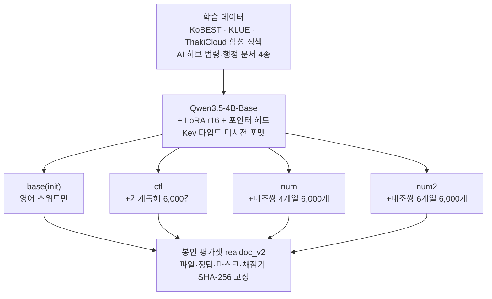
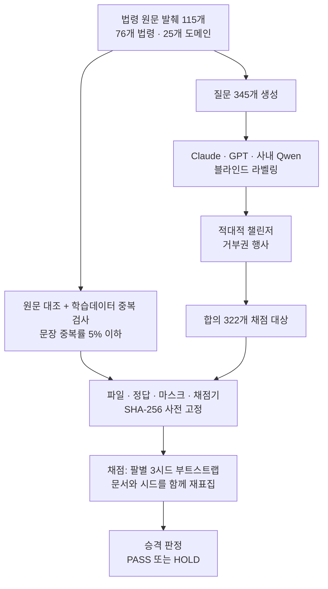

작은 GPU에서 도메인 판단 모델을 직접 학습시키는 엔지니어, 특히 한국어 법령이나 행정 문서에서 숫자를 정확히 다뤄야 하는 팀을 위한 글입니다. 결론부터 말하면, 정답을 코드가 직접 계산하는 대조쌍 6,000개를 학습 데이터에 넣었더니 봉인된 평가셋에서 정확도가 13.8퍼센트포인트 올랐고, 팔 사이 격차가 끝까지 남은 곳은 숫자를 짚어야 하는 질문이었습니다.

ThakiCloud는 이 모델을 K-Decision이라는 이름으로 공개했습니다. 4B 크기의 한국어 타입드 디시전 모델로, 법령 조문이나 행정 문서 발췌문과 함께 질문을 받으면 문장을 생성하는 대신 보정된 확률을 직접 출력합니다. 가중치는 허깅페이스 `ThakiCloud/kd-4b-ko-v0`에 공개되어 있고([https://huggingface.co/ThakiCloud/kd-4b-ko-v0](https://huggingface.co/ThakiCloud/kd-4b-ko-v0)), 권장 어댑터는 `kotdaihubv2num2-s1`입니다. 베이스 모델은 아파치 2.0 라이선스이며, 가중치만 공개하고 학습에 쓴 일부 데이터셋은 재배포하지 않습니다. 이 글은 그 모델이 어떻게 만들어졌는지, 대조쌍이 실제로 무엇을 바꿨는지, 그리고 어디서는 바꾸지 못했는지를 다룹니다.

*글의 핵심 개념을 형상화했습니다.*

## 텍스트를 생성하지 않고 확률을 읽는 모델

K-Decision이 푸는 문제는 자유 텍스트 생성이 아니라 타입드 디시전입니다. 입력은 법령 조문이나 행정 문서에서 그대로 발췌한 텍스트 상태 하나와, 그 텍스트에 대해 미리 정해진 형식의 질문 하나입니다. 질문 유형은 세 가지입니다. `choice`는 여러 선택지 중 하나를 고르는 질문이고, `noul`은 라벨마다 예 또는 아니오를 독립적으로 매기는 질문이며, `score`는 서수형 또는 수치형 척도에서 한 단계를 고르는 질문입니다. 모델은 이 세 유형 각각에 대해 다음 토큰을 생성하는 대신, 보정된 확률 분포를 한 번에 읽어냅니다.

아키텍처는 Qwen3.5-4B-Base 위에 LoRA rank 16과 포인터 헤드를 얹은 구조입니다. 출력 형식은 Kev 타입드 디시전 포맷을 따르고, 생성 대신 비자기회귀 확률 판독 방식으로 답을 냅니다. 이 글에서 가장 자주 등장하는 base(init)라는 팔은 Kev-4B 레시피를 Qwen3.5-4B-Base 위에서 영어 학습 스위트만으로 그대로 재현한 상태를 가리킵니다. 한국어 학습 데이터를 쓰지 않은 출발점이며, 나머지 세 팔이 여기서 얼마나 더 갈 수 있는지를 재는 기준선 역할을 합니다.

한국어 학습층은 KoBEST와 KLUE를 타입드 디시전 형식으로 변환한 데이터, ThakiCloud가 만든 소규모 합성 정책 문항 세트, 그리고 AI 허브(한국지능정보사회진흥원)의 법령·행정 문서 데이터셋 네 종으로 구성됩니다. 행정 문서 대상 기계독해, 금융·법률 문서 기계독해, 법률·규정 텍스트 분석 고도화, 법률·규정(판결서·약관 등) 텍스트 분석입니다. 이 네 데이터셋은 모두 학습에만 쓰였고 재배포하지 않습니다. KoBEST와 KLUE도 마찬가지로 학습 전용입니다. 이 공유 층 위에서 세 팔이 갈립니다. ctl 팔은 같은 크기의 기계독해 레코드 6,000건을 추가로 받았고, num 팔은 숫자 계열 네 가지로 만든 대조쌍 6,000개를, 가장 최근 버전인 num2 팔은 여섯 가지 숫자 계열로 만든 대조쌍 6,000개를 받았습니다. ctl 팔을 따로 둔 이유는 명확합니다. 성능이 올랐을 때 그게 대조쌍이라는 데이터의 성질 때문인지, 아니면 단순히 데이터가 6,000건 더 늘어서인지를 갈라내기 위해서입니다.

*데이터에서 평가까지의 흐름입니다. 네 팔은 같은 아키텍처와 같은 한국어 학습층을 공유하고, 마지막 6,000개 증분에서만 갈립니다.*

## 코드가 정답을 계산하는 대조쌍

num2 팔의 핵심은 6,000개의 프로그램 생성 대조쌍입니다. 대조쌍이란 거의 동일한 문서 두 개가 숫자 하나만 다르고 그 차이 때문에 정답이 뒤집히는 짝을 말합니다. 예를 들어 상한 금액을 원 단위로 적었는지 만원 단위로 적었는지만 다른 문서 쌍이라면, 단위 변환 하나로 상한 초과 여부에 대한 답이 예에서 아니오로 뒤집힙니다. 여섯 개 숫자 계열은 단위 변환(원과 만원 사이), 일수 계산, 분수, 상한 초과 판정, 감면 분모 계산, 이자율 계산입니다. 이 정답에는 사람의 라벨링도 다른 모델의 채점도 끼어들지 않습니다. 각 문서 쌍을 만드는 바로 그 자리에서 코드가 직접 계산한 값이라, 라벨 노이즈가 개입할 여지가 애초에 없습니다.

이전 버전인 num 팔은 이 여섯 계열 중 네 개만 썼습니다. 최신 버전인 num2는 여섯 계열 전부를 씁니다. 두 버전 모두 대조쌍 총량은 6,000개로 같습니다. 즉 num에서 num2로 넘어가면서 늘어난 것은 데이터 양보다 계열의 다양성 쪽입니다. 이 설계 덕분에 뒤에 나올 결과를 두 가지 축으로 나눠 읽을 수 있습니다. 대조쌍이라는 데이터 성질 자체가 주는 이득은 num과 num2를 ctl과 비교하면 드러나고, 계열을 넷에서 여섯으로 넓혔을 때 추가로 생기는 이득은 num2를 num과 비교하면 드러납니다.

## 평가는 봉인된 문서 322개가 결정합니다

이 모델을 평가하는 realdoc_v2는 실제 법령 원문에서 그대로 발췌한 텍스트 115개로 구성됩니다. 76개 법령, 25개 도메인에 걸쳐 있고, 질문은 총 345개이며 그중 322개가 실제로 채점에 쓰입니다. 채점 대상을 322개로 좁힌 기준은 Claude, GPT, 사내 Qwen이라는 세 개 모델군이 서로의 결과를 보지 않고 블라인드로 라벨을 매긴 뒤 셋이 합의한 문항만 남기는 것입니다. 여기에 적대적 챌린저가 거부권을 행사할 수 있는 절차가 하나 더 붙습니다. 셋이 합의했더라도 챌린저가 이의를 제기하면 그 문항은 빠집니다.

문서 자체도 검증을 거칩니다. 독립적으로 다시 가져온 원문 페이지와 대조해 발췌가 정확한지 확인하고, 학습 데이터와 문장 단위로 겹치는 비율이 5퍼센트를 넘지 않는지도 검사합니다. 그리고 어떤 모델이든 점수를 매기기 전에 평가 파일, 정답, 마스크, 채점기 네 가지를 SHA-256 해시로 먼저 고정합니다. 이 봉인은 한 번의 승격 판정에만 쓰이며, 설계를 바꾸는 실험은 별도의 dev 세트에서 진행합니다. 문항 하나의 가치는 약 0.31퍼센트포인트입니다. 한 가지 분명히 밝혀야 할 한계는, 322개 문항의 정답이 사람이 직접 검증한 것이 아니라 세 모델군의 합의로 정해졌다는 점입니다. 이는 결과를 해석할 때 계속 염두에 둬야 할 전제입니다.

*무엇이 증거로 인정되는지를 결정하는 게이트입니다. 문서와 시드를 함께 재표집하는 절차는 아래 방법론 문단에서 왜 필요했는지 설명합니다.*

## 상승분은 숫자를 짚는 질문에 몰려 있습니다

realdoc_v2 전체 정확도는 base 79.0퍼센트, ctl 88.0퍼센트, num 92.2퍼센트, num2 92.7퍼센트입니다(공개된 시드 하나는 92.9퍼센트). 세 시드로 재는 쌍별 차이와 95퍼센트 신뢰구간은 다음과 같습니다.

| 비교 | 차이 | 95% 신뢰구간 |
|---|---|---|
| num2 − base | +13.8%p | [10.2, 17.6] |
| num2 − ctl | +4.8%p | [2.1, 7.7] |
| num2 − num | +0.5%p | [-1.3, 2.4], 유의하지 않음 |

이 표에서 가장 먼저 읽어야 할 것은 num2와 num의 차이가 통계적으로 유의하지 않다는 점입니다. 즉 계열을 넷에서 여섯으로 넓혀도 realdoc_v2 전체 점수에는 큰 변화가 없습니다. 반면 num2와 ctl의 차이, 그리고 num2와 base의 차이는 신뢰구간이 0을 넘지 않아 뚜렷합니다. 대조쌍이라는 데이터 성질 자체가 단순히 데이터를 더 넣는 것보다 낫다는 뜻입니다.

그런데 이 전체 점수는 질문 유형을 섞어 놓은 숫자라 어디서 이득이 났는지를 가려줍니다. 질문 유형별로 쪼개 보면 그림이 완전히 달라집니다. base는 `choice` 96.3퍼센트, `noul` 86.8퍼센트였고, 한국어 학습을 거친 세 팔은 두 유형 모두 97퍼센트 이상으로 올라 포화에 가깝습니다. 즉 이 두 유형은 한국어 데이터만 넣어도 풀리고, 대조쌍이 있든 없든 차이가 거의 나지 않습니다. 반면 `score` 유형은 base 57.4퍼센트, ctl 65.7퍼센트, num 77.8퍼센트로 팔 사이의 격차가 끝까지 살아 있습니다(시드 1 기준). ctl과 대조쌍 팔을 가르는 4.8퍼센트포인트는 대부분 이 `score` 유형에서 나온다고 보는 것이 자연스럽습니다.

*왼쪽은 팔별 realdoc_v2 정확도이고 오른쪽은 학습에 쓰인 적 없는 숫자 계열에서 잰 정확도입니다.*

`score` 유형이 대부분 숫자 판단이라는 점을 감안하면, 다음 질문은 자연스럽게 이 학습이 일반화되는가입니다. 답을 확인하려면 학습 중 한 번도 템플릿으로 등장하지 않은 숫자 계열이 필요합니다. 홀드아웃 평가에서 전체 정확도는 base 53.1퍼센트, ctl 59.7퍼센트, num 71.1퍼센트, num2 75.8퍼센트입니다. 세부 계열로 들어가면 복합 계산에서는 base 46.8퍼센트, ctl 61.0퍼센트, num 56.8퍼센트, num2 64.8퍼센트로 num2가 num을 8.0퍼센트포인트 앞서고(신뢰구간 [5.5, 10.5]), 세 시드로 다시 재도 ctl 대비 5.06퍼센트포인트 우위가 확인됩니다(신뢰구간 [2.56, 7.83]). 나이 계산에서도 num2가 num을 5.3퍼센트포인트 앞섭니다(신뢰구간 [3.2, 7.7]). 단가 계산에서는 num2가 num보다 0.8퍼센트포인트 높지만 이 차이는 유의하지 않습니다.

이자율 계산은 다른 이야기입니다. 학습 데이터에 이자율 예시가 1,032건 포함되어 있는데도 학습을 마친 뒤 같은 계열 안에서 정확도는 여전히 약 51퍼센트에 머뭅니다. 금액에 이자율을 곱하고 365일로 나누는 복합 연산을 이 모델이 아직 배우지 못했다는 뜻입니다. 나머지 다섯 계열에서 보이는 뚜렷한 개선과 대조해 보면, 이 실패는 데이터 양보다 그 특정 연산 구조 자체의 문제로 읽힙니다.

합성 분포 밖 평가셋인 OOD-v2는 문항 1,510개, 대조쌍 클러스터 298개, 도메인 10개로 구성됩니다. 여기서 num2는 base 대비 전체 10.8퍼센트포인트 앞서지만(신뢰구간 [8.16, 13.30]), `choice` 유형에서는 2.8퍼센트포인트 차이로 1퍼센트포인트 이내 비열등성이 확인되고, `noul` 유형은 1.4퍼센트포인트 올랐지만 1퍼센트포인트 이내 비열등성이 아직 확립되지는 않았습니다. 그리고 한 가지 중요한 단서가 있습니다. OOD-v2의 `score` 문항은 학습에 쓰인 숫자 분포와 겹치는 부분이 있어서, 이 전체 상승분을 순수한 분포 밖 일반화의 증거로 보기는 어렵습니다.

한국어 정책 문항 124개로 구성된 ko_reviewed 세트에서는 num2가 base 대비 오히려 1.9퍼센트포인트 낮았지만, 신뢰구간이 [-5.42, 1.68]로 0을 포함해 유의하지 않습니다. 초기 개발용 세트였던 realdoc_v1(질문 57개, 발췌 20개)에서는 kd num 시드1이 98.2퍼센트, TypeSafe Jev API가 제로샷 단일 실행 기준 97.4퍼센트, 사내 Qwen3.8-27B NVFP4를 프롬프트만으로 돌린 결과가 80.4퍼센트였습니다. 다만 이 세트는 표본이 너무 작아 우열을 가리는 근거로 쓰기 어렵습니다.

## 대조쌍을 채점할 때 세는 단위를 잘못 잡으면 벌어지는 일

한 가지 방법론적인 실수를 짚고 넘어가야 합니다. 첫 번째 승격 판정에서는 각 대조쌍의 두 문서를 서로 독립된 샘플처럼 세고, 학습 시드 사이의 변동도 반영하지 않았습니다. 그 결과 신뢰구간이 실제보다 좁게 나왔고, 그 좁은 구간을 근거로 PASS 판정을 내렸습니다. 외부 검토에서 이 문제가 지적되었고, 대조쌍을 하나의 클러스터로 묶고 학습 시드도 함께 재표집하도록 부트스트랩을 다시 짜자 `noul` 유형의 판정이 HOLD로 바뀌었습니다. 이 글에 실린 수치는 모두 그 수정된 방법으로 다시 계산한 값입니다. 대조쌍으로 평가할 때는 짝을 이루는 두 문서를 독립 샘플로 세지 않는 것, 그리고 학습 시드의 변동을 신뢰구간에 반드시 포함하는 것, 이 두 가지가 과대 확신을 막는 최소 조건입니다.

## ThakiCloud 제품 적용 시사점

이 작업은 세 개 제품 렌즈 모두와 맞닿아 있습니다. Maxis 렌즈에서 보면 K-Decision은 소형 도메인 모델을 직접 학습시키고 증류하는 파이프라인의 실사례입니다. 대조쌍처럼 정답을 코드가 계산하는 학습 신호를 설계하면, 사람 라벨링 비용 없이도 특정 실패 모드(여기서는 숫자 판단)를 겨냥한 파인튜닝이 가능하다는 점을 이 결과가 보여줍니다. Metis 렌즈에서 보면 4B 크기에 LoRA 어댑터를 얹은 구성은 서빙 비용이 매우 낮습니다. 텍스트를 생성하지 않고 확률을 한 번에 읽어내는 비자기회귀 구조라 지연시간도 짧아서, 법령이나 약관 같은 규정 텍스트를 대량으로 판정해야 하는 워크로드를 저렴하게 감당할 수 있습니다.

가장 직접적으로 연결되는 것은 Paxis 렌즈입니다. Paxis는 기업의 디지털 업무를 AI 에이전트로 자동화하는 ThakiCloud의 중심 제품이고, 그런 에이전트는 사람의 승인과 감사를 전제로 움직입니다. 규정을 근거로 감사 가능한 판정을 내려야 하는 에이전트는 자유 텍스트로 답을 생성하는 대신 보정된 확률과 근거를 남겨야 신뢰할 수 있습니다. K-Decision이 보여주는 타입드 디시전 방식, 즉 질문 유형을 미리 정하고 확률 분포로 답하는 방식은 이런 감사 가능성 요구와 정확히 맞아떨어집니다. Paxis 안에서 규정 판단이 필요한 스킬의 판정 레이어에 이런 소형 타입드 디시전 모델을 배치하면, 판정 근거와 신뢰도를 함께 감사 로그에 남기면서도 대형 모델을 매 호출마다 부르지 않아도 됩니다.

## 한계와 반론

이 결과를 그대로 받아들이기 전에 짚어야 할 한계가 몇 가지 있습니다. 첫째, realdoc_v2의 정답은 사람이 검증한 것이 아니라 세 모델군의 블라인드 합의로 정해졌습니다. 모델 세 개가 공유하는 편향이 있다면 그 편향은 이 평가셋에도 그대로 스며들어 있을 수 있습니다. 둘째, 이자율 계산처럼 학습 데이터가 1,000건 이상 있어도 여전히 배우지 못하는 연산이 존재합니다. 대조쌍이라는 데이터 성질이 만능이 아니라는 뜻입니다. 셋째, OOD-v2의 전체 상승분은 `score` 문항이 학습 분포와 일부 겹치기 때문에 순수한 분포 밖 일반화의 증거로 과대 해석해서는 안 됩니다. 넷째, ko_reviewed 세트에서는 num2가 base보다 오히려 낮은 점수를 받았는데, 유의하지 않다고는 해도 모든 세트에서 일관되게 이긴 것은 아니라는 사실을 감춰서는 안 됩니다. 다섯째, num과 num2의 차이가 realdoc_v2 전체 점수에서는 유의하지 않다는 점도 다시 강조할 필요가 있습니다. 계열을 넷에서 여섯으로 넓힌 효과는 복합 계산과 나이 계산이라는 특정 홀드아웃 계열에서만 뚜렷하게 나타났고, 전체 평균은 그 개선을 온전히 반영하지 못했습니다. 이런 한계들은 이 모델이 쓸모없다는 뜻이 아니라, 어떤 질문 유형과 어떤 숫자 계열에서 신뢰할 수 있는지를 구체적으로 알아야 한다는 뜻입니다.
