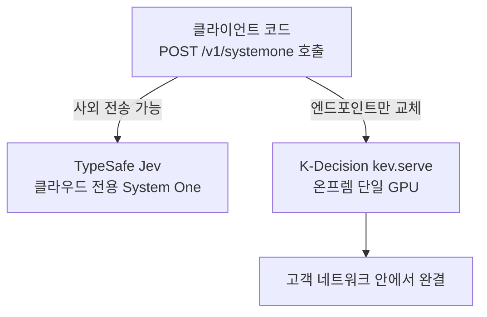
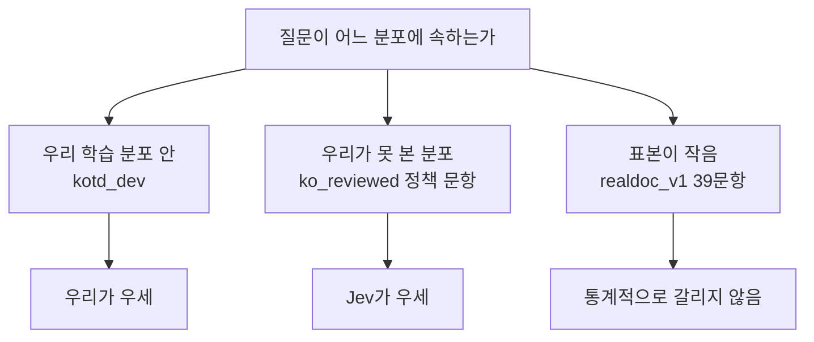

한국 금융·공공·보험 기업에서 의사결정 API를 검토하는 엔지니어링 리드를 위한 글입니다. 결론부터 말하면, TypeSafe의 Jev가 상태와 타입드 질문을 받아 보정된 확률을 내는 디시전 모델이라는 카테고리를 처음 만들었고 ThakiCloud는 같은 API 형태를 노출하는 한국어 온프렘 버전을 만들어 같은 질문으로 머리를 맞대 봤습니다. 이기는 곳도 있고 지는 곳도 있었으며 아직 재지 못한 것도 분명히 남아 있습니다.

이 모델을 어떻게 학습시켰고 대조쌍이 무엇을 바꿨는지는 지난 글 [4B 모델에게 법령 속 숫자 판단을 가르친 방법](/tech-blog/ko/research/k-decision-4b-numeric-contrast-pairs/)에서 다뤘습니다. 이 글은 그 모델을 Jev와 나란히 놓고 본 결과입니다.


*글의 핵심 개념을 형상화했습니다.*

## 디시전 모델이라는 새 카테고리

Jev는 2026년 9월 15일 TypeSafe가 공개한 System One이라는 디시전 모델입니다. 자유 텍스트를 생성하는 대신, 문서 상태 하나와 타입드 질문 여러 개를 받아 보정된 확률을 직접 출력합니다. 질문 유형은 세 가지입니다. `choice`는 여러 선택지 중 하나를 고르는 질문이고 `noul`은 라벨마다 예 또는 아니오를 독립적으로 매기는 질문이며, `score`는 서수형 또는 수치형 척도에서 한 단계를 고르는 질문입니다. Jev는 클라우드 API로만 제공되고, 오픈소스 클론도 여럿 나왔지만 우리가 확인한 것은 전부 영어용이었습니다.

이 카테고리가 중요한 이유는 형식에 있습니다. 자유 텍스트 생성 모델은 답을 내놓아도 그 답이 얼마나 확실한지 감사 로그에 남기기 어렵습니다. "예로 보입니다"라는 문장 하나로는 그 판정이 51퍼센트짜리인지 99퍼센트짜리인지 구분할 수 없고 사람이 검토할 때도 텍스트를 다시 읽고 재해석해야 합니다. 반면 디시전 모델은 애초에 질문 유형을 미리 정하고 확률 분포로만 답하기 때문에, 판정과 신뢰도가 같은 자리에 함께 기록됩니다. 규정을 근거로 판단을 내려야 하는 자동화 워크플로에서 이 차이는 작지 않습니다.

Jev가 이 카테고리를 처음 만들었다는 사실 자체도 짚어 둘 만합니다. 이미 영어권에서는 몇몇 오픈소스 클론이 등장해 같은 System One 형식을 재현하려는 시도가 있었지만, 전부 영어 문서를 대상으로 설계되었습니다. 한국어 법령이나 행정 문서, 특히 한자어 기반 전문 용어와 조사·어미가 촘촘히 얽힌 문장 구조를 다루는 버전은 아직 없었습니다. K-Decision이 채우려는 자리가 바로 여기입니다.

<!-- nlm-visual -->

*NotebookLM이 소스를 종합해 생성한 인포그래픽입니다.*

## API 모양을 그대로 맞춘 이유

ThakiCloud는 이 카테고리의 한국어·온프렘 버전을 K-Decision이라는 이름으로 만들었습니다. 모델은 Jared Palmer의 오픈 레시피(`jaredpalmer/kev-4b`)를 Qwen3.5-4B-Base 위에 LoRA rank 16과 포인터 헤드를 얹어 재현한 kd-4b-ko-v0이고, 가중치는 허깅페이스 `ThakiCloud/kd-4b-ko-v0`에 공개되어 있습니다. 권장 어댑터는 `kotdaihubv2num2-s1`입니다.

여기서 의도적으로 지킨 설계 원칙이 하나 있습니다. 서빙 레이어인 `kev.serve`가 `POST /v1/systemone`을 노출하도록 만들어서, Jev를 호출하도록 작성된 코드가 엔드포인트 URL 하나만 바꾸면 그대로 우리 모델을 호출할 수 있게 했습니다. 요청과 응답은 실제로 아래 모양입니다. 서버 코드(`kev/api.py`)의 스키마를 그대로 옮긴 예시입니다.

```json
POST /v1/systemone
{
  "state": {"document": "제61조(노령연금 수급권자) ① 가입기간이 10년 이상인 ..."},
  "questions": {
    "q1": {"type": "choice", "instructions": "이 사례의 연금 지급 개시 시점은?",
           "criteria": {"a": "60세", "b": "62세", "c": "65세"}},
    "q2": {"type": "noul", "instructions": "지급 연기 신청이 가능한가?"}
  }
}

→ {"q1": {"type": "choice", "choice": "c", "confidence": 0.93,
          "probabilities": {"a": 0.02, "b": 0.05, "c": 0.93}},
   "q2": {"type": "noul", "noul": 0.97}}
```
*예시 값은 설명용입니다. 필드 이름과 구조는 서버 스키마 그대로입니다.*

한 요청에 문서 상태 하나와 질문 여러 개가 들어가고, 답은 질문마다 확률 분포로 돌아옵니다. 이 서버 형식은 Kev 원작 레시피가 TypeSafe의 System One 형식(`POST /v1/systemone`)을 따르도록 설계한 것을 그대로 물려받았습니다. 그래서 TypeSafe API를 직접 부르는 코드라면 주소만 바꾸면 됩니다. 한 가지 차이는 짚어 둡니다. 이번 비교에서 Jev는 Vercel AI Gateway를 통해 불렀는데, 그 경로는 `/v1/evaluate`라는 다른 래핑을 쓰고 눈금이 10단계를 넘는 `score` 질문을 받지 않습니다. 게이트웨이를 쓰는 코드라면 경로와 응답 파싱을 한 번 손봐야 합니다.


*같은 요청 형태를 두 목적지 중 어디로 보낼지는 배포 환경이 결정합니다. 코드는 그대로입니다.*


## 같은 질문, 세 세트에서 머리를 맞대다

세 세트에서 같은 질문을 우리 모델(세 학습 시드)과 Jev(무료 구간 제약으로 각 세트 1회 실행)에 동시에 던졌습니다. 신뢰구간은 문서와 우리 쪽 시드를 함께 재표집한 부트스트랩입니다.

| 세트 | 우리 (num2) | Jev | 차이 |
|---|---|---|---|
| 한국 법령 발췌 realdoc_v1, Jev가 응답한 39문항 | 98.8% | 97.4% | +2.6%p [0, 8.6], 유의하지 않음(약 1문항 차) |
| 한국어 정책 문항 ko_reviewed, 119문항 | 83.1% | 93.3% | -8.4%p [-14.9, -2.5], Jev가 유의하게 우세 |
| 한국어 벤치마크 KoBEST+KLUE kotd_dev, 1,981문항 | 87.7% | 81.8% | +6.0%p [4.2, 7.8], 단 우리 모델의 학습 분포 안이라 유리한 비교 |

첫 번째 줄부터 짚어야 할 함정이 있습니다. realdoc_v1의 `score` 문항 중 서수 단계가 10개를 넘는 질문은 Jev의 게이트웨이가 거부했습니다. 그래서 법령 발췌 57문항 중 39문항만 비교할 수 있었고, 나머지 18문항은 애초에 대결 자체가 성립하지 않았습니다. 이전에 잰 다른 프로필에서도 Jev가 가장 약했던 유형은 `score`였습니다(메타 질문 62개에서 71.4%). 우리 쪽 num2 어댑터가 정확히 겨냥한 것도 `score` 유형의 숫자 판단이었습니다. 별도로 봉인한 법령 문서 322문항 세트에서 num2는 base 대비 13.8퍼센트포인트를 올렸고(신뢰구간 [10.2, 17.6]), 같은 크기 대조군과의 격차가 끝까지 남은 곳이 `score` 유형이었다는 것을 지난 글에서 확인했습니다.

세 번째 줄도 솔직히 밝혀야 합니다. kotd_dev는 KoBEST와 KLUE를 타입드 디시전 형식으로 바꾼 세트이고, 우리 모델은 이 데이터를 학습에 직접 사용했습니다. 그래서 여기서의 +6.0퍼센트포인트는 우리에게 구조적으로 유리한 비교입니다. 공정하게 읽으려면 두 번째 줄, 즉 우리가 학습에 쓰지 않은 정책 문항 세트를 더 무겁게 봐야 합니다.

그리고 그 두 번째 줄에서는 Jev가 이겼습니다. ko_reviewed 119문항에서 우리는 83.1퍼센트, Jev는 93.3퍼센트였고 신뢰구간이 0을 넘지 않아 유의합니다. 이 격차를 순순히 인정하는 것이 이 글의 요지 중 하나입니다.

세 세트를 한 줄로 요약하면 이렇습니다. 우리가 학습에 직접 쓴 분포에서는 우리가 이기고, 우리가 못 본 정책 문항 분포에서는 Jev가 이기고, 표본이 작아 판정력이 약한 곳에서는 통계적으로 갈리지 않습니다. 이 패턴은 놀랍지 않습니다. 학습 데이터가 다루는 범위가 다르면 그 범위 밖에서의 성능도 다르게 나타나는 것이 자연스럽기 때문입니다. 문제는 이 패턴 자체가 아니라, 그 범위를 얼마나 빨리 넓힐 수 있느냐입니다.


*세 세트의 결과를 학습 분포와의 거리로 읽은 우리의 해석입니다. 인과는 아직 검증하지 않았습니다.*


## 격차가 용량 문제인지 데이터 커버리지 문제인지

이 격차가 모델 용량의 한계인지, 아니면 단순히 그 종류의 문서를 충분히 못 봐서인지는 구분할 수 있는 단서가 하나 있습니다. ko_reviewed와 같은 생성기로 만든 소규모 합성 정책 세트로 학습한 다른 어댑터, kotdsyn-s1을 같은 ko_reviewed 세트에 돌리면 93.5퍼센트가 나와 Jev의 93.3퍼센트와 사실상 같습니다(+1.7%p, 신뢰구간 [-4.1, 7.4]).

이것만으로 용량 문제가 아니라고 확정할 수는 없지만, 데이터 커버리지가 격차의 큰 부분을 설명한다는 가설을 뒷받침하는 증거는 됩니다. num2 어댑터가 정책 문항과 비슷한 결을 가진 데이터를 더 봤다면 그 격차의 상당 부분이 줄어들었을 가능성이 있다는 뜻입니다. 다만 이것은 아직 가설이라는 점을 분명히 해 둡니다.

이 대조는 지난 글에서 확인한 패턴과도 맞물립니다. num2는 법령 발췌 322문항 세트에서 base 대비 뚜렷하게 올랐지만, 대조군과의 차이는 주로 `score` 유형, 즉 숫자를 짚어야 하는 질문에서 벌어졌습니다. ko_reviewed는 `score` 유형만이 아니라 정책 문서 전반의 문체와 논리 구조를 요구하는 세트이고, num2가 그 세트에서 약한 것은 애초에 그 세트와 결이 맞는 학습 데이터를 충분히 보지 못했기 때문일 가능성이 큽니다. kotdsyn-s1의 결과는 그 결을 조금이라도 맞춰 주면 격차가 거의 사라진다는 것을 보여 주는 첫 신호입니다.


## 아직 재지 못한 것

가장 결정적인 비교는 아직 하지 못했습니다. Jev를 우리의 봉인된 법령 문서 322문항 세트, realdoc_v2에 돌려 보는 것입니다. 이 세트는 76개 법령·25개 도메인에서 발췌한 문서를 파일·정답·마스크·채점기까지 SHA-256으로 고정해 둔 세트이고, 지난 글에서 우리 팔들 사이의 비교는 이미 이 세트로 끝냈습니다. Jev를 같은 세트에 돌려야 두 시스템을 가장 단단한 기준 위에서 비교할 수 있는데, 이 글을 쓰는 시점에는 아직 그 실행이 남아 있습니다. 다음으로 해야 할 측정이 바로 이것입니다.

지연시간은 이번에 실측했습니다. H100 한 장에서 bf16으로 서빙하고 봉인 법령셋 115건(요청마다 법령 발췌 한 건에 질문 약 세 개)을 한 번에 하나씩 순서대로 보냈더니, 커널 워밍업이 끝난 뒤 P50 115ms, P95 189ms가 나왔습니다. 워밍업이 섞인 첫 패스는 P50 210ms였고, fp32로 서빙하면 P50 358ms입니다. 처음 세운 목표는 고객 망 안에서 P50 100ms 이하였는데, H100 bf16 기준으로 15ms 정도 모자랍니다. bf16으로 바꿔도 정확도는 322문항 중 두 문항 차이(fp32 0.929, bf16 0.922)였습니다. 이 수치는 동시 요청 없이 한 줄로 흘린 단일 스트림 지연이며 처리량이 아닙니다. Jev 쪽 지연시간은 이 글에서 아예 인용하지 않습니다. 우리가 접근한 것은 요청 수가 제한된 무료 구간이었고 그 조건에서 잰 지연시간은 클라우드 API라는 사실 이상의 의미를 줄 수 없기 때문입니다.


## 왜 온프렘이 선택지가 아니라 조건인가

한국의 금융·보험·공공·국방 분야 고객 다수는 원문 그대로든 발췌본이든 문서를 사외로 전송할 수 없습니다. Jev는 지금 클라우드 API로만 존재하기 때문에, 이 조건을 가진 고객에게는 애초에 후보가 될 수 없습니다. K-Decision은 GPU 한 대 위에서 고객 네트워크 안에 완결되도록 설계했고, 이 제약이 API 호환성만큼이나 이 프로젝트의 존재 이유입니다.

데이터 쪽에도 비슷한 제약이 하나 걸려 있습니다. AI 허브(한국지능정보사회진흥원) 데이터로 학습한 가중치는 공개할 수 있지만, 그 데이터 자체는 국외로 반출할 수 없습니다. 그래서 K-Decision은 가중치만 공개하고 학습에 쓴 일부 데이터셋은 재배포하지 않습니다. 온프렘 배포와 데이터 반출 제약은 별개의 이유에서 나왔지만, 결과적으로 같은 방향을 가리킵니다.

이 두 제약을 나란히 놓고 보면, K-Decision이 존재해야 하는 이유가 단순히 "한국어를 더 잘해서"가 아니라는 점이 분명해집니다. 같은 API 형태의 모델을 클라우드 밖에서, 국외로 나갈 수 없는 데이터로 학습시키고, 고객 네트워크 안에서만 완결되게 서빙하는 것 자체가 이 카테고리의 한국 시장 버전이 갖춰야 할 최소 조건입니다. 정확도 비교는 그 조건을 만족한 다음에 따라오는 두 번째 질문입니다.

## ThakiCloud 제품 적용 시사점

이 작업은 Paxis를 중심에 두고 세 제품 렌즈로 이어집니다. Paxis는 기업의 디지털 업무를 AI 에이전트로 자동화하는 ThakiCloud의 중심 제품이고, 그런 에이전트가 규정을 근거로 판단을 내리려면 자유 텍스트 대신 보정된 확률과 근거를 감사 로그에 남겨야 합니다. K-Decision 같은 디시전 모델을 Paxis 에이전트의 판정 레이어에 배치하면, Jev가 만든 것과 같은 API 형태로 판정 근거와 신뢰도를 함께 남기면서도 사외로 문서를 보낼 필요가 없습니다.

Maxis 렌즈에서 보면 이런 소형 디시전 모델을 고객 네트워크 안에서 직접 학습시키는 것 자체가 하나의 제품 기능입니다. Maxis는 학습·파인튜닝·증류를 고객 네트워크 내부에서 수행할 수 있게 하고, K-Decision의 학습 파이프라인이 그 구체적인 사례입니다. Metis 렌즈에서는 4B 모델에 LoRA 어댑터를 얹은 구성이 서빙 비용을 낮게 유지합니다. Aegis 렌즈는 이 모든 것을 완전히 폐쇄된 네트워크에서 돌려야 하는 고객, 즉 금융·보험·공공·국방처럼 문서를 사외로 보낼 수 없는 고객을 직접 겨냥합니다.

## 한계와 다음 단계

이 비교를 그대로 받아들이기 전에 몇 가지를 분명히 해야 합니다. 첫째, Jev와의 비교는 대부분 각 세트당 1회 실행에 기반합니다. 우리 쪽은 세 학습 시드로 재지만 Jev는 무료 구간 제약으로 재실행하지 못했고 이는 Jev 쪽 신뢰구간을 사실상 비워 둔 채 비교한 것입니다. 둘째, ko_reviewed에서의 패배는 실재하고 통계적으로 유의합니다. 이것을 데이터로 메울 수 있다는 가설은 아직 가설일 뿐 검증되지 않았습니다. 셋째, 가장 결정적인 비교인 realdoc_v2 위에서의 Jev 실행이 아직 없습니다. 이 글의 결론은 그 측정이 나오기 전까지는 잠정적입니다. 넷째, 지연시간은 우리 쪽만 H100 단일 스트림으로 쟀고, Jev 쪽은 비교 가능한 조건에서 재지 않았습니다. 그래서 지연시간은 우열이 아니라 우리 쪽 절대값으로만 읽어야 합니다.

다음으로 할 일은 명확합니다. Jev를 realdoc_v2에 돌려 봉인된 기준 위에서 다시 비교하고, ko_reviewed류 정책 문항 데이터를 num2 학습층에 추가해 격차가 실제로 좁혀지는지 확인하는 것입니다. 지연시간은 P50 100ms 목표까지 15ms가 남았으니 서빙 최적화도 뒤따릅니다. 이 두 가지가 채워지기 전까지는, 이 글에 실린 비교를 최종 판정이 아니라 중간 보고로 읽는 것이 맞습니다.

이 모델을 고객이 실제로 자기 문서로 학습시키고 서빙하는 파이프라인이 어떻게 생겼는지는 [Maxis로 학습하고 Metis로 서빙하는 한국형 결정 모델](/tech-blog/ko/llmops/k-decision-maxis-metis-pipeline/)에서 이어집니다.

## 참고 자료

본문에 언급된 공개 자료입니다.

- TypeSafe · [Introducing System One Models & Jev](https://typesafe.ai/blog/introducing-system-one-models-and-jev)
- Jared Palmer · [jaredpalmer/kev-4b (Hugging Face)](https://huggingface.co/jaredpalmer/kev-4b)
- ThakiCloud · [ThakiCloud/kd-4b-ko-v0 (Hugging Face)](https://huggingface.co/ThakiCloud/kd-4b-ko-v0)
- Qwen3.5-4B-Base · [Qwen/Qwen3.5-4B-Base (Hugging Face)](https://huggingface.co/Qwen/Qwen3.5-4B-Base)
- KoBEST · [KOBEST: Korean Balanced Evaluation of Significant Tasks (arXiv)](https://arxiv.org/abs/2204.04541)
- KLUE · [KLUE-benchmark 공식 저장소 (GitHub)](https://github.com/klue-benchmark/klue)
- AI 허브(한국지능정보사회진흥원) · [법률·규정 텍스트 분석 데이터 (AI Hub)](https://www.aihub.or.kr/aihubdata/data/view.do?currMenu=115&topMenu=100&aihubDataSe=data&dataSetSn=71723)

<!-- nlm-visual -->

*NotebookLM이 소스를 종합해 생성한 인포그래픽입니다.*
