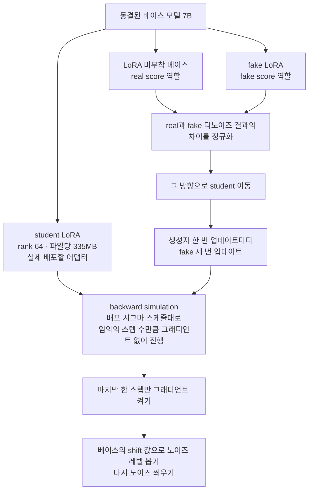

이미지 생성 모델을 서비스에 올려놓고 GPU 비용을 걱정하는 팀을 위한 글입니다. Qwen-Image-2.1에 LoRA 어댑터 하나만 얹으면 40스텝을 8스텝, 심지어 5스텝까지 줄이면서도 품질은 원본보다 오히려 나아집니다. 저희는 이 어댑터 두 종(8스텝, 5스텝)을 [Hugging Face](https://huggingface.co/ThakiCloud/Qwen-Image-2.1-FewStep-v0.1)에 공개했습니다. 관련 자료는 [컬렉션](https://huggingface.co/collections/ThakiCloud/qwen-image-21-few-step-distillation-6ab84f9aeaeed75d3a78e38a)에 함께 정리해 두었습니다.

*글의 핵심 개념을 형상화했습니다.*

## 무엇을 공개했는가

Qwen-Image-2.1은 70억 파라미터 단일 스트림 DiT와 Qwen3-VL-8B 텍스트 인코더로 구성된 이미지 생성 모델입니다. 하나의 체크포인트로 텍스트 기반 생성과 최대 10장의 레퍼런스를 활용한 편집을 동시에 처리합니다. 저희가 만든 것은 이 모델을 그대로 둔 채, rank 64에 파일당 335MB인 LoRA 어댑터 두 개를 새로 학습해 얹은 것입니다. 하나는 8스텝용, 하나는 5스텝용입니다. 라이선스는 Qwen Research License를 따르는 비상업용입니다.

<!-- nlm-visual -->

*NotebookLM이 소스를 종합해 생성한 인포그래픽입니다.*

## 왜 이 문제가 흥미로운가

이 작업을 시작한 계기는 PrunaAI가 9월 23일 공개한 Pruna-Qwen-Image-2.1이었습니다. 5스텝과 8스텝 LoRA로 최대 6.3배 속도 향상을 주장했습니다. 하지만 공개된 정보는 "DMD 기반"이라는 한 줄과 v0.1이 베이스 품질에 못 미친다는 언급뿐이었습니다. 품질 수치는 없었습니다. 저희는 공개된 safetensors 헤더를 직접 열어봤습니다. 그 결과 rank 64에 블록당 타깃 모듈 7개까지 저희 구성과 동일하다는 것을 확인했습니다. 다만 8스텝 스케줄에 쓰인 시그마 값 목록을 계산해 보니 이는 shift 파라미터 2를 적용한 균등 그리드였습니다. 이 값은 1024x1024 해상도에서 베이스 스케줄러가 기본으로 쓰는 다이나믹 시프트 값(exp(mu)=2.0)과 정확히 일치했습니다. 즉 별도로 최적화한 스케줄이 아니라 기존 스케줄러의 기본값을 그대로 가져온 것이었습니다.

여기서 한 가지 더 짚을 부분이 있습니다. Qwen-Image-2.1의 공식 권장 설정은 이미 40스텝에 CFG를 끈 상태(true_cfg_scale 1)입니다. 베이스 모델 자체가 이미 가이던스 증류를 거쳤다는 뜻입니다. 그래서 "CFG 없이 동작한다"는 특징은 차별점이 되지 못합니다. 오히려 진짜 비용은 다른 곳에 있습니다. 티처 모델이 매 호출마다 forward pass를 한 번 수행해야 한다는 사실, 그리고 그 40번의 반복을 몇 번으로 줄이느냐가 실제로 풀어야 할 문제입니다.

## 어떻게 학습했는가

저희는 diffusers 위에 자체 DMD2 트레이너를 구현했습니다. 70억 파라미터짜리 베이스 모델 하나를 얼려둔 채, 그 위에 두 개의 LoRA 브랜치를 올립니다. 하나는 실제로 배포할 student, 다른 하나는 fake score를 추정하는 브랜치입니다. LoRA를 붙이지 않은 베이스 모델 자체는 real score 역할을 합니다.

핵심은 backward simulation입니다. student를 배포 시 사용할 시그마 스케줄대로 임의의 스텝 수만큼 그래디언트 없이 굴린 다음, 마지막 한 스텝만 그래디언트를 켜서 진행합니다. 그리고 베이스 모델의 shift 값으로 뽑은 노이즈 레벨로 다시 노이즈를 씌운 뒤, fake와 real 두 브랜치가 만든 디노이즈 결과의 차이를 정규화해 그 방향으로 student를 이동시킵니다. fake 브랜치는 생성자가 한 번 업데이트될 때마다 세 번 업데이트됩니다.

이 흐름을 한눈에 정리하면 다음과 같습니다.

전체 학습은 1,200번의 생성자 업데이트, 글로벌 배치 4, 해상도 1024제곱으로 진행했습니다. B200 GPU 한 장에 42GB 메모리로 들어갔습니다. 8스텝 v2 버전은 B200 한 장으로 2.7시간, 최초의 8스텝 실험은 B200 두 장으로 1.5시간이 걸렸습니다.

학습 프롬프트는 총 3만 3천 개를 썼습니다. FLUX 스타일의 상세한 MIT 라이선스 프롬프트, Stable Diffusion 스타일의 짧은 프롬프트, 그리고 영어와 한국어, 중국어로 된 텍스트 렌더링 합성 프롬프트를 섞었습니다. v1에서는 텍스트 렌더링 프롬프트 비중이 24퍼센트였는데, "insight" 같은 추상적인 단어를 프롬프트로 주면 모델이 뜬금없는 텍스트를 그림 안에 그려 넣는 문제가 있었습니다. v2에서는 이 비중을 8퍼센트로 낮춰 해결했습니다.

## 버그 하나 짧게 남깁니다

학습 중 한 번은 student 브랜치가 그래디언트를 전혀 받지 못하는 현상이 있었습니다. 원인은 torch.autocast였습니다. autocast는 리프 가중치의 bf16 캐스팅 결과를 해당 autocast 영역 전체에서 캐시해 둡니다. 그런데 no_grad 아래에서 실행되는 티처, 즉 rollout 호출이 먼저 캐스팅을 한 번 수행하면, 그 캐시된 텐서가 이후 student 계산에도 그대로 재사용되면서 그래프가 조용히 끊겨버립니다. 호출마다 명시적으로 캐스팅을 다시 하도록 고쳐서 해결했습니다.

## 실제로 얼마나 좋아졌는가

평가는 PartiPrompts에서 층화 추출한 200개, DrawBench 200개, 영어와 한국어와 중국어 텍스트 렌더링 100개를 합쳐 총 500개 프롬프트로 진행했습니다. 해상도는 1024제곱, 프롬프트마다 같은 시드를 고정했습니다. 측정은 B200 한 장에서 진행했습니다. 지표는 PickScore, CLIP-H, 그리고 Qwen3-VL-8B로 판정한 OCR 정확도입니다.

| 구성 | PickScore | CLIP-H | OCR 정확도 | CER |
|---|---|---|---|---|
| 베이스 40스텝 | 22.31 | 35.02 | 95% | 3.2% |
| 베이스 8스텝(어댑터 없음) | 21.47 | 34.24 | 81% | 9.6% |
| Pruna 8스텝 | 22.02 | 35.00 | 91% | 4.4% |
| 저희 8스텝(v2) | 22.47 | 34.66 | 99% | 0.5% |
| 베이스 5스텝 | 21.35 | 34.29 | 82% | 10.2% |
| Pruna 5스텝 | 21.94 | 35.10 | 87% | 6.2% |
| 저희 5스텝 | 22.34 | 34.35 | 99% | 0.1% |

저희 8스텝 모델은 PickScore 기준으로 Pruna 8스텝을 68퍼센트의 확률로 이겼습니다. 40스텝 베이스 모델을 상대로도 59퍼센트의 확률로 앞섰습니다. 부트스트랩 95퍼센트 신뢰구간으로 보면 Pruna 8스텝 대비 우위는 0.38에서 0.53 사이였습니다. 베이스 40스텝 대비 우위는 0.09에서 0.23 사이였습니다. 저희 5스텝 모델은 PickScore 기준으로 Pruna 8스텝을 69퍼센트의 확률로 이겼습니다. 스텝을 3개 덜 쓰고도 경쟁 모델의 8스텝 결과를 능가했다는 뜻입니다. 같은 스텝 수끼리 비교해도 결과는 같은 방향입니다. 프롬프트별 PickScore 승률로 보면 8스텝 모델은 Pruna 8스텝 대비 68퍼센트, 5스텝 모델은 Pruna 5스텝 대비 69퍼센트를 기록했습니다.

## 속도는 어느 정도인가

B200 한 장, 해상도 1024제곱, 배치 1, bf16 기준으로 텍스트 인코딩과 VAE 디코딩까지 포함해 측정했습니다.

| 구성 | 이미지당 시간 | 배속 |
|---|---|---|
| 베이스 40스텝 | 3.69초 | 1.0배 |
| 8스텝, 커널 미융합 | 0.92초 | 4.0배 |
| 8스텝, 커널 융합 | 0.82초 | 4.5배 |
| 8스텝, 융합 + torch.compile | 0.66초 | 5.5배 |
| 5스텝, 커널 미융합 | 0.62초 | 5.9배 |
| 5스텝, 커널 융합 | 0.56초 | 6.6배 |
| 5스텝, 융합 + torch.compile | 0.45초 | 8.2배 |

여기서 짚어둘 부분이 있습니다. 커널을 융합하지 않은 순수 속도만 보면 저희 수치(0.92초, 0.62초)는 같은 하네스로 잰 Pruna 수치(0.94초, 0.64초)와 사실상 같습니다. 그 이상의 속도 향상, 즉 4.0배에서 5.5배로, 5.9배에서 8.2배로 올라가는 구간은 커널 융합과 torch.compile에서 나온 것입니다. 이 최적화는 저희 어댑터든 Pruna 어댑터든 어떤 LoRA를 쓰더라도 똑같이 적용할 수 있습니다.

## 솔직하게 남는 약점

CLIP-H는 Pruna와 베이스 모델보다 0.3에서 0.8 정도 낮게 나옵니다. PartiPrompts 서브셋에서는 32.95 대 32.93으로 사실상 동률이었습니다. 다만 DrawBench와 텍스트 렌더링 구간에서는 격차가 벌어졌습니다. PickScore가 DMD 계열 학습이 만들어내는 높은 대비를 선호하는 경향이 있다는 점도 감안해야 합니다. OCR 평가는 템플릿과 단어 풀을 학습 프롬프트와 일부 공유하고 있습니다. 그래서 텍스트 렌더링 점수 향상이 어느 정도는 학습 분포 안에서 나온 결과일 수 있습니다. 편집 기능, 즉 다중 레퍼런스를 활용하는 경로는 이번 학습과 평가에 포함하지 않았습니다. 해상도는 1024제곱 한 가지만 검증했습니다. 평가도 전부 자동화된 지표로만 이루어졌습니다. 라이선스도 비상업용입니다.

## ThakiCloud 관점

저희 Metis 추론 플랫폼에서 보면 이 결과는 같은 GPU 한 장으로 이미지당 3.69초 걸리던 작업을 0.45에서 0.66초로 줄인다는 뜻입니다. 같은 시간 동안 GPU 한 장이 처리할 수 있는 이미지 수가 5배에서 8배로 늘어나는 셈입니다. 더 중요한 것은 이 학습 자체가 비쌌던 작업이 아니라는 점입니다. GPU 한 장으로 몇 시간이면 끝납니다. 이 레시피는 다음에 새로운 이미지 모델이 나왔을 때도 그대로 재사용할 수 있습니다. 다만 상업적으로 서빙하려면 별도의 Qwen 라이선스 협의가 필요하다는 점은 분명히 해두어야 합니다.

## 다음 단계

CLIP-H 격차를 줄이기 위해 real score 기반 CFG 증강을 추가하는 실험을 준비 중입니다. 편집 기능에 대한 정식 평가와, 긴 텍스트 렌더링을 다루는 LongText-Bench 평가도 다음 순서로 계획하고 있습니다.

<!-- nlm-visual -->

*NotebookLM이 소스를 종합해 생성한 인포그래픽입니다.*
