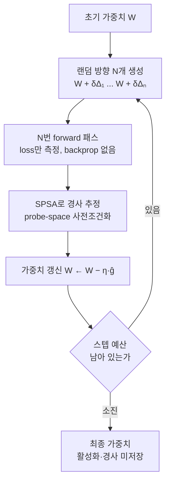

*활성화·경사·옵티마이저 상태를 저장하지 않는 forward-only 학습을 형상화했습니다.*

> 📄 **심층 리뷰 전문(DOCX)**: 이 논문의 상세 피어리뷰를 [Google Drive에서 다운로드](https://drive.google.com/file/d/1bnsK_ar3q_a9JMWakJ9eGADVrb2OfRo9/view)할 수 있습니다.

## 왜 읽어야 하나

GPU에서 모델을 학습시키는 엔지니어, "이 작업은 이 카드로 들어가는가"를 메모리 수치로 판단하는 인프라 책임자라면 이 글이 해당합니다. 결론을 먼저 드립니다. Zero-order 최적화(ZOO)는 이제 "노트북에서 LLM을 finetune하는 마술"이 아니라, **메모리 예산을 다시 계산하는 접근**이 됐습니다. 이번 주 arXiv에 올라온 Stanford의 두 논문은, backprop 없이 A100 하나에서 OPT-30B를 in-place 학습하는 경로(2609.38095)와, expert sharding으로 ZOO pretraining을 스케일링하는 경로(2609.37899)를 각각 수치로 보여줍니다. 다만 아직 frontier-scale pretraining을 backprop에서 대체한 증거는 아닙니다. ZOO가 바꾸는 것은 "누가 학습하는가"가 아니라 "학습이 어느 메모리에 들어가는가"입니다.

## 개요

Stanford CRFM의 연구자 Samip Dahal(@industriaalist)은 9월 28일 X에, transformer를 backprop 없이 zero-order optimization으로 pretrain하는 방법을 찾았다고 썼습니다. 같은 트윗에서는 "최적화 연구의 많은 핵심 가정은 완전히 틀렸다고 주장하며, (paper out soon)"이라고 예고했습니다. ([트윗](https://x.com/industriaalist/status/2104664427396276565))

이 트윗 하루 뒤, 9월 29일에 같은 주제에서 두 편의 논문이 arXiv에 공개됐습니다.

- [Probe-Space Preconditioning for Fast and Stable Zero-Order Training](https://arxiv.org/abs/2609.38095)(arXiv 2609.38095), 저자 Francois Chaubard, Mykel J. Kochenderfer, Chris Ré
- [Scaling Zero-Order Pretraining through Model Sharding](https://arxiv.org/abs/2609.37899)(arXiv 2609.37899), 같은 저자 3인

두 논문 모두 저자가 Stanford 소속이며, ZOO가 forward-only 하드웨어와 비미분 가능 손실에 적용 가능하다는 전제를 공유합니다. 이해를 돕기 위해, zero-order optimization이 무엇인지부터 짚어둡니다.

## zero-order optimization이란

딥러닝의 표준 학습, backpropagation은 **1차 도함수(경사)**를 사용합니다. forward로 활성화와 loss를 내고, backward로 그 loss를 가중치에 대한 경사로 전파한 뒤 옵티마이저가 가중치를 갱신합니다. 경사를 계산한다는 것은, 계산 그래프 전체를 다시 한 번 훑어가며 모든 연산자의 derivative를 적용한다는 뜻입니다. 이 과정이 활성화 저장, 경사 텐서, 옵티마이저 상태(Adam은 가중치당 1, 2차 모멘텀)라는 메모리 세 가지로 돌아옵니다.

Zero-order optimization은 **loss 함수 값을 측정하는 것만으로 경사를 추정**합니다. 가중치에 작은 랜덤 교란(perturbation)을 걸어 loss가 어떻게 바뀌는지를 보고, 그 변화로부터 경사의 방향을 추정합니다. 도함수를 계산하지 않으므로 계산 그래프의 backward 경로가 필요 없고, 결과적으로 활성화·경사·옵티마이저 상태 세 메모리가 모두 사라집니다. 이것이 "inference-mode 학습"이라는 말의 뜻입니다.

대표적 알고리즘은 SPSA(Simultaneous Perturbation Stochastic Approximation, Spall 1992)입니다. 한 스텝에 두 번의 forward(교란 +1, -1)만으로 전 파라미터의 경사 추정치를 얻는다는 것은 제어 이론의 확률적 근사(stochastic approximation)에서 온 결과입니다. 최근에는 MeZO(Malladi et al., 2023)가 LLM을 backprop 없이 fine-tune하는 경로를 보여 주었고, ZOO가 "장난기가 아니라 실용 경로"로 취급되기 시작했습니다. 다만 ZOO에는 구조적 장애가 하나 있습니다. **경사 추정의 분산이 교란하는 파라미터 차원에 비례해 커진다**는 것입니다. 모델이 10배 커지면, 같은 품질의 경사 추정치를 얻으려면 필요한 프로브(교란 방향) 수가 기하급수적으로 늘어난다는 뜻입니다. 이번 두 논문은 각각 이 장애의 "수렴 속도"(2609.38095)와 "스케일링"(2609.37899)에 답하는 것입니다. Samip의 트윗이 정확히 이 두 논문을 가리키는 것은 확인되지 않았습니다(트윗은 "paper out soon"만 명시). 다만 같은 방향, 같은 시기, 같은 학내 생태계의 공개 산출물로서, 이 글은 두 논문의 확인된 수치를 근거로 ZOO pretraining의 현재 위치를 읽습니다. Samip Dahal은 6월에 공개된 [q0: Primitives for Hyper-Epoch Pretraining](https://arxiv.org/abs/2606.03938)의 공동 저자이기도 합니다.

## backprop의 메모리 세금

두 논문의 출발점은 backprop의 메모리 비용입니다. 2609.38095의 abstract는 구체적인 수치를 줍니다. OPT-30B를 Adam으로 학습하려면 약 600GB의 GPU 메모리가 필요합니다(가정: batch size 8, sequence length 2048). 반면 ZOO는 **inference-mode로 학습**합니다. 같은 모델에 약 60GB. 저장할 활성화가 없고, 경사가 없고, 옵티마이저 상태가 없다는 뜻입니다.

이 격차가 중요한 이유는, 메모리가 트레이닝의 1차 제약인 현재 GPU 현실 때문입니다. 600GB는 여러 카드를 가로지르는 분산 학습이거나, checkpointing을 통한 trade-off(재계산)를 요구합니다. 60GB라면 "서빙으로 쓰는 카드에 학습을 얹는다"는 이야기가 메모리상 가능해집니다. ZOO의 또 다른 적용지는 forward-only 하드웨어와 비미분 가능 손실입니다. 경사를 계산할 수 없는 환경에서는 ZOO가 사실상 유일한 경로입니다.

*ZOO 학습 루프. backprop 경로(활성화 저장, 경사 전파, 옵티마이저 상태)가 모두 생략됩니다. 2609.38095의 1.5-SPSA는 D 단계에 "clean forward 1회"를 더해 대각 사전조건화 행렬을 만듭니다.*

## 첫 번째 논문: probe-space 사전조건화(1.5-SPSA)

2609.38095는 "ZOO의 수렴이 backprop에 뒤진다"는 격차를 메우기 위해 두 가지를 평가합니다.

첫째, **compute 배분의 재조정**입니다. 기존 ZOO 학습은 backprop과 같은 공식(많은 스텝, 작은 배치)을 그대로 답습해 왔습니다. 논문은 예산을 "많은 스텝"에서 "스텝은 적지만, 스텝당 프로브(교란)는 많은 큰 effective batch" 쪽으로 옮기면, 1SPSA가 기존 zero-order 방법(MeZO 등)보다 적은 학습 compute로 더 잘 수렴한다고 보입니다. 학습 스텝 수가 많을수록 좋다는 backprop의 직관이, ZOO에서는 성립하지 않는다는 것이 이 결과의 핵심입니다. Samip의 트윗이 "최적화 연구의 많은 핵심 가정은 완전히 틀렸다"고 한 대목에 가장 잘 부합하는 것이 바로 이 부분입니다.

둘째, **1.5-SPSA**입니다. 이름의 "1.5"는, 스텝마다 "clean forward"를 한 번 추가한다는 뜻입니다. 교란된 forward만 보는 1SPSA와 달리, 매 스텝 교란 없는 loss를 한 번 더 계산해 probe-space에서의 대각 사전조건화(diagonal preconditioner) 행렬을 만듭니다. 이 행렬이 곡률이 큰 방향의 업데이트를 down-weight하면서, 수렴 속도와 최종 수렴 품질을 동시에 끌어올립니다. 추가 비용은 스텝당 forward 한 번. 경사 전파(activations 저장 + backward 경로)가 아니라, forward 한 번이라는 대가입니다.

벤치마크는 Qwen3와 OPT 두 모델 계열의 post-training 데이터셋 6개에서 수행됐고, 기존 ZOO solver 대비 SOTA 결과를 "훨씬 적은 optimization 스텝"으로 냈다고 abstract가 말합니다. 가장 눈에 띄는 수치는 OPT-13B입니다. SST-2에서 1.5-SPSA는 MeZO도, backprop(BP)도 3.1% 높은 정확도를, **MeZO 100,000스텝 대비 70스텝**으로 달성합니다. 스텝 수 1,400분의 1의 비교 조건이므로, "per-step 품질"과 "per-compute 품질"은 별도로 봐야 합니다(한계 섹션에서 다룹니다).

실용 경로도 확보했습니다. 8-bit packing random generator, Triton fused unpack/apply 커널, distributed parallelism을 조합해 **A100이라는 commodity GPU에서 OPT-30B를 in-place 학습**하는 데까지 갔습니다. "서빙 GPU 하나에 30B 학습"이라는 수치가 나온 것입니다.

## 두 번째 논문: SOMA로 pretraining을 스케일링한다

2609.37899는 ZOO의 근본 장애, **경사 분산이 perturb한 차원에 비례해 커진다**는 문제에 답합니다. 모델이 클수록 프로브 수를 기하급수적으로 늘려야 해서, large-model 학습이 막혀 있습니다. 이 논문의 제안은 SOMA(Sharded Optimization Mixture of Assemblies)입니다.

- N개의 expert를 **독립적으로** 학습하되, 각각은 N개 데이터 클러스터에서 SPSA로 돌립니다.
- expert 사이에서 **경사·활성화·옵티마이저 상태를 교환하지 않습니다.**
- separable loss(각 expert의 손실이 분리된 형태)가 cross-expert perturb 노이즈를 제거합니다. trade-off는, 도메인 전반을 함께 학습하는 표현이 없다는 것입니다.

실험은 8.44M 파라미터 규모에서 150 aggregate GPU-hours(추정 RTX 5090 기준)로 수행됐고, 전체 실험은 약 80,000 GPU-hours를 추정합니다. 핵심 결과:

| 조건 | 8.44M test nats/byte | WikiText-103(frozen) |
|---|---|---|
| SOMA N=2, 프로브 64 | 1.76 | 2.07 |
| Monolithic SPSA, 프로브 64 / 256 / 1024 | 2.00~2.11 | 2.25~2.36 |
| EGGROLL | 2.21 | 2.49 |

논문은 고정된 separable objective에서 independent loss가 shared-loss 추정자의 상대 경사 분산을 약 1/N으로 줄인다는 것을 증명합니다. 같은 블록 크기로 N=4를 3개 seed로 돌린 결과, summed loss 대비 test loss가 1,000 update에서 0.035 nats/byte 낮았습니다.

흥미로운 대목은 추론 쪽입니다. 같은 모델 크기에서 top-k routing(k=4)을 쓰면, SOMA N=256이 2.36M tokens/s로 N=8(257k)의 약 9.19배를 냅니다(routing 포함). test loss도 1.68로 N=8의 1.71보다 낮습니다. 다만 N=256은 aggregate 학습 비용을 59.9배 씁니다.

이 구조가 MoE(Expert) 추론과 겹치는 이유는, 학습 때의 expert 독립성이 추론 때의 routing 효율로 직결되기 때문입니다. N이 클수록 개별 expert가 작아지고, top-k routing은 매 토큰마다 전체 파라미터의 일부(여기서는 4개 expert)만 활성화합니다. "model size"는 동일하더라도, 매 스텝에 실제로 계산되는 파라미터 수가 routing에 의해 제한되는 것입니다. SOMA는 이 routing 추론에 학습 시의 추가 비용(aggregate 59.9배)을 대가로 합니다. 학습 효율이 아니라 추론 대역폭을 사고하는 구조인 셈입니다. 두 논문 모두 학습·평가 코드와 체크포인트를 공개했습니다.

## ThakiCloud ai-platform 시사점

ThakiCloud의 ai-platform은 K8s 위에서 트레이닝 워크로드를 돌리는 쪽에 서 있습니다. ZOO는 그 관점에서 세 가지 계산의 변수를 바꿉니다.

첫째, **메모리-당 배치되는 작업 수.** Maxis(트레이닝 제품)의 관점에서, 같은 GPU에 backprop 학습 1개를 넣느냐 ZOO 학습 1개를 넣느냐는 메모리 footprint의 차입니다. 600GB 대 60GB는, "서빙으로 쓰는 카드를 학습 겸용으로 돌릴 수 있는가"를 결정하는 수치입니다. Kueue 기반 GPU 스케줄링에서 job의 memory spec은 queue admission의 1차 조건인데, ZOO는 그 spec을 한 수 아래로 끌어내립니다.

둘째, **forward-only 하드웨어의 실효성.** 경사를 계산하지 않는 학습은, 서빙 전용 하드웨어에 학습을 얹는 경로를 엿보입니다. "서빙과 학습을 같은 칩에서"는 ZOO가 성립하는 환경에서 메모리·전용도 모두 달라집니다. ai-platform의 온프레미스·소버린 환경은, 서빙과 학습을 분리하지 못하는 고객이 실제로 존재하는 곳입니다.

셋째, **SOMA의 통신 계약.** expert 사이 경사 교환이 없다는 것은, data-parallel 학습의 네트워크 비용을 재정의합니다. ZeRO 계열이 "상태를 나눠 저장한다"면, SOMA는 "원래 교환하지 않는다"입니다. 멀티노드 트레이닝에서 네트워크가 병목인 환경(소형 클러스터, 온프레미스)에서 이 차이는 실질적입니다.

## 한계 및 반론

이 글이 ZOO를 유리하게 본 부분을 반대로 점검합니다.

- **scale.** SOMA 실험은 8.44M 파라미터입니다. 2609.38095의 OPT-30B는 in-place 학습의 **메모리 경로**를 보여줄 뿐, 30B 이상 frontier-scale pretraining의 수학적 우위를 입증한 것이 아닙니다. "backprop 대체"는 아직 메모리의 이야기이지, 품질·규모의 이야기는 아닙니다.
- **transformer.** Samip의 트윗은 "transformer를 pretrain"이라 했지만, sharding 논문(SOMA)의 실험 객체는 LSTM expert입니다. transformer pretraining 자체의 ZO 결과는 2609.38095의 post-training(Qwen3, OPT)에 머무릅니다.
- **비교 조건.** 1.5-SPSA가 "MeZO보다 70스텝 vs 100,000스텝"이라지만, 스텝 수 자체가 다른 비교입니다. per-compute(동일 FLOPs·동일 메모리-시간)로 다시 재봐야 공정한 비교가 됩니다.
- **비용.** N=256의 9.19배 추론 대역폭은 59.9배 학습 비용과 함께 읽어야 합니다. "효율 개선"이 아니라 비용 구조의 재배치입니다.
- **메모리 비교의 기준선.** 600GB 대 60GB는 abstract가 명시한 가정(batch size 8, sequence length 2048, Adam)의 수치입니다. backprop 쪽에도 activation checkpointing(재계산), 8-bit optimizer state 같은 메모리 절감 기법이 존재하므로, 600GB는 "절감 기법을 쓰지 않은 기준선"입니다. ZOO의 이득은 절감된 backprop과 비교하면 이보다 작아질 수 있고, 그만큼 ZOO가 "유일한 경로"가 아니라 "메모리-compute trade-off의 한 축"으로 읽히는 것이 정직한 태도입니다.

## 정리

이번 주 Stanford에서 공개된 두 논문은, ZOO를 "fine-tuning의 niche"에서 "pretraining의 메모리 예산 변수"로 올려놓았습니다. A100 하나로 OPT-30B를 in-place 학습한다는 수치는, 서빙과 학습의 경계가 메모리에서 갈린다는 이야기입니다. expert sharding으로 경사 교환을 없앤 SOMA는, 네트워크가 병목인 소형 클러스터의 트레이닝 계약이 바뀔 수 있음을 보여줍니다. ThakiCloud의 관점에서 실무가 가져갈 것은 하나입니다. 다음 GPU 트레이닝 용량 계획에서, **메모리 footprint를 1차 조건으로 재계산할 때 ZOO를 변수에 넣을 것.** frontier-scale의 품질 우위가 입증되는 순간, 이 글의 "한계" 섹션을 업데이트해야 합니다.

## 출처

- [Samip Dahal(@industriaalist)의 트윗, 2026-09-28](https://x.com/industriaalist/status/2104664427396276565)
- [Probe-Space Preconditioning for Fast and Stable Zero-Order Training (arXiv 2609.38095)](https://arxiv.org/abs/2609.38095)
- [Scaling Zero-Order Pretraining through Model Sharding (arXiv 2609.37899)](https://arxiv.org/abs/2609.37899)
- [q0: Primitives for Hyper-Epoch Pretraining (arXiv 2606.03938)](https://arxiv.org/abs/2606.03938)

> 📄 **심층 리뷰 전문(DOCX)**: 이 논문의 상세 피어리뷰를 [Google Drive에서 다운로드](https://drive.google.com/file/d/1bnsK_ar3q_a9JMWakJ9eGADVrb2OfRo9/view)할 수 있습니다.
