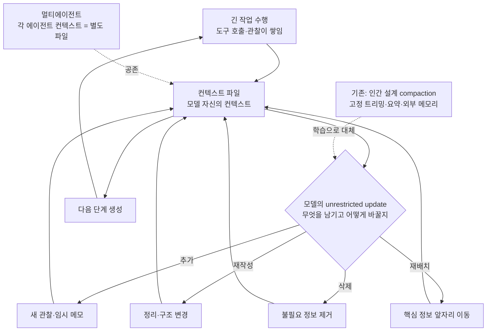

에이전트의 컨텍스트 관리 전략을 설계하는 개발자, 또는 오픈 모델로 RL 포스트 트레이닝을 돌리는 플랫폼 엔지니어라면 이 논문을 읽어야 합니다. 핵심 결론을 한 줄로 먼저 말해 두겠습니다. 컨텍스트 관리는 검색과 게임처럼, 인간이 손으로 설계한 헤uris틱이 범용 학습에 지는 층이 되고 있습니다. 자신의 컨텍스트를 파일처럼 취급해 자유롭게 다시 쓰게 한 Context Language Models(CLM)은, 가장 좋은 인간 설계 압축 전략보다 정확도에서도 계산량에서도 이깁니다.

*글의 핵심 개념을 형상화했습니다.*

## 개요

Rich Sutton이 쓴 쓴 교훈(Bitter Lesson)은 유명한 관찰입니다. 장기적으로는 도메인 특유의 손 설계보다, 컴퓨트를 범용적으로 확장하는 접근이 이긴다는 것입니다. 기법 하나하나를 손으로 다듬던 시대가 검색, 게임, 번역 층에서 끝났고, 다음 층으로 줄지어 넘어오고 있습니다.

컨텍스트 관리가 그 다음 층에 들어섰습니다. 2026년 9월, Meta의 Facebook Research가 Rulin Shao 외 저자로 Context Language Models(CLM) 논문을 공개했습니다(논문의 협업 소속으로는 University of Washington이 보도에 등장합니다). arXiv 2609.37725이며, 공식 코드 리포지토리는 facebookresearch/context-language-models에 열려 있습니다.

이 논문의 주장은 단순합니다. 모델의 컨텍스트를 파일처럼 대우하고, 모델이 그 파일에 무제한 업데이트(unrestricted updates)를 하도록 두면, 인간이 설계한 어떤 컨텍스트 관리 전략보다 낫다는 것입니다. 압축(compaction), 고정된 트리밍·요약 헤uris틱, 외부 메모리 시스템 같은 기존 접근은 모두 '하네스가 대신 정한다'는 구조인데, CLM은 '모델이 스스로 정한다'는 구조로 바꿉니다.

*NotebookLM이 소스를 종합해 생성한 '기존 인간 설계 vs 모델 네이티브' 비교 슬라이드입니다.*

## 쉽게 말하면

책상 비유로 이해하면 쉽습니다. 기존 에이전트는 책상 위에 서류가 쌓이면 직원(하네스)이 들어와서 정리하는 구조입니다. 어떤 서류를 요약하고, 어떤 서류를 쓰레기통에 넣고, 어떤 서류를 캐비닛(외부 메모리)으로 옮길지, 직원 수칙이 정합니다. 수칙은 한때는 잘 작동하지만, 사건의 성격이 바뀔 때마다 수칙을 다시 쓰야 합니다.

CLM은 정리하는 주체 자체를 바꿉니다. 서류를 다루는 사람(모델)이 자기 책상을 스스로 정리하게 하는 것입니다. 중요한 메모는 앞쪽에 놓고, 이미 쓴 서류는 접어서 한쪽에 쌓고, 필요 없어진 서류는 버립니다. 정리 원칙은 사전에 정하지 않고, 일을 잘해낸 세션에서 '책상이 어떻게 유지됐느냐'를 보상해서 스스로 익히는 것입니다.

직원 정리에서 책상 정리로 넘어가면 두 가지가 바뀝니다. 첫째, 정리가 업무 흐름 안에서 일어나므로 상황 판단이 붙습니다. 둘째, 책상을 어떻게 유지하느냐가 훈련으로 넘어오므로, 새 사건 유형이 나와도 수칙을 다시 쓸 필요가 줄어듭니다. 쓴 교훈이 말하는 바가 바로 이 둘째입니다.

에이전트 워크로드에서 이 변화는 상당합니다. 에이전트는 긴 작업을 수행합니다. 도구 호출 결과가 쌓이고, 중간 상태가 변하고, 초기 지시와 후속 관찰이 충돌합니다. 이 과정에서 컨텍스트를 누가 어떻게 다스리느냐가 작업 성공률을 좌우합니다. ThakiCloud 관점에서도 두 갈래로 이어집니다. Paxis처럼 에이전트를 일급 리소스로 다루는 제어 평면에는 컨텍스트 관리 정책 설계가, Maxis처럼 RL 학습을 돌리는 인프라에는 새로운 학습 목표가 생깁니다.

## Context Language Models가 무엇인가

CLM은 '컨텍스트를 네이티브하게 관리하는 언어 모델'입니다. 키워드는 네이티브입니다. 기존 접근에서 컨텍스트 관리는 모델 바깥에서 일어난습니다. 하네스가 턴이 길어지면 요약하고, 오래된 메시지를 잘라내고, 필요한 정보를 다시 찾아와 붙입니다. 모델은 그 결과물을 받아 쓰는 쪽이었습니다.

CLM은 컨텍스트 자체를 모델이 쓰는 문서로 봅니다. 모델은 자신의 컨텍스트에 대해 다음 일을 모두 할 수 있습니다.

- **추가**: 새 관찰, 도구 결과, 임시 메모를 넣습니다.
- **재작성**: 기존 내용을 다시 정리하고, 구조를 바꿉니다.
- **삭제**: 더 이상 필요하지 않은 정보를 내보냅니다.
- **재배치**: 다음 단계에 필요한 정보를 앞쪽으로 옮깁니다.

이 업데이트는 제한이 없습니다(논문의 표현은 unrestricted). 어떤 규칙에 따라 어떤 부분을 고쳐야 하는지 하네스가 정하지 않습니다. 모델이 어떤 내용을 남기고 어떤 내용을 버릴지를 스스로 결정합니다.

흥미로운 점 세 개를 정리합니다.

첫째, 제로샷에서 이미 동작합니다. 별도 훈련 없이 기존 모델 위에 이 패러다임을 적용하면, SOTA 컨텍스트 관리 전략보다 나은 결과가 나온다고 보고합니다. 추가적으로 in-context learning과 강화학습(online RL)으로 더 끌어올릴 수 있다는 뜻입니다.

둘째, 컨텍스트 유지 보수 전략이 학습의 목표가 됩니다. RL 훈련에서는 '어떤 정보를 남길지, 언제 압축할지'가 보상에 연결됩니다. 컴팩션을 추론 시점의 헤uris틱으로 두지 않고, 학습 시점의 목표로 바꾼 것입니다.

셋째, 멀티에이전트로 확장됩니다. 여러 에이전트의 컨텍스트가 각각 별도의 파일로 공존합니다. 각 에이전트가 자기 파일을 유지하고, 필요할 때 다른 파일과 상호작용하는 구조입니다. 보도에 따르면 멀티에이전트 설정에서도 컨텍스트 크기를 낮게 유지하면서 in-context 스코어보드를 유지하는 이질적 행동(emergent behavior)이 관찰됐습니다. 컨텍스트를 다시 쓰면서 내부 '메모'를 만들고, 여러 in-place 편집을 수행하면서 크기를 억제하는 모습도 보고됐습니다.

*NotebookLM이 소스를 종합해 생성한 멀티에이전트 확장 슬라이드입니다.*

*CLM의 핵심 구조: 컨텍스트를 모델이 업데이트하는 파일로 보고, 인간 설계 헤uris틱을 학습된 유지 보수 전략으로 대체합니다.*

## 실제 결과

논문이 보고하는 수치를 정리합니다. 모든 수치는 논문과 보도 기반이며, ThakiCloud가 재현한 실측이 아닙니다.

가장 주목할 결과는 두 개입니다. 제로샷 CLM은 SOTA 컨텍스트 관리 전략 대비 정확도를 11.4% 끌어올리면서 FLOPs를 21.5% 낮췄다고 보고합니다. 평가는 BrowseComp-Plus 벤치마크에서, 21k 컨텍스트 기준으로 나왔습니다. 즉, 정확도만 더 나은 것이 아니라 '더 정확하면서도 더 쌈'이라는 조합입니다.

*NotebookLM이 소스를 종합해 생성한 결과 수치 슬라이드입니다. 수치는 논문·보도 기반이며 ThakiCloud 실측이 아닙니다.*

온라인 RL을 적용하면 더 커집니다. Qwen3.5-9B 기준으로 성능이 47.6% 개선되고 FLOPs가 12% 감소했다고 보고합니다. 제로샷에서 확인된 패러다임의 이득을 학습이 추가로 확장하는 모양새입니다. 9B급 오픈 모델에서 이 숫자가 나온다는 점은, CLM이 거대 폐쇄 모델만 쓰는 장치가 아님을 보여 줍니다.

BrowseComp-Plus는 실시간 웹 검색 대신 약 10만 개 문서의 고정된 인간 검증 코퍼스에서 정보를 찾아내야 하는 벤치마크입니다(중위 문서 길이 5,179단어). 웹 검색 에이전트의 컨텍스트 관리 능력을 측정하는 데 쓰입니다. 논문에서는 리트리버 도구 접근 설정에서 모든 방법이 최대 512토큰 컨텍스트를 사용했다는 점도 언급되는데, 즉 이 이득은 원거리 컨텍스트 용량의 문제가 아니라 컨텍스트를 어떻게 유지하느냐의 문제에서 나온 것입니다.

보충 결과는 TerminalBench 2.1, TBLite, 그리고 다양한 크기의 모델에서 나온 BrowseComp-Plus까지 부록에 담겨 있습니다. 단일 벤치마크에 갇힌 결과가 아니라는 뜻입니다.

## ThakiCloud 제품 적용 시사점

**Paxis 렌즈**: Paxis는 Skills, Tools, Policies, Audit Logs를 일급 리소스로 다루는 에이전트 제어 평면입니다. CLM이 말하는 '컨텍스트 파일'은 이 목록의 다음 항목입니다. 에이전트가 자기 컨텍스트를 어떻게 유지하느냐는, 스킬 선택이나 도구 호출과 마찬가지로 정책으로 제약하고 감사로 추적해야 하는 일급 행동입니다. 모델이 컨텍스트를 자유롭게 다시 쓰면, 그 재작성 이력 자체가 감사 로그의 핵심 내용이 됩니다. 어느 관찰이 어떤 메모로 압축됐고, 어떤 정보가 삭제됐는지를 추적할 수 있어야, 자기 편집으로 생긴 오류를 소급해서 진단할 수 있습니다. 멀티에이전트 컨텍스트 파일 공존 구조는 Paxis의 DAG 멀티에이전트 오케스트레이션과 직접 맞닿아 있습니다. 각 에이전트의 컨텍스트가 별도 파일로 관리되는 세계에서, 파일 간 의존성과 버전은 오케스트레이션 상태의 일부가 됩니다.

*NotebookLM이 소스를 종합해 생성한 Paxis 관점 슬라이드입니다.*

**ai-platform(Maxis) 렌즈**: '컨텍스트 컴팩션을 학습 목표로 삼는 RL'은 Maxis가 돌리는 전형적인 포스트 트레이닝 실험입니다. K8s와 Kueue GPU 큐 위에서 Qwen3.5-9B급 모델에 컨텍스트 유지 보수 목표를 붙여 RL을 돌리는 것 자체가 하나의 실험으로 성립합니다. 논문의 보고 수치(FLOPs 12% 감소)가 사실이라면, 학습 비용을 줄이면서 추론 시 prefill 부담도 줄이는 이중 이득을 기대할 수 있습니다. ThakiCloud의 서빙 관점에서 prefill은 캐시 미스 비용의 원천이므로, 컨텍스트를 짧고 밀도 있게 유지하는 모델은 서빙 단가에도 바로 영향을 줍니다. 이 실험을 큐에 올릴 때 참고할 점은, 보상 설계에 '컨텍스트 크기와 작업 성공률'을 동시에 넣어야 한다는 것입니다. 크기를 줄이는 것만 보상하면 정보를 과도하게 버리는 모델이 생기고, 성공률만 보면 컨텍스트가 다시 불어납니다.

*NotebookLM이 소스를 종합해 생성한 Maxis 관점 슬라이드입니다.*

## 한계 및 반론

쓰는 교훈은 강력한 프레임이지만, 이 논문이 그 프레임을 완성한 것은 아닙니다. 증거는 아직 단일 논문이고, 벤치마크도 BrowseComp-Plus, TerminalBench 2.1, TBLite로 한정됩니다. 생산 환경의 에이전트 워크로드(툴 스키마가 수백 개인 하네스, 수십 시간 세션, 외부 상태와 동기화)로 일반화하는지는 검증되지 않았습니다 [추정].

*NotebookLM이 소스를 종합해 생성한 한계 슬라이드입니다.*

CLM은 새로운 장애 모드를 만듭니다. 컨텍스트를 모델이 다시 쓰면, 그 재작성 과정에서 정보가 손상될 수 있습니다. 자기 모순이 스며들거나, 중요한 관찰이 삭제되거나, 메모가 원 데이터와 어긋나는 상황입니다. 기존 컴팩션에서는 요약 헤uris틱이 결정하는 부분이므로 어떤 정보 요약됐는지 추적하기 쉬웠지만, CLM에서는 모델의 자율적 판단이므로 '무엇이 잘못 편집됐는지'를 소급하는 비용이 생깁니다. 커뮤니티에서도 세션 도중 컨텍스트가 자기 모순에 빠지면 어떻게 되는지가 열린 질문으로 거론됩니다.

RL 경로(Qwen3.5-9B +47.6%)는 학습 비용이 들어갑니다. 제로샷 경로(+11.4%)는 추가 학습 없이 이득을 주지만, 기본 모델의 능력이 전제입니다. 어느 경로가 어떤 워크로드에서 netto 이득인지는 워크로드별 실측이 필요합니다. 512토큰 컨텍스트 설정의 결과라는 점도 기억할 가치가 있습니다. 이 논문에서 CLM의 이득은 '컨텍스트가 얼마나 길 수 있는가'가 아니라 '주어진 컨텍스트를 어떻게 유지하는가'에서 나왔습니다. 컨텍스트 확장 문제와 컨텍스트 유지 보수 문제를 같은 층에서 다루지 않는 것입니다.

마지막으로, '파일' 업데이트 메커니즘의 구체적 토큰화 방식과 학습 세부(보상 함수의 정확한 형태, 데이터 구성)는 이 글이 확인한 보도와 추록 범위에서는 완전히 검증되지 않았습니다. 리포지토리가 열려 있으므로, 재현을 시도하는 입장에서 세부 확인이 필요합니다 [추정].

## 정리

컨텍스트 관리는 에이전트 엔지니어링에서 가장 많이 손으로 설계된 층이었습니다. 요약 시점을 언제로 할지, 어떤 메시지를 남길지, 외부 메모리로 무엇을 분리할지, 이 모든 것을 하네스 개발자가 헤uris틱으로 정했습니다. CLM은 이 층에도 쓴 교훈이 들어온다고 말합니다. 모델이 컨텍스트를 파일처럼 스스로 관리하게 하면, 인간 설계 SOTA를 정확도와 계산량 둘 다에서 이긴다는 것입니다.

다음 행동을 세 가지로 제안합니다.

첫째, 에이전트를 돌리는 팀은 facebookresearch/context-language-models 리포지토리를 주시할 가치가 있습니다. 제로샷 경로가 코드와 함께 열려 있으면, 기존 하네스에 붙이는 실험이 바로 가능합니다.

둘째, Paxis 관점에서는 컨텍스트를 일급 리소스로 취급하는 프로토타입을 시작할 시점입니다. 모델의 컨텍스트 재작성 이력을 정책 게이트와 감사 로그로 추적하는 설계가, CLM이 보급되는 세계에서 에이전트 신뢰성의 핵심이 됩니다.

셋째, Maxis 관점에서는 컨텍스트 유지 보수 목표를 RL 실험 큐에 올리는 것을 검토할 만합니다. 크기와 성공률을 동시에 보상하는 설계로, Qwen3.5-9B급 모델에서 논문의 보고 수치를 재현·확장하는 실험입니다.

*NotebookLM이 소스를 종합해 생성한 종합·액션플랜 슬라이드입니다.*

한 줄로 다시 말해, 컨텍스트를 설계하는 손은 하네스 엔지니어에서 모델 스스로로 이동하기 시작했습니다.

## 출처

- 논문: [Context Language Models (arXiv 2609.37725)](https://arxiv.org/abs/2609.37725) · [HTML 전문](https://arxiv.org/html/2609.37725v1)
- 공식 코드: [facebookresearch/context-language-models](https://github.com/facebookresearch/context-language-models)
- Hugging Face Papers: [2609.37725](https://huggingface.co/papers/2609.37725)
- 벤치마크: [BrowseComp-Plus (arXiv 2508.06600)](https://github.com/texttron/BrowseComp-Plus)
- 보도: [mpost.io — Meta presents CLM](https://mpost.io/meta-presents-context-language-models-ai-agents-that-edit-their-own-memory-outperform-fixed-harnesses-at-lower-compute-cost/) · [AGI Hunt — Context Language Models](https://agihunt.info/en/p/1a0f26bccfa7564452fa31a3ba6)
