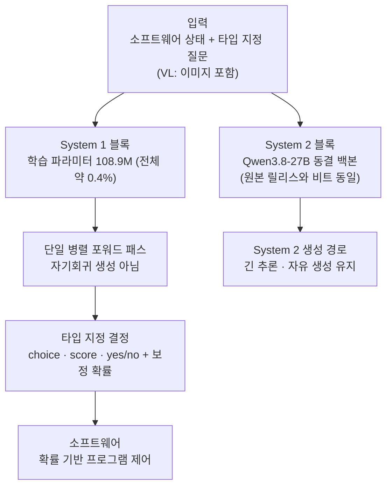

에이전트 워크플로우의 추론 비용을 설계하는 개발자, 또는 "LLM 호출을 줄이되 판단 품질은 유지하는" 문제를 가진 플랫폼 엔지니어라면 이 모델을 봐야 합니다. 결론은 한 줄이면 충분합니다. '생성이 아니라 결정.' AutoTrust AI가 2026년 9월 말 공개한 JEV-27B(-VL)는 '답을 쓰는' 언어 모델이 아니라, 결정만 내려 주는 모델로 소개됩니다. 타입 지정 질문에 보정된 확률로 choice·score·yes/no를 돌려주며, 그 결정은 자기회귀 생성이 아닌 단일 병렬 포워드 패스로 나옵니다. 에이전트 시스템이 프런티어 LLM 호출을 매 결정 지점에 쓰는 구조에서, 이 클래스의 모델이 그 지점을 대체할 수 있다면 에이전트 추론 비용의 지배 변수가 바뀝니다.

## 개요

2026년 9월 29일, AutoTrust AI는 JEV-27B를 Apache-2.0 오픈웨이트로 발표했습니다. PR Newswire의 보도자료 제목이 이 모델의 정체성을 그대로 보여 줍니다. "self-hosted AI agents를 위한 오픈 결정 모델(Open Decision Model)". 이튿날(9월 30일)에는 멀티모달 확장 JEV-27B-VL이 나왔고, AutoTrust는 이를 "세계 최초의 오픈웨이트, near-SOTA 멀티모달 결정 모델"이라고 소개했습니다(제조사 주장).

JEV는 TypeSafe AI가 제안한 개념입니다. TypeSafe의 Jev는 'System 1 모델'이라 불리며, 이름은 카너만(Daniel Kahneman)의 빠른 직관 판단(System 1)과 느린 분석 판단(System 2) 분류에서 왔습니다. TypeSafe는 Jev를 "프런티어 지능 함수 호출(frontier intelligence function call)"으로 본다는 뜻입니다. 채팅 텍스트 생성이 아니라, 소프트웨어 안에서의 판단.

이 개념이 오픈웨이트 27B 모델로 나온 것이 JEV-27B이고, 이미지도 볼 수 있게 된 것이 JEV-27B-VL입니다.

## System 1 결정 모델이란 무엇인가

기존 LLM의 결정은 우회로 나갑니다. "A와 B 중 어느 쪽이 맞는가"를 물으면, 모델이 문장을 생성하면서 결론을 품어내습니다. 토큰을 몇십 개 쓰고, 확률도 명시되지 않으며, 출력은 파싱해야 하는 자연어입니다.

JEV류의 모델은 이 경로를 생략합니다. 입력은 세 가지입니다. (1) 소프트웨어의 현재 상태, (2) 미리 정의된 타입 지정 질문, (3) 후보 집합. 출력은 (4) 타입 지정 답(choice, score, yes/no)에 (5) 보정된 확률(calibrated probability)이 붙어 나옵니다. 자연어가 아니라 구조 값이므로, 하류 소프트웨어가 파싱 없이 그대로 분기 조건으로 쓸 수 있습니다.

기계적 차이가 두 가지 있습니다. 첫째, **단일 병렬 포워드 패스**. 토큰을 하나씩 자기회귀로 생성하지 않고, 결정은 한 번의 패스로 계산됩니다. TypeSafe는 이 구조로 "프런티어 LLM보다 40~200배 빠르다"고 주장합니다(제조사 수치). 둘째, **RLCD(Reinforcement Learning with Calibrated Decisions) 학습**. 모델이 학습하는 목표가 '정답 문장 생성'이 아니라 '보정된 확률 분포 출력'을 내는 것입니다. 확률 0.83이 실제로 83% 맞아야 하는 분포를 학습하는 것이 이 트레이닝의 본질입니다.

호스팅 버전(TypeSafe Jev)은 2026년 9월 21일 API를 열었습니다. 가격은 입력 1M 토큰당 $0.042, 출력 무료입니다. 출력이 구조 값이라 토큰 과금 대상이 아니기 때문입니다(보도 기준).

## JEV-27B와 JEV-27B-VL

AutoTrust의 오픈 릴리스는 이 개념을 27B 규모에, Apache-2.0 라이선스로 내놓은 것입니다. Hugging Face(autotrust/JEV-27B, autotrust/JEV-27B-VL, autotrust/JEV-9B)에 올라 있으며, AutoTrust는 HF 블로그에서 "빠르고 보정된 결정, 그리고 완전한 추론"을 주제로 모델을 소개합니다.

아키텍처는 이중 블록으로 구성됩니다. Hugging Face 모델 카드 기준, **System 2 블록은 Qwen3.8-27B**로, 원본 릴리스와 비트 동일하게 동결됩니다. **System 1 블록은 학습 파라미터 108.9M**으로, 전체 모델의 약 0.4%에 불과합니다. 즉, 27B 모델 전체를 다시 훈련한 것이 아니라, 동결된 백본 위에 '결정 회로'만 얹는 구조. AutoTrust는 이 구성을 **Blocks of Experts(BoE) 레시피**라고 이름 붙였습니다(트윗 기준).

학습 비용은 보고대로라면 놀랍습니다. **단일 NVIDIA B200에서 약 9.2시간**. 27B급 모델이 아니라 0.4%의 결정 블록만 훈련했기 때문입니다. 스승(teacher)은 TypeSafe의 호스팅 폐쇄 모델 Jev 1.13의 공개된 출력 분포입니다.

JEV-27B-VL의 특징은 '멀티모달'이라는 말 뒤에 숨은 것입니다. **결정 모델이 이미지 입력을 받는다는 것.** AutoTrust는 VL 버전에 대해 "단 하나의 학습 이미지 없이 보는 것을 배웠다(a decision model that learned to see without a single image of training)"고 소개합니다(제조사 주장, 미검증). 제3자 도구인 jev-multimodal 리포지토리는 CUDA 추론, Choice·Noul·Score 연산자, 순서 지정 이미지 입력, PDF/ASR 추출, 소스(provenance)·신선도(freshness) 처리를 제공하며, "호스팅 Jev는 여전히 텍스트 전용이고, 로컬 비주얼 결정이 지원된다"는 설명이 붙어 있습니다.

## 보고 수치

이 글은 실행 재현을 하지 못했습니다(아래 '재현 시도' 참조). 따라서 모든 수치는 AutoTrust·TypeSafe·제3자 보도의 보고 기준이며, 독립 검증이 되지 않은 값입니다.

| 항목 | 보고 수치 | 보고 주체 |
|---|---|---|
| JEV-27B 벤치마크 평균 (6종) | 84.07% | AutoTrust |
| System 1 학습 파라미터 | 108.9M (전체 약 0.4%) | AutoTrust (HF 모델 카드) |
| 학습 시간 | 약 9.2시간, 단일 B200 | AutoTrust |
| JEV-9B 추론 지연 | 단일 ~90ms · 배치 ~2.5ms (단일 B200) | AutoTrust (HF 모델 카드) |
| JEV-9B 처리량 | ~14,400 결정/초 (단일 B200) | AutoTrust (HF 모델 카드) |
| TypeSafe Jev API 가격 | 입력 1M 토큰당 $0.042, 출력 무료 | TypeSafe (보도 기준) |
| 속도 주장 | 프런티어 LLM 대비 40~200배 | TypeSafe |

*90ms 지연, 초당 14,400 결정, 9.2시간 학습, 입력 1M 토큰당 $0.042. 모든 수치는 제조자 보고 기준입니다.*

## 재현 시도

재현 시도 중 실패: 이번 세션에서는 실행하지 못했습니다. 27B 규모 모델로 로컬(노트북) 실행이 부적합하고, 가중치가 내부 S3로 미전사(미러링) 상태라 클러스터 서빙 경로도 이번 인트라데이 실행 범위 밖이었습니다. 후속으로 B200 단일 GPU 서빙 스모크와 결정 지연·확률 보정 실측을 진행할 예정이며, 그 결과는 이 글의 '보고 수치' 섹션을 실제 측정값으로 갱신합니다.

## 생태계

Jev 개념은 AutoTrust만 구현한 것이 아닙니다. 제3자 오픈소스가 이미 등장했습니다.

**Open-Jev**(Zefan-Cai/Open-Jev-27B-v1.1): "앱에 확률 붙인 결정을 준다. 컨텍스트, 질문, 후보를 넣으면 자기회귀 생성 없이 타입 지정 확률을 바로 돌려준다"는 리포지토리로 나옵니다.

**Valen**(Liuziyu77/Valen): "Jev 같은 멀티모달 모델을 직접 훈련하자. System One Model, 이제 비전까지."

**jev-multimodal**: CUDA 기반 로컬 추론 도구. Choice·Noul·Score 연산자와 이미지 입력, PDF/ASR 추출을 다룹니다.

*AutoTrust/TypeSafe 공식 라인, 제3자 재현(Open-Jev·Valen), 추론 도구(jev-multimodal)의 3선 구조입니다.*

호스팅 폐쇄 모델(TypeSafe Jev)과 오픈 재현체(Open-Jev 등)가 경쟁하는 구도는, 이 개념이 '제품'을 넘어 '모델 클래스'로 확장되고 있음을 보여줍니다.

## ThakiCloud 제품 적용 시사점

**Paxis 관점**: Paxis는 에이전트의 모든 행동을 정책 게이트와 감사 로그로 통과시키는 Agent-Native Cloud(에이전트 플랫폼 제어 평면)입니다. 정책 게이트의 판정은 본질적으로 결정 문제입니다. "이 도구 호출을 허용할 것인가", "이 스킬이 이 인텐트에 맞는가(960개 스킬 중 BM25 선택)", "이 실행 결과를 통과시킬 것인가". 현재 이런 판정은 보통 프런티어 LLM 호출로 나갑니다. 토큰을 수십 개 쓰고, 확률 없이, 텍스트로.

System 1 결정 모델은 이 지점의 대안입니다. 타입 지정 질문("허용할 후보: [approve, reject, escalate]", 후보 확률 출력)으로 바꾸면, 게이트 판정이 구조 값이 되고 비용이 확률적 토큰 과금이 아닌 '결정 단위' 과금으로 바뀝니다. 보고 수치(단일 ~90ms, 14,400 결정/초, JEV-9B 기준)가 사실이라면, 정책 게이트와 같은 '매 요청마다 나는' 지점에 프런티어 LLM 호출을 쓰는 것보다 경제성이 달라집니다.

**ai-platform(Metis) 관점**: JEV-27B는 self-hosted 27B 서빙의 전형적 대상입니다. Apache-2.0 라이선스, 단일 B200 학습, 동결 백본+소형 결정 블록 구조. Metis의 K8s·Kueue·vLLM 서빙 위에 올리고, 멀티테넌트 격리 하에 여러 에이전트 워크플로우가 같은 결정 모델에 접근하는 구성이 성립합니다.

학습 측면에서는 Maxis 이야기가 붙습니다. System 1 블록 0.4%(108.9M)만 훈련해 9.2시간(보고 기준)이라는 구성은, "전 모델 파인튜닝이 아니라 특정 기능 회로만 얹는" 학습 패러다임의 예시입니다. 이 패턴이 고객 워크로드로 확장되면, Maxis의 GPU 큐와 체크포인트 관리가 그대로 적용됩니다.

온프렘 관점에서는 PR 제목의 "self-hosted AI agents"라는 표현이 이 지점의 핵심을 보여 줍니다. 결정 모델을 사내에서 돌리려면, 모델 서빙도 사내로 옮겨야 합니다. ThakiCloud의 온프렘/소버린(Aegis) 라인업과 직접 연결되는 부분입니다.

*결정 모델이 Paxis(정책 게이트)·Metis(서빙)·Aegis(온프렘)에 어떻게 통합되는지 정리한 슬라이드입니다.*

## 한계 및 반론

**수치의 출처**: 이 글의 모든 수치는 제조자(AutoTrust·TypeSafe) 또는 그 보도자료 기준입니다. 6종 벤치마크가 어떤 것인지, 84.07%가 어떤 평가 프로토콜인지, 40~200배 주장을 어떤 워크로드에서 잰 것인지 공개 자료에서 확인되지 않습니다.

**'near-SOTA'와 '세계 최초'**: JEV-27B-VL의 "세계 최초 오픈웨이트 near-SOTA 멀티모달 결정 모델"은 AutoTrust의 소개 문구입니다. '결정 모델'이라는 범주 자체를 AutoTrust가 열었기 때문에, 그 범위 안에서 최초일 수 있습니다. 범주 외부(통상 VQA/멀티모달 LLM)와는 비교 대상이 다릅니다.

**VL 주장의 미검증**: "단일 학습 이미지 없이 보는 것을 배웠다"는 주장의 메커니즘이 공개 자료에서 확인되지 않습니다. 동결 백본(Qwen3.8-27B)에 이미 멀티모달 능력이 들어 있을 경우, VL 버전은 '결정 회로에 비전 입력을 연결'한 것에 불과할 수 있습니다. 이것이 참이든 거짓이든, '학습 없이 보았다'는 표현은 주의해서 읽어야 합니다.

**오픈 재현체의 차이**: Open-Jev·Valen은 제3자 재현으로, autotrust 릴리스와 아키텍처·훈련 데이터가 동일하지 않습니다. "JEV 개념"을 대할 때, '호스팅 TypeSafe Jev', 'AutoTrust 오픈 릴리스', '제3자 재현' 세 층을 구분해야 합니다.

**보정 ≠ 정확도**: 보정된 확률은 '확률이 맞다'는 것을 의미하지 않고, '말한 확률만큼 맞는다'는 것을 의미합니다. 결정 품질의 상한은 여전히 스승 모델의 출력 분포에 묶여 있습니다. 오픈 모델이 폐쇄 스승을 분포 학습으로 재현하는 구조이므로, 스승이 없는 영역(새 도메인, 새 질문 타입)에서는 품질이 어떻게 떨어지는지 공개 데이터가 없습니다.

*수치의 출처, 보정과 정확도의 구분, VL 메커니즘의 모호성. 검증 전의 3가지 한계입니다.*

## 정리

JEV-27B(-VL)가 던진 질문은 "더 좋은 생성 모델"이 아니라 "판단을 내려 주는 모델"입니다. 에이전트 시스템은 생성보다 결정을 많이 합니다. 도구 선택, 정책 판정, 평가, 라우팅, 분기. 이 지점마다 프런티어 LLM의 토큰을 쓰면, 에이전트 경제학의 지배 비용은 '결정 단위'가 됩니다.

System 1 결정 모델이 그 지배 비용을 내리는 경로로 보입니다. 동결 백본+소형 학습 블록 구조, 단일 병렬 패스, 보정 확률 출력, Apache-2.0. 9월 말 한 주 사이에 호스팅 API, 27B 오픈웨이트, 멀티모달 확장, 제3자 재현이 모두 나왔다는 것은, 이 클래스가 실험실에서 시장으로 넘어오고 있음을 보여줍니다.

에이전트 플랫폼을 돌린다면 다음 행동은 하나입니다. 워크플로우에서 '매 요청마다 프런티어 LLM으로 나가는 판정 지점'을 목록으로 정리하고, 그중에서 타입 지정 질문에 보정 확률 답으로 바꿀 수 있는 지점을 골라보십시오. 그게 System 1 결정 모델이 들어가는 곳입니다.

*판정 지점 감사, 타입 지정 질문 설계, 로컬 서빙 테스트. 다음 행동 3가지입니다.*

## 출처

- [AutoTrust JEV-27B-VL (Hugging Face 모델 카드)](https://huggingface.co/autotrust/JEV-27B-VL)
- [AutoTrust JEV-27B (Hugging Face)](https://huggingface.co/autotrust/JEV-27B)
- [AutoTrust JEV-9B (Hugging Face)](https://huggingface.co/autotrust/JEV-9B)
- [AutoTrust HF 블로그: JEV-27B, fast calibrated decisions and full reasoning](https://huggingface.co/blog/autotrust/autotrustjev-27b-fast-calibrated-decisions-and-ful)
- [PR Newswire: AutoTrust AI Releases JEV-27B, an open decision model for self-hosted AI agents](https://www.prnewswire.com/news-releases/autotrust-ai-releases-jev-27b-an-open-decision-model-for-self-hosted-ai-agents-302891720.html)
- [RuntimeWire: AutoTrust AI JEV-27B self-hosted decision model](https://runtimewire.com/article/autotrust-ai-jev-27b-self-hosted-decision-model)
- [TypeSafe AI: Introducing System One models and Jev](https://typesafe.ai/blog/introducing-system-one-models-and-jev)
- [victordibia.com: How Jev works, calibrated decision models (PDF)](https://victordibia.com/papers/jev.pdf)
- [Zefan-Cai/Open-Jev (GitHub)](https://github.com/Zefan-Cai/Open-Jev)
- [Liuziyu77/Valen (GitHub)](https://github.com/Liuziyu77/Valen)
- AutoTrust의 JEV-27B-VL 소개 트윗 (RT): [x.com/hjguyhan/status/2105806027711226319](https://x.com/hjguyhan/status/2105806027711226319)
