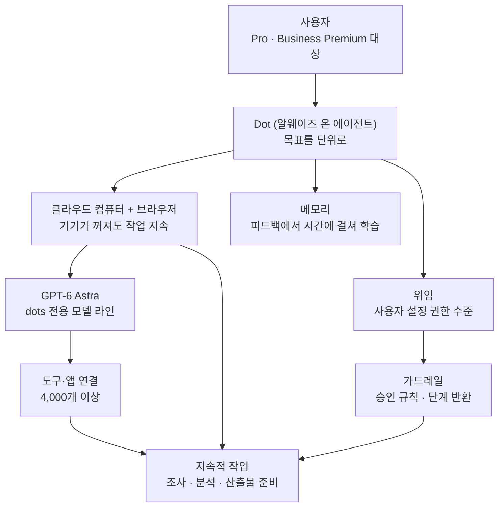

에이전트 플랫폼을 설계하는 개발자, 또는 "우리 팀도 24시간 일하는 에이전트를 돌릴 수 있을까"를 고민하는 엔지니어라면 이 글을 읽어야 합니다. 결론부터 말합니다. OpenAI가 2026년 9월 29일 DevDay에서 발표한 Dots는 에이전트의 기본 단위를 '대화'에서 '목표'로 바꾼 설계입니다. 각 도트(Dot)는 자체 클라우드 컴퓨터와 브라우저를 갖습니다. 사용자의 기기가 꺼져도 작업을 이어가는 이유입니다. 그리고 이 설계의 진짜 무게는 모델 성능의 문제가 아닙니다. 그 아래 깔린 운영층(리소스, 메모리, 위임, 가드레일, 승인)에 있습니다.

*Dots의 핵심 개념을 형상화했습니다.*

## 개요

OpenAI는 DevDay 2026(2026년 9월 29일)에서 Dots를 공개했습니다. 공식 소개는 짧고 명확합니다. "Dots는 당신의 편에 서는 프런티어 지능(frontier intelligence that have your back)이다. GPT-6 Astra로 구동되고, 자기만의 클라우드 컴퓨터를 가지며, 시간에 걸쳐 피드백에서 배우고, 목표를 향해 24/7로 일할 수 있다." ChatGPT 제품 페이지는 이를 "모든 것을 처리하기 위해 지어진, 주목할 만큼 유능한 알웨이즈 온 에이전트"라고 표현합니다.

같은 DevDay에서 OpenAI는 Dots 외에도 GPT-6.1 Sol 모델, ChatGPT 협업 워크스페이스, 요금제 개편을 발표했습니다. Dots는 그중에서 "에이전트가 어디에 살아야 하는가"라는 질문에 OpenAI가 내린 답입니다. 답은 단순합니다. OpenAI의 클라우드입니다. 에이전트에게 전용 컴퓨터와 브라우저를 하나씩 배정하는 구조입니다.

발표 직후 제3자 분석도 빠르게 나왔습니다. 개발자 monokern은 Dots 아키텍처를 "에이전트, 모델, 도구, 메모리, 위임, 가드레일, 그리고 수익 레이어"로 나누어 하나의 정리 문서로 만들었다며 "24시간 AI 회사를 만드는 데 미쳤을 정도로 강하다(insane)"고 평가했습니다. TechCrunch는 Dots를 "장기적으로 사용자 지정 목표를 pursue하는 거품 같은 에이전트 아바타(bubbly agentic avatars)"라고 묘사했고 DataCamp는 권한(permission)과 대상 플랜, 출시 한계 측면에서 실사용 가이드를 다뤘습니다.

## Dots가 무엇인가

Dots의 본질은 '영속적 실행 주체'입니다. 기존 챗봇은 요청-응답 구조였습니다. 사용자가 메시지를 보내고 모델이 답한 뒤, 대화는 끝나면 상태가 사라집니다. Dots는 그 흐름을 바꿉니다. OpenAI의 공식 문서(learn.chatgpt.com)에 따르면, "도트는 클라우드에 살고 자기만의 컴퓨터와 브라우저를 갖는다. 당신이 도달할 수 있고, 당신의 컴퓨터가 꺼져 있어도 계속 일할 수 있다. 조사(research), 데이터 분석(analysis), 산출물 준비(preparation)를 한다."

세 가지 포인트가 있습니다. 첫째, 도트는 정체성(identity)을 가집니다. 대화 상대가 아니라, 이름을 가진 실행 주체입니다. 둘째, 도트의 런타임은 사용자의 기기에서 독립됩니다. 브라우저와 컴퓨터는 클라우드 자원으로, 사용자의 세션 종료가 도트의 작업 종료를 의미하지 않습니다. 셋째, 도트는 목표를 단위로 일합니다. "오늘 마감하는 보고서 준비"처럼 한 목표를 부여하면, 그 목표를 향해 여러 세션에 걸쳐 작업을 분해하고 진행합니다.

*Dots의 세 속성, 정체성·런타임 독립·목표 지향을 정리한 슬라이드입니다.*

공식 소개가 강조하는 "시간에 걸쳐 피드백에서 배운다(learn from feedback over time)"는 메모리층 이야기입니다. 도트는 한 번의 교정에서 끝나는 것이 아니라, 반복 피드백을 누적해 행동 패턴을 조정하는 구조로 설명됩니다.

## 알웨이즈 온 아키텍처의 층

monokern의 프레임(에이전트, 모델, 도구, 메모리, 위임, 가드레일, 수익)을 공식 문서와 보도와 대조하면, Dots의 아키텍처는 아래 층으로 분해됩니다.

**모델층**: GPT-6 Astra가 Dots를 구동합니다. 같은 발표장에서 GPT-6.1 Sol도 나왔지만, Dots 문서에서는 일관되게 Astra를 지칭합니다. 에이전트 전용 모델 라인이 존재한다는 점은, "채팅용 모델"과 "작업용 모델"을 분리하는 설계 의도가 있음을 시사합니다.

**런타임층**: 도트당 클라우드 컴퓨터와 브라우저 하나씩입니다. 이것이 Dots를 '에이전트'에서 '상시 근로자'로 격상시키는 핵심입니다. 상태(브라우저 탭, 다운로드, 작업 폴더)는 세션이 아니라 도트의 생명주기에 걸쳐 유지됩니다.

**도구층**: 4,000개 이상의 도구·앱 연결이 보고됩니다. Dots는 ChatGPT의 기존 커넥터 생태계를 그대로 상속합니다. 알웨이즈 온 에이전트가 실제로 일을 하려면 외부 도구 접근이 필수입니다.

**메모리층**: "시간에 걸쳐 피드백에서 학습"은 두 갈래로 읽힙니다. 세션 간에 유지되는 장기 기억과 사용자 교정(이건 하지 마, 저건 이렇게 해)을 누적하는 행동 조정입니다. 어느 쪽이든, 기억은 도트 단위로 붙는 속성입니다.

**위임·가드레일층**: 사용자가 권한 수준을 설정하고 특정 규칙은 실행 전 승인을 요구하거나 단계를 사용자에게 돌려줍니다. DataCamp와 BenchLM 등 실사용 가이드가 반복적으로 다루는 지점입니다. 자율성과 통제는 슬라이더로 조절되는 구조라는 뜻입니다.

**운영(수익)층**: 출시 초기 대상은 Pro와 Business Premium 플랜의 특정 시장입니다(monokern이 '수익 레이어'라 부른 지점). 알웨이즈 온 에이전트는 24시간 컴퓨트를 소모하는 워크로드이므로, 요금제와 사용 한계가 설계의 일부입니다.

**사용자 경험(UX)층**: 보도와 실사용 가이드에서 반복 등장하는 또 다른 층입니다. TechCrunch는 Dots를 "장기적으로 사용자 지정 목표를 pursue하는 거품 같은 에이전트 아바타(bubbly agentic avatars)"라고 묘사했는데, 아바타는 도트가 '대화 상대'가 아니라 '상주 중인 주체'임을 시각적으로 보여주는 장치입니다. 공식 문서의 "당신이 도달할 수 있고(You can reach it)"는 같은 이야기의 다른 측면입니다. 도트는 채팅 창 안에서만 존재하지 않고, 작업 중 언제든 찾아가 상태를 확인할 수 있는 독립 주체로 설계됩니다. Eesel 등 실사용 가이드는 승인 흐름을 구체적으로 다룹니다. 사용자가 규칙을 걸어 두면, 에이전트는 그 규칙에 해당하는 단계에서 승인을 요청하거나 작업을 사용자에게 반환합니다. 자율 실행과 인간 감독이 경계선이 아니라 비율로 조율되는 구조입니다.

## ThakiCloud 제품 적용 시사점

Dots가 보여준 방향은 ThakiCloud의 두 제품 라인 모두에 해당됩니다.

**Paxis 관점**: Paxis는 ThakiCloud의 Agent-Native Cloud로, 에이전트 플랫폼 제어 평면입니다. Skills, Tools, Policies, Audit Logs를 일급 리소스로 다루고 960개 이상의 스킬을 BM25로 선택해 격리 샌드박스에서 실행하며 모든 행동을 정책 게이트와 감사 로그로 통과시킵니다. Dots가 소비자 시장에서 "에이전트의 단위는 목표다"라는 기대를 세웠습니다. 기업 시장의 질문은 하나 더 붙습니다. "그 목표는 내 인프라 위에서, 내 정책 아래에서 일하는가."

Paxis가 Dots와 공유하는 구조는 세 가지입니다. 첫째, 상시 실행(알웨이즈 온). Dots가 클라우드 컴퓨터에 도트를 배치하는 방식과 같이, Paxis의 에이전트는 NL 크론과 이벤트 트리거로 세션 없이 목표 단위로 작동합니다. 둘째, 위임과 승인. 사용자가 권한 수준을 설정하는 Dots의 가드레일과, Paxis의 정책 게이트는 같은 문제(자율 에이전트에 어디까지 권한을 주는지)의 다른 답입니다. 셋째, 도구·스킬 상속. Dots의 4,000개 커넥터와 Paxis의 스킬 하네스는 "에이전트가 실제로 일을 하려면 도구 접근이 먼저"라는 전제를 공유합니다.

구조를 한 칸 더 당겨 보면 대응 관계가 명확해집니다. Dots의 '클라우드 컴퓨터+브라우저'는 OpenAI가 운영하는 장수 런타임이고 Paxis의 격리 샌드박스는 고객이 운영하는 장수 런타임입니다. Dots의 '승인 규칙'은 ChatGPT UI 안에서 사용자가 직접 설정하는 것이고 Paxis의 '정책 게이트+감사 로그'는 조직 단위 정책 리소스로 버전 관리되는 것입니다. Dots의 '4,000개 커넥터'는 OpenAI 생태계 내 도구 접근이고 Paxis의 MCP 커넥터(OAuth 자동재연결 포함)는 고객이 지정한 시스템에 대한 접근입니다. 같은 문제를 푸는 도구 세트가 같고, 다르고, 주체가 다릅니다.

*Dots와 ThakiCloud Paxis/Metis의 런타임 위치·정책 제어·비용 구조·스킬 접근 비교 슬라이드입니다.*

차이점도 명확합니다. Dots는 OpenAI가 호스팅하는 폐쇄 런타임이고 Paxis는 고객이 운영하는 인프라(자체 K8s 클러스터, 온프렘, 소버린 환경) 위의 플랫폼입니다. "24/7 AI 회사"를 만들고 싶은 기업의 결정 변수는 곧 이 차이, 즉 런타임 주권입니다.

**ai-platform 관점**: Dots의 클라우드 컴퓨터는 OpenAI가 운영하는 에이전트 런타임입니다. 같은 범위의 워크로드를 자체 인프라로 가져오면, 그 아래에 깔리는 추론층이 ThakiCloud의 ai-platform(Metis)입니다. K8s·Kueue 기반 GPU 오케스트레이션, vLLM 서빙, 멀티테넌트 격리가 바로 그 부분입니다.

알웨이즈 온 에이전트 워크로드는 기존 챗 서비스와 비용 구조가 다릅니다. 알웨이즈 온 에이전트는 "동시에 많은 개체가, 낮은 긴급도로, 오래" 실행되는 스테디(평탄) 프로파일입니다. 스테디 워크로드에는 탄력적 스케일링과 배치 큐잉, 저비용 모델 라우팅이 유리합니다. 이는 ai-platform이 다루는 영역입니다.

*기존 챗봇 워크로드의 극단적 스파이크와 알웨이즈 온 에이전트의 평탄한 스테디 상태를 비교한 슬라이드입니다.* Dots의 운영층(요금제·한계)은 이 비용 문제를 가격으로 해결하는 쪽입니다. 자체 서빙은 같은 문제를 인프라 최적화로 푸는 쪽입니다.

## 한계 및 반론

Dots를 긍정적으로 읽기 전에, 확인할 지점이 있습니다.

**폐쇄성**: Dots는 자기 호스팅이 불가능합니다. 모델(Astra), 런타임(클라우드 컴퓨터), 도구 커넥터 모두 OpenAI 소유입니다. "24/7 AI 회사"를 OpenAI의 조건(플랜, 시장, 사용 한계) 위에서만 가질 수 있다는 뜻입니다.

**대상 범위**: 초기 롤아웃은 Pro와 Business Premium, 특정 시장에 한정됩니다. Enterprise 계약, SSO, 감사, 데이터 거주(data residency) 같은 기업 요구사항이 어떻게 처리되는지는 아직 명확하지 않습니다.

**아키텍처 디테일의 미검증**: monokern의 층 분해는 제3자 프레임입니다. 공식 문서가 "컴퓨터와 브라우저를 갖는다"고 말하는 것 외에는, 메모리의 구체 구조, 위임 정책의 표현 방식, 가드레일의 내부 동작은 공개되어 있지 않습니다. 이 글의 층 분해도 그 전제(제3자 프레임 + 공식 문서 대조) 위에서 성립합니다.

**자율성의 비용**: 알웨이즈 온은 상시 컴퓨트입니다. 24시간 일하는 에이전트는 24시간 돈을 만듭니다. OpenAI는 이를 요금제와 한계로 설계했지만, 고객 입장에서는 "에이전트가 내 일을 대신하는 만큼"과 "에이전트가 소모하는 컴퓨트" 사이의 회계 문제가 생깁니다.

**데이터 거주**: 도트의 브라우저 탭, 다운로드, 피드백 학습 데이터는 모두 OpenAI 클라우드에 머무릅니다. "피드백에서 시간에 걸쳐 배운다"는 설계가 성립하려면, 그 피드백이 OpenAI 환경에 누적되어야 하기 때문입니다. 개인정보·영업비밀이 도트의 작업에 들어가는 순간, 데이터 거주 문제가 생깁니다. 공식 자료에서 이 지점의 처리 방식(삭제, 거주지, 학습 제외)은 확인되지 않습니다.

**관측 깊이**: 도트가 '무엇을' 하는지는 보입니다. '어떤 판단으로' 그것을 했는지는 가시성이 낮습니다. 승인을 요청하는 단계만 노출되고 그 사이의 추론·도구 선택·상태 변화가 감사 가능한 형태로 제공되는지는 공개 자료에서 확인되지 않습니다. 엔터프라이즈 환경에서 이 관측 깊이는 보안 검토의 핵심 항목입니다.

*생태계 폐쇄성, 엔터프라이즈 지원 한계, 아키텍처 불투명성, 자율성의 비용이라는 4가지 구조적 리스크 슬라이드입니다.*

**반론**: 한편, "런타임은 장기 생존 컴퓨트 + 브라우저 + 상태"에 불과하므로, 반드시 OpenAI에게 맡길 필요는 없다는 지적도 가능합니다. Kubernetes의 장수 포드, 헤드리스 브라우저, 외부 상태 저장소로 같은 구조를 재현할 수 있고 이것이 실제로 Paxis가 하는 일입니다. Dots의 가치는 "새로운 기술"이 아니라 "새로운 기대"를 시장에 심었다는 데 있으며 그 기대를 충족하는 구현은 하나만 존재하지 않습니다.

## 정리

Dots는 OpenAI가 "잠자는 에이전트"에 대한 답입니다. 그리고 그 답의 핵심은 모델이 아니라, 모델이 사는 곳(클라우드 컴퓨터), 모델이 만지는 것(도구, 메모리), 모델이 하는 것에 대한 통제(위임, 가드레일)입니다.

에이전트 플랫폼을 만든다면 가져갈 것은 세 가지입니다. 첫째, 상태를 '세션'이 아니라 '주체(에이전트)' 단위로 모델링하세요. 둘째, 승인·위임 정책을 프롬프트가 아니라 일급 리소스로 다루세요. 셋째, 알웨이즈 온 워크로드는 스테디 프로파일의 추론 비용 문제이므로, 서빙층을 그에 맞게 설계하세요.

*에이전트 단위 상태 모델링, 정책의 일급 리소스화, 스테디 프로파일 기반 서빙 최적화라는 3대 원칙 슬라이드입니다.*

한 줄 결론: 에이전트의 단위가 대화에서 목표로 넘어온 지금, 다음 결정 변수는 "어디에 둘 것인가"입니다.

## 출처

- [OpenAI: Introducing dots](https://openai.com/index/introducing-dots/)
- [ChatGPT: Dots feature page](https://chatgpt.com/features/dots/)
- [ChatGPT Learn: Meet dots (docs)](https://learn.chatgpt.com/docs/dots)
- [BetaNews: OpenAI launches dots, always-on agents in ChatGPT](https://betanews.com/article/openai-dots-agents-chatgpt/)
- [CodersEra: OpenAI Dots Explained (2026)](https://codersera.com/blog/openai-chatgpt-dots-guide-2026/)
- [Business Standard: OpenAI DevDay 2026 (Dots, GPT-6.1 Sol, workspace, plans)](https://www.business-standard.com/technology/tech-news/openai-devday-2026-dots-gpt-6-1-sol-codex-developer-tools-126093000396_1.html)
- [DataCamp: OpenAI Dots: Always-On Agents in ChatGPT, Explained](https://www.datacamp.com/blog/openai-dots)
- [Vellum: Official OpenAI Dots Breakdown](https://www.vellum.ai/blog/official-openai-dots-breakdown)
- [Unite AI: OpenAI rolls out dots agents powered by GPT-6 Astra](https://www.unite.ai/openai-rolls-out-dots-agents-powered-by-gpt-6-astra-in-chatgpt/)
- [BenchLM: Dots Guide (permissions and limits)](https://benchlm.ai/blog/posts/openai-dots-guide)
- monokern의 Dots 아키텍처 정리 트윗 (RT): [x.com/hjguyhan/status/2105808960737661351](https://x.com/hjguyhan/status/2105808960737661351)
