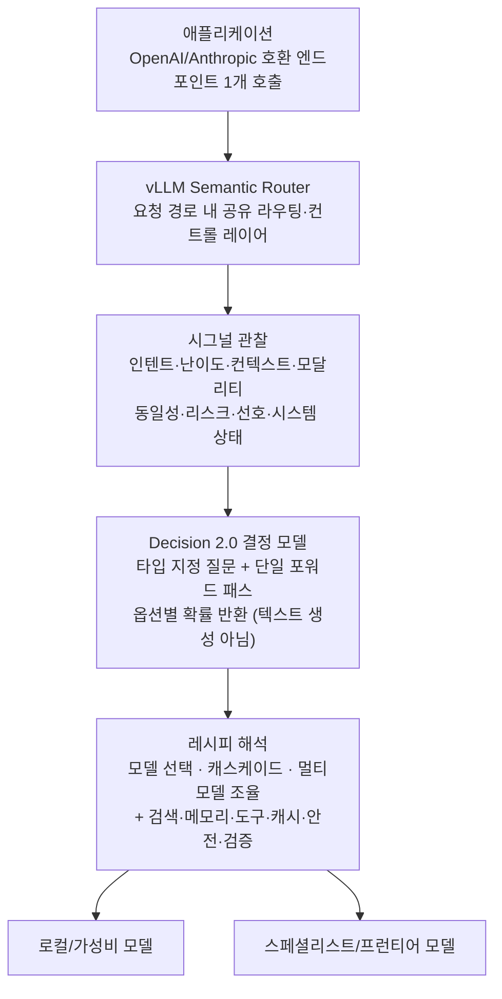

## 왜 읽어야 하나

Mixture-of-Models(이질적인 모델 집단을 하나의 시스템으로 묶는 구성)를 설계하는 플랫폼 엔지니어, 그리고 "요청마다 어떤 모델에 보낼지"를 애플리케이션 코드에 하드코딩해 두었다가 모델 교체마다 손보느라 곤혹을 겪는 개발자라면 이 글을 읽어야 합니다. 결론은 한 줄이면 충분합니다. **요청 라우팅의 결정 자체를 소형 모델에 맡기는 레이어가 오픈소스가 됐고, 그 결정 모델을 돌리는 가중치가 0.6B에서 27B까지 풀 사이즈로 오픈웨이트가 됐습니다.** vLLM 팀의 vLLM Semantic Router와 Decision 2.0 패밀리는 "이 요청을 어떤 능력 경로로 돌릴 것인가"를 단일 포워드 패스, 타입 지정 질문, 옵션별 확률로 결정하는 구조입니다.

## 개요

vLLM 프로젝트는 2026년 10월 3일(트윗 기준) "Decision 2.0: our newest state-of-the-art decision models, open in every size from 0.6B to 27B"를 소개했습니다. Hugging Face의 vllm-sr 컬렉션에 올라온 이 모델들은 vLLM Semantic Router(GitHub: vllm-project/semantic-router)라는 라우팅·컨트롤 레이어의 '결정 엔진'입니다.

Semantic Router는 "Mixture-of-Models를 프로그래밍 가능하게 한다"는 슬로건을 내걸고 있습니다. 공식 문서의 표현을 그대로 빌리면, 애플리케이션은 안정된 OpenAI 또는 Anthropic 호환 엔드포인트 하나를 호출한 채로, 서빙 레이어가 요청마다 능력 경로를 선택하거나 구성하게 됩니다. 클라우드, 데이터센터, 엣지에 걸친 이질적 AI 인프라 위에 MoM 시스템을 올리면서 발생하는 "누가 어떤 모델을 언제 쓰는가"라는 결정 문제를, 요청 경로 안의 공유 레이어로 빼내는 것이 이 프로젝트의 본체입니다.

이 글은 결정 모델의 개념 자체(System 1, 보정 확률, 타입 지정 출력)를 처음부터 설명하지 않습니다. 지난 10월 2일 자 [AutoTrust JEV-27B 포스트](/tech-blog/ko/research/jev-27b-vl-open-decision-model/)에서 그 개념과 '모델 클래스'로서의 확장이 이미 다뤄졌기 때문입니다. 이 글은 그 한 단계 위, 결정을 써서 라우팅을 프로그래밍하는 레이어와, 그 레이어를 실제로 돌리는 오픈웨이트 모델 패밀리에 집중합니다.

## vLLM Semantic Router란

문서가 짚는 문제를 먼저 보면 이 레이어가 왜 필요한지 드러납니다. 현대 AI 애플리케이션은 대체로 하나의 호환 가능한 모델에만 의존하지 않습니다. 어떤 요청은 빠른 로컬 모델로, 어떤 요청은 스페셜리스트나 프런티어 모델로, 또 어떤 요청은 검색과 메모리, 도구, 검증기에 이르기까지 여러 모델이 협력해야 합니다. 이 경로들은 클라우드와 데이터센터, 엣지를 오가며, 각자 능력과 지연, 비용, 신뢰라는 서로 다른 트레이드오프를 씁니다. 올바른 선택은 요청마다, 사용자마다, 세션마다, 현재 인프라 상태마다 바뀝니다.

문제는 이 선택을 각 애플리케이션이 자기 코드에 직접 쓰는 순간 발생합니다. 제품 코드가 현재 모델 플릿에 결합되고, 같은 라우팅 로직이 클라이언트마다 반복되며, 시스템이 커질수록 그 선택을 바꾸거나 설명하거나 평가하기 어려워집니다.


*요청마다 어떤 모델에 보낼지를 제품 코드에 직접 쓰는 '애플리케이션 종속 라우팅'의 병목 현장입니다. 슬라이드의 상태 라벨은 Tightly Coupled, 병목은 Extreme.* Semantic Router는 이 결정을 요청 경로 안의 공유 레이어로 옮깁니다. 레이어는 자기 앞에 놓인 일의 시그널을 관찰합니다. 인텐트, 난이도, 컨텍스트, 모달리티, 동일성, 리스크, 선호, 시스템 상태입니다. 그리고 그 시그널을 읽어 안정된 엔트포인트를 고립된 레시피(recipe)로 해석합니다.

레시피는 여덟 가지 행동을 취할 수 있습니다. 한 모델을 고르거나, 캐스케이드를 타고 격상시키거나, 유한한 멀티모델 워크플로우를 조율하거나, 검색·메모리·도구 필터·캐싱·안전 체크·검증 같은 행동을 덧붙이거나 하는 것입니다. 애플리케이션은 익숙한 API 하나를 유지한 채, 그 뒤의 능력 경로는 자유롭게 진화시킬 수 있습니다.


*시그널을 읽은 레이어가 고립된 레시피로 능력 경로를 구성합니다. 선택과 캐스케이드, 워크플로우 조율, 컨텍스트 주입, 무결성 제어의 4블록으로 묶인 여덟 가지 행동입니다.*



*Semantic Router의 요청 흐름. 애플리케이션은 엔드포인트 1개만 알고 있고, 시그널 관찰과 레시피 해석은 라우팅 레이어 안의 Decision 2.0 모델이 담당합니다.*

여기서 Decision 2.0 모델이 들어가는 지점은 '시그널을 읽어 레시피를 해석하는' 단계입니다. 라우팅 판단은 자연어 추론이 아니라 타입 지정 질문으로 바뀝니다. "이 요청은 어떤 클래스인가", "격상해야 하는가", "어떤 도구 집합인가" 같은 질문에 옵션별 확률을 받으면, 그 확률 값 자체가 분기 조건이 됩니다.

## Decision 2.0 모델 패밀리

패밀리는 다섯 개의 크기로 나옵니다. 트윗이 "0.6B에서 27B까지 오픈"이라고 한 것과 맞물려, Hugging Face vllm-sr 컬렉션에는 Decision-2.0-Kai-0.6B, Decision-2.0-Eos-0.8B, Decision-2.0-Sol-2B, Decision-2.0-Lux-9B, Decision-2.0-Vega-27B가 올라 있습니다. 모두 Apache-2.0 라이선스이며, 백본은 Qwen3 계열입니다.

| 모델 | 파라미터 | 컨텍스트 | 백본 (관계) |
|------|---------|---------|-------------|
| Kai-0.6B | 0.60B | 8,192 | Qwen3-0.6B-Base (파인튜인) |
| Eos-0.8B | 0.8B | [추정] | Qwen3 계열 |
| Sol-2B | 2B | [추정] | Qwen3 계열 |
| Lux-9B | 9B | [추정] | Qwen3 계열 |
| Vega-27B | 29.37B | 32,768 | Qwen3.8-27B (어댑터) |


*패밀리의 세 대표 크기. 슬라이드의 파라미터·컨텍스트 값은 모델 카드와 일치하며, 역할 설명(엣지 라우터, 밸런서, 분석 엔진)은 NLM의 요약 표현입니다.*

모델 카드에서 확인할 수 있는 수치는 두 끝단의 것입니다. 0.6B인 Kai와 27B인 Vega. 나머지 세 크기의 벤치마크는 공개 카드에서 직접 확인하지 못해 [추정]으로 표시했습니다.

Kai-0.6B의 카드가 말하는 것은 이렇습니다. JevArena에서 48.6로 동급(0.6B) 클래스에서 최고, 같은 크기의 비교 대상 4모델을 앞선다는 것입니다. 전 세대 Decision 1.0 Kai보다 JevArena +12.7, Jev Decision Index +9.8이 올랐습니다. 속도 수치는 단일 GPU에서 단일 질문 요청당 중앙값 4.9ms입니다. Vega-27B는 JevArena 74.0로 비교된 동급 4모델 중 최고이며, AutoJev-27B(72.1)와 통계적으로 동급으로 보고됩니다. Lux-9B보다 Jev Decision Index가 +11.2입니다. 단일 GPU에서 단일 질문 요청당 중앙값 71.4ms입니다.

```python
import json

from transformers import AutoModel

model = AutoModel.from_pretrained(
    "vllm-sr/Decision-2.0-Vega-27B", trust_remote_code=True
)
result = model.system_one(
    state="The order arrived damaged yesterday. The customer has "
          "a receipt and asks for a replacement today.",
    questions={
        "route": {
            "type": "choice",
            "instructions": "Which team should handle this request?",
            "criteria": {
                "returns": "Refunds, replacements and damaged deliveries",
                "billing": "Payments, invoices and charges",
                "technical": "Product setup and faults",
            },
        },
        # noul(예/아니오), score(점수) 타입 질문을 같은 입력에 함께 넣을 수 있음
    },
)
```

*모델 카드 퀵스타트. `system_one`이 상태와 타입 지정 질문을 받아 옵션별 확률을 돌려줍니다.*

인터페이스의 핵심은 `system_one`입니다. 입력은 소프트웨어의 현재 상태(텍스트 또는 JSON)와, 함께 답해야 할 질문 묶음입니다. 질문은 세 가지 타입을 씁니다. choice(여러 후보 중 하나), noul(예/아니오), score(스케일상 평가)입니다. 같은 입력에 관한 choice, 예/아니오, score 질문을 한 번에 넣고, 한 번의 포워드 패스로 모든 답에 확률을 받습니다. 답은 생성된 문장이 아니라 확률 분포입니다. 그래서 하류 코드가 파싱 없이 그 확률을 분기 조건으로 쓸 수 있습니다.

설치 명령은 모델 카드 기준입니다. Vega-27B는 `pip install "transformers>=5.17" torch safetensors peft`, Kai-0.6B는 `peft` 없이 `pip install "transformers>=5.17" torch safetensors`입니다. ONNX 변환본은 onnx-community 조직에서 제공합니다.

## 벤치마크 수치

모델 카드에 나온 수치를 그대로 옮기면 표입니다. 모두 제조자(vllm-sr) 보고 기준이며, 독립 재현 수치는 아닙니다.

| 항목 | Kai-0.6B | Vega-27B |
|------|----------|----------|
| JevArena | 48.6 (동급 1위) | 74.0 (동급 1위) |
| 대조 대상 | Decision 1.0 Kai | AutoJev-27B (72.1) |
| 세대 간 개선 | JevArena +12.7, Jev Decision Index +9.8 | Lux-9B 대비 Jev Decision Index +11.2 |
| 단일 질문 요청당 지연 (중앙값, 단일 GPU) | 4.9ms | 71.4ms |


*두 끝단의 속도(4.9ms, 71.4ms)와 정확도(JevArena 48.6, 74.0). 슬라이드의 수치는 모델 카드와 동일합니다.*

JevArena는 '결정 모델'이라는 범주를 열은 TypeSafe Jev 생태계의 벤치마크입니다. AutoTrust의 JEV-27B도 같은 지표를 쓰며, 이 포스트에서 'AutoJev-27B'가 대조 대상으로 등장하는 것은 이 범주 안에서 여러 오픈웨이트 플레이어가 같은 벤치마크로 경쟁하고 있다는 뜻입니다. 0.6B가 4.9ms, 27B가 71.4ms라는 지연 수치는 '결정 지점에 프런티어 LLM을 쓰지 않아도 된다'는 주장의 물리적 근거입니다.

## ThakiCloud 제품 적용 시사점

**ai-platform(Metis) 관점**: Semantic Router는 서빙 스택의 바로 앞에 앉는 레이어입니다. Metis가 K8s·Kueue·vLLM 서빙 위에서 멀티테넌트 모델 엔드포인트를 제공하는 것과 같은 지점입니다. 문서의 'SemanticRouter CRD' 항목이 이를 상징합니다. 라우팅 레이어 자체가 K8s 리소스로 배포될 수 있다면, Metis의 배포 체에 하나 더 얹히는 구성이 성립합니다. 결정 모델이 0.6B부터 시작하는 것은 이 지점에서 중요합니다. 소규모 노드, 엣지, 또는 비용이 우선인 경로에 Kai-0.6B를 놓고, 판단이 어려운 요청만 Vega-27B나 프런티어 모델로 격상시키는 캐스케이드는, 서빙 비용 곡선을 '요청 난이도'에 맞춰 가변적으로 만드는 설계입니다.


*K8s·vLLM 서빙 위 멀티테넌트 엔드포인트에 SemanticRouter CRD를 배포하고, 쉬운 요청은 0.6B에 맡기고 어려운 요청만 격상시키는 캐스케이드. 슬라이드의 COST OPTIMIZATION 라벨은 비선형 비용을 선형으로 편평화한다는 지점을 가리킵니다.*

**Paxis 관점**: Paxis는 에이전트의 모든 행동을 정책 게이트와 감사 로그로 통과시키는 Agent-Native Cloud 제어 평면입니다. 그 정책 게이트의 판정("이 도구 호출을 허용할 것인가", "이 실행 결과를 통과시킬 것인가")은 본질적으로 결정 문제입니다. JEV 포스트에서 다룬 것과 같은 논리가 여기에도 적용됩니다만, Decision 2.0이 주는 차이는 '크기 선택지'입니다. 게이트 판정을 담당하는 결정 모델을 워크로드 규모와 예산에 맞춰 0.6B에서 27B 사이에서 고를 수 있다면, 에이전트 플랫폼의 운영 비용은 고정값이 아니라 요청마다 조절 가능한 변수가 됩니다. 시그널 기반 라우팅과 Paxis의 정책 게이트는 같은 문제, "이 행동을 어디로 보낼 것인가"를 서로 다른 계층에서 푸는 것입니다.


*Agent-Native Cloud의 정책 게이트(도구 호출 허용 여부, 실행 결과 통과 여부) 역시 본질적인 라우팅 결정 문제. 워크로드와 예산에 맞춰 0.6B~27B를 배치한다는 지점입니다.*

## 한계 및 반론

**중간 크기 수치의 부재**: 이 글이 확인한 모델 카드는 0.6B(Kai)와 27B(Vega) 두 개입니다. Eos-0.8B, Sol-2B, Lux-9B의 벤치마크와 컨텍스트 길이는 공개 자료에서 직접 확인하지 못해 [추정]으로 뒀습니다. "풀 사이즈 오픈"이라는 서사는 다섯 크기가 모두 확인된 것은 아닙니다.

**JevArena의 외생성**: JevArena는 이 범주를 만든 TypeSafe 생태계의 벤치마크입니다. Decision 2.0이 '동급 1위'라는 말은 그 생태계 내부에서의 순위이며, 통상 추론 벤치마크(MMLU, HumanEval 계열)와의 교환 비율은 공개 자료에서 확인되지 않습니다.

**제조사 보고 수치**: 지연(4.9ms, 71.4ms)과 JevArena 점수 모두 vllm-sr의 모델 카드 기준입니다. 단일 GPU의 종류, 배치 크기, 하드웨어가 명시되지 않아 독립 재현 전에는 참고용으로 읽어야 합니다.

**'결정'의 품질 상한**: 보정 확률은 '말한 확률만큼 맞는다'는 뜻이지 '정답이다'는 뜻이 아닙니다. 시그널 관찰이 얼마나 신뢰할 수 있는지에 따라 레시피 해석의 품질이 결정됩니다. 시그널을 잘못 읽으면, 아무리 빠른 결정 모델이라도 잘못된 경로로 요청을 보냅니다.

## 정리

Decision 2.0이 던지는 질문은 JEV 포스트와 같습니다. "더 좋은 생성 모델"이 아니라 "판단을 내려 주는 모델"입니다. 다만 이번에는 그 모델이 '레이어' 안에 들어갑니다. 요청 라우팅이라는, 모든 MoM 시스템이 피할 수 없는 결정 지점에, 타입 지정 질문과 단일 포워드 패스, 옵션별 확률이라는 구조가 자리 잡았습니다.

에이전트 플랫폼이나 MoM 서빙을 돌린다면 다음 행동은 하나입니다. 지금 '요청마다 모델 경로를 고르는' 로직이 어디에, 어떻게 쓰여 있는지를 목록으로 정리해 보십시오. 그 로직이 if-else면 Semantic Router의 시그널 관찰로, 그 판단이 프런티어 LLM 호출이면 Decision 2.0의 어떤 크기로 바꿀 수 있는지를 따져보십시오. 0.6B에서 27B까지 오픈돼 있다는 것은, 그 판단의 비용과 품질을 스스로의 인프라 위에서 조절할 수 있다는 뜻입니다.

## 출처

- [vllm-sr Decision 2.0 (Hugging Face 컬렉션)](https://huggingface.co/collections/vllm-sr/decision-20-6ab7cf7bdfb506bf8269cb00)
- [vllm-sr/Decision-2.0-Vega-27B (모델 카드)](https://huggingface.co/vllm-sr/Decision-2.0-Vega-27B)
- [vllm-sr/Decision-2.0-Kai-0.6B (모델 카드)](https://huggingface.co/vllm-sr/Decision-2.0-Kai-0.6B)
- [vLLM Semantic Router (GitHub: vllm-project/semantic-router)](https://github.com/vllm-project/semantic-router)
- [vLLM Semantic Router 공식 문서 (Intro)](https://vllm-sr.ai/docs/intro/)
- [arXiv 2603.04444: vLLM Semantic Router: Signal Driven Decision Routing for Mixture-of-Modality Models](https://arxiv.org/abs/2603.04444)
- ThakiCloud 기술블로그: [결정만 내려주는 27B: JEV-27B-VL과 System 1 결정을 오픈웨이트로](/tech-blog/ko/research/jev-27b-vl-open-decision-model/)
- Xunzhuo Liu의 Decision 2.0 소개 트윗 (RT): [x.com/hjguyhan/status/2106396837322391941](https://x.com/hjguyhan/status/2106396837322391941)
