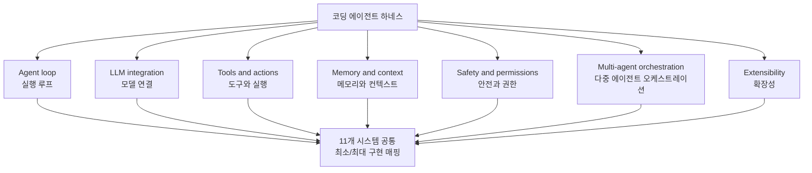

## 왜 읽어야 하나

코딩 에이전트를 직접 만들거나, 기존 에이전트의 하네스(loop, tools, context, safety 구조)를 유지보수하는 개발자와 플랫폼 담당자라면 이 논문을 읽어야 합니다. 결론부터 말하면, **11개 프로덕션 코딩 에이전트 약 400만 줄의 코드를 읽은 Wavestone AI Lab의 연구가 보여준 것은 "framework를 써서 만든다"가 아니라 "7개 정준 서브시스템을 각자 직접 설계해서 만든다"는 사실입니다.** 어떤 에이전트 런타임도 LangChain·LangGraph·AutoGen 같은 범용 agentic framework를 import하지 않았고, 코드 검색에 vector embedding을 쓰는 시스템도 하나 없었습니다.

> 📄 **심층 리뷰 전문(DOCX)**: 이 논문의 상세 피어리뷰를 [Google Drive에서 다운로드](https://drive.google.com/file/d/19-1vi1UPRvdsJbKB-zAvPTnhczUB6-IM/view)할 수 있습니다.

## 개요

2026년 10월 5일, "This might be the most useful paper on AI agents this year"이라는 트윗이 돌았습니다.바로 Wavestone AI Lab의 논문 "Harness Engineering"입니다. 정식 제목은 "Harness Engineering: Anatomy, Architecture, and Evolution of Coding Agents"로, 부제가 "A Source-Code Study of Eleven Systems"입니다.

논문 메타데이터를 정리하면 이렇습니다. arXiv 2609.00006, v1 제출은 2026년 7월 15일, 분야는 cs.SE와 cs.MA. 83쪽, 7개의 figure, 18개의 table이며, comment 필드에 "4월 연구의 두 번째, 상당 부분 확장된 판"이라고 적혀 있습니다. 저자는 Paul Barbaste, Tristan Darrigol, Germain Vu, Tom Wiltberger 4명입니다.

이 논문의 대상은 프로덕션에서 실제로 돌고 있는 코딩 에이전트 11개입니다. Claude Code, Codex CLI, Gemini CLI, Mistral Vibe, OpenHands, Aider, Mini-SWE-Agent, Hermes, Pi, OpenCode, OpenClaw. 여기에 Databricks의 Omnigent를 메타하니스 비교점으로 추가해 12개 트리를 다룹니다. 방법론은 실행이 아니라 읽기입니다. 의존성 manifest를 점검하고 세 언어(Python, TypeScript, Rust)의 import를 grep해서, 그 점검을 3개월 간격으로 두 번(2026년 4월과 7월 pin) 반복했습니다.

## 어떤 연구인가

핵심 프레임은 7개 정준 서브시스템입니다. 잘 만들어진 에이전트는 전부 이 7개 뼈대 위에 서 있습니다.

이 7개 축의 "관찰된 최소 구현"과 "최대 구현"을 매핑하는 것이 논문의 본체입니다. 각 시스템이 이 축에서 어디쯤 서 있는지, 무엇이 빠져 있고 무엇이 과도한지를 코드로 판독하는 것입니다.

가장 큰 발견은 논문이 twin absence(이중 부재)라 부르는 두 가지입니다.

첫째, framework 부재. 약 400만 줄에 걸쳐 어떤 에이전트 런타임도 범용 agentic framework를 import하지 않습니다. 대상은 LangChain, LangGraph, AutoGen, CrewAI, Pydantic AI, Genkit, Semantic Kernel, Google ADK까지 8개 family입니다. 의존성 manifest 점검과 3개 언어 import grep을 3개월 간격 두 번, 메타하니스 포함 12개 트리에서 이중 검증한 결과입니다.

둘째, 벡터 검색 부재. 11개 시스템 모두 코드 검색에 vector embedding을 쓰지 않습니다. 전부가 ripgrep, tree-sitter, glob, 자동 발견되는 Markdown 컨텍스트 파일(AGENTS.md, CLAUDE.md, CONTEXT.md), LSP 진단, git status injection에 의존합니다. 유일한 default embedding 구성은 OpenClaw의 memory-core(sqlite-vec KNN + FTS5/BM25)이고, 그것도 conversation memory 전용입니다.

## 주요 발견

**Skills가 MCP를 채택률로 역전했다.** SKILL.md 기반 skills가 9/11 시스템에, MCP가 8/11에 존재합니다. 4월 판에서는 6/8 동점이었고, Pi의 "skills는 있고 MCP는 없다"는 입장이 그 균형을 깨뜨렸습니다. 에이전트 확장 방식의 무게중심이 서브프로세스 프로토콜(MCP)에서 파일 기반 스킬(markdown + 툴 매핑) 쪽으로 이동하고 있다는 신호입니다.

**ACP가 6/11에 세 가지 역할로 침투했다.** Agent Client Protocol은 editor-agent 경계, harness hosting, cross-vendor A2A의 세 역할을 맡고 있습니다. OpenHands가 Claude Code, Codex, Gemini CLI를 교체가 가능한 step-backend로 실행하는 것이 대표 사례이고, A2A는 Gemini CLI 단독입니다.

**규모가 품질을 보장하지 않는다.** Mini-SWE-Agent의 약 50줄 linear loop(100줄 scaffold, bash 단일 도구)가 SWE-Bench Verified 74%+를 보고하는 반면, 훨씬 큰 Codex 코드베이스는 69.1%를 보고합니다. 논문은 둘 다 self-report이므로 모델·평가 런·deployment 구성이 달라 직접 비교는 불가하다고 명시하지만, "코드가 크면 강한 것은 아니다"라는 방향성은 분명합니다. 같은 맥락에서 size-implies-sandbox 상관관계도 반박됩니다. Hermes와 OpenCode는 코퍼스에서 큰 편인데 OS-level isolation이 0이고, Codex와 Gemini CLI는 bubblewrap+seccomp, Seatbelt, Job Objects 네이티브 크로스플랫폼 샌드boxed를 제공합니다. 안전 투자는 선택이지 규모의 귀결이 아닙니다.

**convergence가 imitation으로 변했다.** 90일 종단 관찰의 결과입니다. Codex는 Claude Code의 hook 어휘를 verbatim으로 채택했고, OpenHands는 Codex의 plugin manifest 포맷을 채택했습니다. deferred tool loading은 1개 시스템에서 3개로, read-only plan mode는 2에서 4(provider-native)로 늘었습니다. 패턴 확산의 반감기가 주 단위라는 점까지 추정합니다. 같은 기간 Codex의 Rust 워크스페이스는 거의 2배로 커졌고(621K 줄에서 약 1.12M 줄, 89개에서 126개 crate), Mistral Vibe는 +77%(35.6K에서 63K 줄)로 성장했습니다.

**Omnigent, 최초의 메타하니스.** Databricks가 2026년 6월에 오픈소스화한 Omnigent(Apache 2.0, v0.4.0, production Python 약 312K 줄)은 23개 canonical harness adapter(+16 alias)를 공통 API로 정규화하고, 코퍼스 harness 11개 중 5개를 단일 API 뒤에서 오케스트레이션합니다. 에이전트를 오케스트레이션하는 에이전트라는 계층이 실재하기 시작했다는 증거입니다.

**90줄 scaffold.** 논문의 실용적 산출물은 13개 cross-cutting observations, 29개 design patterns(4월 판 17 + 신규 12), 18개 design recommendations, 그리고 90줄 Python minimum-viable-harness scaffold(Listing 3)입니다. 이 scaffold는 18개 권장사항 중 10개를 직접 구현하는데, framework 의존성 0, RAG 0, vector store 0, 다중 에이전트 0, sandbox 0입니다. 외부 repo가 아니라 논문 본문 인라인에 공개되어 있습니다.

## ThakiCloud 제품 적용 시사점

Paxis는 ThakiCloud의 Agent-Native Cloud로, 하네스 설계 자체를 일급 리소스로 다루는 플랫폼입니다. 이 논문의 7개 정준 서브시스템은 Paxis의 레이어 구성과 거의 1:1로 대응합니다. loop, tools, context, safety, orchestration, extensibility. Paxis가 framework 위에서 감싸는 방식이 아니라 하네스 자체를 설계하는 길을 택한 것이, 11개 프로덕션 시스템의 독립적 선택과 같은 방향이라는 점에서 이 논문은 우리의 아키텍처 판단에 외부 근거를 제공합니다.

두 번째는 skills-first 관측입니다. Paxis는 960개 이상의 스킬을 BM25로 골라 격리 샌드박스에서 실행합니다. 논문이 "skills 채택률 9/11이 MCP 8/11을 역전했다"고 보고한 것은, 우리 플랫폼의 선택이 시장 전체의 이동 방향과 일치한다는 신호입니다. 파일 기반 스킬(마크다운 + 도구 매핑)은 버전 관리·감사·정책 게이트와 잘 맞물리는데, 이는 Paxis의 Audit Logs 일급 자원 설계와 같은 이유입니다.

세 번째는 "주 단위 반감기" 관찰의 함의입니다. 벤더 간 패턴 확산이 이토록 빠르면, 새 패턴을 따라잡는 것은 경쟁력이 아니라 유지비입니다. Paxis의 설계는 7개 정준 서브시스템이라는 안정적인 뼈대에 고정하고, 그 위의 표면 패턴(hook 어휘, manifest 포맷)은 policy-as-configuration으로 빠르게 흡수하는 방향이 맞습니다. 논문이 관찰한 "policy가 prompt 산문에서 configuration으로 이동"하는 흐름과도 일치합니다.

마지막으로, 90줄 scaffold는 내부 최소 하네스나 smoke 테스트용 baseline으로 바로 활용할 수 있는 참고 자료입니다. framework 0, RAG 0, vector store 0으로 "에이전트의 최소 뼈대"를 정의해 준다는 점에서는 우리 팀의 thin harness, fat skills 원칙과 동일한 철학입니다.

## 한계 및 반론

이 논문은 소스 코드 읽기 연구이지 runtime 측정 연구가 아닙니다. 어떤 시스템이 얼마나 빠른지는 논문의 주장 범위가 아니며, 모든 벤치마크 수치는 시스템 자체의 self-report입니다. Mini-SWE-Agent 74%+ 대 Codex 69.1% 같은 숫자를 경쟁 우열로 읽으면 안 되는 이유가 여기에 있습니다.

재현 가능성의 가장 약한 고리는 논문 스스로 인정하듯 Claude Code 분석이 2026년 3월 공개 순환 소스 스냅샷에 기반한다는 점입니다. 공식 릴리스가 아니라, 이미 상당하게 진화한 shipping binary(2.1.206)와 괴리가 있을 수 있습니다.

framework 부재 발견은 강력하지만 구조적으로 보수적입니다. 내부 fork, 동적 import를 통한 플러그인 로드, transpile된 배포물은 추적하지 않았으므로 "정말 아무도 쓰지 않는다"보다는 "표면적으로 import하지 않는다"가 정확한 표현입니다.

비교 방식도 독립적입니다. 11개 시스템이 공통 작업 세트에서 head-to-head로 실행된 것이 아니라, 각각 독립적으로 코드가 읽혔습니다. 직접 실행 비교는 한 단계 더 많은 비용이 든다는 것을 논문은 인지하고 있습니다.

또 하나, 읽는 쪽의 주의가 필요한 점은 이 논문이 Anthropic의 Claude의 substantial assistance를 받아 작성되었다고 공시(ACL/NeurIPS/ICML/IEEE disclosure policy 준수)하고 있다는 것입니다. "Claude Code에 대한 발견"을 읽을 때 이 관계를 아는 것이 좋습니다.

경관(landscape) 이벤트(시장 장악, 인수 소식 등)는 2026년 7월 10일 시점의 vendor 발표·릴리스 노트·repo 메타데이터에 기반하며, 코퍼스 주장과 달리 소스 검증이 안 된 부분이라고 논문이 명시합니다.

## 정리

에이전트를 만든다는 것의 답은 "어떤 framework를 쓸 것인가"가 아니라 "7개 서브시스템을 어떻게 설계할 것인가"에 있었습니다. 11개 프로덕션 시스템은 framework 없이도, 서로 다른 언어와 조직에서, 놀랍도록 비슷한 뼈대로 수렴해 있었고, 그 수렴은 이제 imitation으로 변해 주 단위 반감기로 퍼지고 있습니다.

다음 단계로 권하는 것은 두 가지입니다. 13개 observations과 29개 patterns을 자신의 하네스 점검 체크리스트로 쓰는 것, 그리고 90줄 scaffold를 기준으로 "우리 하네스에서 빠져 있는 축"을 찾는 것입니다. 이 논문이 남긴 가장 실용적인 유산은 framework가 아니라 그 7개의 질문입니다.

## 출처

- 논문 (arXiv abs): https://arxiv.org/abs/2609.00006
- PDF: https://arxiv.org/pdf/2609.00006v1
- HTML: https://arxiv.org/html/2609.00006
- 관련 트윗(2026-10-05): https://x.com/hjguyhan/status/2107064959188492787

> 📄 **심층 리뷰 전문(DOCX)**: 이 논문의 상세 피어리뷰를 [Google Drive에서 다운로드](https://drive.google.com/file/d/19-1vi1UPRvdsJbKB-zAvPTnhczUB6-IM/view)할 수 있습니다.
