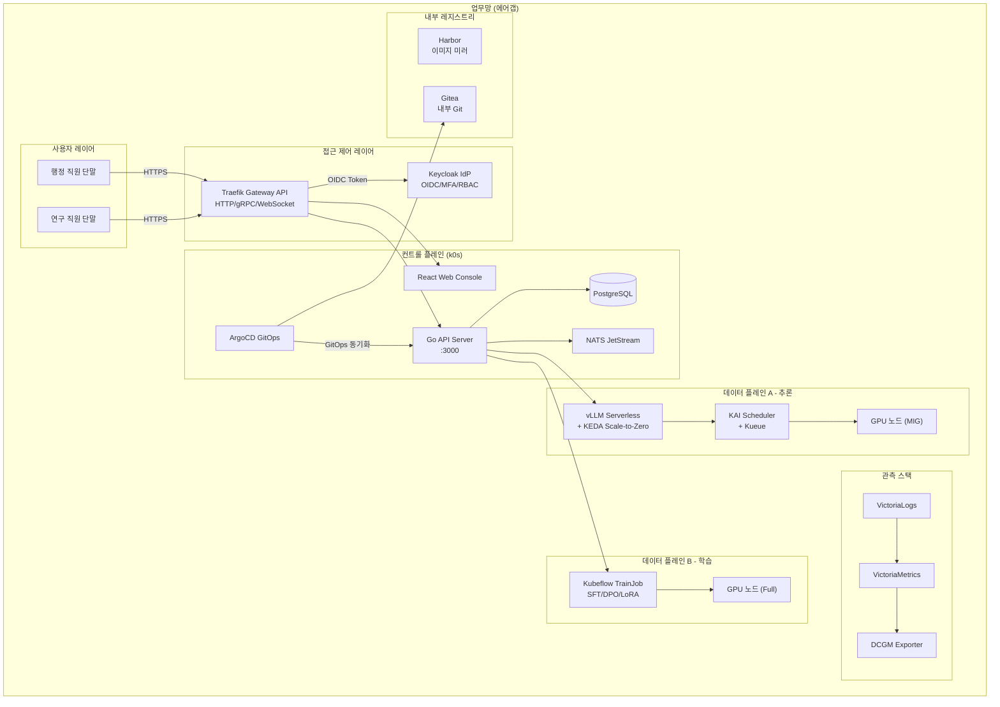

## 개요: 왜 지금 공공기관 주권 AI가 중요한가

2024년부터 국내 공공기관과 정부 부처를 중심으로 생성형 AI 도입 논의가 본격화되고 있습니다. 하지만 상당수 기관은 보안 규정과 법제도 때문에 퍼블릭 클라우드 LLM 서비스를 그대로 활용하기 어려운 상황입니다. 국가정보원의 보안관제 요건, 정보통신망법과 개인정보보호법에 따른 데이터 국내 저장 의무, 그리고 전통적인 망분리 정책이 외부 API 호출을 근본적으로 차단하기 때문입니다.

이런 환경에서 "AI 활용은 하고 싶지만 데이터가 외부로 나가면 안 된다"는 요구는 결국 한 가지 방향으로 수렴합니다. 바로 사내 GPU 인프라 위에서 LLM을 직접 운영하는 **주권 AI(Sovereign AI)** 입니다.

ThakiCloud는 Kubernetes 기반 AI/ML SaaS 플랫폼으로서, 온프레미스 및 에어갭(Air-Gap) 환경에 완전 배포 가능하도록 설계되어 있습니다. 이 글에서는 가상의 공공기관 사례를 통해 망분리 환경에서 LLM 서비스를 안전하게 구축하는 레퍼런스 아키텍처를 상세히 소개합니다.

---

## 공공기관이 마주하는 제약

### 망분리와 에어갭

국내 공공기관 IT 환경의 가장 큰 특징은 인터넷망과 업무망의 완전한 분리입니다. 단순한 논리적 분리를 넘어 물리적으로 네트워크가 단절된 에어갭 구성을 요구하는 기관도 많습니다. 이 경우 퍼블릭 클라우드 API 호출은 물론, 컨테이너 이미지 레지스트리에 대한 외부 접근도 불가능합니다. 배포에 필요한 모든 이미지와 패키지를 내부 레지스트리에 사전 미러링해야 합니다.

### 국정원 보안 요구사항

국가정보원이 제시하는 클라우드 보안 인증(CSAP) 및 보안관제 가이드라인은 시스템 접근 이력의 감사 로그 보관, 다중 인증(MFA), 역할 기반 접근제어(RBAC), 그리고 모든 민감 데이터의 국내 저장을 명시하고 있습니다. LLM 추론 요청에 포함될 수 있는 질의문 자체도 민감 정보로 분류될 수 있기 때문에, 추론 엔드포인트 역시 이 통제 범위 안에 포함됩니다.

### 온프레미스 네트워크 제약

온프레미스 환경에서 서비스 URL을 설계할 때도 고유한 제약이 따릅니다. 메모리에 기록된 사실로서, 온프레미스 환경에서는 와일드카드 DNS와 와일드카드 SSL 인증서를 모두 사용할 수 없는 경우가 많습니다. 따라서 서비스 접근 URL은 고정된 서브도메인 풀(예: `api.aiplatform.agency.go.kr`, `console.aiplatform.agency.go.kr`)을 사전에 확정하거나, 단일 호스트명에 포트 번호로 서비스를 구분하는 방식을 택해야 합니다. 이 제약은 플랫폼 설계 초기에 반드시 반영되어야 합니다.

### 데이터 국내 저장 의무

공공데이터관리법 및 개인정보보호법에 따라 공공기관이 처리하는 데이터는 국내 서버에 저장되어야 합니다. 해외 퍼블릭 클라우드로 LLM 질의를 보내는 것 자체가 이 의무에 저촉될 수 있습니다.

---

## 레퍼런스 아키텍처: 망분리 환경 배포 구성

아래는 가상의 A 중앙행정기관이 ThakiCloud AI Platform을 온프레미스 에어갭 환경에 구축하는 레퍼런스 아키텍처입니다.

### 핵심 구성 요소

**컨트롤 플레인과 데이터 플레인 분리**

ThakiCloud AI Platform의 문서(KSA 파트너 평가용 논리 아키텍처 참조)에 따르면, 플랫폼은 컨트롤 플레인과 데이터 플레인을 엄격하게 분리합니다. 컨트롤 플레인은 API 서비스, 상태, 오케스트레이션 로직을 관리하고, 데이터 플레인은 GPU 워크로드 실행과 추론 엔드포인트 서비스를 담당합니다. 이 분리 구조 덕분에 컨트롤 플레인 점검 중에도 데이터 플레인의 추론 서비스는 중단 없이 운영될 수 있습니다.

**에어갭 배포를 위한 내부 레지스트리**

외부 인터넷과 단절된 환경에서는 Harbor와 같은 내부 컨테이너 레지스트리를 구성하고, 모든 컨테이너 이미지를 사전 미러링해야 합니다. Kubernetes 클러스터 배포에는 표준 kubeadm 대신 경량 배포 도구인 k0s가 활용되며, 에어갭 설치를 공식 지원합니다. Helm 차트와 ArgoCD의 App-of-Apps 패턴을 결합하면 내부 Gitea 저장소를 단일 소스로 삼아 전체 클러스터 상태를 선언적으로 관리할 수 있습니다.

**vLLM 서버리스 추론과 Scale-to-Zero**

추론 워크로드는 vLLM을 기반으로 KEDA(Kubernetes Event-Driven Autoscaler)와 연동하여 Scale-to-Zero를 구현합니다. 요청이 없는 시간대에는 GPU 리소스를 반납하고, 요청이 들어오면 자동으로 스케일 업합니다. 이를 통해 제한된 온프레미스 GPU 자원을 효율적으로 공유할 수 있습니다.

---

## 보안 및 거버넌스

### Keycloak OIDC 기반 4계층 RBAC

ThakiCloud AI Platform은 Keycloak을 IdP(Identity Provider)로 사용하는 조직/프로젝트/그룹/사용자 4계층 RBAC 구조를 제공합니다. Web UI의 README에 따르면 Admin, Developer, Viewer 역할 할당과 Union+Deny 알고리즘 기반 권한 병합이 구현되어 있으며, JWT 토큰에 그룹 정보가 포함되어 실시간 권한 검증이 이루어집니다.

공공기관 환경에서는 부서 단위의 프로젝트 격리가 중요합니다. 예를 들어, 기획조정실과 정보화팀이 같은 플랫폼을 사용하더라도 각 부서의 LLM 질의 이력과 파인튜닝 데이터가 서로 노출되지 않도록 프로젝트 네임스페이스 수준에서 격리됩니다.

Keycloak MFA(다중 인증) 설정을 통해 국정원 보안관제 가이드라인의 강화 인증 요건을 충족할 수 있습니다. 공공기관의 인사 시스템이나 Active Directory와도 LDAP 페더레이션으로 연동이 가능합니다.

### ArgoCD GitOps와 변경 이력 관리

모든 플랫폼 구성 변경은 내부 Git 저장소의 Helm 차트 형태로 관리되고, ArgoCD가 이를 클러스터에 동기화합니다. 이 GitOps 패턴은 "누가, 언제, 무엇을 변경했는가"에 대한 완전한 감사 이력을 Git 커밋 로그로 확보할 수 있게 합니다. 수동으로 kubectl apply를 실행하는 즉흥적 변경(Configuration Drift)을 원천 차단하여, 감사 대응에 필요한 변경 이력의 신뢰성을 높입니다.

### 감사 로그와 관측 스택

추론 API 호출, 파인튜닝 작업 시작/종료, 사용자 로그인 및 권한 변경 이벤트는 모두 VictoriaLogs에 집중 수집됩니다. GPU 텔레메트리는 DCGM Exporter를 통해 VictoriaMetrics로 수집됩니다. 이 로그 데이터는 전체 사내 서버에 저장되므로 데이터 국내 저장 의무를 자연스럽게 충족합니다.

특히 국정원 보안관제 가이드라인에서 요구하는 접근 이력 보관을 위해, Python Admin API 서버(FastAPI)가 감사 로그(Audit Logs) 수집 역할을 별도로 담당합니다. 이 컴포넌트는 컨트롤 플레인 논리 아키텍처 문서에 명시된 구성으로, 각 API 요청의 주체, 시각, 대상 자원, 결과를 PostgreSQL에 저장하고 VictoriaLogs로도 스트리밍합니다. 감사 로그는 최소 6개월 이상 보관하는 정책으로 설정하며, 보관 기간은 기관 내규에 따라 조정할 수 있습니다.

관측 스택의 또 다른 강점은 GPU 자원 가시성입니다. DCGM Exporter가 GPU 온도, 메모리 사용량, 연산 이용률을 실시간으로 수집하여 VictoriaMetrics 대시보드에 표시합니다. 이를 통해 운영팀은 특정 GPU 노드의 과부하 여부를 조기에 파악하고, 워크로드 재배치 또는 냉각 조치를 선제적으로 취할 수 있습니다.

### 데이터 국내 저장 의무 충족

플랫폼의 모든 구성 요소가 기관 내부 서버에서 실행되므로, LLM 질의에 포함된 내용을 포함하여 어떠한 데이터도 외부로 전송되지 않습니다. 모델 가중치 파일 역시 내부 스토리지(Longhorn 또는 NFS)에 저장되어 관리됩니다.

---

## ThakiCloud AI Platform 적용 시사점

### 에어갭 완전 지원

ThakiCloud AI Platform은 초기 설계 단계부터 온프레미스와 에어갭 환경을 지원하도록 설계되었습니다. KSA(사우디아라비아) 주권 클라우드 배포를 위한 논리 아키텍처 문서가 실존하며, 바레메탈 서버, GPU 노드, InfiniBand 패브릭을 포함한 순수 온프레미스 스택 위에서 전체 플랫폼을 운영하는 레퍼런스가 있습니다. 이는 단순히 "온프레미스 설치를 지원한다"는 수준을 넘어, 퍼블릭 클라우드 종속성 없이 독립 운영이 가능한 완전한 풀스택 구성을 의미합니다.

### 6종 파인튜닝 파이프라인

공공기관은 범용 LLM을 그대로 사용하기보다 기관 특화 문서와 법령 데이터로 파인튜닝한 모델을 필요로 하는 경우가 많습니다. ThakiCloud AI Platform은 SFT, DPO, GRPO, CPT, GKD, LoRA 등 6종의 파인튜닝 방법을 Kubeflow TrainJob으로 지원합니다. 경쟁 솔루션 대비 다양한 파인튜닝 옵션을 단일 플랫폼에서 제공한다는 점이 차별점입니다.

### Kueue와 KAI 스케줄러를 통한 GPU 자원 효율화

공공기관은 퍼블릭 클라우드처럼 필요할 때 GPU를 즉시 추가 구매하기 어렵습니다. 제한된 GPU 자원을 여러 부서가 공정하게 나눠 쓰는 것이 중요합니다. Kueue와 KAI 커스텀 스케줄러는 페어셰어 큐잉과 Gang Scheduling을 지원하며, 유휴 GPU 자원을 회수하여 활용률을 높입니다(피치덱 기준 30~50% 회수[추정]). 단일 GPU를 MIG(Multi-Instance GPU)로 논리 분할하면 소규모 추론 요청을 더 세밀하게 배분할 수도 있습니다.

### 국정원 보안요구 대응 기반 확보

Keycloak OIDC MFA, 4계층 RBAC, ArgoCD 기반 변경 이력, VictoriaLogs 감사 로그, PostgreSQL 기반 감사 이벤트 저장은 국정원 보안관제 가이드라인의 핵심 요건에 대한 기술적 기반을 제공합니다. 다만, CSAP 인증 취득은 기술 구성 외에도 운영 절차, 인력, 물리 보안 등 비기술적 요소를 함께 갖추어야 하므로, 플랫폼 도입만으로 인증이 자동 달성되는 것은 아닙니다. 플랫폼은 기술적 통제 항목을 충족하는 출발점이 됩니다.

### 멀티클러스터 중앙 관리

규모가 큰 부처나 산하기관이 여러 개인 경우, NATS와 gRPC 기반의 멀티클러스터 중앙 관리 기능을 통해 분산된 GPU 클러스터를 단일 콘솔에서 운영할 수 있습니다. ArgoCD 매니저가 각 클러스터의 GitOps 동기화 상태를 통합 관리하므로, 복수 사이트 운영 시에도 일관된 구성을 유지하기 용이합니다.

---

## 한계 및 도입 고려사항

### 초기 구축 비용과 전문 인력

퍼블릭 클라우드 SaaS와 달리, 온프레미스 에어갭 배포는 초기 서버 구매, 네트워크 구성, 그리고 Kubernetes 운영 역량을 갖춘 내부 인력 또는 파트너를 필요로 합니다. 특히 에어갭 환경에서의 이미지 미러링, cert-manager를 통한 내부 CA 기반 TLS 인증서 발급, 내부 DNS 설계는 경험 있는 엔지니어가 필요한 작업입니다.

### 모델 업데이트와 보안 패치 관리

에어갭 환경에서는 새로운 LLM 모델 버전이나 플랫폼 보안 패치를 외부에서 자동으로 내려받을 수 없습니다. 주기적인 이미지 미러링 절차와 변경 검증 프로세스를 사전에 수립해야 하며, 이를 관리하는 운영 부담이 발생합니다.

### 온프레미스 DNS/SSL 제약 설계 선결

앞서 언급한 것처럼 온프레미스 환경에서는 와일드카드 DNS와 SSL을 사용하기 어려운 경우가 많습니다. 플랫폼 도입 전에 서비스별 고정 서브도메인 풀을 확정하거나, 포트 기반 접근 방식을 정책으로 결정해야 합니다. 이 결정이 늦어지면 배포 후 URL 구조 변경이 어려워집니다.

### CSAP 인증은 별도 추진 필요

ThakiCloud AI Platform은 기술적 통제 항목을 충족하는 기반을 제공하지만, CSAP 인증 자체는 기술 외 요소(운영 절차, 물리 보안, 인력 보안 등)를 포함한 종합적인 심사 과정입니다. 인증 취득을 목표로 한다면, 기관 내 정보보호 팀 또는 전문 컨설팅 파트너와 함께 별도의 인증 추진 계획을 수립하시기 바랍니다.

### 단계적 도입 권장

전체 플랫폼을 한 번에 도입하기보다, 추론 엔드포인트 서비스부터 시작하여 파인튜닝과 ML 파이프라인을 단계적으로 확장하는 방식이 현실적입니다. 초기에는 소규모 파일럿 클러스터로 운영 경험을 축적하고, 이후 멀티클러스터 구성으로 확장하는 로드맵을 권장합니다.

---

망분리와 에어갭 환경이라는 제약이 AI 도입의 장벽처럼 느껴질 수 있습니다. 그러나 이 제약은 오히려 데이터 주권과 보안 측면에서 명확한 경계를 제공하며, 사내 GPU 인프라를 체계적으로 관리하고 활용하는 계기가 될 수 있습니다. ThakiCloud AI Platform은 이 환경에 맞춰 설계된 풀스택 솔루션으로, 공공기관이 주권 AI를 안전하고 효율적으로 운영할 수 있는 기술적 토대를 제공합니다.

도입을 검토하고 계신다면 ThakiCloud 기술 팀에 문의하시면 기관 환경에 맞는 상세한 아키텍처 설계를 지원해 드립니다.
