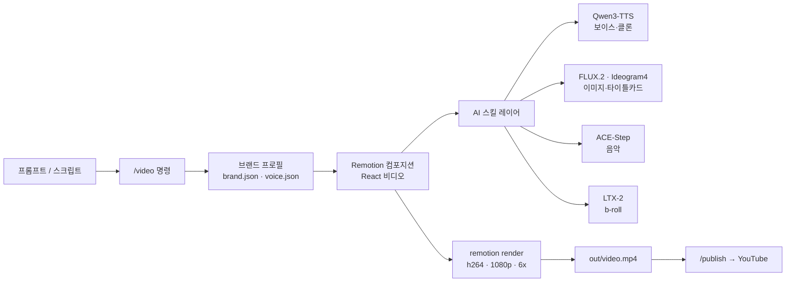

*빛 입자가 정렬된 프레임으로 조립되는 모습으로 표현한 자동 영상 파이프라인.*

## 개요

영상 제작은 오랫동안 전용 편집기와 사람의 손이 필요한 작업이었습니다. 그런데 최근에는 코딩 에이전트가 코드를 쓰듯 영상도 코드로 기술하고 렌더링하는 흐름이 자리를 잡고 있습니다. `digitalsamba/claude-code-video-toolkit`은 그 흐름을 Claude Code 위에 얹은 오픈소스 toolkit입니다. 발표 시점 기준으로 GitHub 스타 약 1.6천 개, 포크 268개, 커밋 182개를 기록하고 있고 라이선스는 MIT입니다.

핵심 발상은 단순합니다. 영상 프로젝트를 React 기반 프레임워크인 Remotion으로 기술하고, 보이스와 이미지, 음악, b-roll 같은 자산 생성은 오픈소스 AI 모델에 위임하며, 이 모든 과정을 Claude Code의 슬래시 명령과 스킬로 묶는 것입니다. 사용자는 `/video` 한 번으로 템플릿에서 프로젝트를 만들고, `/setup`으로 클라우드 GPU와 저장소, 보이스를 설정한 뒤 렌더링으로 넘어갑니다.

ThakiCloud는 쿠버네티스 기반 AI/ML SaaS 플랫폼을 운영하면서 GPU 워크로드를 매일 다룹니다. 영상 렌더링과 생성형 자산 합성은 전형적인 GPU 바운드 작업이고, 멀티테넌트 환경에서 자원을 어떻게 배분하느냐가 곧 비용입니다. 그래서 이 toolkit은 단순한 콘텐츠 도구가 아니라, 우리 플랫폼이 다루는 워크로드 유형의 한 사례로 읽을 가치가 있습니다. 이 글에서는 toolkit을 실제로 클론해 돌려본 결과를 먼저 보여드리고, 그다음 플랫폼 관점에서 의미를 짚겠습니다.

## 이 도구는 무엇인가

claude-code-video-toolkit은 Claude Code를 영상 제작 워크스테이션으로 바꾸는 구성 묶음입니다. 크게 세 가지 층으로 이해하면 편합니다.

첫째는 슬래시 명령 층입니다. `/setup`은 클라우드 GPU와 파일 전송, 보이스 설정 같은 첫 환경 구성을 대화형으로 안내합니다. `/video`는 프로젝트를 만들고 열며, `/scene-review`는 Remotion Studio에서 장면별 검토를 돕습니다. 이 외에도 `/brand`, `/template`, `/generate-voiceover`, `/voice-clone`, `/redub`, `/record-demo`, `/publish` 등 영상 제작의 단계마다 명령이 준비되어 있습니다. `/publish`는 완성한 영상을 YouTube로 올리며 메타데이터를 `project.json`에서 자동으로 채웁니다.

둘째는 스킬 층입니다. Claude Code가 깊이 있게 다룰 수 있도록 도메인 지식을 묶어둔 것으로, Remotion(React 기반 영상 프레임워크), elevenlabs(음성), ffmpeg(미디어 처리), playwright-recording(브라우저 데모 녹화), frontend-design(시각 디자인), qwen-edit(이미지 편집), ideogram4(인-이미지 텍스트가 강한 이미지 생성), acestep(음악), ltx2(텍스트·이미지 기반 영상 클립), moviepy(파이썬 영상 합성), runpod(클라우드 GPU)까지 열한 가지가 포함됩니다.

셋째는 템플릿과 브랜드 층입니다. `templates/`에는 sprint-review, sprint-review-v2, product-demo, 그리고 9:16 세로형 숏폼을 위한 concept-explainer-short가 들어 있습니다. `brands/`에는 색상과 폰트, 보이스 설정을 담은 브랜드 프로필을 정의해 두고, `/video`로 프로젝트를 만들 때 자동으로 적용합니다. 아래 그림은 이 세 층이 어떻게 하나의 파이프라인으로 연결되는지를 보여줍니다.



특히 눈에 띄는 점은 비용 구조입니다. toolkit은 보이스(Qwen3-TTS), 이미지(FLUX.2), 음악(ACE-Step) 같은 생성형 자산을 상용 API가 아니라 오픈소스 모델에 의존하도록 설계했습니다. 사용자가 자신의 클라우드 GPU 계정에 모델을 배포해 원가로 돌리는 방식입니다. 저장소로는 Cloudflare R2의 무료 구간(10GB, 이그레스 무료)을, 컴퓨팅으로는 Modal의 스타터 플랜 월 30달러 무료 크레딧을 활용할 수 있다고 안내합니다. 자체 호스팅을 전제로 한 이 선택은 뒤에서 다룰 플랫폼 관점과 정확히 맞닿아 있습니다.

## 설치 및 통합

문서가 안내하는 빠른 시작은 다음과 같습니다. 저장소를 클론하고, 선택적으로 파이썬 의존성을 설치한 뒤 Claude Code를 여는 흐름입니다.

```shell
git clone https://github.com/digitalsamba/claude-code-video-toolkit.git
cd claude-code-video-toolkit
python3 -m pip install -r tools/requirements.txt   # 선택: AI 보이스오버·이미지 생성·음악·moviepy 예제
claude                                              # toolkit 안에서 Claude Code 실행
```

그다음 Claude Code 안에서 `/setup`으로 클라우드 GPU와 저장소, 보이스를 약 5분간 대화형으로 구성하고, `/video`로 첫 프로젝트를 만듭니다. 요구 사항은 Node.js 18 이상과 Claude Code이며, AI 도구를 쓰려면 파이썬 3.9 이상이 권장됩니다. FFmpeg는 선택입니다.

여기서 중요한 점은, 설정 없이도 곧바로 렌더링만 확인할 수 있는 경로가 따로 있다는 것입니다. `examples/hello-world`는 API 키가 전혀 필요 없는 최소 예제입니다. 저는 이 경로를 그대로 따라 실제로 돌려봤습니다.

```shell
cd examples/hello-world
npm install
npm run render
```

`hello-world`의 `package.json`을 보면 렌더 스크립트는 `npx remotion render src/index.ts SprintReview out/video.mp4`이고, 의존성은 Remotion 4.0.425 계열과 React 18입니다. 즉 별도의 외부 모델 호출 없이 React 컴포지션을 그대로 영상으로 굽는 구조입니다.

## 실제 실험 결과

검증은 격리된 git worktree 안에서 진행했고, 모든 수치는 실행 로그에서 그대로 가져왔습니다. 실행 환경은 Apple Silicon(arm64), Node.js 24.1.0, npm 11.3.0입니다.

먼저 의존성 설치입니다. `npm install`은 230개 패키지를 추가했고 약 3.5초가 걸렸습니다. 다만 감사 결과 10건의 취약점(보통 7건, 높음 3건)이 보고되었는데, 이 부분은 한계 절에서 다시 짚겠습니다.

렌더링 단계에서는 Remotion이 처음 한 번 Chrome Headless Shell을 내려받습니다. 이번 실행에서는 약 90.2MB를 다운로드했고, 이는 최초 1회성 비용입니다. 이어서 번들링과 합성이 진행되었습니다. 컴포지션은 `SprintReview`, 코덱은 h264, 동시성은 6배(6x)였고 전체 750프레임을 렌더링했습니다. 로그에는 "Cached bundle. Subsequent renders will be faster"라는 안내가 남아, 두 번째 실행부터는 번들 캐시 덕분에 더 빨라진다는 점을 명시합니다.

콜드 상태에서 다운로드와 번들링, 렌더링, 인코딩을 모두 포함한 `npm run render`의 벽시계 시간은 18.4초였습니다. 최종 산출물은 1920x1080 해상도, 30fps, 길이 25.0초, 용량 2.15MB(2,152,829바이트)의 h264 영상이었고 AAC 오디오 트랙을 포함했습니다. API 키는 하나도 쓰지 않았습니다.


*API 키 없이 측정한 hello-world 1080p 렌더 파이프라인의 단계별 벽시계 시간.*

정리하면, 별도 환경 구성 없이 클론 직후 약 30초 안에 1080p 영상 한 편이 손에 들어왔습니다. "2분 안에 렌더된다"는 예제 설명보다 오히려 빠른 결과였는데, 이는 하드웨어와 네트워크 상황에 따라 달라질 수 있으므로 절대적인 수치로 받아들일 필요는 없습니다. 중요한 것은 진입 장벽이 그만큼 낮다는 사실입니다.

## ThakiCloud 쿠버네티스 AI/ML SaaS 플랫폼 적용 및 시사점

이 toolkit이 흥미로운 이유는 우리 플랫폼이 다루는 워크로드와 구조적으로 닮았기 때문입니다. 영상 렌더링과 생성형 자산 합성은 모두 GPU 바운드 배치 작업이고, 짧고 굵게 자원을 쓰다가 유휴 상태로 돌아가는 패턴을 보입니다. ThakiCloud는 쿠버네티스 위에서 Kueue로 GPU 작업을 큐잉하고 우선순위를 매기며, vLLM 등으로 모델을 서빙합니다. toolkit이 권장하는 Modal·Daytona식 서버리스 영속성, 즉 유휴 시 환경을 동면시키고 요청 시 깨우는 모델은 우리가 Kueue로 달성하려는 자원 효율과 같은 문제를 다른 층위에서 푸는 방식입니다.

자랑할 만한 접점은 비용과 자체 호스팅입니다. toolkit은 상용 API 대신 Qwen3-TTS, FLUX.2, ACE-Step 같은 오픈웨이트 모델을 자신의 GPU에 올려 원가로 돌리도록 설계되어 있습니다. 이는 온프레미스와 자체 호스팅을 강점으로 내세우는 ThakiCloud의 방향과 정확히 일치합니다. 고객이 데이터와 모델을 외부로 내보내지 않고, 보안 요구가 높은 환경에서도 멀티테넌트로 생성형 워크로드를 운용하려 할 때, 우리 플랫폼은 이런 영상·미디어 파이프라인까지 자연스럽게 수용할 수 있습니다.

내부 활용 각도도 분명합니다. sprint-review와 product-demo 템플릿은 엔지니어링 조직이 반복적으로 만드는 산출물입니다. 이런 영상 생성을 쿠버네티스 잡으로 묶어 Kueue 큐에 태우면, 개발자가 로컬에서 무거운 렌더링을 돌리는 대신 공용 GPU 풀에서 우선순위에 따라 처리하도록 옮길 수 있습니다. toolkit 자체가 Claude Code에 묶여 있다는 점은 제약이지만, Remotion 렌더 단계만 떼어내 컨테이너화하면 우리 배치 인프라에 얹는 일은 어렵지 않습니다.

## 한계 및 반론

장점만 보기에는 분명한 약점들이 있습니다. 첫째, 의존성 보안입니다. 최소 예제의 `npm install`에서도 10건의 취약점(높음 3건 포함)이 보고되었습니다. 프로덕션에 올리려면 의존성 감사와 고정이 선행되어야 하며, 이는 자동화 파이프라인의 게이트로 강제하는 편이 안전합니다.

둘째, 무료라는 표현의 범위입니다. API 키 없이 곧바로 되는 것은 템플릿 기반 렌더링까지입니다. 보이스, 이미지, 음악, b-roll 같은 생성형 자산을 쓰려면 결국 자신의 클라우드 GPU에 모델을 배포해야 하고, 그 시점부터는 컴퓨팅 비용과 운영 부담이 생깁니다. "무료"는 원가로 직접 운용한다는 뜻이지 비용이 없다는 뜻이 아닙니다.

셋째, 도구 결합입니다. 이 워크플로는 Claude Code와 강하게 결합되어 있습니다. 슬래시 명령과 스킬이라는 추상화가 편리한 만큼, 특정 에이전트 환경에 종속되는 측면이 있습니다. 다행히 핵심 렌더링은 Remotion이라는 독립 프레임워크가 담당하므로, 필요하면 그 부분만 분리해 다른 오케스트레이션에 옮길 여지는 남아 있습니다.

넷째, Remotion은 React로 영상을 기술합니다. 디자이너나 비개발 직군에게는 진입 장벽이 될 수 있고, 복잡한 모션 그래픽을 코드로 다루는 일은 전용 편집기보다 손이 더 갈 수 있습니다. 결국 이 toolkit은 "코드로 영상을 다루는 데 익숙한 팀"에 가장 잘 맞습니다.

종합하면, claude-code-video-toolkit은 코드 친화적인 영상 자동화의 좋은 출발점입니다. API 키 없이 1080p 영상을 30초 안에 뽑아내는 경험은 분명한 강점이고, 오픈소스 모델 기반의 자체 호스팅 철학은 우리 플랫폼의 지향과도 잘 맞습니다. 다만 생성형 자산 단계의 실제 비용과 의존성 보안, 도구 결합이라는 현실을 함께 고려해야 균형 잡힌 판단이 가능합니다.

## 출처

- GitHub: [digitalsamba/claude-code-video-toolkit](https://github.com/digitalsamba/claude-code-video-toolkit)
- Remotion: [remotion.dev](https://www.remotion.dev/)
- 실측 환경: Apple Silicon(arm64), Node.js 24.1.0, npm 11.3.0 / 모든 수치는 직접 실행 로그에서 추출했습니다.
