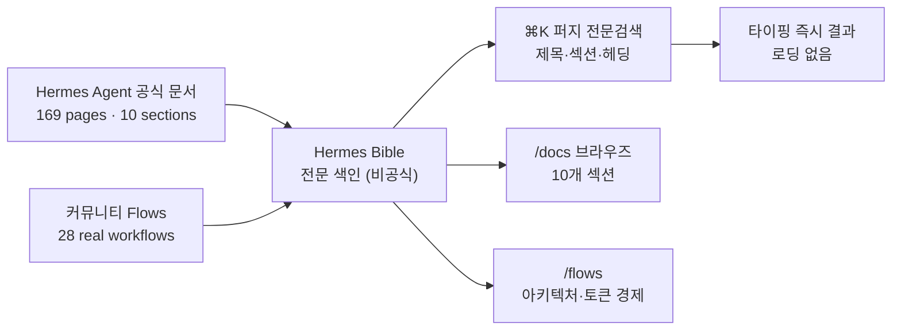

*수많은 문서 노드가 하나의 밝은 검색 지점으로 수렴하는 모습으로 표현한 색인 검색.*

## 개요

에이전트 프레임워크가 강력해질수록 역설적으로 문서가 발목을 잡습니다. 기능이 빠르게 늘면서 문서 페이지 수가 수백 단위로 불어나고, 정작 필요한 한 줄을 찾는 일이 점점 어려워지기 때문입니다. Nous Research가 2026년 2월 공개한 Hermes Agent도 마찬가지입니다. 공식 문서는 잘 정리되어 있지만 분량이 방대하고, 거기에 더해 커뮤니티가 공유하는 실전 노하우는 X(트위터)와 여기저기에 흩어져 있습니다.

`Hermes Bible`(hermesbible.com)은 이 문제를 정면으로 겨냥한 비공식 커뮤니티 사이트입니다. Hermes Agent 공식 문서의 모든 페이지와, 커뮤니티가 만든 실전 워크플로를 한곳에 색인해 두고, 단축키 한 번으로 전문 검색을 제공합니다. 사이트 스스로 "비공식, 커뮤니티 제작, Nous Research와 무관"임을 명확히 밝히고 있습니다.

ThakiCloud는 쿠버네티스 기반 AI/ML SaaS 플랫폼을 운영하면서 내부적으로 1000개가 넘는 스킬과 다수의 운영 룰을 다룹니다. 그래서 "방대한 에이전트 지식을 어떻게 검색 가능하게 만드느냐"는 주제는 우리에게도 매일의 과제입니다. 이 글에서는 Hermes Bible이 무엇을 어떻게 담았는지 살펴보고, 공식 문서와의 차이, 그리고 우리 플랫폼 관점의 시사점을 함께 정리합니다.

## 이 사이트는 무엇인가

Hermes Bible의 핵심 기능은 색인과 검색입니다. 사이트는 Hermes Agent 문서 169페이지를 10개 섹션으로 나눠 담고 있습니다. Getting Started(설치·퀵스타트·학습 경로 등 6페이지), Core Features(기능 개요·툴·스킬 시스템·큐레이터 등 45페이지), Messaging Platforms(메시징 게이트웨이·텔레그램·디스코드·슬랙 등 30페이지), Secrets(2페이지), Skills, Using Hermes(CLI·TUI·설정·모델 구성 등 15페이지) 등으로 구성됩니다.

검색은 ⌘K로 호출하며, 모든 페이지의 제목과 섹션, 헤딩을 가로지르는 전문 퍼지 검색입니다. 사이트 설명에 따르면 로딩이나 대기 없이 입력하는 즉시 결과가 나타납니다. 방대한 문서에서 키워드 하나로 정확한 위치를 초 단위로 찾는 경험을 목표로 한 셈입니다. 아래 그림은 이 사이트가 공식 문서와 커뮤니티 워크플로를 어떻게 하나의 검색 표면으로 통합하는지를 보여줍니다.

차별점은 Flows 라이브러리입니다. 공식 문서를 넘어, 커뮤니티가 실제로 구축한 멀티 에이전트 자동화 워크플로 28개를 모아 둡니다. 각 워크플로는 전체 아키텍처와 토큰 경제, 오케스트레이션 패턴까지 포함해, 검색하고 연구하고 적용할 수 있게 정리되어 있습니다. 예를 들어 한 글은 "아무도 이야기하지 않지만 매일 여는" Hermes 대시보드(localhost:9119)를 24시간 에이전트를 건강하게 유지하는 운영 표면으로 소개하며 Sessions, MCP, Skills, Cron, Analytics, Logs, System을 다룹니다. 또 다른 글 "Hermes Agent 사용의 15단계"는 첫 원샷 프롬프트부터 여러 프로파일로 비즈니스를 자동화하는 단계까지를 토큰 경제와 함께 정리하고, Hermes Agent v0.17.0 기준으로 검증했다고 밝힙니다.

참고로 Hermes Agent 자체는 Nous Research가 MIT 라이선스로 공개한 프로젝트로, 발표 시점 기준 GitHub 스타 약 20만 개, 포크 3.5만 개, 커밋 1.2만여 개를 기록하고 있습니다. 에이전트가 경험에서 스킬을 만들고, 사용 중에 스킬을 스스로 개선하며, 세션을 가로질러 사용자를 모델링하는 "닫힌 학습 루프"를 내세웁니다. Hermes Bible은 이 빠르게 진화하는 프로젝트의 지식을 따라잡기 위한 커뮤니티의 대응으로 볼 수 있습니다.

## ThakiCloud 플랫폼 관점의 시사점

Hermes Bible을 단순한 검색 사이트가 아니라 하나의 패턴으로 보면 우리에게 직접적인 교훈이 됩니다. ThakiCloud는 내부적으로 1000개가 넘는 스킬과 운영 룰을 운용하는데, 이는 Hermes Agent 문서가 직면한 것과 똑같은 "방대한 지식의 검색 가능성" 문제입니다. 실제로 우리 플랫폼에는 이미 BM25 기반 스킬 검색 게이트가 매 작업 턴에 후보를 띄우는 장치가 들어가 있습니다. Hermes Bible의 ⌘K 즉시 전문 검색은 바로 이 방향, 즉 "지식이 많아질수록 검색이 곧 생산성"이라는 명제를 사용자 경험 측면에서 잘 보여줍니다.

특히 흥미로운 부분은 Flows 개념입니다. 공식 문서가 기능을 설명한다면, Flows는 그 기능을 엮어 만든 실전 레시피를 아키텍처와 토큰 경제까지 곁들여 공유합니다. 이는 ThakiCloud가 스킬과 룰을 "실패 사례와 gotchas, 검증된 골격까지 함께 패키징한 능력 상품"으로 다루는 철학과 정확히 같은 발상입니다. 단일 프롬프트가 아니라 입력에서 처리, 출력, 에러 복구까지 묶인 재사용 가능한 워크플로로 지식을 축적할 때, 검색과 공유의 가치가 비로소 복리로 쌓입니다.

운영 관점에서도 닿는 지점이 있습니다. Hermes 대시보드가 Sessions, Cron, Skills, Analytics, Logs를 한 화면에 모아 24시간 에이전트를 관리하듯, 우리 역시 무인 루프와 스케줄 작업을 중앙 레지스트리로 가시화하는 방향으로 운영을 설계합니다. 빠르게 진화하는 에이전트 시스템에서 "지금 무엇이 돌고 있고 무엇을 읽고 쓰는지"를 한눈에 보는 일은 안정적 운용의 전제입니다.

## 한계 및 반론

가장 분명한 한계는 비공식이라는 점입니다. Hermes Bible은 Nous Research와 무관한 커뮤니티 프로젝트이므로, 색인된 내용이 항상 최신 공식 문서와 일치한다는 보장이 없습니다. Hermes Agent는 커밋이 1만 건을 넘는 빠르게 움직이는 프로젝트입니다. 비공식 색인은 본질적으로 시차를 가질 수밖에 없고, 특히 보안에 민감한 설정이나 시크릿 관리 같은 영역에서는 반드시 공식 문서를 최종 기준으로 삼아야 합니다.

둘째, 공식 문서가 이미 기계 친화적 진입점을 제공한다는 사실도 고려해야 합니다. Hermes Agent 공식 문서는 모든 페이지를 짧은 설명과 함께 색인한 `/llms.txt`(약 17KB)와 전체를 하나로 합친 `/llms-full.txt`(약 1.8MB)를 제공합니다. LLM이 문서를 통째로 읽어 들이는 용도라면 이 공식 경로가 더 권위 있고 안정적입니다. 즉 Hermes Bible의 강점은 어디까지나 사람이 빠르게 검색하고 커뮤니티 워크플로를 둘러보는 경험에 있습니다.

셋째, 외부 의존이라는 일반적 위험이 있습니다. 회사 블로그나 운영 문서가 제3자 사이트를 핵심 동선으로 끌어들이면, 그 사이트가 사라지거나 방향을 바꿀 때 링크가 깨질 수 있습니다. Hermes Bible은 발견과 학습의 보조 도구로 활용하되, 우리 내부 운영의 단일 진실 소스로 삼는 것은 적절하지 않습니다.

종합하면, Hermes Bible은 빠르게 진화하는 에이전트 프레임워크의 지식을 사람이 따라잡도록 돕는 잘 만들어진 커뮤니티 자산입니다. 다만 비공식이라는 본질적 시차와 외부 의존을 인지하고, 공식 문서를 기준점으로 두는 균형이 필요합니다. 무엇보다 이 사이트가 보여주는 "방대한 에이전트 지식을 검색 가능하게, 그리고 실전 워크플로로 공유 가능하게 만든다"는 패턴 자체가, 우리처럼 대규모 스킬과 룰을 운용하는 플랫폼에 가장 값진 시사점입니다.

## 출처

- Hermes Bible: [hermesbible.com](https://www.hermesbible.com/)
- Hermes Agent (Nous Research): [github.com/NousResearch/hermes-agent](https://github.com/NousResearch/hermes-agent)
- 공식 문서: [hermes-agent.nousresearch.com/docs](https://hermes-agent.nousresearch.com/docs/)
