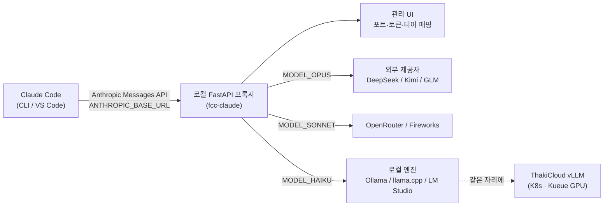

## 개요

지난 며칠 사이 "Claude Code를 영원히 무료로 쓰는 깃허브 레포"라는 글이 타임라인을 도배했습니다. 자극적인 헤드라인을 걷어내고 실체를 들여다보면, 이것은 무료 해킹이 아니라 **코딩 에이전트의 모델 트래픽을 라우팅하는 프록시**입니다. 정확히는 `Alishahryar1/free-claude-code` 레포가 Claude Code CLI와 VS Code 확장이 보내는 Anthropic Messages API 요청을 로컬에서 가로채서, DeepSeek·Kimi·Qwen·GLM(Z.ai)·Fireworks 같은 외부 제공자나 Ollama·llama.cpp·LM Studio 같은 로컬 엔진으로 다시 보내는 구조입니다.

이 주제가 ThakiCloud 블로그에 올라올 가치가 있는 이유는 "공짜"라서가 아닙니다. 코딩 에이전트가 더 이상 특정 모델 벤더에 묶이지 않고, **고객이 직접 통제하는 오픈웨이트 모델 위에서 돌아갈 수 있다**는 점 때문입니다. 온프레미스와 데이터 주권을 핵심 가치로 내세우는 K8s 기반 AI/ML SaaS 플랫폼 입장에서, 이 프록시 패턴은 우리가 vLLM으로 서빙하는 모델 위에 코딩 에이전트를 얹는 가장 현실적인 경로를 보여줍니다.

이 글에서는 무료라는 프레이밍을 떼어내고, 프록시의 실제 아키텍처와 설정 방식을 분석한 뒤, 이 패턴을 우리 플랫폼에 어떻게 적용할 수 있는지, 그리고 어떤 한계와 위험이 있는지를 솔직하게 정리합니다.

## 이 도구는 무엇인가

free-claude-code의 핵심은 단순합니다. Claude Code는 환경 변수 `ANTHROPIC_BASE_URL`로 API 엔드포인트를 바꿀 수 있게 설계되어 있습니다. 이 도구는 그 점을 이용해 로컬에 작은 **FastAPI 프록시**를 띄우고, Claude Code의 요청을 그 프록시로 향하게 만듭니다. 프록시는 들어온 Anthropic Messages 형식 요청을 받아, 설정된 대상 제공자의 형식으로 변환해 전달하고, 응답을 다시 Anthropic 형식으로 되돌려 줍니다.

즉, 클라이언트(Claude Code)는 자기가 Anthropic과 대화하고 있다고 믿지만, 실제 추론은 전혀 다른 모델이 수행합니다. 클라이언트의 프로토콜은 그대로 유지되므로 Claude Code 자체를 수정하지 않습니다. 이 "프로토콜 호환 프록시" 방식은 claude-code-router 계열 도구들이 공유하는 패턴이며, free-claude-code는 그 위에 관리 UI와 여러 제공자 프리셋을 얹은 형태입니다.

지원 제공자는 Anthropic Messages 스타일 전송을 쓰는 곳들입니다. 공개된 README 기준으로 OpenRouter, DeepSeek, Kimi(Moonshot), Fireworks AI, Z.ai(GLM 계열), 그리고 로컬 엔진인 LM Studio, llama.cpp, Ollama가 포함됩니다. 각 제공자마다 모델 목록 URL과 약간씩 다른 전송 규약이 있어, 프록시가 그 차이를 흡수합니다.

가장 흥미로운 기능은 **티어별 라우팅**입니다. Claude Code는 내부적으로 Opus·Sonnet·Haiku 세 등급을 구분해 호출합니다. 무거운 추론에는 Opus, 일반 작업에는 Sonnet, 가벼운 작업에는 Haiku를 쓰는 식입니다. free-claude-code의 관리 UI에서는 `MODEL_OPUS`, `MODEL_SONNET`, `MODEL_HAIKU`를 각각 다른 제공자·모델로 지정할 수 있습니다. 예를 들어 무거운 작업은 DeepSeek의 추론 모델로, 가벼운 작업은 로컬 Ollama의 소형 모델로 보내는 식의 비용·성능 분리가 가능합니다. 이 발상 자체는 우리가 서브에이전트를 Haiku·Sonnet·Opus로 나눠 라우팅하는 원칙과 정확히 같습니다.

## 아키텍처: 프록시가 가로채는 지점

전체 흐름은 다음과 같습니다. 관리 UI가 프록시 설정을 관리하고, 런타임 설정이 바뀌면 서버를 재시작합니다. `fcc-claude` 런처는 매번 실행될 때 관리 UI가 관리하는 현재 포트와 인증 토큰을 읽어옵니다. 프록시 인증을 비워 두면, 런처는 Claude Code의 로컬 로그인 검사를 통과시키기 위해 `ANTHROPIC_AUTH_TOKEN=fcc-no-auth`만 주입하고, 프록시는 빈 인증을 비활성화로 취급합니다.

아래 도표는 요청이 가로채지는 지점을 보여줍니다.



핵심은 변환 계층입니다. Claude Code가 보내는 요청은 Anthropic Messages 스키마(시스템 프롬프트, messages 배열, tool_use 블록 등)를 따릅니다. 대상이 DeepSeek나 Qwen처럼 OpenAI 호환 또는 자체 형식을 쓰는 경우, 프록시는 메시지 구조와 도구 호출 규약을 그 형식으로 매핑해야 합니다. 이 매핑이 완벽하지 않으면 도구 호출(파일 편집, bash 실행 같은 Claude Code의 핵심 기능)이 깨집니다. 실제로 레포의 이슈 트래커에는 특정 Claude Code 버전이 `ANTHROPIC_BASE_URL`을 무시하거나 연결이 거부되는 사례가 보고되어 있어, 변환 계층과 버전 호환성이 이 패턴의 가장 약한 고리임을 알 수 있습니다.

## 설치 및 통합

공개 README가 안내하는 설치 흐름은 레포를 클론하고, 사용할 모델을 설정하고, 흔한 포트 충돌을 해결한 뒤, 어느 프로젝트 폴더에나 떨어뜨려 Claude Code를 즉시 실행할 수 있는 단일 런처(`claude.bat` 또는 `fcc-claude`)를 얻는 순서입니다. 개념적으로는 다음과 같은 형태가 됩니다.

```bash
# 1) 레포 클론
git clone https://github.com/Alishahryar1/free-claude-code.git
cd free-claude-code

# 2) 프록시 + 관리 UI 기동 (FastAPI 로컬 서버)
#    관리 UI에서 제공자 API 키와 티어별 모델을 설정합니다.
#    예: MODEL_OPUS=deepseek/..., MODEL_SONNET=..., MODEL_HAIKU=ollama/...

# 3) Claude Code가 로컬 프록시를 보도록 환경 변수 지정
export ANTHROPIC_BASE_URL="http://127.0.0.1:<관리UI가_관리하는_포트>"
export ANTHROPIC_AUTH_TOKEN="fcc-no-auth"   # 인증 비활성화 시 로컬 로그인 통과용

# 4) 평소처럼 Claude Code 실행 — 추론은 라우팅된 모델이 수행
claude
```

자체 호스팅 관점에서 가장 중요한 부분은 로컬 엔진 연동입니다. README는 llama.cpp를 예로 들어, 관리 UI에서 `LLAMACPP_BASE_URL`을 유지하거나 갱신한 뒤 `MODEL`을 `llamacpp/` 접두사를 붙인 로컬 모델 슬러그로 지정하라고 안내합니다. 같은 방식으로 Ollama·LM Studio 엔드포인트를 가리키게 할 수 있습니다. 여기서 한 걸음만 더 나가면, 그 로컬 엔드포인트 자리에 **우리가 K8s에서 vLLM으로 서빙하는 OpenAI 호환 엔드포인트**를 넣는 구성이 됩니다.

> 솔직한 고지: 이 글을 쓰는 환경에서는 외부 제공자 API 키와 격리 샌드박스의 제약 때문에 실제 코딩 세션을 끝까지 라우팅해 지연·비용 수치를 측정하지는 못했습니다. 따라서 아래 "실험" 섹션에는 날조된 벤치마크 숫자를 넣지 않습니다. 검증한 것은 레포의 아키텍처, 제공자 목록, 설정 방식, 그리고 공개된 이슈에서 드러난 알려진 실패 모드까지입니다.

## 실제로 검증한 것과 못 한 것

검증한 사실은 다음과 같습니다. 첫째, 이 도구는 무료 크랙이 아니라 Anthropic Messages API 호환 프록시이며, Claude Code 자체를 패치하지 않습니다. 둘째, 제공자 풀에 로컬 엔진(Ollama·llama.cpp·LM Studio)이 포함되어 있어, 외부 제공자 없이 완전한 자체 호스팅 구성이 가능합니다. 셋째, Opus·Sonnet·Haiku 티어를 서로 다른 모델로 분리 라우팅할 수 있습니다.

검증하지 못한 것은 실제 코딩 워크로드에서의 품질과 지연입니다. 오픈웨이트 모델이 Claude Code의 도구 호출 규약을 얼마나 충실히 따르는지, 긴 에이전트 루프에서 컨텍스트 관리가 안정적인지는 모델과 변환 계층의 품질에 크게 좌우됩니다. 일부 사용자 보고가 인용하는 "2만 명 이상 사용" 같은 수치는 2차 출처(소개 트윗)에서 나온 것으로 [추정]이며, 직접 확인한 값이 아닙니다.

## ThakiCloud K8s AI/ML SaaS 플랫폼 적용 및 시사점

이 패턴이 우리 플랫폼에 의미를 갖는 지점은 분명합니다. 코딩 에이전트는 가장 강력한 LLM 활용 사례 중 하나지만, 동시에 가장 민감한 데이터(소스 코드, 내부 설정, 비밀값)를 다룹니다. 규제 산업이나 공공 부문 고객은 이 데이터가 외부 모델 벤더로 나가는 것을 허용하지 않습니다. 프록시 패턴은 정확히 이 문제를 풉니다. 클라이언트는 익숙한 Claude Code를 그대로 쓰면서, 추론은 고객 경계 안의 모델이 수행하게 만드는 것입니다.

ThakiCloud의 스택에 대입하면 구성은 이렇게 그려집니다. Kueue가 GPU 자원을 큐잉하고, vLLM이 오픈웨이트 모델(예: Qwen 계열, DeepSeek 계열)을 OpenAI 호환 엔드포인트로 서빙하며, 그 앞에 free-claude-code 같은 호환 프록시를 두어 사내 개발자들의 Claude Code 트래픽을 그 엔드포인트로 라우팅합니다. 멀티테넌트 환경에서는 테넌트별로 다른 모델·다른 격리 경계를 매핑할 수 있습니다. 무거운 리팩터링은 큰 모델로, 일상적인 자동완성성 작업은 작은 모델로 보내는 티어 라우팅은 GPU 비용을 직접적으로 절감합니다.

자랑할 만한 점은 이것이 우리에게 새로운 인프라를 요구하지 않는다는 사실입니다. vLLM 서빙, K8s 위의 멀티테넌트 격리, Kueue 기반 GPU 스케줄링은 이미 플랫폼의 기본 구성 요소입니다. 프록시 한 겹을 더하는 것만으로 "고객 경계 안에서 도는 코딩 에이전트"라는 제품 각도가 완성됩니다. 온프레미스·비용 효율·데이터 주권을 동시에 만족시키는 구성이며, 이는 외부 모델 API에 코드를 보낼 수 없는 고객에게 직접적인 판매 포인트가 됩니다.

## 한계 및 반론

낙관만 할 일은 아닙니다. 가장 큰 약점은 품질 격차입니다. Claude Code의 에이전트 동작은 Anthropic 모델의 도구 사용 능력에 맞춰 튜닝되어 있습니다. 오픈웨이트 모델로 라우팅하면 도구 호출 정확도, 긴 컨텍스트 일관성, 복잡한 다단계 작업의 성공률이 떨어질 수 있습니다. 변환 계층이 도구 호출 규약의 미묘한 차이를 흡수하지 못하면 파일 편집이나 명령 실행이 조용히 실패합니다. 공개 이슈들이 보여주듯, 버전 호환성도 끊임없는 유지보수 부담입니다.

두 번째는 거버넌스입니다. "무료" 프레이밍으로 확산되는 도구를 회사 표준으로 도입하면, 외부 무료 제공자로 사내 코드가 흘러가는 새로운 데이터 유출 경로가 생깁니다. 이 패턴의 진짜 가치는 외부 무료 제공자가 아니라 **자체 호스팅 엔드포인트**로 라우팅할 때 비로소 안전하게 실현됩니다. 즉, 같은 도구라도 "공짜로 쓰기"가 아니라 "우리 모델로 쓰기"로 방향을 잡아야 합니다.

세 번째 반론은, 모델 벤더의 라이선스와 약관입니다. 어떤 제공자로 트래픽을 보내든 그 제공자의 약관을 준수해야 하며, 클라이언트 약관을 우회하는 용도로 쓰는 것은 별개의 법적·윤리적 문제를 낳습니다. ThakiCloud가 이 패턴을 제품화한다면, 그 대상은 명백히 합법적인 오픈웨이트 모델과 자체 서빙 엔드포인트여야 합니다.

결론적으로 free-claude-code는 "공짜 Claude Code"라는 헤드라인보다, **코딩 에이전트의 모델 계층을 클라이언트와 분리하는 프록시 패턴**으로 읽을 때 훨씬 유용합니다. 그 분리야말로 자체 호스팅, 데이터 주권, 비용 라우팅을 가능하게 하는 핵심이며, 정확히 ThakiCloud가 잘하는 영역입니다.

## 출처

- free-claude-code (Alishahryar1): [https://github.com/Alishahryar1/free-claude-code](https://github.com/Alishahryar1/free-claude-code)
- free-claude-code README: [https://github.com/Alishahryar1/free-claude-code/blob/main/README.md](https://github.com/Alishahryar1/free-claude-code/blob/main/README.md)
