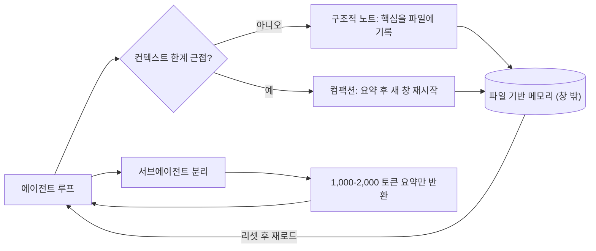

LLM 에이전트를 오래 돌려 본 사람은 같은 벽에 부딪힙니다. 대화가 길어질수록 에이전트가 앞에서 한 약속을 잊고, 초반에 정한 규칙을 무시하기 시작합니다. 흔한 처방은 "컨텍스트 창이 더 크면 해결된다"입니다. 그러나 이것은 틀린 진단입니다. 진짜 문제는 창의 크기가 아니라 그 안의 토큰을 어떻게 관리하느냐, 즉 컨텍스트 엔지니어링입니다. 이 글은 장기 실행 에이전트가 컨텍스트 한계를 넘는 네 가지 검증된 기법을 정리하고, ThakiCloud가 실제 에이전트 운용에 이를 어떻게 녹였는지 보여 줍니다.

## 개요

컨텍스트 엔지니어링은 프롬프트 엔지니어링의 다음 단계입니다. 프롬프트 엔지니어링이 "어떤 말을 적느냐"에 집중했다면, 컨텍스트 엔지니어링은 "추론 시점에 모델의 한정된 주의 예산에 어떤 토큰을 채워 넣느냐"를 다룹니다. 시스템 지시, 도구 정의, MCP, 외부 데이터, 메시지 이력 전체가 대상입니다. 에이전트는 루프를 돌면서 다음 턴에 쓸 수 있는 데이터를 계속 만들어 내고, 이 정보는 주기적으로 정제돼야 합니다.

왜 토큰을 아껴야 할까요. LLM도 사람처럼 일정 지점을 넘으면 집중을 잃습니다. 토큰 수가 늘수록 그 안의 정보를 정확히 회상하는 능력이 떨어지는 현상을 컨텍스트 로트(context rot)라고 부릅니다. 정도의 차이는 있어도 모든 모델에서 나타납니다. 근본 원인은 트랜스포머 구조입니다. 모든 토큰이 다른 모든 토큰에 주의를 보내므로 토큰 n개에 대해 n의 제곱에 해당하는 관계가 생깁니다. 컨텍스트가 길어질수록 주의 예산이 묽어집니다. 그래서 컨텍스트는 무한한 저장소가 아니라 한정된 자원으로 다뤄야 합니다. 핵심은 원하는 결과를 낼 가능성을 가장 높이는 고신호 토큰의 최소 집합을 찾는 것입니다.

## 에이전트 메모리의 문제 구조

장기 실행 작업은 토큰 수가 컨텍스트 창을 넘는 행동의 연속에서 일관성과 목표 지향성을 유지해야 합니다. 대규모 코드베이스 마이그레이션이나 수 시간짜리 리서치처럼 수십 분에서 여러 시간 이어지는 작업이 그렇습니다. 이때 단순히 모든 것을 창에 쌓아 두는 방식은 컨텍스트 로트로 무너집니다. 그래서 정보를 창 밖으로 빼내고, 필요할 때만 다시 끌어오는 구조가 필요합니다. 아래 도식이 그 골격입니다.



이 구조의 목표는 단순합니다. 상세한 작업 컨텍스트는 창 밖으로 격리하고, 메인 에이전트의 창에는 결정에 필요한 고신호 토큰만 남기는 것입니다.

## 네 가지 기법

### 컴팩션

컴팩션은 컨텍스트 창이 한계에 가까워졌을 때 내용을 요약하고 그 요약으로 새 창을 다시 시작하는 기법입니다. 장기 일관성을 끌어올리는 첫 번째 지렛대입니다. 핵심은 충실도 높은 요약입니다. 창의 내용을 고밀도로 압축해 에이전트가 성능 저하를 최소화한 채 이어가게 합니다. 예를 들어 Claude Code는 메시지 이력을 모델에 넘겨 가장 중요한 세부를 요약하고 압축하는 방식으로 이를 구현합니다. 컴팩션이 제대로 되면 에이전트는 사실상 끊김 없이 작업을 계속합니다.

### 구조적 노트테이킹

구조적 노트테이킹은 에이전트가 작업 중 핵심 정보를 창 밖 파일에 적어 두고, 나중에 다시 읽는 방식입니다. 컨텍스트가 리셋된 뒤에도 에이전트는 자기가 남긴 노트를 읽어 수 시간짜리 작업을 이어갑니다. 요약 단계를 넘나드는 이 일관성 덕분에, 모든 정보를 창에 들고 있어야만 가능했을 장기 전략이 비로소 실현됩니다. 사람이 회의 중 메모를 남기고 다음 회의에서 그 메모로 맥락을 복구하는 것과 같은 원리입니다.

### 서브에이전트 아키텍처

서브에이전트는 컨텍스트 한계를 우회하는 또 다른 길입니다. 한 에이전트가 프로젝트 전체의 상태를 떠안는 대신, 전문화된 서브에이전트가 깨끗한 컨텍스트 창으로 좁은 작업을 맡습니다. 메인 에이전트는 고수준 계획으로 조율하고, 서브에이전트는 깊은 기술 작업이나 탐색을 수행합니다. 각 서브에이전트는 수만 토큰을 써 가며 광범위하게 탐색하지만, 메인에는 1,000에서 2,000 토큰 수준으로 정제된 요약만 돌려줍니다. 상세한 탐색 컨텍스트는 서브에이전트 안에 격리되고, 메인 에이전트의 창은 결정에 집중하는 깔끔한 분업이 만들어집니다.

### 파일 기반 메모리 도구

Anthropic은 Sonnet 4.5 출시와 함께 Claude 개발자 플랫폼에 메모리 도구를 퍼블릭 베타로 공개했습니다. 파일 시스템을 통해 컨텍스트 창 밖에 정보를 저장하고 다시 참조하기 쉽게 만든 도구입니다. 이를 통해 에이전트는 시간에 걸쳐 지식 베이스를 쌓고, 세션을 넘어 프로젝트 상태를 유지하며, 모든 것을 창에 들고 있지 않아도 이전 작업을 참조합니다. 앞의 세 기법이 원리라면, 이 도구는 그 원리를 표준 인터페이스로 묶은 구현입니다.

## 단순 접근과의 비교

이 기법들의 가치를 보려면 흔한 대안과 비교하는 것이 좋습니다. 첫 번째 대안은 모든 것을 그냥 큰 컨텍스트 창에 욱여넣는 방식입니다. 단순하지만 컨텍스트 로트로 무너지고, 매 턴 거대한 이력을 다시 읽으니 비용도 선형으로 늘어납니다. 두 번째 대안은 벡터 검색 기반 RAG입니다. 외부 지식을 끌어오는 데는 강하지만, 에이전트 자신이 작업 중 만든 상태(중간 결정, 진행 상황, 자기 노트)를 다루는 데는 어색합니다. RAG는 읽기에 최적화돼 있지 쓰기와 갱신에 최적화돼 있지 않기 때문입니다.

파일 기반 메모리와 구조적 노트는 이 빈틈을 메웁니다. 에이전트가 스스로 적고, 갱신하고, 리셋 후 다시 읽는 상태 저장소를 제공하기 때문입니다. 또 하나의 원칙은 적시 인출(just-in-time)입니다. 모든 정보를 미리 창에 올리는 대신, 가벼운 식별자(파일 경로, 인덱스 항목)만 들고 있다가 정말 필요한 순간에만 본문을 읽어 옵니다. 컴팩션, 노트, 서브에이전트, 적시 인출은 서로 배타적이지 않고 함께 쌓을수록 강해집니다.

## ThakiCloud의 적용

이 네 가지 기법은 추상적인 이론이 아니라 ThakiCloud가 매일 돌리는 에이전트 운용의 골격 그 자체입니다. 우리 내부 에이전트 하니스는 파일 기반 메모리 아키텍처를 3계층으로 둡니다. 매 세션에 로드되는 `MEMORY.md` 인덱스가 한 줄짜리 포인터를 들고 있고, 상세 사실은 `memory/topics/`에, 긴 작업 기록은 `memory/sessions/`에 분리해 둡니다. 인덱스만 컨텍스트에 올리고 상세는 필요할 때만 끌어오는 이 구조가 바로 구조적 노트테이킹과 파일 기반 메모리, 그리고 적시 인출의 결합입니다.

인덱스는 대략 다음과 같은 한 줄 포인터의 모음입니다.

```markdown
- [Model Routing](feedback_model_routing.md) - 서브에이전트 모델 스태킹: 탐색은 저비용, 구현은 중간, 아키텍처는 고비용
- [Hermes Ecosystem](project_hermes_ecosystem.md) - 독립 에이전트 프레임워크 설치 기록
```

각 항목은 한 파일에 하나의 사실을 담고, 본문 안에서 다른 메모리를 링크로 연결합니다. 세션은 이 인덱스만 읽고, 관련 있는 항목의 본문은 그 순간에만 펼쳐 봅니다. 새 사실이 생기면 기존 파일을 갱신하고, 틀린 것으로 드러난 메모리는 삭제합니다. 이 위생 작업이 노트 오염 전파를 막는 장치입니다.

서브에이전트 분업도 그대로 씁니다. 코드베이스 전수 탐색이나 대용량 검색은 메인 컨텍스트에서 직접 하지 않고, 저비용 모델의 서브에이전트에 위임해 결론 요약만 회수합니다. 원본 덤프를 메인에 쏟지 않는다는 규칙은 Anthropic이 말한 "서브에이전트는 1,000에서 2,000 토큰 요약만 반환한다"와 정확히 같은 원칙입니다. 이렇게 하면 메인 세션의 캐시 재읽기 비용이 선형으로 부푸는 것을 막을 수 있습니다.

컴팩션도 운용 규율에 박혀 있습니다. 우리는 컨텍스트 사용률을 40% 이하로 유지하고, 60%를 넘기기 전에 수동 컴팩션을 실행하는 것을 권장합니다. 자동 컴팩션이 돌기 전에 작업자가 의도한 초점으로 먼저 압축하는 편이 충실도가 높기 때문입니다. 멀티테넌트 환경에서 이것은 단순한 품질 문제가 아니라 비용 문제입니다. 거대한 컨텍스트가 매 턴 반복되면 캐시 재읽기 토큰이 비용의 큰 부분을 차지합니다. 컨텍스트를 한정 자원으로 다루는 규율이 곧 단위 추론 비용을 낮추는 길입니다.

플랫폼 관점에서 정리하면, 에이전트 메모리는 ThakiCloud가 여러 고객의 장기 실행 에이전트를 같은 인프라 위에서 안정적으로 운용하기 위한 핵심 역량입니다. 세션을 넘어 상태를 유지하면서도 컨텍스트를 가볍게 유지하는 에이전트는 그 자체로 배포 가능한 제품이 됩니다. Kubernetes 기반 멀티테넌트 위에서 이 메모리 계층을 테넌트별로 격리해 운용할 수 있다는 점이 우리 제안의 차별점입니다.

## 한계 및 반론

기법마다 대가가 있습니다. 컴팩션은 요약 과정에서 정보를 잃습니다. 무엇을 버릴지 잘못 고르면 뒤 작업이 어긋납니다. 충실도 높은 요약은 그 자체로 어려운 문제이며, 요약 프롬프트의 품질에 결과가 좌우됩니다.

구조적 노트와 파일 메모리는 노트가 오염되면 그대로 오염을 전파합니다. 잘못 적힌 사실이 파일에 남으면 이후 세션이 그것을 진실로 받아들입니다. 그래서 메모리에 무엇을 적을지에 대한 게이트가 필요하고, 오래된 사실을 정리하는 위생 작업이 따릅니다.

서브에이전트는 분업의 경계를 잘못 그으면 오히려 오버헤드가 됩니다. 단일 파일 편집이나 단순 조회까지 서브에이전트로 위임하면 컨텍스트를 아끼는 대신 디스패치 비용만 늘어납니다. 위임은 메인 컨텍스트 위생을 위한 도구이지 모든 작업의 기본값이 아닙니다.

마지막으로 모델이 더 똑똑해질수록 이런 처방의 필요가 줄어든다는 점도 정직하게 인정해야 합니다. 이미 더 강한 모델은 덜 규범적인 엔지니어링으로도 더 큰 자율성을 보입니다. 그래도 컨텍스트를 한정 자원으로 다루는 원칙 자체는 능력이 커져도 남을 것입니다. 기법은 바뀌어도 주의 예산을 아낀다는 방향은 유효합니다.

## 출처

- Anthropic, "Effective context engineering for AI agents" (2025-09-29): [https://www.anthropic.com/engineering/effective-context-engineering-for-ai-agents](https://www.anthropic.com/engineering/effective-context-engineering-for-ai-agents)
- Anthropic, 메모리 및 컨텍스트 관리 쿡북: [https://platform.claude.com/cookbook/tool-use-memory-cookbook](https://platform.claude.com/cookbook/tool-use-memory-cookbook)
