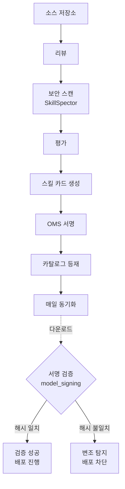

## 개요

에이전트 스킬은 빠르게 표준 부품이 되고 있습니다. SKILL.md 한 장에 도구 사용법과 절차를 적어두면, 코딩 에이전트가 그 지시를 읽고 작업을 수행합니다. 문제는 그 다음입니다. 인터넷에서 받은 스킬이 누가 만든 것인지, 위험한 코드를 품고 있지 않은지, 다운로드한 뒤에 누군가 손대지 않았는지를 확인할 방법이 마땅치 않았습니다. 스킬은 곧 에이전트에게 권한과 행동을 부여하는 명령문이기 때문에, 출처가 불분명한 스킬을 그대로 운영 환경에 꽂는 일은 생각보다 위험합니다.

NVIDIA는 이 공백을 메우려고 검증된 에이전트 스킬(NVIDIA Verified Agent Skills)을 공개했습니다. 핵심은 두 가지입니다. 하나는 스킬마다 암호 서명을 붙여 다운로드 후에도 무결성과 출처를 검증할 수 있게 한 것이고, 다른 하나는 발행 전에 보안 스캔과 스킬 카드 문서화를 거치게 한 것입니다. 게다가 이 스킬들은 agentskills.io 오픈 스펙을 따르기 때문에, 같은 SKILL.md가 Claude Code, Codex, Cursor 같은 서로 다른 하니스에서 동작하도록 설계되어 있습니다.

ThakiCloud는 쿠버네티스 기반 AI/ML SaaS 플랫폼을 운영하면서 내부적으로 수백 개의 스킬과 자율 에이전트 작업을 돌립니다. 그래서 "스킬을 어떻게 신뢰할 것인가"는 우리에게 학술적인 질문이 아니라 매일의 운영 과제입니다. 이 글에서는 NVIDIA가 공개한 저장소를 실제로 받아 서명을 검증하고, 파일 한 줄을 바꿔 변조가 탐지되는지까지 직접 돌려본 결과를 정리합니다. 그리고 이 구조가 멀티테넌트 에이전트 플랫폼을 운영하는 입장에서 무엇을 바꾸는지 살펴봅니다.

## 이 기술은 무엇인가

NVIDIA 에이전트 스킬은 에이전트에게 CUDA-X 라이브러리, AI Blueprint, 플랫폼 도구를 올바르게 쓰는 법을 알려주는 이식 가능한 지시문 묶음입니다. 여기서 "검증됨(verified)"이라는 말에는 구체적인 의미가 있습니다. 카탈로그에 등재되고, 보안 스캔을 거치고, 암호 서명이 붙고, 스킬 카드로 문서화되었다는 뜻입니다. 단순히 "유명한 게시자가 올렸다"는 정황 증거가 아니라, 다운로드한 산출물 자체를 검증할 수 있다는 점이 일반 레지스트리와 다릅니다.

스킬이 검증되는 과정은 여덟 단계로 이루어집니다. 소스 저장소에서 출발해 리뷰, 스캔, 평가, 스킬 카드 생성, 서명, 카탈로그 등재, 동기화 순서로 흐릅니다. 이 파이프라인은 매일 동기화되며, 각 단계가 끝나야 다음 단계로 넘어갑니다.


*NVIDIA 검증 8단계 파이프라인과 다운로드 후 서명 검증 흐름. 도표를 클릭하면 크게 볼 수 있습니다.*

세 가지 축이 이 구조를 떠받칩니다.

첫째는 서명입니다. NVIDIA는 OpenSSF Model Signing(OMS) 포맷을 채택해 스킬마다 detached 서명 파일 `skill.oms.sig`를 함께 배포합니다. 이 서명은 스킬 디렉터리 안의 모든 파일과 하위 디렉터리를 덮습니다. 즉 단일 파일이 아니라 디렉터리 트리 전체에 대한 무결성을 보장합니다. OMS는 Sigstore 스타일 번들을 확장해 디렉터리 단위 검증이 가능하도록 만든 포맷입니다.

둘째는 보안 스캔입니다. 발행 전에 모든 스킬은 SkillSpector를 거칩니다. SkillSpector는 취약한 의존성, 의심스러운 스크립트, 위험한 코드 패턴, 자격 증명 접근, 데이터 유출 경로 같은 전통적인 소프트웨어 위험을 점검합니다. 여기에 더해 에이전트 고유의 위험도 봅니다. 숨겨진 지시문, 프롬프트 인젝션, 트리거 남용, 과도한 권한, 도구 오염, 그리고 스킬이 선언한 목적과 실제로 요구하는 접근 권한과 번들된 동작 사이의 불일치를 잡아냅니다. 파일 수준에서는 무해해 보여도 에이전트를 위험한 행동으로 유도하는 스킬이 있을 수 있기 때문에, 이 의도 계층 점검이 중요합니다. SkillSpector의 점검 범위는 OWASP의 LLM 애플리케이션 위험 가이드와 에이전트 AI 위험 가이드에 기반합니다.

셋째는 스킬 카드입니다. 검증된 스킬마다 기계가 읽을 수 있는 신뢰 기록이 따라옵니다. 무엇을 하는 스킬인지, 누가 만들었는지, 라이선스는 무엇인지, 어떤 의존성이 있는지, 알려진 기술적 한계와 위험과 완화책은 무엇인지를 담습니다. 개발자는 이 카드를 보고 대상 에이전트와 호환되는지, 배포 전에 어떤 의존성을 확인해야 하는지를 빠르게 판단할 수 있습니다.

## 설치 및 검증

말로만 들으면 추상적이니 직접 받아 봤습니다. 검증 도구는 공유 가상환경에 설치했습니다. ThakiCloud의 파이썬 런타임 규칙에 따라 별도 환경을 만들지 않고 프로젝트 정본 `.venv`를 사용했습니다.

```bash
# OMS 검증기 설치 (model-signing 패키지)
VIRTUAL_ENV="$PWD/.venv" uv pip install model-signing
# 설치된 버전: model-signing 1.1.1
# 함께 끌려오는 의존성: sigstore-models 0.0.6, sigstore-rekor-types 0.0.18, tuf 7.0.0
```

다음으로 공개 카탈로그를 받았습니다. NVIDIA 블로그가 예시로 든 cuOpt 스킬 대신, 우리 환경과 직접 관련 있는 Dynamo 스킬을 검증 대상으로 골랐습니다.

```bash
# 공개 카탈로그 얕은 복제 (약 5.5초 소요)
git clone --depth 1 https://github.com/nvidia/skills
cd skills

# 루트 인증서가 저장소에 함께 들어 있습니다
ls nv-agent-root-cert.pem

# 서명된 스킬로 이동
cd plugins/nvidia-skills/skills/dynamo-interconnect-check
ls
# BENCHMARK.md  evals  references  scripts  skill-card.md  SKILL.md  skill.oms.sig
```

검증 명령은 `model_signing verify certificate` 형태입니다. 서명 파일, 인증서 체인, 그리고 서명 대상에서 제외할 경로(서명 파일 자기 자신)를 지정합니다.

```bash
python -m model_signing verify certificate . \
  --signature skill.oms.sig \
  --certificate_chain /path/to/nv-agent-root-cert.pem \
  --ignore-paths skill.oms.sig
```

저장소 전체를 살펴보니 `skills/` 디렉터리에 226개의 스킬이 있었고, `skill.oms.sig` 서명 파일은 237개가 있었습니다. 루트 인증서도 저장소에 함께 포함되어 있어, 별도 채널로 신뢰 앵커를 받아올 필요 없이 곧바로 검증을 시작할 수 있었습니다.

## 실제 실험 결과

먼저 정상 서명 검증입니다. 손대지 않은 `dynamo-interconnect-check` 스킬에 대해 검증을 돌리자 곧바로 성공이 떨어졌습니다.

```text
Verification succeeded
verify_seconds=0.58
```

0.58초 만에 디렉터리 트리 전체의 무결성과 출처가 확인되었습니다. 빠르고 단순합니다.

핵심은 변조 탐지입니다. 서명이 정말 의미가 있으려면, 파일을 조금이라도 바꿨을 때 검증이 깨져야 합니다. 그래서 스킬 디렉터리 안의 `BENCHMARK.md`에 주석 한 줄을 덧붙인 뒤 같은 검증을 다시 돌렸습니다.

```text
Verification failed with error: Signature mismatch:
['Hash mismatch for 'BENCHMARK.md':
  Expected Digest(algorithm='sha256', digest_value=b's\xa5\xf6i!...'),
  Actual   Digest(algorithm='sha256', digest_value=b'Uy\xb9\xf6#b...')']
```

기대했던 대로 검증이 실패했습니다. 그것도 모호하게 "뭔가 잘못됐다"가 아니라, 어느 파일의 어떤 SHA-256 해시가 기대값과 다른지를 정확히 짚어 줍니다. 한 줄을 추가했을 뿐인데 해당 파일의 해시가 통째로 달라졌고, 검증기는 그 불일치를 잡아냈습니다. 다운로드 이후 누군가 스킬에 손을 대면 그 흔적이 그대로 드러난다는 뜻입니다. 이것이 "유명한 게시자가 올렸다"는 정황과 "산출물 자체가 변조되지 않았음을 증명한다"는 보장의 차이입니다.

스킬 카드도 열어 봤습니다. `dynamo-interconnect-check`의 `skill-card.md`에는 다음과 같은 실제 신뢰 메타데이터가 담겨 있었습니다.

- 설명: Dynamo 배포의 NIXL/UCX/NCCL 인터커넥트가 RDMA/NVLink 기반 분산 서빙(disaggregated serving)에 준비되었는지 검증
- 소유자: NVIDIA
- 라이선스: Apache-2.0
- 사용 사례: Dynamo 분산 또는 멀티노드 레시피를 배포하는 개발자가 벤치마크 수치를 신뢰하기 전에 NIXL/UCX/NCCL 전송 패브릭이 동작하는지 확인
- 알려진 위험과 완화책: 제안된 내용이 잘못되거나 오해를 부르는 지침을 스킬에 주입할 수 있으므로, 배포 전에 리뷰하고 스캔할 것
- 출력 형식: 점검별 ok/warn/fail/skipped 판정을 담은 구조화된 JSON

스킬이 무엇을 하고 어떤 권한을 요구하며 어떤 위험이 있는지가 한 문서에 정리되어 있어, 카드만 읽고도 운영 환경에 넣을지 판단할 재료가 갖춰집니다. 재현 과정에서 실패한 부분도 있었습니다. NVIDIA 블로그가 인용한 예시 명령은 옛 플래그(`--ignore-unsigned-files`)를 쓰는데, 실제로 설치된 model-signing 1.1.1에서는 옵션 이름이 하이픈 표기(`--ignore-paths`, `--ignore_unsigned_files`)로 바뀌어 있어 처음에는 오류가 났습니다. 도구가 아직 빠르게 움직이고 있다는 신호입니다.

## ThakiCloud K8s AI/ML SaaS 플랫폼 적용 및 시사점

이 주제가 우리에게 직접 와닿는 이유가 있습니다. ThakiCloud는 자체 스킬 묶음으로 플랫폼을 운영하는데, 그중에는 NVIDIA가 서명해 배포한 바로 그 Dynamo 스킬들과 같은 이름의 스킬이 들어 있습니다. `dynamo-interconnect-check`, `dynamo-router-starter` 같은 스킬은 우리가 분산 추론 스택을 다룰 때 쓰는 도구입니다. 이제 그 스킬들이 암호 서명과 함께 제공된다는 것은, 우리가 외부에서 받아 쓰는 스킬의 출처와 무결성을 운영 파이프라인에서 코드로 확인할 수 있다는 뜻입니다.

멀티테넌트 관점에서는 더 중요합니다. 우리 플랫폼은 여러 고객 환경에서 에이전트를 운용합니다. 고객이나 서드파티가 만든 스킬을 쿠버네티스 에이전트 런타임에 배포하기 전에, 그 스킬이 발행 이후 변조되지 않았는지, 누가 책임지는지를 검증할 수 있어야 합니다. OMS 서명 검증은 이 게이트를 산문 규칙이 아니라 결정론적인 코드 게이트로 만들 수 있게 합니다. 서명이 깨지면 배포를 막고, 통과하면 진행하는 식입니다. 실제로 위 실험에서 본 것처럼 검증은 0.58초 수준이라 CI나 admission 단계에 끼워 넣어도 부담이 거의 없습니다.

우리는 이미 스킬 거버넌스 장치를 운영하고 있습니다. 스킬 반입 게이트, 스킬 보안 스캐너, 신뢰 스킬 거버넌스(TSG) 같은 내부 도구가 그것입니다. NVIDIA의 8단계 파이프라인은 이 흐름과 자연스럽게 겹칩니다. 차이는 NVIDIA가 서명이라는 마지막 한 겹, 즉 "다운로드 이후에도 검증 가능한 무결성"을 표준 포맷으로 박아 넣었다는 점입니다. 우리 입장에서는 자체 스킬에도 같은 OMS 서명을 적용해 내부 카탈로그의 신뢰 사슬을 닫는 방향을 검토할 수 있습니다.

온프레미스와 규제 환경에서는 이 가치가 한층 커집니다. 망 분리되거나 보안 요구가 높은 고객 환경에서는 "이 스킬이 정말 NVIDIA가 발행한 그것이고, 우리 손에 들어오기까지 바뀌지 않았다"를 증명하는 일이 그 자체로 컴플라이언스 요건이 됩니다. self-hosting과 온프렘을 강점으로 내세우는 플랫폼이라면, 스킬 공급망의 검증 가능성은 마케팅 문구가 아니라 실제 도입 게이트를 통과시키는 기술 요건입니다.

## 한계 및 반론

서명을 과대평가하지 않는 편이 정직합니다. 암호 서명이 보장하는 것은 무결성과 출처이지, 스킬이 안전하거나 올바르다는 보장이 아닙니다. 나쁜 스킬도 서명될 수 있습니다. 서명은 "이것이 발행자가 올린 그것이며 변조되지 않았다"만 말할 뿐, "이 스킬이 시키는 대로 해도 안전하다"는 말해 주지 않습니다. 실제로 `dynamo-interconnect-check`의 스킬 카드조차 "배포 전에 리뷰하고 스캔하라"고 적어 두었습니다.

보안 스캔도 한계가 있습니다. SkillSpector는 발행자 쪽에서 도는 점검입니다. 즉 우리는 NVIDIA가 스캔을 제대로 했다고 신뢰하는 것이지, 우리 손으로 그 결과를 재현하는 것이 아닙니다. 평가 계층(트리거 정확도, 작업 완료율, 토큰 효율)은 아직 로드맵 단계로, 공통 하니스에서 측정되어 굴러가기 전까지는 품질에 대한 표준 지표가 비어 있습니다.

도구 성숙도도 짚어야 합니다. NVIDIA 스스로 서명을 "공개적으로 실험 중"이라고 표현합니다. 앞서 본 것처럼 옵션 이름이 바뀌어 블로그 예시가 그대로 동작하지 않았고, 검증기 생태계도 아직 초기입니다. 신뢰 앵커가 단일 루트 인증서에 묶여 있다는 점도 양면적입니다. 검증은 단순해지지만, 그만큼 NVIDIA라는 단일 주체에 신뢰가 집중됩니다. 크로스 하니스 이식성 역시 "설계상 동작하도록"이지 모든 하니스에서 보장되는 것은 아니므로, 도입 시에는 대상 하니스에서 실제로 한 번 돌려 확인하는 절차가 필요합니다.

그럼에도 방향은 분명합니다. 스킬이 에이전트의 행동을 결정하는 부품이 되는 이상, 그 부품의 출처와 무결성을 검증할 수 있어야 한다는 요구는 사라지지 않습니다. NVIDIA의 시도는 그 요구에 대한 구체적이고 재현 가능한 첫 답안입니다.

## 출처

- NVIDIA Technical Blog, [NVIDIA-Verified Agent Skills Provide Capability Governance for AI Agents](https://developer.nvidia.com/blog/nvidia-verified-agent-skills-provide-capability-governance-for-ai-agents/)
- GitHub, [NVIDIA/skills](https://github.com/nvidia/skills)
- GitHub, [NVIDIA/skillspector](https://github.com/nvidia/skillspector)
- NVIDIA Skill Documentation, [Verify Signed Agent Skills](https://docs.nvidia.com/skills/signing-agent-skills)
- OpenSSF, [Model Signing (OMS)](https://github.com/sigstore/model-transparency)
- 본문의 검증 수치(226개 스킬·237개 서명·검증 0.58초·변조 탐지)는 2026-06-25 저장소를 직접 복제해 측정한 값입니다.
