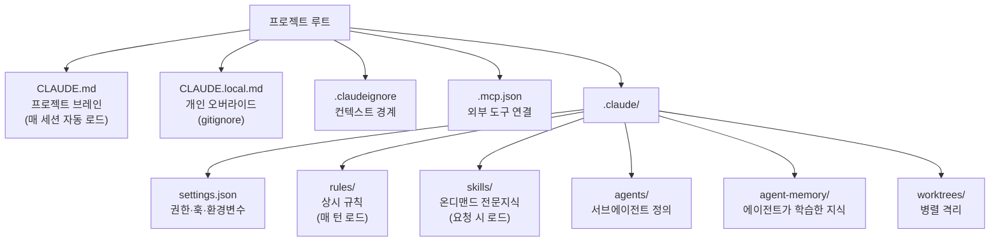
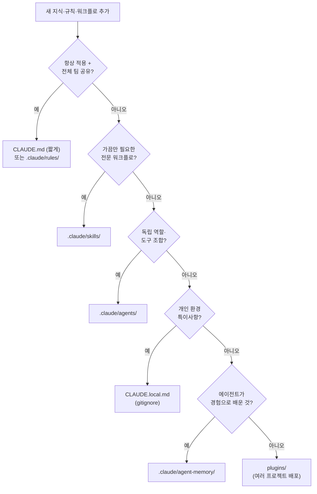

*하나의 프로젝트 브레인에서 규칙, 스킬, 에이전트, 메모리로 갈라지는 Claude Code 프로젝트 구조를 추상화한 이미지.*

## 개요

Claude Code로 일을 하다 보면 `.claude` 폴더가 어느 순간 잡동사니가 됩니다. 규칙을 넣어야 할 내용이 `CLAUDE.md`로 가고, 가끔만 필요한 전문 지식이 항상 로드되는 규칙으로 박히며, 개인 환경 경로가 팀 공유 파일에 섞입니다. 각 구성요소가 "무엇을 담아야 하는가"의 경계가 흐려지면, 매 세션마다 쓰지도 않는 컨텍스트를 토큰으로 지불하게 됩니다.

2026년 6월, Prakash Bhandari가 정리한 "Claude Code Project Structure: The Complete Map"라는 글이 개발자 커뮤니티에서 화제가 됐습니다. `.claude` 폴더가 통제하는 다섯 개의 하위 시스템, 즉 지시(CLAUDE.md와 rules), 워크플로(skills와 commands), 전문가(agents), 권한(settings.json), 기억(memory)을 한 장의 지도로 그린 글입니다. ThakiCloud는 이미 이 구조 위에서 수백 개의 스킬과 수십 개의 에이전트를 운용하고 있어서, 글을 읽는 데 그치지 않고 우리 레포를 그 지도에 직접 비춰봤습니다.

이 글은 그 비교 실측의 기록입니다. 각 구성요소의 역할 경계를 정리하고, 우리 레포(`ai-platform-strategy`)의 실제 구성요소 수를 측정해 지도와 대조한 뒤, 쿠버네티스 기반 AI/ML SaaS 플랫폼을 운영하는 관점에서 이 구조가 왜 단순한 정리정돈 이상의 의미를 갖는지 정리했습니다.

## Claude Code 프로젝트 구조란 무엇인가

핵심 발상은 단순합니다. Claude Code는 두 곳에서 설정을 읽습니다. 프로젝트 디렉터리의 `.claude`와 홈 디렉터리의 `~/.claude`입니다. 프로젝트 파일은 git에 커밋해 팀과 공유하고, 홈 디렉터리 파일은 모든 프로젝트에 적용되는 개인 설정입니다. 이 두 갈래를 기준으로 모든 구성요소가 자리를 잡습니다.

지도의 본질은 "각 구성요소가 언제 컨텍스트에 로드되는가"입니다. 어떤 것은 매 세션 자동으로 들어오고, 어떤 것은 요청이 트리거할 때만 들어옵니다. 이 로드 타이밍의 차이가 곧 토큰 비용의 차이이고, 그래서 무엇을 어디에 두느냐가 단순한 취향이 아니라 운영 비용 문제가 됩니다.

*Claude Code 프로젝트의 구성요소를 로드 타이밍 기준으로 정리한 구조도. 클릭하면 확대됩니다.*

## 구성요소별 역할 경계

지도가 진짜 가치를 갖는 지점은 "무엇을 어디에 담는가"의 경계입니다. 글이 정리한 각 구성요소의 책임을 우리가 실제로 운용하는 방식과 함께 정리하면 다음과 같습니다.

**CLAUDE.md는 프로젝트 브레인입니다.** 매 세션 자동으로 로드되며 팀 전체가 공유하는 표준 브리프입니다. 신규 계약자에게 첫날 건네는 안내서라고 생각하면 정확합니다. 무엇을 만들고 있는가, 어떤 스택 위에서 도는가, 어떤 컨벤션을 따르는가, 워크플로 규칙은 무엇인가. 이 네 가지 질문에만 답하는 것이 원칙입니다. 모든 줄이 임대료를 낸다는 점이 중요합니다. 뚱뚱한 `CLAUDE.md`는 곧 컨텍스트 낭비입니다.

**CLAUDE.local.md는 개인 오버라이드입니다.** 같은 포맷이지만 git에 절대 들어가지 않습니다. 로컬 환경 경로, 디버깅 단축키, 개인 선호, 내 머신의 특이사항이 여기 들어갑니다. 팀원끼리 달라도 되고, 공유 `CLAUDE.md`를 깔끔하게 유지하는 안전판 역할을 합니다.

**.claudeignore는 컨텍스트 경계입니다.** `.gitignore`와 같은 문법으로 Claude의 읽기 범위를 제한합니다. 이것이 없으면 `node_modules`, 생성된 마이그레이션, 벤더 의존성, 대용량 픽스처가 컨텍스트를 소진합니다. 대형 모노레포에서는 사실상 필수입니다.

**rules는 상시 규칙입니다.** 매 턴 자동으로 로드되므로 모든 작업에 적용되는 불변 규칙만 들어가야 합니다. 200줄짜리 아키텍처 문서를 규칙 파일에 넣으면, 그 내용이 무관한 세션에서도 매번 컨텍스트를 먹습니다. 그래서 문서는 스킬이 명시적으로 읽을 때까지 잠들어 있어야 합니다.

**skills는 온디맨드 전문지식입니다.** 요청이 트리거할 때만 로드됩니다. 항상 필요하지는 않은 전문 워크플로, 도메인별 파이프라인, 반복 작업 레시피가 여기 들어갑니다. "때때로만 필요한 것"이라는 기준이 `CLAUDE.md`와 skills를 가르는 선입니다.

**agents는 서브에이전트 정의입니다.** 독립적인 역할, 도구 조합, 모델 티어를 가진 전문가로, 필요할 때 소환됩니다. 탐색에는 저렴한 모델을, 구현에는 균형 잡힌 모델을, 아키텍처 결정에는 가장 비싼 모델을 배정하는 식으로 작업 성격에 따라 모델을 라우팅합니다.

**agent-memory는 에이전트가 학습한 지식입니다.** `CLAUDE.md`와의 핵심 차이가 여기 있습니다. `CLAUDE.md`는 사람이 알려준 것이고, agent-memory는 에이전트가 경험으로 배운 것입니다. 장기 실행 에이전트가 반복 패턴, 버그, 문서화되지 않은 컨벤션을 누적합니다.

## 새 지식은 어디에 두는가

지도를 외워도 막상 새 규칙이나 워크플로를 추가할 때 어디에 둘지 헷갈립니다. 글이 제시한 배치 결정 트리는 이 판단을 단순화합니다.

*새 지식을 어디에 배치할지 결정하는 트리. 항상 필요한지, 가끔 필요한지, 누가 만든 지식인지를 순서대로 묻습니다.*

가장 흔한 실수도 명확합니다. "가끔만 필요한" 지식을 `CLAUDE.md`에 다 때려넣으면 매 세션 토큰을 낭비합니다. `.claudeignore`가 없는 모노레포는 컨텍스트가 소진됩니다. `CLAUDE.local.md`를 git에 커밋하면 개인 정보와 경로가 노출됩니다. MCP 서버를 10개 이상 상시 활성화하면 사용하지 않아도 매번 약 1만 토큰을 낭비합니다.

## ThakiCloud 레포를 이 지도에 비춰보기

지도를 읽었으니 우리 레포를 거기에 비춰봤습니다. `ai-platform-strategy` 레포의 `.claude` 디렉터리를 실제로 측정한 결과는 다음과 같습니다.

| 구성요소 | 실측 | 로드 타이밍 |
|---|---|---|
| CLAUDE.md | 94줄 | 매 세션 자동 |
| .claude/rules | 40개 파일 | 매 턴 자동 |
| .claude/skills | 1655개 디렉터리 | 온디맨드 |
| .claude/agents | 54개 정의 | 소환 시 |
| .claude/hooks | 15개 | 이벤트 발생 시 |
| .claudeignore | 존재 (442바이트) | 상시 경계 |
| .mcp.json | 존재 (166바이트) | 서버 연결 시 |
| .claude/settings.json | 존재 (5KB) | 매 세션 |

*규칙 40개와 CLAUDE.md 94줄은 매 턴 들어오는 상시 비용이고, 스킬 1655개와 에이전트 54개는 필요할 때만 들어오는 온디맨드 자산입니다.*

이 숫자가 말해주는 것이 지도의 핵심을 그대로 증명합니다. 스킬 1655개를 전부 `CLAUDE.md`나 규칙에 넣었다면 매 세션이 즉시 컨텍스트 한계를 넘었을 것입니다. 실제로 이 1655개는 온디맨드로만 로드되고, 어떤 스킬을 띄울지는 별도의 라우터가 매 턴 후보를 좁혀 결정합니다. 반대로 상시 비용 영역인 규칙은 40개로 의도적으로 억제하고 있습니다. 규칙 파일당 2KB 이하를 목표로 하고, 그 이상이 되면 스킬로 강등하는 위생 규칙을 둔 결과입니다.

흥미로운 지점은 우리가 이 글의 출처를 읽고 곧바로 `claude-code-project-anatomy.md`라는 규칙 파일로 증류해 레포에 넣었다는 사실입니다. 즉 "프로젝트 구조 지도"라는 지식 자체가 배치 결정 트리를 한 번 통과해, 매 턴 참조되는 상시 규칙으로 자리 잡았습니다. 지도가 스스로를 지도 위에 배치한 셈입니다.

## ThakiCloud K8s AI/ML SaaS 플랫폼 적용 시사점

이 구조가 단순한 정리정돈을 넘어서는 이유는 컨텍스트 비용이 곧 운영 비용이기 때문입니다. ThakiCloud는 쿠버네티스 위에서 멀티테넌트 에이전트를 운용하고, GPU 자원은 Kueue로 스케줄링하며, 모델은 vLLM으로 서빙합니다. 이 환경에서 에이전트 세션 하나하나가 토큰을 소비하고, 그 토큰은 곧 추론 비용입니다. 상시 로드되는 컨텍스트를 줄이는 것은 정확도뿐 아니라 단가에 직접 영향을 줍니다.

지도가 강조하는 "로드 타이밍에 따른 배치"는 우리가 이미 별도로 정리해 온 두 가지 원칙과 정확히 맞물립니다. 첫째는 능력을 harness가 아니라 스킬에 쌓는다는 원칙으로, 동일한 스킬이 여러 실행 환경을 가로질러 작동하도록 harness는 얇게 유지합니다. 둘째는 매 턴 들어오는 것은 최소로, 가끔 필요한 것은 온디맨드로 미룬다는 토큰 위생 원칙입니다. 글의 배치 결정 트리는 이 두 원칙을 신규 구성요소를 추가하는 순간의 실무 판단으로 바꿔줍니다.

플랫폼 제품 관점에서도 함의가 있습니다. 멀티테넌트 환경에서 테넌트별로 다른 규칙과 스킬을 주입해야 할 때, 무엇을 상시 컨텍스트로 둘지와 무엇을 온디맨드로 둘지의 경계가 명확하면 테넌트 간 컨텍스트 격리와 비용 배분이 깔끔해집니다. agent-memory처럼 에이전트가 학습한 지식을 사람이 검토하는 채널과, 사람이 처음부터 지정하는 `CLAUDE.md` 채널을 분리해 두는 것도, 자가 학습하는 에이전트를 안전하게 운용하려는 우리 방향과 동일합니다.

## 한계 및 반론

이 지도가 만능은 아닙니다. 몇 가지 한계를 정직하게 짚습니다.

첫째, 구성요소 경계는 권고이지 강제가 아닙니다. Claude Code 자체가 "이 내용은 규칙이 아니라 스킬로 가야 한다"고 막아주지 않습니다. 경계를 지키는 것은 결국 팀의 규율이고, 우리처럼 토큰 위생 규칙과 라우터 게이트를 코드로 둬야 실제로 강제됩니다. 지도만 외운다고 자동으로 깔끔해지지 않습니다.

둘째, 스킬 1655개라는 숫자는 자랑이 아니라 양날의 검입니다. 후보가 많을수록 라우터가 잘못된 스킬을 띄울 노이즈 위험이 커집니다. 온디맨드라서 상시 토큰은 안 먹지만, 검색 정확도라는 다른 비용이 발생합니다. "온디맨드면 공짜"라는 단순한 결론은 위험합니다.

셋째, 이 구조는 Claude Code에 특화돼 있습니다. 다른 에이전트 실행 환경으로 옮기면 디렉터리 규약과 로드 메커니즘이 달라집니다. 그래서 지식 자체는 가능한 한 실행 환경 중립적으로 기술하고, 환경별 배선은 얇게 유지하는 편이 장기적으로 안전합니다.

마지막으로, 출처 글의 일부 수치(예: MCP 서버당 약 1천 토큰)는 환경과 버전에 따라 달라질 수 있는 근사치입니다. 절대값으로 받기보다 "상시 로드되는 것은 모두 비용이다"라는 방향성으로 읽는 것이 맞습니다.

## 출처

- [Claude Code Project Structure Explained: The Complete 2026 Guide](https://www.prakashbhandari.com.np/posts/claude-code-project-structure-2026/) (Prakash Bhandari)
- [Explore the .claude directory (Claude Code 공식 문서)](https://code.claude.com/docs/en/claude-directory)
- 실측 대상: ThakiCloud `ai-platform-strategy` 레포 `.claude` 디렉터리 (2026-06-27 측정)
