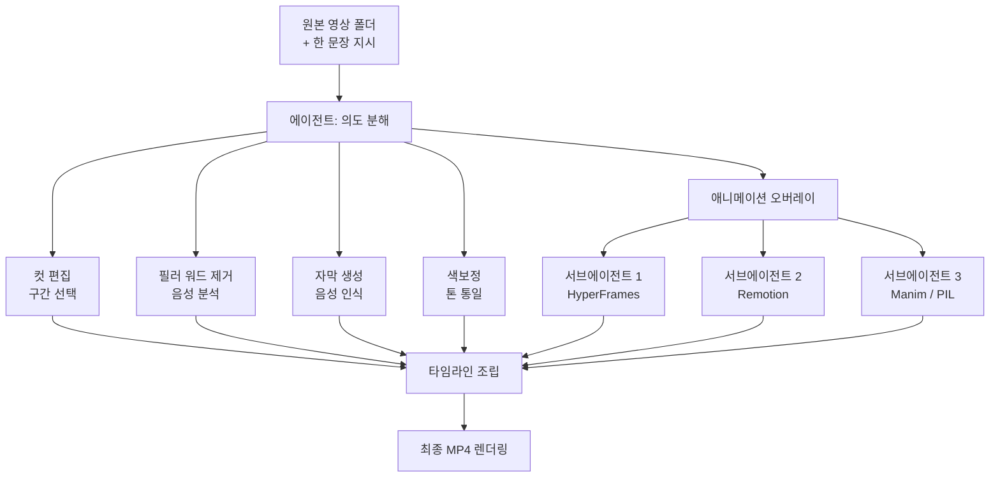

## 개요

영상 편집은 오랫동안 사람이 타임라인 위에서 클립을 자르고 붙이는 수작업의 영역이었습니다. 컷 편집, 군더더기 발화 제거, 자막 삽입, 색보정, 모션 그래픽까지 한 편의 영상을 마무리하려면 전용 도구와 숙련된 손이 필요했습니다. 그런데 2026년 6월, 스페인의 개발자 인플루언서 midudev이 한 문장으로 정리한 트윗이 개발자 사이에서 빠르게 퍼졌습니다. "Claude Code가 이제 영상도 편집합니다. 이 스킬은 100% 무료에 오픈소스입니다."

화제의 주인공은 browser-use 팀이 공개한 `video-use`입니다. 브라우저를 코딩 에이전트로 조작하는 browser-use로 알려진 그 팀이, 이번에는 영상 편집을 코딩 에이전트에게 통째로 위임하는 스킬을 내놓았습니다. 사용법은 단순합니다. 원본 영상 파일을 폴더에 넣고, 어떤 영상을 원하는지 한 문장으로 적으면, 나머지는 에이전트가 알아서 합니다.

ThakiCloud는 에이전트가 격리된 환경에서 스킬을 골라 실행하는 구조를 Agent-Native Cloud로 제품화하고 있습니다. 그래서 video-use를 단순한 편집 도구로 보지 않고, "코딩 에이전트가 비개발 작업을 어떻게 분해하고 병렬화하는가"의 사례로 읽었습니다. 이 글은 video-use가 실제로 무엇을 하는지, 내부 구조가 어떻게 생겼는지, 그리고 그 설계가 우리 플랫폼 관점에서 무엇을 시사하는지 정리한 기록입니다.

## 이 기술은 무엇인가

video-use의 핵심 발상은 "영상 편집을 자연어 명령 하나로 환원한다"입니다. 사용자는 타임라인을 직접 만지지 않습니다. 대신 원하는 결과를 문장으로 묘사하고, 에이전트가 그 문장을 여러 개의 구체적인 편집 동작으로 분해합니다.

공개된 설명에 따르면 video-use는 다음을 자동으로 처리합니다.

- 원본 푸티지에서 불필요한 구간을 잘라내는 컷 편집
- "음", "어" 같은 군더더기 발화(필러 워드)의 자동 제거
- 음성을 인식해 자막을 생성하고 영상에 입히는 작업
- 색보정을 적용해 톤을 통일하는 작업
- 강조가 필요한 지점에 애니메이션 오버레이를 얹는 작업
- 위 모든 결과를 하나의 최종 MP4로 렌더링하는 작업

여기서 흥미로운 부분은 애니메이션 처리 방식입니다. video-use는 애니메이션 오버레이를 만들 때 한 가지 엔진에 묶이지 않고 HyperFrames, Remotion, Manim, PIL 중에서 작업 성격에 맞는 것을 선택합니다. 더 중요한 점은, 각 애니메이션을 만들 때마다 별도의 서브에이전트를 병렬로 띄운다는 것입니다. 애니메이션 하나당 에이전트 하나가 붙는 구조입니다.

이 설계는 일반적인 "거대한 단일 프롬프트로 영상을 만든다"는 접근과 근본적으로 다릅니다. 영상 편집이라는 큰 작업을 컷, 자막, 색보정, 애니메이션 같은 독립적인 하위 작업으로 쪼개고, 서로 의존하지 않는 작업은 병렬로 실행한 뒤, 마지막에 하나의 타임라인으로 합치는 방식입니다. 전체 흐름을 도식으로 그리면 다음과 같습니다.

도식에서 보이듯, 애니메이션 블록은 하나의 노드가 아니라 여러 서브에이전트로 펼쳐집니다. 각 서브에이전트는 자신이 맡은 애니메이션만 책임지고, 서로의 중간 결과를 보지 않습니다. 이렇게 분리하면 애니메이션이 세 개든 다섯 개든 동시에 진행할 수 있고, 전체 소요 시간은 가장 오래 걸리는 애니메이션 하나의 시간으로 수렴합니다.

## 설치 및 통합

video-use는 코딩 에이전트 위에서 도는 스킬 형태로 배포됩니다. browser-use 팀의 공개 저장소(`browser-use/video-use`)에서 받을 수 있고, "Edit videos with coding agents"라는 한 줄 설명 그대로 코딩 에이전트가 호스트가 됩니다. 일반적인 사용 흐름은 저장소를 받아 스킬을 에이전트가 인식할 수 있는 위치에 두고, 작업 폴더에 원본 영상을 넣은 뒤, 에이전트에게 원하는 결과를 한 문장으로 지시하는 순서입니다.

애니메이션 엔진은 각각 성격이 다릅니다. Remotion은 React로 영상을 프로그래밍하는 프레임워크라 컴포넌트 기반 모션 그래픽에 강하고, Manim은 수식과 도형 애니메이션에 특화된 파이썬 라이브러리이며, PIL은 가벼운 이미지 합성에, HyperFrames는 프레임 단위 시퀀스 생성에 쓰입니다. video-use는 이 엔진들을 미리 한 가지로 고정하지 않고 작업마다 적절한 것을 고르므로, 사용 환경에는 이 엔진들이 요구하는 런타임(Node, 파이썬, ffmpeg 등)이 갖춰져 있어야 합니다.

> 재현 범위에 대한 정직한 기록: 이 글을 쓰는 환경은 외부 네트워크와 의존성 설치가 제한된 격리 환경이라, 원본 영상 자산과 무거운 렌더링 의존성(Remotion, Manim, ffmpeg)을 갖춘 전체 파이프라인을 직접 돌려 렌더링 시간이나 품질 수치를 측정하지는 못했습니다. 그래서 이 글의 분석은 공개된 스킬 설명과 아키텍처 구조에 근거하며, 측정하지 않은 벤치마크 수치는 싣지 않았습니다.

## 실제 동작이 의미하는 것

비록 전체 렌더링을 직접 돌리지는 못했지만, 공개된 동작 명세만으로도 이 스킬이 무엇을 노리는지는 분명합니다. 가장 큰 전환은 "편집의 단위가 클립이 아니라 의도가 된다"는 점입니다.

기존 편집 도구에서 사용자는 "3초 지점부터 7초까지 잘라내고, 거기에 페이드를 넣고, 자막을 단다"처럼 동작 단위로 사고합니다. video-use에서는 "발표 영상을 깔끔하게 정리해서 자막과 강조 애니메이션을 넣은 1분짜리 클립으로 만들어줘"처럼 결과 단위로 사고합니다. 그 사이의 변환, 즉 의도를 수십 개의 동작으로 풀어내는 일을 에이전트가 맡습니다.

두 번째 전환은 병렬화입니다. 영상 편집은 본질적으로 직렬 작업처럼 보이지만, 실제로는 독립적인 하위 작업이 많습니다. 자막 생성은 색보정과 무관하고, 두 번째 장면의 애니메이션은 첫 번째 장면의 애니메이션과 무관합니다. video-use가 애니메이션마다 서브에이전트를 띄우는 것은 이 독립성을 적극적으로 활용해 벽시계 시간을 줄이려는 설계입니다. ThakiCloud가 멀티에이전트 오케스트레이션에서 늘 강조하는 "서로 의존하지 않는 작업은 병렬로"라는 원칙과 정확히 같은 발상입니다.

## ThakiCloud 제품 적용 시사점

video-use는 영상이라는 비개발 도메인을 다루지만, 그 설계 원리는 ThakiCloud가 Agent-Native Cloud로 제품화하는 **Paxis**의 핵심과 맞닿아 있습니다. Paxis는 ai-platform 위에서 도는 에이전트 제어 평면으로, 스킬(Skills), 도구(Tools), 정책(Policies), 감사 로그(Audit Logs)를 일급 리소스로 다룹니다. video-use의 구조를 Paxis의 레이어에 대응시키면 다음 세 가지가 보입니다.

첫째, **Skill Harness 관점**입니다. video-use는 그 자체로 하나의 스킬이고, 내부에서 HyperFrames, Remotion, Manim, PIL이라는 여러 하위 도구를 상황에 맞게 선택합니다. Paxis의 Skill Harness는 960개가 넘는 스킬을 BM25로 선택해 적합한 것만 컨텍스트에 올리는 구조인데, video-use가 애니메이션 작업마다 엔진을 고르는 방식은 이 "필요한 것만 고른다"는 원리의 작은 사례입니다. 자유 설계를 검증된 골격에 채우는 방식이 평균 품질을 올린다는 우리의 경험과도 일치합니다.

둘째, **Sandbox 격리 실행 관점**입니다. 영상 렌더링은 ffmpeg, Node, 파이썬 같은 무거운 의존성을 끌어오고, 잘못하면 호스트 환경을 오염시킵니다. Paxis는 모든 스킬 실행을 격리된 샌드박스에서 처리해 메인 작업 트리를 보호합니다. video-use처럼 외부 런타임을 여럿 부르는 스킬일수록 이 격리는 선택이 아니라 필수입니다. 병렬 서브에이전트가 각자 다른 엔진을 돌릴 때, 서로의 임시 파일과 프로세스가 충돌하지 않도록 막아주는 경계가 있어야 안정적으로 동작합니다.

셋째, **DAG 멀티에이전트 오케스트레이션 관점**입니다. video-use의 흐름은 사실상 방향성 비순환 그래프(DAG)입니다. 컷, 자막, 색보정, 애니메이션 노드가 병렬로 갈라졌다가 타임라인 조립 노드로 다시 모입니다. Paxis는 이런 fan-out과 fan-in을 일급으로 표현하고, 각 노드의 실행을 정책 게이트와 감사 로그로 통과시킵니다. 누가 어떤 도구를 언제 호출했는지가 전부 기록되므로, 결과물이 어떻게 만들어졌는지 추적할 수 있습니다.

정리하면, video-use는 "코딩 에이전트가 비개발 작업을 분해하고 병렬화하는" 한 편의 데모이고, Paxis는 그런 패턴을 안전하고 추적 가능하게 운영하는 제어 평면입니다. 영상 편집이든 데이터 파이프라인이든, 작업을 스킬로 캡슐화하고 격리된 샌드박스에서 병렬 실행하며 모든 행동을 감사 로그로 남기는 골격은 동일합니다.

## 한계 및 반론

이 접근이 만능은 아닙니다. 먼저, 의도를 동작으로 분해하는 단계에서 에이전트의 판단이 들어가므로, 사용자가 머릿속에 그린 결과와 산출물이 어긋날 수 있습니다. "깔끔하게"라는 지시는 사람마다 기준이 다르고, 에이전트가 잘라낸 구간이 사실은 핵심이었을 수도 있습니다. 결국 한 문장으로 끝나는 것이 아니라 여러 차례 수정 지시를 주고받게 될 가능성이 큽니다.

둘째, 비용과 시간입니다. 애니메이션마다 서브에이전트를 띄우는 구조는 병렬화로 벽시계 시간을 줄이는 대신, 동시에 도는 에이전트와 렌더링 프로세스만큼 연산 자원을 더 씁니다. 짧은 클립 하나를 다듬는 데에는 과한 설계일 수 있습니다. 전통적인 편집 도구로 5분이면 끝낼 작업을 에이전트 오케스트레이션으로 돌리는 것이 항상 이득은 아닙니다.

셋째, 결정론의 부재입니다. 같은 원본과 같은 지시를 줘도 매번 똑같은 결과가 나온다는 보장이 없습니다. 전문적인 영상 제작에서는 재현성이 중요한데, 에이전트 기반 편집은 이 부분에서 아직 검증이 필요합니다. ThakiCloud가 배치 산출물에서 "포맷과 집계는 결정론적 코드가 소유하고 모델은 내용만 생성한다"는 원칙을 강조하는 이유도 여기에 있습니다. 창의적 편집은 모델에게 맡기더라도, 자막 타이밍이나 출력 규격 같은 결정론적 부분은 코드가 보장하는 하이브리드가 현실적인 타협점일 것입니다.

그럼에도 video-use가 보여준 방향은 분명합니다. 비개발 도메인의 복잡한 작업도 스킬로 캡슐화하고, 독립적인 하위 작업을 병렬 에이전트로 분해하며, 자연어 의도를 진입점으로 삼는 패턴은 앞으로 더 많은 영역으로 번질 것입니다. ThakiCloud가 Paxis로 만들고 있는 것이 바로 그 패턴을 안전하게 운영하는 토대입니다.

## 출처

- [browser-use/video-use (GitHub)](https://github.com/browser-use/video-use): "Edit videos with coding agents"
- [@midudev 트윗](https://x.com/midudev): video-use 스킬 소개 (2026-06-27)
- [video-use: Edit Videos with Claude Code (AIBit)](https://aibit.im/en/article/video-use-edit-videos-with-claude-code)
