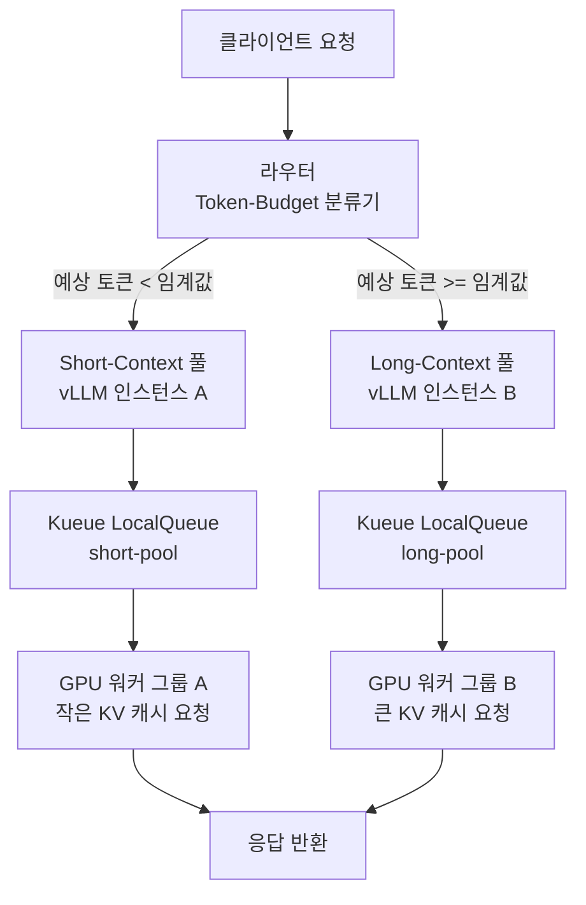

## 문제: HoL 블로킹이 GPU 시간을 조용히 낭비합니다

LLM 추론 서비스를 운영하다 보면 단일 대기열 구조에서 반복되는 현상을 하나 목격하게 됩니다. 챗봇 한 줄 응답처럼 토큰 수십 개로 끝나는 요청이, 긴 문서 요약이나 코드 생성 요청 뒤에 줄을 서서 수백 밀리초를 낭비하는 상황입니다. 이를 Head-of-Line(HoL) 블로킹이라고 부릅니다.

vLLM은 continuous batching으로 배치 효율을 크게 높였지만, 단일 풀 구조에서 긴 요청이 KV 캐시를 장기간 점유하면 짧은 요청의 선점(preemption)이 발생합니다. 선점된 요청은 재계산 비용을 지불하고, 전체 GPU 시간 효율이 떨어집니다.

arXiv 2604.08075가 제안한 **Dual-Pool Token-Budget Routing**은 이 문제를 근본적으로 해결합니다. 요청이 들어오는 시점에 예상 응답 길이를 기준으로 short-context 풀과 long-context 풀로 분리해 라우팅함으로써, 두 유형이 서로 간섭하지 않게 합니다.

논문이 측정한 결과는 다음과 같습니다.

| 지표 | 효과 |
|---|---|
| GPU 시간 절감 | **31~42%** |
| Preemption rate | **5.4배 감소** |
| P99 TTFT 개선 | **6%** |

## 핵심 원리: 토큰 버짓 기반 라우팅

Dual-Pool의 핵심은 단순합니다. 요청마다 **예상 최대 토큰 수**를 추정하고, 임계값을 기준으로 두 풀 중 하나에 할당합니다.

```
요청의 예상 토큰 합 = 입력 토큰 + 예상 출력 토큰
```

예상 출력 토큰을 모르는 경우(대부분의 실제 상황)에는 다음 두 가지 근사를 씁니다.

1. **요청 파라미터**: `max_tokens` 값을 상한으로 사용합니다.
2. **히스토리 기반 분류**: 같은 API 경로 또는 시스템 프롬프트 해시로 이전 요청 길이 분포를 추적해 P75 또는 P90 값을 기준으로 분류합니다.

임계값 설정은 워크로드 특성에 따라 다르지만, 논문에서 보고한 실험에서는 출력 512토큰을 기준으로 short/long을 나눴습니다.

## 아키텍처: 두 풀의 구조



Short-context 풀은 KV 캐시를 빠르게 회전시켜 높은 throughput을 유지합니다. Long-context 풀은 긴 생성을 방해 없이 완료할 수 있는 충분한 KV 캐시 메모리를 확보합니다. 두 풀은 서로 선점 간섭을 일으키지 않습니다.

## Kueue LocalQueue 연동 구현

ThakiCloud의 ai-platform은 Kubernetes 위에서 Kueue를 통해 GPU 워크로드를 스케줄링합니다. Dual-Pool Routing을 Kueue LocalQueue와 연동하면 클러스터 수준에서 두 풀의 자원 배분을 선언적으로 관리할 수 있습니다.

### 1단계: ClusterQueue와 ResourceFlavor 정의

```yaml
apiVersion: kueue.x-k8s.io/v1beta1
kind: ClusterQueue
metadata:
  name: llm-inference-cq
spec:
  namespaceSelector: {}
  resourceGroups:
    - coveredResources: ["nvidia.com/gpu"]
      flavors:
        - name: gpu-a100
          resources:
            - name: nvidia.com/gpu
              nominalQuota: 8
---
apiVersion: kueue.x-k8s.io/v1beta1
kind: ResourceFlavor
metadata:
  name: gpu-a100
spec:
  nodeLabels:
    gpu.nvidia.com/model: A100
```

### 2단계: 풀별 LocalQueue 분리

```yaml
apiVersion: kueue.x-k8s.io/v1beta1
kind: LocalQueue
metadata:
  name: short-pool-queue
  namespace: llm-serving
spec:
  clusterQueue: llm-inference-cq
---
apiVersion: kueue.x-k8s.io/v1beta1
kind: LocalQueue
metadata:
  name: long-pool-queue
  namespace: llm-serving
spec:
  clusterQueue: llm-inference-cq
```

### 3단계: vLLM Deployment에 큐 어노테이션 추가

```yaml
apiVersion: apps/v1
kind: Deployment
metadata:
  name: vllm-short-pool
  namespace: llm-serving
  annotations:
    kueue.x-k8s.io/queue-name: short-pool-queue
spec:
  replicas: 2
  template:
    spec:
      containers:
        - name: vllm
          image: vllm/vllm-openai:latest
          args:
            - "--model"
            - "meta-llama/Llama-3.1-8B-Instruct"
            - "--max-model-len"
            - "4096"       # short 풀: 작은 컨텍스트 한도
            - "--gpu-memory-utilization"
            - "0.7"        # KV 캐시를 짧게 쓰고 빠르게 회전
          resources:
            limits:
              nvidia.com/gpu: "1"
---
apiVersion: apps/v1
kind: Deployment
metadata:
  name: vllm-long-pool
  namespace: llm-serving
  annotations:
    kueue.x-k8s.io/queue-name: long-pool-queue
spec:
  replicas: 2
  template:
    spec:
      containers:
        - name: vllm
          image: vllm/vllm-openai:latest
          args:
            - "--model"
            - "meta-llama/Llama-3.1-8B-Instruct"
            - "--max-model-len"
            - "32768"      # long 풀: 넉넉한 컨텍스트 허용
            - "--gpu-memory-utilization"
            - "0.90"       # KV 캐시를 크게 확보
          resources:
            limits:
              nvidia.com/gpu: "1"
```

### 4단계: 라우터 구현 (Python 예시)

```python
from fastapi import FastAPI, Request
import httpx

app = FastAPI()

SHORT_POOL_URL = "http://vllm-short-pool-svc:8000/v1/chat/completions"
LONG_POOL_URL  = "http://vllm-long-pool-svc:8000/v1/chat/completions"
TOKEN_THRESHOLD = 512  # 이 값은 워크로드 히스토리로 튜닝

def estimate_output_tokens(payload: dict) -> int:
    """max_tokens를 상한으로 사용. 없으면 256 기본값."""
    return payload.get("max_tokens") or 256

def route_request(payload: dict) -> str:
    """예상 토큰 수에 따라 라우팅 대상 URL 반환."""
    estimated = estimate_output_tokens(payload)
    if estimated < TOKEN_THRESHOLD:
        return SHORT_POOL_URL
    return LONG_POOL_URL

@app.post("/v1/chat/completions")
async def proxy(request: Request):
    payload = await request.json()
    target_url = route_request(payload)
    async with httpx.AsyncClient(timeout=120.0) as client:
        resp = await client.post(target_url, json=payload)
        return resp.json()
```

이 라우터는 Kubernetes Service로 노출하고, 기존 추론 엔드포인트 앞에 배치합니다.

## 운영 고려사항

### 임계값 튜닝

512토큰 임계값은 워크로드에 따라 달라집니다. 실제 운영에서는 다음 지표를 7일 이상 수집한 뒤 조정하는 것을 권장합니다.

- 요청별 실제 출력 토큰 분포 (P50, P90, P99)
- 풀별 preemption rate (`vllm:num_preemptions_total` Prometheus 메트릭)
- 풀별 `vllm:num_requests_waiting` 대기 큐 깊이

Short 풀 대기 큐가 지속적으로 깊어진다면 임계값을 낮추거나 short 풀 replica를 늘려야 합니다. Long 풀 GPU 사용률이 낮다면 임계값을 올려 long으로 가는 요청을 줄입니다.

### KEDA 오토스케일링 연동

vLLM Prometheus 메트릭 기반 KEDA ScaledObject를 추가하면 풀별로 독립적인 오토스케일링이 가능합니다.

```yaml
apiVersion: keda.sh/v1alpha1
kind: ScaledObject
metadata:
  name: vllm-short-pool-scaler
  namespace: llm-serving
spec:
  scaleTargetRef:
    name: vllm-short-pool
  minReplicaCount: 1
  maxReplicaCount: 8
  triggers:
    - type: prometheus
      metadata:
        serverAddress: http://prometheus:9090
        metricName: vllm_requests_waiting_short
        query: vllm:num_requests_waiting{deployment="vllm-short-pool"}
        threshold: "5"
```

KEDA 메트릭 기반 스케일링은 단순 HTTP RPS 기반보다 추론 부하에 더 직접 대응합니다. 위 임계값 `5`는 현재 대기 요청이 5개를 초과하면 scale-up을 시작하라는 의미입니다.

### 모델 공유 vs 인스턴스 분리

두 풀이 반드시 서로 다른 vLLM 인스턴스를 써야 하는 것은 아닙니다. 동일 모델을 다른 `--max-model-len` 설정으로 띄우는 것이 기본 구성이지만, 메모리 예산이 넉넉하다면 단일 vLLM 인스턴스에 두 개의 외부 포트를 열고 내부적으로 priority class를 달리 적용하는 방법도 있습니다.

다만 preemption 간섭을 완전히 차단하려면 **인스턴스 분리가 더 명확합니다**. KV 캐시 메모리는 vLLM 프로세스 내에서 공유되기 때문입니다.

## ThakiCloud ai-platform 적용 관점

ThakiCloud의 ai-platform은 멀티테넌트 환경에서 여러 고객의 추론 워크로드를 단일 GPU 클러스터에서 서빙합니다. Dual-Pool Routing은 이 환경에서 두 가지 이점을 더합니다.

첫째, 테넌트 간 간섭을 줄입니다. 짧은 챗봇 응답이 주인 고객사 A의 요청이, 긴 문서 분석이 주인 고객사 B의 배치 요청에 밀리는 상황은 SLO 위반으로 이어집니다. 풀 분리는 이 간섭을 구조적으로 차단합니다.

둘째, GPU 예산 효율이 높아집니다. 논문이 측정한 31~42% GPU 시간 절감은 같은 GPU 예산으로 더 많은 요청을 소화하거나, 동일 처리량을 더 적은 GPU로 달성한다는 의미입니다. 온프렘 자원이 고정된 환경에서 이 절감률은 곧 서빙 비용 절감으로 직결됩니다.

Kueue LocalQueue를 이미 사용 중인 ThakiCloud 클러스터에서는 Short/Long 큐 선언과 라우터 배치만으로 이 구조를 추가할 수 있습니다. 기존 vLLM Deployment 스펙과의 호환성도 높아 적용 범위가 넓습니다.

## 정리

Dual-Pool Token-Budget Routing이 해결하는 문제는 단순합니다. 짧은 요청과 긴 요청이 같은 대기열에 섞이면 짧은 요청이 손해를 봅니다. 이를 대기열 단계에서 분리하면 각 유형의 요청이 자기 속도로 처리됩니다.

arXiv 2604.08075가 측정한 GPU 시간 31~42% 절감, preemption rate 5.4배 감소, P99 TTFT 6% 개선은 구현 복잡도에 비해 효과가 큰 기법입니다. Kubernetes 환경에서는 Kueue LocalQueue 두 개, vLLM Deployment 두 개, 경량 라우터 하나로 이 구조를 구현할 수 있습니다.
