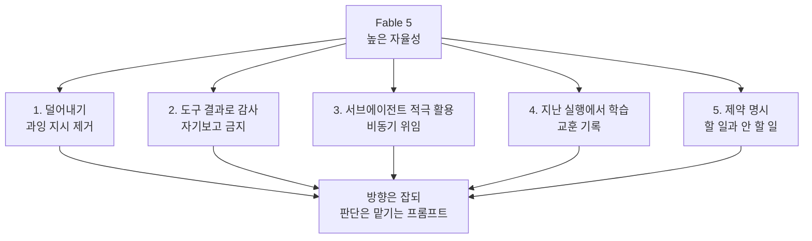

## 개요

새 모델이 나올 때마다 우리는 옛 모델에 맞춰 쌓아 둔 프롬프트를 그대로 물려줍니다. 그런데 앤트로픽이 공개한 Claude Fable 5 프롬프트 가이드는 정확히 그 반대를 권합니다. 이전 모델을 잘 다루게 만들던 지시가 Fable 5에서는 오히려 품질을 떨어뜨린다는 것입니다. 가이드의 표현을 그대로 옮기면, 이전 모델용으로 개발된 스킬은 "Claude Fable 5에게는 종종 너무 지시적이어서 출력 품질을 떨어뜨릴 수 있습니다".

이 문장 하나가 전체 가이드의 기조를 요약합니다. 더 똑똑해진 모델에게는 더 많은 규칙이 아니라 더 적은 규칙이 필요합니다. ThakiCloud처럼 에이전트를 실제로 운영하는 조직에게 이 전환은 남의 이야기가 아닙니다. 우리가 수백 개의 스킬과 룰로 에이전트를 통제하는 방식이 새 모델 앞에서는 짐이 될 수도 있다는 경고이기 때문입니다. 가이드가 제시하는 다섯 가지 원칙을 하나씩 살펴보고, 그중 상당수가 우리가 이미 실천해 온 규율과 겹친다는 점을 확인하겠습니다.

## 무엇이 달라졌나

Fable 5는 이전 세대보다 자율성이 높습니다. 스스로 서브에이전트를 더 적극적으로 띄우고, 긴 작업을 스스로 밀고 나가며, 요청하지 않은 행동까지 하는 경우가 생깁니다. 능력이 올라간 만큼 통제의 방식도 바뀌어야 합니다. 세세하게 손을 잡아 끄는 지시는 유능한 신입에게 매 단계를 지시하는 것과 같아서, 오히려 판단을 방해합니다. 가이드가 말하는 다섯 원칙은 이 자율성을 억누르는 대신 올바른 방향으로 흐르게 만드는 장치에 가깝습니다.



## 원칙 1: 덜어내라

가이드가 첫 번째로 강조하는 것은 삭제입니다. 이전 모델을 위해 촘촘하게 써 둔 지시가 Fable 5에서는 성능을 갉아먹습니다. 규칙이 많을수록 좋다는 직관은 이 모델에서 뒤집힙니다. 새 모델로 갈아탈 때 프롬프트를 더 쌓는 대신, 어떤 지시가 이제 불필요한지 걷어내는 작업이 먼저입니다.

이 원칙은 우리 저장소가 오래 지켜 온 "얇은 하네스, 두꺼운 스킬" 발상과 정확히 맞닿습니다. 능력은 하네스가 아니라 스킬과 데이터에 쌓되, 매 턴 지불하는 지시는 최소로 유지한다는 규율입니다. 새 모델을 맞이할 때 우리가 가장 먼저 할 일은 룰과 스킬을 늘리는 것이 아니라, "이 문장이 없으면 에이전트가 틀리는가"라는 질문을 통과하지 못하는 지시를 솎아내는 것입니다.

## 원칙 2: 진행을 도구 결과로 감사하라

긴 자율 실행에서 Fable 5는 실제 도구 결과에 비추어 진행 상황을 스스로 감사하도록 지시받아야 합니다. 가이드가 제시하는 예시 지시는 이렇습니다.

```text
Before reporting progress, audit each claim against a tool result
from this session. Only report work you can point to evidence for.
```

앤트로픽의 테스트에서 이 한 문장은 날조된 진행 보고를 거의 없앴다고 합니다. 모델이 "완료한 것 같습니다"라고 말하는 대신, 이 세션의 도구 결과 중 근거를 가리킬 수 있는 작업만 보고하게 만드는 것입니다.

이것은 우리가 여러 룰에서 반복해 온 원칙, 즉 모델의 자기보고는 루프의 종료 조건이 될 수 없다는 규율과 같습니다. 가장 믿을 수 있는 피드백은 테스트와 타입체커와 컴파일러처럼 통과와 실패를 객관적으로 돌려주는 결정론적 검증입니다. 우리 저장소의 검증 게이트가 exit 코드로 판정하고, fan-out 결과를 표결로 닫는 이유가 여기에 있습니다. 앤트로픽이 공식 가이드에 이 원칙을 명문화했다는 사실은, 자기보고를 믿지 않는 규율이 특정 팀의 취향이 아니라 에이전트 운영의 기본값이 되어 가고 있음을 보여 줍니다.

## 원칙 3: 서브에이전트를 적극 써라

Fable 5는 이전 모델보다 병렬 서브에이전트를 더 선뜻 띄웁니다. 가이드는 이 성향을 억누르지 말고 활용하되, 언제 위임이 적절한지 명시적으로 안내하고, 오케스트레이터와 서브에이전트 사이의 통신은 비동기를 선호하라고 권합니다. 위임 자체가 목적이 아니라, 독립적인 일을 병렬로 흘려보내 전체 처리량을 높이는 것이 목적입니다.

우리 저장소의 모델 라우팅 규율이 바로 이 지점을 다룹니다. 탐색과 파일 읽기는 저비용 모델에, 구현은 중간 티어에, 복잡한 추론과 검증만 고비용 모델에 배정하고, 서브에이전트를 띄울 때는 모델 파라미터를 반드시 지정합니다. Fable 5가 서브에이전트를 더 잘 다룬다는 것은, 이런 라우팅이 앞으로 더 큰 효과를 낸다는 뜻이기도 합니다. 지휘자는 가볍게 두고 무거운 일만 전문 서브에이전트로 격리하는 패턴이 모델의 성향과 맞물립니다.

## 원칙 4: 지난 실행에서 배워라

Fable 5는 이전 실행에서 얻은 교훈을 기록하고 참조할 수 있을 때 특히 잘 작동합니다. 가이드는 마크다운 파일 하나만큼 단순한 저장 공간이라도 마련해 주라고 권하며, 예시로 이렇게 적습니다.

```text
Store one lesson per file with a one-line summary at the top.
Record corrections and confirmed approaches alike, including why
they mattered.
```

교훈 하나를 파일 하나에 담고, 맨 위에 한 줄 요약을 붙이고, 교정과 확인된 접근을 이유와 함께 기록하라는 것입니다. 이 지침은 이 글을 쓰는 시스템의 메모리 구조와 놀랍도록 닮았습니다. ThakiCloud의 에이전트 메모리는 정확히 파일 하나에 사실 하나를 담고, 프론트매터에 한 줄 요약을 두며, 교정과 확정된 패턴을 이유와 함께 남기는 방식으로 운영됩니다. 세션이 시작될 때 직전까지의 학습을 상주 브리프로 읽어들이는 핫 메모리 루프도 같은 발상 위에 있습니다. 앤트로픽의 권고가 우리 메모리 규율과 이렇게 겹친다는 것은, 에이전트를 백지에서 매번 다시 시작하게 두지 않는 설계가 보편적인 정답에 가까워지고 있다는 신호입니다.

## 원칙 5: 제약을 명시하라

높은 자율성의 대가로 Fable 5는 요청하지 않은 행동을 이따금 합니다. 가이드는 이를 막기 위해 모델이 해야 할 일과 하지 말아야 할 일에 대한 명시적 제약을 정의하라고 권합니다. 방향을 열어 주되, 넘지 말아야 할 선은 분명히 그으라는 것입니다.

우리 운영에서 이 선은 승인 게이트와 되돌릴 수 없는 변경에 대한 안전망으로 구현됩니다. 스키마 변경이나 배포처럼 비가역적인 작업은 계획을 먼저 세우고 승인을 받게 하고, 매매 집행 같은 고위험 행동에는 하드 가드를 겁니다. 모델이 유능해질수록 "무엇을 할 수 있는가"보다 "무엇을 해서는 안 되는가"를 명확히 하는 일이 중요해집니다. Fable 5의 자율성은 제약이 잘 그어져 있을 때 자산이 되고, 그렇지 않을 때 위험이 됩니다.

## ThakiCloud 제품 적용 시사점

이 다섯 원칙은 ThakiCloud가 만드는 Paxis의 설계 철학과 그대로 포개집니다. Paxis는 ai-platform 위에서 도는 Agent-Native Cloud 제어 평면으로, 스킬과 도구와 정책과 감사 로그를 일급 리소스로 다룹니다. 가이드가 말하는 "덜어내기"는 우리가 스킬 하네스를 얇게 유지하고 능력을 스킬에 쌓는 방식이고, "도구 결과 감사"는 우리가 결정론적 검증 게이트로 fan-out을 닫는 방식이며, "서브에이전트 적극 활용"은 DAG 멀티에이전트와 모델 라우팅으로 구현됩니다. "지난 실행에서 배우기"는 우리 메모리 엔진과 핫 메모리 루프이고, "제약 명시"는 정책 게이트와 감사 로그입니다.

바꿔 말하면, 앤트로픽의 프롬프트 가이드는 우리가 이미 운영 중인 규율에 공식적인 근거를 얹어 줍니다. 새 모델이 강해질수록 이 규율의 값어치는 커집니다. 유능한 모델을 백지에서 시작하게 두거나, 자기보고를 그대로 믿거나, 과잉 지시로 판단을 막는 대신, 얇은 하네스와 검증 게이트와 지속 메모리로 감싸는 편이 낫습니다. Paxis가 파는 것이 바로 그 감싸는 방식입니다.

## 한계 및 반론

이 가이드를 도그마로 받아들이면 곤란합니다. "덜어내라"는 원칙은 매력적이지만, 무엇을 덜어낼지는 여전히 판단의 영역입니다. 잘못 걷어낸 지시 하나가 회귀를 부를 수 있고, 그 회귀를 감지하려면 결국 앞의 원칙, 즉 결정론적 검증과 지난 실행의 기록이 있어야 합니다. 원칙들은 서로를 떠받치기 때문에 하나만 골라 적용하면 효과가 반감됩니다.

또한 이 가이드는 Fable 5라는 특정 모델을 겨냥합니다. 여기 적힌 조언이 모든 모델, 특히 자율성이 낮은 소형 모델에 그대로 이전되지는 않습니다. 소형 모델일수록 오히려 더 촘촘한 지시와 고정된 골격이 품질을 지킵니다. "지시를 줄여라"를 모든 티어에 일괄 적용하면 저비용 워커의 출력이 흔들립니다. 모델 티어에 따라 프롬프트 규율을 다르게 가져가는 판단이 필요합니다.

마지막으로, 자율성이 높은 모델일수록 제약을 거는 일이 어려워진다는 역설이 있습니다. 서브에이전트를 스스로 띄우고 요청하지 않은 행동을 하는 모델에게 "하지 말라"를 강제하려면, 프롬프트만으로는 부족하고 결정론적 훅과 승인 게이트가 뒷받침되어야 합니다. 가이드는 프롬프트의 언어를 다루지만, 진짜 안전망은 코드가 소유해야 합니다.


## 관련 슬라이드

본문 내용을 NotebookLM(`architectural_portfolio` 스타일)으로 요약한 슬라이드입니다.


## 출처

- Prompting Claude Fable 5, 앤트로픽 공식 문서 (platform.claude.com)
- Redeploying Claude Fable 5, 앤트로픽 뉴스
