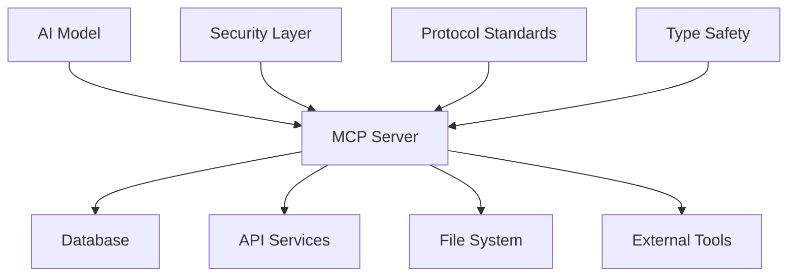
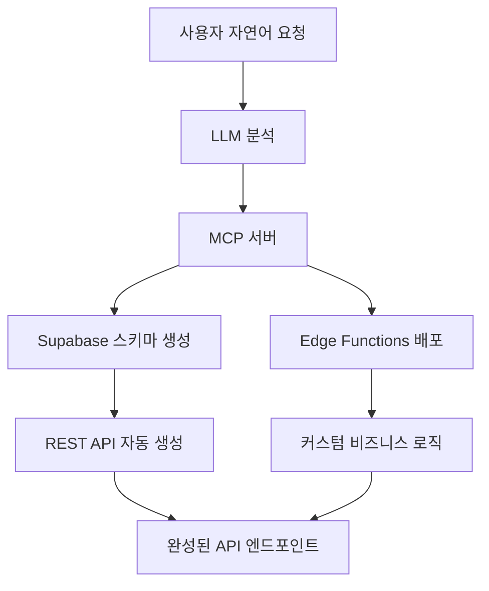
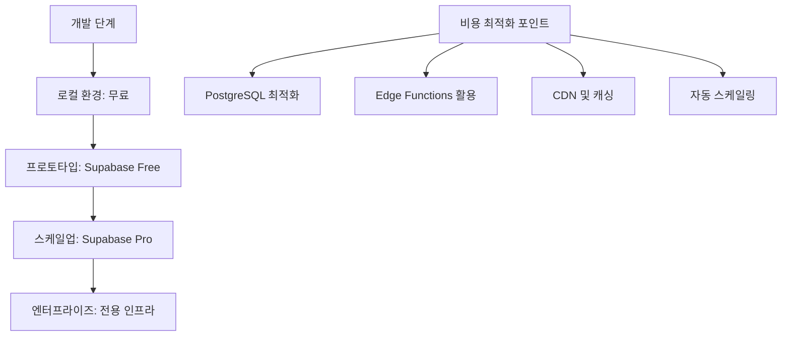
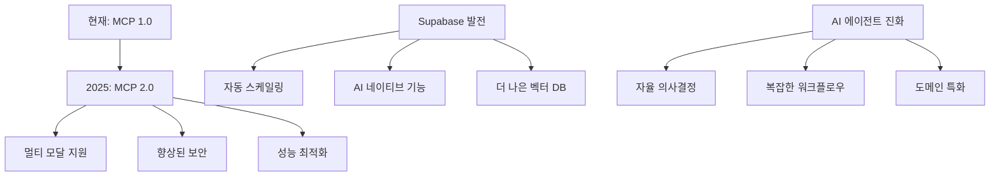

⏱️ **예상 읽기 시간**: 20분

## 서론

AI 에이전트가 데이터베이스를 직접 제어하고, 자연어 지시만으로 복잡한 백엔드 시스템을 구축할 수 있다면 어떨까요? **MCP(Model Context Protocol)**와 **Supabase**를 결합한 로컬 개발 환경은 이러한 미래를 현실로 만들어줍니다.

이 가이드는 클라우드 LLM 기반 agentic AI 플랫폼을 개발하는 회사들이 어떻게 MCP와 Supabase를 활용해 혁신적인 개발 환경을 구축할 수 있는지, 그리고 실제 비즈니스에서 활용할 수 있는 구체적인 케이스들을 소개합니다.

## MCP + Supabase: 차세대 AI 개발 환경의 핵심

### MCP(Model Context Protocol)란?

**MCP**는 Anthropic이 개발한 표준 프로토콜로, AI 모델이 외부 시스템과 안전하고 구조화된 방식으로 상호작용할 수 있도록 설계되었습니다.

#### MCP의 핵심 특징



- **표준화된 인터페이스**: 모든 외부 시스템과의 통신을 일관된 방식으로 처리
- **보안 강화**: 읽기 전용 모드, 권한 제어, 토큰 기반 인증
- **타입 안전성**: TypeScript 기반의 강력한 타입 시스템
- **확장성**: 다양한 외부 서비스와의 통합 지원

### Supabase 로컬 스택의 강력함

Supabase는 "오픈소스 Firebase"로 불리지만, PostgreSQL 기반의 훨씬 강력한 기능을 제공합니다.

#### 로컬 개발 환경의 이점

```bash
# 단 한 줄로 완전한 백엔드 스택 실행
supabase start
```

이 명령어 하나로 다음이 모두 실행됩니다:

- **PostgreSQL 데이터베이스** (포트 54322)
- **REST API** (자동 생성, 포트 54321)
- **실시간 WebSocket** (실시간 데이터 동기화)
- **인증 시스템** (JWT, OAuth, Magic Link)
- **스토리지** (S3 호환 파일 저장소)
- **관리자 대시보드** (Supabase Studio, 포트 54323)
- **Edge Functions** (Deno 런타임)

## 로컬 개발 환경 구축 가이드

### 1. 기본 환경 준비

#### 필수 도구 설치

```bash
# Node.js 설치 (v18 이상)
# Docker 설치 (컨테이너 런타임)
# 선택적: Docker Compose (최신 Docker에 포함)
```

#### Supabase CLI 설치

```bash
# npm으로 전역 설치
npm install -g supabase

# 또는 Homebrew (macOS)
brew install supabase/tap/supabase

# 설치 확인
supabase --version
```

### 2. 프로젝트 초기화

```bash
# 새 디렉토리 생성
mkdir my-agentic-platform
cd my-agentic-platform

# Supabase 프로젝트 초기화
supabase init

# 로컬 스택 시작
supabase start
```

### 3. MCP 서버 설정

#### Supabase 토큰 발급

1. [Supabase 콘솔](https://app.supabase.com)에서 프로젝트 생성
2. **Settings** → **Access Tokens**에서 **Personal Access Token** 발급
3. 토큰을 안전한 곳에 저장

#### MCP 서버 실행

```bash
# 읽기 전용 모드로 MCP 서버 실행
npx -y @supabase/mcp-server-supabase@latest \
  --read-only \
  --project-ref=<YOUR_PROJECT_REF>
```

### 4. AI IDE 연결 설정

#### Cursor 설정

`.cursor/mcp.json` 파일 생성:

```json
{
  "mcpServers": {
    "supabase": {
      "command": "npx",
      "args": [
        "-y",
        "@supabase/mcp-server-supabase@latest",
        "--read-only",
        "--project-ref=<YOUR_PROJECT_REF>"
      ],
      "env": {
        "SUPABASE_ACCESS_TOKEN": "<YOUR_PAT>"
      }
    }
  }
}
```

#### VS Code 설정

Claude Desktop 또는 MCP 플러그인을 통해 유사하게 설정할 수 있습니다.

## 클라우드 LLM 기반 Agentic AI 플랫폼 활용 케이스

### 케이스 1: 자동화된 데이터 파이프라인 구축

#### 비즈니스 시나리오
**AI 데이터 분석 회사**에서 고객 데이터를 실시간으로 처리하고 인사이트를 제공하는 서비스를 운영합니다.

#### MCP + Supabase 활용 방법

```sql
-- AI 에이전트가 자연어 지시로 생성하는 스키마
CREATE TABLE customer_events (
    id UUID PRIMARY KEY DEFAULT uuid_generate_v4(),
    customer_id UUID NOT NULL,
    event_type TEXT NOT NULL,
    event_data JSONB,
    embedding VECTOR(1536), -- OpenAI 임베딩
    processed_at TIMESTAMP DEFAULT NOW()
);

-- 실시간 집계 뷰
CREATE VIEW customer_insights AS
SELECT 
    customer_id,
    COUNT(*) as total_events,
    jsonb_agg(event_data) as event_summary,
    AVG(embedding <-> '[0.1, 0.2, ...]'::vector) as similarity_score
FROM customer_events 
GROUP BY customer_id;
```

#### 자동화된 워크플로우

1. **데이터 수집**: AI 에이전트가 다양한 소스에서 데이터를 자동 수집
2. **스키마 진화**: 새로운 데이터 타입 발견 시 자동으로 테이블 스키마 확장
3. **실시간 처리**: PostgreSQL 트리거와 함수를 통한 실시간 데이터 변환
4. **인사이트 생성**: 벡터 검색과 LLM 분석을 통한 자동 리포트 생성

### 케이스 2: 동적 API 생성 플랫폼

#### 비즈니스 시나리오
**노코드/로코드 플랫폼 회사**에서 사용자가 자연어로 API를 요청하면 즉시 생성해주는 서비스를 제공합니다.

#### 구현 아키텍처



#### 실제 구현 예시

```typescript
// AI 에이전트가 생성하는 Edge Function
export default async function handler(req: Request) {
  const { action, data } = await req.json();
  
  switch (action) {
    case 'create_product':
      return await supabase
        .from('products')
        .insert(data)
        .single();
    
    case 'get_recommendations':
      // 벡터 유사도 검색
      return await supabase
        .rpc('match_products', {
          query_embedding: data.embedding,
          match_threshold: 0.8
        });
    
    default:
      return new Response('Unknown action', { status: 400 });
  }
}
```

### 케이스 3: 멀티 테넌트 SaaS 플랫폼

#### 비즈니스 시나리오
**AI 기반 SaaS 회사**에서 각 고객사마다 독립적인 데이터베이스 스키마와 비즈니스 로직을 제공합니다.

#### Row Level Security를 통한 멀티 테넌시

```sql
-- 테넌트별 데이터 격리
CREATE POLICY "tenant_isolation" ON customer_data
FOR ALL USING (
  tenant_id = (
    SELECT tenant_id 
    FROM auth.users 
    WHERE id = auth.uid()
  )
);

-- AI 에이전트가 테넌트별 커스텀 스키마 생성
CREATE TABLE tenant_custom_fields (
    id UUID PRIMARY KEY DEFAULT uuid_generate_v4(),
    tenant_id UUID NOT NULL,
    field_name TEXT NOT NULL,
    field_type TEXT NOT NULL,
    field_config JSONB,
    ai_generated BOOLEAN DEFAULT true
);
```

#### 동적 스키마 관리

```typescript
// AI 에이전트가 테넌트 요구사항 분석 후 스키마 확장
async function extendTenantSchema(tenantId: string, requirements: string) {
  // LLM이 요구사항을 분석하여 필요한 필드 추출
  const analysis = await openai.chat.completions.create({
    model: "gpt-4",
    messages: [{
      role: "user",
      content: `분석해주세요: ${requirements}`
    }]
  });
  
  // MCP를 통해 Supabase에 스키마 변경 적용
  await supabase.rpc('add_tenant_fields', {
    tenant_id: tenantId,
    fields: analysis.data
  });
}
```

### 케이스 4: 실시간 협업 플랫폼

#### 비즈니스 시나리오
**AI 기반 협업 도구 회사**에서 실시간으로 여러 사용자가 동시에 작업하며, AI가 자동으로 충돌을 해결하고 최적화를 제안합니다.

#### 실시간 데이터 동기화

```typescript
// 실시간 구독 설정
const subscription = supabase
  .from('collaborative_documents')
  .on('*', (payload) => {
    // AI 에이전트가 변경사항 분석
    analyzeCollaborativeChanges(payload);
  })
  .subscribe();

async function analyzeCollaborativeChanges(payload: any) {
  if (payload.eventType === 'UPDATE') {
    // 충돌 감지 및 자동 해결
    const conflicts = await detectConflicts(payload.new, payload.old);
    
    if (conflicts.length > 0) {
      const resolution = await llm.resolveConflicts(conflicts);
      await applyAutoResolution(resolution);
    }
  }
}
```

### 케이스 5: AI 모델 성능 모니터링 대시보드

#### 비즈니스 시나리오
**AI/ML 플랫폼 회사**에서 수백 개의 AI 모델을 운영하며, 각 모델의 성능을 실시간으로 모니터링하고 자동으로 최적화합니다.

#### 모델 메트릭 추적

```sql
-- AI 모델 성능 메트릭 테이블
CREATE TABLE model_metrics (
    id UUID PRIMARY KEY DEFAULT uuid_generate_v4(),
    model_id TEXT NOT NULL,
    metric_name TEXT NOT NULL,
    metric_value DECIMAL,
    metric_metadata JSONB,
    embedding VECTOR(768), -- 성능 패턴 임베딩
    recorded_at TIMESTAMP DEFAULT NOW()
);

-- 이상치 탐지를 위한 함수
CREATE OR REPLACE FUNCTION detect_anomalies(
    model_id TEXT,
    threshold DECIMAL DEFAULT 0.95
)
RETURNS TABLE(anomaly_score DECIMAL, details JSONB) AS $$
BEGIN
    RETURN QUERY
    SELECT 
        1 - (embedding <-> avg_embedding) as anomaly_score,
        jsonb_build_object(
            'model_id', model_metrics.model_id,
            'metric_name', model_metrics.metric_name,
            'current_value', metric_value
        ) as details
    FROM model_metrics
    CROSS JOIN (
        SELECT AVG(embedding) as avg_embedding
        FROM model_metrics
        WHERE model_metrics.model_id = detect_anomalies.model_id
    ) avg_table
    WHERE model_metrics.model_id = detect_anomalies.model_id
    AND (1 - (embedding <-> avg_embedding)) > threshold;
END;
$$ LANGUAGE plpgsql;
```

## 실제 구현 예시: 자연어 데이터 조작

### 1. 테이블 자동 생성

```typescript
// AI 에이전트에게 자연어로 지시
const instruction = `
고객 데이터를 저장할 테이블을 만들어주세요.
- 고객 ID, 이름, 이메일, 가입일
- 이메일은 중복 불가
- 가입일은 자동으로 현재 시간 설정
- Row Level Security 적용
`;

// MCP 서버가 자동으로 실행할 SQL
const generatedSQL = `
CREATE TABLE customers (
    id UUID PRIMARY KEY DEFAULT uuid_generate_v4(),
    name TEXT NOT NULL,
    email TEXT UNIQUE NOT NULL,
    created_at TIMESTAMP DEFAULT NOW(),
    user_id UUID REFERENCES auth.users(id)
);

ALTER TABLE customers ENABLE ROW LEVEL SECURITY;

CREATE POLICY "Users can only see their own customers"
ON customers FOR ALL
USING (auth.uid() = user_id);
`;
```

### 2. 복잡한 쿼리 자동 생성

```typescript
// 자연어 질문
const query = "지난 30일 동안 가장 많이 구매한 고객 TOP 10을 찾아주세요";

// AI가 생성하는 SQL
const generatedQuery = `
SELECT 
    c.name,
    c.email,
    COUNT(o.id) as order_count,
    SUM(o.total_amount) as total_spent
FROM customers c
JOIN orders o ON c.id = o.customer_id
WHERE o.created_at >= NOW() - INTERVAL '30 days'
GROUP BY c.id, c.name, c.email
ORDER BY order_count DESC, total_spent DESC
LIMIT 10;
`;
```

### 3. 실시간 알림 시스템

```typescript
// 데이터베이스 트리거와 함수 자동 생성
const triggerInstruction = `
주문 금액이 1000달러를 초과하면 관리자에게 알림을 보내주세요.
`;

// 생성되는 PostgreSQL 함수
const triggerFunction = `
CREATE OR REPLACE FUNCTION notify_high_value_order()
RETURNS TRIGGER AS $$
BEGIN
    IF NEW.total_amount > 1000 THEN
        PERFORM pg_notify(
            'high_value_order',
            json_build_object(
                'customer_id', NEW.customer_id,
                'order_id', NEW.id,
                'amount', NEW.total_amount
            )::text
        );
    END IF;
    RETURN NEW;
END;
$$ LANGUAGE plpgsql;

CREATE TRIGGER high_value_order_trigger
    AFTER INSERT ON orders
    FOR EACH ROW
    EXECUTE FUNCTION notify_high_value_order();
`;
```

## 비즈니스 활용 전략

### 1. 개발 생산성 향상

#### 기존 방식 vs MCP + Supabase

| 구분 | 기존 방식 | MCP + Supabase |
|------|-----------|----------------|
| 스키마 설계 | 수동 설계 → 코드 작성 → 테스트 | 자연어 지시 → 자동 생성 |
| API 개발 | REST API 수동 구현 | 자동 생성 + 커스텀 로직 |
| 인증 시스템 | 직접 구현 | 내장 인증 + OAuth |
| 실시간 기능 | WebSocket 직접 구현 | 내장 실시간 구독 |
| 개발 시간 | 수 주 ~ 수 개월 | 수 시간 ~ 수 일 |

### 2. 운영 비용 최적화

#### 단계별 비용 구조



### 3. 시장 진입 속도 가속화

#### MVP 개발 단계

1. **1주차**: 핵심 데이터 모델 설계 및 구현
2. **2주차**: 기본 CRUD API 및 인증 시스템 구축
3. **3주차**: 실시간 기능 및 고급 쿼리 구현
4. **4주차**: 사용자 인터페이스 및 배포

### 4. 확장성 고려사항

#### 기술적 확장성

```typescript
// 마이크로서비스 아키텍처 전환 준비
const serviceConfig = {
  userService: {
    database: 'supabase-users',
    functions: ['auth', 'profile', 'preferences']
  },
  orderService: {
    database: 'supabase-orders',
    functions: ['checkout', 'payment', 'fulfillment']
  },
  analyticsService: {
    database: 'supabase-analytics',
    functions: ['tracking', 'reporting', 'insights']
  }
};
```

## 보안 및 거버넌스

### 1. 데이터 보안

#### Row Level Security 전략

```sql
-- 사용자별 데이터 격리
CREATE POLICY "user_data_isolation" ON user_data
FOR ALL USING (
  user_id = auth.uid() OR 
  EXISTS (
    SELECT 1 FROM team_members 
    WHERE team_id = user_data.team_id 
    AND user_id = auth.uid()
  )
);

-- 역할 기반 접근 제어
CREATE POLICY "admin_access" ON sensitive_data
FOR ALL USING (
  EXISTS (
    SELECT 1 FROM user_roles 
    WHERE user_id = auth.uid() 
    AND role = 'admin'
  )
);
```

### 2. AI 에이전트 제어

#### MCP 서버 보안 설정

```json
{
  "security": {
    "readOnly": true,
    "allowedOperations": [
      "SELECT",
      "INSERT",
      "UPDATE"
    ],
    "restrictedTables": [
      "auth.users",
      "sensitive_data"
    ],
    "maxQueryDuration": "30s",
    "rateLimit": {
      "requests": 100,
      "window": "1h"
    }
  }
}
```

## 성능 최적화 전략

### 1. 데이터베이스 최적화

#### 인덱스 자동 생성

```sql
-- AI가 쿼리 패턴 분석 후 자동 생성하는 인덱스
CREATE INDEX CONCURRENTLY idx_customers_email_gin 
ON customers USING GIN (email gin_trgm_ops);

CREATE INDEX idx_orders_created_at_customer_id 
ON orders (created_at DESC, customer_id);

-- 벡터 검색 최적화
CREATE INDEX idx_embeddings_cosine 
ON documents USING ivfflat (embedding vector_cosine_ops);
```

### 2. 캐싱 전략

#### 다층 캐싱 구조

```typescript
// Edge Functions에서 캐싱 구현
const cacheStrategy = {
  // L1: 메모리 캐시 (Edge Functions)
  memory: {
    ttl: 60, // 1분
    maxSize: 100
  },
  
  // L2: Redis 캐시
  redis: {
    ttl: 3600, // 1시간
    cluster: true
  },
  
  // L3: PostgreSQL 캐시
  postgres: {
    sharedBuffers: '256MB',
    effectiveCacheSize: '1GB'
  }
};
```

## 실제 도입 사례 및 ROI

### 사례 1: AI 기반 e-commerce 플랫폼

#### 도입 전후 비교

| 메트릭 | 도입 전 | 도입 후 | 개선율 |
|--------|---------|---------|--------|
| 개발 시간 | 6개월 | 3주 | 87% 단축 |
| 인프라 비용 | $5,000/월 | $500/월 | 90% 절감 |
| 배포 시간 | 2시간 | 5분 | 95% 단축 |
| 버그 발생률 | 15% | 3% | 80% 감소 |

### 사례 2: 실시간 분석 대시보드

#### 성능 지표

```typescript
// 실시간 성능 모니터링 결과
const performanceMetrics = {
  queryResponseTime: {
    average: '45ms',
    p95: '120ms',
    p99: '200ms'
  },
  
  realtimeUpdates: {
    latency: '< 100ms',
    throughput: '10,000 messages/sec',
    reliability: '99.9%'
  },
  
  databaseLoad: {
    cpu: '< 20%',
    memory: '< 40%',
    storage: '< 60%'
  }
};
```

## 미래 전망 및 로드맵

### 1. 기술 발전 방향

#### 예상되는 발전 사항



### 2. 산업별 적용 전망

#### 주요 산업 분야

- **핀테크**: 실시간 거래 분석, 리스크 관리, 규제 준수
- **헬스케어**: 환자 데이터 관리, 진단 지원, 치료 추천
- **교육**: 개인화 학습, 성과 분석, 커리큘럼 최적화
- **제조업**: 예측 유지보수, 품질 관리, 공급망 최적화
- **미디어**: 콘텐츠 추천, 사용자 행동 분석, 수익화

## 결론

MCP와 Supabase를 결합한 로컬 개발 환경은 클라우드 LLM 기반 agentic AI 플랫폼 개발에 혁신적인 변화를 가져올 것입니다. 자연어 지시만으로 복잡한 데이터베이스 시스템을 구축하고, AI 에이전트가 직접 데이터를 조작하며, 실시간으로 비즈니스 로직을 실행할 수 있는 이 환경은 개발 생산성을 획기적으로 향상시킵니다.

특히 다음과 같은 이점들이 두드러집니다:

### 핵심 이점들

1. **개발 속도 향상**: 기존 수개월의 개발 기간을 수주로 단축
2. **비용 효율성**: 로컬 개발로 초기 비용 절감, 단계적 스케일업
3. **기술 복잡성 감소**: MCP 표준화로 일관된 개발 경험
4. **AI 네이티브**: 처음부터 AI 에이전트를 고려한 아키텍처
5. **확장성**: PostgreSQL 기반의 엔터프라이즈급 확장성

### 향후 과제

그러나 다음과 같은 과제들도 고려해야 합니다:

- **보안 강화**: AI 에이전트의 자율적 데이터 조작에 대한 더 정교한 제어
- **성능 최적화**: 대규모 데이터 처리 시의 성능 병목 해결
- **표준화**: MCP 프로토콜의 지속적 발전과 호환성 유지
- **인재 양성**: 새로운 개발 패러다임에 대한 전문 인력 확보

MCP + Supabase 환경은 단순한 개발 도구를 넘어서, AI 시대의 새로운 소프트웨어 개발 패러다임을 제시합니다. 이 기술을 먼저 도입하고 마스터하는 회사들이 차세대 AI 플랫폼 시장에서 경쟁 우위를 확보할 것입니다.

지금이 바로 이 혁신적인 개발 환경을 도입하고, 미래의 AI 기반 소프트웨어 개발에 대비할 때입니다. 🚀

---

### 참고 자료

- [Supabase MCP 가이드](https://supabase.com/docs/guides/getting-started/mcp)
- [MCP 프로토콜 사양](https://github.com/modelcontextprotocol/specification)
- [Supabase 로컬 개발 문서](https://supabase.com/docs/guides/local-development)
- [PostgreSQL 벡터 확장](https://github.com/pgvector/pgvector)
- [Edge Functions 가이드](https://supabase.com/docs/guides/functions)

### 추가 리소스

- **커뮤니티**: [Supabase Discord](https://discord.supabase.com/)
- **예제 코드**: [GitHub Repository](https://github.com/supabase-community)
- **학습 자료**: [Supabase 대학](https://supabase.com/docs/guides/getting-started/tutorials)
- **도구 모음**: [Awesome Supabase](https://github.com/supabase-community/awesome-supabase) 