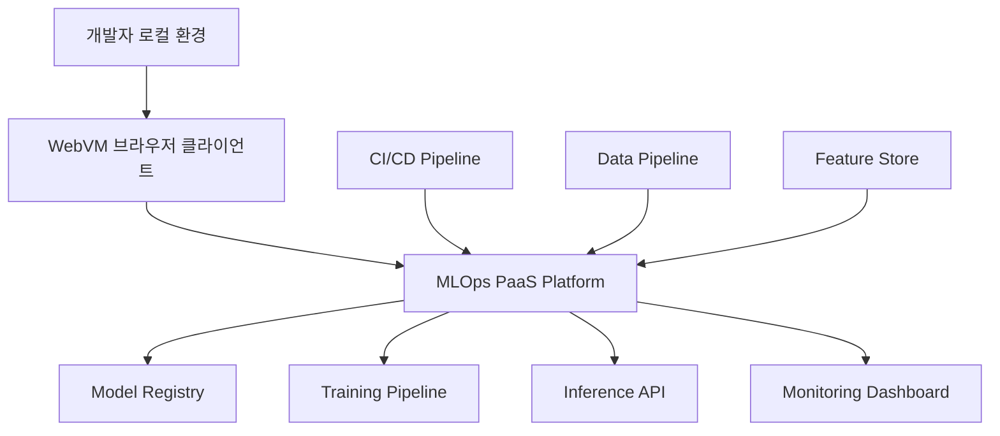

## WebVM 소개

WebVM은 브라우저에서 실행되는 완전한 Linux 가상 머신입니다. CheerpX 가상화 엔진을 기반으로 하여 x86 바이너리를 WebAssembly로 JIT 컴파일하고, 리눅스 syscall 에뮬레이션을 통해 네이티브 개발 환경을 제공합니다.

### 주요 특징

- **🌐 브라우저 기반**: 설치 없이 웹 브라우저에서 완전한 Linux 환경
- **🔄 Linux ABI 호환**: 수정되지 않은 Debian 배포판과 네이티브 도구 실행
- **🛡️ 샌드박스 환경**: 안전한 클라이언트 사이드 실행
- **🌐 네트워킹 지원**: Tailscale 통합으로 VPN 네트워크 연결
- **⚡ JIT 컴파일**: x86-to-WebAssembly 실시간 컴파일
- **📱 접근성**: 어떤 기기에서든 브라우저로 접근 가능

### 핵심 기술 스택

```bash
# 가상화 엔진
CheerpX: x86-to-WebAssembly 가상화
xterm.js: 웹 기반 터미널 에뮬레이터
lwIP: TCP/IP 스택 (Cheerp 컴파일)
Tailscale: VPN 네트워킹 지원
```

## 맥북 환경 설정 및 테스트 가이드

### 시스템 요구사항

```bash
# 하드웨어 요구사항
- Apple Silicon M1/M2/M3 또는 Intel Mac
- RAM: 8GB 이상 (16GB 권장)
- 저장공간: 10GB 이상 여유공간

# 소프트웨어 요구사항
- macOS 12.0 (Monterey) 이상
- Chrome 90+ 또는 Safari 14+ (Chrome 권장)
- Node.js 18.0 이상
- Git
- Docker Desktop (선택사항)
```

### 1단계: 개발 환경 준비

```bash
# Homebrew 설치 (미설치시)
/bin/bash -c "$(curl -fsSL https://raw.githubusercontent.com/Homebrew/install/HEAD/install.sh)"

# 필수 도구 설치
brew install node git nginx wget

# Node.js 버전 확인
node --version  # v18.0.0 이상 필요
npm --version
```

### 2단계: WebVM 클론 및 설정

```bash
# WebVM 저장소 클론
git clone https://github.com/leaningtech/webvm.git
cd webvm

# 의존성 설치
npm install

# Debian mini 이미지 다운로드
wget "https://github.com/leaningtech/webvm/releases/download/ext2_image/debian_mini_20230519_5022088024.ext2"

# 디스크 이미지 디렉토리 생성
mkdir -p disk-images
mv debian_mini_20230519_5022088024.ext2 disk-images/
```

### 3단계: 로컬 설정 구성

```bash
# 설정 파일 수정
cp config_public_terminal.js config_local.js

# config_local.js 편집
cat > config_local.js << 'EOF'
var configPublic = {
  "imageUrl": "/disk-images/debian_mini_20230519_5022088024.ext2",
  "diskImageType": "bytes",
  "relayUrl": "wss://relay.tailscale.com/",
  "logUrl": "https://relay.tailscale.com/",
  "networkInterface": "tailscale",
  "enableUserMode": true,
  "persistentStorage": true,
  "localStorage": {
    "enabled": true,
    "quota": 1024 * 1024 * 100 // 100MB
  }
};
EOF
```

### 4단계: 빌드 및 실행

```bash
# WebVM 빌드
npm run build

# Nginx 설정 파일 생성
cat > nginx_local.conf << 'EOF'
worker_processes 1;
error_log /dev/stderr warn;
pid /tmp/nginx.pid;

events {
    worker_connections 1024;
}

http {
    include /opt/homebrew/etc/nginx/mime.types;
    default_type application/octet-stream;
    
    access_log /dev/stdout;
    sendfile on;
    keepalive_timeout 65;
    
    # 압축 설정
    gzip on;
    gzip_vary on;
    gzip_types text/plain text/css application/json application/javascript text/xml application/xml;
    
    server {
        listen 8081;
        server_name localhost;
        
        # WASM 파일 MIME 타입 설정
        location ~* \.wasm$ {
            add_header Content-Type application/wasm;
            add_header Cross-Origin-Embedder-Policy require-corp;
            add_header Cross-Origin-Opener-Policy same-origin;
        }
        
        # 메인 웹사이트
        location / {
            root ./build;
            index index.html;
            try_files $uri $uri/ /index.html;
            
            # CORS 헤더 추가
            add_header Cross-Origin-Embedder-Policy require-corp;
            add_header Cross-Origin-Opener-Policy same-origin;
        }
        
        # 디스크 이미지 서빙
        location /disk-images/ {
            root .;
            autoindex on;
            
            # 큰 파일 전송 최적화
            sendfile on;
            tcp_nopush on;
            tcp_nodelay on;
        }
    }
}
EOF

# Nginx 실행
nginx -p . -c nginx_local.conf

# 브라우저에서 접속
open http://127.0.0.1:8081
```

### 5단계: 기본 테스트

```bash
# WebVM이 실행되면 다음 명령어들로 테스트
whoami
uname -a
ls -la /
cat /etc/os-release

# 네트워크 테스트 (Tailscale 연결 후)
ping google.com
wget -O - https://httpbin.org/ip

# 개발 도구 테스트
gcc --version
python3 --version
vim --version
```

## 맥북 특화 최적화

### 메모리 및 성능 최적화

```bash
# 메모리 압력 모니터링
sudo memory_pressure

# Chrome 최적화 실행
/Applications/Google\ Chrome.app/Contents/MacOS/Google\ Chrome \
  --enable-features=WebAssemblyThreads,SharedArrayBuffer \
  --max-old-space-size=4096 \
  --js-flags="--max-old-space-size=4096"
```

### Apple Silicon 최적화

```javascript
// config_local.js에 추가 최적화 옵션
var configPublic = {
  // ... 기존 설정 ...
  
  // Apple Silicon 최적화
  "wasmOptimization": {
    "enableSIMD": true,
    "enableBulkMemory": true,
    "enableThreads": navigator.hardwareConcurrency > 4
  },
  
  // 메모리 관리
  "memoryManagement": {
    "initialMemory": 256 * 1024 * 1024, // 256MB
    "maxMemory": 2 * 1024 * 1024 * 1024, // 2GB
    "enableGC": true
  }
};
```

## MLOps 환경에서의 PaaS 연동 활용

### MLOps PaaS 아키텍처 개요

WebVM을 MLOps 파이프라인의 PaaS 클라이언트로 활용하면 다음과 같은 이점이 있습니다:



### 실전 활용 시나리오

#### 1. 원격 모델 개발 환경

```bash
# WebVM에서 MLOps 클라이언트 설정
# 1. Python ML 환경 구성
apt update && apt install -y python3-pip git curl

# 2. MLOps 도구 설치
pip3 install mlflow kubeflow-pipelines wandb dvc

# 3. 클라우드 CLI 도구
curl -sSL https://sdk.cloud.google.com | bash
pip3 install awscli azure-cli

# 4. Kubernetes 클라이언트
curl -LO "https://dl.k8s.io/release/$(curl -L -s https://dl.k8s.io/release/stable.txt)/bin/linux/amd64/kubectl"
chmod +x kubectl && mv kubectl /usr/local/bin/
```

#### 2. PaaS 클라이언트 통합

```python
# mlops_client.py - WebVM에서 실행되는 MLOps 클라이언트
import os
import requests
import mlflow
from kubernetes import client, config

class MLOpsPaaSClient:
    def __init__(self, paas_endpoint, api_key):
        self.paas_endpoint = paas_endpoint
        self.api_key = api_key
        self.session = requests.Session()
        self.session.headers.update({
            'Authorization': f'Bearer {api_key}',
            'Content-Type': 'application/json'
        })
        
    def deploy_model(self, model_path, deployment_config):
        """모델을 PaaS 플랫폼에 배포"""
        # 모델 패키징
        model_package = self._package_model(model_path)
        
        # PaaS API 호출
        response = self.session.post(
            f"{self.paas_endpoint}/api/v1/deployments",
            json={
                'model_package': model_package,
                'config': deployment_config
            }
        )
        
        if response.status_code == 200:
            deployment_id = response.json()['deployment_id']
            print(f"모델 배포 성공: {deployment_id}")
            return deployment_id
        else:
            raise Exception(f"배포 실패: {response.text}")
    
    def monitor_training(self, job_id):
        """훈련 작업 모니터링"""
        while True:
            response = self.session.get(
                f"{self.paas_endpoint}/api/v1/jobs/{job_id}/status"
            )
            
            status = response.json()
            print(f"Job {job_id} Status: {status['state']}")
            
            if status['state'] in ['COMPLETED', 'FAILED']:
                break
                
            time.sleep(30)
    
    def sync_experiments(self):
        """실험 결과를 PaaS 플랫폼과 동기화"""
        # MLflow 실험 데이터 수집
        experiments = mlflow.search_experiments()
        
        for exp in experiments:
            runs = mlflow.search_runs(experiment_ids=[exp.experiment_id])
            
            # PaaS 플랫폼으로 전송
            self.session.post(
                f"{self.paas_endpoint}/api/v1/experiments/sync",
                json={
                    'experiment_id': exp.experiment_id,
                    'runs': runs.to_dict('records')
                }
            )

# 사용 예시
client = MLOpsPaaSClient(
    paas_endpoint="https://your-mlops-platform.com",
    api_key=os.getenv('MLOPS_API_KEY')
)

# 모델 배포
deployment_id = client.deploy_model(
    model_path="./models/my_model",
    deployment_config={
        'replicas': 3,
        'memory': '2Gi',
        'cpu': '1000m',
        'auto_scale': True
    }
)
```

#### 3. 데이터 파이프라인 연동

```python
# data_pipeline_client.py
import pandas as pd
import requests
from datetime import datetime

class DataPipelineClient:
    def __init__(self, pipeline_endpoint, auth_token):
        self.endpoint = pipeline_endpoint
        self.auth_token = auth_token
        
    def trigger_pipeline(self, pipeline_name, parameters=None):
        """데이터 파이프라인 트리거"""
        payload = {
            'pipeline_name': pipeline_name,
            'parameters': parameters or {},
            'triggered_by': 'webvm_client',
            'timestamp': datetime.utcnow().isoformat()
        }
        
        response = requests.post(
            f"{self.endpoint}/api/v1/pipelines/trigger",
            json=payload,
            headers={'Authorization': f'Bearer {self.auth_token}'}
        )
        
        return response.json()
    
    def get_pipeline_status(self, run_id):
        """파이프라인 실행 상태 조회"""
        response = requests.get(
            f"{self.endpoint}/api/v1/pipelines/runs/{run_id}",
            headers={'Authorization': f'Bearer {self.auth_token}'}
        )
        
        return response.json()
    
    def download_processed_data(self, dataset_id, local_path):
        """처리된 데이터 다운로드"""
        response = requests.get(
            f"{self.endpoint}/api/v1/datasets/{dataset_id}/download",
            headers={'Authorization': f'Bearer {self.auth_token}'},
            stream=True
        )
        
        with open(local_path, 'wb') as f:
            for chunk in response.iter_content(chunk_size=8192):
                f.write(chunk)
        
        print(f"데이터 다운로드 완료: {local_path}")

# 사용 예시
pipeline_client = DataPipelineClient(
    pipeline_endpoint="https://data-platform.company.com",
    auth_token=os.getenv('DATA_PIPELINE_TOKEN')
)

# 데이터 전처리 파이프라인 실행
run_result = pipeline_client.trigger_pipeline(
    pipeline_name="feature_engineering_v2",
    parameters={
        'source_table': 'raw_data.customer_events',
        'date_range': '2025-01-01,2025-01-31',
        'feature_set': 'customer_behavior_v3'
    }
)

print(f"파이프라인 실행 ID: {run_result['run_id']}")
```

### 커스텀 WebVM 이미지 생성

MLOps 환경에 특화된 커스텀 이미지를 만들어보겠습니다.

```dockerfile
# dockerfiles/mlops_workspace
FROM debian:bookworm-slim

# 기본 패키지 설치
RUN apt-get update && apt-get install -y \
    python3 \
    python3-pip \
    python3-venv \
    git \
    curl \
    wget \
    vim \
    htop \
    build-essential \
    && rm -rf /var/lib/apt/lists/*

# Python ML 라이브러리 설치
RUN pip3 install --no-cache-dir \
    numpy \
    pandas \
    scikit-learn \
    tensorflow \
    pytorch \
    mlflow \
    wandb \
    dvc \
    great-expectations \
    feast \
    kubeflow-pipelines

# 클라우드 CLI 도구
RUN curl -sSL https://sdk.cloud.google.com | bash
RUN pip3 install awscli azure-cli

# Kubernetes 도구
RUN curl -LO "https://dl.k8s.io/release/v1.28.0/bin/linux/amd64/kubectl" \
    && chmod +x kubectl \
    && mv kubectl /usr/local/bin/

# Helm 설치
RUN curl https://raw.githubusercontent.com/helm/helm/main/scripts/get-helm-3 | bash

# 작업 디렉토리 설정
WORKDIR /workspace
RUN useradd -m -s /bin/bash mlops && chown -R mlops:mlops /workspace
USER mlops

# MLOps 설정 파일
COPY --chown=mlops:mlops mlops_config/ /home/mlops/.config/

ENV HOME="/home/mlops" \
    TERM="xterm" \
    USER="mlops" \
    SHELL="/bin/bash" \
    PYTHONPATH="/workspace"

CMD ["/bin/bash"]
```

### GitHub Actions을 통한 자동 배포

```yaml
# .github/workflows/deploy-mlops-webvm.yml
name: Deploy MLOps WebVM

on:
  push:
    branches: [main]
    paths: ['dockerfiles/mlops_workspace']
  workflow_dispatch:
    inputs:
      dockerfile_path:
        description: 'Path to Dockerfile'
        required: false
        default: 'dockerfiles/mlops_workspace'

jobs:
  build-and-deploy:
    runs-on: ubuntu-latest
    steps:
    - uses: actions/checkout@v4
    
    - name: Build Ext2 Image
      run: |
        # Docker 이미지 빌드
        docker build -f $`github.event.inputs.dockerfile_path || 'dockerfiles/mlops_workspace'` \
                     -t mlops-webvm .
        
        # Ext2 이미지 생성
        docker run --privileged --rm \
          -v $(pwd)/build:/build \
          mlops-webvm \
          /build/create-ext2-image.sh
    
    - name: Upload to GitHub Release
      uses: softprops/action-gh-release@v1
      with:
        files: build/*.ext2
        tag_name: mlops-$`github.sha`
        name: MLOps WebVM Image
      env:
        GITHUB_TOKEN: ${{ secrets.GITHUB_TOKEN }}
    
    - name: Deploy to GitHub Pages
      if: success()
      uses: peaceiris/actions-gh-pages@v3
      with:
        github_token: ${{ secrets.GITHUB_TOKEN }}
        publish_dir: ./build
        cname: mlops-webvm.company.com
```

## 실전 프로젝트: MLOps 워크벤치

전체적인 MLOps 워크플로우를 WebVM에서 관리하는 종합적인 도구를 만들어보겠습니다.

### 프로젝트 구조

```bash
mkdir mlops-webvm-workbench
cd mlops-webvm-workbench

# 프로젝트 구조 생성
mkdir -p {src,config,templates,scripts}
touch src/{workbench.py,pipeline_manager.py,model_deployer.py}
touch config/{platforms.yaml,environments.yaml}
```

### MLOps 워크벤치 메인 애플리케이션

```python
# src/workbench.py
import os
import yaml
import asyncio
import streamlit as st
from pipeline_manager import PipelineManager
from model_deployer import ModelDeployer
import pandas as pd
import plotly.express as px

class MLOpsWorkbench:
    def __init__(self):
        self.pipeline_manager = PipelineManager()
        self.model_deployer = ModelDeployer()
        self.load_config()
    
    def load_config(self):
        """설정 파일 로드"""
        with open('config/platforms.yaml', 'r') as f:
            self.platforms = yaml.safe_load(f)
        
        with open('config/environments.yaml', 'r') as f:
            self.environments = yaml.safe_load(f)
    
    def run(self):
        """Streamlit 워크벤치 실행"""
        st.set_page_config(
            page_title="MLOps WebVM Workbench",
            page_icon="⚡",
            layout="wide"
        )
        
        st.title("⚡ MLOps WebVM Workbench")
        st.markdown("브라우저에서 실행되는 완전한 MLOps 개발 환경")
        
        # 사이드바 네비게이션
        with st.sidebar:
            st.header("🛠️ 도구")
            page = st.selectbox(
                "페이지 선택",
                ["대시보드", "파이프라인", "모델 배포", "실험 관리", "모니터링"]
            )
        
        # 메인 콘텐츠
        if page == "대시보드":
            self.render_dashboard()
        elif page == "파이프라인":
            self.render_pipeline_management()
        elif page == "모델 배포":
            self.render_model_deployment()
        elif page == "실험 관리":
            self.render_experiment_management()
        elif page == "모니터링":
            self.render_monitoring()
    
    def render_dashboard(self):
        """대시보드 렌더링"""
        st.header("📊 MLOps 대시보드")
        
        col1, col2, col3, col4 = st.columns(4)
        
        with col1:
            st.metric("활성 파이프라인", "12", "↑ 2")
        
        with col2:
            st.metric("배포된 모델", "8", "→ 0")
        
        with col3:
            st.metric("일일 예측 수", "1.2M", "↑ 15%")
        
        with col4:
            st.metric("평균 지연시간", "23ms", "↓ 5ms")
        
        # 파이프라인 상태 차트
        col1, col2 = st.columns(2)
        
        with col1:
            st.subheader("파이프라인 실행 현황")
            pipeline_data = pd.DataFrame({
                'Pipeline': ['Data Ingestion', 'Feature Engineering', 'Model Training', 'Model Validation'],
                'Status': ['Success', 'Running', 'Success', 'Pending'],
                'Duration': [12, 45, 156, 0]
            })
            
            fig = px.bar(pipeline_data, x='Pipeline', y='Duration', color='Status')
            st.plotly_chart(fig, use_container_width=True)
        
        with col2:
            st.subheader("모델 성능 트렌드")
            performance_data = pd.DataFrame({
                'Date': pd.date_range('2025-01-01', periods=30),
                'Accuracy': [0.85 + i*0.001 + (i%7)*0.002 for i in range(30)],
                'F1_Score': [0.82 + i*0.0015 + (i%5)*0.001 for i in range(30)]
            })
            
            fig = px.line(performance_data, x='Date', y=['Accuracy', 'F1_Score'])
            st.plotly_chart(fig, use_container_width=True)
    
    def render_pipeline_management(self):
        """파이프라인 관리"""
        st.header("🔄 파이프라인 관리")
        
        tab1, tab2, tab3 = st.tabs(["실행", "모니터링", "설정"])
        
        with tab1:
            st.subheader("파이프라인 실행")
            
            col1, col2 = st.columns(2)
            
            with col1:
                pipeline_type = st.selectbox(
                    "파이프라인 타입",
                    ["데이터 수집", "특성 엔지니어링", "모델 훈련", "모델 평가", "배포"]
                )
                
                environment = st.selectbox(
                    "실행 환경",
                    list(self.environments.keys())
                )
                
                parameters = st.text_area(
                    "파라미터 (JSON)",
                    '{"dataset": "customer_data", "model_type": "xgboost"}'
                )
            
            with col2:
                st.write("선택된 환경 설정:")
                if environment in self.environments:
                    st.json(self.environments[environment])
            
            if st.button("파이프라인 실행"):
                with st.spinner("파이프라인 실행 중..."):
                    result = self.pipeline_manager.run_pipeline(
                        pipeline_type, environment, parameters
                    )
                    
                    if result['success']:
                        st.success(f"파이프라인 실행 성공! Run ID: {result['run_id']}")
                    else:
                        st.error(f"실행 실패: {result['error']}")
        
        with tab2:
            st.subheader("실행 모니터링")
            
            # 실행 중인 파이프라인 목록
            running_pipelines = self.pipeline_manager.get_running_pipelines()
            
            if running_pipelines:
                for pipeline in running_pipelines:
                    with st.expander(f"Pipeline: {pipeline['name']} - {pipeline['status']}"):
                        col1, col2 = st.columns(2)
                        
                        with col1:
                            st.write(f"실행 ID: {pipeline['run_id']}")
                            st.write(f"시작 시간: {pipeline['start_time']}")
                            st.write(f"진행률: {pipeline['progress']}%")
                        
                        with col2:
                            st.progress(pipeline['progress'] / 100)
                            
                            if st.button(f"중단", key=pipeline['run_id']):
                                self.pipeline_manager.stop_pipeline(pipeline['run_id'])
                                st.rerun()
            else:
                st.info("실행 중인 파이프라인이 없습니다.")
    
    def render_model_deployment(self):
        """모델 배포 관리"""
        st.header("🚀 모델 배포")
        
        tab1, tab2 = st.tabs(["새 배포", "배포 관리"])
        
        with tab1:
            st.subheader("새 모델 배포")
            
            col1, col2 = st.columns(2)
            
            with col1:
                model_path = st.text_input("모델 경로", "/workspace/models/latest")
                model_name = st.text_input("배포 이름", "customer-churn-v2")
                
                target_platform = st.selectbox(
                    "배포 플랫폼",
                    list(self.platforms.keys())
                )
                
                replicas = st.number_input("레플리카 수", 1, 10, 3)
                memory = st.selectbox("메모리", ["512Mi", "1Gi", "2Gi", "4Gi"])
                cpu = st.selectbox("CPU", ["250m", "500m", "1000m", "2000m"])
            
            with col2:
                st.write("배포 설정 미리보기:")
                deployment_config = {
                    "name": model_name,
                    "platform": target_platform,
                    "resources": {
                        "replicas": replicas,
                        "memory": memory,
                        "cpu": cpu
                    },
                    "scaling": {
                        "auto": True,
                        "min_replicas": 1,
                        "max_replicas": replicas * 2
                    }
                }
                st.json(deployment_config)
            
            if st.button("배포 시작"):
                with st.spinner("모델 배포 중..."):
                    result = self.model_deployer.deploy_model(
                        model_path, deployment_config
                    )
                    
                    if result['success']:
                        st.success(f"배포 성공! Endpoint: {result['endpoint']}")
                    else:
                        st.error(f"배포 실패: {result['error']}")
        
        with tab2:
            st.subheader("배포된 모델 관리")
            
            deployments = self.model_deployer.list_deployments()
            
            for deployment in deployments:
                with st.expander(f"{deployment['name']} - {deployment['status']}"):
                    col1, col2, col3 = st.columns(3)
                    
                    with col1:
                        st.write(f"엔드포인트: {deployment['endpoint']}")
                        st.write(f"버전: {deployment['version']}")
                        st.write(f"레플리카: {deployment['replicas']}")
                    
                    with col2:
                        st.metric("RPS", deployment['rps'], f"{deployment['rps_change']:+.1f}")
                        st.metric("지연시간", f"{deployment['latency']}ms", f"{deployment['latency_change']:+d}ms")
                    
                    with col3:
                        if st.button("스케일링", key=f"scale_{deployment['id']}"):
                            st.session_state[f"scale_modal_{deployment['id']}"] = True
                        
                        if st.button("롤백", key=f"rollback_{deployment['id']}"):
                            self.model_deployer.rollback_deployment(deployment['id'])
                            st.rerun()
                        
                        if st.button("삭제", key=f"delete_{deployment['id']}"):
                            self.model_deployer.delete_deployment(deployment['id'])
                            st.rerun()

if __name__ == "__main__":
    workbench = MLOpsWorkbench()
    workbench.run()
```

### 실행 스크립트

```bash
# scripts/run_workbench.sh
#!/bin/bash

# WebVM 환경에서 MLOps 워크벤치 실행
echo "🚀 MLOps WebVM Workbench 시작..."

# 가상환경 생성 및 활성화
python3 -m venv venv
source venv/bin/activate

# 의존성 설치
pip install streamlit pandas plotly pyyaml requests kubernetes mlflow

# Streamlit 앱 실행
cd /workspace/mlops-webvm-workbench
streamlit run src/workbench.py --server.port 8501 --server.address 0.0.0.0

echo "✅ 워크벤치가 http://localhost:8501 에서 실행 중입니다."
```

## 성능 최적화 및 모니터링

### 브라우저 성능 최적화

```javascript
// webvm_optimizer.js - WebVM 성능 최적화
class WebVMOptimizer {
    constructor() {
        this.performanceMetrics = {
            memoryUsage: 0,
            cpuUsage: 0,
            networkLatency: 0
        };
    }
    
    async optimizeForMLOps() {
        // 메모리 최적화
        this.optimizeMemory();
        
        // 네트워크 최적화
        await this.optimizeNetwork();
        
        // WASM 최적화
        this.optimizeWASM();
        
        // 모니터링 시작
        this.startMonitoring();
    }
    
    optimizeMemory() {
        // 가비지 컬렉션 주기 조정
        if (window.gc) {
            setInterval(() => {
                if (this.performanceMetrics.memoryUsage > 80) {
                    window.gc();
                }
            }, 30000);
        }
        
        // 메모리 압축 활성화
        if ('memory' in performance) {
            const memInfo = performance.memory;
            console.log(`Memory Usage: ${memInfo.usedJSHeapSize / memInfo.totalJSHeapSize * 100}%`);
        }
    }
    
    async optimizeNetwork() {
        // Tailscale 연결 최적화
        const tailscaleConfig = {
            keepAlive: true,
            timeout: 30000,
            retryAttempts: 3
        };
        
        // 네트워크 지연시간 측정
        const latency = await this.measureNetworkLatency();
        this.performanceMetrics.networkLatency = latency;
        
        console.log(`Network latency: ${latency}ms`);
    }
    
    optimizeWASM() {
        // WASM 모듈 프리로딩
        const wasmModules = [
            '/assets/webvm.wasm',
            '/assets/cheerpx.wasm'
        ];
        
        wasmModules.forEach(module => {
            const link = document.createElement('link');
            link.rel = 'preload';
            link.href = module;
            link.as = 'fetch';
            link.crossOrigin = 'anonymous';
            document.head.appendChild(link);
        });
    }
    
    startMonitoring() {
        setInterval(() => {
            this.collectMetrics();
            this.sendMetricsToMLOpsPlatform();
        }, 60000); // 1분마다
    }
    
    collectMetrics() {
        // CPU 사용률 (근사치)
        const start = performance.now();
        setTimeout(() => {
            const end = performance.now();
            this.performanceMetrics.cpuUsage = Math.min(100, (end - start) / 10);
        }, 100);
        
        // 메모리 사용률
        if ('memory' in performance) {
            const memInfo = performance.memory;
            this.performanceMetrics.memoryUsage = 
                (memInfo.usedJSHeapSize / memInfo.totalJSHeapSize) * 100;
        }
    }
    
    async sendMetricsToMLOpsPlatform() {
        const metrics = {
            timestamp: new Date().toISOString(),
            webvm_instance: this.getInstanceId(),
            performance: this.performanceMetrics,
            user_agent: navigator.userAgent
        };
        
        try {
            await fetch('/api/metrics', {
                method: 'POST',
                headers: { 'Content-Type': 'application/json' },
                body: JSON.stringify(metrics)
            });
        } catch (error) {
            console.warn('Failed to send metrics:', error);
        }
    }
    
    getInstanceId() {
        return sessionStorage.getItem('webvm_instance_id') || 
               this.generateInstanceId();
    }
    
    generateInstanceId() {
        const id = `webvm_${Date.now()}_${Math.random().toString(36).substr(2, 9)}`;
        sessionStorage.setItem('webvm_instance_id', id);
        return id;
    }
    
    async measureNetworkLatency() {
        const start = performance.now();
        try {
            await fetch('/ping', { method: 'HEAD' });
            return performance.now() - start;
        } catch (error) {
            return -1;
        }
    }
}

// 자동 최적화 시작
document.addEventListener('DOMContentLoaded', () => {
    const optimizer = new WebVMOptimizer();
    optimizer.optimizeForMLOps();
});
```

## 문제 해결 가이드

### 일반적인 문제와 해결방법

```bash
# 1. 메모리 부족 오류
# 해결: Chrome 메모리 제한 증가
google-chrome --max-old-space-size=8192 --js-flags="--max-old-space-size=8192"

# 2. 네트워크 연결 실패
# 해결: Tailscale 재연결
# WebVM에서 Networking 패널 → Disconnect → Connect

# 3. WASM 로딩 실패
# 해결: CORS 헤더 확인
curl -I http://localhost:8081/assets/webvm.wasm
# Cross-Origin-Embedder-Policy: require-corp 확인

# 4. 파일 업로드 실패
# 해결: Nginx 업로드 크기 제한 증가
client_max_body_size 1G;

# 5. 성능 저하
# 해결: 브라우저 최적화 플래그
--enable-features=WebAssemblyThreads,SharedArrayBuffer
--enable-unsafe-webgpu
```

### 디버깅 도구

```bash
# WebVM 내부에서 시스템 정보 확인
cat /proc/cpuinfo
cat /proc/meminfo
df -h
ps aux

# 네트워크 상태 확인
ip addr show
ping -c 4 8.8.8.8
curl -I https://httpbin.org/ip

# 로그 모니터링
tail -f /var/log/messages
journalctl -f
```

## 결론

WebVM은 브라우저에서 실행되는 완전한 Linux 환경으로, MLOps 워크플로우의 PaaS 클라이언트로 탁월한 활용도를 보여줍니다. 특히 다음과 같은 장점이 있습니다:

### 주요 이점

1. **접근성**: 어떤 기기에서든 브라우저만으로 완전한 개발 환경
2. **보안성**: 샌드박스 환경에서 안전한 코드 실행
3. **확장성**: 커스텀 Docker 이미지로 특화된 환경 구성
4. **통합성**: 기존 MLOps 플랫폼과 API 연동 용이

### 활용 시나리오

- **원격 개발**: 팀원들이 동일한 개발 환경에서 협업
- **교육 및 트레이닝**: 설치 없는 실습 환경 제공  
- **프로토타이핑**: 빠른 아이디어 검증 및 테스트
- **데모 및 프레젠테이션**: 라이브 코딩 및 시연

WebVM과 MLOps PaaS의 조합은 클라우드 네이티브 개발의 새로운 패러다임을 제시하며, 개발자 경험과 생산성을 크게 향상시킬 수 있습니다.

### 참고 링크

- **GitHub Repository**: [leaningtech/webvm](https://github.com/leaningtech/webvm)
- **공식 웹사이트**: [webvm.io](https://webvm.io)
- **CheerpX 문서**: [leaningtech.com/cheerpx](https://leaningtech.com/cheerpx)
- **Tailscale 연동**: [WebVM and Tailscale 가이드](https://webvm.io/docs/networking) 