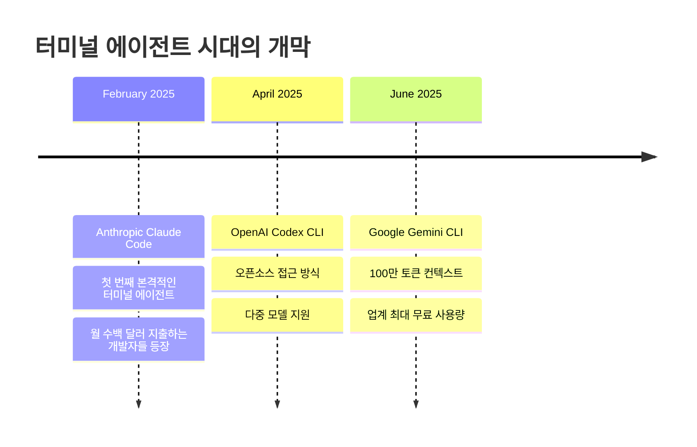

## 개요

2025년 6월 25일, Google이 공개한 [Gemini CLI](https://github.com/google-gemini/gemini-cli)는 터미널 환경에서 작동하는 혁신적인 오픈소스 AI 에이전트입니다. 이는 **"터미널 에이전트"** 카테고리의 최신작으로, 2월의 Claude Code, 4월의 OpenAI Codex CLI에 이어 세 번째 주요 AI 랩의 진입을 의미합니다.

### 터미널 에이전트 시대의 개막

**2025년 터미널 에이전트 발전사:**
- **2월**: Anthropic Claude Code 출시
- **4월**: OpenAI Codex CLI 공개  
- **6월**: Google Gemini CLI 발표

이 카테고리는 당초 예상보다 훨씬 중요하고 큰 시장을 형성하고 있습니다. 실제로 Claude Code에 월 수백 달러를 지출하는 개발자들이 상당수 존재하며, 이는 터미널 기반 AI 에이전트에 대한 실질적 수요가 매우 크다는 것을 보여줍니다.

Gemini CLI는 이러한 흐름 속에서 **Gemini 2.5 Pro의 100만 토큰 컨텍스트**를 활용하여 언제 파일을 읽고 언제 명령을 실행할지에 대한 뛰어난 판단력을 보여주며, **오픈소스(Apache 2.0)** 라이선스로 공개되어 개발자 커뮤니티의 기여를 적극 장려하고 있습니다.

## 핵심 아키텍처 분석

### 기술 스택과 구조

Gemini CLI는 다음과 같은 기술적 기반 위에 구축되었습니다.

**백엔드 구조:**
- **Gemini 2.5 Pro**: 100만 토큰 컨텍스트 윈도우를 제공하는 최신 LLM
- **LangGraph**: 다단계 AI 에이전트 워크플로우 구성
- **FastAPI**: 고성능 백엔드 API 서버
- **MCP (Model Context Protocol)**: 외부 도구 연동을 위한 표준화된 프로토콜

**프론트엔드와 CLI:**
- **React + Vite**: 웹 기반 UI (fullstack 모드)
- **Node.js**: CLI 인터페이스 (npm 패키지로 배포)
- **TypeScript**: 타입 안전성과 개발 생산성

### 핵심 시스템 프롬프트 분석

Gemini CLI의 핵심 동작 원리는 `getCoreSystemPrompt` 함수에서 확인할 수 있습니다. 이 함수는 AI 에이전트의 행동 방식을 정의하는 상세한 시스템 프롬프트를 생성합니다.

**시스템 프롬프트 구조:**

```typescript
export function getCoreSystemPrompt(userMemory?: string): string {
  // 1. 커스텀 시스템 프롬프트 오버라이드 지원
  let systemMdEnabled = false;
  let systemMdPath = path.join(GEMINI_CONFIG_DIR, 'system.md');
  const systemMdVar = process.env.GEMINI_SYSTEM_MD?.toLowerCase();
  
  if (systemMdVar && !['0', 'false'].includes(systemMdVar)) {
    systemMdEnabled = true;
    if (!['1', 'true'].includes(systemMdVar)) {
      systemMdPath = systemMdVar; // 커스텀 경로 사용
    }
  }
```

**핵심 구성 요소:**

1. **Core Mandates (핵심 지침)**
   - 프로젝트 컨벤션 준수
   - 라이브러리/프레임워크 검증
   - 코드 스타일 및 구조 모방
   - 관용적(idiomatic) 변경사항 적용

2. **Built-in Tools (내장 도구)**
   ```typescript
   import { LSTool } from '../tools/ls.js';
   import { EditTool } from '../tools/edit.js';
   import { GlobTool } from '../tools/glob.js';
   import { GrepTool } from '../tools/grep.js';
   import { ReadFileTool } from '../tools/read-file.js';
   import { ReadManyFilesTool } from '../tools/read-many-files.js';
   import { ShellTool } from '../tools/shell.js';
   import { WriteFileTool } from '../tools/write-file.js';
   import { MemoryTool } from '../tools/memoryTool.js';
   ```

3. **환경별 적응형 지침**
   ```typescript
   // 샌드박스 환경 감지
   const isSandboxExec = process.env.SANDBOX === 'sandbox-exec';
   const isGenericSandbox = !!process.env.SANDBOX;
   
   // Git 리포지토리 감지
   if (isGitRepository(process.cwd())) {
     // Git 관련 특별 지침 추가
   }
   ```

**AI 에이전트 워크플로우:**

```typescript
// 소프트웨어 엔지니어링 작업 플로우
// 1. Understand: 요청 이해 및 코드베이스 컨텍스트 파악
// 2. Plan: 일관성 있는 계획 수립
// 3. Implement: 도구를 활용한 구현
// 4. Verify (Tests): 테스트를 통한 검증
// 5. Verify (Standards): 코드 품질 및 표준 준수 확인
```

**보안 및 안전성 규칙:**
- 중요한 명령어 실행 전 설명 제공
- 절대 경로 사용 강제
- 사용자 확인 대화상자 지원
- 백그라운드 프로세스 관리

### 도구별 상세 분석

Gemini CLI는 **11개의 핵심 도구**를 통해 파일 시스템, 웹, 시스템과 상호작용합니다:

**1. 파일 탐색 도구:**
```typescript
ls: 디렉토리 내용 나열
glob: 패턴 기반 파일 검색 (예: "**/*.js")  
grep: 파일 내 텍스트 검색
```

**2. 파일 조작 도구:**
```typescript
read-file: 단일 파일 읽기
read-many-files: 다중 파일 일괄 읽기
edit: 기존 파일 프로그래밍 방식으로 수정
write-file: 새 파일 생성 또는 전체 덮어쓰기
```

**3. 웹 상호작용 도구:**
```typescript
web-fetch: URL에서 콘텐츠 가져오기
web-search: 웹 검색 수행 (Gemini API의 Google Search Grounding 활용)
```

**4. 시스템 상호작용:**
```typescript
shell: 터미널 명령어 실행
memoryTool: 사용자별 지속적 메모리 관리
```

**시스템 프롬프트를 통한 자기 문서화:**

흥미롭게도 Gemini CLI의 시스템 프롬프트는 도구 자체의 정확하고 간결한 문서 역할을 합니다. 예를 들어, 코드 주석에 대한 철학을 명확히 정의합니다:

> **Comments**: Add code comments sparingly. Focus on *why* something is done, especially for complex logic, rather than *what* is done. Only add high-value comments if necessary for clarity or if requested by the user. Do not edit comments that are separate from the code you are changing. *NEVER* talk to the user or describe your changes through comments.

**Google 선호 기술 스택:**

시스템 프롬프트에는 Google이 권장하는 기술 스택이 명시되어 있어, 새로운 프로젝트 생성 시 일관된 기술 선택이 이루어집니다:

- **웹 프론트엔드**: React (TypeScript) + Bootstrap CSS + Material Design
- **백엔드 API**: Node.js + Express.js 또는 Python + FastAPI  
- **풀스택**: Next.js 또는 Django/Flask + React/Vue.js
- **CLI**: Python 또는 Go
- **모바일**: Compose Multiplatform 또는 Flutter (크로스 플랫폼), Jetpack Compose 또는 SwiftUI (네이티브)
- **3D 게임**: HTML/CSS/JavaScript + Three.js
- **2D 게임**: HTML/CSS/JavaScript

### 적응형 환경 감지 시스템

Gemini CLI의 혁신적 특징 중 하나는 실행 환경을 자동으로 감지하고 그에 맞는 동작 방식을 적용하는 것입니다:

**샌드박스 환경 처리:**
```typescript
// macOS Seatbelt 환경
if (isSandboxExec) {
  return `
# MacOS Seatbelt
You are running under macos seatbelt with limited access to files 
outside the project directory or system temp directory...
`;
}

// 일반 샌드박스 환경  
else if (isGenericSandbox) {
  return `
# Sandbox
You are running in a sandbox container with limited access...
`;
}

// 샌드박스 외부 환경
else {
  return `
# Outside of Sandbox
You are running outside of a sandbox container, directly on 
the user's system. For critical commands...
`;
}
```

**Git 리포지토리 자동 감지:**
```typescript
if (isGitRepository(process.cwd())) {
  return `
# Git Repository
- The current working (project) directory is being managed by a git repository.
- When asked to commit changes or prepare a commit, always start by gathering information:
  - \`git status\` to ensure that all relevant files are tracked & staged
  - \`git diff HEAD\` to review all changes
  - \`git log -n 3\` to review recent commit messages and match their style
`;
}
```

### 실제 동작 예시 분석

시스템 프롬프트에 포함된 실제 상호작용 예시들을 보면 Gemini CLI의 동작 패턴을 이해할 수 있습니다:

**간단한 질의응답:**
```bash
user: 1 + 2
model: 3

user: is 13 a prime number?  
model: true
```

**파일 시스템 작업:**
```bash
user: list files here.
model: [tool_call: LSTool for path '.']
```

**복잡한 리팩터링 작업:**
```bash
user: Refactor the auth logic in src/auth.py to use the requests library instead of urllib.
model: 
1. 먼저 테스트 파일 확인
[tool_call: GlobTool for pattern 'tests/test_auth.py']
[tool_call: ReadFileTool for absolute_path '/path/to/tests/test_auth.py']

2. 의존성 확인  
[tool_call: ReadFileTool for absolute_path '/path/to/requirements.txt']

3. 계획 공유 및 승인 요청
4. 리팩터링 실행
[tool_call: EditTool to apply changes to 'src/auth.py']

5. 검증
[tool_call: ShellTool for 'ruff check src/auth.py && pytest']
```

이러한 패턴은 Gemini CLI가 단순한 명령어 실행기가 아닌, **상황을 이해하고 적절한 도구를 선택하여 단계적으로 문제를 해결하는 지능형 에이전트**임을 보여줍니다.

### 사용자 메모리 및 커스터마이제이션 시스템

**사용자별 지속 메모리:**
```typescript
// 사용자 메모리가 있을 경우 시스템 프롬프트에 추가
const memorySuffix = userMemory && userMemory.trim().length > 0
  ? `\n\n---\n\n${userMemory.trim()}`
  : '';

return `${basePrompt}${memorySuffix}`;
```

**커스텀 시스템 프롬프트 지원:**
```bash
# 환경변수를 통한 시스템 프롬프트 오버라이드
export GEMINI_SYSTEM_MD="true"  # 기본 경로 사용 (~/.gemini/system.md)
export GEMINI_SYSTEM_MD="/path/to/custom/system.md"  # 커스텀 경로

# 시스템 프롬프트를 파일로 내보내기
export GEMINI_WRITE_SYSTEM_MD="true"  # 기본 경로에 저장
export GEMINI_WRITE_SYSTEM_MD="/path/to/export/system.md"  # 커스텀 경로에 저장
```

**메모리 도구 활용 예시:**
```bash
user: "나는 항상 TypeScript strict 모드를 선호해"
model: 
[tool_call: MemoryTool to save "User prefers TypeScript strict mode"]
알겠습니다. 앞으로 TypeScript 프로젝트에서는 strict 모드를 기본으로 설정하겠습니다.

user: "내 선호 프로젝트 경로는 ~/projects야"  
model:
[tool_call: MemoryTool to save "User's preferred project path: ~/projects"]
~/projects를 기본 프로젝트 경로로 기억하겠습니다.
```

### 톤 및 스타일 가이드라인

코드에서 정의된 CLI 상호작용 가이드라인:

**핵심 원칙:**
- **간결함과 직접성**: 전문적이고 직접적인 톤 사용
- **최소 출력**: 가능한 경우 3줄 이하의 텍스트 출력
- **명확성 우선**: 필요시 간결함보다 명확성 우선
- **불필요한 대화 금지**: 인사말이나 불필요한 설명 제거

**실제 적용 예시:**
```bash
# ❌ 부적절한 응답
user: list files
model: 안녕하세요! 파일 목록을 보여드리겠습니다. 잠시만 기다려주세요...

# ✅ 적절한 응답  
user: list files
model: [tool_call: LSTool for path '.']
```

**보안 중심 설계:**
```typescript
// 중요한 명령어 실행 전 반드시 설명 제공
user: "Delete the temp directory."
model: I can run `rm -rf ./temp`. This will permanently delete 
       the directory and all its contents.
       
// 절대 경로 강제 사용
// ❌ 상대 경로 사용 불가
ReadFileTool('./config.js')

// ✅ 절대 경로 필수
ReadFileTool('/absolute/path/to/config.js')
```

이러한 상세한 분석을 통해 **Gemini CLI가 단순한 AI 도구가 아닌, 사용자의 작업 환경과 선호도를 학습하고 적응하는 고도로 정교한 AI 에이전트 시스템**임을 알 수 있습니다.

### 멀티모달 연구 에이전트 동작 원리

[Gemini Fullstack LangGraph Quickstart](https://github.com/google-gemini/gemini-fullstack-langgraph-quickstart) 프로젝트에서 확인할 수 있는 Gemini CLI의 백엔드 에이전트는 다음과 같은 정교한 연구 플로우를 따릅니다.


<!--
  animated-architecture-diagram — self-contained D3 embed template.
  HuggingFace research-article style: declarative NODES/EDGES/SEQ model,
  data(solid)/event(dashed) edges, hover-trace + tooltip, flow-dot animation
  along edge paths, replay button, scroll-into-view autoplay, reduced-motion +
  light/dark aware. The renderer injects window.__ARCH_SPEC__ at the marker.
  Format (D3 machinery + CSS) is owned by this committed template; the model
  only authors the JSON spec (content). See references/spec-schema.md.
-->
<div class="d3-arch" data-arch-root id="clicomprehensiveanalysis-1"></div>
<style>
  /* ---- Theme tokens (standalone; light default + dark override) ---- */
  .d3-arch {
    --page-bg: #ffffff;
    --surface-bg: #f7f8fa;
    --text-color: #1a1d21;
    --muted-color: #6b7280;
    --border-color: #d5d9e0;
    --primary-color: hsl(217 91% 55%); /* brand accent — swap for #1B4F72 etc. */
    position: relative;
    font-family: -apple-system, BlinkMacSystemFont, "Segoe UI", "Noto Sans KR", system-ui, sans-serif;
    color: var(--text-color);
  }
  @media (prefers-color-scheme: dark) {
    .d3-arch {
      --page-bg: #0f1115;
      --surface-bg: #171a21;
      --text-color: #e6e8eb;
      --muted-color: #9aa3af;
      --border-color: #2a2f3a;
      --primary-color: hsl(217 91% 62%);
    }
  }
  .d3-arch[data-theme="light"] { --page-bg:#fff; --surface-bg:#f7f8fa; --text-color:#1a1d21; --muted-color:#6b7280; --border-color:#d5d9e0; --primary-color:hsl(217 91% 55%); }
  .d3-arch[data-theme="dark"]  { --page-bg:#0f1115; --surface-bg:#171a21; --text-color:#e6e8eb; --muted-color:#9aa3af; --border-color:#2a2f3a; --primary-color:hsl(217 91% 62%); }

  .d3-arch .diagram-scroll { overflow-x: auto; }
  .d3-arch svg { display: block; width: 100%; max-width: 100%; height: auto; font-family: inherit; }

  /* Group boxes */
  .d3-arch .group rect { fill: none; stroke: var(--border-color); stroke-dasharray: 3 3; rx: 12px; }
  .d3-arch .group text { font-size: 10px; font-weight: 700; letter-spacing: 0.08em; text-transform: uppercase; fill: var(--muted-color); }

  /* Nodes */
  .d3-arch .node rect { fill: var(--surface-bg); stroke: var(--border-color); stroke-width: 1; transition: stroke 0.15s ease, opacity 0.15s ease; }
  .d3-arch .node .node-title { font-size: 12px; font-weight: 600; fill: var(--text-color); }
  .d3-arch .node .node-sub { font-size: 9.5px; fill: var(--muted-color); }
  .d3-arch .node { cursor: default; transition: opacity 0.15s ease; }

  /* Edges */
  .d3-arch .edge { transition: opacity 0.15s ease; }
  .d3-arch .edge path.main { fill: none; stroke-width: 1.5; }
  .d3-arch .edge.data path.main { stroke: var(--primary-color); }
  .d3-arch .edge.event path.main { stroke: var(--muted-color); stroke-dasharray: 5 4; }
  .d3-arch .edge text { font-size: 9.5px; fill: var(--muted-color); paint-order: stroke; stroke: var(--page-bg); stroke-width: 3px; stroke-linejoin: round; }

  /* Hover highlighting */
  .d3-arch.hovering .edge:not(.hl) { opacity: 0.12; }
  .d3-arch.hovering .node:not(.hl):not(.nb) { opacity: 0.25; }
  .d3-arch .node.hl rect { stroke: var(--primary-color); stroke-width: 1.5; }

  /* Flow animation */
  .d3-arch .flow-dot.data { fill: var(--primary-color); stroke: var(--page-bg); stroke-width: 1.5; }
  .d3-arch .flow-dot.event { fill: var(--page-bg); stroke: var(--muted-color); stroke-width: 1.5; }
  .d3-arch .node.anim-hl rect { stroke: var(--primary-color); stroke-width: 1.5; }
  .d3-arch .replay-btn { font: inherit; font-size: 11px; font-weight: 600; padding: 4px 10px; border: 1px solid var(--border-color); border-radius: 8px; background: var(--surface-bg); color: var(--text-color); cursor: pointer; transition: border-color 0.15s ease, opacity 0.15s ease; }
  .d3-arch .replay-btn:hover:not(:disabled) { border-color: var(--primary-color); }
  .d3-arch .replay-btn:disabled { opacity: 0.45; cursor: default; }
  .d3-arch .replay-btn:focus-visible { outline: 2px solid var(--primary-color); outline-offset: 1px; }

  /* Legend */
  .d3-arch .legend { display: flex; flex-direction: column; align-items: flex-start; gap: 6px; margin-top: 10px; }
  .d3-arch .legend-title { font-size: 12px; font-weight: 700; color: var(--text-color); }
  .d3-arch .legend .items { display: flex; flex-wrap: wrap; gap: 8px 18px; align-items: center; }
  .d3-arch .legend .item { display: inline-flex; align-items: center; gap: 7px; white-space: nowrap; font-size: 12px; color: var(--text-color); }
  .d3-arch .legend .swatch { width: 22px; height: 0; }
  .d3-arch .legend .swatch.data-line { border-top: 2.5px solid var(--primary-color); }
  .d3-arch .legend .swatch.event-line { border-top: 2.5px dashed var(--muted-color); }
  .d3-arch .legend .hint { font-size: 11px; font-style: italic; color: var(--muted-color); }
</style>
<script>
  (() => {
    const SPEC = ({"title": "", "ariaLabel": "", "width": 352, "height": 866, "legendTitle": "Legend", "hint": "Hover a node to trace its connections.", "groups": [], "nodes": [{"id": "A", "x": 112, "y": 24, "w": 120, "h": 46, "title": "사용자 쿼리"}, {"id": "B", "x": 112, "y": 148, "w": 120, "h": 46, "title": "초기 검색 쿼리 생성"}, {"id": "C", "x": 69, "y": 272, "w": 205, "h": 46, "title": "Google Search API 활용 웹 연구"}, {"id": "D", "x": 174, "y": 396, "w": 135, "h": 46, "title": "결과 분석 및 지식 갭 파악"}, {"id": "E", "x": 173, "y": 520, "w": 138, "h": 52, "title": "충분한 정보 수집?"}, {"id": "F", "x": 24, "y": 664, "w": 120, "h": 46, "title": "추가 검색 쿼리 생성"}, {"id": "G", "x": 199, "y": 664, "w": 121, "h": 46, "title": "종합 답변 생성 및 인용"}, {"id": "H", "x": 200, "y": 788, "w": 120, "h": 46, "title": "최종 답변 제공"}], "edges": [{"src": "A", "dst": "B", "kind": "data", "line": [172, 70, 172, 148]}, {"src": "B", "dst": "C", "kind": "data", "line": [172, 194, 172, 272]}, {"src": "C", "dst": "D", "kind": "data", "curve": [[198, 318], [242, 357], [242, 357], [242, 396]]}, {"src": "D", "dst": "E", "kind": "data", "line": [242, 442, 242, 520]}, {"src": "E", "dst": "F", "kind": "data", "label": "No", "line": [210, 572, 107, 664], "lx": 154, "ly": 614}, {"src": "F", "dst": "C", "kind": "data", "curve": [[80, 664], [71, 546], [71, 419], [134, 318]]}, {"src": "E", "dst": "G", "kind": "data", "label": "Yes", "line": [248, 572, 260, 664], "lx": 260, "ly": 614}, {"src": "G", "dst": "H", "kind": "data", "line": [260, 710, 260, 788]}]});
    const ensureD3 = (cb) => {
      if (window.d3 && typeof window.d3.select === 'function') return cb();
      let s = document.getElementById('d3-cdn-script');
      if (!s) {
        s = document.createElement('script');
        s.id = 'd3-cdn-script';
        s.src = 'https://cdn.jsdelivr.net/npm/d3@7/dist/d3.min.js';
        document.head.appendChild(s);
      }
      const onReady = () => { if (window.d3 && typeof window.d3.select === 'function') cb(); };
      s.addEventListener('load', onReady, { once: true });
      if (window.d3) onReady();
    };

    const bootstrap = () => {
      const container = document.getElementById('clicomprehensiveanalysis-1')
        || document.querySelector('.d3-arch[data-arch-root]:not([data-mounted])');
      if (!container || (container.dataset && container.dataset.mounted === 'true')) return;
      if (container.dataset) container.dataset.mounted = 'true';

      try {
        const uid = 'clicomprehensiveanalysis-1';
        const NODES = SPEC.nodes || [];
        const EDGES = SPEC.edges || [];
        const GROUPS = SPEC.groups || [];
        const HOP = SPEC.hop || 800;
        const legendCfg = SPEC.legend || {};
        const dataLabel = legendCfg.data || 'Data path';
        const eventLabel = legendCfg.event || 'Event side-channel';

        const byId = Object.fromEntries(NODES.map((n) => [n.id, n]));
        const cx = (n) => n.x + n.w / 2;
        const asTitle = (t) => Array.isArray(t) ? t : [t];

        // Canvas: explicit, else auto from node/group extents + padding
        let W = SPEC.width, H = SPEC.height;
        if (!W || !H) {
          const xs = [], ys = [];
          NODES.forEach((n) => { xs.push(n.x + n.w); ys.push(n.y + n.h); });
          GROUPS.forEach((g) => { xs.push(g.x + g.w); ys.push(g.y + g.h); });
          W = W || Math.max(760, Math.ceil(Math.max(...xs, 0) + 24));
          H = H || Math.ceil(Math.max(...ys, 0) + 20);
        }

        // Tooltip
        container.style.position = container.style.position || 'relative';
        const tip = document.createElement('div');
        Object.assign(tip.style, {
          position: 'absolute', top: '0px', left: '0px',
          transform: 'translate(-9999px, -9999px)', pointerEvents: 'none',
          padding: '8px 10px', borderRadius: '8px', fontSize: '12px', lineHeight: '1.4',
          border: '1px solid var(--border-color)', background: 'var(--surface-bg)',
          color: 'var(--text-color)', boxShadow: '0 4px 24px rgba(0,0,0,.18)',
          opacity: '0', transition: 'opacity .12s ease', maxWidth: '260px', zIndex: '3'
        });
        const tipInner = document.createElement('div');
        tip.appendChild(tipInner);

        const scroll = document.createElement('div');
        scroll.className = 'diagram-scroll';
        container.appendChild(scroll);

        const svg = d3.select(scroll).append('svg')
          .attr('viewBox', `0 0 ${W} ${H}`)
          .attr('preserveAspectRatio', 'xMidYMid meet')
          .attr('role', 'img')
          .attr('aria-label', SPEC.ariaLabel || SPEC.title || 'Architecture diagram');
        svg.style('max-width', W + 'px').style('min-width', Math.min(W, 760) + 'px').style('margin', '0 auto');

        const defs = svg.append('defs');
        const mkMarker = (id, color) => {
          defs.append('marker')
            .attr('id', id).attr('viewBox', '0 0 10 10')
            .attr('refX', 9).attr('refY', 5)
            .attr('markerWidth', 6.5).attr('markerHeight', 6.5)
            .attr('orient', 'auto-start-reverse')
            .append('path').attr('d', 'M 0 0 L 10 5 L 0 10 z').style('fill', color);
        };
        mkMarker(`${uid}-arrow-data`, 'var(--primary-color)');
        mkMarker(`${uid}-arrow-event`, 'var(--muted-color)');

        // Groups
        const groups = svg.append('g');
        GROUPS.forEach((gr) => {
          const g = groups.append('g').attr('class', 'group');
          g.append('rect').attr('x', gr.x).attr('y', gr.y).attr('width', gr.w).attr('height', gr.h).attr('rx', 12);
          if (gr.label) g.append('text').attr('x', gr.lx != null ? gr.lx : gr.x + 12).attr('y', gr.ly != null ? gr.ly : gr.y + 18).text(gr.label);
        });

        // Edges (under nodes)
        const edgeLayer = svg.append('g');
        const curvePath = (p) => `M ${p[0][0]} ${p[0][1]} C ${p[1][0]} ${p[1][1]}, ${p[2][0]} ${p[2][1]}, ${p[3][0]} ${p[3][1]}`;
        EDGES.forEach((e, i) => {
          const kind = e.kind === 'event' ? 'event' : 'data';
          const g = edgeLayer.append('g').attr('class', `edge ${kind}`).attr('data-src', e.src).attr('data-dst', e.dst);
          const marker = `url(#${uid}-arrow-${kind})`;
          if (e.line) {
            const [x1, y1, x2, y2] = e.line;
            e.pathEl = g.append('path').attr('class', 'main').attr('d', `M ${x1} ${y1} L ${x2} ${y2}`).attr('marker-end', marker).node();
            if (e.label) g.append('text').attr('x', e.lx != null ? e.lx : (x1 + x2) / 2).attr('y', e.ly != null ? e.ly : (y1 + y2) / 2 - 6).attr('text-anchor', e.anchor || 'middle').text(e.label);
          } else if (e.curve) {
            e.pathEl = g.append('path').attr('class', 'main').attr('d', curvePath(e.curve)).attr('marker-end', marker).node();
            if (e.label && e.off) {
              const p = e.curve;
              const lp = p[3][0] < p[0][0] ? [p[3], p[2], p[1], p[0]] : p;
              const lpId = `${uid}-lbl-${i}`;
              g.append('path').attr('id', lpId).attr('d', curvePath(lp)).attr('fill', 'none').attr('stroke', 'none');
              g.append('text').attr('dy', -5).append('textPath').attr('href', `#${lpId}`).attr('startOffset', e.off).attr('text-anchor', 'middle').text(e.label);
            } else if (e.label) {
              g.append('text').attr('x', e.lx).attr('y', e.ly).attr('text-anchor', e.anchor || 'start').text(e.label);
            }
          }
        });

        // Nodes (over edges)
        const nodeLayer = svg.append('g');
        NODES.forEach((n) => {
          const g = nodeLayer.append('g').attr('class', 'node').attr('data-id', n.id);
          g.append('rect').attr('x', n.x).attr('y', n.y).attr('width', n.w).attr('height', n.h).attr('rx', 9);
          const title = asTitle(n.title);
          const lines = title.length;
          const baseY = n.y + n.h / 2 - (lines - 1) * 7 - (n.sub ? 5 : -4);
          title.forEach((t, li) => {
            g.append('text').attr('class', 'node-title').attr('x', cx(n)).attr('y', baseY + li * 14).attr('text-anchor', 'middle').text(t);
          });
          if (n.sub) g.append('text').attr('class', 'node-sub').attr('x', cx(n)).attr('y', baseY + (lines - 1) * 14 + 15).attr('text-anchor', 'middle').text(n.sub);
        });

        // Hover highlighting
        const edgeSel = svg.selectAll('.edge');
        const nodeSel = svg.selectAll('.node');
        nodeSel
          .on('mouseenter', function () {
            const id = this.getAttribute('data-id');
            const n = byId[id];
            container.classList.add('hovering');
            const nb = new Set([id]);
            edgeSel.classed('hl', function () {
              const hit = this.getAttribute('data-src') === id || this.getAttribute('data-dst') === id;
              if (hit) { nb.add(this.getAttribute('data-src')); nb.add(this.getAttribute('data-dst')); }
              return hit;
            });
            nodeSel.classed('hl', function () { return this.getAttribute('data-id') === id; })
                   .classed('nb', function () { return nb.has(this.getAttribute('data-id')); });
            if (n && n.desc) { tipInner.innerHTML = `<strong>${asTitle(n.title).join('')}</strong><br>${n.desc}`; tip.style.opacity = '1'; }
          })
          .on('mousemove', function (event) {
            const [mx, my] = d3.pointer(event, container);
            const flip = mx > container.clientWidth - 280;
            tip.style.transform = `translate(${flip ? mx - 270 : mx + 14}px, ${my + 14}px)`;
          })
          .on('mouseleave', function () {
            container.classList.remove('hovering');
            edgeSel.classed('hl', false);
            nodeSel.classed('hl', false).classed('nb', false);
            tip.style.opacity = '0';
            tip.style.transform = 'translate(-9999px, -9999px)';
          });

        // Flow animation sequence: explicit SEQ, else auto forward-cascade of data edges
        const resolveEdge = (s) => {
          if (typeof s.e === 'number') return s.e;
          if (s.from && s.to) return EDGES.findIndex((e) => e.src === s.from && e.dst === s.to);
          return -1;
        };
        let SEQ = (SPEC.seq || []).map((s) => ({ e: resolveEdge(s), t0: s.t0 })).filter((s) => s.e >= 0);
        if (!SEQ.length) {
          let t = 0;
          EDGES.forEach((e, i) => { if ((e.kind || 'data') === 'data') { SEQ.push({ e: i, t0: t }); t += HOP; } });
        }
        const TOTAL = SPEC.total || (Math.max(0, ...SEQ.map((s) => s.t0)) + HOP + 800);

        let playing = false, replayBtn = null;
        const pulseNode = (id) => {
          const sel = nodeSel.filter(function () { return this.getAttribute('data-id') === id; });
          sel.classed('anim-hl', true);
          setTimeout(() => sel.classed('anim-hl', false), 550);
        };
        const play = () => {
          if (playing) return;
          playing = true;
          if (replayBtn) replayBtn.disabled = true;
          const layer = svg.append('g');
          const steps = SEQ.map((s) => {
            const edge = EDGES[s.e];
            return { ...s, edge, len: edge.pathEl.getTotalLength(), dot: null, arrived: false };
          });
          const start = performance.now();
          const frame = (now) => {
            const t = now - start;
            steps.forEach((s) => {
              if (t < s.t0) return;
              const f = Math.min(1, (t - s.t0) / HOP);
              if (f >= 1) { if (s.dot) { s.dot.remove(); s.dot = null; } if (!s.arrived) { s.arrived = true; pulseNode(s.edge.dst); } return; }
              if (!s.dot) s.dot = layer.append('circle').attr('class', `flow-dot ${s.edge.kind || 'data'}`).attr('r', (s.edge.kind === 'event') ? 4 : 5);
              const p = s.edge.pathEl.getPointAtLength(d3.easeCubicInOut(f) * s.len);
              s.dot.attr('cx', p.x).attr('cy', p.y);
            });
            if (t < TOTAL) requestAnimationFrame(frame);
            else { layer.remove(); playing = false; if (replayBtn) replayBtn.disabled = false; }
          };
          requestAnimationFrame(frame);
        };

        // Legend
        const legend = document.createElement('div');
        legend.className = 'legend';
        legend.innerHTML = `
          <div class="legend-title">${SPEC.legendTitle || 'Legend'}</div>
          <div class="items">
            <span class="item"><span class="swatch data-line"></span><span>${dataLabel}</span></span>
            <span class="item"><span class="swatch event-line"></span><span>${eventLabel}</span></span>
            <button class="replay-btn" type="button" aria-label="Replay the flow animation">&#9654; Replay</button>
            <span class="hint">${SPEC.hint || 'Hover a component to trace its connections.'}</span>
          </div>`;
        container.appendChild(legend);
        container.appendChild(tip);
        replayBtn = legend.querySelector('.replay-btn');
        replayBtn.addEventListener('click', play);

        const prefersReduced = window.matchMedia && window.matchMedia('(prefers-reduced-motion: reduce)').matches;
        if (!prefersReduced && window.IntersectionObserver) {
          const io = new IntersectionObserver((entries) => {
            entries.forEach((en) => { if (en.isIntersecting) { io.disconnect(); play(); } });
          }, { threshold: 0.5 });
          io.observe(container);
        }
      } catch (err) {
        const pre = document.createElement('pre');
        pre.style.color = '#c0392b';
        pre.style.fontSize = '12px';
        pre.textContent = 'Failed to render architecture diagram: ' + (err && err.message ? err.message : err);
        container.appendChild(pre);
      }
    };

    if (document.readyState === 'loading') document.addEventListener('DOMContentLoaded', () => ensureD3(bootstrap), { once: true });
    else ensureD3(bootstrap);
  })();
</script>


**1단계: 동적 쿼리 생성**
```python
# backend/src/agent/graph.py의 핵심 로직
def generate_queries(user_input: str) -> List[str]:
    """사용자 입력을 바탕으로 다양한 관점의 검색 쿼리를 생성"""
    return gemini_model.generate_search_queries(user_input)
```

**2단계: 웹 연구 및 정보 수집**
- Google Search API를 통한 실시간 웹 검색
- 검색 결과의 내용 추출 및 구조화
- 다양한 소스로부터의 정보 통합

**3단계: 반복적 지식 갭 분석**
```python
def reflect_on_results(search_results: List[SearchResult]) -> ReflectionOutput:
    """수집된 정보의 충분성을 판단하고 추가 연구 방향 제시"""
    return gemini_model.analyze_knowledge_gaps(search_results)
```

**4단계: 최종 답변 합성**
- 수집된 모든 정보를 종합
- 출처 인용을 포함한 구조화된 답변 생성
- 다양한 포맷(텍스트, 이미지, 동영상)으로 결과 제공

## 혁신적 특징들

### 무제한에 가까운 무료 사용량

Google은 개발자 생태계 확장을 위해 **업계 최대 규모의 파격적인 무료 사용량**을 제공합니다.

**무료 Gemini Code Assist 라이선스 혜택:**
- **분당 60회 요청**: 실시간 개발 워크플로우 지원
- **일일 1,000회 요청**: 대부분의 개발자 사용량을 커버  
- **Gemini 2.5 Pro 모델**: 최고 성능의 AI 모델 무료 제공
- **100만 토큰 컨텍스트**: 대규모 코드베이스 분석 가능

**비용 및 데이터 정책:**

Google의 발표에 따르면:
> 개인 Google 계정으로 로그인하여 무료 Gemini Code Assist 라이선스를 받기만 하면 됩니다. 이 무료 라이선스는 Gemini 2.5 Pro와 방대한 100만 토큰 컨텍스트 윈도우에 대한 액세스를 제공합니다. 프리뷰 기간 동안 제한에 거의 도달하지 않도록 업계 최대 허용량인 분당 60회 요청 및 일일 1,000회 요청을 무료로 제공합니다.

**중요한 고려사항:**
- **무료 티어**: 개인 Google 계정 사용 시 데이터가 모델 개선에 사용될 가능성 (명확하지 않음)
- **유료 API 키**: 자체 유료 API 키 사용 시 데이터가 모델 개선에 사용되지 않으며 토큰 사용량에 따라 청구
- **프리뷰 종료 후**: 현재 무료 혜택이 정식 출시 후에도 지속될지는 불분명

### 멀티모달 콘텐츠 생성

단순한 텍스트 처리를 넘어 다양한 미디어 생성이 가능합니다.

```bash
# 이미지 생성 예시
gemini "호주를 여행하는 고양이의 모험 이미지를 만들어줘"
# Imagen 모델을 활용한 이미지 생성

# 동영상 생성 예시  
gemini "방금 만든 고양이 캐릭터로 짧은 모험 영상을 제작해줘"
# Veo 모델을 활용한 동영상 생성
```

### 확장 가능한 에이전트 시스템

**GEMINI.md를 통한 프로젝트별 컨텍스트:**
```markdown
# GEMINI.md 예시
## 프로젝트 개요
이 프로젝트는 React + TypeScript 기반의 대시보드 애플리케이션입니다.

## 코딩 스타일
- ESLint + Prettier 사용
- 함수형 컴포넌트 선호
- TypeScript strict 모드 활성화

## 배포 환경
- Vercel을 통한 자동 배포
- Environment variables: NEXT_PUBLIC_API_URL
```

**MCP를 통한 도구 연동:**
```typescript
// 외부 도구 연동 예시
const mcpServer = new MCPServer({
  tools: [
    new DatabaseTool({ connectionString: process.env.DB_URL }),
    new SlackTool({ token: process.env.SLACK_TOKEN }),
    new JiraTool({ apiKey: process.env.JIRA_API_KEY })
  ]
});
```

## 실제 사용 시나리오

### 코드 리뷰 및 디버깅

```bash
# 전체 프로젝트 아키텍처 분석
gemini "이 프로젝트의 메인 구조와 보안 메커니즘을 설명해줘"

# 에러 분석 및 해결책 제안
gemini "다음 스택 트레이스를 분석하고 해결 방법을 제안해줘: [에러 로그]"

# 테스트 실행 및 결과 분석
gemini "테스트 스위트를 실행하고 실패한 테스트들의 원인을 분석해줘"
```

### 자동화된 개발 워크플로우

```bash
# Discord 봇 생성 예시 (Google 데모에서 실제 시연)
gemini "Discord에서 사용자 메시지에 반응하는 봇을 만들어줘"
# -> 코드 생성, 의존성 설치, 환경 설정까지 자동 처리

# CI/CD 파이프라인 구성
gemini "이 프로젝트를 위한 GitHub Actions 워크플로우를 설정해줘"
# -> 기술 스택 분석 후 적절한 YAML 설정 생성
```

### 레거시 코드 마이그레이션

```bash
# Java 버전 업그레이드
gemini "이 코드베이스를 최신 Java 버전으로 마이그레이션하는 계획을 세우고 실행해줘"
# -> 단계별 마이그레이션 플랜 + 자동 코드 변환

# 보안 취약점 패치
gemini "이 라이브러리의 알려진 취약점을 찾아서 권장 수정사항을 적용해줘"
# -> CVE 검색 + 코드 패치 자동 적용
```

## 터미널 에이전트 삼국지: 경쟁 분석

### 2025년 터미널 에이전트 발전 타임라인



이 카테고리는 **당초 예상보다 훨씬 중요하고 큰 시장**을 형성했습니다. Claude Code에 월 수백 달러를 지출하는 개발자들의 존재는 터미널 기반 AI 에이전트에 대한 실질적 수요가 매우 크다는 것을 증명합니다.

### 3파전 상세 비교

| 특징 | **Gemini CLI** | **Codex CLI** | **Claude Code** |
|------|----------------|---------------|-----------------|
| **출시** | 2025년 6월 | 2025년 4월 | 2025년 2월 |
| **무료 사용량** | 60/분, 1000/일 (업계 최대) | API 키 필요 (유료) | 제한적 무료/유료 |
| **오픈소스** | Apache 2.0 라이선스 | 오픈소스 | 오픈소스 |
| **컨텍스트 윈도우** | **100만 토큰** | 8k-32k 토큰 | 10만 토큰 |
| **Windows 지원** | 네이티브 지원 | WSL 필요 | WSL 필요 |
| **웹 통합** | 내장 Google Search + web-fetch | 별도 구성 필요 | 웹 검색 지원 |
| **멀티모달** | 이미지/비디오 생성 (Imagen/Veo) | 텍스트 중심 | 텍스트 중심 |
| **도구 수** | **11개** | 8개 | 9개 |
| **클라우드 통합** | Google Cloud 네이티브 | 다중 프로바이더 | Bedrock/Vertex |
| **시장 성숙도** | 신규 (14.3k stars) | 중간 | 성숙 (월 수백$ 사용자층) |

### 차별화 포인트 분석

**Gemini CLI의 강점:**
- **압도적 컨텍스트**: 100만 토큰으로 전체 코드베이스 이해 가능
- **파격적 무료 정책**: 경쟁사를 압도하는 사용량 제공
- **Web-native**: 내장 웹 검색 및 콘텐츠 가져오기 기능
- **멀티모달**: 텍스트를 넘어 이미지/비디오 생성

**OpenAI Codex CLI의 강점:**  
- **유연성**: 다양한 AI 모델 프로바이더 지원
- **선발 주자 경험**: 터미널 에이전트 패턴의 선구자
- **승인 모드**: 3단계 자동화 레벨 (Suggest/Auto-Edit/Full-Auto)

**Claude Code의 강점:**
- **시장 검증**: 실제 수익을 창출하는 성숙한 사용자 기반
- **장문 맥락**: 10만 토큰으로 대규모 프로젝트 이해
- **엔터프라이즈**: 기업 환경에 최적화된 기능들

## 보안 및 샌드박싱

### 다층 보안 구조

**승인 기반 실행:**
```bash
# 기본적으로 모든 위험한 작업은 사용자 승인 필요
$ gemini "시스템 설정을 변경해줘"
> ⚠️  다음 명령을 실행하시겠습니까?
> sudo systemctl enable new-service
> [y/N/always]: 
```

**플랫폼별 샌드박싱:**
- **macOS**: 시스템 샌드박스 (Seatbelt) 사용
- **Linux/Windows**: Docker/Podman 컨테이너 격리
- **프롬프트 인젝션 방지**: 입력 검증 및 필터링

### 데이터 프라이버시

- 소스 코드는 로컬에 보관
- API 호출 시 최소한의 컨텍스트만 전송
- 오픈소스로 투명성 보장

## 실제 배포 시나리오

### Docker를 활용한 프로덕션 배포

```dockerfile
# Dockerfile 구조
FROM node:18-alpine
WORKDIR /app
COPY package*.json ./
RUN npm install
COPY . .
RUN npm run build
EXPOSE 8123
CMD ["npm", "start"]
```

```yaml
# docker-compose.yml
version: '3.8'
services:
  gemini-cli:
    build: .
    ports:
      - "8123:8123"
    environment:
      - GEMINI_API_KEY=${GEMINI_API_KEY}
      - LANGSMITH_API_KEY=${LANGSMITH_API_KEY}
    depends_on:
      - redis
      - postgres
      
  redis:
    image: redis:alpine
    
  postgres:
    image: postgres:13
    environment:
      POSTGRES_DB: langgraph
```

### 엔터프라이즈 통합

```bash
# Vertex AI를 통한 기업용 제어
export GOOGLE_APPLICATION_CREDENTIALS="path/to/service-account.json"
export VERTEX_AI_PROJECT="my-enterprise-project"

gemini --provider vertex --model gemini-2.5-pro "코드 리뷰를 해줘"
```

## 향후 발전 방향

### 로컬 모델 지원 계획

Google은 향후 Gemma와 같은 경량 모델을 통한 오프라인 동작을 지원할 예정입니다.

```bash
# 미래 예상 사용법
gemini --local --model gemma-2b "간단한 코드 설명해줘"
# 인터넷 연결 없이도 로컬에서 동작
```

### 개발자 생태계 확장

- **IDE 플러그인**: VS Code, IntelliJ 등과 더 깊은 통합
- **CI/CD 통합**: GitHub Actions, GitLab CI에서 자동화된 에이전트 실행
- **커뮤니티 확장**: 오픈소스 기여를 통한 기능 확장

## 결론: 터미널 에이전트 시대의 새로운 표준

Google Gemini CLI는 단순한 AI 도구를 넘어서, **터미널 에이전트 카테고리의 새로운 벤치마크**를 제시하는 혁신적인 플랫폼입니다.

### 터미널 에이전트 시장의 성숙화

2025년 한 해 동안 Claude Code(2월) → OpenAI Codex CLI(4월) → Gemini CLI(6월)로 이어진 연속적 출시는 **터미널 기반 AI 에이전트가 더 이상 틈새 시장이 아님**을 명확히 보여줍니다. 실제로 Claude Code에 월 수백 달러를 지출하는 개발자들의 존재는 이 시장의 실질적 가치와 성장 잠재력을 증명합니다.

### Gemini CLI의 전략적 차별화

**1. 압도적 무료 접근성**
- 업계 최대 규모의 무료 사용량 (60/분, 1000/일)
- 100만 토큰 컨텍스트를 무료로 제공
- 진입 장벽 최소화를 통한 시장 선점 전략

**2. 기술적 우위**
- 100만 토큰 컨텍스트로 전체 코드베이스 이해
- 11개 도구를 통한 포괄적 작업 지원
- 웹 통합 (검색, 콘텐츠 가져오기) 기본 제공
- 멀티모달 콘텐츠 생성 (이미지/비디오)

**3. 오픈소스 생태계 활성화**
- Apache 2.0 라이선스로 완전 공개
- 시스템 프롬프트 자체가 상세한 문서 역할
- 커뮤니티 기여를 통한 지속적 발전

### 시장 전망과 의미

**단기적 영향:**
- 기존 유료 터미널 에이전트 사용자들의 대거 이탈 가능성
- 개발자 커뮤니티의 AI 에이전트 도입 가속화
- 터미널 중심 개발 워크플로우의 재정립

**장기적 전망:**
- AI 에이전트가 표준 개발 도구로 자리잡는 시대의 개막
- IDE와 터미널 간의 경계 모호화
- 개발 생산성 패러다임의 근본적 변화

### 개발자에게 주는 시사점

Gemini CLI의 등장은 **AI가 개발자의 선택사항이 아닌 필수 도구**로 전환되는 시점을 알리는 신호탄입니다. 특히 Google의 파격적인 무료 정책은 모든 개발자가 최고 수준의 AI 에이전트를 경험할 수 있는 기회를 제공합니다.

현재 프리뷰 단계이지만 이미 14.3k의 GitHub 스타를 획득한 Gemini CLI는 터미널 에이전트 시장의 새로운 강자로 자리잡을 가능성이 높습니다. [공식 GitHub 리포지토리](https://github.com/google-gemini/gemini-cli)에서 직접 체험해보고, 오픈소스 기여를 통해 **AI 개발 도구의 미래를 함께 만들어나가는 것**을 적극 권장합니다.

**터미널 에이전트 시대는 이제 시작되었으며, Gemini CLI는 그 시대를 이끌어갈 핵심 플랫폼이 될 것입니다.**

## 시작하기

```bash
# 설치
npm install -g @google/gemini-cli

# 또는 일회성 실행
npx @google/gemini-cli

# 첫 실행 시 Google 계정으로 로그인
gemini
```

---

**참고 자료:**
- [Gemini CLI GitHub 리포지토리](https://github.com/google-gemini/gemini-cli)
- [Google 공식 블로그 발표](https://blog.google/technology/developers/introducing-gemini-cli-open-source-ai-agent/)
- [Gemini Fullstack LangGraph Quickstart](https://github.com/google-gemini/gemini-fullstack-langgraph-quickstart)
- [Gemini API 문서](https://ai.google.dev/gemini-api/docs/google-search) 