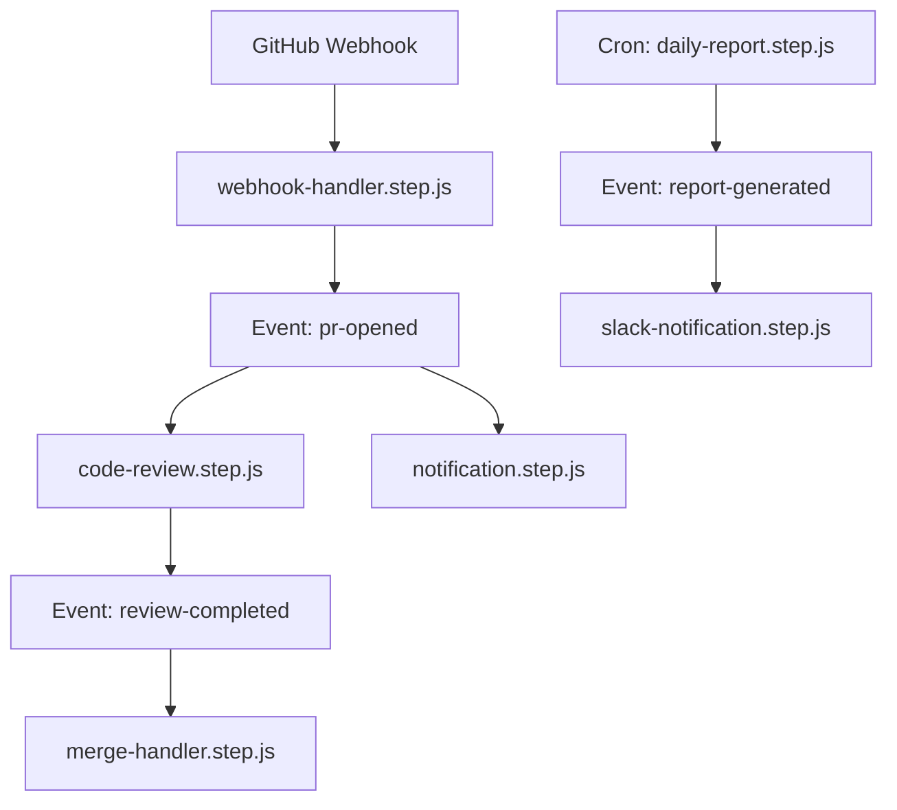
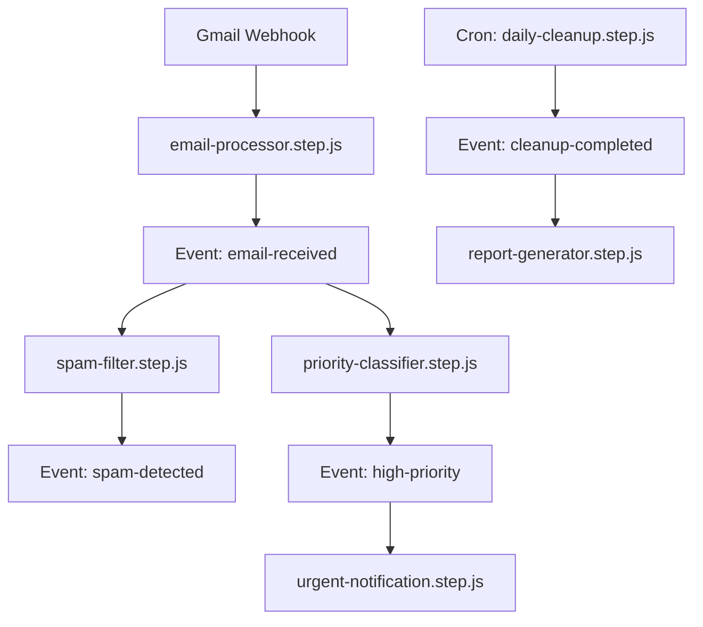

⏱️ **예상 읽기 시간**: 15분

## 서론

현대 소프트웨어 개발에서 백엔드 시스템의 복잡성은 계속해서 증가하고 있습니다. API 서버, 백그라운드 작업, 예약된 태스크, 실시간 이벤트 처리 등 다양한 컴포넌트를 관리하기 위해서는 보통 여러 프레임워크와 도구를 조합해야 합니다. 

[Motia](https://github.com/MotiaDev/motia)는 이러한 문제를 해결하기 위해 등장한 통합 백엔드 프레임워크입니다. **"Unified Backend Framework for APIs, Events, and AI Agents"**라는 슬로건으로 개발자들이 단일 프레임워크로 복잡한 이벤트 기반 워크플로우를 구축할 수 있도록 지원합니다.

이 튜토리얼에서는 Motia 프레임워크의 핵심 개념부터 실제 응용 사례까지 상세히 다루어보겠습니다.

## Motia 프레임워크란?

### 핵심 철학

Motia는 **코드 우선(Code-First)** 접근 방식을 채택한 프레임워크로, 다음과 같은 철학을 바탕으로 설계되었습니다:

- **단일 프레임워크로 모든 것을 해결**: API, 이벤트, 스케줄링을 하나의 프레임워크로 통합
- **Step 기반 아키텍처**: 모든 작업을 Step이라는 단위로 추상화
- **이벤트 기반 워크플로우**: 비동기 이벤트 처리를 통한 확장 가능한 시스템 구축
- **개발자 경험 우선**: 직관적인 API와 강력한 디버깅 도구 제공

### 주요 특징

#### 1. 제로 인프라 설정
메시지 큐나 이벤트 브로커 설정 없이 바로 이벤트 기반 시스템을 구축할 수 있습니다.

#### 2. 다국어 지원
- **JavaScript/TypeScript**: 안정적 지원
- **Python**: 안정적 지원  
- **Ruby**: 베타 지원
- **Go, Rust**: 곧 출시 예정

#### 3. 내장 관찰 가능성
실시간 로그, 트레이스, 인터랙티브 플로우 시각화를 Motia Workbench에서 제공합니다.

#### 4. 즉시 사용 가능한 API & 스케줄링
별도 설정 없이 HTTP 엔드포인트를 노출하고 cron 표현식으로 작업을 예약할 수 있습니다.

## 핵심 개념

### Step: Motia의 기본 단위

**Step**은 Motia에서 가장 중요한 개념입니다. 모든 작업은 Step으로 정의되며, 세 가지 타입이 있습니다:

#### 1. API Steps (`api`)
HTTP 요청을 처리하는 REST/GraphQL 엔드포인트를 정의합니다.

```javascript
// handler.step.js
export default async function handler(event) {
  return {
    message: "Hello from Motia!",
    timestamp: new Date().toISOString()
  };
}
```

#### 2. Event Steps (`event`)
내부 또는 외부 이벤트에 반응하여 비동기 작업을 수행합니다.

```javascript
// processor.step.js
export default async function processor(event) {
  const { data } = event;
  
  // 백그라운드 작업 수행
  await processData(data);
  
  // 다른 이벤트 발생
  await event.emit('processing-complete', { 
    result: 'success',
    processedAt: new Date()
  });
}
```

#### 3. Cron Steps (`cron`)
스케줄에 따라 자동으로 실행되는 작업을 정의합니다.

```javascript
// daily-report.step.js
export default {
  schedule: '0 9 * * *', // 매일 오전 9시
  handler: async function(event) {
    const report = await generateDailyReport();
    await event.emit('report-generated', report);
  }
};
```

### 이벤트 기반 워크플로우

Steps는 **emit**과 **subscribe**를 통해 서로 통신합니다:

```javascript
// API Step에서 이벤트 발생
await event.emit('user-registered', { userId: 123 });

// Event Step에서 이벤트 구독
// welcome-email.step.js
export default async function welcomeEmail(event) {
  if (event.topic === 'user-registered') {
    await sendWelcomeEmail(event.data.userId);
  }
}
```

### 상태 관리

모든 Steps는 통합된 키-값 저장소를 공유합니다:

```javascript
// 상태 저장
await event.state.set('user-count', 1000);

// 상태 조회
const count = await event.state.get('user-count');

// 상태 삭제
await event.state.delete('temporary-data');
```

### 실시간 스트리밍

장시간 실행되는 작업에서 실시간 업데이트를 클라이언트로 전송할 수 있습니다:

```javascript
export default async function longRunningTask(event) {
  await event.stream('progress', { status: 'started' });
  
  for (let i = 0; i < 100; i++) {
    await performStep(i);
    await event.stream('progress', { 
      status: 'processing', 
      progress: i + 1 
    });
  }
  
  await event.stream('progress', { status: 'completed' });
}
```

## 빠른 시작하기

### 1. 새 프로젝트 생성

```bash
# 대화형 설치
npx motia@latest create -i

# 프로젝트 이름과 언어 선택
```

### 2. 개발 서버 시작

```bash
# 프로젝트 폴더로 이동
cd your-project-name

# Motia Workbench 실행
npx motia dev
# ➜ http://localhost:3000
```

### 3. 첫 번째 API 테스트

```bash
# 새 터미널에서
curl http://localhost:3000/default

# 응답 확인
{"message":"Hello World from Motia!"}
```

### 4. Workbench 탐색

브라우저에서 `http://localhost:3000`에 접속하면 Motia Workbench를 확인할 수 있습니다:

- **🌊 Flows**: Steps 간 연결 관계 시각화
- **🔌 Endpoints**: API 테스트 및 실시간 결과 확인
- **👁️ Traces**: 모든 실행의 end-to-end 추적
- **📊 Logs**: 구조화된 로그 그룹화
- **🏪 State**: 키-값 저장소 검사

## 실제 응용 사례 분석

### GitHub Integration Workflow

GitHub와의 통합을 통한 자동화 워크플로우를 구축해보겠습니다.

#### 아키텍처 설계



#### 구현 예시

**1. GitHub 웹훅 처리**

```javascript
// webhook-handler.step.js
export default async function handleGitHubWebhook(event) {
  const { action, pull_request } = event.body;
  
  if (action === 'opened') {
    await event.emit('pr-opened', {
      prNumber: pull_request.number,
      repository: pull_request.base.repo.full_name,
      author: pull_request.user.login,
      title: pull_request.title
    });
  }
  
  return { status: 'processed' };
}
```

**2. 자동 코드 리뷰**

```javascript
// code-review.step.js
export default async function autoCodeReview(event) {
  if (event.topic !== 'pr-opened') return;
  
  const { prNumber, repository } = event.data;
  
  // GitHub API를 통해 PR 정보 가져오기
  const prDiff = await fetchPRDiff(repository, prNumber);
  
  // AI 기반 코드 리뷰 수행
  const reviewComments = await performAIReview(prDiff);
  
  // GitHub에 리뷰 코멘트 작성
  await postReviewComments(repository, prNumber, reviewComments);
  
  // 리뷰 완료 이벤트 발생
  await event.emit('review-completed', {
    prNumber,
    repository,
    reviewScore: reviewComments.score
  });
}
```

**3. 알림 시스템**

```javascript
// notification.step.js
export default async function sendNotification(event) {
  const notificationMap = {
    'pr-opened': 'PR이 열렸습니다',
    'review-completed': 'AI 리뷰가 완료되었습니다',
    'pr-merged': 'PR이 병합되었습니다'
  };
  
  const message = notificationMap[event.topic];
  if (!message) return;
  
  await sendSlackNotification({
    channel: '#dev-team',
    message: `${message}: ${event.data.repository} #${event.data.prNumber}`
  });
}
```

**4. 일일 리포트 생성**

```javascript
// daily-report.step.js
export default {
  schedule: '0 9 * * *', // 매일 오전 9시
  handler: async function(event) {
    const yesterday = new Date();
    yesterday.setDate(yesterday.getDate() - 1);
    
    const stats = await event.state.get('daily-stats') || {
      prsOpened: 0,
      reviewsCompleted: 0,
      prsMerged: 0
    };
    
    await event.emit('report-generated', {
      date: yesterday.toISOString(),
      stats
    });
    
    // 통계 초기화
    await event.state.set('daily-stats', {
      prsOpened: 0,
      reviewsCompleted: 0,
      prsMerged: 0
    });
  }
};
```

### Gmail Automation Workflow

Gmail을 활용한 이메일 자동화 시스템을 구축해보겠습니다.

#### 아키텍처 설계



#### 구현 예시

**1. 이메일 처리**

```javascript
// email-processor.step.js
export default async function processEmail(event) {
  const { messageId, from, subject, body } = event.body;
  
  // 이메일 메타데이터 저장
  await event.state.set(`email:${messageId}`, {
    from,
    subject,
    receivedAt: new Date(),
    processed: false
  });
  
  // 이메일 수신 이벤트 발생
  await event.emit('email-received', {
    messageId,
    from,
    subject,
    body
  });
  
  return { status: 'queued' };
}
```

**2. 스팸 필터링**

```javascript
// spam-filter.step.js
export default async function filterSpam(event) {
  if (event.topic !== 'email-received') return;
  
  const { messageId, from, subject, body } = event.data;
  
  // AI 기반 스팸 검사
  const spamScore = await analyzeSpam(subject, body, from);
  
  if (spamScore > 0.8) {
    await event.emit('spam-detected', {
      messageId,
      from,
      spamScore
    });
    
    // Gmail에서 스팸 폴더로 이동
    await moveToSpam(messageId);
  }
}
```

**3. 우선순위 분류**

```javascript
// priority-classifier.step.js
export default async function classifyPriority(event) {
  if (event.topic !== 'email-received') return;
  
  const { messageId, from, subject, body } = event.data;
  
  // 우선순위 키워드 검사
  const urgentKeywords = ['urgent', 'asap', 'emergency', 'critical'];
  const isUrgent = urgentKeywords.some(keyword => 
    subject.toLowerCase().includes(keyword) || 
    body.toLowerCase().includes(keyword)
  );
  
  // VIP 발신자 체크
  const vipSenders = await event.state.get('vip-senders') || [];
  const isVIP = vipSenders.includes(from);
  
  if (isUrgent || isVIP) {
    await event.emit('high-priority', {
      messageId,
      from,
      subject,
      reason: isUrgent ? 'urgent-keywords' : 'vip-sender'
    });
  }
}
```

**4. 긴급 알림**

```javascript
// urgent-notification.step.js
export default async function sendUrgentNotification(event) {
  if (event.topic !== 'high-priority') return;
  
  const { from, subject, reason } = event.data;
  
  // 즉시 알림 발송
  await sendPushNotification({
    title: '긴급 이메일 수신',
    body: `From: ${from}\nSubject: ${subject}`,
    priority: 'high'
  });
  
  // Slack 알림
  await sendSlackNotification({
    channel: '#urgent-emails',
    message: `🚨 긴급 이메일 수신\n발신자: ${from}\n제목: ${subject}\n사유: ${reason}`
  });
}
```

**5. 일일 정리**

```javascript
// daily-cleanup.step.js
export default {
  schedule: '0 23 * * *', // 매일 오후 11시
  handler: async function(event) {
    const today = new Date();
    const todayStr = today.toISOString().split('T')[0];
    
    // 오늘 처리된 이메일 통계
    const emailStats = await generateEmailStats(todayStr);
    
    // 스팸 메일 영구 삭제
    await permanentlyDeleteSpam(7); // 7일 이상 된 스팸 삭제
    
    await event.emit('cleanup-completed', {
      date: todayStr,
      stats: emailStats
    });
  }
};
```

## 고급 패턴 및 최적화

### 1. 에러 처리 및 재시도

```javascript
// resilient-processor.step.js
export default async function resilientProcessor(event) {
  const maxRetries = 3;
  let attempt = 0;
  
  while (attempt < maxRetries) {
    try {
      const result = await processData(event.data);
      return result;
    } catch (error) {
      attempt++;
      
      if (attempt === maxRetries) {
        await event.emit('processing-failed', {
          data: event.data,
          error: error.message,
          attempts: attempt
        });
        throw error;
      }
      
      // 지수 백오프
      await sleep(Math.pow(2, attempt) * 1000);
    }
  }
}
```

### 2. 상태 기반 워크플로우

```javascript
// state-machine.step.js
export default async function stateMachine(event) {
  const { orderId } = event.data;
  const currentState = await event.state.get(`order:${orderId}:state`) || 'pending';
  
  const transitions = {
    'pending': async () => {
      await processPayment(orderId);
      await event.state.set(`order:${orderId}:state`, 'paid');
      await event.emit('order-paid', { orderId });
    },
    'paid': async () => {
      await prepareShipment(orderId);
      await event.state.set(`order:${orderId}:state`, 'shipped');
      await event.emit('order-shipped', { orderId });
    },
    'shipped': async () => {
      await confirmDelivery(orderId);
      await event.state.set(`order:${orderId}:state`, 'delivered');
      await event.emit('order-delivered', { orderId });
    }
  };
  
  const transition = transitions[currentState];
  if (transition) {
    await transition();
  }
}
```

### 3. 배치 처리

```javascript
// batch-processor.step.js
export default async function batchProcessor(event) {
  const batchSize = 100;
  const batchKey = 'pending-items';
  
  // 배치에 아이템 추가
  const currentBatch = await event.state.get(batchKey) || [];
  currentBatch.push(event.data);
  
  if (currentBatch.length >= batchSize) {
    // 배치 처리 실행
    await processBatch(currentBatch);
    
    // 배치 초기화
    await event.state.set(batchKey, []);
    
    await event.emit('batch-processed', {
      itemCount: currentBatch.length,
      processedAt: new Date()
    });
  } else {
    // 배치 업데이트
    await event.state.set(batchKey, currentBatch);
  }
}
```

## 실제 응용 가능한 분야

### 1. 전자상거래
- **주문 처리 워크플로우**: 결제, 재고 관리, 배송 추적
- **고객 서비스 자동화**: 문의 분류, 자동 응답, 에스컬레이션
- **마케팅 자동화**: 개인화된 캠페인, 이탈 고객 재참여

### 2. 금융 서비스
- **거래 모니터링**: 실시간 사기 탐지, 위험 분석
- **컴플라이언스 자동화**: 규정 준수 체크, 리포트 생성
- **고객 온보딩**: KYC 프로세스, 계좌 개설 워크플로우

### 3. 헬스케어
- **환자 관리**: 예약 시스템, 치료 이력 추적
- **임상 시험**: 데이터 수집, 분석 파이프라인
- **의료 기기 모니터링**: 실시간 데이터 수집, 알림 시스템

### 4. 콘텐츠 관리
- **미디어 처리**: 이미지/비디오 변환, 메타데이터 추출
- **콘텐츠 조정**: 자동 검열, 품질 관리
- **배포 자동화**: 멀티플랫폼 발행, 스케줄링

### 5. IoT 및 스마트 시티
- **센서 데이터 처리**: 실시간 분석, 이상 탐지
- **인프라 모니터링**: 교통, 전력, 수도 시설 관리
- **예측 유지보수**: 장비 상태 분석, 교체 스케줄링

## 성능 최적화 가이드

### 1. 메모리 관리

```javascript
// memory-efficient.step.js
export default async function memoryEfficientProcessor(event) {
  // 큰 데이터셋을 스트림으로 처리
  const stream = createReadStream(event.data.filePath);
  
  let processed = 0;
  
  for await (const chunk of stream) {
    await processChunk(chunk);
    processed++;
    
    // 진행 상황 스트리밍
    if (processed % 1000 === 0) {
      await event.stream('progress', { processed });
    }
  }
  
  return { totalProcessed: processed };
}
```

### 2. 병렬 처리

```javascript
// parallel-processor.step.js
export default async function parallelProcessor(event) {
  const { items } = event.data;
  const concurrency = 5;
  
  const results = [];
  
  for (let i = 0; i < items.length; i += concurrency) {
    const batch = items.slice(i, i + concurrency);
    const batchPromises = batch.map(item => processItem(item));
    
    const batchResults = await Promise.all(batchPromises);
    results.push(...batchResults);
    
    // 배치 완료 알림
    await event.stream('batch-complete', { 
      completed: i + batch.length,
      total: items.length 
    });
  }
  
  return { results };
}
```

### 3. 캐싱 전략

```javascript
// cached-processor.step.js
export default async function cachedProcessor(event) {
  const cacheKey = `processed:${event.data.id}`;
  
  // 캐시에서 먼저 확인
  const cached = await event.state.get(cacheKey);
  if (cached) {
    return cached;
  }
  
  // 실제 처리
  const result = await expensiveOperation(event.data);
  
  // 캐시 저장 (TTL 설정)
  await event.state.set(cacheKey, result, { ttl: 3600 }); // 1시간
  
  return result;
}
```

## 테스트 및 디버깅

### 1. 단위 테스트

```javascript
// processor.test.js
import { test, expect } from 'vitest';
import processor from './processor.step.js';

test('should process data correctly', async () => {
  const mockEvent = {
    data: { id: 1, value: 'test' },
    emit: vi.fn(),
    state: {
      get: vi.fn(),
      set: vi.fn()
    }
  };
  
  const result = await processor(mockEvent);
  
  expect(result).toEqual({ processed: true });
  expect(mockEvent.emit).toHaveBeenCalledWith('data-processed', { id: 1 });
});
```

### 2. 통합 테스트

```javascript
// integration.test.js
import { createMotiaTester } from '@motia/testing';

test('email workflow integration', async () => {
  const tester = createMotiaTester();
  
  // API 호출 시뮬레이션
  const response = await tester.callAPI('/webhook/email', {
    from: 'test@example.com',
    subject: 'Test Email'
  });
  
  expect(response.status).toBe(200);
  
  // 이벤트 발생 확인
  const events = await tester.getEmittedEvents();
  expect(events).toContain('email-received');
  
  // 상태 변경 확인
  const emailState = await tester.getState('email:123');
  expect(emailState.processed).toBe(true);
});
```

### 3. 로깅 및 모니터링

```javascript
// monitored-processor.step.js
export default async function monitoredProcessor(event) {
  const startTime = Date.now();
  
  try {
    console.log('Processing started', { 
      id: event.data.id,
      type: event.data.type 
    });
    
    const result = await processData(event.data);
    
    const duration = Date.now() - startTime;
    
    console.log('Processing completed', {
      id: event.data.id,
      duration,
      resultSize: JSON.stringify(result).length
    });
    
    return result;
    
  } catch (error) {
    console.error('Processing failed', {
      id: event.data.id,
      error: error.message,
      duration: Date.now() - startTime
    });
    
    throw error;
  }
}
```

## 배포 및 운영

### 1. 컨테이너 배포

```dockerfile
# Dockerfile
FROM node:18-alpine

WORKDIR /app

COPY package*.json ./
RUN npm ci --only=production

COPY . .

EXPOSE 3000

CMD ["npx", "motia", "start"]
```

### 2. 환경 설정

```yaml
# docker-compose.yml
version: '3.8'

services:
  motia-app:
    build: .
    ports:
      - "3000:3000"
    environment:
      - NODE_ENV=production
      - MOTIA_DB_URL=postgresql://user:password@db:5432/motia
    depends_on:
      - db
      - redis
    
  db:
    image: postgres:15
    environment:
      - POSTGRES_DB=motia
      - POSTGRES_USER=user
      - POSTGRES_PASSWORD=password
    volumes:
      - postgres_data:/var/lib/postgresql/data
  
  redis:
    image: redis:7-alpine
    volumes:
      - redis_data:/data

volumes:
  postgres_data:
  redis_data:
```

### 3. 모니터링 설정

```javascript
// monitoring.step.js
export default {
  schedule: '*/5 * * * *', // 5분마다
  handler: async function(event) {
    const metrics = {
      timestamp: new Date(),
      memoryUsage: process.memoryUsage(),
      cpuUsage: process.cpuUsage(),
      activeConnections: await getActiveConnections(),
      queueSize: await getQueueSize()
    };
    
    await event.emit('metrics-collected', metrics);
    
    // 임계값 체크
    if (metrics.memoryUsage.heapUsed > 500 * 1024 * 1024) { // 500MB
      await event.emit('high-memory-usage', metrics);
    }
  }
};
```

## 커뮤니티 및 리소스

### 공식 리소스
- **GitHub**: [https://github.com/MotiaDev/motia](https://github.com/MotiaDev/motia)
- **공식 문서**: [https://www.motia.dev/docs](https://www.motia.dev/docs)
- **Discord 커뮤니티**: Motia 개발자 커뮤니티 참여

### 추가 학습 자료
- **예제 프로젝트**: [motia-examples](https://github.com/MotiaDev/motia-examples)
- **튜토리얼**: 공식 문서의 Real-World Use Cases 섹션
- **블로그**: Motia 팀의 기술 블로그

## 결론

Motia는 현대적인 백엔드 개발의 복잡성을 해결하기 위해 설계된 강력한 프레임워크입니다. Step 기반 아키텍처와 이벤트 기반 워크플로우를 통해 복잡한 비즈니스 로직을 간단하고 직관적으로 구현할 수 있습니다.

특히 다음과 같은 경우에 Motia를 고려해보시기 바랍니다:

1. **복잡한 비즈니스 워크플로우**가 필요한 경우
2. **실시간 이벤트 처리**가 중요한 경우  
3. **API, 백그라운드 작업, 스케줄링**을 통합 관리하고 싶은 경우
4. **강력한 디버깅 및 모니터링 도구**가 필요한 경우

Motia의 생태계는 계속해서 발전하고 있으며, 커뮤니티의 활발한 참여를 통해 더욱 강력한 프레임워크로 성장할 것으로 기대됩니다.

지금 바로 Motia를 시작해보시고, 여러분만의 혁신적인 워크플로우를 구축해보세요!

---

**관련 글:**
- [Node.js 백엔드 아키텍처 설계 가이드](https://thakicloud.github.io/dev/nodejs-backend-architecture-guide/)
- [이벤트 기반 아키텍처 완벽 가이드](https://thakicloud.github.io/dev/event-driven-architecture-guide/)
- [마이크로서비스 통신 패턴 분석](https://thakicloud.github.io/dev/microservices-communication-patterns/) 