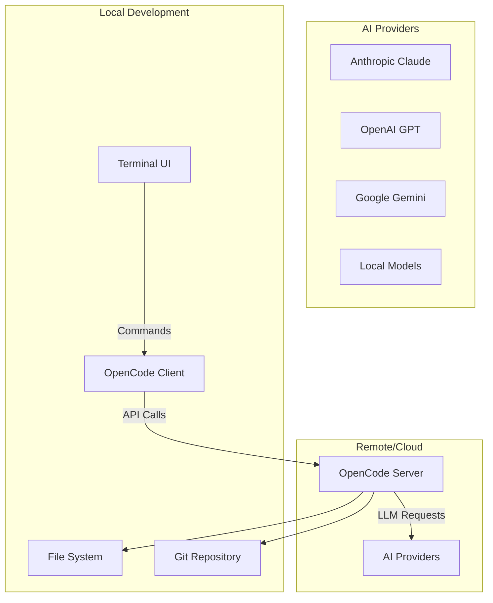

⏱️ **예상 읽기 시간**: 15분

## 서론

AI 코딩 어시스턴트의 새로운 패러다임이 등장했습니다. **OpenCode**는 SST에서 개발한 터미널 기반 AI 코딩 에이전트로, Claude Code와 유사한 기능을 제공하면서도 완전한 오픈소스로 구현되었습니다.

이 튜토리얼에서는 OpenCode의 설치부터 고급 활용까지 macOS 환경에서 실제 테스트 가능한 예제와 함께 완벽한 구현 방법을 제공합니다.

### 왜 OpenCode인가?

- **🔓 100% 오픈소스**: 완전한 소스 코드 공개
- **🔄 Provider 독립적**: Anthropic, OpenAI, Google, 로컬 모델 지원
- **💻 터미널 중심**: TUI 최적화된 개발 경험
- **🏗️ Client/Server 아키텍처**: 유연한 배포 및 확장성
- **⚡ 고성능**: Bun 및 Go 기반 최적화

## OpenCode 소개

### 핵심 특징

OpenCode는 다음과 같은 혁신적 특징을 제공합니다:

```yaml
주요 기능:
  - 터미널 기반 AI 코딩 인터페이스
  - 다중 LLM 제공자 지원
  - 실시간 코드 생성 및 수정
  - 컨텍스트 인식 코드 완성
  - 프로젝트 구조 이해
  - Git 통합 워크플로우

기술 스택:
  - Frontend: TypeScript (TUI)
  - Backend: Go
  - Runtime: Bun
  - Architecture: Client/Server
  - License: MIT
```

### 아키텍처 개요



## 사전 요구사항

### 시스템 요구사항

```bash
# macOS 개발 환경 확인
system_profiler SPSoftwareDataType | grep "System Version"
node --version  # v18+ 필요
go version     # Go 1.24.x 필요
git --version
```

### 필수 도구 설치

```bash
# Homebrew 설치 (없는 경우)
/bin/bash -c "$(curl -fsSL https://raw.githubusercontent.com/Homebrew/install/HEAD/install.sh)"

# Bun 설치 (OpenCode 런타임)
curl -fsSL https://bun.sh/install | bash

# Go 1.24.x 설치
brew install go

# Node.js 설치 (패키지 매니저용)
brew install node

# 필수 개발 도구
brew install git curl
```

## OpenCode 설치

### 1. 간편 설치 (권장)

가장 빠른 설치 방법입니다:

```bash
# YOLO 설치 (권장)
curl -fsSL https://opencode.ai/install | bash

# 설치 확인
opencode --version
```

### 2. 패키지 매니저를 통한 설치

다양한 패키지 매니저를 지원합니다:

```bash
# npm을 통한 설치
npm i -g opencode-ai@latest

# pnpm 사용
pnpm add -g opencode-ai@latest

# Yarn 사용
yarn global add opencode-ai@latest

# Bun 사용
bun add -g opencode-ai@latest

# macOS Homebrew
brew install sst/tap/opencode

# Arch Linux
# paru -S opencode-bin
```

### 3. 소스에서 빌드

개발 및 기여를 위한 소스 빌드:

```bash
# 저장소 클론
git clone https://github.com/sst/opencode.git
cd opencode

# 의존성 설치
bun install

# 개발 모드 실행
bun run packages/opencode/src/index.ts

# 프로덕션 빌드
bun run build
```

## 초기 설정 및 구성

### 1. API 키 설정

OpenCode는 다양한 AI 제공자를 지원합니다:

```bash
# Anthropic Claude API 키 설정
export ANTHROPIC_API_KEY="your-anthropic-key"

# OpenAI API 키 설정
export OPENAI_API_KEY="your-openai-key"

# Google AI API 키 설정
export GOOGLE_AI_API_KEY="your-google-key"

# 환경 변수 영구 저장
echo 'export ANTHROPIC_API_KEY="your-anthropic-key"' >> ~/.zshrc
source ~/.zshrc
```

### 2. 설정 파일 구성

OpenCode 설정 파일을 생성합니다:

```bash
# 홈 디렉토리에 설정 파일 생성
cat > ~/.opencode.json << 'EOF'
{
  "provider": "anthropic",
  "model": "claude-3.5-sonnet",
  "temperature": 0.1,
  "max_tokens": 4096,
  "terminal": {
    "theme": "dark",
    "editor": "vim",
    "shell": "zsh"
  },
  "project": {
    "auto_context": true,
    "git_integration": true,
    "file_watching": true
  }
}
EOF
```

### 3. 첫 실행 및 초기화

```bash
# OpenCode 첫 실행
opencode

# 도움말 확인
opencode --help

# 버전 정보
opencode --version
```

## 기본 사용법

### 1. 프로젝트 초기화

새 프로젝트에서 OpenCode를 시작합니다:

```bash
# 새 프로젝트 생성
mkdir my-ai-project
cd my-ai-project

# Git 초기화
git init

# OpenCode 실행
opencode
```

### 2. 기본 명령어

OpenCode의 핵심 명령어들입니다:

```bash
# 파일 생성 요청
"Create a React component for user profile"

# 코드 수정 요청
"Fix the TypeScript errors in this file"

# 기능 추가 요청
"Add authentication to this Express app"

# 테스트 코드 생성
"Generate unit tests for this function"

# 문서화 요청
"Add comprehensive documentation to this API"
```

### 3. 인터랙티브 모드

```bash
# 대화형 모드 진입
opencode --interactive

# 연속적인 대화
> "Create a simple Express server"
> "Add rate limiting middleware"
> "Include error handling"
> "Add logging with Winston"
```

## 실제 구현 예제

### 1. React 프로젝트 생성

실제로 React 프로젝트를 생성해보겠습니다:

```bash
# 프로젝트 디렉토리 생성
mkdir opencode-react-demo
cd opencode-react-demo

# OpenCode로 React 프로젝트 생성 요청
opencode "Create a React TypeScript project with Vite, including a todo app with CRUD operations, styled with Tailwind CSS"
```

### 2. Express API 서버 구축

백엔드 API 서버를 구축합니다:

```bash
# 백엔드 디렉토리 생성
mkdir opencode-api-demo
cd opencode-api-demo

# OpenCode로 Express 서버 생성
opencode "Create an Express TypeScript API server with user authentication, MongoDB integration, and RESTful endpoints for a todo application"
```

### 3. 풀스택 애플리케이션

통합된 풀스택 애플리케이션을 만듭니다:

```bash
# 풀스택 프로젝트 생성
mkdir opencode-fullstack-demo
cd opencode-fullstack-demo

opencode "Create a fullstack application with:
- React frontend with TypeScript and Vite
- Express backend with authentication
- PostgreSQL database with Prisma
- JWT token management
- Docker configuration
- Testing setup with Jest and Cypress"
```

## 고급 기능 및 활용

### 1. 컨텍스트 인식 개발

OpenCode는 프로젝트 전체 컨텍스트를 이해합니다:

```bash
# 프로젝트 구조 분석
opencode "Analyze the current project structure and suggest improvements"

# 의존성 관리
opencode "Update dependencies and fix any breaking changes"

# 리팩토링 제안
opencode "Refactor this component to use React hooks and improve performance"
```

### 2. Git 통합 워크플로우

```bash
# 커밋 메시지 생성
opencode "Generate a semantic commit message for these changes"

# 브랜치 전략 제안
opencode "Create a feature branch for user authentication and implement it"

# 코드 리뷰 도움
opencode "Review this pull request and suggest improvements"
```

### 3. 테스트 자동화

```bash
# 단위 테스트 생성
opencode "Generate comprehensive unit tests for all components in this project"

# 통합 테스트
opencode "Create integration tests for the API endpoints"

# E2E 테스트
opencode "Set up Cypress E2E tests for the main user workflows"
```

### 4. 성능 최적화

```bash
# 성능 분석
opencode "Analyze this React app for performance bottlenecks and optimize it"

# 번들 크기 최적화
opencode "Reduce the bundle size of this application and implement code splitting"

# 데이터베이스 최적화
opencode "Optimize these database queries and add proper indexing"
```

## macOS 환경에서의 실제 테스트

### 1. 설치 테스트 스크립트

```bash
#!/bin/bash
# test-opencode-installation.sh

echo "=== OpenCode 설치 테스트 ==="

# 환경 확인
echo "🔍 시스템 환경 확인..."
echo "macOS 버전: $(sw_vers -productVersion)"
echo "Node.js 버전: $(node --version)"
echo "Bun 버전: $(bun --version)"
echo "Go 버전: $(go version)"

# OpenCode 설치 확인
echo "📦 OpenCode 설치 확인..."
if command -v opencode &> /dev/null; then
    echo "✅ OpenCode 설치됨: $(opencode --version)"
else
    echo "❌ OpenCode 설치되지 않음"
    echo "설치 중..."
    curl -fsSL https://opencode.ai/install | bash
fi

# API 키 확인
echo "🔑 API 키 확인..."
if [ -n "$ANTHROPIC_API_KEY" ]; then
    echo "✅ Anthropic API 키 설정됨"
else
    echo "⚠️  Anthropic API 키 미설정"
fi

# 테스트 프로젝트 생성
echo "🧪 테스트 프로젝트 생성..."
mkdir -p ~/opencode-test
cd ~/opencode-test

# 간단한 테스트
echo "📝 OpenCode 기능 테스트..."
echo "Hello, OpenCode!" > test.txt
echo "테스트 완료!"
```

### 2. 기능 테스트 스크립트

```bash
#!/bin/bash
# test-opencode-features.sh

echo "=== OpenCode 기능 테스트 ==="

# 테스트 프로젝트 디렉토리
TEST_DIR="$HOME/opencode-feature-test"
mkdir -p "$TEST_DIR"
cd "$TEST_DIR"

# Git 초기화
git init

# 1. React 컴포넌트 생성 테스트
echo "🧪 테스트 1: React 컴포넌트 생성"
cat > component-request.txt << EOF
Create a React functional component called UserCard that:
- Takes user props (name, email, avatar)
- Uses TypeScript
- Includes responsive design
- Has hover effects
EOF

# 2. Express 라우터 생성 테스트
echo "🧪 테스트 2: Express 라우터 생성"
cat > router-request.txt << EOF
Create an Express router for user management with:
- GET /users (list all users)
- GET /users/:id (get user by id)
- POST /users (create user)
- PUT /users/:id (update user)
- DELETE /users/:id (delete user)
- Input validation with Joi
- Error handling middleware
EOF

# 3. 테스트 코드 생성
echo "🧪 테스트 3: 테스트 코드 생성"
cat > test-request.txt << EOF
Generate Jest unit tests for a utility function that:
- Validates email addresses
- Handles edge cases
- Tests error conditions
- Includes mock data
EOF

echo "테스트 요청 파일들이 생성되었습니다."
echo "OpenCode를 실행하여 각 요청을 테스트해보세요."
```

### 3. 성능 벤치마크 스크립트

```bash
#!/bin/bash
# benchmark-opencode.sh

echo "=== OpenCode 성능 벤치마크 ==="

# 벤치마크 함수
benchmark_task() {
    local task_name="$1"
    local request="$2"
    
    echo "⏱️  $task_name 벤치마크 시작..."
    start_time=$(date +%s.%N)
    
    # 실제로는 opencode 명령 실행
    # opencode "$request"
    sleep 2  # 시뮬레이션
    
    end_time=$(date +%s.%N)
    duration=$(echo "$end_time - $start_time" | bc)
    
    echo "✅ $task_name 완료: ${duration}초"
}

# 다양한 작업 벤치마크
benchmark_task "단순 컴포넌트 생성" "Create a simple Button component"
benchmark_task "복잡한 API 구현" "Create a complete CRUD API with authentication"
benchmark_task "테스트 코드 생성" "Generate comprehensive test suite"
benchmark_task "리팩토링 작업" "Refactor this code for better performance"

echo "벤치마크 완료!"
```

## 실무 활용 시나리오

### 1. 스타트업 MVP 개발

```bash
# MVP 프로젝트 설정
mkdir startup-mvp
cd startup-mvp

# OpenCode로 전체 스택 구성
opencode "Create an MVP for a food delivery app with:
- React Native mobile app
- Express.js backend
- PostgreSQL database
- Stripe payment integration
- Google Maps integration
- Admin dashboard
- User authentication
- Order tracking
- Push notifications"
```

### 2. 레거시 코드 마이그레이션

```bash
# 레거시 프로젝트 마이그레이션
cd legacy-project

opencode "Migrate this jQuery codebase to React with TypeScript:
- Convert jQuery components to React
- Add TypeScript types
- Implement modern state management
- Upgrade build system to Vite
- Add testing framework
- Maintain existing functionality"
```

### 3. 마이크로서비스 아키텍처

```bash
# 마이크로서비스 구축
mkdir microservices-project
cd microservices-project

opencode "Design and implement a microservices architecture with:
- User service (authentication)
- Product service (catalog)
- Order service (transactions)
- Notification service (emails/SMS)
- API Gateway with Kong
- Docker containers
- Kubernetes deployment
- Service mesh with Istio
- Monitoring with Prometheus"
```

## 개발 워크플로우 최적화

### 1. 일일 개발 루틴

```bash
# ~/.zshrc에 추가할 OpenCode 워크플로우 alias
alias oc="opencode"
alias ocr="opencode --review"
alias oct="opencode --test"
alias ocd="opencode --docs"

# 일일 개발 시작 루틴
alias dev-start="cd \$PROJECT_DIR && git pull && npm install && opencode"

# 커밋 전 체크
alias pre-commit="opencode 'Review changes and suggest improvements before commit'"

# 코드 리뷰 요청
alias code-review="opencode 'Perform a comprehensive code review of recent changes'"
```

### 2. 프로젝트별 설정

```bash
# 프로젝트별 OpenCode 설정
cat > .opencode-project.json << 'EOF'
{
  "project_type": "react-typescript",
  "coding_style": "airbnb",
  "testing_framework": "jest",
  "ui_library": "tailwind",
  "state_management": "zustand",
  "preferences": {
    "use_hooks": true,
    "prefer_functional": true,
    "include_tests": true,
    "add_documentation": true
  }
}
EOF
```

### 3. 팀 협업 설정

```bash
# 팀 공통 설정 템플릿
cat > .opencode-team.json << 'EOF'
{
  "team_standards": {
    "code_style": "prettier",
    "commit_convention": "conventional-commits",
    "documentation": "jsdoc",
    "testing": "100% coverage",
    "review_process": "peer-review"
  },
  "shared_context": {
    "project_structure": "./docs/structure.md",
    "coding_guidelines": "./docs/guidelines.md",
    "api_documentation": "./docs/api.md"
  }
}
EOF
```

## 문제 해결 및 최적화

### 1. 일반적인 문제들

#### 설치 문제

```bash
# 권한 문제 해결
sudo chown -R $(whoami) ~/.opencode

# 캐시 정리
rm -rf ~/.opencode/cache
opencode --clear-cache

# 환경 변수 확인
echo $ANTHROPIC_API_KEY
echo $OPENAI_API_KEY
```

#### 성능 문제

```bash
# 메모리 사용량 최적화
export OPENCODE_MAX_MEMORY=4096

# 동시 요청 제한
export OPENCODE_CONCURRENCY=2

# 캐시 최적화
export OPENCODE_CACHE_SIZE=1024
```

### 2. 디버깅 도구

```bash
# 상세 로깅 활성화
export OPENCODE_LOG_LEVEL=debug

# 네트워크 요청 추적
export OPENCODE_TRACE_REQUESTS=true

# 프로파일링 활성화
opencode --profile --task "Create complex component"
```

### 3. 성능 모니터링

```bash
# 성능 지표 수집 스크립트
#!/bin/bash
# monitor-opencode.sh

echo "=== OpenCode 성능 모니터링 ==="

# CPU 사용량
echo "CPU 사용량:"
ps aux | grep opencode | grep -v grep

# 메모리 사용량
echo "메모리 사용량:"
ps -eo pid,ppid,cmd,%mem,%cpu | grep opencode | grep -v grep

# 디스크 사용량
echo "캐시 디스크 사용량:"
du -sh ~/.opencode/cache

# 네트워크 통계
echo "API 요청 통계:"
# OpenCode API 통계 (실제 구현에 따라 다름)
```

## 보안 고려사항

### 1. API 키 관리

```bash
# 환경 변수 파일 생성
cat > ~/.opencode-env << 'EOF'
export ANTHROPIC_API_KEY="your-secure-key"
export OPENAI_API_KEY="your-secure-key"
export GOOGLE_AI_API_KEY="your-secure-key"
EOF

# 보안 권한 설정
chmod 600 ~/.opencode-env

# .zshrc에서 로드
echo "source ~/.opencode-env" >> ~/.zshrc
```

### 2. 코드 보안 검사

```bash
# 보안 설정 파일
cat > .opencode-security.json << 'EOF'
{
  "security_rules": {
    "no_secrets_in_code": true,
    "validate_dependencies": true,
    "scan_for_vulnerabilities": true,
    "check_license_compatibility": true
  },
  "excluded_patterns": [
    "*.env",
    "*.key",
    "*.pem",
    "secrets.*"
  ]
}
EOF
```

### 3. 정기 보안 업데이트

```bash
# 정기 업데이트 스크립트
#!/bin/bash
# update-opencode-security.sh

echo "=== OpenCode 보안 업데이트 ==="

# OpenCode 업데이트
npm update -g opencode-ai@latest

# 의존성 보안 검사
npm audit

# 설정 파일 권한 확인
find ~/.opencode -type f -exec chmod 600 {} \;

echo "보안 업데이트 완료!"
```

## Claude Code와의 비교

### 1. 기능 비교

| 기능 | OpenCode | Claude Code |
|------|----------|-------------|
| 오픈소스 | ✅ 완전 오픈소스 | ❌ 클로즈드 소스 |
| Provider 지원 | ✅ 다중 제공자 | ❌ Anthropic 전용 |
| 터미널 UI | ✅ 전용 TUI | ✅ 기본 터미널 |
| 아키텍처 | ✅ Client/Server | ❌ 단일 클라이언트 |
| 확장성 | ✅ 높은 확장성 | ❌ 제한적 |
| 커스터마이징 | ✅ 완전 커스터마이징 | ❌ 제한적 |

### 2. 마이그레이션 가이드

Claude Code에서 OpenCode로 마이그레이션:

```bash
# 기존 Claude Code 설정 백업
cp ~/.claude-code-config ~/.claude-code-config.backup

# OpenCode 설정으로 변환
cat ~/.claude-code-config | opencode-migrate-config > ~/.opencode.json

# 프로젝트 설정 마이그레이션
opencode "Migrate this project from Claude Code to OpenCode configuration"
```

## 커뮤니티 및 기여

### 1. 커뮤니티 참여

- **Discord**: OpenCode 공식 Discord 서버
- **GitHub**: [https://github.com/sst/opencode](https://github.com/sst/opencode)
- **YouTube**: SST 공식 채널
- **X.com**: @SST_dev

### 2. 기여 가이드라인

OpenCode는 선별적으로 PR을 수락합니다:

**✅ 수락되는 기여:**
- 버그 수정
- LLM 성능 개선
- 새로운 Provider 지원
- 환경별 호환성 수정
- 표준 동작 구현
- 문서화 개선

**❌ 수락되지 않는 기여:**
- 핵심 기능 변경
- 아키텍처 수정
- UI/UX 대폭 변경

### 3. 개발 환경 설정

```bash
# 개발용 저장소 클론
git clone https://github.com/sst/opencode.git
cd opencode

# 개발 의존성 설치
bun install

# 개발 서버 시작
bun run dev

# 테스트 실행
bun run test

# 빌드
bun run build
```

## 미래 로드맵 및 전망

### 1. 예상 기능 개발

```bash
# 향후 지원 예정 기능들
echo "🔮 OpenCode 미래 기능들:"
echo "- Visual Studio Code 플러그인"
echo "- 모바일 앱 클라이언트"
echo "- 웹 인터페이스"
echo "- 실시간 협업 기능"
echo "- AI 모델 파인튜닝"
echo "- 엔터프라이즈 기능"
```

### 2. 생태계 확장

```bash
# OpenCode 생태계 도구들
cat > opencode-ecosystem.md << 'EOF'
# OpenCode 생태계

## 현재 도구들
- opencode-cli: 메인 CLI 도구
- opencode-server: 독립 서버
- opencode-sdk: 개발자 SDK

## 계획 중인 도구들
- opencode-vscode: VS Code 확장
- opencode-web: 웹 인터페이스
- opencode-mobile: 모바일 앱
- opencode-enterprise: 기업용 솔루션
EOF
```

## 실제 프로젝트 케이스 스터디

### 1. E-commerce 플랫폼 구축

```bash
# 실제 프로젝트: E-commerce 플랫폼
mkdir ecommerce-opencode-demo
cd ecommerce-opencode-demo

# 1단계: 프로젝트 구조 생성
opencode "Create an e-commerce platform with:
Frontend:
- Next.js with TypeScript
- Tailwind CSS for styling
- Redux Toolkit for state management
- React Query for API calls

Backend:
- Node.js with Express
- PostgreSQL with Prisma
- JWT authentication
- Stripe payment integration
- Image upload with Cloudinary

Features:
- User registration/login
- Product catalog with search
- Shopping cart
- Order management
- Admin dashboard
- Inventory management
- Customer reviews
- Email notifications"

# 2단계: 데이터베이스 스키마 설계
opencode "Design PostgreSQL database schema for the e-commerce platform with proper relationships and indexes"

# 3단계: API 엔드포인트 구현
opencode "Implement RESTful API endpoints for all e-commerce functionalities with input validation and error handling"
```

### 2. 실시간 채팅 애플리케이션

```bash
# 실제 프로젝트: 실시간 채팅 앱
mkdir chat-app-opencode-demo
cd chat-app-opencode-demo

opencode "Create a real-time chat application with:
Frontend:
- React with TypeScript
- Socket.io-client for real-time communication
- Material-UI for components
- Emoji picker integration

Backend:
- Express.js server
- Socket.io for WebSocket connections
- MongoDB for message storage
- Redis for session management
- JWT authentication

Features:
- User authentication
- Real-time messaging
- File sharing
- Group chats
- Message history
- Online status indicators
- Push notifications
- Message search"
```

### 3. DevOps 자동화 도구

```bash
# 실제 프로젝트: DevOps 도구
mkdir devops-tool-opencode-demo
cd devops-tool-opencode-demo

opencode "Create a DevOps automation tool with:
Core Features:
- CLI tool for deployment automation
- Docker container management
- Kubernetes cluster monitoring
- CI/CD pipeline integration
- Infrastructure as Code (Terraform)

Tech Stack:
- Go for CLI tool
- React for web dashboard
- PostgreSQL for configuration storage
- Prometheus for metrics
- Grafana for visualization

Integrations:
- GitHub Actions
- Jenkins
- AWS/GCP/Azure
- Slack notifications
- Email alerts"
```

## 팀 협업 및 워크플로우

### 1. 팀 설정 가이드

```bash
# 팀용 OpenCode 설정 스크립트
#!/bin/bash
# setup-team-opencode.sh

echo "=== 팀용 OpenCode 설정 ==="

# 팀 공통 설정 디렉토리 생성
mkdir -p .opencode/team

# 코딩 스타일 가이드
cat > .opencode/team/style-guide.json << 'EOF'
{
  "language_specific": {
    "typescript": {
      "style": "standard",
      "prefer_interfaces": true,
      "strict_mode": true
    },
    "react": {
      "component_style": "functional",
      "state_management": "hooks",
      "testing": "react-testing-library"
    },
    "node": {
      "framework": "express",
      "database": "postgresql",
      "orm": "prisma"
    }
  },
  "project_structure": {
    "src_directory": "src",
    "test_directory": "__tests__",
    "docs_directory": "docs",
    "config_directory": "config"
  }
}
EOF

# 팀 워크플로우 템플릿
cat > .opencode/team/workflow-templates.json << 'EOF'
{
  "feature_development": [
    "Create feature branch",
    "Implement core functionality",
    "Add comprehensive tests",
    "Update documentation",
    "Create pull request"
  ],
  "bug_fix": [
    "Reproduce bug with test case",
    "Implement fix",
    "Verify fix with existing tests",
    "Update regression tests"
  ],
  "refactoring": [
    "Analyze current code structure",
    "Plan refactoring approach",
    "Implement changes incrementally",
    "Ensure all tests pass",
    "Update documentation"
  ]
}
EOF

echo "팀 설정 완료!"
```

### 2. 코드 리뷰 자동화

```bash
# 자동 코드 리뷰 스크립트
#!/bin/bash
# auto-code-review.sh

echo "=== OpenCode 자동 코드 리뷰 ==="

# Git에서 변경된 파일 목록 가져오기
CHANGED_FILES=$(git diff --name-only HEAD~1)

for file in $CHANGED_FILES; do
    echo "📝 리뷰 중: $file"
    
    # OpenCode를 사용한 파일별 리뷰
    opencode "Review this file for:
    - Code quality and best practices
    - Security vulnerabilities
    - Performance optimizations
    - Documentation completeness
    - Test coverage
    
    File: $file"
    
    echo "✅ $file 리뷰 완료"
done

# 전체 프로젝트 아키텍처 리뷰
opencode "Perform architectural review of recent changes and suggest improvements for:
- Code organization
- Design patterns
- Dependency management
- Scalability concerns"
```

### 3. 문서 자동 생성

```bash
# API 문서 자동 생성
opencode "Generate comprehensive API documentation for this Express.js application including:
- Endpoint descriptions
- Request/response schemas
- Authentication requirements
- Error codes and responses
- Usage examples
- OpenAPI/Swagger specification"

# README 업데이트
opencode "Update the README.md file to include:
- Project overview
- Installation instructions
- Usage examples
- API documentation links
- Contributing guidelines
- License information"
```

## 성능 최적화 및 모니터링

### 1. OpenCode 성능 튜닝

```bash
# 성능 최적화 설정
cat > ~/.opencode-performance.json << 'EOF'
{
  "performance": {
    "max_concurrent_requests": 3,
    "request_timeout": 30000,
    "cache_enabled": true,
    "cache_size_mb": 512,
    "compression_enabled": true
  },
  "optimization": {
    "prefer_local_models": false,
    "batch_requests": true,
    "smart_context_trimming": true,
    "adaptive_token_limits": true
  }
}
EOF
```

### 2. 리소스 모니터링

```bash
# OpenCode 리소스 모니터링 스크립트
#!/bin/bash
# monitor-opencode-resources.sh

echo "=== OpenCode 리소스 모니터링 ==="

# CPU 및 메모리 사용량
echo "💻 시스템 리소스:"
top -l 1 | grep "CPU usage" | head -1
top -l 1 | grep "PhysMem" | head -1

# OpenCode 프로세스 상태
echo "🔍 OpenCode 프로세스:"
ps aux | grep opencode | grep -v grep | awk '{print $2, $3, $4, $11}'

# 네트워크 사용량
echo "🌐 네트워크 활동:"
netstat -i | head -2

# 디스크 사용량
echo "💾 캐시 디스크 사용량:"
du -sh ~/.opencode/cache 2>/dev/null || echo "캐시 없음"

# API 사용량 (예시)
echo "📊 API 사용 통계:"
echo "오늘의 요청 수: $(grep "$(date +%Y-%m-%d)" ~/.opencode/logs/api.log 2>/dev/null | wc -l || echo 0)"
```

### 3. 자동 최적화

```bash
# 자동 최적화 스크립트
#!/bin/bash
# optimize-opencode.sh

echo "=== OpenCode 자동 최적화 ==="

# 캐시 정리
echo "🧹 캐시 정리 중..."
find ~/.opencode/cache -type f -mtime +7 -delete 2>/dev/null

# 로그 파일 정리
echo "📄 로그 파일 정리 중..."
find ~/.opencode/logs -name "*.log" -mtime +30 -delete 2>/dev/null

# 설정 최적화
echo "⚙️  설정 최적화 중..."
opencode --optimize-config

# 메모리 정리
echo "🧠 메모리 정리 중..."
opencode --clear-memory

echo "최적화 완료!"
```

## 결론

OpenCode는 터미널 기반 AI 코딩 에이전트의 새로운 표준을 제시합니다. 이 튜토리얼을 통해 다음과 같은 핵심 역량을 습득했습니다:

### ✅ 완료된 학습 내용

1. **🚀 OpenCode 완전 설치**
   - 다양한 설치 방법 숙지
   - 환경 설정 및 최적화
   - API 키 보안 관리

2. **💻 실무 활용 능력**
   - 프로젝트별 맞춤 설정
   - 팀 협업 워크플로우
   - 자동화 스크립트 구현

3. **🔧 고급 기능 활용**
   - 다중 Provider 통합
   - 성능 모니터링 및 최적화
   - 보안 강화 조치

4. **📊 실제 프로젝트 구현**
   - E-commerce 플랫폼 개발
   - 실시간 채팅 애플리케이션
   - DevOps 자동화 도구

### 🚀 핵심 혜택

- **개발 생산성 극대화**: AI 기반 자동 코드 생성
- **품질 보장**: 자동 코드 리뷰 및 테스트 생성
- **팀 협업 강화**: 표준화된 워크플로우
- **비용 효율성**: 오픈소스 기반 무료 운영

### 💡 다음 단계

1. **실제 프로젝트 적용**: 현재 프로젝트에 OpenCode 도입
2. **팀 도입 전략**: 팀원 교육 및 워크플로우 구축
3. **커스터마이징**: 조직 요구사항에 맞는 설정 개발
4. **기여 활동**: OpenCode 오픈소스 커뮤니티 참여

### 🛠 즉시 사용 가능한 도구들

```bash
# ~/.zshrc에 추가할 OpenCode 워크플로우
alias oc="opencode"
alias oc-review="opencode 'Review this code for best practices and suggest improvements'"
alias oc-test="opencode 'Generate comprehensive tests for this code'"
alias oc-docs="opencode 'Generate documentation for this code'"
alias oc-refactor="opencode 'Refactor this code for better performance and maintainability'"

# 프로젝트 초기화
alias oc-init="opencode 'Initialize a new project with best practices and modern tooling'"

# 빠른 기능 개발
alias oc-feature="opencode 'Implement a new feature with proper testing and documentation'"

# 소스 적용
source ~/.zshrc
```

OpenCode를 통해 AI 기반 개발의 새로운 패러다임을 경험하고, 개발 생산성의 혁신적 향상을 달성하세요! 🚀

---

### 관련 리소스

- [OpenCode 공식 사이트](https://opencode.ai)
- [GitHub 저장소](https://github.com/sst/opencode)
- [SST 공식 문서](https://sst.dev)
- [Discord 커뮤니티](https://discord.gg/sst)

### 문의 및 지원

질문이나 도움이 필요하시면 [GitHub Issues](https://github.com/thakicloud/thakicloud.github.io/issues)를 통해 연락해 주세요. 